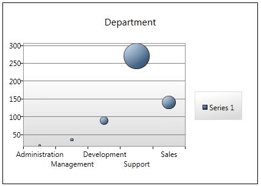
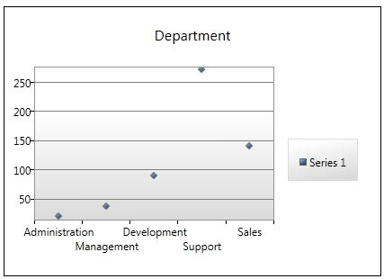

# Chart Control in WPF
## Requires
- Visual Studio 2012
## License
- Apache License, Version 2.0
## Technologies
- C#
- Windows Forms
- WPF
- WPF forms
## Topics
- Charts
- Bar Chart
- Chart Control
- Pie Chart
- Area Chart
- Line Chart
- Scatter Chart
- Column Chart
- Bubble Chart
## Updated
- 02/17/2014
## Description

<h1>Introduction</h1>

<em>Chart Control in WPF using WPF Toolkit. This Sample of Application describes how to use Chart Control in your application. There are Different Chart Controls are available in WPF Toolkit which is given below.</em>

<em>1) Area&nbsp;&nbsp;&nbsp;&nbsp;&nbsp;&nbsp;&nbsp;&nbsp;&nbsp; 2) Bar</em>

<em>3) Column&nbsp;&nbsp;&nbsp;&nbsp;&nbsp; 4) Pie</em>

<em>5) Line&nbsp;&nbsp;&nbsp;&nbsp;&nbsp;&nbsp;&nbsp;&nbsp;&nbsp; 6) Bubble</em>

<em>7) Scatter 
</em>

<h1>Building the Sample</h1>

<em>To use the chart control in your application you require WPF Toolkit in your application.</em>

<em>1) You can download WPF Tookit from the below link</em>

<em><a href="http://wpf.codeplex.com/" target="_blank">Download Here</a></em>

WPF Toolkit is free and open source.

<em>2) Add Reference in your application.</em>

<em>If you are not able to display Chart Control in Toolbox.</em>

<em>Right Click on Toolbox =&gt; Choose Item =&gt; Click on WPF Component =&gt; Select</em>

<em>1) Chart</em>

<em>2) Area Series</em>

<em>3) Bar Series</em>

<em>4) Column Series</em>

<em>5) Pie Series</em>

<em>6) Line Series</em>

<em>7) Bubble Series</em>

<em>8) Scatter Series 
</em>

Description

<em>This article presents how to use chart control in WPF using WPF Toolkit. Chart is use to display numerical data, statistical data and data virtualization in graphical format. There are five types of chart control available in WPF Toolkit. There are given
 below. </em>

<em>************************************************************************************************ 
</em>

<em>1) Column Chart</em>

<em>2) Area Chart</em>

<em>3) Bar Chart</em>

<em>4) Pie Chart and</em>

<em>5) Line Chart</em>

<em>************************************************************************************************ 
</em>

<em>This function contains some list of departments. 
</em>

C#

Edit|Remove

csharp
<pre class="hidden"> private void showChart()
        {
            List&lt;KeyValuePair&lt;string, int&gt;&gt; MyValue = new List&lt;KeyValuePair&lt;string, int&gt;&gt;();
            MyValue.Add(new KeyValuePair&lt;string, int&gt;(&quot;Administration&quot;, 20));
            MyValue.Add(new KeyValuePair&lt;string, int&gt;(&quot;Management&quot;, 36));
            MyValue.Add(new KeyValuePair&lt;string, int&gt;(&quot;Development&quot;, 89));
            MyValue.Add(new KeyValuePair&lt;string, int&gt;(&quot;Support&quot;, 270));
            MyValue.Add(new KeyValuePair&lt;string, int&gt;(&quot;Sales&quot;, 140));

            ColumnChart1.DataContext = MyValue;
            AreaChart1.DataContext = MyValue;
            LineChart1.DataContext = MyValue;
            PieChart1.DataContext = MyValue;
            BarChart1.DataContext = MyValue;
            BubbleSeries1.DataContext = MyValue;
            ScatterSeries1.DataContext = MyValue;
        }</pre>

<pre class="csharp">&nbsp;private&nbsp;void&nbsp;showChart()&nbsp;
&nbsp;&nbsp;&nbsp;&nbsp;&nbsp;&nbsp;&nbsp;&nbsp;{&nbsp;
&nbsp;&nbsp;&nbsp;&nbsp;&nbsp;&nbsp;&nbsp;&nbsp;&nbsp;&nbsp;&nbsp;&nbsp;List&lt;KeyValuePair&lt;string,&nbsp;int&gt;&gt;&nbsp;MyValue&nbsp;=&nbsp;new&nbsp;List&lt;KeyValuePair&lt;string,&nbsp;int&gt;&gt;();&nbsp;
&nbsp;&nbsp;&nbsp;&nbsp;&nbsp;&nbsp;&nbsp;&nbsp;&nbsp;&nbsp;&nbsp;&nbsp;MyValue.Add(new&nbsp;KeyValuePair&lt;string,&nbsp;int&gt;(&quot;Administration&quot;,&nbsp;20));&nbsp;
&nbsp;&nbsp;&nbsp;&nbsp;&nbsp;&nbsp;&nbsp;&nbsp;&nbsp;&nbsp;&nbsp;&nbsp;MyValue.Add(new&nbsp;KeyValuePair&lt;string,&nbsp;int&gt;(&quot;Management&quot;,&nbsp;36));&nbsp;
&nbsp;&nbsp;&nbsp;&nbsp;&nbsp;&nbsp;&nbsp;&nbsp;&nbsp;&nbsp;&nbsp;&nbsp;MyValue.Add(new&nbsp;KeyValuePair&lt;string,&nbsp;int&gt;(&quot;Development&quot;,&nbsp;89));&nbsp;
&nbsp;&nbsp;&nbsp;&nbsp;&nbsp;&nbsp;&nbsp;&nbsp;&nbsp;&nbsp;&nbsp;&nbsp;MyValue.Add(new&nbsp;KeyValuePair&lt;string,&nbsp;int&gt;(&quot;Support&quot;,&nbsp;270));&nbsp;
&nbsp;&nbsp;&nbsp;&nbsp;&nbsp;&nbsp;&nbsp;&nbsp;&nbsp;&nbsp;&nbsp;&nbsp;MyValue.Add(new&nbsp;KeyValuePair&lt;string,&nbsp;int&gt;(&quot;Sales&quot;,&nbsp;140));&nbsp;
&nbsp;
&nbsp;&nbsp;&nbsp;&nbsp;&nbsp;&nbsp;&nbsp;&nbsp;&nbsp;&nbsp;&nbsp;&nbsp;ColumnChart1.DataContext&nbsp;=&nbsp;MyValue;&nbsp;
&nbsp;&nbsp;&nbsp;&nbsp;&nbsp;&nbsp;&nbsp;&nbsp;&nbsp;&nbsp;&nbsp;&nbsp;AreaChart1.DataContext&nbsp;=&nbsp;MyValue;&nbsp;
&nbsp;&nbsp;&nbsp;&nbsp;&nbsp;&nbsp;&nbsp;&nbsp;&nbsp;&nbsp;&nbsp;&nbsp;LineChart1.DataContext&nbsp;=&nbsp;MyValue;&nbsp;
&nbsp;&nbsp;&nbsp;&nbsp;&nbsp;&nbsp;&nbsp;&nbsp;&nbsp;&nbsp;&nbsp;&nbsp;PieChart1.DataContext&nbsp;=&nbsp;MyValue;&nbsp;
&nbsp;&nbsp;&nbsp;&nbsp;&nbsp;&nbsp;&nbsp;&nbsp;&nbsp;&nbsp;&nbsp;&nbsp;BarChart1.DataContext&nbsp;=&nbsp;MyValue;&nbsp;
&nbsp;&nbsp;&nbsp;&nbsp;&nbsp;&nbsp;&nbsp;&nbsp;&nbsp;&nbsp;&nbsp;&nbsp;BubbleSeries1.DataContext&nbsp;=&nbsp;MyValue;&nbsp;
&nbsp;&nbsp;&nbsp;&nbsp;&nbsp;&nbsp;&nbsp;&nbsp;&nbsp;&nbsp;&nbsp;&nbsp;ScatterSeries1.DataContext&nbsp;=&nbsp;MyValue;&nbsp;
&nbsp;&nbsp;&nbsp;&nbsp;&nbsp;&nbsp;&nbsp;&nbsp;}</pre>

<h3>1) Column Chart</h3>

XAML

Edit|Remove

xaml
<pre class="hidden">&lt;chartingToolkit:Chart Height=&quot;262&quot; HorizontalAlignment=&quot;Left&quot; 
            Margin=&quot;33,0,0,620&quot; Name=&quot;ColumnChart1&quot; Title=&quot;Total Marks&quot;
            VerticalAlignment=&quot;Bottom&quot; Width=&quot;380&quot;&gt;
                &lt;chartingToolkit:ColumnSeries DependentValuePath=&quot;Value&quot;  IndependentValuePath=&quot;Key&quot; ItemsSource=&quot;{Binding}&quot;
            IsSelectionEnabled=&quot;True&quot;&gt;&lt;/chartingToolkit:ColumnSeries&gt;
            &lt;/chartingToolkit:Chart&gt;</pre>

<pre class="xaml">&lt;chartingToolkit:Chart&nbsp;Height=&quot;262&quot;HorizontalAlignment=&quot;Left&quot;Margin=&quot;33,0,0,620&quot;Name=&quot;ColumnChart1&quot;Title=&quot;Total&nbsp;Marks&quot;VerticalAlignment=&quot;Bottom&quot;Width=&quot;380&quot;&gt;&nbsp;
&lt;chartingToolkit:ColumnSeries&nbsp;DependentValuePath=&quot;Value&quot;IndependentValuePath=&quot;Key&quot;ItemsSource=&quot;{Binding}&quot;IsSelectionEnabled=&quot;True&quot;&gt;&lt;/chartingToolkit:ColumnSeries&gt;&lt;/chartingToolkit:Chart&gt;</pre>

<h3>2) Area Chart</h3>

XAML

Edit|Remove

xaml
<pre class="hidden">&lt;chartingToolkit:Chart  Name=&quot;AreaChart1&quot; Title=&quot;Department&quot; Margin=&quot;828,39,0,629&quot; HorizontalAlignment=&quot;Left&quot; Width=&quot;378&quot;&gt;
                &lt;chartingToolkit:AreaSeries DependentValuePath=&quot;Value&quot;
          IndependentValuePath=&quot;Key&quot; ItemsSource=&quot;{Binding}&quot;
            IsSelectionEnabled=&quot;True&quot;/&gt;
            &lt;/chartingToolkit:Chart&gt;</pre>

<pre class="xaml">&lt;chartingToolkit:Chart&nbsp;&nbsp;Name=&quot;AreaChart1&quot;Title=&quot;Department&quot;Margin=&quot;828,39,0,629&quot;HorizontalAlignment=&quot;Left&quot;Width=&quot;378&quot;&gt;&nbsp;
&lt;chartingToolkit:AreaSeries&nbsp;DependentValuePath=&quot;Value&quot;IndependentValuePath=&quot;Key&quot;ItemsSource=&quot;{Binding}&quot;IsSelectionEnabled=&quot;True&quot;/&gt;&lt;/chartingToolkit:Chart&gt;</pre>

<h3>3) Bar Chart</h3>

XAML

Edit|Remove

xaml
<pre class="hidden">&lt;chartingToolkit:Chart  Name=&quot;BarChart1&quot; Title=&quot;Department&quot; Margin=&quot;547,307,19,358&quot; Width=&quot;450&quot;&gt;
                &lt;chartingToolkit:BarSeries  DependentValuePath=&quot;Value&quot;
            IndependentValuePath=&quot;Key&quot; ItemsSource=&quot;{Binding}&quot;
            IsSelectionEnabled=&quot;True&quot;/&gt;
            &lt;/chartingToolkit:Chart&gt;</pre>

<pre class="xaml">&lt;chartingToolkit:Chart&nbsp;&nbsp;Name=&quot;BarChart1&quot;Title=&quot;Department&quot;Margin=&quot;547,307,19,358&quot;Width=&quot;450&quot;&gt;&nbsp;
&lt;chartingToolkit:BarSeries&nbsp;&nbsp;DependentValuePath=&quot;Value&quot;IndependentValuePath=&quot;Key&quot;ItemsSource=&quot;{Binding}&quot;IsSelectionEnabled=&quot;True&quot;/&gt;&lt;/chartingToolkit:Chart&gt;</pre>

<h3>4) Pie Chart</h3>

XAML

Edit|Remove

xaml
<pre class="hidden"> &lt;chartingToolkit:Chart  Name=&quot;PieChart1&quot; Title=&quot;Department&quot; Width=&quot;380&quot;
            VerticalAlignment=&quot;Top&quot; Margin=&quot;428,39,0,0&quot; Height=&quot;262&quot; HorizontalAlignment=&quot;Left&quot;&gt;
                &lt;chartingToolkit:PieSeries DependentValuePath=&quot;Value&quot;
            IndependentValuePath=&quot;Key&quot; ItemsSource=&quot;{Binding}&quot;
            IsSelectionEnabled=&quot;True&quot; /&gt;
            &lt;/chartingToolkit:Chart&gt;</pre>

<pre class="xaml">&lt;chartingToolkit:Chart&nbsp;&nbsp;Name=&quot;PieChart1&quot;Title=&quot;Department&quot;Width=&quot;380&quot;VerticalAlignment=&quot;Top&quot;Margin=&quot;428,39,0,0&quot;Height=&quot;262&quot;HorizontalAlignment=&quot;Left&quot;&gt;&nbsp;
&lt;chartingToolkit:PieSeries&nbsp;DependentValuePath=&quot;Value&quot;IndependentValuePath=&quot;Key&quot;ItemsSource=&quot;{Binding}&quot;IsSelectionEnabled=&quot;True&quot;/&gt;&lt;/chartingToolkit:Chart&gt;</pre>

<h3>5) Line Chart</h3>

XAML

Edit|Remove

xaml
<pre class="hidden">&lt;chartingToolkit:Chart  Name=&quot;LineChart1&quot; Title=&quot;Department&quot; Width=&quot;450&quot; Margin=&quot;33,309,533,358&quot;&gt;
                &lt;chartingToolkit:LineSeries  DependentValuePath=&quot;Value&quot;
            IndependentValuePath=&quot;Key&quot; ItemsSource=&quot;{Binding}&quot;
            IsSelectionEnabled=&quot;True&quot;/&gt;
            &lt;/chartingToolkit:Chart&gt;</pre>

<pre class="xaml">&lt;chartingToolkit:Chart&nbsp;&nbsp;Name=&quot;LineChart1&quot;&nbsp;Title=&quot;Department&quot;&nbsp;Width=&quot;450&quot;&nbsp;Margin=&quot;33,309,533,358&quot;&gt;&nbsp;
&nbsp;&nbsp;&nbsp;&nbsp;&nbsp;&nbsp;&nbsp;&nbsp;&nbsp;&nbsp;&nbsp;&nbsp;&nbsp;&nbsp;&nbsp;&nbsp;&lt;chartingToolkit:LineSeries&nbsp;&nbsp;DependentValuePath=&quot;Value&quot;&nbsp;
&nbsp;&nbsp;&nbsp;&nbsp;&nbsp;&nbsp;&nbsp;&nbsp;&nbsp;&nbsp;&nbsp;&nbsp;IndependentValuePath=&quot;Key&quot;&nbsp;ItemsSource=&quot;{Binding}&quot;&nbsp;
&nbsp;&nbsp;&nbsp;&nbsp;&nbsp;&nbsp;&nbsp;&nbsp;&nbsp;&nbsp;&nbsp;&nbsp;IsSelectionEnabled=&quot;True&quot;/&gt;&nbsp;
&nbsp;&nbsp;&nbsp;&nbsp;&nbsp;&nbsp;&nbsp;&nbsp;&nbsp;&nbsp;&nbsp;&nbsp;&lt;/chartingToolkit:Chart&gt;</pre>

<h3>6) Bubble Chart</h3>

&nbsp;

XAML

Edit|Remove

xaml
<pre class="hidden">&lt;chartingToolkit:Chart Name=&quot;BubbleSeries1&quot; Title=&quot;Department&quot; Width=&quot;420&quot; Height=&quot;300&quot; Margin=&quot;573,570,302,51&quot;&gt;
                &lt;chartingToolkit:BubbleSeries IndependentValuePath=&quot;Key&quot; DependentValuePath=&quot;Value&quot; IsSelectionEnabled=&quot;True&quot; ItemsSource=&quot;{Binding}&quot;&gt;&lt;/chartingToolkit:BubbleSeries&gt;
            &lt;/chartingToolkit:Chart&gt;</pre>

<pre class="xaml">&lt;chartingToolkit:Chart&nbsp;Name=&quot;BubbleSeries1&quot;Title=&quot;Department&quot;Width=&quot;420&quot;Height=&quot;300&quot;Margin=&quot;573,570,302,51&quot;&gt;&nbsp;
&lt;chartingToolkit:BubbleSeries&nbsp;IndependentValuePath=&quot;Key&quot;DependentValuePath=&quot;Value&quot;IsSelectionEnabled=&quot;True&quot;ItemsSource=&quot;{Binding}&quot;&gt;&lt;/chartingToolkit:BubbleSeries&gt;&lt;/chartingToolkit:Chart&gt;</pre>

&nbsp;

<h3>7) Scatter Chart</h3>

&nbsp;

XAML

Edit|Remove

xaml
<pre class="hidden">&lt;chartingToolkit:Chart Name=&quot;ScatterSeries1&quot; Title=&quot;Department&quot; Width=&quot;420&quot; Height=&quot;300&quot; Margin=&quot;138,570,737,51&quot;&gt;
                    &lt;chartingToolkit:ScatterSeries IndependentValuePath=&quot;Key&quot; DependentValuePath=&quot;Value&quot; IsSelectionEnabled=&quot;True&quot; ItemsSource=&quot;{Binding}&quot;&gt;&lt;/chartingToolkit:ScatterSeries&gt;
                &lt;/chartingToolkit:Chart&gt;</pre>

<pre class="xaml">&lt;chartingToolkit:Chart&nbsp;Name=&quot;ScatterSeries1&quot;&nbsp;Title=&quot;Department&quot;&nbsp;Width=&quot;420&quot;&nbsp;Height=&quot;300&quot;&nbsp;Margin=&quot;138,570,737,51&quot;&gt;&nbsp;
&nbsp;&nbsp;&nbsp;&nbsp;&nbsp;&nbsp;&nbsp;&nbsp;&nbsp;&nbsp;&nbsp;&nbsp;&nbsp;&nbsp;&nbsp;&nbsp;&nbsp;&nbsp;&nbsp;&nbsp;&lt;chartingToolkit:ScatterSeries&nbsp;IndependentValuePath=&quot;Key&quot;&nbsp;DependentValuePath=&quot;Value&quot;&nbsp;IsSelectionEnabled=&quot;True&quot;&nbsp;ItemsSource=&quot;{Binding}&quot;&gt;&lt;/chartingToolkit:ScatterSeries&gt;&nbsp;
&nbsp;&nbsp;&nbsp;&nbsp;&nbsp;&nbsp;&nbsp;&nbsp;&nbsp;&nbsp;&nbsp;&nbsp;&nbsp;&nbsp;&nbsp;&nbsp;&lt;/chartingToolkit:Chart&gt;</pre>

&nbsp;

<h1>Source Code Files</h1>
<ul>
<li><em>source code file name #1 - summary for this source code file.</em> </li><li><em><em>source code file name #2 - summary for this source code file.</em></em>
</li></ul>
<h1>More Information</h1>

<em>For more information on X, see ...?</em>

