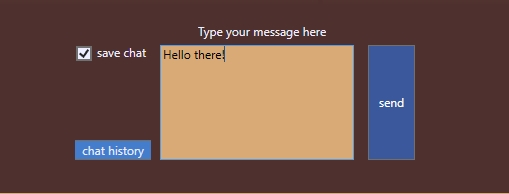

# Chat Application using sockets in C#
## Requires
- Visual Studio 2012
## License
- MIT
## Technologies
- Visual Studio 2012
## Topics
- Socket communication chat app in c#
## Updated
- 06/16/2017
## Description

<h1>Introduction</h1>

<em>Chat in a work or home environment using duo chat app created entirely in c#</em>

<h1>Building the Sample</h1>

<em>The program needs to run as admin to save chat log to hard drive if the 'save chat' checkbox is checked</em>

Description

By default you are logged out and need to click the login button to be able to configure the app for connection. You can customize who can use the app while editing the code.

<em>On the program load; it fetches the ipaddress of your computer and populates the 'myIP' textbox which is then used to create a socket connection after clicking the connect button</em>

<em><em>The program parses the text in the 'myIP' textbox for your ipaddress and the text in 'uIp' for your friends ipaddress</em></em>

<em> 
</em>

<em>Type a port not currently in use in the 'myPort' field and in the 'uPort' field type a port to use to connect to your friend which has to not be in use on your friends computer</em>

<em>Click the connect button to establish connection through the ipaddress and port provided 
</em>

<em>Once connection is established the send button becomes enabled</em>

&nbsp;

C#

Edit|Remove

csharp
<pre class="hidden">private void btnStart_Click(object sender, RoutedEventArgs e)
        {
            try
            {
                if (epLocal == null &amp;&amp; epRemote == null)
                {
                    if (txtFriendsPort.Text != &quot;&quot; &amp;&amp; txtLocalPort.Text != &quot;&quot;)
                    {
                        // bind socket                        
                        epLocal = new IPEndPoint(IPAddress.Parse(txtLocalIp.Text), Convert.ToInt32(txtLocalPort.Text));
                        sckCommunication.Bind(epLocal);

                        // connect to remote ip and port
                        epRemote = new IPEndPoint(IPAddress.Parse(txtFriendsIp.Text), Convert.ToInt32(txtFriendsPort.Text));
                        sckCommunication.Connect(epRemote);

                        // starts to listen to an specific port
                        buffer = new byte[1464];
                        sckCommunication.BeginReceiveFrom(buffer, 0, buffer.Length, SocketFlags.None, ref epRemote, new AsyncCallback(OperatorCallBack), buffer);

                        // release button to send message
                        btnSend.IsEnabled = true;

                        status.Text = &quot;Connected&quot;;
                    }
                    else
                    {
                        status.Text = &quot;Port input cannot be Empty&quot;;
                    }
                }
                else
                {
                    status.Text = &quot;You are already Connected&quot;;
                    btnSend.IsEnabled = true;
                }
            }
            catch (Exception ex)
            {
                MessageBox.Show(ex.Message);
            }</pre>

<pre class="csharp">private&nbsp;void&nbsp;btnStart_Click(object&nbsp;sender,&nbsp;RoutedEventArgs&nbsp;e)&nbsp;
&nbsp;&nbsp;&nbsp;&nbsp;&nbsp;&nbsp;&nbsp;&nbsp;{&nbsp;
&nbsp;&nbsp;&nbsp;&nbsp;&nbsp;&nbsp;&nbsp;&nbsp;&nbsp;&nbsp;&nbsp;&nbsp;try&nbsp;
&nbsp;&nbsp;&nbsp;&nbsp;&nbsp;&nbsp;&nbsp;&nbsp;&nbsp;&nbsp;&nbsp;&nbsp;{&nbsp;
&nbsp;&nbsp;&nbsp;&nbsp;&nbsp;&nbsp;&nbsp;&nbsp;&nbsp;&nbsp;&nbsp;&nbsp;&nbsp;&nbsp;&nbsp;&nbsp;if&nbsp;(epLocal&nbsp;==&nbsp;null&nbsp;&amp;&amp;&nbsp;epRemote&nbsp;==&nbsp;null)&nbsp;
&nbsp;&nbsp;&nbsp;&nbsp;&nbsp;&nbsp;&nbsp;&nbsp;&nbsp;&nbsp;&nbsp;&nbsp;&nbsp;&nbsp;&nbsp;&nbsp;{&nbsp;
&nbsp;&nbsp;&nbsp;&nbsp;&nbsp;&nbsp;&nbsp;&nbsp;&nbsp;&nbsp;&nbsp;&nbsp;&nbsp;&nbsp;&nbsp;&nbsp;&nbsp;&nbsp;&nbsp;&nbsp;if&nbsp;(txtFriendsPort.Text&nbsp;!=&nbsp;&quot;&quot;&nbsp;&amp;&amp;&nbsp;txtLocalPort.Text&nbsp;!=&nbsp;&quot;&quot;)&nbsp;
&nbsp;&nbsp;&nbsp;&nbsp;&nbsp;&nbsp;&nbsp;&nbsp;&nbsp;&nbsp;&nbsp;&nbsp;&nbsp;&nbsp;&nbsp;&nbsp;&nbsp;&nbsp;&nbsp;&nbsp;{&nbsp;
&nbsp;&nbsp;&nbsp;&nbsp;&nbsp;&nbsp;&nbsp;&nbsp;&nbsp;&nbsp;&nbsp;&nbsp;&nbsp;&nbsp;&nbsp;&nbsp;&nbsp;&nbsp;&nbsp;&nbsp;&nbsp;&nbsp;&nbsp;&nbsp;//&nbsp;bind&nbsp;socket&nbsp;&nbsp;&nbsp;&nbsp;&nbsp;&nbsp;&nbsp;&nbsp;&nbsp;&nbsp;&nbsp;&nbsp;&nbsp;&nbsp;&nbsp;&nbsp;&nbsp;&nbsp;&nbsp;&nbsp;&nbsp;&nbsp;&nbsp;&nbsp;&nbsp;
&nbsp;&nbsp;&nbsp;&nbsp;&nbsp;&nbsp;&nbsp;&nbsp;&nbsp;&nbsp;&nbsp;&nbsp;&nbsp;&nbsp;&nbsp;&nbsp;&nbsp;&nbsp;&nbsp;&nbsp;&nbsp;&nbsp;&nbsp;&nbsp;epLocal&nbsp;=&nbsp;new&nbsp;IPEndPoint(IPAddress.Parse(txtLocalIp.Text),&nbsp;Convert.ToInt32(txtLocalPort.Text));&nbsp;
&nbsp;&nbsp;&nbsp;&nbsp;&nbsp;&nbsp;&nbsp;&nbsp;&nbsp;&nbsp;&nbsp;&nbsp;&nbsp;&nbsp;&nbsp;&nbsp;&nbsp;&nbsp;&nbsp;&nbsp;&nbsp;&nbsp;&nbsp;&nbsp;sckCommunication.Bind(epLocal);&nbsp;
&nbsp;
&nbsp;&nbsp;&nbsp;&nbsp;&nbsp;&nbsp;&nbsp;&nbsp;&nbsp;&nbsp;&nbsp;&nbsp;&nbsp;&nbsp;&nbsp;&nbsp;&nbsp;&nbsp;&nbsp;&nbsp;&nbsp;&nbsp;&nbsp;&nbsp;//&nbsp;connect&nbsp;to&nbsp;remote&nbsp;ip&nbsp;and&nbsp;port&nbsp;
&nbsp;&nbsp;&nbsp;&nbsp;&nbsp;&nbsp;&nbsp;&nbsp;&nbsp;&nbsp;&nbsp;&nbsp;&nbsp;&nbsp;&nbsp;&nbsp;&nbsp;&nbsp;&nbsp;&nbsp;&nbsp;&nbsp;&nbsp;&nbsp;epRemote&nbsp;=&nbsp;new&nbsp;IPEndPoint(IPAddress.Parse(txtFriendsIp.Text),&nbsp;Convert.ToInt32(txtFriendsPort.Text));&nbsp;
&nbsp;&nbsp;&nbsp;&nbsp;&nbsp;&nbsp;&nbsp;&nbsp;&nbsp;&nbsp;&nbsp;&nbsp;&nbsp;&nbsp;&nbsp;&nbsp;&nbsp;&nbsp;&nbsp;&nbsp;&nbsp;&nbsp;&nbsp;&nbsp;sckCommunication.Connect(epRemote);&nbsp;
&nbsp;
&nbsp;&nbsp;&nbsp;&nbsp;&nbsp;&nbsp;&nbsp;&nbsp;&nbsp;&nbsp;&nbsp;&nbsp;&nbsp;&nbsp;&nbsp;&nbsp;&nbsp;&nbsp;&nbsp;&nbsp;&nbsp;&nbsp;&nbsp;&nbsp;//&nbsp;starts&nbsp;to&nbsp;listen&nbsp;to&nbsp;an&nbsp;specific&nbsp;port&nbsp;
&nbsp;&nbsp;&nbsp;&nbsp;&nbsp;&nbsp;&nbsp;&nbsp;&nbsp;&nbsp;&nbsp;&nbsp;&nbsp;&nbsp;&nbsp;&nbsp;&nbsp;&nbsp;&nbsp;&nbsp;&nbsp;&nbsp;&nbsp;&nbsp;buffer&nbsp;=&nbsp;new&nbsp;byte[1464];&nbsp;
&nbsp;&nbsp;&nbsp;&nbsp;&nbsp;&nbsp;&nbsp;&nbsp;&nbsp;&nbsp;&nbsp;&nbsp;&nbsp;&nbsp;&nbsp;&nbsp;&nbsp;&nbsp;&nbsp;&nbsp;&nbsp;&nbsp;&nbsp;&nbsp;sckCommunication.BeginReceiveFrom(buffer,&nbsp;0,&nbsp;buffer.Length,&nbsp;SocketFlags.None,&nbsp;ref&nbsp;epRemote,&nbsp;new&nbsp;AsyncCallback(OperatorCallBack),&nbsp;buffer);&nbsp;
&nbsp;
&nbsp;&nbsp;&nbsp;&nbsp;&nbsp;&nbsp;&nbsp;&nbsp;&nbsp;&nbsp;&nbsp;&nbsp;&nbsp;&nbsp;&nbsp;&nbsp;&nbsp;&nbsp;&nbsp;&nbsp;&nbsp;&nbsp;&nbsp;&nbsp;//&nbsp;release&nbsp;button&nbsp;to&nbsp;send&nbsp;message&nbsp;
&nbsp;&nbsp;&nbsp;&nbsp;&nbsp;&nbsp;&nbsp;&nbsp;&nbsp;&nbsp;&nbsp;&nbsp;&nbsp;&nbsp;&nbsp;&nbsp;&nbsp;&nbsp;&nbsp;&nbsp;&nbsp;&nbsp;&nbsp;&nbsp;btnSend.IsEnabled&nbsp;=&nbsp;true;&nbsp;
&nbsp;
&nbsp;&nbsp;&nbsp;&nbsp;&nbsp;&nbsp;&nbsp;&nbsp;&nbsp;&nbsp;&nbsp;&nbsp;&nbsp;&nbsp;&nbsp;&nbsp;&nbsp;&nbsp;&nbsp;&nbsp;&nbsp;&nbsp;&nbsp;&nbsp;status.Text&nbsp;=&nbsp;&quot;Connected&quot;;&nbsp;
&nbsp;&nbsp;&nbsp;&nbsp;&nbsp;&nbsp;&nbsp;&nbsp;&nbsp;&nbsp;&nbsp;&nbsp;&nbsp;&nbsp;&nbsp;&nbsp;&nbsp;&nbsp;&nbsp;&nbsp;}&nbsp;
&nbsp;&nbsp;&nbsp;&nbsp;&nbsp;&nbsp;&nbsp;&nbsp;&nbsp;&nbsp;&nbsp;&nbsp;&nbsp;&nbsp;&nbsp;&nbsp;&nbsp;&nbsp;&nbsp;&nbsp;else&nbsp;
&nbsp;&nbsp;&nbsp;&nbsp;&nbsp;&nbsp;&nbsp;&nbsp;&nbsp;&nbsp;&nbsp;&nbsp;&nbsp;&nbsp;&nbsp;&nbsp;&nbsp;&nbsp;&nbsp;&nbsp;{&nbsp;
&nbsp;&nbsp;&nbsp;&nbsp;&nbsp;&nbsp;&nbsp;&nbsp;&nbsp;&nbsp;&nbsp;&nbsp;&nbsp;&nbsp;&nbsp;&nbsp;&nbsp;&nbsp;&nbsp;&nbsp;&nbsp;&nbsp;&nbsp;&nbsp;status.Text&nbsp;=&nbsp;&quot;Port&nbsp;input&nbsp;cannot&nbsp;be&nbsp;Empty&quot;;&nbsp;
&nbsp;&nbsp;&nbsp;&nbsp;&nbsp;&nbsp;&nbsp;&nbsp;&nbsp;&nbsp;&nbsp;&nbsp;&nbsp;&nbsp;&nbsp;&nbsp;&nbsp;&nbsp;&nbsp;&nbsp;}&nbsp;
&nbsp;&nbsp;&nbsp;&nbsp;&nbsp;&nbsp;&nbsp;&nbsp;&nbsp;&nbsp;&nbsp;&nbsp;&nbsp;&nbsp;&nbsp;&nbsp;}&nbsp;
&nbsp;&nbsp;&nbsp;&nbsp;&nbsp;&nbsp;&nbsp;&nbsp;&nbsp;&nbsp;&nbsp;&nbsp;&nbsp;&nbsp;&nbsp;&nbsp;else&nbsp;
&nbsp;&nbsp;&nbsp;&nbsp;&nbsp;&nbsp;&nbsp;&nbsp;&nbsp;&nbsp;&nbsp;&nbsp;&nbsp;&nbsp;&nbsp;&nbsp;{&nbsp;
&nbsp;&nbsp;&nbsp;&nbsp;&nbsp;&nbsp;&nbsp;&nbsp;&nbsp;&nbsp;&nbsp;&nbsp;&nbsp;&nbsp;&nbsp;&nbsp;&nbsp;&nbsp;&nbsp;&nbsp;status.Text&nbsp;=&nbsp;&quot;You&nbsp;are&nbsp;already&nbsp;Connected&quot;;&nbsp;

&nbsp;&nbsp;&nbsp;&nbsp;&nbsp;&nbsp;&nbsp;&nbsp;&nbsp;&nbsp;&nbsp;&nbsp;&nbsp;&nbsp;&nbsp; }&nbsp;
&nbsp;&nbsp;&nbsp;&nbsp;&nbsp;&nbsp;&nbsp;&nbsp;&nbsp;&nbsp;&nbsp;&nbsp;}&nbsp;
&nbsp;&nbsp;&nbsp;&nbsp;&nbsp;&nbsp;&nbsp;&nbsp;&nbsp;&nbsp;&nbsp;&nbsp;catch&nbsp;(Exception&nbsp;ex)&nbsp;
&nbsp;&nbsp;&nbsp;&nbsp;&nbsp;&nbsp;&nbsp;&nbsp;&nbsp;&nbsp;&nbsp;&nbsp;{&nbsp;
&nbsp;&nbsp;&nbsp;&nbsp;&nbsp;&nbsp;&nbsp;&nbsp;&nbsp;&nbsp;&nbsp;&nbsp;&nbsp;&nbsp;&nbsp;&nbsp;MessageBox.Show(ex.Message);&nbsp;
&nbsp;&nbsp;&nbsp;&nbsp;&nbsp;&nbsp;&nbsp;&nbsp;&nbsp;&nbsp;&nbsp;&nbsp;}</pre>

&nbsp;

Once you start chatting you can select an option to save chat to drive by selecting the save chat checkbox, you can open the save chat later by clicking the chat history button

&nbsp;

&nbsp;

<em> 
</em>

&nbsp;

<h1>More Information</h1>

<em>For more information on Talk2, email me at benneogee@yahoo.com,</em>

