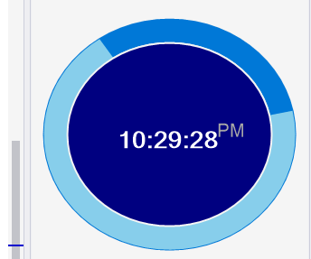

# Clock widget
## Requires
- Visual Studio 2015
## License
- MIT
## Technologies
- C#
- Windows Forms
- clock
- Visual Studio 2015
## Topics
- Windows Forms
- clock
- Widgets
- Gadget
- circular progress bar
## Updated
- 07/22/2017
## Description

This sample demonstrates how to build a desktop clock gadget/ widget using windows form application and it also demonstrates use of
<strong>circular progress bar</strong>.

 

Create a new windows form application project

In <strong>solution explorer</strong> tab
<em>right click</em> on <em>project Solution</em> and click <strong>manage nuget packages</strong> .

Search for &ldquo;circular progress bar&rdquo; and install it.

&nbsp;&nbsp;

After that it installed go to
<strong>ToolBox</strong>. in ToolBox <em>right click</em> and select <strong>Choose Items</strong>

in <em>.NET framework component</em> tab click
<strong>browse</strong> and browse to the current project folder and then browse to<strong>
</strong><strong>packages &gt;&gt; WinFormAnimation &gt;&gt; lib &gt;&gt; net35-client</strong> folder

then <em>copy</em>
<strong>WinFormAnimation.dll</strong> file and go back to <em>packages</em> folder then select
<strong>CircularProgressBar</strong> folder then browse to <strong>lib&gt;&gt; net35-client</strong> folder and
<em><strong>paste</strong></em> that file here.

&nbsp;

then select <strong>CircularProgressBar.dll</strong> and click
<strong>open</strong> now in <em>Choose Toolbox Items</em> window and click <strong>
OK </strong>

&nbsp;

Now select the circular progress bar and add it to your form application.

to make it more like a widget make select form and make windows form size small and set the
<strong>FormBorderStyle</strong> to <strong>None</strong>.

now select the <em>CircularProgressBar</em> and adjust following properties from a properties tab

change <strong>
BackColor</strong> to Transparent

<strong>ForeColor</strong>
White

change the <strong>InnerColor</strong>,
<strong>OuterColor</strong> and <strong>ProgressColor</strong> as desired

change <strong>SubscriptText</strong> to
00 and make&nbsp; <strong>SuperScriptText</strong> &nbsp;empty

change the <strong>
Text</strong> to 00:00:00.

set <strong>Style </strong>
to Marquee.

adjust <strong>Step</strong> to
10 and also adjust size of text according to size of clock.

&nbsp;

this application will check for time after every 1s &nbsp;(1000 milliseconds) interval.

in the Form_Load function we had used<strong> <a class="libraryLink" href="https://msdn.microsoft.com/en-US/library/System.Timers.aspx" target="_blank" title="Auto generated link to System.Timers">System.Timers</a></strong> class

&nbsp;

C#

Edit|Remove

csharp

<pre class="csharp">&nbsp;private&nbsp;void&nbsp;Form1_Load(object&nbsp;sender,&nbsp;EventArgs&nbsp;e)&nbsp;
&nbsp;&nbsp;&nbsp;&nbsp;&nbsp;&nbsp;&nbsp;&nbsp;{&nbsp;
&nbsp;&nbsp;&nbsp;&nbsp;&nbsp;&nbsp;&nbsp;&nbsp;&nbsp;&nbsp;&nbsp;&nbsp;int&nbsp;x&nbsp;=&nbsp;desktopArea.Width;&nbsp;
&nbsp;&nbsp;&nbsp;&nbsp;&nbsp;&nbsp;&nbsp;&nbsp;&nbsp;&nbsp;&nbsp;&nbsp;int&nbsp;y&nbsp;=&nbsp;desktopArea.Height;&nbsp;
&nbsp;&nbsp;&nbsp;&nbsp;&nbsp;&nbsp;&nbsp;&nbsp;&nbsp;&nbsp;&nbsp;&nbsp;this.TransparencyKey&nbsp;=&nbsp;(BackColor);&nbsp;
&nbsp;&nbsp;&nbsp;&nbsp;&nbsp;&nbsp;&nbsp;&nbsp;&nbsp;&nbsp;&nbsp;&nbsp;System.Timers.Timer&nbsp;timer&nbsp;=&nbsp;new&nbsp;<a class="libraryLink" href="https://msdn.microsoft.com/en-US/library/System.Timers.Timer.aspx" target="_blank" title="Auto generated link to System.Timers.Timer">System.Timers.Timer</a>();&nbsp;
&nbsp;&nbsp;&nbsp;&nbsp;&nbsp;&nbsp;&nbsp;&nbsp;&nbsp;&nbsp;&nbsp;&nbsp;timer.Interval&nbsp;=&nbsp;1000;&nbsp;
&nbsp;&nbsp;&nbsp;&nbsp;&nbsp;&nbsp;&nbsp;&nbsp;&nbsp;&nbsp;&nbsp;&nbsp;timer.Elapsed&nbsp;&#43;=&nbsp;Timer_Elapsed;&nbsp;
&nbsp;&nbsp;&nbsp;&nbsp;&nbsp;&nbsp;&nbsp;&nbsp;&nbsp;&nbsp;&nbsp;&nbsp;timer.Start();&nbsp;
&nbsp;&nbsp;&nbsp;&nbsp;&nbsp;&nbsp;&nbsp;&nbsp;&nbsp;&nbsp;&nbsp;&nbsp;this.SetDesktopLocation(x&nbsp;-&nbsp;300,&nbsp;100);&nbsp;
&nbsp;&nbsp;&nbsp;&nbsp;&nbsp;&nbsp;&nbsp;&nbsp;}</pre>

&nbsp;this above line of code will launch method Timer_Elapsed after every 1s.&nbsp;

&nbsp;

C#

Edit|Remove

csharp

<pre class="js">&nbsp;private&nbsp;void&nbsp;Timer_Elapsed(object&nbsp;sender,&nbsp;System.Timers.ElapsedEventArgs&nbsp;e)&nbsp;
&nbsp;&nbsp;&nbsp;&nbsp;&nbsp;&nbsp;&nbsp;&nbsp;{&nbsp;
&nbsp;&nbsp;&nbsp;&nbsp;&nbsp;&nbsp;&nbsp;&nbsp;&nbsp;&nbsp;&nbsp;&nbsp;circularProgressBar1.Invoke((MethodInvoker)delegate&nbsp;{&nbsp;
&nbsp;&nbsp;&nbsp;&nbsp;&nbsp;&nbsp;&nbsp;&nbsp;&nbsp;&nbsp;&nbsp;&nbsp;&nbsp;&nbsp;&nbsp;&nbsp;circularProgressBar1.Text&nbsp;=&nbsp;DateTime.Now.ToString(&quot;hh:mm:ss&quot;);&nbsp;
&nbsp;&nbsp;&nbsp;&nbsp;&nbsp;&nbsp;&nbsp;&nbsp;&nbsp;&nbsp;&nbsp;&nbsp;&nbsp;&nbsp;&nbsp;&nbsp;circularProgressBar1.SubscriptText&nbsp;=&nbsp;DateTime.Now.ToString(&quot;tt&quot;);&nbsp;
&nbsp;
&nbsp;&nbsp;&nbsp;&nbsp;&nbsp;&nbsp;&nbsp;&nbsp;&nbsp;&nbsp;&nbsp;&nbsp;});&nbsp;
&nbsp;
&nbsp;&nbsp;&nbsp;&nbsp;&nbsp;&nbsp;&nbsp;&nbsp;}</pre>

&nbsp;

this method will check for time.&nbsp;

to move the clock arround the screen add following functions and linked them in event tab of circularProgressBar

&nbsp;

C#

Edit|Remove

csharp

<pre class="js">private&nbsp;void&nbsp;circularProgressBar1_MouseDown(object&nbsp;sender,&nbsp;MouseEventArgs&nbsp;e)&nbsp;
&nbsp;&nbsp;&nbsp;&nbsp;&nbsp;&nbsp;&nbsp;&nbsp;{&nbsp;
&nbsp;&nbsp;&nbsp;&nbsp;&nbsp;&nbsp;&nbsp;&nbsp;&nbsp;&nbsp;&nbsp;&nbsp;mouseDn&nbsp;=&nbsp;true;&nbsp;
&nbsp;&nbsp;&nbsp;&nbsp;&nbsp;&nbsp;&nbsp;&nbsp;}&nbsp;
&nbsp;
&nbsp;&nbsp;&nbsp;&nbsp;&nbsp;&nbsp;&nbsp;&nbsp;private&nbsp;void&nbsp;circularProgressBar1_MouseMove(object&nbsp;sender,&nbsp;MouseEventArgs&nbsp;e)&nbsp;
&nbsp;&nbsp;&nbsp;&nbsp;&nbsp;&nbsp;&nbsp;&nbsp;{&nbsp;
&nbsp;&nbsp;&nbsp;&nbsp;&nbsp;&nbsp;&nbsp;&nbsp;&nbsp;&nbsp;&nbsp;&nbsp;if&nbsp;(mouseDn)&nbsp;
&nbsp;&nbsp;&nbsp;&nbsp;&nbsp;&nbsp;&nbsp;&nbsp;&nbsp;&nbsp;&nbsp;&nbsp;{&nbsp;
&nbsp;&nbsp;&nbsp;&nbsp;&nbsp;&nbsp;&nbsp;&nbsp;&nbsp;&nbsp;&nbsp;&nbsp;&nbsp;&nbsp;&nbsp;&nbsp;mouseX&nbsp;=&nbsp;MousePosition.X&nbsp;-130;&nbsp;
&nbsp;&nbsp;&nbsp;&nbsp;&nbsp;&nbsp;&nbsp;&nbsp;&nbsp;&nbsp;&nbsp;&nbsp;&nbsp;&nbsp;&nbsp;&nbsp;mouseY&nbsp;=&nbsp;MousePosition.Y&nbsp;-50;&nbsp;
&nbsp;&nbsp;&nbsp;&nbsp;&nbsp;&nbsp;&nbsp;&nbsp;&nbsp;&nbsp;&nbsp;&nbsp;&nbsp;&nbsp;&nbsp;&nbsp;this.SetDesktopLocation(mouseX,&nbsp;mouseY);&nbsp;
&nbsp;&nbsp;&nbsp;&nbsp;&nbsp;&nbsp;&nbsp;&nbsp;&nbsp;&nbsp;&nbsp;&nbsp;}&nbsp;
&nbsp;&nbsp;&nbsp;&nbsp;&nbsp;&nbsp;&nbsp;&nbsp;}&nbsp;
&nbsp;
&nbsp;&nbsp;&nbsp;&nbsp;&nbsp;&nbsp;&nbsp;&nbsp;private&nbsp;void&nbsp;circularProgressBar1_MouseUp(object&nbsp;sender,&nbsp;MouseEventArgs&nbsp;e)&nbsp;
&nbsp;&nbsp;&nbsp;&nbsp;&nbsp;&nbsp;&nbsp;&nbsp;{&nbsp;
&nbsp;&nbsp;&nbsp;&nbsp;&nbsp;&nbsp;&nbsp;&nbsp;&nbsp;&nbsp;&nbsp;&nbsp;mouseDn&nbsp;=&nbsp;false;&nbsp;
&nbsp;&nbsp;&nbsp;&nbsp;&nbsp;&nbsp;&nbsp;&nbsp;}</pre>

&nbsp;

&nbsp;

if any suggestions and feedback email me at:

<em>umairnadeem20@hotmail.com</em>&nbsp; 

 

 

&nbsp;

&nbsp;

&nbsp;

&nbsp;

&nbsp;

&nbsp;

<strong>&nbsp;</strong><em>&nbsp;</em>

