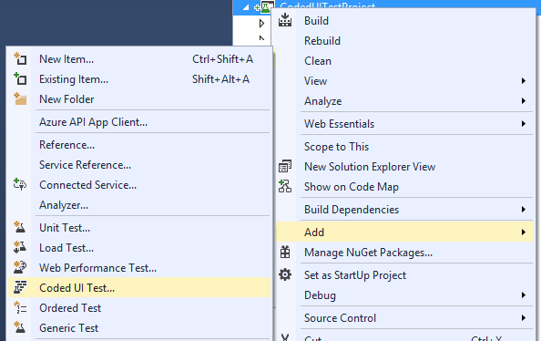
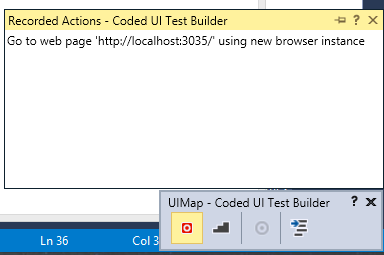
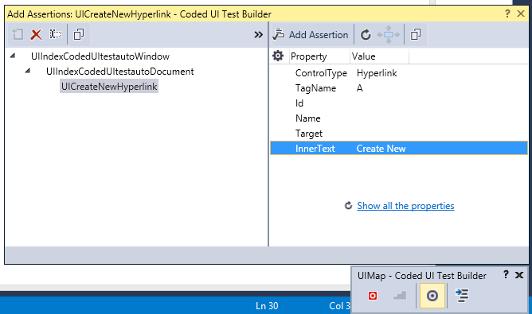
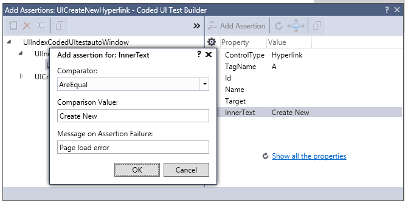
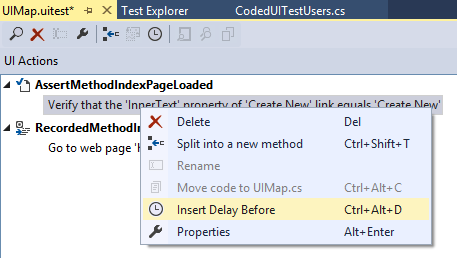
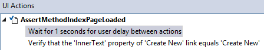
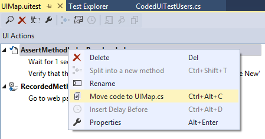
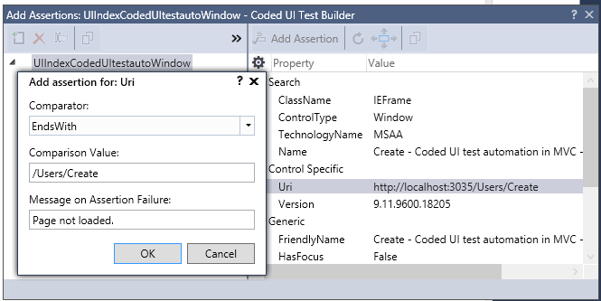
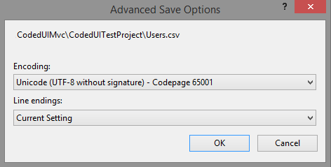

# Coded UI test automation of MVC applications with Visual Studio
## Requires
- Visual Studio 2015
## License
- MIT
## Technologies
- ASP.NET MVC
- Visual Studio 2015
## Topics
- Coded UI Tests
## Updated
- 03/08/2016
## Description

<h1>Coded UI Tests</h1>

Automated tests that drive your application through its user interface (UI) are known as coded UI Tests. These tests include functional testing of the UI controls. They let you verify that the whole application, including its user interface, is functioning
 correctly. Coded UI Tests are particularly useful where there is validation or other logic in the user interface, for example in a web page. They are also frequently used to automate an existing manual test.

As shown in the following illustration, a typical development experience might be one where, initially, you simply build your application and click through the UI controls to verify that things are working correctly. You then might decide to create a coded
 test so that you don&rsquo;t need to continue to test the application manually. Depending on the particular functionality being tested in your application, you can write code either for a functional test, or for an integration test that might or might not
 include testing at the UI level. If you simply want to access directly some business logic, you might code a unit test. However, under certain circumstances, it can be beneficial to include testing of the various UI controls in your application. A coded UI
 test can automate the initial scenario, verifying that code churn does not impact the functionality of your application.

<h3>Manual vs. Coded testing types.</h3>

&nbsp;

<h1>The MVC Application in test</h1>

This is the first of a series of articles about coded UI test automation. The first scenario being analysed is about MVC web applications. The application in test is pretty straightforward, consisting of a number of screens (web pages) for listing, creating,
 editing and deleting pseudo-users. As said, the technology in use is <strong>ASP.NET MVC 5</strong>. Additional frameworks include:
<strong>Entity Framework</strong> as ORM with SQL Server as database, <strong>Bootstrap</strong> for responsive design,
<strong>JQuery UI</strong> for a date picker component. Let&rsquo;s analyse more in detail the Model, Controller and View of this application, before digging into the coded UI test project.

&nbsp;

<h1>The Model</h1>

The application in test performs simple CRUD operations on a User model. We define our model with the following properties:

<ul>
<li><strong>Id</strong>: Unique identifier of the user; that&rsquo;s the primary key at database level.
</li><li><strong>FirstName</strong>: First name of the user; this is a required field.
</li><li><strong>LastName</strong>: Last name of the user; this is a required field. </li><li><strong>Email</strong>: Email address of the user; this is required and also unique, that is there cannot be two users with the same email address.
</li><li><strong>DateOfBirth</strong>: Date of birth of the user; this field is optional.
</li></ul>

&nbsp;

To enforce uniqueness of the email address, we can use the <strong>Index</strong> attribute on the
<strong>Email </strong>property, specifying <strong>IsUnique = true</strong>. This attribute is defined in the
<strong>System.ComponentModel.DataAnnotations.Schema</strong> namespace, and we need a reference to Entity Framework in our project. To add an index to a string field, we also need to set a length (indexes cannot be applied to unbounded strings), so we can
 use the <strong>StringLength</strong> attribute as well. Lastly, we can decorate the Email property with the
<strong>DataType</strong> attribute of type <strong>EmailAddress</strong>, so we have it formatted as a &ldquo;mailto:&rdquo; link automatically in our views, and we get HTML5 validation of the email address in the browser.

<strong>DateOfBirth </strong>instead is an optional field, and because we are using the
<strong>DateTime</strong> type, which is a struct in C#, thus a value type, thus cannot be null, we need to make it nullable in order to accept null values. And we also decorate it with the Date
<strong>DataType</strong> attribute (just Date, no Time, no need to capture the time of birth!)

The source code for the <strong>User</strong> class is very straightforward:

&nbsp;

C#

Edit|Remove

csharp
<pre class="hidden">public class User
{
    public int Id { get; set; }

    [Required]
    [DisplayName(&quot;First Name&quot;)]
    public string FirstName { get; set; }

    [Required]
    [DisplayName(&quot;Last Name&quot;)]
    public string LastName { get; set; }

    [Required, Index(IsUnique = true)]
    [StringLength(200)]
    [DataType(DataType.EmailAddress)]
    public string Email { get; set; }

    [DataType(DataType.Date)]
    [DisplayName(&quot;Date of Birth&quot;)]
    public DateTime? DateOfBirth { get; set; }
}
</pre>

<pre class="csharp">public&nbsp;class&nbsp;User&nbsp;
{&nbsp;
&nbsp;&nbsp;&nbsp;&nbsp;public&nbsp;int&nbsp;Id&nbsp;{&nbsp;get;&nbsp;set;&nbsp;}&nbsp;
&nbsp;
&nbsp;&nbsp;&nbsp;&nbsp;[Required]&nbsp;
&nbsp;&nbsp;&nbsp;&nbsp;[DisplayName(&quot;First&nbsp;Name&quot;)]&nbsp;
&nbsp;&nbsp;&nbsp;&nbsp;public&nbsp;string&nbsp;FirstName&nbsp;{&nbsp;get;&nbsp;set;&nbsp;}&nbsp;
&nbsp;
&nbsp;&nbsp;&nbsp;&nbsp;[Required]&nbsp;
&nbsp;&nbsp;&nbsp;&nbsp;[DisplayName(&quot;Last&nbsp;Name&quot;)]&nbsp;
&nbsp;&nbsp;&nbsp;&nbsp;public&nbsp;string&nbsp;LastName&nbsp;{&nbsp;get;&nbsp;set;&nbsp;}&nbsp;
&nbsp;
&nbsp;&nbsp;&nbsp;&nbsp;[Required,&nbsp;Index(IsUnique&nbsp;=&nbsp;true)]&nbsp;
&nbsp;&nbsp;&nbsp;&nbsp;[StringLength(200)]&nbsp;
&nbsp;&nbsp;&nbsp;&nbsp;[DataType(DataType.EmailAddress)]&nbsp;
&nbsp;&nbsp;&nbsp;&nbsp;public&nbsp;string&nbsp;Email&nbsp;{&nbsp;get;&nbsp;set;&nbsp;}&nbsp;
&nbsp;
&nbsp;&nbsp;&nbsp;&nbsp;[DataType(DataType.Date)]&nbsp;
&nbsp;&nbsp;&nbsp;&nbsp;[DisplayName(&quot;Date&nbsp;of&nbsp;Birth&quot;)]&nbsp;
&nbsp;&nbsp;&nbsp;&nbsp;public&nbsp;DateTime?&nbsp;DateOfBirth&nbsp;{&nbsp;get;&nbsp;set;&nbsp;}&nbsp;
}&nbsp;
</pre>

&nbsp;

<h3>The User model.</h3>

&nbsp;

<h1>The View</h1>

We&rsquo;ll focus on the <strong>Create</strong> view for the purpose of this article. The generation of the views follows the MVC automatic scaffolding when adding a new Controller with reads/write Entity Framework operations.

The Create view, obviously, presents all the fields in a form, with a bit of Bootstrap here and there to make it look nice with little effort J

For the Date of Birth field, also, we add a date picker to allow for easy selection of a date without typing it. There are plenty of user controls on the market, and one I appreciate particularly for its ease of use is the
<strong>JQuery UI DatePicker</strong>.

That&rsquo;s how the Create view looks like:

<h3>The Create view.</h3>

&nbsp;

And this is the very simple JavaScript code required for turning the DateOfBirth text input into a date picker with quick selection of month and year (for a date of birth or our users, we&rsquo;re likely picking a year far back in the past):

&nbsp;

JavaScript

Edit|Remove

js
<pre class="hidden">$(function () {
    $(&quot;input[name='DateOfBirth']&quot;).datepicker({
        changeMonth: true,
        changeYear: true,
        showTimepicker: false
    });
});
</pre>

<pre class="js">$(function&nbsp;()&nbsp;{&nbsp;
&nbsp;&nbsp;&nbsp;&nbsp;$(&quot;input[name='DateOfBirth']&quot;).datepicker({&nbsp;
&nbsp;&nbsp;&nbsp;&nbsp;&nbsp;&nbsp;&nbsp;&nbsp;changeMonth:&nbsp;true,&nbsp;
&nbsp;&nbsp;&nbsp;&nbsp;&nbsp;&nbsp;&nbsp;&nbsp;changeYear:&nbsp;true,&nbsp;
&nbsp;&nbsp;&nbsp;&nbsp;&nbsp;&nbsp;&nbsp;&nbsp;showTimepicker:&nbsp;false&nbsp;
&nbsp;&nbsp;&nbsp;&nbsp;});&nbsp;
});&nbsp;
</pre>

&nbsp;

<h3>Turning the Date of Birth text box into a Date Picker with JQuery UI.</h3>

Each field is validated independently, for being required or not, and for its format. By using
<strong>unobtrusive JQuery validation</strong>, this is done client-side before the form is submitted. The
<strong>jquery.validate.min.js</strong> and <strong>jquery.validate.unobtrusive.min.js</strong> scripts are added to the shared layout of the view. These scripts are served locally as they are bundled with the application itself for simplicity of distribution,
 but in the real world, you may want to consider using a CDN for distributing your static JavaScript files.

If you remember, we have also defined the Email address as unique. This constraint cannot be validated client-side as for the other validation types, so we need to have this validation applied on the server-side, which is in the Controller.

Before we present the Controller, though, this is the error message that we&rsquo;d like to see when entering a duplicate email address. The message is displayed in a summary area of errors that are not necessarily tied to a specific field (although this
 one is, but its validation requires the investigation of the entire model, as we shall see in a moment), but rather apply to the entire model.

<h3>Validation on uniqueness of the email address.</h3>
<h1>The Controller</h1>

After presenting Model and View, time now to complete our MVC application by introducing the Controller, namely the
<strong>UsersController</strong>.

By generating this controller with the automatic scaffolding offered by Visual Studio, and in conjunction with the usage of Entity Framework for our repository requirements, the Users controllers implements the following actions:

<ul>
<li><strong>Index</strong>: Displays a list of existing users. </li><li><strong>Details</strong>: Displays the details of a specific user. </li><li><strong>Create</strong>: Presents a form for creating a new user. </li><li><strong>Edit</strong>: Presents a form for editing an existing user. </li><li><strong>Delete</strong>: Prompts for confirmation before deleting a user. </li></ul>

In the CRUD acronym (Create Read Update Delete), Create is obviously the C, Index and Details can be considered the R (many and one reading), Edit is the U and Delete for the D.

<h3>The Users controller.</h3>

As anticipated, let&rsquo;s analyse how the validation of the uniqueness of the email address is performed. I thought about the best way of doing it, and I shortlisted the following two approaches:

<ol>
<li>Before adding the user entity to the repository, check that another user with the same email address does not exist already.
</li><li>As we have decorated the Email property with the Index attribute, this is creating a unique index at database level, which means that uniqueness is enforced at database level and then propagated to the application.
</li></ol>

I see a couple of issues with the first approach. (a) It requires a second round to the database to check for existing users with the same email address. (b) It is not concurrency-prone, as another parallel process may create a user with the same email address
 as my own just after my process has checked for uniqueness (and not found anything), and before committing changes into the database. A lock on the table for avoiding concurrent insert is clearly out of consideration.

The second approach creates a dependency between the model and the repository system (Entity Framework), but at this point, as we are still not in the magic world of OWIN, I think this in an acceptable compromise.

I welcome any better and clever ways of doing it J

P.S. There is a third option, which allows to validate the uniqueness of the Email address also client-side. This would require decorating the Email property with the
<strong>Remote</strong> attribute, defined in <strong>System.Web.Mvc</strong>. This attributes enforces validation of the property by making an Ajax call to a specified controller and action. This forms of validation required the JQuery validation plug-in.
 In this way, validation of Email can be done without leaving the page. A couple of considerations here: In terms of concurrency, this is even worse than the first approach, as concurrent processes may &ldquo;steal&rdquo; the email address during the Ajax roundtrip.
 This is even more likely to occur than a server-side process competition, considering that it occurs between the client (browser) and the server in disconnected way. Also, it doesn&rsquo;t free the model from any dependency, as we would tie it to System.Web.Mvc.
 And in the world of OWIN this is bad&hellip;

So unique index it is, and let EF resolve the conflict at database level. All we have to do is to catch the relevant exception and manage it properly. Now, the bad news is that EF does not have a specific exception for unique index violation. It rather throws
 a generic <strong>DbUpdateException</strong>. Thus, I modified the <strong>Create
</strong>action to handle this exception when adding the user to the repository and saving changes, as in the code below:

&nbsp;

C#

Edit|Remove

csharp
<pre class="hidden">[HttpPost]
[ValidateAntiForgeryToken]
public ActionResult Create([Bind(Include = &quot;Id,FirstName,LastName,Email,DateOfBirth&quot;)] User user)
{
    if (ModelState.IsValid)
    {
        try
        {
            db.Users.Add(user);
            db.SaveChanges();
        }
        catch (DbUpdateException ex) when (ex.HResult == -2146233087)
        {
            ModelState.AddModelError(string.Empty, &quot;Email address already used&quot;);
            return View(user);
        }
                
        return RedirectToAction(&quot;Index&quot;);
    }

    return View(user);
}
</pre>

<pre class="csharp">[HttpPost]&nbsp;
[ValidateAntiForgeryToken]&nbsp;
public&nbsp;ActionResult&nbsp;Create([Bind(Include&nbsp;=&nbsp;&quot;Id,FirstName,LastName,Email,DateOfBirth&quot;)]&nbsp;User&nbsp;user)&nbsp;
{&nbsp;
&nbsp;&nbsp;&nbsp;&nbsp;if&nbsp;(ModelState.IsValid)&nbsp;
&nbsp;&nbsp;&nbsp;&nbsp;{&nbsp;
&nbsp;&nbsp;&nbsp;&nbsp;&nbsp;&nbsp;&nbsp;&nbsp;try&nbsp;
&nbsp;&nbsp;&nbsp;&nbsp;&nbsp;&nbsp;&nbsp;&nbsp;{&nbsp;
&nbsp;&nbsp;&nbsp;&nbsp;&nbsp;&nbsp;&nbsp;&nbsp;&nbsp;&nbsp;&nbsp;&nbsp;db.Users.Add(user);&nbsp;
&nbsp;&nbsp;&nbsp;&nbsp;&nbsp;&nbsp;&nbsp;&nbsp;&nbsp;&nbsp;&nbsp;&nbsp;db.SaveChanges();&nbsp;
&nbsp;&nbsp;&nbsp;&nbsp;&nbsp;&nbsp;&nbsp;&nbsp;}&nbsp;
&nbsp;&nbsp;&nbsp;&nbsp;&nbsp;&nbsp;&nbsp;&nbsp;catch&nbsp;(DbUpdateException&nbsp;ex)&nbsp;when&nbsp;(ex.HResult&nbsp;==&nbsp;-2146233087)&nbsp;
&nbsp;&nbsp;&nbsp;&nbsp;&nbsp;&nbsp;&nbsp;&nbsp;{&nbsp;
&nbsp;&nbsp;&nbsp;&nbsp;&nbsp;&nbsp;&nbsp;&nbsp;&nbsp;&nbsp;&nbsp;&nbsp;ModelState.AddModelError(string.Empty,&nbsp;&quot;Email&nbsp;address&nbsp;already&nbsp;used&quot;);&nbsp;
&nbsp;&nbsp;&nbsp;&nbsp;&nbsp;&nbsp;&nbsp;&nbsp;&nbsp;&nbsp;&nbsp;&nbsp;return&nbsp;View(user);&nbsp;
&nbsp;&nbsp;&nbsp;&nbsp;&nbsp;&nbsp;&nbsp;&nbsp;}&nbsp;
&nbsp;&nbsp;&nbsp;&nbsp;&nbsp;&nbsp;&nbsp;&nbsp;&nbsp;&nbsp;&nbsp;&nbsp;&nbsp;&nbsp;&nbsp;&nbsp;&nbsp;
&nbsp;&nbsp;&nbsp;&nbsp;&nbsp;&nbsp;&nbsp;&nbsp;return&nbsp;RedirectToAction(&quot;Index&quot;);&nbsp;
&nbsp;&nbsp;&nbsp;&nbsp;}&nbsp;
&nbsp;
&nbsp;&nbsp;&nbsp;&nbsp;return&nbsp;View(user);&nbsp;
}&nbsp;
</pre>

&nbsp;

<h3>Handling duplicate email exceptions.</h3>

Inside the <strong>catch</strong> statement, we add a model error to the model state with an empty key. This indicates that the error refers to the model as a whole and not to a specific property, and therefore will be displayed in the validation summary
 area within the view, rather than in line with the Email field. But obviously this can be changed as needed.

Hold on, what about that <strong>HResult</strong> in the <strong>when</strong> condition of the
<strong>catch</strong> statement? During my debugging session in search for the right exception type to catch, I found out that the way to discern the specific underline error (not a generic update error, but a specific unique index violation) is to either
 look at the exception message, or the <strong>HResult</strong> property.

<a href="https://msdn.microsoft.com/en-us/library/system.exception.hresult(v=vs.110).aspx">Exception.HResult</a> is a coded numerical value that is assigned to a specific exception. The error code is a unique number that is assigned to represent the exception.
 Each exception is mapped to a distinct HResult. Apparently, but from my quick search I could not find official documentation about it, -2146233087 is the HResult code for unique index violation. And so I did in handling the
<strong>DbUpdateException</strong>, adding a <strong>when</strong> condition (this is a new operator in C# 6), to be more specific about the message to display. For brevity, I am not handling any other exception type, although I strongly recommend doing so,
 obviously.

&nbsp;

<h1>Coded UI Test Project</h1>

Time to implement our first Coded UI test in Visual Studio. To start, we need to add a new
<strong>Coded UI Test Project</strong> to the solution.

<h3>Coded UI Test Project in Visual Studio.</h3>

On adding the project to our solution, we are prompted with a decision to make on how we want to create our coded UI tests:

<ul>
<li>By recording actions, editing UI maps or adding assertions: This is the &ldquo;visual&rdquo; way of doing it, which relies on the
<strong>Coded UI Test Builder</strong> for recording user experience sessions, and generating all the code for our actions. We will choose this approach.
</li><li>By using an existing action recording and generating the necessary code to perform similar actions as the recording. This method requires us to write a lot more code manually for generating user experience actions in our application. We&rsquo;ll look into
 this as a second step, after we get more familiar with the basics of coded UI tests.
</li></ul>

<h3>How to generate code for Coded UI Tests.</h3>

As we choose the first option, the <strong>Coded UI Test Builder </strong>shows up (typically in the lower right corner of the screen). This test builder provides controls for recording actions directly as we experience our application, turning them into
 C# code that will be executed to introduce automation of our UI tests (hence the name &ldquo;Coded UI Test&rdquo;), and adding assertion to specific fields to validate expected results.

<h3>Coded UI Test Builder.</h3>
<h1>Action Recording and Assertions</h1>

Action and assertions are recorded for each test. Besides the first test added automatically to the project, additional tests can be added by selecting the &ldquo;Coded UI Test&rdquo; item from the
<strong>Add</strong> menu for the test project.

<h3>Adding a new Coded UI Test to the project.</h3>

Let&rsquo;s start recording our first test scenario for testing the UI of the Create action. After adding a Coded UI test to our project, let&rsquo;s rename it as
<strong>CodedUITestUsers</strong>. This is the code generated. I have already removed the comments from the Initialize and Cleanup methods, that we are going to use later.

&nbsp;

C#

Edit|Remove

csharp
<pre class="hidden">[CodedUITest]
public class CodedUITestUsers
{
    public CodedUITestUsers()
    {
    }

    [TestMethod]
    public void CodedUITestCreate()
    {
        // To generate code for this test, select &quot;Generate Code for Coded UI Test&quot; from the shortcut menu and select one of the menu items.
    }

    // Use TestInitialize to run code before running each test 
    [TestInitialize]
    public void MyTestInitialize()
    {
    }

    // Use TestCleanup to run code after each test has run
    [TestCleanup]
    public void MyTestCleanup()
    {
    }

    public TestContext TestContext { get &hellip; set &hellip; }
}
</pre>

<pre class="csharp">[CodedUITest]&nbsp;
publicclass&nbsp;CodedUITestUsers&nbsp;
{&nbsp;
&nbsp;&nbsp;&nbsp;&nbsp;public&nbsp;CodedUITestUsers()&nbsp;
&nbsp;&nbsp;&nbsp;&nbsp;{&nbsp;
&nbsp;&nbsp;&nbsp;&nbsp;}&nbsp;
&nbsp;
&nbsp;&nbsp;&nbsp;&nbsp;[TestMethod]&nbsp;
&nbsp;&nbsp;&nbsp;&nbsp;publicvoid&nbsp;CodedUITestCreate()&nbsp;
&nbsp;&nbsp;&nbsp;&nbsp;{&nbsp;
&nbsp;&nbsp;&nbsp;&nbsp;&nbsp;&nbsp;&nbsp;&nbsp;//&nbsp;To&nbsp;generate&nbsp;code&nbsp;for&nbsp;this&nbsp;test,&nbsp;select&nbsp;&quot;Generate&nbsp;Code&nbsp;for&nbsp;Coded&nbsp;UI&nbsp;Test&quot;&nbsp;from&nbsp;the&nbsp;shortcut&nbsp;menu&nbsp;and&nbsp;select&nbsp;one&nbsp;of&nbsp;the&nbsp;menu&nbsp;items.&nbsp;
&nbsp;&nbsp;&nbsp;&nbsp;}&nbsp;
&nbsp;
&nbsp;&nbsp;&nbsp;&nbsp;//&nbsp;Use&nbsp;TestInitialize&nbsp;to&nbsp;run&nbsp;code&nbsp;before&nbsp;running&nbsp;each&nbsp;test&nbsp;&nbsp;
&nbsp;&nbsp;&nbsp;&nbsp;[TestInitialize]&nbsp;
&nbsp;&nbsp;&nbsp;&nbsp;publicvoid&nbsp;MyTestInitialize()&nbsp;
&nbsp;&nbsp;&nbsp;&nbsp;{&nbsp;
&nbsp;&nbsp;&nbsp;&nbsp;}&nbsp;
&nbsp;
&nbsp;&nbsp;&nbsp;&nbsp;//&nbsp;Use&nbsp;TestCleanup&nbsp;to&nbsp;run&nbsp;code&nbsp;after&nbsp;each&nbsp;test&nbsp;has&nbsp;run&nbsp;
&nbsp;&nbsp;&nbsp;&nbsp;[TestCleanup]&nbsp;
&nbsp;&nbsp;&nbsp;&nbsp;publicvoid&nbsp;MyTestCleanup()&nbsp;
&nbsp;&nbsp;&nbsp;&nbsp;{&nbsp;
&nbsp;&nbsp;&nbsp;&nbsp;}&nbsp;
&nbsp;
&nbsp;&nbsp;&nbsp;&nbsp;public&nbsp;TestContext&nbsp;TestContext&nbsp;{&nbsp;get&nbsp;&hellip;&nbsp;set&nbsp;&hellip;&nbsp;}&nbsp;
}&nbsp;
</pre>

&nbsp;

<h3>The initial structure of a Coded UI Test class.</h3>

As you can notice, each test class is marked with the <strong>CodedUITest</strong> attribute defined in the
<strong>Microsoft.VisualStudio.TestTools.UITesting</strong> namespace. When the test is executed the method marked with the
<strong>TestInitialize</strong> attribute is invoked first. Use this method to perform initialisation of resources used by the test, or for initial navigation within the application that you do not want to be part of the test itself. Subsequently, all methods
 marked with the attribute <strong>TestMethod</strong> are executed. For the purpose, we have our method
<strong>CodedUITestCreate</strong> meant to test the Create action of a user. Finally, use
<strong>TestCleanup</strong> to run code after each test has run.

When recording UI tests, keep in mind this simple rule of thumb: stick to one screen (page) per test. Testing navigation between pages, especially in a browser where speed of page load depends on the quality of the network connection, can be tricky. As test
 assertions are based on the existence of controls in a page, asserting whether a control has a specific value may happen before the control has been loaded in the page, thus failing the test. I&rsquo;ll present a workaround to this problem later, but for now
 let&rsquo;s stick to the rule of having one test for each screen.

As we have two pages, the <strong>Index</strong> view and the <strong>Create</strong> view, we need two test methods. Even better, as the Index view is always loaded first, we can put the recording for opening this page in the initialization method.

To start recording for the <strong>MyTestInitialize</strong> method:

<ol>
<li>Close all browser instances (will say more about this later, it is for performance reasons).
</li><li>Right click on the <strong>MyTestInitialize</strong> method, and select &quot;Generate Code for Coded UI Test &gt; Use Coded UI Test Builder&quot; from the shortcut menu to indicate that actions are being recorded for this particular test method.
</li><li>Click the <strong>Record</strong> button on the <strong>Coded UI Test Builder</strong>.
</li><li>Open a new browser window and enter the URL of the MVC application in the address bar.
</li></ol>

&nbsp;

When done with the recording:

<ol>
<li>On the <strong>Coded UI Test Builder</strong>, pause recording and generate code; give a name to the recorded method, for example
<strong>RecordedMethodIndex</strong>. This method will be added to the <strong>UIMap</strong>.
</li></ol>

&nbsp;

The list of steps recorded is visible in the &ldquo;Recorded Actions&rdquo; section of the Coded UI Test Builder. As you can see, the builder has recorded exactly what we have just executed, that is only opening a web page at the address indicated.

<h3>Recorded actions for the RecordedMethodIndex method.</h3>

You will notice that the <strong>MyTestInitialize</strong> method changes to reflect the call to the
<strong>RecordedMethodIndex</strong> in the <strong>UIMap</strong>.

&nbsp;

C#

Edit|Remove

csharp
<pre class="hidden">[TestInitialize]
public void MyTestInitialize()
{
    this.UIMap.RecordedMethodIndex();
}
</pre>

<pre class="csharp">[TestInitialize]&nbsp;
publicvoid&nbsp;MyTestInitialize()&nbsp;
{&nbsp;
&nbsp;&nbsp;&nbsp;&nbsp;this.UIMap.RecordedMethodIndex();&nbsp;
}&nbsp;
</pre>

&nbsp;

<h3>The recorded method added to the test initialize method.</h3>

If you were to dig into the <strong>RecordedMethodIndex</strong>, you will find this implementation:

&nbsp;

C#

Edit|Remove

csharp
<pre class="hidden">public void RecordedMethodIndex()
{
    // Go to web page 'http://localhost:3035/' using new browser instance
    this.UIIndexCodedUItestautoWindow.LaunchUrl(new System.Uri(this.RecordedMethodIndexParams.UIIndexCodedUItestautoWindowUrl));
}
</pre>

<pre class="csharp">publicvoid&nbsp;RecordedMethodIndex()&nbsp;
{&nbsp;
&nbsp;&nbsp;&nbsp;&nbsp;//&nbsp;Go&nbsp;to&nbsp;web&nbsp;page&nbsp;'http://localhost:3035/'&nbsp;using&nbsp;new&nbsp;browser&nbsp;instancethis.UIIndexCodedUItestautoWindow.LaunchUrl(new&nbsp;System.Uri(this.RecordedMethodIndexParams.UIIndexCodedUItestautoWindowUrl));&nbsp;
}&nbsp;
</pre>

&nbsp;

<h3>The source code of the RecordedMethodIndex method in the UI Map.</h3>

&nbsp;

This method is contained in the <strong>UIMap</strong> object and it is automatically generated by the Coded UI Test Builder. Do not modify it, as it would be overwritten every time you change the UIMap. There is a different way to change generated code,
 which we&rsquo;ll see in a moment.

We will talk about the UIMap in the next section. For now, it is sufficient to know that the test has been recorded. That&rsquo;s just a sequence of actions, though. We are not verifying anything yet. What&rsquo;s missing is the actual verification that
 the steps executed are displaying the intended result. Basically, we need to add an assertion and verify whether the test is successful:

<ol>
<li>Reopen the <strong>Coded UI Test Builder</strong> for the <strong>MyTestInitialize</strong> method.
</li><li>Click the <strong>target icon</strong> to locate a control in the UI Map. </li></ol>

<h3>Locating the &ldquo;Create New&rdquo; link control in the UI Map.</h3>
<ol>
<li>Click the <strong>Add Assertion</strong> button and enter the condition for asserting that this control exists in the page, which is basically our verification to say whether the Index page has been loaded correctly.
</li></ol>

<h3>Adding an assertion for the &ldquo;Create New&rdquo; control.</h3>
<ol>
<li>Generate the code for this assertion and name the method as <strong>AssertMethodIndexPageLoaded</strong>. The method has now changes to add the assertion:
</li></ol>

&nbsp;

C#

Edit|Remove

csharp
<pre class="hidden">[TestInitialize]
public void MyTestInitialize()
{
    this.UIMap.RecordedMethodIndex();
    this.UIMap.AssertMethodIndexPageLoaded();
}
</pre>

<pre class="csharp">[TestInitialize]&nbsp;
publicvoid&nbsp;MyTestInitialize()&nbsp;
{&nbsp;
&nbsp;&nbsp;&nbsp;&nbsp;this.UIMap.RecordedMethodIndex();&nbsp;
&nbsp;&nbsp;&nbsp;&nbsp;this.UIMap.AssertMethodIndexPageLoaded();&nbsp;
}&nbsp;
</pre>

&nbsp;

<h3>The assertion method added to the test initialize method.</h3>

This is a complete test now, with actions and assertions, and it can be fully executed. If you try to run the test, you may experience a failure though.

<h3>The test failed to find the &ldquo;Create New&rdquo; control.</h3>

I was expecting this. If you look at the sequence of actions from a code perspective, the
<strong>RecordedMethodIndex</strong> opens the application at the indicated URL, and immediately after, the
<strong>AssertMethodIndexPageLoaded</strong> checks that the &ldquo;Create New&rdquo; control exists. This check may happen too soon if the web page has not fully loaded yet.

&nbsp;

C#

Edit|Remove

csharp
<pre class="hidden">public void AssertMethodIndexPageLoaded()
{
    ...
    // Verify that the 'InnerText' property of 'Create New' link equals 'Create New'
Assert.AreEqual(this.AssertMethodIndexPageLoadedExpectedValues.UICreateNewHyperlinkInnerText, uICreateNewHyperlink.InnerText, &quot;Page load error&quot;);
}
</pre>

<pre class="csharp">publicvoid&nbsp;AssertMethodIndexPageLoaded()&nbsp;
{&nbsp;
&nbsp;&nbsp;&nbsp;&nbsp;...&nbsp;
&nbsp;&nbsp;&nbsp;&nbsp;//&nbsp;Verify&nbsp;that&nbsp;the&nbsp;'InnerText'&nbsp;property&nbsp;of&nbsp;'Create&nbsp;New'&nbsp;link&nbsp;equals&nbsp;'Create&nbsp;New'&nbsp;
Assert.AreEqual(this.AssertMethodIndexPageLoadedExpectedValues.UICreateNewHyperlinkInnerText,&nbsp;uICreateNewHyperlink.InnerText,&nbsp;&quot;Page&nbsp;load&nbsp;error&quot;);&nbsp;
}&nbsp;
</pre>

&nbsp;

<h3>Asserting that the &ldquo;Create New&rdquo; control exists.</h3>

To work around problems of page load, we need to introduce a delay between actions or before conditions are checked. This approach will work also when navigating between pages, allowing enough time for a page to load completely before further actions can
 be undertaken.

To add a delay, open the UI Map in the project, locate the <strong>AssertMethodIndexPageLoaded</strong> method in the list of UI Actions, right click and select &ldquo;Insert Delay Before&rdquo;.

<h3>Adding a delay to a UI Action.</h3>

A one-second delay is added before the verification of the &ldquo;Create New&rdquo; control. The duration of the delay can be modified in the properties of the action.

<h3>One-second delay added to the UI Actions.</h3>

From a code perspective, a <strong>Playback.Wait</strong> instruction is added before the assertion.

&nbsp;

C#

Edit|Remove

csharp
<pre class="hidden">public void AssertMethodIndexPageLoaded()
{
    ...
    // Wait for 1 seconds for user delay between actions; Verify that the 'InnerText' property of 'Create New' link equals 'Create New'
    Playback.Wait(1000);
    Assert.AreEqual(...);
}
</pre>

<pre class="csharp">publicvoid&nbsp;AssertMethodIndexPageLoaded()&nbsp;
{&nbsp;
&nbsp;&nbsp;&nbsp;&nbsp;...&nbsp;
&nbsp;&nbsp;&nbsp;&nbsp;//&nbsp;Wait&nbsp;for&nbsp;1&nbsp;seconds&nbsp;for&nbsp;user&nbsp;delay&nbsp;between&nbsp;actions;&nbsp;Verify&nbsp;that&nbsp;the&nbsp;'InnerText'&nbsp;property&nbsp;of&nbsp;'Create&nbsp;New'&nbsp;link&nbsp;equals&nbsp;'Create&nbsp;New'&nbsp;
&nbsp;&nbsp;&nbsp;&nbsp;Playback.Wait(1000);&nbsp;
&nbsp;&nbsp;&nbsp;&nbsp;Assert.AreEqual(...);&nbsp;
}&nbsp;
</pre>

&nbsp;

<h3>Adding the delay before the assertion.</h3>

If you run this test again, it should now complete successfully.

<h3>The test completed successfully.</h3>
<h1>Managing the UI Map</h1>

The <strong>UI Map</strong> is a bit like the control panel of all the actions and assertions recorded with the
<strong>Coded UI Test Builder</strong>. A Coded UI Test project typically has one UI Map only, although more can be added for complex user interfaces. A UI Map consists of:

<ul>
<li><strong>UIMap.uitest</strong>: This is an XML file that represents the structure of the coded UI test recording and all its parts. These include the actions and the classes in addition to the methods and properties of those classes.
</li><li><strong>UIMap.Designer.cs</strong>: This file contains code that is automatically created by the Coded UI Test Builder when a test is created. This file is re-created every time that a test changes, so this is not a file in which we can add or modify code.
</li><li><strong>UIMap.cs</strong>: By default, this file contains a partial UIMap class that has no methods or properties.
</li></ul>

&nbsp;

If you determine that one of your test methods in your coded UI test requires custom code, you must move it into the UIMap.cs file. Otherwise, your code will be overwritten whenever the coded UI test is recompiled.

Do you remember that we added a 1-second delay before the assertion on existence of the &ldquo;Create New&rdquo; control, so to make sure that the web page loads completely before the control is checked? Now, what if a second is not enough? This approach
 based on delay is quite arbitrary. A better way of dealing with control validation on page load is to actually wait until the control is ready. Unfortunately, this kind of wait cannot be added via the UI Map, we need to code it directly. In order to do so,
 we need to move our assertion method into the UIMap.cs for further customisation. This can be done from the UI Map visualisation itself, by locating the
<strong>AssertMethodIndexPageLoaded</strong>, and selecting &ldquo;Move code to UIMap.cs&rdquo; from the context menu. The method is removed from the UIMap.uitest file and no longer is displayed in the UI Actions pane. To edit the method just moved, we need
 to open the UIMap.cs file from Solution Explorer.

<strong>Warning</strong>: Once you have moved a method, you can no longer edit it using the Coded UI Test Editor. You must add your custom code and maintain it using the Code Editor.

<h3>Moving generated code to UIMap.cs for customisation.</h3>

Now that the <strong>AssertMethodIndexPageLoaded</strong> exists in the <strong>
UIMap.cs</strong> file, we can modify it manually with no risk of being overwritten the next time we add a new test to the project. So let&rsquo;s get rid of the
<strong>Playback.Wait</strong> instruction, and let&rsquo;s replace it with a more convenient
<strong>uICreateNewHyperlink.WaitForControlReady</strong>, where uICreateNewHyperlink is a local variable identifying the &ldquo;Create New&rdquo; HTML hyperlink control. This method will hang the execution of the AssertMethodIndexPageLoaded method until that
 control is ready. Safe to use if you are absolutely sure that the control will display eventually, but if you are not, you&rsquo;d better use the overloaded WaitForControlReady method that accepts a timeout period in milliseconds, passed which the execution
 will carry on with no further wait on the control.

&nbsp;

C#

Edit|Remove

csharp
<pre class="hidden">public void AssertMethodIndexPageLoaded()
{
    #region Variable Declarations
    HtmlHyperlink uICreateNewHyperlink = this.UIIndexCodedUItestautoWindow.UIIndexCodedUItestautoDocument.UICreateNewHyperlink;
    #endregion

    //Playback.Wait(1000);
    uICreateNewHyperlink.WaitForControlReady();
    Assert.AreEqual(...);
}
</pre>

<pre class="csharp">publicvoid&nbsp;AssertMethodIndexPageLoaded()&nbsp;
{&nbsp;
&nbsp;&nbsp;&nbsp;&nbsp;#region&nbsp;Variable&nbsp;Declarations&nbsp;
&nbsp;&nbsp;&nbsp;&nbsp;HtmlHyperlink&nbsp;uICreateNewHyperlink&nbsp;=&nbsp;this.UIIndexCodedUItestautoWindow.UIIndexCodedUItestautoDocument.UICreateNewHyperlink;&nbsp;
&nbsp;&nbsp;&nbsp;&nbsp;#endregion//Playback.Wait(1000);&nbsp;
&nbsp;&nbsp;&nbsp;&nbsp;uICreateNewHyperlink.WaitForControlReady();&nbsp;
&nbsp;&nbsp;&nbsp;&nbsp;Assert.AreEqual(...);&nbsp;
}&nbsp;
</pre>

&nbsp;

<h3>Waiting for the &ldquo;Create New&rdquo; control to be ready.</h3>

Time to carry one with an additional UI test. We are inside the <strong>Create</strong> view, let&rsquo;s test that all controls work and a new user is correctly created. For doing this, we add a
<strong>CodedUITestCreate</strong> method to the <strong>CodedUITestUsers</strong> class, and we mark it with the
<strong>TestMethod</strong> attribute. In this way, we are instructing Visual Studio to execute
<strong>MyTestInitialize</strong> first, and then all the methods marked as <strong>
TestMethod</strong>.

As usual, we use the <strong>Coded UI Test Builder</strong> for recording our actions on the MVC application, now starting from the Create view, and we name this method
<strong>RecordedMethodCreate</strong> in the UI Map. I perform actions on the user interface as a regular user would do. All actions performed on the browser will be recorded. Pause the recording if you are performing actions that may lead to sensitive data
 being included in the recording.

In the UI Map, the <strong>RecordedMethodCreate</strong> shows a list of UI actions.

<h3>UI Actions for the recorded Create method.</h3>

As you see, the actions in the list reflect exactly the sequence of steps that we have done in the browser. From a code perspective, briefly: All steps are coded either as a
<strong>Mouse</strong> or <strong>Keyboard</strong> actions. Controls&rsquo; properties (in this case specifically the
<strong>Text</strong> property) are assigned a value when I entered something by typing on the keyboard, as in the case of the First Name, Last Name and Email Address,

&nbsp;

C#

Edit|Remove

csharp
<pre class="hidden">public void RecordedMethodCreate()
{
    // Click 'Create New' link
    Mouse.Click(uICreateNewHyperlink, new Point(49, 11));

    // Type 'Bob' in 'First Name' text box
    uIFirstNameEdit.Text = this.RecordedMethodCreateParams.UIFirstNameEditText;

    // Type '{Tab}' in 'First Name' text box
    Keyboard.SendKeys(uIFirstNameEdit, this.RecordedMethodCreateParams.UIFirstNameEditSendKeys, ModifierKeys.None);

    ...

    // Click 'Create' button
    Mouse.Click(uICreateButton, new Point(56, 27));
}
</pre>

<pre class="csharp">publicvoid&nbsp;RecordedMethodCreate()&nbsp;
{&nbsp;
&nbsp;&nbsp;&nbsp;&nbsp;//&nbsp;Click&nbsp;'Create&nbsp;New'&nbsp;link&nbsp;
&nbsp;&nbsp;&nbsp;&nbsp;Mouse.Click(uICreateNewHyperlink,&nbsp;new&nbsp;Point(49,&nbsp;11));&nbsp;
&nbsp;
&nbsp;&nbsp;&nbsp;&nbsp;//&nbsp;Type&nbsp;'Bob'&nbsp;in&nbsp;'First&nbsp;Name'&nbsp;text&nbsp;box&nbsp;
&nbsp;&nbsp;&nbsp;&nbsp;uIFirstNameEdit.Text&nbsp;=&nbsp;this.RecordedMethodCreateParams.UIFirstNameEditText;&nbsp;
&nbsp;
&nbsp;&nbsp;&nbsp;&nbsp;//&nbsp;Type&nbsp;'{Tab}'&nbsp;in&nbsp;'First&nbsp;Name'&nbsp;text&nbsp;box&nbsp;
&nbsp;&nbsp;&nbsp;&nbsp;Keyboard.SendKeys(uIFirstNameEdit,&nbsp;this.RecordedMethodCreateParams.UIFirstNameEditSendKeys,&nbsp;ModifierKeys.None);&nbsp;
&nbsp;
&nbsp;&nbsp;&nbsp;&nbsp;...&nbsp;
&nbsp;
&nbsp;&nbsp;&nbsp;&nbsp;//&nbsp;Click&nbsp;'Create'&nbsp;button&nbsp;
&nbsp;&nbsp;&nbsp;&nbsp;Mouse.Click(uICreateButton,&nbsp;new&nbsp;Point(56,&nbsp;27));&nbsp;
}&nbsp;
</pre>

&nbsp;

<h3>The source code of the RecordedMethodCreate method.</h3>

Thinking of the kind of assertions that we can add to this method, I would include a pre-assertion on the URL of the
<strong>Create</strong> view, to make sure that we are opening the correct page when clicking on the &ldquo;Create New&rdquo; link in the
<strong>Index</strong> page. Then, a post-assertion to verify that the user has been created correctly after selecting the &ldquo;Create&rdquo; button in the
<strong>Create</strong> view.

The <strong>AssertMethodCreateViewOpened</strong> that I generate with the Coded UI Test Builder asserts that the
<strong>Uri</strong> property of the <strong>Window</strong> control ends with &ldquo;/Users/Create&rdquo;, which is the route of the
<strong>Create</strong> view in the <strong>Users</strong> controller in the MVC application.

<h3>Asserting that the correct Create view is opened.</h3>

However, the sequence of actions as recorded in the <strong>RecordedMethodCreate</strong> method do not start from the Create view already, but rather from the Index page. So we need to split our tests into two recorded methods, one for the navigation from
 the Index to the Create page, performs the assertion, and then the second part for entering values in the page controls. Alternatively, you may want to consider introducing a separate test method. However, as sequence of execution of test methods is not guaranteed,
 and because each test method should be atomic, that is not dependent on the outcome of another test method, it is not recommended to have separate test methods in this case. Better then, to split the recorded actions into two methods within the UI Map and
 keep the same test method at project level.

To split a record method, use the UI Map, identify the first action to move to a separate method, and select &ldquo;Split into a new method&rdquo; from the context menu:

<h3>Splitting a recorded method.</h3>

The current method will contain the action to click on the &ldquo;Create New&rdquo; link, whereas the remaining actions will go under a new method. We&rsquo;ll call the former method
<strong>RecordedMethodCreateNew</strong>, and the latter <strong>RecordedMethodCreate</strong>.

The second assertion instead is upon creation of the user. After entering the proper values in the relevant fields in the
<strong>Create</strong> view and saving the entry, the Index page is reloaded and the newly created user displayed in a table structure.

<h3>Bob is there&hellip;</h3>

To verify that the user has been saved properly, we can assert that each field in the table row contains the correct information. We also need a recorded action on load of the Index page to allow to obtain a reference to the controls &ndash; the table cells
 &ndash; that contain the values to verify. As we have already recorded our <strong>
RecordedMethodCreate</strong> method before, we can add a new action manually without performing a new recording again. Also, there are some actions that cannot be recorded with the Coded UI Test Builder, such as a mouse hover. But we can code a mouse hover
 action programmatically with the instruction <strong>Mouse.Hover</strong>. To do so, first we need to move the
<strong>RecordedMethodCreate</strong> method out of the automatically generated UI Map into UIMap.cs as we have seen previously, and then add the following lines of code at the end of the method (the full source code is in the project on
<a href="https://stefanotempesta.codeplex.com/SourceControl/latest#StefanoTempestaNet/CodedUIMvc/" target="_blank">
CodePlex</a>).

&nbsp;

C#

Edit|Remove

csharp
<pre class="hidden">// Hover on email address link when the Index page reloads
uIEmailAddressHyperlink.WaitForControlReady();
Mouse.Hover(uIEmailAddressHyperlink);
</pre>

<pre class="csharp">//&nbsp;Hover&nbsp;on&nbsp;email&nbsp;address&nbsp;link&nbsp;when&nbsp;the&nbsp;Index&nbsp;page&nbsp;reloads&nbsp;
uIEmailAddressHyperlink.WaitForControlReady();&nbsp;
Mouse.Hover(uIEmailAddressHyperlink);&nbsp;
</pre>

&nbsp;

<h3>Adding a mouse hover action programmatically.</h3>

The assertion will then be added via the Coded UI Test Builder for the fields in the table to match the information entered in the Create form. The final test consists of two steps then:

<ul>
<li>Open the Create view and assert that the correct page URL. </li><li>Create the user and assert the information is correct. </li></ul>

C#

Edit|Remove

csharp
<pre class="hidden">[TestMethod]
public void CodedUITestCreate()
{
    this.UIMap.RecordedMethodCreateNew();
    this.UIMap.AssertMethodCreateViewOpened();

    this.UIMap.RecordedMethodCreate();
    this.UIMap.AssertMethodUserCreated();
}
</pre>

<pre class="csharp">[TestMethod]&nbsp;
public&nbsp;void&nbsp;CodedUITestCreate()&nbsp;
{&nbsp;
&nbsp;&nbsp;&nbsp;&nbsp;this.UIMap.RecordedMethodCreateNew();&nbsp;
&nbsp;&nbsp;&nbsp;&nbsp;this.UIMap.AssertMethodCreateViewOpened();&nbsp;
&nbsp;
&nbsp;&nbsp;&nbsp;&nbsp;this.UIMap.RecordedMethodCreate();&nbsp;
&nbsp;&nbsp;&nbsp;&nbsp;this.UIMap.AssertMethodUserCreated();&nbsp;
}&nbsp;
</pre>

<h3 class="endscriptcode">The Coded UI test for the Create view.</h3>

As you can see, the <strong>UI Map</strong> is our centre of control of all coded operations, actions and assertions, with freedom of usage via a more visual oriented approach with the Coded UI Test Builder, or complete control of the generated source code
 programmatically.

&nbsp;

<h1>Data-Driven Coded UI tests</h1>

Our Coded UI test is now ready to be automated and executed repeatedly. We may want to test for different data and conditions, test validation, etc. The first thing that we notice, however, is that as soon as we run the test again&hellip; it will fail!

<h3>Ops, the test failed again&hellip;</h3>

What happened? Easy said: The test is hard coded to create our user Bob Smith with the same email address over and over. This is a problem, because the email address is a unique field and cannot accept duplicate values. Hence, the test fails because it cannot
 insert a duplicate user. However, to be more specific, our UI test is not failing for this specific reason. From a UI perspective, the assertion that is failing is what we coded previously, that is the table field with the email address of the user cannot
 be found. This is happening because the Index page is not loaded after creating the user, as there is a validation message displayed within the Create page itself. This is visible if we open the output attachment of the test exception. In the
<strong>Test Explorer</strong> window, next to the failed test, there is a description of the exception encountered, and just beneath it, the
<strong>Output</strong> hyperlink. This brings to the attachment page, where we can see a screenshot of the page where the test failed. As you can find out, that&rsquo;s exactly the Create page with the error message about the email address validation.

<h3>Failed test output.</h3>

That&rsquo;s a great help for debugging and filing this error as a bug, providing visual evidence. But we can do better :-). There is a setting that we can enable in our recorded test for collecting additional output information, not only when a test fails,
 but for each step before too. This is extremely convenient to understand the sequence of actions that led to the test failure. To enable collecting snapshots for each actions, add this line at the beginning of the RecordedMethodCreate method:

&nbsp;

C#

Edit|Remove

csharp
<pre class="hidden">Playback.PlaybackSettings.LoggerOverrideState = HtmlLoggerState.AllActionSnapshot;</pre>

<pre class="csharp">Playback.PlaybackSettings.LoggerOverrideState&nbsp;=&nbsp;HtmlLoggerState.AllActionSnapshot;</pre>

&nbsp;

After running the test again, and getting the expected exception, the output attachment is now an HTML page that contains much more detailed information about each action of the coded UI test, along with execution duration.

<h3>Detailed all-action-snapshot test output report.</h3>

Now that we have detailed information about the root cause of the test failure, we can remedy it. This is the time to introduce
<strong>Data-Driven Coded UI Tests</strong>. To test different conditions, we can run our test multiple times with different parameter values. Data-driven coded UI tests are a convenient way to do this. All we have to do is define parameter values in a data
 source, and each row in the data source is an iteration of the coded UI test. The overall result of the test will be based on the outcome for all the iterations. For example, if one test iteration fails, the overall test result is failure.

Let&rsquo;s add a data set: This is simply a text file to add to the project, let&rsquo;s call it
<strong>Users.csv</strong>. This file contains the first row with headings named after the
<strong>User</strong> model, and then a row for each new user we want to test creation.

<pre>FirstName,LastName,Email,DateOfBirth</pre>
<pre>Al,Pacino,alpacino@godfather.movie,04/25/1940</pre>
<pre>John,Travolta,jtravolta@grease.movie,02/18/1954</pre>
<pre>Sandra,Bullock,sbull@gravity.movie,07/26/1964</pre>

&nbsp;

<h3>The Users.csv file to use as data source.</h3>

It is important to save the .csv file using the correct encoding. On the File menu in Visual Studio, open
<strong>Advanced Save Options</strong> and choose <strong>Unicode (UTF-8 without signature)</strong> &ndash;
<strong>Codepage 65001</strong> as the encoding.

<h3>Correct encoding of the data source file.</h3>

Additionally, the .csv file, must be copied to the output directory, or the test cannot run. Use the file&rsquo;s
<strong>Properties</strong> window to copy it.

<h3>Copy the data source file to the output directory.</h3>

To bind the data source to the test method, we have to add a <strong>DataSource</strong> and a
<strong>DeploymentItem</strong> attribute to the <strong>CodedUITestCreate</strong> method. The data source is now available to use in this test method. Other data source types such as XML, SQL Express and Excel can be used, besides CSV, by configuring the
 proper data source attributes.

&nbsp;

C#

Edit|Remove

csharp
<pre class="hidden">[TestMethod]
[DataSource(&quot;Microsoft.VisualStudio.TestTools.DataSource.CSV&quot;, &quot;|DataDirectory|\\Users.csv&quot;, &quot;Users#csv&quot;, DataAccessMethod.Sequential) , DeploymentItem(&quot;Users.csv&quot;)]
public void CodedUITestCreate()
{
</pre>

<pre class="csharp">[TestMethod]&nbsp;
[DataSource(&quot;Microsoft.VisualStudio.TestTools.DataSource.CSV&quot;,&nbsp;&quot;|DataDirectory|\\Users.csv&quot;,&nbsp;&quot;Users#csv&quot;,&nbsp;DataAccessMethod.Sequential)&nbsp;,&nbsp;DeploymentItem(&quot;Users.csv&quot;)]&nbsp;
publicvoid&nbsp;CodedUITestCreate()&nbsp;
{&nbsp;
</pre>

&nbsp;

<h3>Binding the data source to the test method.</h3>

Next, we&rsquo;ll have to configure the test to use the values in the data source file. Values from the data source can be obtained with a reference to
<strong>TestContext.DataRow</strong>. The data source values override the constants assigned to UI Map controls in the
<strong>Create</strong> page, by using the recorded parameters. These are accessible directly from the UI Map in the
<strong>RecordedMethodCreateParams</strong> object. Then we need to reference the control&rsquo;s
<strong>SearchProperties</strong> for validation, in the <strong>Index</strong> page. To figure out which search properties to code the data to, we need to have a look at the
<strong>UI Control Map</strong>. Then, in the <strong>CodedUITestCreate</strong> test method, override the specific control&rsquo;s search property with the pertinent value from the data source.

&nbsp;

C#

Edit|Remove

csharp
<pre class="hidden">[TestMethod]
[DataSource(&quot;Microsoft.VisualStudio.TestTools.DataSource.CSV&quot;, &quot;|DataDirectory|\\Users.csv&quot;, &quot;Users#csv&quot;, DataAccessMethod.Sequential), DeploymentItem(&quot;Users.csv&quot;)]
public void CodedUITestCreate()
{
    this.UIMap.RecordedMethodCreateNew();
    this.UIMap.AssertMethodCreateViewOpened();

    var uiCreate = this.UIMap.UIIndexCodedUItestautoWindow.UICreateCodedUItestautDocument;
    this.UIMap.RecordedMethodCreateParams.UIFirstNameEditText = TestContext.DataRow[&quot;FirstName&quot;].ToString();
    this.UIMap.RecordedMethodCreateParams.UILastNameEditText = TestContext.DataRow[&quot;LastName&quot;].ToString();
    this.UIMap.RecordedMethodCreateParams.UIEmailEditText = TestContext.DataRow[&quot;Email&quot;].ToString();
    this.UIMap.RecordedMethodCreateParams.UIDateOfBirthEditText = TestContext.DataRow[&quot;DateOfBirth&quot;].ToString();
    this.UIMap.RecordedMethodCreate();

    var uiIndex = this.UIMap.UIIndexCodedUItestautoWindow.UIIndexCodedUItestautoDocument;
    uiIndex.UIItemTable.UIBobCell.SearchProperties[HtmlHyperlink.PropertyNames.InnerText] = TestContext.DataRow[&quot;FirstName&quot;].ToString();
    uiIndex.UIItemTable.UIBobCell.SearchProperties[HtmlHyperlink.PropertyNames.InnerText] = TestContext.DataRow[&quot;LastName&quot;].ToString();
    uiIndex.UIItemTable.UIBobCell.SearchProperties[HtmlHyperlink.PropertyNames.InnerText] = TestContext.DataRow[&quot;Email&quot;].ToString();
    uiIndex.UIBobsmithsomedomaincoHyperlink.SearchProperties[HtmlHyperlink.PropertyNames.InnerText] = TestContext.DataRow[&quot;DateOfBirth&quot;].ToString();
    this.UIMap.AssertMethodUserCreated();
}
</pre>

<pre class="csharp">[TestMethod]&nbsp;
[DataSource(&quot;Microsoft.VisualStudio.TestTools.DataSource.CSV&quot;,&nbsp;&quot;|DataDirectory|\\Users.csv&quot;,&nbsp;&quot;Users#csv&quot;,&nbsp;DataAccessMethod.Sequential),&nbsp;DeploymentItem(&quot;Users.csv&quot;)]&nbsp;
publicvoid&nbsp;CodedUITestCreate()&nbsp;
{&nbsp;
&nbsp;&nbsp;&nbsp;&nbsp;this.UIMap.RecordedMethodCreateNew();&nbsp;
&nbsp;&nbsp;&nbsp;&nbsp;this.UIMap.AssertMethodCreateViewOpened();&nbsp;
&nbsp;
&nbsp;&nbsp;&nbsp;&nbsp;var&nbsp;uiCreate&nbsp;=&nbsp;this.UIMap.UIIndexCodedUItestautoWindow.UICreateCodedUItestautDocument;&nbsp;
&nbsp;&nbsp;&nbsp;&nbsp;this.UIMap.RecordedMethodCreateParams.UIFirstNameEditText&nbsp;=&nbsp;TestContext.DataRow[&quot;FirstName&quot;].ToString();&nbsp;
&nbsp;&nbsp;&nbsp;&nbsp;this.UIMap.RecordedMethodCreateParams.UILastNameEditText&nbsp;=&nbsp;TestContext.DataRow[&quot;LastName&quot;].ToString();&nbsp;
&nbsp;&nbsp;&nbsp;&nbsp;this.UIMap.RecordedMethodCreateParams.UIEmailEditText&nbsp;=&nbsp;TestContext.DataRow[&quot;Email&quot;].ToString();&nbsp;
&nbsp;&nbsp;&nbsp;&nbsp;this.UIMap.RecordedMethodCreateParams.UIDateOfBirthEditText&nbsp;=&nbsp;TestContext.DataRow[&quot;DateOfBirth&quot;].ToString();&nbsp;
&nbsp;&nbsp;&nbsp;&nbsp;this.UIMap.RecordedMethodCreate();&nbsp;
&nbsp;
&nbsp;&nbsp;&nbsp;&nbsp;var&nbsp;uiIndex&nbsp;=&nbsp;this.UIMap.UIIndexCodedUItestautoWindow.UIIndexCodedUItestautoDocument;&nbsp;
&nbsp;&nbsp;&nbsp;&nbsp;uiIndex.UIItemTable.UIBobCell.SearchProperties[HtmlHyperlink.PropertyNames.InnerText]&nbsp;=&nbsp;TestContext.DataRow[&quot;FirstName&quot;].ToString();&nbsp;
&nbsp;&nbsp;&nbsp;&nbsp;uiIndex.UIItemTable.UIBobCell.SearchProperties[HtmlHyperlink.PropertyNames.InnerText]&nbsp;=&nbsp;TestContext.DataRow[&quot;LastName&quot;].ToString();&nbsp;
&nbsp;&nbsp;&nbsp;&nbsp;uiIndex.UIItemTable.UIBobCell.SearchProperties[HtmlHyperlink.PropertyNames.InnerText]&nbsp;=&nbsp;TestContext.DataRow[&quot;Email&quot;].ToString();&nbsp;
&nbsp;&nbsp;&nbsp;&nbsp;uiIndex.UIBobsmithsomedomaincoHyperlink.SearchProperties[HtmlHyperlink.PropertyNames.InnerText]&nbsp;=&nbsp;TestContext.DataRow[&quot;DateOfBirth&quot;].ToString();&nbsp;
&nbsp;&nbsp;&nbsp;&nbsp;this.UIMap.AssertMethodUserCreated();&nbsp;
}&nbsp;
</pre>

&nbsp;

<h3>The final CodedUITestCreate test method with bound data source.</h3>

For the three records in the Users.csv data source, three iterations of the test will execute; for each iteration, this test will change the Inner Text value for the search property of the identified controls.

&nbsp;

<h1>About Performance and the Need for Multiple UI Maps</h1>

Before closing, the last consideration is on improving performance of Coded UI tests and scaling its automation to large applications. If you have noticed when executing the test, filling the form and navigating from one page to another one doesn&rsquo;t
 seem to be very quick. You&rsquo;d say, a person can be even quicker than that! How is this helping me saving time? One of the reason why coded UI tests may perform slowly depends on the way controls are identified in a page, and their properties modified.
 Each control has some attributes, like Id, Name, Inner Text, that are used for identifying it within a page. These attributes are called
<strong>Search Properties</strong>. A page itself has its own set of Search Properties used for identifying it within a window. Lastly, a window, that is a browser window for web-based applications, but can be a Windows form for Windows desktop applications,
 is also identified at runtime based on its Search Properties. The more windows, pages and controls are in the
<strong>UI Map</strong> of a Coded UI Test project, the longer it takes for the test engine to identify them, match the property with the recorded information, and assign a new value, for example taken from a data source. So, keep your browser closed when running
 an automated Coded UI test. This will help the test engine find the searched window more quickly.

To scale to large applications with a very rich user interface, hundreds of screens and controls, it is convenient also to consider using multiple UI Maps. The generated code for the UI Map contains a class for each object that the test interacts with. For
 each generated method, a companion class for method parameters is generated specifically for that method. If there are a large number of objects, pages, and forms and controls in your application, the UI Map can grow very large. Also, if several people are
 working on tests, the application becomes unwieldy with a single large UI Map file.

Using multiple UI Map files can provide the following benefits:

<ul>
<li>Each map can be associated with a logical subset of the application. This makes changes easier to manage.
</li><li>Each tester can work on a section of the application and check in their code without interfering with other testers working on other sections of the application.
</li><li>Additions to the application UI can be scaled incrementally with minimal effect on tests for other parts of the UI.
</li></ul>

&nbsp;

<h1>In Conclusion</h1>

A few best practices for preparing satisfactory Coded UI Tests:

<ul>
<li>Use the <strong>Coded UI Test Builder</strong> whenever possible to record actions and add assertions. refuge to writing code only when strictly required, e.g. for adding actions that cannot be recorded.
</li><li>Do not modify the <strong>UIMap.designer.cs</strong>, simple as that! It will be overwritten every time you add a new test. Instead, move your methods to the UIMaps.cs file if you need to add custom code.
</li><li>Create a <strong>new test method</strong> for each new page to minimise locks on waiting for page loads, otherwise introduce delays or wait conditions on controls.
</li><li><strong>Close</strong> any other browser window! Performance of execution of Coded UI tests is severely impacted by the presence of multiple instances of the browser.
</li></ul>

A lot more can be written about Coded UI test automation. For additional information, please refer to this article on MSDN:
<a href="https://msdn.microsoft.com/en-us/library/dd286726.aspx" target="_blank">
Use UI Automation To Test Your Code</a>.

