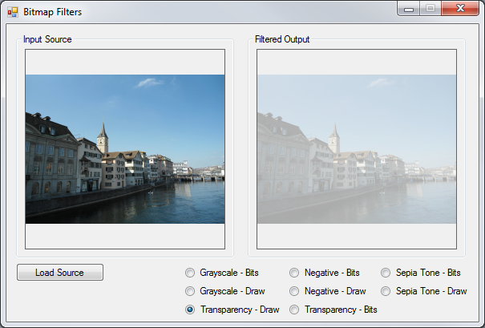
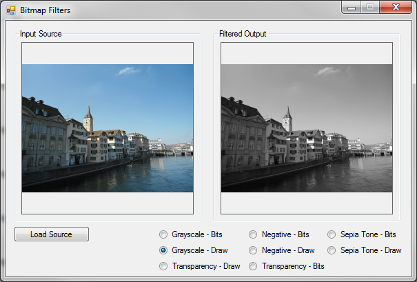
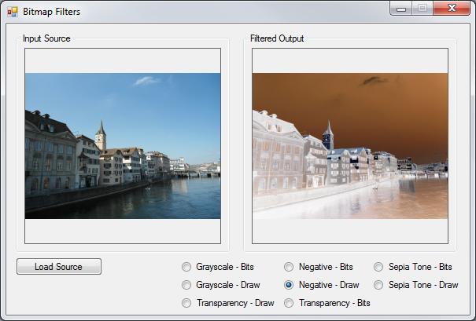

# ColorMatrix Image Filters
## Requires
- Visual Studio 2010
## License
- MS-LPL
## Technologies
- C#
- GDI+
- ASP.NET
- .NET
- Windows Forms
- Visual Studio 2010
- .NET Framework 4
- .NET 3.0
- .NET Framework 3.5 SP1
- .NET Framework
- .NET Framework 4.0
- Windows General
- C# Language
- WinForms
- Visual C Sharp .NET
- Image process
- ASP.NET 4.5
- asp.net 4.0
- .NET 4.5
## Topics
- Graphics
- GDI+
- Graphics and 3D
- Images
- ImageViewer
- 2d graphics
- Image manipulation
- Image
- Imaging
- Generic C# resuable code
- Image Optimization
- C# Language Features
- System.Drawing.Drawing2D
- BitmapImage
- Load Image
- Extension methods
## Updated
- 03/03/2013
## Description
&nbsp;
<h1>Introduction</h1>

This article is based around creating basic <a title="Image" rel="tag" href="http://msdn.microsoft.com/en-us/library/system.drawing.image.aspx" target="_blank">
Image</a> filters. The different types of filters discussed are: <strong>Grayscale</strong>,
<strong>Transparency</strong>, <strong>Image Negative</strong> and <strong>Sepia tone</strong>. All filters are implemented as extension methods targeting the
<a href="http://msdn.microsoft.com/en-us/library/system.drawing.image.aspx">Image</a> class, as well as the
<a href="http://msdn.microsoft.com/en-us/library/system.drawing.bitmap.aspx">Bitmap</a> class as the result of inheritance and upcasting.

<strong><em>Note:</em></strong> This article is a follow up to
<a title="ARGB Image Filters" href="http://code.msdn.microsoft.com/ARGB-Image-Filters-57af976b" target="_blank">
ARGB Image Filters</a>. The previously published related article implements image filtering by performing calculations and updating image pixel colour component values namely Alpha, Red, Green and Blue. This article achieves the same image filtering through
 implementing various <a title="ColorMatrix" rel="tag" href="http://msdn.microsoft.com/en-us/library/system.drawing.imaging.colormatrix.aspx" target="_blank">
ColorMatrix</a> transformations, in essence providing an alternative solution. For the sake of convenience I have included the pixel manipulation extension methods in addition to the
<a title="ColorMatrix" rel="tag" href="http://msdn.microsoft.com/en-us/library/system.drawing.imaging.colormatrix.aspx" target="_blank">
ColorMatrix</a> extension methods detailed by this article.

<h1>Implementing a ColorMatrix</h1>

From <a title="ColorMatrix" rel="tag" href="http://msdn.microsoft.com/en-us/library/system.drawing.imaging.colormatrix.aspx" target="_blank">
MSDN Documentation</a>:

<blockquote>

Defines a 5 x 5 matrix that contains the coordinates for the RGBAW space. Several methods of the
<a href="http://msdn.microsoft.com/en-us/library/system.drawing.imaging.imageattributes.aspx">
ImageAttributes</a> class adjust image colors by using a color matrix. The matrix coefficients constitute a 5 x 5 linear transformation that is used for transforming ARGB homogeneous values. For example, an ARGB vector is represented as red, green, blue, alpha
 and w, where w is always 1.

</blockquote>

When implementing a translation using the <a title="ColorMatrix" rel="tag" href="http://msdn.microsoft.com/en-us/library/system.drawing.imaging.colormatrix.aspx" target="_blank">
ColorMatrix</a> class values specified are added to one or more of the four colour components. A value that is to be added may only range from 0 to 1 inclusive. Note that adding a negative value results in subtracting values. A good article that illustrates
 implementing a <a title="ColorMatrix" rel="tag" href="http://msdn.microsoft.com/en-us/library/system.drawing.imaging.colormatrix.aspx" target="_blank">
ColorMatrix</a> can be found here: <a href="http://msdn.microsoft.com/library/ys160710.aspx">
How to: Translate Image Colors</a>.

The following code snippet provides the implementation of the
<strong><em>ApplyColorMatrix</em></strong> method.&nbsp;

C#

Edit|Remove

csharp
<pre class="hidden">private static Bitmap ApplyColorMatrix(Image sourceImage, ColorMatrix colorMatrix)
{
    Bitmap bmp32BppSource = GetArgbCopy(sourceImage);
    Bitmap bmp32BppDest = new Bitmap(bmp32BppSource.Width, bmp32BppSource.Height, 
PixelFormat.Format32bppArgb);

    using (Graphics graphics = Graphics.FromImage(bmp32BppDest))
    {
        ImageAttributes bmpAttributes = new ImageAttributes();
        bmpAttributes.SetColorMatrix(colorMatrix);

        graphics.DrawImage(bmp32BppSource, new Rectangle(0, 0, bmp32BppSource.Width,
              bmp32BppSource.Height),
              0, 0, bmp32BppSource.Width,
              bmp32BppSource.Height, GraphicsUnit.Pixel, bmpAttributes);

    }

    bmp32BppSource.Dispose();

    return bmp32BppDest;
}</pre>

<pre class="csharp">private&nbsp;static&nbsp;Bitmap&nbsp;ApplyColorMatrix(Image&nbsp;sourceImage,&nbsp;ColorMatrix&nbsp;colorMatrix)&nbsp;
{&nbsp;
&nbsp;&nbsp;&nbsp;&nbsp;Bitmap&nbsp;bmp32BppSource&nbsp;=&nbsp;GetArgbCopy(sourceImage);&nbsp;
&nbsp;&nbsp;&nbsp;&nbsp;Bitmap&nbsp;bmp32BppDest&nbsp;=&nbsp;new&nbsp;Bitmap(bmp32BppSource.Width,&nbsp;bmp32BppSource.Height,&nbsp;&nbsp;
PixelFormat.Format32bppArgb);&nbsp;
&nbsp;
&nbsp;&nbsp;&nbsp;&nbsp;using&nbsp;(Graphics&nbsp;graphics&nbsp;=&nbsp;Graphics.FromImage(bmp32BppDest))&nbsp;
&nbsp;&nbsp;&nbsp;&nbsp;{&nbsp;
&nbsp;&nbsp;&nbsp;&nbsp;&nbsp;&nbsp;&nbsp;&nbsp;ImageAttributes&nbsp;bmpAttributes&nbsp;=&nbsp;new&nbsp;ImageAttributes();&nbsp;
&nbsp;&nbsp;&nbsp;&nbsp;&nbsp;&nbsp;&nbsp;&nbsp;bmpAttributes.SetColorMatrix(colorMatrix);&nbsp;
&nbsp;
&nbsp;&nbsp;&nbsp;&nbsp;&nbsp;&nbsp;&nbsp;&nbsp;graphics.DrawImage(bmp32BppSource,&nbsp;new&nbsp;Rectangle(0,&nbsp;0,&nbsp;bmp32BppSource.Width,&nbsp;
&nbsp;&nbsp;&nbsp;&nbsp;&nbsp;&nbsp;&nbsp;&nbsp;&nbsp;&nbsp;&nbsp;&nbsp;&nbsp;&nbsp;bmp32BppSource.Height),&nbsp;
&nbsp;&nbsp;&nbsp;&nbsp;&nbsp;&nbsp;&nbsp;&nbsp;&nbsp;&nbsp;&nbsp;&nbsp;&nbsp;&nbsp;0,&nbsp;0,&nbsp;bmp32BppSource.Width,&nbsp;
&nbsp;&nbsp;&nbsp;&nbsp;&nbsp;&nbsp;&nbsp;&nbsp;&nbsp;&nbsp;&nbsp;&nbsp;&nbsp;&nbsp;bmp32BppSource.Height,&nbsp;GraphicsUnit.Pixel,&nbsp;bmpAttributes);&nbsp;
&nbsp;
&nbsp;&nbsp;&nbsp;&nbsp;}&nbsp;
&nbsp;
&nbsp;&nbsp;&nbsp;&nbsp;bmp32BppSource.Dispose();&nbsp;
&nbsp;
&nbsp;&nbsp;&nbsp;&nbsp;return&nbsp;bmp32BppDest;&nbsp;
}</pre>

The <strong><em>ApplyColorMatrix</em></strong> method signature defines a parameter of type Image and a second parameter of type
<a title="ColorMatrix" rel="tag" href="http://msdn.microsoft.com/en-us/library/system.drawing.imaging.colormatrix.aspx" target="_blank">
ColorMatrix</a>. This method is intended to apply the specified <a title="ColorMatrix" rel="tag" href="http://msdn.microsoft.com/en-us/library/system.drawing.imaging.colormatrix.aspx" target="_blank">
ColorMatrix</a> upon the Image parameter specified.

The source image is firstly copied in order to ensure that the image that is to be transformed is defined with a pixel format of 32 bits per pixel, consisting of the colour components Alpha, Red, Green and Blue &ndash;
<a title="PixelFormat.Format32bppArgb" rel="tag" href="http://msdn.microsoft.com/en-us/library/system.drawing.imaging.pixelformat.aspx" target="_blank">
PixelFormat.Format32bppArgb</a>. Next we create a blank memory bitmap defined to reflect the same size dimensions as the original source image. A
<a title="ColorMatrix" rel="tag" href="http://msdn.microsoft.com/en-us/library/system.drawing.imaging.colormatrix.aspx" target="_blank">
ColorMatrix</a> can be implemented by means of applying an <a title="ImageAttribute" rel="tag" href="http://msdn.microsoft.com/en-us/library/system.drawing.imaging.imageattributes.aspx" target="_blank">
ImageAttribute</a> when invoking the <a title="DrawImage" rel="tag" href="http://msdn.microsoft.com/en-us/library/system.drawing.graphics.drawimage.aspx" target="_blank">
DrawImage</a> defined by the <a title="Graphics" rel="tag" href="http://msdn.microsoft.com/en-us/library/system.drawing.graphics.aspx" target="_blank">
Graphics</a> class.&nbsp;

<h1>Creating an ARGB copy</h1>

The source code snippet listed below converts source images into 32Bit ARGB formatted images:

C#

Edit|Remove

csharp
<pre class="hidden">private static Bitmap GetArgbCopy(Image sourceImage)
{
    Bitmap bmpNew = new Bitmap(sourceImage.Width, sourceImage.Height, PixelFormat.Format32bppArgb);

    using (Graphics graphics = Graphics.FromImage(bmpNew))
    {
        graphics.DrawImage(sourceImage, new Rectangle(0, 0, bmpNew.Width, bmpNew.Height),
            new Rectangle(0, 0, bmpNew.Width, bmpNew.Height), GraphicsUnit.Pixel);
        graphics.Flush();
    }

    return bmpNew;
}</pre>

<pre class="csharp">private&nbsp;static&nbsp;Bitmap&nbsp;GetArgbCopy(Image&nbsp;sourceImage)&nbsp;
{&nbsp;
&nbsp;&nbsp;&nbsp;&nbsp;Bitmap&nbsp;bmpNew&nbsp;=&nbsp;new&nbsp;Bitmap(sourceImage.Width,&nbsp;sourceImage.Height,&nbsp;PixelFormat.Format32bppArgb);&nbsp;
&nbsp;
&nbsp;&nbsp;&nbsp;&nbsp;using&nbsp;(Graphics&nbsp;graphics&nbsp;=&nbsp;Graphics.FromImage(bmpNew))&nbsp;
&nbsp;&nbsp;&nbsp;&nbsp;{&nbsp;
&nbsp;&nbsp;&nbsp;&nbsp;&nbsp;&nbsp;&nbsp;&nbsp;graphics.DrawImage(sourceImage,&nbsp;new&nbsp;Rectangle(0,&nbsp;0,&nbsp;bmpNew.Width,&nbsp;bmpNew.Height),&nbsp;
&nbsp;&nbsp;&nbsp;&nbsp;&nbsp;&nbsp;&nbsp;&nbsp;&nbsp;&nbsp;&nbsp;&nbsp;new&nbsp;Rectangle(0,&nbsp;0,&nbsp;bmpNew.Width,&nbsp;bmpNew.Height),&nbsp;GraphicsUnit.Pixel);&nbsp;
&nbsp;&nbsp;&nbsp;&nbsp;&nbsp;&nbsp;&nbsp;&nbsp;graphics.Flush();&nbsp;
&nbsp;&nbsp;&nbsp;&nbsp;}&nbsp;
&nbsp;
&nbsp;&nbsp;&nbsp;&nbsp;return&nbsp;bmpNew;&nbsp;
}</pre>

&nbsp;

The <strong><em>GetArgbCopy</em></strong> method creates a blank memory
<a href="http://msdn.microsoft.com/en-us/library/system.drawing.bitmap.aspx">Bitmap</a> having the same size dimensions as the source image. The newly created
<a href="http://msdn.microsoft.com/en-us/library/system.drawing.bitmap.aspx">Bitmap</a> is explicitly specified to conform to a 32Bit ARGB format. By making use of a
<a href="http://msdn.microsoft.com/en-us/library/system.drawing.graphics.aspx">Graphics</a> object of which the context is bound to the new
<a href="http://msdn.microsoft.com/en-us/library/system.drawing.bitmap.aspx">Bitmap</a> instance the source code draws the original image to the new
<a href="http://msdn.microsoft.com/en-us/library/system.drawing.bitmap.aspx">Bitmap</a>.

&nbsp;

<h1>The Transparency Filter</h1>

The transparency filter is intended to create a copy of an image, increase the copy&rsquo;s level of transparency and return the modified copy to the calling code. Listed below is source code which defines the
<strong><em>DrawWithTransparency </em></strong><a href="http://msdn.microsoft.com/en-us/library/vstudio/bb383977.aspx">extension method</a>.

C#

Edit|Remove

csharp
<pre class="hidden">public static Bitmap DrawWithTransparency(this Image sourceImage)
{
    ColorMatrix colorMatrix = new ColorMatrix(new float[][] 
                                        {
                                            new float[] {1, 0, 0, 0, 0},
                                            new float[] {0, 1, 0, 0, 0},
                                            new float[] {0, 0, 1, 0, 0},
                                            new float[] {0, 0, 0, 0.3f, 0},
                                            new float[] {0, 0, 0, 0, 1}
                                        });
            
    return ApplyColorMatrix(sourceImage, colorMatrix);
}</pre>

<pre class="csharp">publicstatic&nbsp;Bitmap&nbsp;DrawWithTransparency(this&nbsp;Image&nbsp;sourceImage)&nbsp;
{&nbsp;
&nbsp;&nbsp;&nbsp;&nbsp;ColorMatrix&nbsp;colorMatrix&nbsp;=&nbsp;new&nbsp;ColorMatrix(newfloat[][]&nbsp;&nbsp;
&nbsp;&nbsp;&nbsp;&nbsp;&nbsp;&nbsp;&nbsp;&nbsp;&nbsp;&nbsp;&nbsp;&nbsp;&nbsp;&nbsp;&nbsp;&nbsp;&nbsp;&nbsp;&nbsp;&nbsp;&nbsp;&nbsp;&nbsp;&nbsp;&nbsp;&nbsp;&nbsp;&nbsp;&nbsp;&nbsp;&nbsp;&nbsp;&nbsp;&nbsp;&nbsp;&nbsp;&nbsp;&nbsp;&nbsp;&nbsp;{&nbsp;
&nbsp;&nbsp;&nbsp;&nbsp;&nbsp;&nbsp;&nbsp;&nbsp;&nbsp;&nbsp;&nbsp;&nbsp;&nbsp;&nbsp;&nbsp;&nbsp;&nbsp;&nbsp;&nbsp;&nbsp;&nbsp;&nbsp;&nbsp;&nbsp;&nbsp;&nbsp;&nbsp;&nbsp;&nbsp;&nbsp;&nbsp;&nbsp;&nbsp;&nbsp;&nbsp;&nbsp;&nbsp;&nbsp;&nbsp;&nbsp;&nbsp;&nbsp;&nbsp;&nbsp;newfloat[]&nbsp;{1,&nbsp;0,&nbsp;0,&nbsp;0,&nbsp;0},&nbsp;
&nbsp;&nbsp;&nbsp;&nbsp;&nbsp;&nbsp;&nbsp;&nbsp;&nbsp;&nbsp;&nbsp;&nbsp;&nbsp;&nbsp;&nbsp;&nbsp;&nbsp;&nbsp;&nbsp;&nbsp;&nbsp;&nbsp;&nbsp;&nbsp;&nbsp;&nbsp;&nbsp;&nbsp;&nbsp;&nbsp;&nbsp;&nbsp;&nbsp;&nbsp;&nbsp;&nbsp;&nbsp;&nbsp;&nbsp;&nbsp;&nbsp;&nbsp;&nbsp;&nbsp;newfloat[]&nbsp;{0,&nbsp;1,&nbsp;0,&nbsp;0,&nbsp;0},&nbsp;
&nbsp;&nbsp;&nbsp;&nbsp;&nbsp;&nbsp;&nbsp;&nbsp;&nbsp;&nbsp;&nbsp;&nbsp;&nbsp;&nbsp;&nbsp;&nbsp;&nbsp;&nbsp;&nbsp;&nbsp;&nbsp;&nbsp;&nbsp;&nbsp;&nbsp;&nbsp;&nbsp;&nbsp;&nbsp;&nbsp;&nbsp;&nbsp;&nbsp;&nbsp;&nbsp;&nbsp;&nbsp;&nbsp;&nbsp;&nbsp;&nbsp;&nbsp;&nbsp;&nbsp;newfloat[]&nbsp;{0,&nbsp;0,&nbsp;1,&nbsp;0,&nbsp;0},&nbsp;
&nbsp;&nbsp;&nbsp;&nbsp;&nbsp;&nbsp;&nbsp;&nbsp;&nbsp;&nbsp;&nbsp;&nbsp;&nbsp;&nbsp;&nbsp;&nbsp;&nbsp;&nbsp;&nbsp;&nbsp;&nbsp;&nbsp;&nbsp;&nbsp;&nbsp;&nbsp;&nbsp;&nbsp;&nbsp;&nbsp;&nbsp;&nbsp;&nbsp;&nbsp;&nbsp;&nbsp;&nbsp;&nbsp;&nbsp;&nbsp;&nbsp;&nbsp;&nbsp;&nbsp;newfloat[]&nbsp;{0,&nbsp;0,&nbsp;0,&nbsp;0.3f,&nbsp;0},&nbsp;
&nbsp;&nbsp;&nbsp;&nbsp;&nbsp;&nbsp;&nbsp;&nbsp;&nbsp;&nbsp;&nbsp;&nbsp;&nbsp;&nbsp;&nbsp;&nbsp;&nbsp;&nbsp;&nbsp;&nbsp;&nbsp;&nbsp;&nbsp;&nbsp;&nbsp;&nbsp;&nbsp;&nbsp;&nbsp;&nbsp;&nbsp;&nbsp;&nbsp;&nbsp;&nbsp;&nbsp;&nbsp;&nbsp;&nbsp;&nbsp;&nbsp;&nbsp;&nbsp;&nbsp;newfloat[]&nbsp;{0,&nbsp;0,&nbsp;0,&nbsp;0,&nbsp;1}&nbsp;
&nbsp;&nbsp;&nbsp;&nbsp;&nbsp;&nbsp;&nbsp;&nbsp;&nbsp;&nbsp;&nbsp;&nbsp;&nbsp;&nbsp;&nbsp;&nbsp;&nbsp;&nbsp;&nbsp;&nbsp;&nbsp;&nbsp;&nbsp;&nbsp;&nbsp;&nbsp;&nbsp;&nbsp;&nbsp;&nbsp;&nbsp;&nbsp;&nbsp;&nbsp;&nbsp;&nbsp;&nbsp;&nbsp;&nbsp;&nbsp;});&nbsp;
&nbsp;&nbsp;&nbsp;&nbsp;&nbsp;&nbsp;&nbsp;&nbsp;&nbsp;&nbsp;&nbsp;&nbsp;&nbsp;
&nbsp;&nbsp;&nbsp;&nbsp;return&nbsp;ApplyColorMatrix(sourceImage,&nbsp;colorMatrix);&nbsp;
}</pre>

Due to the <strong><em>ApplyColorMatrix</em></strong> method defined earlier implementing an image filter simply consists of defining the filter algorithm in the form of a
<a title="ColorMatrix" rel="tag" href="http://msdn.microsoft.com/en-us/library/system.drawing.imaging.colormatrix.aspx" target="_blank">
ColorMatrix</a> and then invoking <strong><em>ApplyColorMatrix. </em></strong>The
<a title="ColorMatrix" rel="tag" href="http://msdn.microsoft.com/en-us/library/system.drawing.imaging.colormatrix.aspx" target="_blank">
ColorMatrix</a> is defined to apply no change to the Red, Green and Blue components whilst reducing the Alpha component by 70%.

&nbsp;

&nbsp;

&nbsp;

<h1>The Grayscale Filter</h1>

All of the image filter extension methods illustrated in this article are implemented in a fashion similar to the
<strong><em>DrawWithTransparency</em> method. The <em>DrawAsGrayscale </em></strong>extension method is implemented as follows:

&nbsp;

C#

Edit|Remove

csharp
<pre class="hidden">public static Bitmap DrawAsGrayscale(this Image sourceImage)
{
    ColorMatrix colorMatrix = new ColorMatrix(new float[][] 
                                        {
                                            new float[] {.3f, .3f, .3f, 0, 0},
                                            new float[] {.59f, .59f, .59f, 0, 0},
                                            new float[] {.11f, .11f, .11f, 0, 0},
                                            new float[] {0, 0, 0, 1, 0},
                                            new float[] {0, 0, 0, 0, 1}
                                        });

    return ApplyColorMatrix(sourceImage, colorMatrix);
}</pre>

<pre class="csharp">public&nbsp;static&nbsp;Bitmap&nbsp;DrawAsGrayscale(this&nbsp;Image&nbsp;sourceImage)&nbsp;
{&nbsp;
&nbsp;&nbsp;&nbsp;&nbsp;ColorMatrix&nbsp;colorMatrix&nbsp;=&nbsp;new&nbsp;ColorMatrix(new&nbsp;float[][]&nbsp;&nbsp;
&nbsp;&nbsp;&nbsp;&nbsp;&nbsp;&nbsp;&nbsp;&nbsp;&nbsp;&nbsp;&nbsp;&nbsp;&nbsp;&nbsp;&nbsp;&nbsp;&nbsp;&nbsp;&nbsp;&nbsp;&nbsp;&nbsp;&nbsp;&nbsp;&nbsp;&nbsp;&nbsp;&nbsp;&nbsp;&nbsp;&nbsp;&nbsp;&nbsp;&nbsp;&nbsp;&nbsp;&nbsp;&nbsp;&nbsp;&nbsp;{&nbsp;
&nbsp;&nbsp;&nbsp;&nbsp;&nbsp;&nbsp;&nbsp;&nbsp;&nbsp;&nbsp;&nbsp;&nbsp;&nbsp;&nbsp;&nbsp;&nbsp;&nbsp;&nbsp;&nbsp;&nbsp;&nbsp;&nbsp;&nbsp;&nbsp;&nbsp;&nbsp;&nbsp;&nbsp;&nbsp;&nbsp;&nbsp;&nbsp;&nbsp;&nbsp;&nbsp;&nbsp;&nbsp;&nbsp;&nbsp;&nbsp;&nbsp;&nbsp;&nbsp;&nbsp;new&nbsp;float[]&nbsp;{.3f,&nbsp;.3f,&nbsp;.3f,&nbsp;0,&nbsp;0},&nbsp;
&nbsp;&nbsp;&nbsp;&nbsp;&nbsp;&nbsp;&nbsp;&nbsp;&nbsp;&nbsp;&nbsp;&nbsp;&nbsp;&nbsp;&nbsp;&nbsp;&nbsp;&nbsp;&nbsp;&nbsp;&nbsp;&nbsp;&nbsp;&nbsp;&nbsp;&nbsp;&nbsp;&nbsp;&nbsp;&nbsp;&nbsp;&nbsp;&nbsp;&nbsp;&nbsp;&nbsp;&nbsp;&nbsp;&nbsp;&nbsp;&nbsp;&nbsp;&nbsp;&nbsp;new&nbsp;float[]&nbsp;{.59f,&nbsp;.59f,&nbsp;.59f,&nbsp;0,&nbsp;0},&nbsp;
&nbsp;&nbsp;&nbsp;&nbsp;&nbsp;&nbsp;&nbsp;&nbsp;&nbsp;&nbsp;&nbsp;&nbsp;&nbsp;&nbsp;&nbsp;&nbsp;&nbsp;&nbsp;&nbsp;&nbsp;&nbsp;&nbsp;&nbsp;&nbsp;&nbsp;&nbsp;&nbsp;&nbsp;&nbsp;&nbsp;&nbsp;&nbsp;&nbsp;&nbsp;&nbsp;&nbsp;&nbsp;&nbsp;&nbsp;&nbsp;&nbsp;&nbsp;&nbsp;&nbsp;new&nbsp;float[]&nbsp;{.11f,&nbsp;.11f,&nbsp;.11f,&nbsp;0,&nbsp;0},&nbsp;
&nbsp;&nbsp;&nbsp;&nbsp;&nbsp;&nbsp;&nbsp;&nbsp;&nbsp;&nbsp;&nbsp;&nbsp;&nbsp;&nbsp;&nbsp;&nbsp;&nbsp;&nbsp;&nbsp;&nbsp;&nbsp;&nbsp;&nbsp;&nbsp;&nbsp;&nbsp;&nbsp;&nbsp;&nbsp;&nbsp;&nbsp;&nbsp;&nbsp;&nbsp;&nbsp;&nbsp;&nbsp;&nbsp;&nbsp;&nbsp;&nbsp;&nbsp;&nbsp;&nbsp;new&nbsp;float[]&nbsp;{0,&nbsp;0,&nbsp;0,&nbsp;1,&nbsp;0},&nbsp;
&nbsp;&nbsp;&nbsp;&nbsp;&nbsp;&nbsp;&nbsp;&nbsp;&nbsp;&nbsp;&nbsp;&nbsp;&nbsp;&nbsp;&nbsp;&nbsp;&nbsp;&nbsp;&nbsp;&nbsp;&nbsp;&nbsp;&nbsp;&nbsp;&nbsp;&nbsp;&nbsp;&nbsp;&nbsp;&nbsp;&nbsp;&nbsp;&nbsp;&nbsp;&nbsp;&nbsp;&nbsp;&nbsp;&nbsp;&nbsp;&nbsp;&nbsp;&nbsp;&nbsp;new&nbsp;float[]&nbsp;{0,&nbsp;0,&nbsp;0,&nbsp;0,&nbsp;1}&nbsp;
&nbsp;&nbsp;&nbsp;&nbsp;&nbsp;&nbsp;&nbsp;&nbsp;&nbsp;&nbsp;&nbsp;&nbsp;&nbsp;&nbsp;&nbsp;&nbsp;&nbsp;&nbsp;&nbsp;&nbsp;&nbsp;&nbsp;&nbsp;&nbsp;&nbsp;&nbsp;&nbsp;&nbsp;&nbsp;&nbsp;&nbsp;&nbsp;&nbsp;&nbsp;&nbsp;&nbsp;&nbsp;&nbsp;&nbsp;&nbsp;});&nbsp;
&nbsp;
&nbsp;&nbsp;&nbsp;&nbsp;return&nbsp;ApplyColorMatrix(sourceImage,&nbsp;colorMatrix);&nbsp;
}</pre>

&nbsp;

The grayscale filter is achieved by adding together 11% blue, 59% green and 30% red, then assigning the total value to each colour component.

&nbsp;

&nbsp;

<h1>The Sepia Tone Filter</h1>

The sepia tone filter is implemented in the extension method
<strong><em>DrawAsSepiaTone</em></strong>. Notice how this method follows the same convention as the previously discussed filters. The source code listing is detailed below.

C#

Edit|Remove

csharp
<pre class="hidden">public static Bitmap DrawAsSepiaTone(this Image sourceImage)
{
    ColorMatrix colorMatrix = new ColorMatrix(new float[][] 
                                        {
                                            new float[] {.393f, .349f, .272f, 0, 0},
                                            new float[] {.769f, .686f, .534f, 0, 0},
                                            new float[] {.189f, .168f, .131f, 0, 0},
                                            new float[] {0, 0, 0, 1, 0},
                                            new float[] {0, 0, 0, 0, 1}
                                        });

    return ApplyColorMatrix(sourceImage, colorMatrix);
}</pre>

<pre class="csharp">publicstatic&nbsp;Bitmap&nbsp;DrawAsSepiaTone(this&nbsp;Image&nbsp;sourceImage)&nbsp;
{&nbsp;
&nbsp;&nbsp;&nbsp;&nbsp;ColorMatrix&nbsp;colorMatrix&nbsp;=&nbsp;new&nbsp;ColorMatrix(newfloat[][]&nbsp;&nbsp;
&nbsp;&nbsp;&nbsp;&nbsp;&nbsp;&nbsp;&nbsp;&nbsp;&nbsp;&nbsp;&nbsp;&nbsp;&nbsp;&nbsp;&nbsp;&nbsp;&nbsp;&nbsp;&nbsp;&nbsp;&nbsp;&nbsp;&nbsp;&nbsp;&nbsp;&nbsp;&nbsp;&nbsp;&nbsp;&nbsp;&nbsp;&nbsp;&nbsp;&nbsp;&nbsp;&nbsp;&nbsp;&nbsp;&nbsp;&nbsp;{&nbsp;
&nbsp;&nbsp;&nbsp;&nbsp;&nbsp;&nbsp;&nbsp;&nbsp;&nbsp;&nbsp;&nbsp;&nbsp;&nbsp;&nbsp;&nbsp;&nbsp;&nbsp;&nbsp;&nbsp;&nbsp;&nbsp;&nbsp;&nbsp;&nbsp;&nbsp;&nbsp;&nbsp;&nbsp;&nbsp;&nbsp;&nbsp;&nbsp;&nbsp;&nbsp;&nbsp;&nbsp;&nbsp;&nbsp;&nbsp;&nbsp;&nbsp;&nbsp;&nbsp;&nbsp;newfloat[]&nbsp;{.393f,&nbsp;.349f,&nbsp;.272f,&nbsp;0,&nbsp;0},&nbsp;
&nbsp;&nbsp;&nbsp;&nbsp;&nbsp;&nbsp;&nbsp;&nbsp;&nbsp;&nbsp;&nbsp;&nbsp;&nbsp;&nbsp;&nbsp;&nbsp;&nbsp;&nbsp;&nbsp;&nbsp;&nbsp;&nbsp;&nbsp;&nbsp;&nbsp;&nbsp;&nbsp;&nbsp;&nbsp;&nbsp;&nbsp;&nbsp;&nbsp;&nbsp;&nbsp;&nbsp;&nbsp;&nbsp;&nbsp;&nbsp;&nbsp;&nbsp;&nbsp;&nbsp;newfloat[]&nbsp;{.769f,&nbsp;.686f,&nbsp;.534f,&nbsp;0,&nbsp;0},&nbsp;
&nbsp;&nbsp;&nbsp;&nbsp;&nbsp;&nbsp;&nbsp;&nbsp;&nbsp;&nbsp;&nbsp;&nbsp;&nbsp;&nbsp;&nbsp;&nbsp;&nbsp;&nbsp;&nbsp;&nbsp;&nbsp;&nbsp;&nbsp;&nbsp;&nbsp;&nbsp;&nbsp;&nbsp;&nbsp;&nbsp;&nbsp;&nbsp;&nbsp;&nbsp;&nbsp;&nbsp;&nbsp;&nbsp;&nbsp;&nbsp;&nbsp;&nbsp;&nbsp;&nbsp;newfloat[]&nbsp;{.189f,&nbsp;.168f,&nbsp;.131f,&nbsp;0,&nbsp;0},&nbsp;
&nbsp;&nbsp;&nbsp;&nbsp;&nbsp;&nbsp;&nbsp;&nbsp;&nbsp;&nbsp;&nbsp;&nbsp;&nbsp;&nbsp;&nbsp;&nbsp;&nbsp;&nbsp;&nbsp;&nbsp;&nbsp;&nbsp;&nbsp;&nbsp;&nbsp;&nbsp;&nbsp;&nbsp;&nbsp;&nbsp;&nbsp;&nbsp;&nbsp;&nbsp;&nbsp;&nbsp;&nbsp;&nbsp;&nbsp;&nbsp;&nbsp;&nbsp;&nbsp;&nbsp;newfloat[]&nbsp;{0,&nbsp;0,&nbsp;0,&nbsp;1,&nbsp;0},&nbsp;
&nbsp;&nbsp;&nbsp;&nbsp;&nbsp;&nbsp;&nbsp;&nbsp;&nbsp;&nbsp;&nbsp;&nbsp;&nbsp;&nbsp;&nbsp;&nbsp;&nbsp;&nbsp;&nbsp;&nbsp;&nbsp;&nbsp;&nbsp;&nbsp;&nbsp;&nbsp;&nbsp;&nbsp;&nbsp;&nbsp;&nbsp;&nbsp;&nbsp;&nbsp;&nbsp;&nbsp;&nbsp;&nbsp;&nbsp;&nbsp;&nbsp;&nbsp;&nbsp;&nbsp;newfloat[]&nbsp;{0,&nbsp;0,&nbsp;0,&nbsp;0,&nbsp;1}&nbsp;
&nbsp;&nbsp;&nbsp;&nbsp;&nbsp;&nbsp;&nbsp;&nbsp;&nbsp;&nbsp;&nbsp;&nbsp;&nbsp;&nbsp;&nbsp;&nbsp;&nbsp;&nbsp;&nbsp;&nbsp;&nbsp;&nbsp;&nbsp;&nbsp;&nbsp;&nbsp;&nbsp;&nbsp;&nbsp;&nbsp;&nbsp;&nbsp;&nbsp;&nbsp;&nbsp;&nbsp;&nbsp;&nbsp;&nbsp;&nbsp;});&nbsp;
&nbsp;
&nbsp;&nbsp;&nbsp;&nbsp;return&nbsp;ApplyColorMatrix(sourceImage,&nbsp;colorMatrix);&nbsp;
}</pre>

The formula used to calculate a sepia tone differs significantly from the grayscale filter discussed previously. The formula can be simplified as follows:

<ul>
<li>

<strong>Red Component:</strong> <em>Sum total of:</em> 39.3% red, 34.9% green , 27.2% blue

</li><li>

<strong>Green Component:</strong> <em>Sum total of:</em> 76.9% red, 68.6% green , 53.4% blue

</li><li>

<strong>Blue Component:</strong> <em>Sum total of:</em> 18.9% red, 16.8% green , 13.1% blue

&nbsp; </li></ul>

&nbsp;

<h1>The Negative Image Filter</h1>

We can implement an image filter that resembles film negatives by literally inverting every pixel&rsquo;s colour components. Listed below is the source code implementation of the
<strong><em>DrawAsNegative</em></strong> extension method.

C#

Edit|Remove

csharp
<pre class="hidden">public static Bitmap DrawAsNegative(this Image sourceImage)
{
    ColorMatrix colorMatrix = new ColorMatrix(new float[][] 
                                        {
                                            new float[] {-1, 0, 0, 0, 0},
                                            new float[] {0, -1, 0, 0, 0},
                                            new float[] {0, 0, -1, 0, 0},
                                            new float[] {0, 0, 0, 1, 0},
                                            new float[] {1, 1, 1, 1, 1}
                                        });

    return ApplyColorMatrix(sourceImage, colorMatrix);
}</pre>

<pre class="csharp">public&nbsp;static&nbsp;Bitmap&nbsp;DrawAsNegative(this&nbsp;Image&nbsp;sourceImage)&nbsp;
{&nbsp;
&nbsp;&nbsp;&nbsp;&nbsp;ColorMatrix&nbsp;colorMatrix&nbsp;=&nbsp;new&nbsp;ColorMatrix(new&nbsp;float[][]&nbsp;&nbsp;
&nbsp;&nbsp;&nbsp;&nbsp;&nbsp;&nbsp;&nbsp;&nbsp;&nbsp;&nbsp;&nbsp;&nbsp;&nbsp;&nbsp;&nbsp;&nbsp;&nbsp;&nbsp;&nbsp;&nbsp;&nbsp;&nbsp;&nbsp;&nbsp;&nbsp;&nbsp;&nbsp;&nbsp;&nbsp;&nbsp;&nbsp;&nbsp;&nbsp;&nbsp;&nbsp;&nbsp;&nbsp;&nbsp;&nbsp;&nbsp;{&nbsp;
&nbsp;&nbsp;&nbsp;&nbsp;&nbsp;&nbsp;&nbsp;&nbsp;&nbsp;&nbsp;&nbsp;&nbsp;&nbsp;&nbsp;&nbsp;&nbsp;&nbsp;&nbsp;&nbsp;&nbsp;&nbsp;&nbsp;&nbsp;&nbsp;&nbsp;&nbsp;&nbsp;&nbsp;&nbsp;&nbsp;&nbsp;&nbsp;&nbsp;&nbsp;&nbsp;&nbsp;&nbsp;&nbsp;&nbsp;&nbsp;&nbsp;&nbsp;&nbsp;&nbsp;new&nbsp;float[]&nbsp;{-1,&nbsp;0,&nbsp;0,&nbsp;0,&nbsp;0},&nbsp;
&nbsp;&nbsp;&nbsp;&nbsp;&nbsp;&nbsp;&nbsp;&nbsp;&nbsp;&nbsp;&nbsp;&nbsp;&nbsp;&nbsp;&nbsp;&nbsp;&nbsp;&nbsp;&nbsp;&nbsp;&nbsp;&nbsp;&nbsp;&nbsp;&nbsp;&nbsp;&nbsp;&nbsp;&nbsp;&nbsp;&nbsp;&nbsp;&nbsp;&nbsp;&nbsp;&nbsp;&nbsp;&nbsp;&nbsp;&nbsp;&nbsp;&nbsp;&nbsp;&nbsp;new&nbsp;float[]&nbsp;{0,&nbsp;-1,&nbsp;0,&nbsp;0,&nbsp;0},&nbsp;
&nbsp;&nbsp;&nbsp;&nbsp;&nbsp;&nbsp;&nbsp;&nbsp;&nbsp;&nbsp;&nbsp;&nbsp;&nbsp;&nbsp;&nbsp;&nbsp;&nbsp;&nbsp;&nbsp;&nbsp;&nbsp;&nbsp;&nbsp;&nbsp;&nbsp;&nbsp;&nbsp;&nbsp;&nbsp;&nbsp;&nbsp;&nbsp;&nbsp;&nbsp;&nbsp;&nbsp;&nbsp;&nbsp;&nbsp;&nbsp;&nbsp;&nbsp;&nbsp;&nbsp;new&nbsp;float[]&nbsp;{0,&nbsp;0,&nbsp;-1,&nbsp;0,&nbsp;0},&nbsp;
&nbsp;&nbsp;&nbsp;&nbsp;&nbsp;&nbsp;&nbsp;&nbsp;&nbsp;&nbsp;&nbsp;&nbsp;&nbsp;&nbsp;&nbsp;&nbsp;&nbsp;&nbsp;&nbsp;&nbsp;&nbsp;&nbsp;&nbsp;&nbsp;&nbsp;&nbsp;&nbsp;&nbsp;&nbsp;&nbsp;&nbsp;&nbsp;&nbsp;&nbsp;&nbsp;&nbsp;&nbsp;&nbsp;&nbsp;&nbsp;&nbsp;&nbsp;&nbsp;&nbsp;new&nbsp;float[]&nbsp;{0,&nbsp;0,&nbsp;0,&nbsp;1,&nbsp;0},&nbsp;
&nbsp;&nbsp;&nbsp;&nbsp;&nbsp;&nbsp;&nbsp;&nbsp;&nbsp;&nbsp;&nbsp;&nbsp;&nbsp;&nbsp;&nbsp;&nbsp;&nbsp;&nbsp;&nbsp;&nbsp;&nbsp;&nbsp;&nbsp;&nbsp;&nbsp;&nbsp;&nbsp;&nbsp;&nbsp;&nbsp;&nbsp;&nbsp;&nbsp;&nbsp;&nbsp;&nbsp;&nbsp;&nbsp;&nbsp;&nbsp;&nbsp;&nbsp;&nbsp;&nbsp;new&nbsp;float[]&nbsp;{1,&nbsp;1,&nbsp;1,&nbsp;1,&nbsp;1}&nbsp;
&nbsp;&nbsp;&nbsp;&nbsp;&nbsp;&nbsp;&nbsp;&nbsp;&nbsp;&nbsp;&nbsp;&nbsp;&nbsp;&nbsp;&nbsp;&nbsp;&nbsp;&nbsp;&nbsp;&nbsp;&nbsp;&nbsp;&nbsp;&nbsp;&nbsp;&nbsp;&nbsp;&nbsp;&nbsp;&nbsp;&nbsp;&nbsp;&nbsp;&nbsp;&nbsp;&nbsp;&nbsp;&nbsp;&nbsp;&nbsp;});&nbsp;
&nbsp;
&nbsp;&nbsp;&nbsp;&nbsp;return&nbsp;ApplyColorMatrix(sourceImage,&nbsp;colorMatrix);&nbsp;
}</pre>

Notice how the negative image filter subtracts 1 from each colour component, remember the valid range being 0 to 1 inclusive. This
<a title="ColorMatrix" rel="tag" href="http://msdn.microsoft.com/en-us/library/system.drawing.imaging.colormatrix.aspx" target="_blank">
ColorMatrix</a> in reality inverts each pixel&rsquo;s colour component bits. The transform being applied can also be expressed as implementing the bitwise compliment operator on each pixel.

&nbsp;

&nbsp;

<h1>The implementation</h1>

The image filters described in this article are all implemented by means of a Windows Forms application. Image filtering is applied by selecting the corresponding radio button. The source image loaded from the file system
 serves as input to the various image filter methods, the filtered image copy returned will be displayed next to the original source image.

C#

Edit|Remove

csharp
<pre class="hidden">private void OnCheckChangedEventHandler(object sender, EventArgs e)
{
    if (picSource.BackgroundImage != null)
    {
        if (rdGrayscaleBits.Checked == true)
        {
            picOutput.BackgroundImage = picSource.BackgroundImage.CopyAsGrayscale();
        }
        else if (rdGrayscaleDraw.Checked == true)
        {
            picOutput.BackgroundImage = picSource.BackgroundImage.DrawAsGrayscale();
        }
        else if (rdTransparencyBits.Checked == true)
        {
            picOutput.BackgroundImage = picSource.BackgroundImage.CopyWithTransparency();
        }
        else if (rdTransparencyDraw.Checked == true)
        {
            picOutput.BackgroundImage = picSource.BackgroundImage.DrawWithTransparency();
        }
        else if (rdNegativeBits.Checked == true)
        {
            picOutput.BackgroundImage = picSource.BackgroundImage.CopyAsNegative();
        }
        else if (rdNegativeDraw.Checked == true)
        {
            picOutput.BackgroundImage = picSource.BackgroundImage.DrawAsNegative();
        }
        else if (rdSepiaBits.Checked == true)
        {
            picOutput.BackgroundImage = picSource.BackgroundImage.CopyAsSepiaTone();
        }
        else if (rdSepiaDraw.Checked == true)
        {
            picOutput.BackgroundImage = picSource.BackgroundImage.DrawAsSepiaTone();
        }
    }
}</pre>

<pre class="csharp">private&nbsp;void&nbsp;OnCheckChangedEventHandler(object&nbsp;sender,&nbsp;EventArgs&nbsp;e)&nbsp;
{&nbsp;
&nbsp;&nbsp;&nbsp;&nbsp;if&nbsp;(picSource.BackgroundImage&nbsp;!=&nbsp;null)&nbsp;
&nbsp;&nbsp;&nbsp;&nbsp;{&nbsp;
&nbsp;&nbsp;&nbsp;&nbsp;&nbsp;&nbsp;&nbsp;&nbsp;if&nbsp;(rdGrayscaleBits.Checked&nbsp;==&nbsp;true)&nbsp;
&nbsp;&nbsp;&nbsp;&nbsp;&nbsp;&nbsp;&nbsp;&nbsp;{&nbsp;
&nbsp;&nbsp;&nbsp;&nbsp;&nbsp;&nbsp;&nbsp;&nbsp;&nbsp;&nbsp;&nbsp;&nbsp;picOutput.BackgroundImage&nbsp;=&nbsp;picSource.BackgroundImage.CopyAsGrayscale();&nbsp;
&nbsp;&nbsp;&nbsp;&nbsp;&nbsp;&nbsp;&nbsp;&nbsp;}&nbsp;
&nbsp;&nbsp;&nbsp;&nbsp;&nbsp;&nbsp;&nbsp;&nbsp;else&nbsp;if&nbsp;(rdGrayscaleDraw.Checked&nbsp;==&nbsp;true)&nbsp;
&nbsp;&nbsp;&nbsp;&nbsp;&nbsp;&nbsp;&nbsp;&nbsp;{&nbsp;
&nbsp;&nbsp;&nbsp;&nbsp;&nbsp;&nbsp;&nbsp;&nbsp;&nbsp;&nbsp;&nbsp;&nbsp;picOutput.BackgroundImage&nbsp;=&nbsp;picSource.BackgroundImage.DrawAsGrayscale();&nbsp;
&nbsp;&nbsp;&nbsp;&nbsp;&nbsp;&nbsp;&nbsp;&nbsp;}&nbsp;
&nbsp;&nbsp;&nbsp;&nbsp;&nbsp;&nbsp;&nbsp;&nbsp;else&nbsp;if&nbsp;(rdTransparencyBits.Checked&nbsp;==&nbsp;true)&nbsp;
&nbsp;&nbsp;&nbsp;&nbsp;&nbsp;&nbsp;&nbsp;&nbsp;{&nbsp;
&nbsp;&nbsp;&nbsp;&nbsp;&nbsp;&nbsp;&nbsp;&nbsp;&nbsp;&nbsp;&nbsp;&nbsp;picOutput.BackgroundImage&nbsp;=&nbsp;picSource.BackgroundImage.CopyWithTransparency();&nbsp;
&nbsp;&nbsp;&nbsp;&nbsp;&nbsp;&nbsp;&nbsp;&nbsp;}&nbsp;
&nbsp;&nbsp;&nbsp;&nbsp;&nbsp;&nbsp;&nbsp;&nbsp;else&nbsp;if&nbsp;(rdTransparencyDraw.Checked&nbsp;==&nbsp;true)&nbsp;
&nbsp;&nbsp;&nbsp;&nbsp;&nbsp;&nbsp;&nbsp;&nbsp;{&nbsp;
&nbsp;&nbsp;&nbsp;&nbsp;&nbsp;&nbsp;&nbsp;&nbsp;&nbsp;&nbsp;&nbsp;&nbsp;picOutput.BackgroundImage&nbsp;=&nbsp;picSource.BackgroundImage.DrawWithTransparency();&nbsp;
&nbsp;&nbsp;&nbsp;&nbsp;&nbsp;&nbsp;&nbsp;&nbsp;}&nbsp;
&nbsp;&nbsp;&nbsp;&nbsp;&nbsp;&nbsp;&nbsp;&nbsp;else&nbsp;if&nbsp;(rdNegativeBits.Checked&nbsp;==&nbsp;true)&nbsp;
&nbsp;&nbsp;&nbsp;&nbsp;&nbsp;&nbsp;&nbsp;&nbsp;{&nbsp;
&nbsp;&nbsp;&nbsp;&nbsp;&nbsp;&nbsp;&nbsp;&nbsp;&nbsp;&nbsp;&nbsp;&nbsp;picOutput.BackgroundImage&nbsp;=&nbsp;picSource.BackgroundImage.CopyAsNegative();&nbsp;
&nbsp;&nbsp;&nbsp;&nbsp;&nbsp;&nbsp;&nbsp;&nbsp;}&nbsp;
&nbsp;&nbsp;&nbsp;&nbsp;&nbsp;&nbsp;&nbsp;&nbsp;else&nbsp;if&nbsp;(rdNegativeDraw.Checked&nbsp;==&nbsp;true)&nbsp;
&nbsp;&nbsp;&nbsp;&nbsp;&nbsp;&nbsp;&nbsp;&nbsp;{&nbsp;
&nbsp;&nbsp;&nbsp;&nbsp;&nbsp;&nbsp;&nbsp;&nbsp;&nbsp;&nbsp;&nbsp;&nbsp;picOutput.BackgroundImage&nbsp;=&nbsp;picSource.BackgroundImage.DrawAsNegative();&nbsp;
&nbsp;&nbsp;&nbsp;&nbsp;&nbsp;&nbsp;&nbsp;&nbsp;}&nbsp;
&nbsp;&nbsp;&nbsp;&nbsp;&nbsp;&nbsp;&nbsp;&nbsp;else&nbsp;if&nbsp;(rdSepiaBits.Checked&nbsp;==&nbsp;true)&nbsp;
&nbsp;&nbsp;&nbsp;&nbsp;&nbsp;&nbsp;&nbsp;&nbsp;{&nbsp;
&nbsp;&nbsp;&nbsp;&nbsp;&nbsp;&nbsp;&nbsp;&nbsp;&nbsp;&nbsp;&nbsp;&nbsp;picOutput.BackgroundImage&nbsp;=&nbsp;picSource.BackgroundImage.CopyAsSepiaTone();&nbsp;
&nbsp;&nbsp;&nbsp;&nbsp;&nbsp;&nbsp;&nbsp;&nbsp;}&nbsp;
&nbsp;&nbsp;&nbsp;&nbsp;&nbsp;&nbsp;&nbsp;&nbsp;else&nbsp;if&nbsp;(rdSepiaDraw.Checked&nbsp;==&nbsp;true)&nbsp;
&nbsp;&nbsp;&nbsp;&nbsp;&nbsp;&nbsp;&nbsp;&nbsp;{&nbsp;

&nbsp;&nbsp;&nbsp;&nbsp;&nbsp;&nbsp;&nbsp;&nbsp;&nbsp;&nbsp;&nbsp;&nbsp;picOutput.BackgroundImage&nbsp;=&nbsp;picSource.BackgroundImage.DrawAsSepiaTone();&nbsp;
&nbsp;&nbsp;&nbsp;&nbsp;&nbsp;&nbsp;&nbsp;&nbsp;}&nbsp;
&nbsp;&nbsp;&nbsp;&nbsp;}&nbsp;
}</pre>

<h1 class="endscriptcode">Source Code Files</h1>

<ul>
<li>

<em><em><em>ExtBitmap.cs - Source code definition of image filter extension methods.</em></em></em>

</li><li><em><em><em><em>MainForm.cs- Implementation of image filter methods.</em></em></em></em>
</li></ul>
<h1>More Information</h1>

This article is based on an article originally posted on my <a href="http://softwarebydefault.com">
blog</a>:&nbsp;<a href="http://softwarebydefault.com/2013/03/03/colomatrix-image-filters/">http://softwarebydefault.com/2013/03/03/colomatrix-image-filters/</a> If you have any questions/comments please feel free to make use of the Q&amp;A section on this page,
 also please remember to rate this article.

<strong><em>Dewald Esterhuizen</em></strong>

<ul>
</ul>
