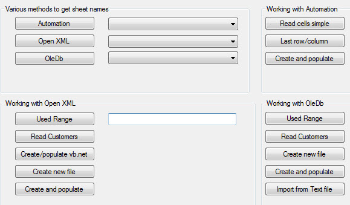
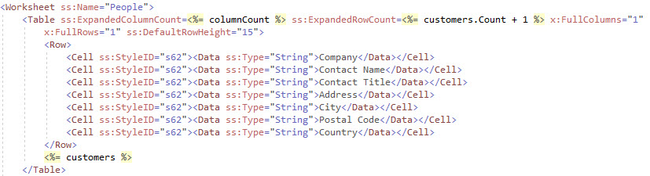
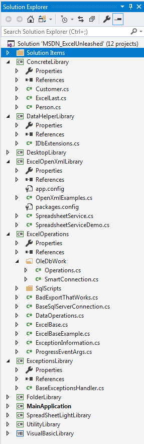
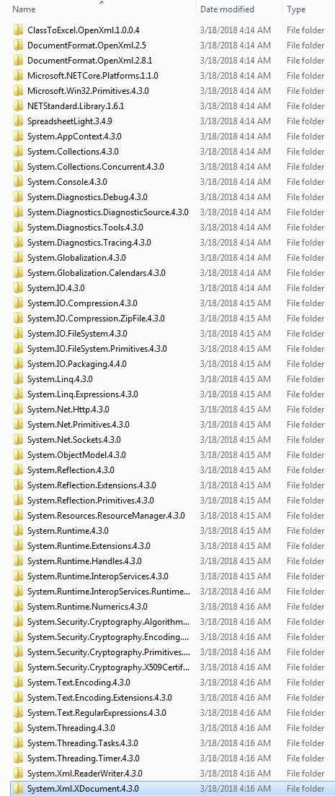

# Common Excel operations
## Requires
- Visual Studio 2017
## License
- MIT
## Technologies
- Excel
- Open XML SDK 2.0
- Interop Excel
- OpenDocument Spreadsheets
- Oledb Excel
## Topics
- Excel
- Excel Automation
- Generate Excel Workbook
- export to excel
- Import Excel data into SQL Server
## Updated
- 08/18/2018
## Description

<h1>Introduction</h1>

When creating data centric business applications customers may require their data readily available in one or more formats such as Microsoft Excel or a requirement to import data from one or more formats where one may be Microsoft
 Excel. This articles intent is to provide not only options for fulfilling these requirements but also do comparisons between various paths for interacting with Microsoft Excel.

All code runs in a Windows desktop project yet all classes to interact with Excel are in class projects with no dependencies on Windows forms.

<strong>8/2018</strong> Added a simple OleDb search example using
<a href="https://www.nuget.org/packages/System.ValueTuple/">ValueTuple</a>.

<h1>Building the Sample</h1>
<ul>
<li>Requires SQL-Server Express edition or higher
</li><li>NuGet packages have been removed from the solution as the total space is large. Use NuGet &quot;restore packages&quot; if you don't have restore packages set by default. If you have a slow computer downloading the required packages may
 take five or more minutes. </li><li>scripts to create and populate data is located under ExcelOperations project in the folder SqlScripts. Before running the script check the location for the database to ensure the script runs correctly. As is, the location is
 the default location for SQL-Server installation. 
</li><li>Some code makes use of C# 7 but with a little modification will work with earlier versions of C#
</li></ul>

Description

This aricle explores working with Excel using automation, Open XML and OleDb for common task such as exporting from a DataGridView and much more. There will be farther in this start up series.

Most of code can be executed in the Windows form project while there are bits of code which are not and when you come across code not presented/callable from the form there will be sample code in method headers on how to call
 the method e.g. there are two examples (in ExcelOperations class) for exporting to delimited text files, they are self-contained so simply call them while in Operations class in ExcelOperations class/OleDbWork there is a method ReadPeopleNoHeaderRow which
 has sample calls to the method in the method header.

There are examples for working with automation, Open XML and OleDb. Run each one and note time to execute. Every time Open XML will be faster than the other two while OleDb is a close second on some calls. But speed is not everything,
 for example, we want a list of sheet names. Using OleDb the sheet names are in A-Z order while the other two methods are in ordinal position. Suppose you need to create a new Excel file, this is not possible with OleDb and similar OleDb has no methods for
 formatting data. Knowing this one might use Excel automation and when doing so with a large data set the application may become unresponsive which means accept this or use a backgrounder worker component or use async techniques to overcome a non-responsive
 application (async is shown in one code sample).&nbsp;

&nbsp;

There are 14 file formats for Excel were this article will work with one, .xlsx which is the default XML-based file format for Excel 2007 and higher versions while .xls is for Excel 97 through Excel 2003.

The reason the focus is on Excel 2007 file format is this is the industry standard. Excel prior versions are still used yet less and less as time goes by.

<strong>Common operations</strong>:

<ul>
<li>Exporting a DataGridView bound to a DataTable or a List on a form with no formatting for column headers or cells.&nbsp; 
</li><li>Exporting a DataGridView bound to a DataTable List on a form with formatting for columns and/or cells. 
</li><li>Export a DataGridView without the DataSource property set. With or without formatting of cells and/or columns. 
</li><li>Export from a container such as a DataTable or List with or without column or cell formatting. 
</li><li>Export from a database table(s) with or without column or cell formatting. 
</li><li>Export from a text file or xml file with or without column or cell formatting. 
</li><li>Import one or more WorkSheets into a database, text file, xml or similar container. 
</li></ul>

 

Exporting data to Excel without formatting for many the choice is to work with Excel automation or through OleDb manage data provider.

Considerations for working with Excel automation.

Several objects are needed to get started, Excel.Application, Excel.WorkBook and Excel.WorkSheet. First the Excel.Application object is created followed by a ExcelWorkBook which form the base for creating an Excel object in
 memory. Next an Excel.WorkSheet is created with the option of providing a sheet name. If no sheet name is provided the sheet name will be the default, Sheet1. Once the Worksheet has been added to the Excel.Application by way of the Excel.WorkBook data can
 now be inserted into the sole WorkSheet.

Many a developer will jump onto their favorite search engine and come up with a code sample such as the one shown below in figure 1. At first glance this look great so the developer drop the code into their project and then
 realizes that there is no save method, easy enough to fix by adding the Save method.&nbsp; First issue is how a developer thinks about exception handling, in this case a try-catch statement is used which displays a message that something failed. Usually when
 there is a runtime exception with code as shown below all objects created to interact with Excel will usually (and it&rsquo;s most of the time) stick around in memory unknown to the client who may make several attempts to use the cool export feature and on
 each failure leaves more un-freed objects in memory and may very well require them to restart the machine to clear memory left around from failed export operations.

The next issue is the operation is performed within a form. These operations should be within a class dedicated to this and similar operations but not with data operations such as reading data from a database to populate a DataGridView.
 Data operations belong in their own class. The form then calls methods in these classes to read data (and perform add/edit/delete operations) from a database then in the call methods in the Excel class to export to Excel. One way around these issues is to
 move away from Excel automation as shown in figure 1A which uses a language extension method. The language extension converts data in a DataGridView to a DataTable were the DataGridView may have been populated by its DataSource or populated by adding rows
 manually. The extension method provides an option to include or exclude column headers. Once the DataTable is returned from the extension method it&rsquo;s passed to a method for a third-party library known as SpreadSheetLight which is free and installable
 via NuGet inside Visual Studio. A single method call is used to export/import the DataTable into a new Excel file including options to name the WorkSheet. The benefit of this method is its fairly universal, not tied to any set of data while the downsides are;
 requires a third party library, the data inserted into Excel are all strings (which is the same for when using Excel automation). If we exclude the cells will all be strings and focus on having to use a third-party library the alternate is to create a method
 that a DataTable is passed which uses either OpenXML to export data to Excel which in this case will require a considerable code base, no different if OleDb were to be used to export/import data into Excel. No matter which direction is taken there are advantages
 and disadvantages. The last option is to go with a third party library paid for or free, two of them are EPPlus and GemBox. Using a paid library makes since only when you need efficient and flexible methods that you don&rsquo;t have to maintain or that your
 methods created in house are not performing as expected and time is critical to completing the application.

<strong>Microsoft PIA</strong>

Primary Interop Assembly which are based on Component Object Model (COM). When you call a COM object of Office from managed code, a Runtime Callable Wrapper (RCW) is automatically created. The RCW marshals calls between the
 .NET application and the COM object. The RCW keeps a reference count on the COM object. If all references have not been released on the RCW, the COM object of Office does not quit and may cause the Office application not to quit after your automation has finished
 or not finished because of an exception.

Figure 1

&nbsp;

C#

Edit|Remove

csharp
<pre class="hidden">using Excel = Microsoft.Office.Interop.Excel;
private void btnExportExcel_Click(object sender, EventArgs e)
{
    try
    {
        Microsoft.Office.Interop.Excel.Application excel = new Microsoft.Office.Interop.Excel.Application();
        excel.Visible = true;
        Microsoft.Office.Interop.Excel.Workbook workbook = excel.Workbooks.Add(System.Reflection.Missing.Value);
        Microsoft.Office.Interop.Excel.Worksheet sheet1 = (Microsoft.Office.Interop.Excel.Worksheet)workbook.Sheets[1];
        int StartCol = 1;
        int StartRow = 1;
        int j = 0, i = 0;

        //Write Headers
        for (j = 0; j &lt; dgvSource.Columns.Count; j&#43;&#43;)
        {
            Microsoft.Office.Interop.Excel.Range myRange = (Microsoft.Office.Interop.Excel.Range)sheet1.Cells[StartRow, StartCol &#43; j];
            myRange.Value2 = dgvSource.Columns[j].HeaderText;
        }

        StartRow&#43;&#43;;

        //Write datagridview content
        for (i = 0; i &lt; dgvSource.Rows.Count; i&#43;&#43;)
        {
            for (j = 0; j &lt; dgvSource.Columns.Count; j&#43;&#43;)
            {
                try
                {
                    Microsoft.Office.Interop.Excel.Range myRange = (Microsoft.Office.Interop.Excel.Range)sheet1.Cells[StartRow &#43; i, StartCol &#43; j];
                    myRange.Value2 = dgvSource[j, i].Value == null ? &quot;&quot; : dgvSource[j, i].Value;
                }
                catch
                {
                    ;
                }
            }
        }
    }
    catch (Exception ex)
    {
        MessageBox.Show(ex.ToString());
    }
}
</pre>

<pre class="csharp">using&nbsp;Excel&nbsp;=&nbsp;Microsoft.Office.Interop.Excel;&nbsp;
private&nbsp;void&nbsp;btnExportExcel_Click(object&nbsp;sender,&nbsp;EventArgs&nbsp;e)&nbsp;
{&nbsp;
&nbsp;&nbsp;&nbsp;&nbsp;try&nbsp;
&nbsp;&nbsp;&nbsp;&nbsp;{&nbsp;
&nbsp;&nbsp;&nbsp;&nbsp;&nbsp;&nbsp;&nbsp;&nbsp;Microsoft.Office.Interop.Excel.Application&nbsp;excel&nbsp;=&nbsp;new&nbsp;Microsoft.Office.Interop.Excel.Application();&nbsp;
&nbsp;&nbsp;&nbsp;&nbsp;&nbsp;&nbsp;&nbsp;&nbsp;excel.Visible&nbsp;=&nbsp;true;&nbsp;
&nbsp;&nbsp;&nbsp;&nbsp;&nbsp;&nbsp;&nbsp;&nbsp;Microsoft.Office.Interop.Excel.Workbook&nbsp;workbook&nbsp;=&nbsp;excel.Workbooks.Add(System.Reflection.Missing.Value);&nbsp;
&nbsp;&nbsp;&nbsp;&nbsp;&nbsp;&nbsp;&nbsp;&nbsp;Microsoft.Office.Interop.Excel.Worksheet&nbsp;sheet1&nbsp;=&nbsp;(Microsoft.Office.Interop.Excel.Worksheet)workbook.Sheets[1];&nbsp;
&nbsp;&nbsp;&nbsp;&nbsp;&nbsp;&nbsp;&nbsp;&nbsp;int&nbsp;StartCol&nbsp;=&nbsp;1;&nbsp;
&nbsp;&nbsp;&nbsp;&nbsp;&nbsp;&nbsp;&nbsp;&nbsp;int&nbsp;StartRow&nbsp;=&nbsp;1;&nbsp;
&nbsp;&nbsp;&nbsp;&nbsp;&nbsp;&nbsp;&nbsp;&nbsp;int&nbsp;j&nbsp;=&nbsp;0,&nbsp;i&nbsp;=&nbsp;0;&nbsp;
&nbsp;
&nbsp;&nbsp;&nbsp;&nbsp;&nbsp;&nbsp;&nbsp;&nbsp;//Write&nbsp;Headers&nbsp;
&nbsp;&nbsp;&nbsp;&nbsp;&nbsp;&nbsp;&nbsp;&nbsp;for&nbsp;(j&nbsp;=&nbsp;0;&nbsp;j&nbsp;&lt;&nbsp;dgvSource.Columns.Count;&nbsp;j&#43;&#43;)&nbsp;
&nbsp;&nbsp;&nbsp;&nbsp;&nbsp;&nbsp;&nbsp;&nbsp;{&nbsp;
&nbsp;&nbsp;&nbsp;&nbsp;&nbsp;&nbsp;&nbsp;&nbsp;&nbsp;&nbsp;&nbsp;&nbsp;Microsoft.Office.Interop.Excel.Range&nbsp;myRange&nbsp;=&nbsp;(Microsoft.Office.Interop.Excel.Range)sheet1.Cells[StartRow,&nbsp;StartCol&nbsp;&#43;&nbsp;j];&nbsp;
&nbsp;&nbsp;&nbsp;&nbsp;&nbsp;&nbsp;&nbsp;&nbsp;&nbsp;&nbsp;&nbsp;&nbsp;myRange.Value2&nbsp;=&nbsp;dgvSource.Columns[j].HeaderText;&nbsp;
&nbsp;&nbsp;&nbsp;&nbsp;&nbsp;&nbsp;&nbsp;&nbsp;}&nbsp;
&nbsp;
&nbsp;&nbsp;&nbsp;&nbsp;&nbsp;&nbsp;&nbsp;&nbsp;StartRow&#43;&#43;;&nbsp;
&nbsp;
&nbsp;&nbsp;&nbsp;&nbsp;&nbsp;&nbsp;&nbsp;&nbsp;//Write&nbsp;datagridview&nbsp;content&nbsp;
&nbsp;&nbsp;&nbsp;&nbsp;&nbsp;&nbsp;&nbsp;&nbsp;for&nbsp;(i&nbsp;=&nbsp;0;&nbsp;i&nbsp;&lt;&nbsp;dgvSource.Rows.Count;&nbsp;i&#43;&#43;)&nbsp;
&nbsp;&nbsp;&nbsp;&nbsp;&nbsp;&nbsp;&nbsp;&nbsp;{&nbsp;
&nbsp;&nbsp;&nbsp;&nbsp;&nbsp;&nbsp;&nbsp;&nbsp;&nbsp;&nbsp;&nbsp;&nbsp;for&nbsp;(j&nbsp;=&nbsp;0;&nbsp;j&nbsp;&lt;&nbsp;dgvSource.Columns.Count;&nbsp;j&#43;&#43;)&nbsp;
&nbsp;&nbsp;&nbsp;&nbsp;&nbsp;&nbsp;&nbsp;&nbsp;&nbsp;&nbsp;&nbsp;&nbsp;{&nbsp;
&nbsp;&nbsp;&nbsp;&nbsp;&nbsp;&nbsp;&nbsp;&nbsp;&nbsp;&nbsp;&nbsp;&nbsp;&nbsp;&nbsp;&nbsp;&nbsp;try&nbsp;
&nbsp;&nbsp;&nbsp;&nbsp;&nbsp;&nbsp;&nbsp;&nbsp;&nbsp;&nbsp;&nbsp;&nbsp;&nbsp;&nbsp;&nbsp;&nbsp;{&nbsp;
&nbsp;&nbsp;&nbsp;&nbsp;&nbsp;&nbsp;&nbsp;&nbsp;&nbsp;&nbsp;&nbsp;&nbsp;&nbsp;&nbsp;&nbsp;&nbsp;&nbsp;&nbsp;&nbsp;&nbsp;Microsoft.Office.Interop.Excel.Range&nbsp;myRange&nbsp;=&nbsp;(Microsoft.Office.Interop.Excel.Range)sheet1.Cells[StartRow&nbsp;&#43;&nbsp;i,&nbsp;StartCol&nbsp;&#43;&nbsp;j];&nbsp;
&nbsp;&nbsp;&nbsp;&nbsp;&nbsp;&nbsp;&nbsp;&nbsp;&nbsp;&nbsp;&nbsp;&nbsp;&nbsp;&nbsp;&nbsp;&nbsp;&nbsp;&nbsp;&nbsp;&nbsp;myRange.Value2&nbsp;=&nbsp;dgvSource[j,&nbsp;i].Value&nbsp;==&nbsp;null&nbsp;?&nbsp;&quot;&quot;&nbsp;:&nbsp;dgvSource[j,&nbsp;i].Value;&nbsp;
&nbsp;&nbsp;&nbsp;&nbsp;&nbsp;&nbsp;&nbsp;&nbsp;&nbsp;&nbsp;&nbsp;&nbsp;&nbsp;&nbsp;&nbsp;&nbsp;}&nbsp;
&nbsp;&nbsp;&nbsp;&nbsp;&nbsp;&nbsp;&nbsp;&nbsp;&nbsp;&nbsp;&nbsp;&nbsp;&nbsp;&nbsp;&nbsp;&nbsp;catch&nbsp;
&nbsp;&nbsp;&nbsp;&nbsp;&nbsp;&nbsp;&nbsp;&nbsp;&nbsp;&nbsp;&nbsp;&nbsp;&nbsp;&nbsp;&nbsp;&nbsp;{&nbsp;
&nbsp;&nbsp;&nbsp;&nbsp;&nbsp;&nbsp;&nbsp;&nbsp;&nbsp;&nbsp;&nbsp;&nbsp;&nbsp;&nbsp;&nbsp;&nbsp;&nbsp;&nbsp;&nbsp;&nbsp;;&nbsp;
&nbsp;&nbsp;&nbsp;&nbsp;&nbsp;&nbsp;&nbsp;&nbsp;&nbsp;&nbsp;&nbsp;&nbsp;&nbsp;&nbsp;&nbsp;&nbsp;}&nbsp;
&nbsp;&nbsp;&nbsp;&nbsp;&nbsp;&nbsp;&nbsp;&nbsp;&nbsp;&nbsp;&nbsp;&nbsp;}&nbsp;
&nbsp;&nbsp;&nbsp;&nbsp;&nbsp;&nbsp;&nbsp;&nbsp;}&nbsp;
&nbsp;&nbsp;&nbsp;&nbsp;}&nbsp;
&nbsp;&nbsp;&nbsp;&nbsp;catch&nbsp;(Exception&nbsp;ex)&nbsp;
&nbsp;&nbsp;&nbsp;&nbsp;{&nbsp;
&nbsp;&nbsp;&nbsp;&nbsp;&nbsp;&nbsp;&nbsp;&nbsp;MessageBox.Show(ex.ToString());&nbsp;
&nbsp;&nbsp;&nbsp;&nbsp;}&nbsp;
}&nbsp;
</pre>

Figure 1A&nbsp;

&nbsp;

This alternate method to export data from a DataGridView full source can be found here. The main parts are as follows. A language extension method to convert a DataGridView contents to a DataTable were all values will be strings.

<a href="https://code.msdn.microsoft.com/DataGridView-unbound-to-02db1c40">Full source</a>.

&nbsp;

C#

Edit|Remove

csharp
<pre class="hidden">using System; 
using System.Data; 
using System.IO; 
using System.Linq; 
using System.Windows.Forms; 
 
namespace UtilityLibrary 
{ 
    public static class DataGridViewExtensionMethods 
    { 
        /// &lt;summary&gt; 
        /// Given a DataGridView populates without a data source, 
        /// create a DataTable, populate from rows/cells from the 
        /// DataGridView with an option to include/exclude column names. 
        /// &lt;/summary&gt; 
        /// &lt;param name=&quot;pDataGridView&quot;&gt;&lt;/param&gt; 
        /// &lt;param name=&quot;pColumnNames&quot;&gt;&lt;/param&gt; 
        /// &lt;returns&gt;&lt;/returns&gt; 
        /// &lt;remarks&gt; 
        /// There is no attempt made to figure out data types coming 
        /// from data in the DataGridView 
        /// &lt;/remarks&gt; 
        public static DataTable GetDataTable(this DataGridView pDataGridView, bool pColumnNames = true) 
        { 
            DataTable dt = new DataTable(); 
            foreach (DataGridViewColumn column in pDataGridView.Columns) 
            { 
                if (column.Visible) 
                { 
                    if (pColumnNames) 
                    { 
                        dt.Columns.Add(new DataColumn() { ColumnName = column.Name }); 
                    } 
                    else 
                    { 
                        dt.Columns.Add(); 
                    } 
                } 
            } 
 
            object[] cellValues = new object[pDataGridView.Columns.Count]; 
 
            foreach (DataGridViewRow row in pDataGridView.Rows) 
            { 
                if (!row.IsNewRow) 
                { 
                    for (int i = 0; i &lt; row.Cells.Count; i&#43;&#43;) 
                    { 
                        cellValues[i] = row.Cells[i].Value; 
                    } 
                    dt.Rows.Add(cellValues); 
                } 
            } 
 
            return dt; 
 
        } 
        /// &lt;summary&gt; 
        /// Generates comma delimited rows into a string array. 
        /// &lt;/summary&gt; 
        /// &lt;param name=&quot;sender&quot;&gt;&lt;/param&gt; 
        /// &lt;returns&gt;&lt;/returns&gt; 
        /// &lt;remarks&gt;&lt;/remarks&gt; 
        public static string[] CommaDelimitedRows(this DataGridView sender) 
        { 
            return ( 
                from row in sender.Rows.Cast&lt;DataGridViewRow&gt;() 
                where !((DataGridViewRow)row).IsNewRow 
                let RowItem = string.Join(&quot;,&quot;, Array.ConvertAll(((DataGridViewRow)row).Cells.Cast&lt;DataGridViewCell&gt;().ToArray(), (DataGridViewCell c) =&gt; ((c.Value == null) ? &quot;&quot; : c.Value.ToString()))) 
                select RowItem).ToArray(); 
        } 
        public static void ExportToCommandDelimitedFile(this DataGridView pSender, string pFileName) 
        { 
            File.WriteAllLines(Path.Combine(AppDomain.CurrentDomain.BaseDirectory, pFileName), pSender.CommaDelimitedRows()); 
        } 
        public static void ExpandColumns(this DataGridView sender) 
        { 
            foreach (DataGridViewColumn col in sender.Columns) 
            { 
                col.AutoSizeMode = DataGridViewAutoSizeColumnMode.AllCells; 
            } 
        } 
 
    } 
} 
</pre>

<pre class="js">using&nbsp;System;&nbsp;&nbsp;
using&nbsp;System.Data;&nbsp;&nbsp;
using&nbsp;System.IO;&nbsp;&nbsp;
using&nbsp;System.Linq;&nbsp;&nbsp;
using&nbsp;System.Windows.Forms;&nbsp;&nbsp;
&nbsp;&nbsp;
namespace&nbsp;UtilityLibrary&nbsp;&nbsp;
{&nbsp;&nbsp;
&nbsp;&nbsp;&nbsp;&nbsp;public&nbsp;static&nbsp;class&nbsp;DataGridViewExtensionMethods&nbsp;&nbsp;
&nbsp;&nbsp;&nbsp;&nbsp;{///&nbsp;&lt;summary&gt;&nbsp;///&nbsp;Given&nbsp;a&nbsp;DataGridView&nbsp;populates&nbsp;without&nbsp;a&nbsp;data&nbsp;source,&nbsp;///&nbsp;create&nbsp;a&nbsp;DataTable,&nbsp;populate&nbsp;from&nbsp;rows/cells&nbsp;from&nbsp;the&nbsp;///&nbsp;DataGridView&nbsp;with&nbsp;an&nbsp;option&nbsp;to&nbsp;include/exclude&nbsp;column&nbsp;names.&nbsp;///&nbsp;&lt;/summary&gt;&nbsp;///&nbsp;&lt;param&nbsp;name=&quot;pDataGridView&quot;&gt;&lt;/param&gt;&nbsp;///&nbsp;&lt;param&nbsp;name=&quot;pColumnNames&quot;&gt;&lt;/param&gt;&nbsp;///&nbsp;&lt;returns&gt;&lt;/returns&gt;&nbsp;///&nbsp;&lt;remarks&gt;&nbsp;///&nbsp;There&nbsp;is&nbsp;no&nbsp;attempt&nbsp;made&nbsp;to&nbsp;figure&nbsp;out&nbsp;data&nbsp;types&nbsp;coming&nbsp;///&nbsp;from&nbsp;data&nbsp;in&nbsp;the&nbsp;DataGridView&nbsp;///&nbsp;&lt;/remarks&gt;&nbsp;&nbsp;
&nbsp;&nbsp;&nbsp;&nbsp;&nbsp;&nbsp;&nbsp;&nbsp;public&nbsp;static&nbsp;DataTable&nbsp;GetDataTable(this&nbsp;DataGridView&nbsp;pDataGridView,&nbsp;bool&nbsp;pColumnNames&nbsp;=&nbsp;true)&nbsp;&nbsp;
&nbsp;&nbsp;&nbsp;&nbsp;&nbsp;&nbsp;&nbsp;&nbsp;{&nbsp;&nbsp;
&nbsp;&nbsp;&nbsp;&nbsp;&nbsp;&nbsp;&nbsp;&nbsp;&nbsp;&nbsp;&nbsp;&nbsp;DataTable&nbsp;dt&nbsp;=&nbsp;new&nbsp;DataTable();&nbsp;&nbsp;
&nbsp;&nbsp;&nbsp;&nbsp;&nbsp;&nbsp;&nbsp;&nbsp;&nbsp;&nbsp;&nbsp;&nbsp;foreach&nbsp;(DataGridViewColumn&nbsp;column&nbsp;in&nbsp;pDataGridView.Columns)&nbsp;&nbsp;
&nbsp;&nbsp;&nbsp;&nbsp;&nbsp;&nbsp;&nbsp;&nbsp;&nbsp;&nbsp;&nbsp;&nbsp;{if&nbsp;(column.Visible)&nbsp;&nbsp;
&nbsp;&nbsp;&nbsp;&nbsp;&nbsp;&nbsp;&nbsp;&nbsp;&nbsp;&nbsp;&nbsp;&nbsp;&nbsp;&nbsp;&nbsp;&nbsp;{if&nbsp;(pColumnNames)&nbsp;&nbsp;
&nbsp;&nbsp;&nbsp;&nbsp;&nbsp;&nbsp;&nbsp;&nbsp;&nbsp;&nbsp;&nbsp;&nbsp;&nbsp;&nbsp;&nbsp;&nbsp;&nbsp;&nbsp;&nbsp;&nbsp;{&nbsp;&nbsp;
&nbsp;&nbsp;&nbsp;&nbsp;&nbsp;&nbsp;&nbsp;&nbsp;&nbsp;&nbsp;&nbsp;&nbsp;&nbsp;&nbsp;&nbsp;&nbsp;&nbsp;&nbsp;&nbsp;&nbsp;&nbsp;&nbsp;&nbsp;&nbsp;dt.Columns.Add(new&nbsp;DataColumn()&nbsp;{&nbsp;ColumnName&nbsp;=&nbsp;column.Name&nbsp;});&nbsp;&nbsp;
&nbsp;&nbsp;&nbsp;&nbsp;&nbsp;&nbsp;&nbsp;&nbsp;&nbsp;&nbsp;&nbsp;&nbsp;&nbsp;&nbsp;&nbsp;&nbsp;&nbsp;&nbsp;&nbsp;&nbsp;}else{&nbsp;&nbsp;
&nbsp;&nbsp;&nbsp;&nbsp;&nbsp;&nbsp;&nbsp;&nbsp;&nbsp;&nbsp;&nbsp;&nbsp;&nbsp;&nbsp;&nbsp;&nbsp;&nbsp;&nbsp;&nbsp;&nbsp;&nbsp;&nbsp;&nbsp;&nbsp;dt.Columns.Add();&nbsp;&nbsp;
&nbsp;&nbsp;&nbsp;&nbsp;&nbsp;&nbsp;&nbsp;&nbsp;&nbsp;&nbsp;&nbsp;&nbsp;&nbsp;&nbsp;&nbsp;&nbsp;&nbsp;&nbsp;&nbsp;&nbsp;}}}&nbsp;&nbsp;
&nbsp;&nbsp;
&nbsp;&nbsp;&nbsp;&nbsp;&nbsp;&nbsp;&nbsp;&nbsp;&nbsp;&nbsp;&nbsp;&nbsp;object[]&nbsp;cellValues&nbsp;=&nbsp;new&nbsp;object[pDataGridView.Columns.Count];&nbsp;&nbsp;
&nbsp;&nbsp;
&nbsp;&nbsp;&nbsp;&nbsp;&nbsp;&nbsp;&nbsp;&nbsp;&nbsp;&nbsp;&nbsp;&nbsp;foreach&nbsp;(DataGridViewRow&nbsp;row&nbsp;in&nbsp;pDataGridView.Rows)&nbsp;&nbsp;
&nbsp;&nbsp;&nbsp;&nbsp;&nbsp;&nbsp;&nbsp;&nbsp;&nbsp;&nbsp;&nbsp;&nbsp;{if&nbsp;(!row.IsNewRow)&nbsp;&nbsp;
&nbsp;&nbsp;&nbsp;&nbsp;&nbsp;&nbsp;&nbsp;&nbsp;&nbsp;&nbsp;&nbsp;&nbsp;&nbsp;&nbsp;&nbsp;&nbsp;{for&nbsp;(int&nbsp;i&nbsp;=&nbsp;0;&nbsp;i&nbsp;&lt;&nbsp;row.Cells.Count;&nbsp;i&#43;&#43;)&nbsp;&nbsp;
&nbsp;&nbsp;&nbsp;&nbsp;&nbsp;&nbsp;&nbsp;&nbsp;&nbsp;&nbsp;&nbsp;&nbsp;&nbsp;&nbsp;&nbsp;&nbsp;&nbsp;&nbsp;&nbsp;&nbsp;{&nbsp;&nbsp;
&nbsp;&nbsp;&nbsp;&nbsp;&nbsp;&nbsp;&nbsp;&nbsp;&nbsp;&nbsp;&nbsp;&nbsp;&nbsp;&nbsp;&nbsp;&nbsp;&nbsp;&nbsp;&nbsp;&nbsp;&nbsp;&nbsp;&nbsp;&nbsp;cellValues[i]&nbsp;=&nbsp;row.Cells[i].Value;&nbsp;&nbsp;
&nbsp;&nbsp;&nbsp;&nbsp;&nbsp;&nbsp;&nbsp;&nbsp;&nbsp;&nbsp;&nbsp;&nbsp;&nbsp;&nbsp;&nbsp;&nbsp;&nbsp;&nbsp;&nbsp;&nbsp;}&nbsp;&nbsp;
&nbsp;&nbsp;&nbsp;&nbsp;&nbsp;&nbsp;&nbsp;&nbsp;&nbsp;&nbsp;&nbsp;&nbsp;&nbsp;&nbsp;&nbsp;&nbsp;&nbsp;&nbsp;&nbsp;&nbsp;dt.Rows.Add(cellValues);&nbsp;&nbsp;
&nbsp;&nbsp;&nbsp;&nbsp;&nbsp;&nbsp;&nbsp;&nbsp;&nbsp;&nbsp;&nbsp;&nbsp;&nbsp;&nbsp;&nbsp;&nbsp;}}return&nbsp;dt;&nbsp;&nbsp;
&nbsp;&nbsp;
&nbsp;&nbsp;&nbsp;&nbsp;&nbsp;&nbsp;&nbsp;&nbsp;}///&nbsp;&lt;summary&gt;&nbsp;///&nbsp;Generates&nbsp;comma&nbsp;delimited&nbsp;rows&nbsp;into&nbsp;a&nbsp;string&nbsp;array.&nbsp;///&nbsp;&lt;/summary&gt;&nbsp;///&nbsp;&lt;param&nbsp;name=&quot;sender&quot;&gt;&lt;/param&gt;&nbsp;///&nbsp;&lt;returns&gt;&lt;/returns&gt;&nbsp;///&nbsp;&lt;remarks&gt;&lt;/remarks&gt;&nbsp;&nbsp;
&nbsp;&nbsp;&nbsp;&nbsp;&nbsp;&nbsp;&nbsp;&nbsp;public&nbsp;static&nbsp;string[]&nbsp;CommaDelimitedRows(this&nbsp;DataGridView&nbsp;sender)&nbsp;&nbsp;
&nbsp;&nbsp;&nbsp;&nbsp;&nbsp;&nbsp;&nbsp;&nbsp;{return&nbsp;(&nbsp;&nbsp;
&nbsp;&nbsp;&nbsp;&nbsp;&nbsp;&nbsp;&nbsp;&nbsp;&nbsp;&nbsp;&nbsp;&nbsp;&nbsp;&nbsp;&nbsp;&nbsp;from&nbsp;row&nbsp;in&nbsp;sender.Rows.Cast&lt;DataGridViewRow&gt;()&nbsp;&nbsp;
&nbsp;&nbsp;&nbsp;&nbsp;&nbsp;&nbsp;&nbsp;&nbsp;&nbsp;&nbsp;&nbsp;&nbsp;&nbsp;&nbsp;&nbsp;&nbsp;where&nbsp;!((DataGridViewRow)row).IsNewRow&nbsp;&nbsp;
&nbsp;&nbsp;&nbsp;&nbsp;&nbsp;&nbsp;&nbsp;&nbsp;&nbsp;&nbsp;&nbsp;&nbsp;&nbsp;&nbsp;&nbsp;&nbsp;let&nbsp;RowItem&nbsp;=&nbsp;string.Join(&quot;,&quot;,&nbsp;Array.ConvertAll(((DataGridViewRow)row).Cells.Cast&lt;DataGridViewCell&gt;().ToArray(),&nbsp;(DataGridViewCell&nbsp;c)&nbsp;=&gt;&nbsp;((c.Value&nbsp;==&nbsp;null)&nbsp;?&nbsp;&quot;&quot;&nbsp;:&nbsp;c.Value.ToString())))&nbsp;&nbsp;
&nbsp;&nbsp;&nbsp;&nbsp;&nbsp;&nbsp;&nbsp;&nbsp;&nbsp;&nbsp;&nbsp;&nbsp;&nbsp;&nbsp;&nbsp;&nbsp;select&nbsp;RowItem).ToArray();&nbsp;&nbsp;
&nbsp;&nbsp;&nbsp;&nbsp;&nbsp;&nbsp;&nbsp;&nbsp;}&nbsp;&nbsp;
&nbsp;&nbsp;&nbsp;&nbsp;&nbsp;&nbsp;&nbsp;&nbsp;public&nbsp;static&nbsp;void&nbsp;ExportToCommandDelimitedFile(this&nbsp;DataGridView&nbsp;pSender,&nbsp;string&nbsp;pFileName)&nbsp;&nbsp;
&nbsp;&nbsp;&nbsp;&nbsp;&nbsp;&nbsp;&nbsp;&nbsp;{&nbsp;&nbsp;
&nbsp;&nbsp;&nbsp;&nbsp;&nbsp;&nbsp;&nbsp;&nbsp;&nbsp;&nbsp;&nbsp;&nbsp;File.WriteAllLines(Path.Combine(AppDomain.CurrentDomain.BaseDirectory,&nbsp;pFileName),&nbsp;pSender.CommaDelimitedRows());&nbsp;&nbsp;
&nbsp;&nbsp;&nbsp;&nbsp;&nbsp;&nbsp;&nbsp;&nbsp;}&nbsp;&nbsp;
&nbsp;&nbsp;&nbsp;&nbsp;&nbsp;&nbsp;&nbsp;&nbsp;public&nbsp;static&nbsp;void&nbsp;ExpandColumns(this&nbsp;DataGridView&nbsp;sender)&nbsp;&nbsp;
&nbsp;&nbsp;&nbsp;&nbsp;&nbsp;&nbsp;&nbsp;&nbsp;{&nbsp;&nbsp;
&nbsp;&nbsp;&nbsp;&nbsp;&nbsp;&nbsp;&nbsp;&nbsp;&nbsp;&nbsp;&nbsp;&nbsp;foreach&nbsp;(DataGridViewColumn&nbsp;col&nbsp;in&nbsp;sender.Columns)&nbsp;&nbsp;
&nbsp;&nbsp;&nbsp;&nbsp;&nbsp;&nbsp;&nbsp;&nbsp;&nbsp;&nbsp;&nbsp;&nbsp;{&nbsp;&nbsp;
&nbsp;&nbsp;&nbsp;&nbsp;&nbsp;&nbsp;&nbsp;&nbsp;&nbsp;&nbsp;&nbsp;&nbsp;&nbsp;&nbsp;&nbsp;&nbsp;col.AutoSizeMode&nbsp;=&nbsp;DataGridViewAutoSizeColumnMode.AllCells;&nbsp;&nbsp;
&nbsp;&nbsp;&nbsp;&nbsp;&nbsp;&nbsp;&nbsp;&nbsp;&nbsp;&nbsp;&nbsp;&nbsp;}}}}</pre>

With the DataTable returned from the extension above the following class provides exporting capabilities

C#

Edit|Remove

csharp
<pre class="hidden">using System; 
using System.Data; 
using SpreadsheetLight; 
using DocumentFormat.OpenXml.Spreadsheet; 
using SysDraw = System.Drawing; 
using System.IO; 
 
namespace SpreadSheetLightLibrary 
{ 
    public class ExcelOperations 
    { 
        /// &lt;summary&gt; 
        /// True if last operation had a runtime exception 
        /// &lt;/summary&gt; 
        /// &lt;returns&gt;&lt;/returns&gt; 
        public bool HasException { get; set; } 
        /// &lt;summary&gt; 
        /// Exception of last operation ran that throw an exception 
        /// &lt;/summary&gt; 
        /// &lt;returns&gt;&lt;/returns&gt; 
        public Exception Exception { get; set; } 
        /// &lt;summary&gt; 
        /// Wraps Exception message 
        /// &lt;/summary&gt; 
        /// &lt;returns&gt;&lt;/returns&gt; 
        public string ExceptionMessage 
        { 
            get 
            { 
                if (HasException) 
                { 
                    return Exception.Message; 
                } 
                else 
                { 
                    return &quot;None&quot;; 
                } 
            } 
        } 
        /// &lt;summary&gt; 
        /// Export DataTable to a new Excel file 
        /// &lt;/summary&gt; 
        /// &lt;param name=&quot;pFileName&quot;&gt;Path and Excel file name&lt;/param&gt; 
        /// &lt;param name=&quot;pSheetName&quot;&gt;Sheet name to place data&lt;/param&gt; 
        /// &lt;param name=&quot;pDataTable&quot;&gt;DataTable to import into pSheetName&lt;/param&gt; 
        /// &lt;param name=&quot;pColumnHeaders&quot;&gt;Include or exclude columns&lt;/param&gt; 
        /// &lt;returns&gt;&lt;/returns&gt; 
        public bool SimpleExport(string pFileName, string pSheetName, DataTable pDataTable, bool pColumnHeaders) 
        { 
            try 
            { 
                if (File.Exists(pFileName)) 
                { 
                    File.Delete(pFileName); 
                } 
 
                using (SLDocument doc = new SLDocument()) 
                { 
                    doc.SelectWorksheet(pSheetName); 
                    if (pSheetName != &quot;Sheet1&quot;) 
                    { 
                        doc.AddWorksheet(pSheetName); 
                        doc.DeleteWorksheet(&quot;Sheet1&quot;); 
                    } 
 
                    // start at row 1, column A 
                    // SLConvert.ToColumnIndex(&quot;A&quot;) is kind of overkill but it exposes you to the convert class 
                    doc.ImportDataTable(1, SLConvert.ToColumnIndex(&quot;A&quot;), pDataTable, pColumnHeaders); 
 
                    if (pColumnHeaders) 
                    { 
 
                        var headerSyle = doc.CreateStyle(); 
                        headerSyle.Font.FontColor = SysDraw.Color.White; 
                        headerSyle.Font.Strike = false; 
                        headerSyle.Fill.SetPattern(PatternValues.Solid, SysDraw.Color.Green, SysDraw.Color.White); 
                        headerSyle.Font.Underline = UnderlineValues.None; 
                        headerSyle.Font.Bold = true; 
                        headerSyle.Font.Italic = false; 
                        doc.SetCellStyle(1, 1, 1, pDataTable.Columns.Count, headerSyle); 
 
                    } 
 
                    doc.AutoFitColumn(1, pDataTable.Columns.Count); 
 
                    doc.SaveAs(pFileName); 
                } 
 
                return true; 
 
            } 
            catch (Exception ex) 
            { 
                HasException = true; 
                Exception = ex; 
                return false; 
            } 
 
        } 
        /// &lt;summary&gt; 
        /// This represents the bare amount of code to import 
        /// a DataTable into a new Excel file. Please note if 
        /// there are dates they need to be format using a style. 
        ///  
        /// For an example of date styling/formatting 
        /// https://code.msdn.microsoft.com/Export-Excel-from-a-4496c776 
        /// Class project ExcelBackend, Operations class method ImportDataTable2  
        /// where I setup a style for a date as mm-dd-yyyy 
        ///  
        /// Formatting is beyond this code sample as this code sample is meant 
        /// to be a generic method to take a DataGridView into a DataTable then 
        /// use the DataTable to import into a WorkSheet. I could had done dates 
        /// and other types but that is more specific to your data and as mentioned 
        /// the link above is my code sample that shows formatting/styling. 
        ///  
        /// &lt;/summary&gt; 
        /// &lt;param name=&quot;pFileName&quot;&gt;&lt;/param&gt; 
        /// &lt;param name=&quot;pSheetName&quot;&gt;&lt;/param&gt; 
        /// &lt;param name=&quot;pDataTable&quot;&gt;&lt;/param&gt; 
        /// &lt;param name=&quot;pColumnHeaders&quot;&gt;&lt;/param&gt; 
        public void SimpleExportRaw(string pFileName, string pSheetName, DataTable pDataTable, bool pColumnHeaders) 
        { 
            using (SLDocument doc = new SLDocument()) 
            { 
                doc.SelectWorksheet(pSheetName); 
                if (pSheetName != &quot;Sheet1&quot;) 
                { 
                    doc.AddWorksheet(pSheetName); 
                    doc.DeleteWorksheet(&quot;Sheet1&quot;); 
                } 
                doc.ImportDataTable(1, SLConvert.ToColumnIndex(&quot;A&quot;), pDataTable, pColumnHeaders); 
                doc.SaveAs(pFileName); 
            } 
        } 
    } 
} 
</pre>

<pre class="js">using&nbsp;System;&nbsp;&nbsp;
using&nbsp;System.Data;&nbsp;&nbsp;
using&nbsp;SpreadsheetLight;&nbsp;&nbsp;
using&nbsp;DocumentFormat.OpenXml.Spreadsheet;&nbsp;&nbsp;
using&nbsp;SysDraw&nbsp;=&nbsp;System.Drawing;&nbsp;&nbsp;
using&nbsp;System.IO;&nbsp;&nbsp;
&nbsp;&nbsp;
namespace&nbsp;SpreadSheetLightLibrary&nbsp;&nbsp;
{&nbsp;&nbsp;
&nbsp;&nbsp;&nbsp;&nbsp;public&nbsp;class&nbsp;ExcelOperations&nbsp;&nbsp;
&nbsp;&nbsp;&nbsp;&nbsp;{///&nbsp;&lt;summary&gt;&nbsp;///&nbsp;True&nbsp;if&nbsp;last&nbsp;operation&nbsp;had&nbsp;a&nbsp;runtime&nbsp;exception&nbsp;///&nbsp;&lt;/summary&gt;&nbsp;///&nbsp;&lt;returns&gt;&lt;/returns&gt;&nbsp;&nbsp;
&nbsp;&nbsp;&nbsp;&nbsp;&nbsp;&nbsp;&nbsp;&nbsp;public&nbsp;bool&nbsp;HasException&nbsp;{&nbsp;get;&nbsp;set;&nbsp;}///&nbsp;&lt;summary&gt;&nbsp;///&nbsp;Exception&nbsp;of&nbsp;last&nbsp;operation&nbsp;ran&nbsp;that&nbsp;throw&nbsp;an&nbsp;exception&nbsp;///&nbsp;&lt;/summary&gt;&nbsp;///&nbsp;&lt;returns&gt;&lt;/returns&gt;&nbsp;&nbsp;
&nbsp;&nbsp;&nbsp;&nbsp;&nbsp;&nbsp;&nbsp;&nbsp;public&nbsp;Exception&nbsp;Exception&nbsp;{&nbsp;get;&nbsp;set;&nbsp;}///&nbsp;&lt;summary&gt;&nbsp;///&nbsp;Wraps&nbsp;Exception&nbsp;message&nbsp;///&nbsp;&lt;/summary&gt;&nbsp;///&nbsp;&lt;returns&gt;&lt;/returns&gt;&nbsp;&nbsp;
&nbsp;&nbsp;&nbsp;&nbsp;&nbsp;&nbsp;&nbsp;&nbsp;public&nbsp;string&nbsp;ExceptionMessage&nbsp;&nbsp;
&nbsp;&nbsp;&nbsp;&nbsp;&nbsp;&nbsp;&nbsp;&nbsp;{&nbsp;&nbsp;
&nbsp;&nbsp;&nbsp;&nbsp;&nbsp;&nbsp;&nbsp;&nbsp;&nbsp;&nbsp;&nbsp;&nbsp;get&nbsp;&nbsp;
&nbsp;&nbsp;&nbsp;&nbsp;&nbsp;&nbsp;&nbsp;&nbsp;&nbsp;&nbsp;&nbsp;&nbsp;{if&nbsp;(HasException)&nbsp;&nbsp;
&nbsp;&nbsp;&nbsp;&nbsp;&nbsp;&nbsp;&nbsp;&nbsp;&nbsp;&nbsp;&nbsp;&nbsp;&nbsp;&nbsp;&nbsp;&nbsp;{return&nbsp;Exception.Message;&nbsp;&nbsp;
&nbsp;&nbsp;&nbsp;&nbsp;&nbsp;&nbsp;&nbsp;&nbsp;&nbsp;&nbsp;&nbsp;&nbsp;&nbsp;&nbsp;&nbsp;&nbsp;}else{return&quot;None&quot;;&nbsp;&nbsp;
&nbsp;&nbsp;&nbsp;&nbsp;&nbsp;&nbsp;&nbsp;&nbsp;&nbsp;&nbsp;&nbsp;&nbsp;&nbsp;&nbsp;&nbsp;&nbsp;}}}///&nbsp;&lt;summary&gt;&nbsp;///&nbsp;Export&nbsp;DataTable&nbsp;to&nbsp;a&nbsp;new&nbsp;Excel&nbsp;file&nbsp;///&nbsp;&lt;/summary&gt;&nbsp;///&nbsp;&lt;param&nbsp;name=&quot;pFileName&quot;&gt;Path&nbsp;and&nbsp;Excel&nbsp;file&nbsp;name&lt;/param&gt;&nbsp;///&nbsp;&lt;param&nbsp;name=&quot;pSheetName&quot;&gt;Sheet&nbsp;name&nbsp;to&nbsp;place&nbsp;data&lt;/param&gt;&nbsp;///&nbsp;&lt;param&nbsp;name=&quot;pDataTable&quot;&gt;DataTable&nbsp;to&nbsp;import&nbsp;into&nbsp;pSheetName&lt;/param&gt;&nbsp;///&nbsp;&lt;param&nbsp;name=&quot;pColumnHeaders&quot;&gt;Include&nbsp;or&nbsp;exclude&nbsp;columns&lt;/param&gt;&nbsp;///&nbsp;&lt;returns&gt;&lt;/returns&gt;&nbsp;&nbsp;
&nbsp;&nbsp;&nbsp;&nbsp;&nbsp;&nbsp;&nbsp;&nbsp;public&nbsp;bool&nbsp;SimpleExport(string&nbsp;pFileName,&nbsp;string&nbsp;pSheetName,&nbsp;DataTable&nbsp;pDataTable,&nbsp;bool&nbsp;pColumnHeaders)&nbsp;&nbsp;
&nbsp;&nbsp;&nbsp;&nbsp;&nbsp;&nbsp;&nbsp;&nbsp;{try{if&nbsp;(File.Exists(pFileName))&nbsp;&nbsp;
&nbsp;&nbsp;&nbsp;&nbsp;&nbsp;&nbsp;&nbsp;&nbsp;&nbsp;&nbsp;&nbsp;&nbsp;&nbsp;&nbsp;&nbsp;&nbsp;{&nbsp;&nbsp;
&nbsp;&nbsp;&nbsp;&nbsp;&nbsp;&nbsp;&nbsp;&nbsp;&nbsp;&nbsp;&nbsp;&nbsp;&nbsp;&nbsp;&nbsp;&nbsp;&nbsp;&nbsp;&nbsp;&nbsp;File.Delete(pFileName);&nbsp;&nbsp;
&nbsp;&nbsp;&nbsp;&nbsp;&nbsp;&nbsp;&nbsp;&nbsp;&nbsp;&nbsp;&nbsp;&nbsp;&nbsp;&nbsp;&nbsp;&nbsp;}&nbsp;&nbsp;
&nbsp;&nbsp;
&nbsp;&nbsp;&nbsp;&nbsp;&nbsp;&nbsp;&nbsp;&nbsp;&nbsp;&nbsp;&nbsp;&nbsp;&nbsp;&nbsp;&nbsp;&nbsp;using&nbsp;(SLDocument&nbsp;doc&nbsp;=&nbsp;new&nbsp;SLDocument())&nbsp;&nbsp;
&nbsp;&nbsp;&nbsp;&nbsp;&nbsp;&nbsp;&nbsp;&nbsp;&nbsp;&nbsp;&nbsp;&nbsp;&nbsp;&nbsp;&nbsp;&nbsp;{&nbsp;&nbsp;
&nbsp;&nbsp;&nbsp;&nbsp;&nbsp;&nbsp;&nbsp;&nbsp;&nbsp;&nbsp;&nbsp;&nbsp;&nbsp;&nbsp;&nbsp;&nbsp;&nbsp;&nbsp;&nbsp;&nbsp;doc.SelectWorksheet(pSheetName);&nbsp;&nbsp;
&nbsp;&nbsp;&nbsp;&nbsp;&nbsp;&nbsp;&nbsp;&nbsp;&nbsp;&nbsp;&nbsp;&nbsp;&nbsp;&nbsp;&nbsp;&nbsp;&nbsp;&nbsp;&nbsp;&nbsp;if&nbsp;(pSheetName&nbsp;!=&nbsp;&quot;Sheet1&quot;)&nbsp;&nbsp;
&nbsp;&nbsp;&nbsp;&nbsp;&nbsp;&nbsp;&nbsp;&nbsp;&nbsp;&nbsp;&nbsp;&nbsp;&nbsp;&nbsp;&nbsp;&nbsp;&nbsp;&nbsp;&nbsp;&nbsp;{&nbsp;&nbsp;
&nbsp;&nbsp;&nbsp;&nbsp;&nbsp;&nbsp;&nbsp;&nbsp;&nbsp;&nbsp;&nbsp;&nbsp;&nbsp;&nbsp;&nbsp;&nbsp;&nbsp;&nbsp;&nbsp;&nbsp;&nbsp;&nbsp;&nbsp;&nbsp;doc.AddWorksheet(pSheetName);&nbsp;&nbsp;
&nbsp;&nbsp;&nbsp;&nbsp;&nbsp;&nbsp;&nbsp;&nbsp;&nbsp;&nbsp;&nbsp;&nbsp;&nbsp;&nbsp;&nbsp;&nbsp;&nbsp;&nbsp;&nbsp;&nbsp;&nbsp;&nbsp;&nbsp;&nbsp;doc.DeleteWorksheet(&quot;Sheet1&quot;);&nbsp;&nbsp;
&nbsp;&nbsp;&nbsp;&nbsp;&nbsp;&nbsp;&nbsp;&nbsp;&nbsp;&nbsp;&nbsp;&nbsp;&nbsp;&nbsp;&nbsp;&nbsp;&nbsp;&nbsp;&nbsp;&nbsp;}//&nbsp;start&nbsp;at&nbsp;row&nbsp;1,&nbsp;column&nbsp;A&nbsp;//&nbsp;SLConvert.ToColumnIndex(&quot;A&quot;)&nbsp;is&nbsp;kind&nbsp;of&nbsp;overkill&nbsp;but&nbsp;it&nbsp;exposes&nbsp;you&nbsp;to&nbsp;the&nbsp;convert&nbsp;class&nbsp;&nbsp;
&nbsp;&nbsp;&nbsp;&nbsp;&nbsp;&nbsp;&nbsp;&nbsp;&nbsp;&nbsp;&nbsp;&nbsp;&nbsp;&nbsp;&nbsp;&nbsp;&nbsp;&nbsp;&nbsp;&nbsp;doc.ImportDataTable(1,&nbsp;SLConvert.ToColumnIndex(&quot;A&quot;),&nbsp;pDataTable,&nbsp;pColumnHeaders);&nbsp;&nbsp;
&nbsp;&nbsp;
&nbsp;&nbsp;&nbsp;&nbsp;&nbsp;&nbsp;&nbsp;&nbsp;&nbsp;&nbsp;&nbsp;&nbsp;&nbsp;&nbsp;&nbsp;&nbsp;&nbsp;&nbsp;&nbsp;&nbsp;if&nbsp;(pColumnHeaders)&nbsp;&nbsp;
&nbsp;&nbsp;&nbsp;&nbsp;&nbsp;&nbsp;&nbsp;&nbsp;&nbsp;&nbsp;&nbsp;&nbsp;&nbsp;&nbsp;&nbsp;&nbsp;&nbsp;&nbsp;&nbsp;&nbsp;{var&nbsp;headerSyle&nbsp;=&nbsp;doc.CreateStyle();&nbsp;&nbsp;
&nbsp;&nbsp;&nbsp;&nbsp;&nbsp;&nbsp;&nbsp;&nbsp;&nbsp;&nbsp;&nbsp;&nbsp;&nbsp;&nbsp;&nbsp;&nbsp;&nbsp;&nbsp;&nbsp;&nbsp;&nbsp;&nbsp;&nbsp;&nbsp;headerSyle.Font.FontColor&nbsp;=&nbsp;SysDraw.Color.White;&nbsp;&nbsp;
&nbsp;&nbsp;&nbsp;&nbsp;&nbsp;&nbsp;&nbsp;&nbsp;&nbsp;&nbsp;&nbsp;&nbsp;&nbsp;&nbsp;&nbsp;&nbsp;&nbsp;&nbsp;&nbsp;&nbsp;&nbsp;&nbsp;&nbsp;&nbsp;headerSyle.Font.Strike&nbsp;=&nbsp;false;&nbsp;&nbsp;
&nbsp;&nbsp;&nbsp;&nbsp;&nbsp;&nbsp;&nbsp;&nbsp;&nbsp;&nbsp;&nbsp;&nbsp;&nbsp;&nbsp;&nbsp;&nbsp;&nbsp;&nbsp;&nbsp;&nbsp;&nbsp;&nbsp;&nbsp;&nbsp;headerSyle.Fill.SetPattern(PatternValues.Solid,&nbsp;SysDraw.Color.Green,&nbsp;SysDraw.Color.White);&nbsp;&nbsp;
&nbsp;&nbsp;&nbsp;&nbsp;&nbsp;&nbsp;&nbsp;&nbsp;&nbsp;&nbsp;&nbsp;&nbsp;&nbsp;&nbsp;&nbsp;&nbsp;&nbsp;&nbsp;&nbsp;&nbsp;&nbsp;&nbsp;&nbsp;&nbsp;headerSyle.Font.Underline&nbsp;=&nbsp;UnderlineValues.None;&nbsp;&nbsp;
&nbsp;&nbsp;&nbsp;&nbsp;&nbsp;&nbsp;&nbsp;&nbsp;&nbsp;&nbsp;&nbsp;&nbsp;&nbsp;&nbsp;&nbsp;&nbsp;&nbsp;&nbsp;&nbsp;&nbsp;&nbsp;&nbsp;&nbsp;&nbsp;headerSyle.Font.Bold&nbsp;=&nbsp;true;&nbsp;&nbsp;
&nbsp;&nbsp;&nbsp;&nbsp;&nbsp;&nbsp;&nbsp;&nbsp;&nbsp;&nbsp;&nbsp;&nbsp;&nbsp;&nbsp;&nbsp;&nbsp;&nbsp;&nbsp;&nbsp;&nbsp;&nbsp;&nbsp;&nbsp;&nbsp;headerSyle.Font.Italic&nbsp;=&nbsp;false;&nbsp;&nbsp;
&nbsp;&nbsp;&nbsp;&nbsp;&nbsp;&nbsp;&nbsp;&nbsp;&nbsp;&nbsp;&nbsp;&nbsp;&nbsp;&nbsp;&nbsp;&nbsp;&nbsp;&nbsp;&nbsp;&nbsp;&nbsp;&nbsp;&nbsp;&nbsp;doc.SetCellStyle(1,&nbsp;1,&nbsp;1,&nbsp;pDataTable.Columns.Count,&nbsp;headerSyle);&nbsp;&nbsp;
&nbsp;&nbsp;
&nbsp;&nbsp;&nbsp;&nbsp;&nbsp;&nbsp;&nbsp;&nbsp;&nbsp;&nbsp;&nbsp;&nbsp;&nbsp;&nbsp;&nbsp;&nbsp;&nbsp;&nbsp;&nbsp;&nbsp;}&nbsp;&nbsp;
&nbsp;&nbsp;
&nbsp;&nbsp;&nbsp;&nbsp;&nbsp;&nbsp;&nbsp;&nbsp;&nbsp;&nbsp;&nbsp;&nbsp;&nbsp;&nbsp;&nbsp;&nbsp;&nbsp;&nbsp;&nbsp;&nbsp;doc.AutoFitColumn(1,&nbsp;pDataTable.Columns.Count);&nbsp;&nbsp;
&nbsp;&nbsp;
&nbsp;&nbsp;&nbsp;&nbsp;&nbsp;&nbsp;&nbsp;&nbsp;&nbsp;&nbsp;&nbsp;&nbsp;&nbsp;&nbsp;&nbsp;&nbsp;&nbsp;&nbsp;&nbsp;&nbsp;doc.SaveAs(pFileName);&nbsp;&nbsp;
&nbsp;&nbsp;&nbsp;&nbsp;&nbsp;&nbsp;&nbsp;&nbsp;&nbsp;&nbsp;&nbsp;&nbsp;&nbsp;&nbsp;&nbsp;&nbsp;}return&nbsp;true;&nbsp;&nbsp;
&nbsp;&nbsp;
&nbsp;&nbsp;&nbsp;&nbsp;&nbsp;&nbsp;&nbsp;&nbsp;&nbsp;&nbsp;&nbsp;&nbsp;}catch&nbsp;(Exception&nbsp;ex)&nbsp;&nbsp;
&nbsp;&nbsp;&nbsp;&nbsp;&nbsp;&nbsp;&nbsp;&nbsp;&nbsp;&nbsp;&nbsp;&nbsp;{&nbsp;&nbsp;
&nbsp;&nbsp;&nbsp;&nbsp;&nbsp;&nbsp;&nbsp;&nbsp;&nbsp;&nbsp;&nbsp;&nbsp;&nbsp;&nbsp;&nbsp;&nbsp;HasException&nbsp;=&nbsp;true;&nbsp;&nbsp;
&nbsp;&nbsp;&nbsp;&nbsp;&nbsp;&nbsp;&nbsp;&nbsp;&nbsp;&nbsp;&nbsp;&nbsp;&nbsp;&nbsp;&nbsp;&nbsp;Exception&nbsp;=&nbsp;ex;&nbsp;&nbsp;
&nbsp;&nbsp;&nbsp;&nbsp;&nbsp;&nbsp;&nbsp;&nbsp;&nbsp;&nbsp;&nbsp;&nbsp;&nbsp;&nbsp;&nbsp;&nbsp;return&nbsp;false;&nbsp;&nbsp;
&nbsp;&nbsp;&nbsp;&nbsp;&nbsp;&nbsp;&nbsp;&nbsp;&nbsp;&nbsp;&nbsp;&nbsp;}}///&nbsp;&lt;summary&gt;&nbsp;///&nbsp;This&nbsp;represents&nbsp;the&nbsp;bare&nbsp;amount&nbsp;of&nbsp;code&nbsp;to&nbsp;import&nbsp;///&nbsp;a&nbsp;DataTable&nbsp;into&nbsp;a&nbsp;new&nbsp;Excel&nbsp;file.&nbsp;Please&nbsp;note&nbsp;if&nbsp;///&nbsp;there&nbsp;are&nbsp;dates&nbsp;they&nbsp;need&nbsp;to&nbsp;be&nbsp;format&nbsp;using&nbsp;a&nbsp;style.&nbsp;///&nbsp;&nbsp;///&nbsp;For&nbsp;an&nbsp;example&nbsp;of&nbsp;date&nbsp;styling/formatting&nbsp;///&nbsp;https://code.msdn.microsoft.com/Export-Excel-from-a-4496c776&nbsp;///&nbsp;Class&nbsp;project&nbsp;ExcelBackend,&nbsp;Operations&nbsp;class&nbsp;method&nbsp;ImportDataTable2&nbsp;&nbsp;///&nbsp;where&nbsp;I&nbsp;setup&nbsp;a&nbsp;style&nbsp;for&nbsp;a&nbsp;date&nbsp;as&nbsp;mm-dd-yyyy&nbsp;///&nbsp;&nbsp;///&nbsp;Formatting&nbsp;is&nbsp;beyond&nbsp;this&nbsp;code&nbsp;sample&nbsp;as&nbsp;this&nbsp;code&nbsp;sample&nbsp;is&nbsp;meant&nbsp;///&nbsp;to&nbsp;be&nbsp;a&nbsp;generic&nbsp;method&nbsp;to&nbsp;take&nbsp;a&nbsp;DataGridView&nbsp;into&nbsp;a&nbsp;DataTable&nbsp;then&nbsp;///&nbsp;use&nbsp;the&nbsp;DataTable&nbsp;to&nbsp;import&nbsp;into&nbsp;a&nbsp;WorkSheet.&nbsp;I&nbsp;could&nbsp;had&nbsp;done&nbsp;dates&nbsp;///&nbsp;and&nbsp;other&nbsp;types&nbsp;but&nbsp;that&nbsp;is&nbsp;more&nbsp;specific&nbsp;to&nbsp;your&nbsp;data&nbsp;and&nbsp;as&nbsp;mentioned&nbsp;///&nbsp;the&nbsp;link&nbsp;above&nbsp;is&nbsp;my&nbsp;code&nbsp;sample&nbsp;that&nbsp;shows&nbsp;formatting/styling.&nbsp;///&nbsp;&nbsp;///&nbsp;&lt;/summary&gt;&nbsp;///&nbsp;&lt;param&nbsp;name=&quot;pFileName&quot;&gt;&lt;/param&gt;&nbsp;///&nbsp;&lt;param&nbsp;name=&quot;pSheetName&quot;&gt;&lt;/param&gt;&nbsp;///&nbsp;&lt;param&nbsp;name=&quot;pDataTable&quot;&gt;&lt;/param&gt;&nbsp;///&nbsp;&lt;param&nbsp;name=&quot;pColumnHeaders&quot;&gt;&lt;/param&gt;&nbsp;&nbsp;
&nbsp;&nbsp;&nbsp;&nbsp;&nbsp;&nbsp;&nbsp;&nbsp;public&nbsp;void&nbsp;SimpleExportRaw(string&nbsp;pFileName,&nbsp;string&nbsp;pSheetName,&nbsp;DataTable&nbsp;pDataTable,&nbsp;bool&nbsp;pColumnHeaders)&nbsp;&nbsp;
&nbsp;&nbsp;&nbsp;&nbsp;&nbsp;&nbsp;&nbsp;&nbsp;{&nbsp;&nbsp;
&nbsp;&nbsp;&nbsp;&nbsp;&nbsp;&nbsp;&nbsp;&nbsp;&nbsp;&nbsp;&nbsp;&nbsp;using&nbsp;(SLDocument&nbsp;doc&nbsp;=&nbsp;new&nbsp;SLDocument())&nbsp;&nbsp;
&nbsp;&nbsp;&nbsp;&nbsp;&nbsp;&nbsp;&nbsp;&nbsp;&nbsp;&nbsp;&nbsp;&nbsp;{&nbsp;&nbsp;
&nbsp;&nbsp;&nbsp;&nbsp;&nbsp;&nbsp;&nbsp;&nbsp;&nbsp;&nbsp;&nbsp;&nbsp;&nbsp;&nbsp;&nbsp;&nbsp;doc.SelectWorksheet(pSheetName);&nbsp;&nbsp;
&nbsp;&nbsp;&nbsp;&nbsp;&nbsp;&nbsp;&nbsp;&nbsp;&nbsp;&nbsp;&nbsp;&nbsp;&nbsp;&nbsp;&nbsp;&nbsp;if&nbsp;(pSheetName&nbsp;!=&nbsp;&quot;Sheet1&quot;)&nbsp;&nbsp;
&nbsp;&nbsp;&nbsp;&nbsp;&nbsp;&nbsp;&nbsp;&nbsp;&nbsp;&nbsp;&nbsp;&nbsp;&nbsp;&nbsp;&nbsp;&nbsp;{&nbsp;&nbsp;
&nbsp;&nbsp;&nbsp;&nbsp;&nbsp;&nbsp;&nbsp;&nbsp;&nbsp;&nbsp;&nbsp;&nbsp;&nbsp;&nbsp;&nbsp;&nbsp;&nbsp;&nbsp;&nbsp;&nbsp;doc.AddWorksheet(pSheetName);&nbsp;&nbsp;
&nbsp;&nbsp;&nbsp;&nbsp;&nbsp;&nbsp;&nbsp;&nbsp;&nbsp;&nbsp;&nbsp;&nbsp;&nbsp;&nbsp;&nbsp;&nbsp;&nbsp;&nbsp;&nbsp;&nbsp;doc.DeleteWorksheet(&quot;Sheet1&quot;);&nbsp;&nbsp;
&nbsp;&nbsp;&nbsp;&nbsp;&nbsp;&nbsp;&nbsp;&nbsp;&nbsp;&nbsp;&nbsp;&nbsp;&nbsp;&nbsp;&nbsp;&nbsp;}&nbsp;&nbsp;
&nbsp;&nbsp;&nbsp;&nbsp;&nbsp;&nbsp;&nbsp;&nbsp;&nbsp;&nbsp;&nbsp;&nbsp;&nbsp;&nbsp;&nbsp;&nbsp;doc.ImportDataTable(1,&nbsp;SLConvert.ToColumnIndex(&quot;A&quot;),&nbsp;pDataTable,&nbsp;pColumnHeaders);&nbsp;&nbsp;
&nbsp;&nbsp;&nbsp;&nbsp;&nbsp;&nbsp;&nbsp;&nbsp;&nbsp;&nbsp;&nbsp;&nbsp;&nbsp;&nbsp;&nbsp;&nbsp;doc.SaveAs(pFileName);&nbsp;&nbsp;
&nbsp;&nbsp;&nbsp;&nbsp;&nbsp;&nbsp;&nbsp;&nbsp;&nbsp;&nbsp;&nbsp;&nbsp;}}}}</pre>

&nbsp;

The key to exporting in this case, one sole method to perform the export. As mentioned earlier you could discard the idea of using a third party library and instead write this code yourself yet if not an expert with OpenXML
 there really is no clear reason to go in this direction as we want easy to use methods without worrying about maintaining said code.

How to handle exceptions properly to ensure all objects are released? The key is persistence when designing and coding, in this case a method to export data to Excel using automation.

Start off by populating a DataGridView with perhaps 200 rows with a nominal column count. Run the operation, did all work properly, if so do the same operation with and without allowing users to add new rows to the DataGridView,
 &nbsp;in the sample above this would throw an exception if there is a new row in the DataGridView. A fix is to check for the new row while iterating the DataGridView.

If a run time exception is thrown best to open Task Manager and kill any instances of Excel that are shown in the process window.

<strong>Tip</strong>:&nbsp; Place a StatusStrip on the form, add a label on the status strip with images as shown in figure 2, use the image
 shown below from the sample project or whatever images work for you, images are easier to see them text which is why images were used here. Add a Timer component and create the Tick event for the timer. In the Tick event add code as shown below (can be found
 in the source code for this article) and add the method IsExcelInMemory. Now when coding and testing Excel operations when you see the square image Excel is not in memory while the Excel image indicates Excel is still in memory. Excel is notorious for staying
 in memory even if no run time exception was thrown. The number one reason because a run time exception being thrown for Excel to stay in memory is when you have a line of code where you have more than two dots to access a method or property e.g. Excel.WorkBook.WorkSheet.Range
 where there should be one object for Excel, one for the WorkBook then one for the Sheet so when we access the Sheet there is only one dot in the code. When there are more than two dots the underlying COM objects will not release properly and tend to hang around
 in memory.

&nbsp;

In each code sample for this article that demonstrates Excel automation there are zero lines of code that have more than one dot in a method call to Excel for this very reason.

&nbsp;

Another way to determine issues is to use an event in the class which does Excel operations. The following is an excerpt from the code provided with this article.

&nbsp;

C#

Edit|Remove

csharp
<pre class="hidden">public class ExaminerEventArgs : EventArgs
{
    public ExaminerEventArgs(string message)
    {
        StatusMessage = message;
    }

    public string StatusMessage { get; set; }
}
public EventHandler&lt;ExaminerEventArgs&gt; ProgressUpdated;
private void OnProgressUpdated(string message)
{
    ProgressUpdated?.Invoke(this, new ExaminerEventArgs(message));
}
</pre>

<pre class="js">public&nbsp;class&nbsp;ExaminerEventArgs&nbsp;:&nbsp;EventArgs&nbsp;
{&nbsp;
&nbsp;&nbsp;&nbsp;&nbsp;public&nbsp;ExaminerEventArgs(string&nbsp;message)&nbsp;
&nbsp;&nbsp;&nbsp;&nbsp;{&nbsp;
&nbsp;&nbsp;&nbsp;&nbsp;&nbsp;&nbsp;&nbsp;&nbsp;StatusMessage&nbsp;=&nbsp;message;&nbsp;
&nbsp;&nbsp;&nbsp;&nbsp;}&nbsp;
&nbsp;
&nbsp;&nbsp;&nbsp;&nbsp;public&nbsp;string&nbsp;StatusMessage&nbsp;{&nbsp;get;&nbsp;set;&nbsp;}}&nbsp;
public&nbsp;EventHandler&lt;ExaminerEventArgs&gt;&nbsp;ProgressUpdated;&nbsp;
private&nbsp;void&nbsp;OnProgressUpdated(string&nbsp;message)&nbsp;
{&nbsp;
&nbsp;&nbsp;&nbsp;&nbsp;ProgressUpdated?.Invoke(this,&nbsp;new&nbsp;ExaminerEventArgs(message));&nbsp;
}</pre>

&nbsp;

Then at key areas in your code call OnProgressUpdate in the class which in turn (in this case) displays your text in a ListBox. We could instead write to a text file yet for development purposes immediate results are better.

&nbsp;

C#

Edit|Remove

csharp
<pre class="hidden">xlWorkBooks = xlApp.Workbooks;
xlWorkBook = xlWorkBooks.Open(fileName);
OnProgressUpdated(&quot;Opened&quot;);
 
#region Timer logic

private bool IsExcelInMemory()
{
    return Process.GetProcesses().Any(p =&gt; p.ProcessName.Contains(&quot;EXCEL&quot;));
}
private void timer1_Tick(object sender, EventArgs e)
{
    if (IsExcelInMemory())
    {
        toolStripStatusLabel1.Image = Properties.Resources.ExcelInMemory;
    }
    else
    {
        toolStripStatusLabel1.Image = Properties.Resources.ExcelNotInMemory;
    }

    toolStripStatusLabel1.Invalidate();
}

#endregion
</pre>

<pre class="js">xlWorkBooks&nbsp;=&nbsp;xlApp.Workbooks;&nbsp;
xlWorkBook&nbsp;=&nbsp;xlWorkBooks.Open(fileName);&nbsp;
OnProgressUpdated(&quot;Opened&quot;);&nbsp;
&nbsp;&nbsp;
#region&nbsp;Timer&nbsp;logic&nbsp;
&nbsp;
private&nbsp;bool&nbsp;IsExcelInMemory()&nbsp;
{return&nbsp;Process.GetProcesses().Any(p&nbsp;=&gt;&nbsp;p.ProcessName.Contains(&quot;EXCEL&quot;));&nbsp;
}&nbsp;
private&nbsp;void&nbsp;timer1_Tick(object&nbsp;sender,&nbsp;EventArgs&nbsp;e)&nbsp;
{if&nbsp;(IsExcelInMemory())&nbsp;
&nbsp;&nbsp;&nbsp;&nbsp;{&nbsp;
&nbsp;&nbsp;&nbsp;&nbsp;&nbsp;&nbsp;&nbsp;&nbsp;toolStripStatusLabel1.Image&nbsp;=&nbsp;Properties.Resources.ExcelInMemory;&nbsp;
&nbsp;&nbsp;&nbsp;&nbsp;}else{&nbsp;
&nbsp;&nbsp;&nbsp;&nbsp;&nbsp;&nbsp;&nbsp;&nbsp;toolStripStatusLabel1.Image&nbsp;=&nbsp;Properties.Resources.ExcelNotInMemory;&nbsp;
&nbsp;&nbsp;&nbsp;&nbsp;}&nbsp;
&nbsp;
&nbsp;&nbsp;&nbsp;&nbsp;toolStripStatusLabel1.Invalidate();&nbsp;
}&nbsp;
&nbsp;
#endregion&nbsp;
</pre>

&nbsp;

<strong>Figure 2</strong> (top image shows Excel is not in memory while the second indicates Excel is still in memory)

Coupling up the status image and event for displaying where we are at in code can greatly assist with debugging issues with Excel automation code in tangent with not using more than two dots in a call to Excel.

Another way to reduce the chances of objects staying in memory to avoid exceptions is to wrap the code which may have issues with a try-catch-finally.&nbsp; The first step is to create a list of objects, each time a new object
 is used to interact with Excel is created we add this object to the list. Then if an exception is thrown release the objects created prior to the exception. Chances are this will clutter your code to the point that it may become unmaintainable so the next
 option is to discard the try-catch-finally and fully test your code but leave the list of objects part.

In the following example a list of objects is created, each time an Excel object is created it&rsquo;s added to the list. Once the Excel operations are completed the objects are disposed. There is one exception to using the
 list of objects in the code sample presented below which is locating the intended WorkSheet to read via a for-next, if the current sheet in the iteration is not the sheet we want to read then dispose of this object immediately. This is done, in this case by
 using a C# 7 feature, local function and if not using C# 7 the method ReleaseComObject would be moved outside the method with private scope.

&nbsp;

C#

Edit|Remove

csharp
<pre class="hidden">public void ReadCells(string pFileName, string pSheetName)
{

    void ReleaseComObject(object pComObject)
    {
        try
        {
            Marshal.ReleaseComObject(pComObject);
            pComObject = null;
        }
        catch (Exception)
        {
            pComObject = null;
        }
    }

    var annihilationList = new List&lt;object&gt;();
    var proceed = false;

    Excel.Application xlApp = null;
    Excel.Workbooks xlWorkBooks = null;
    Excel.Workbook xlWorkBook = null;
    Excel.Worksheet xlWorkSheet = null;
    Excel.Sheets xlWorkSheets = null;
    Excel.Range xlCells = null;

    xlApp = new Excel.Application();
    annihilationList.Add(xlApp);

    xlApp.DisplayAlerts = false;

    xlWorkBooks = xlApp.Workbooks;
    annihilationList.Add(xlWorkBooks);

    xlWorkBook = xlWorkBooks.Open(pFileName);
    annihilationList.Add(xlWorkBook);

    xlApp.Visible = false;

    xlWorkSheets = xlWorkBook.Sheets;
    annihilationList.Add(xlWorkSheets);

    for (var intSheet = 1; intSheet &lt;= xlWorkSheets.Count; intSheet&#43;&#43;)
    {
        try
        {
            xlWorkSheet = (Excel.Worksheet)xlWorkSheets[intSheet];

            if (xlWorkSheet.Name == pSheetName)
            {
                proceed = true;
                break;
            }
            else
            {
                ReleaseComObject(xlWorkSheet);
            }
        }
        catch (Exception ex)
        {
            HasErrors = true;
            ExceptionInfo.UnKnownException = true;
            ExceptionInfo.Message = $&quot;Error finding sheet: '{ex.Message}'&quot;;
            ExceptionInfo.FileNotFound = false;
            ExceptionInfo.SheetNotFound = false;

            proceed = false;
            annihilationList.Add(xlWorkSheet);
        }
    }

    if (!proceed)
    {
        var firstSheet = (Excel.Worksheet)xlWorkSheets[1];
        xlWorkSheet = xlWorkSheets.Add(firstSheet);
        xlWorkSheet.Name = pSheetName;

        annihilationList.Add(firstSheet);
        annihilationList.Add(xlWorkSheet);

        xlWorkSheet.Name = pSheetName;

        proceed = true;
        ExceptionInfo.CreatedSheet = true;

    }
    else
    {
        if (!annihilationList.Contains(xlWorkSheet))
        {
            annihilationList.Add(xlWorkSheet);
        }
    }

    if (proceed)
    {

        if (!annihilationList.Contains(xlWorkSheet))
        {
            annihilationList.Add(xlWorkSheet);
        }

        foreach (var key in ReturnDictionary.Keys.ToArray())
        {
            try
            {
                xlCells = xlWorkSheet.Range[key];
                ReturnDictionary[key] = xlCells.Value;
                annihilationList.Add(xlCells);
            }
            catch (Exception e)
            {
                HasErrors = true;
                ExceptionInfo.Message = $&quot;Error reading cell [{key}]: '{e.Message}'&quot;;
                ExceptionInfo.FileNotFound = false;
                ExceptionInfo.SheetNotFound = false;

                annihilationList.Add(xlCells);

                xlWorkBook.Close();
                xlApp.UserControl = true;
                xlApp.Quit();

                annihilationList.Add(xlCells);

                return;

            }
        }
    }
    else
    {
        /*
            * Send information back to caller why we failed
            */
        HasErrors = true;
        ExceptionInfo.SheetNotFound = true;
        ExceptionInfo.FileNotFound = false;
    }

    // this is debatable, should we save the file after adding a non-existing sheet?
    if (ExceptionInfo.CreatedSheet)
    {
        xlWorkSheet?.SaveAs(pFileName);
    }

    xlWorkBook.Close();
    xlApp.UserControl = true;
    xlApp.Quit();

    ReleaseObjects(annihilationList);

}
</pre>

<pre class="js">public&nbsp;void&nbsp;ReadCells(string&nbsp;pFileName,&nbsp;string&nbsp;pSheetName)&nbsp;
{void&nbsp;ReleaseComObject(object&nbsp;pComObject)&nbsp;
&nbsp;&nbsp;&nbsp;&nbsp;{try{&nbsp;
&nbsp;&nbsp;&nbsp;&nbsp;&nbsp;&nbsp;&nbsp;&nbsp;&nbsp;&nbsp;&nbsp;&nbsp;Marshal.ReleaseComObject(pComObject);&nbsp;
&nbsp;&nbsp;&nbsp;&nbsp;&nbsp;&nbsp;&nbsp;&nbsp;&nbsp;&nbsp;&nbsp;&nbsp;pComObject&nbsp;=&nbsp;null;&nbsp;
&nbsp;&nbsp;&nbsp;&nbsp;&nbsp;&nbsp;&nbsp;&nbsp;}catch&nbsp;(Exception)&nbsp;
&nbsp;&nbsp;&nbsp;&nbsp;&nbsp;&nbsp;&nbsp;&nbsp;{&nbsp;
&nbsp;&nbsp;&nbsp;&nbsp;&nbsp;&nbsp;&nbsp;&nbsp;&nbsp;&nbsp;&nbsp;&nbsp;pComObject&nbsp;=&nbsp;null;&nbsp;
&nbsp;&nbsp;&nbsp;&nbsp;&nbsp;&nbsp;&nbsp;&nbsp;}}var&nbsp;annihilationList&nbsp;=&nbsp;new&nbsp;List&lt;object&gt;();&nbsp;
&nbsp;&nbsp;&nbsp;&nbsp;var&nbsp;proceed&nbsp;=&nbsp;false;&nbsp;
&nbsp;
&nbsp;&nbsp;&nbsp;&nbsp;Excel.Application&nbsp;xlApp&nbsp;=&nbsp;null;&nbsp;
&nbsp;&nbsp;&nbsp;&nbsp;Excel.Workbooks&nbsp;xlWorkBooks&nbsp;=&nbsp;null;&nbsp;
&nbsp;&nbsp;&nbsp;&nbsp;Excel.Workbook&nbsp;xlWorkBook&nbsp;=&nbsp;null;&nbsp;
&nbsp;&nbsp;&nbsp;&nbsp;Excel.Worksheet&nbsp;xlWorkSheet&nbsp;=&nbsp;null;&nbsp;
&nbsp;&nbsp;&nbsp;&nbsp;Excel.Sheets&nbsp;xlWorkSheets&nbsp;=&nbsp;null;&nbsp;
&nbsp;&nbsp;&nbsp;&nbsp;Excel.Range&nbsp;xlCells&nbsp;=&nbsp;null;&nbsp;
&nbsp;
&nbsp;&nbsp;&nbsp;&nbsp;xlApp&nbsp;=&nbsp;new&nbsp;Excel.Application();&nbsp;
&nbsp;&nbsp;&nbsp;&nbsp;annihilationList.Add(xlApp);&nbsp;
&nbsp;
&nbsp;&nbsp;&nbsp;&nbsp;xlApp.DisplayAlerts&nbsp;=&nbsp;false;&nbsp;
&nbsp;
&nbsp;&nbsp;&nbsp;&nbsp;xlWorkBooks&nbsp;=&nbsp;xlApp.Workbooks;&nbsp;
&nbsp;&nbsp;&nbsp;&nbsp;annihilationList.Add(xlWorkBooks);&nbsp;
&nbsp;
&nbsp;&nbsp;&nbsp;&nbsp;xlWorkBook&nbsp;=&nbsp;xlWorkBooks.Open(pFileName);&nbsp;
&nbsp;&nbsp;&nbsp;&nbsp;annihilationList.Add(xlWorkBook);&nbsp;
&nbsp;
&nbsp;&nbsp;&nbsp;&nbsp;xlApp.Visible&nbsp;=&nbsp;false;&nbsp;
&nbsp;
&nbsp;&nbsp;&nbsp;&nbsp;xlWorkSheets&nbsp;=&nbsp;xlWorkBook.Sheets;&nbsp;
&nbsp;&nbsp;&nbsp;&nbsp;annihilationList.Add(xlWorkSheets);&nbsp;
&nbsp;
&nbsp;&nbsp;&nbsp;&nbsp;for&nbsp;(var&nbsp;intSheet&nbsp;=&nbsp;1;&nbsp;intSheet&nbsp;&lt;=&nbsp;xlWorkSheets.Count;&nbsp;intSheet&#43;&#43;)&nbsp;
&nbsp;&nbsp;&nbsp;&nbsp;{try{&nbsp;
&nbsp;&nbsp;&nbsp;&nbsp;&nbsp;&nbsp;&nbsp;&nbsp;&nbsp;&nbsp;&nbsp;&nbsp;xlWorkSheet&nbsp;=&nbsp;(Excel.Worksheet)xlWorkSheets[intSheet];&nbsp;
&nbsp;
&nbsp;&nbsp;&nbsp;&nbsp;&nbsp;&nbsp;&nbsp;&nbsp;&nbsp;&nbsp;&nbsp;&nbsp;if&nbsp;(xlWorkSheet.Name&nbsp;==&nbsp;pSheetName)&nbsp;
&nbsp;&nbsp;&nbsp;&nbsp;&nbsp;&nbsp;&nbsp;&nbsp;&nbsp;&nbsp;&nbsp;&nbsp;{&nbsp;
&nbsp;&nbsp;&nbsp;&nbsp;&nbsp;&nbsp;&nbsp;&nbsp;&nbsp;&nbsp;&nbsp;&nbsp;&nbsp;&nbsp;&nbsp;&nbsp;proceed&nbsp;=&nbsp;true;&nbsp;
&nbsp;&nbsp;&nbsp;&nbsp;&nbsp;&nbsp;&nbsp;&nbsp;&nbsp;&nbsp;&nbsp;&nbsp;&nbsp;&nbsp;&nbsp;&nbsp;break;&nbsp;
&nbsp;&nbsp;&nbsp;&nbsp;&nbsp;&nbsp;&nbsp;&nbsp;&nbsp;&nbsp;&nbsp;&nbsp;}else{&nbsp;
&nbsp;&nbsp;&nbsp;&nbsp;&nbsp;&nbsp;&nbsp;&nbsp;&nbsp;&nbsp;&nbsp;&nbsp;&nbsp;&nbsp;&nbsp;&nbsp;ReleaseComObject(xlWorkSheet);&nbsp;
&nbsp;&nbsp;&nbsp;&nbsp;&nbsp;&nbsp;&nbsp;&nbsp;&nbsp;&nbsp;&nbsp;&nbsp;}}catch&nbsp;(Exception&nbsp;ex)&nbsp;
&nbsp;&nbsp;&nbsp;&nbsp;&nbsp;&nbsp;&nbsp;&nbsp;{&nbsp;
&nbsp;&nbsp;&nbsp;&nbsp;&nbsp;&nbsp;&nbsp;&nbsp;&nbsp;&nbsp;&nbsp;&nbsp;HasErrors&nbsp;=&nbsp;true;&nbsp;
&nbsp;&nbsp;&nbsp;&nbsp;&nbsp;&nbsp;&nbsp;&nbsp;&nbsp;&nbsp;&nbsp;&nbsp;ExceptionInfo.UnKnownException&nbsp;=&nbsp;true;&nbsp;
&nbsp;&nbsp;&nbsp;&nbsp;&nbsp;&nbsp;&nbsp;&nbsp;&nbsp;&nbsp;&nbsp;&nbsp;ExceptionInfo.Message&nbsp;=&nbsp;$&quot;Error&nbsp;finding&nbsp;sheet:&nbsp;'{ex.Message}'&quot;;&nbsp;
&nbsp;&nbsp;&nbsp;&nbsp;&nbsp;&nbsp;&nbsp;&nbsp;&nbsp;&nbsp;&nbsp;&nbsp;ExceptionInfo.FileNotFound&nbsp;=&nbsp;false;&nbsp;
&nbsp;&nbsp;&nbsp;&nbsp;&nbsp;&nbsp;&nbsp;&nbsp;&nbsp;&nbsp;&nbsp;&nbsp;ExceptionInfo.SheetNotFound&nbsp;=&nbsp;false;&nbsp;
&nbsp;
&nbsp;&nbsp;&nbsp;&nbsp;&nbsp;&nbsp;&nbsp;&nbsp;&nbsp;&nbsp;&nbsp;&nbsp;proceed&nbsp;=&nbsp;false;&nbsp;
&nbsp;&nbsp;&nbsp;&nbsp;&nbsp;&nbsp;&nbsp;&nbsp;&nbsp;&nbsp;&nbsp;&nbsp;annihilationList.Add(xlWorkSheet);&nbsp;
&nbsp;&nbsp;&nbsp;&nbsp;&nbsp;&nbsp;&nbsp;&nbsp;}}if&nbsp;(!proceed)&nbsp;
&nbsp;&nbsp;&nbsp;&nbsp;{var&nbsp;firstSheet&nbsp;=&nbsp;(Excel.Worksheet)xlWorkSheets[1];&nbsp;
&nbsp;&nbsp;&nbsp;&nbsp;&nbsp;&nbsp;&nbsp;&nbsp;xlWorkSheet&nbsp;=&nbsp;xlWorkSheets.Add(firstSheet);&nbsp;
&nbsp;&nbsp;&nbsp;&nbsp;&nbsp;&nbsp;&nbsp;&nbsp;xlWorkSheet.Name&nbsp;=&nbsp;pSheetName;&nbsp;
&nbsp;
&nbsp;&nbsp;&nbsp;&nbsp;&nbsp;&nbsp;&nbsp;&nbsp;annihilationList.Add(firstSheet);&nbsp;
&nbsp;&nbsp;&nbsp;&nbsp;&nbsp;&nbsp;&nbsp;&nbsp;annihilationList.Add(xlWorkSheet);&nbsp;
&nbsp;
&nbsp;&nbsp;&nbsp;&nbsp;&nbsp;&nbsp;&nbsp;&nbsp;xlWorkSheet.Name&nbsp;=&nbsp;pSheetName;&nbsp;
&nbsp;
&nbsp;&nbsp;&nbsp;&nbsp;&nbsp;&nbsp;&nbsp;&nbsp;proceed&nbsp;=&nbsp;true;&nbsp;
&nbsp;&nbsp;&nbsp;&nbsp;&nbsp;&nbsp;&nbsp;&nbsp;ExceptionInfo.CreatedSheet&nbsp;=&nbsp;true;&nbsp;
&nbsp;
&nbsp;&nbsp;&nbsp;&nbsp;}else{if&nbsp;(!annihilationList.Contains(xlWorkSheet))&nbsp;
&nbsp;&nbsp;&nbsp;&nbsp;&nbsp;&nbsp;&nbsp;&nbsp;{&nbsp;
&nbsp;&nbsp;&nbsp;&nbsp;&nbsp;&nbsp;&nbsp;&nbsp;&nbsp;&nbsp;&nbsp;&nbsp;annihilationList.Add(xlWorkSheet);&nbsp;
&nbsp;&nbsp;&nbsp;&nbsp;&nbsp;&nbsp;&nbsp;&nbsp;}}if&nbsp;(proceed)&nbsp;
&nbsp;&nbsp;&nbsp;&nbsp;{if&nbsp;(!annihilationList.Contains(xlWorkSheet))&nbsp;
&nbsp;&nbsp;&nbsp;&nbsp;&nbsp;&nbsp;&nbsp;&nbsp;{&nbsp;
&nbsp;&nbsp;&nbsp;&nbsp;&nbsp;&nbsp;&nbsp;&nbsp;&nbsp;&nbsp;&nbsp;&nbsp;annihilationList.Add(xlWorkSheet);&nbsp;
&nbsp;&nbsp;&nbsp;&nbsp;&nbsp;&nbsp;&nbsp;&nbsp;}&nbsp;
&nbsp;
&nbsp;
&nbsp;&nbsp;&nbsp;&nbsp;&nbsp;&nbsp;&nbsp;&nbsp;foreach&nbsp;(var&nbsp;key&nbsp;in&nbsp;ReturnDictionary.Keys.ToArray())&nbsp;
&nbsp;&nbsp;&nbsp;&nbsp;&nbsp;&nbsp;&nbsp;&nbsp;{try{&nbsp;
&nbsp;&nbsp;&nbsp;&nbsp;&nbsp;&nbsp;&nbsp;&nbsp;&nbsp;&nbsp;&nbsp;&nbsp;&nbsp;&nbsp;&nbsp;&nbsp;xlCells&nbsp;=&nbsp;xlWorkSheet.Range[key];&nbsp;
&nbsp;&nbsp;&nbsp;&nbsp;&nbsp;&nbsp;&nbsp;&nbsp;&nbsp;&nbsp;&nbsp;&nbsp;&nbsp;&nbsp;&nbsp;&nbsp;ReturnDictionary[key]&nbsp;=&nbsp;xlCells.Value;&nbsp;
&nbsp;&nbsp;&nbsp;&nbsp;&nbsp;&nbsp;&nbsp;&nbsp;&nbsp;&nbsp;&nbsp;&nbsp;&nbsp;&nbsp;&nbsp;&nbsp;annihilationList.Add(xlCells);&nbsp;
&nbsp;&nbsp;&nbsp;&nbsp;&nbsp;&nbsp;&nbsp;&nbsp;&nbsp;&nbsp;&nbsp;&nbsp;}catch&nbsp;(Exception&nbsp;e)&nbsp;
&nbsp;&nbsp;&nbsp;&nbsp;&nbsp;&nbsp;&nbsp;&nbsp;&nbsp;&nbsp;&nbsp;&nbsp;{&nbsp;
&nbsp;&nbsp;&nbsp;&nbsp;&nbsp;&nbsp;&nbsp;&nbsp;&nbsp;&nbsp;&nbsp;&nbsp;&nbsp;&nbsp;&nbsp;&nbsp;HasErrors&nbsp;=&nbsp;true;&nbsp;
&nbsp;&nbsp;&nbsp;&nbsp;&nbsp;&nbsp;&nbsp;&nbsp;&nbsp;&nbsp;&nbsp;&nbsp;&nbsp;&nbsp;&nbsp;&nbsp;ExceptionInfo.Message&nbsp;=&nbsp;$&quot;Error&nbsp;reading&nbsp;cell&nbsp;[{key}]:&nbsp;'{e.Message}'&quot;;&nbsp;
&nbsp;&nbsp;&nbsp;&nbsp;&nbsp;&nbsp;&nbsp;&nbsp;&nbsp;&nbsp;&nbsp;&nbsp;&nbsp;&nbsp;&nbsp;&nbsp;ExceptionInfo.FileNotFound&nbsp;=&nbsp;false;&nbsp;
&nbsp;&nbsp;&nbsp;&nbsp;&nbsp;&nbsp;&nbsp;&nbsp;&nbsp;&nbsp;&nbsp;&nbsp;&nbsp;&nbsp;&nbsp;&nbsp;ExceptionInfo.SheetNotFound&nbsp;=&nbsp;false;&nbsp;
&nbsp;
&nbsp;&nbsp;&nbsp;&nbsp;&nbsp;&nbsp;&nbsp;&nbsp;&nbsp;&nbsp;&nbsp;&nbsp;&nbsp;&nbsp;&nbsp;&nbsp;annihilationList.Add(xlCells);&nbsp;
&nbsp;
&nbsp;&nbsp;&nbsp;&nbsp;&nbsp;&nbsp;&nbsp;&nbsp;&nbsp;&nbsp;&nbsp;&nbsp;&nbsp;&nbsp;&nbsp;&nbsp;xlWorkBook.Close();&nbsp;
&nbsp;&nbsp;&nbsp;&nbsp;&nbsp;&nbsp;&nbsp;&nbsp;&nbsp;&nbsp;&nbsp;&nbsp;&nbsp;&nbsp;&nbsp;&nbsp;xlApp.UserControl&nbsp;=&nbsp;true;&nbsp;
&nbsp;&nbsp;&nbsp;&nbsp;&nbsp;&nbsp;&nbsp;&nbsp;&nbsp;&nbsp;&nbsp;&nbsp;&nbsp;&nbsp;&nbsp;&nbsp;xlApp.Quit();&nbsp;
&nbsp;
&nbsp;&nbsp;&nbsp;&nbsp;&nbsp;&nbsp;&nbsp;&nbsp;&nbsp;&nbsp;&nbsp;&nbsp;&nbsp;&nbsp;&nbsp;&nbsp;annihilationList.Add(xlCells);&nbsp;
&nbsp;
&nbsp;&nbsp;&nbsp;&nbsp;&nbsp;&nbsp;&nbsp;&nbsp;&nbsp;&nbsp;&nbsp;&nbsp;&nbsp;&nbsp;&nbsp;&nbsp;return;&nbsp;
&nbsp;
&nbsp;&nbsp;&nbsp;&nbsp;&nbsp;&nbsp;&nbsp;&nbsp;&nbsp;&nbsp;&nbsp;&nbsp;}}}else{/*&nbsp;
&nbsp;&nbsp;&nbsp;&nbsp;&nbsp;&nbsp;&nbsp;&nbsp;&nbsp;&nbsp;&nbsp;&nbsp;*&nbsp;Send&nbsp;information&nbsp;back&nbsp;to&nbsp;caller&nbsp;why&nbsp;we&nbsp;failed&nbsp;
&nbsp;&nbsp;&nbsp;&nbsp;&nbsp;&nbsp;&nbsp;&nbsp;&nbsp;&nbsp;&nbsp;&nbsp;*/&nbsp;
&nbsp;&nbsp;&nbsp;&nbsp;&nbsp;&nbsp;&nbsp;&nbsp;HasErrors&nbsp;=&nbsp;true;&nbsp;
&nbsp;&nbsp;&nbsp;&nbsp;&nbsp;&nbsp;&nbsp;&nbsp;ExceptionInfo.SheetNotFound&nbsp;=&nbsp;true;&nbsp;
&nbsp;&nbsp;&nbsp;&nbsp;&nbsp;&nbsp;&nbsp;&nbsp;ExceptionInfo.FileNotFound&nbsp;=&nbsp;false;&nbsp;
&nbsp;&nbsp;&nbsp;&nbsp;}//&nbsp;this&nbsp;is&nbsp;debatable,&nbsp;should&nbsp;we&nbsp;save&nbsp;the&nbsp;file&nbsp;after&nbsp;adding&nbsp;a&nbsp;non-existing&nbsp;sheet?if&nbsp;(ExceptionInfo.CreatedSheet)&nbsp;
&nbsp;&nbsp;&nbsp;&nbsp;{&nbsp;
&nbsp;&nbsp;&nbsp;&nbsp;&nbsp;&nbsp;&nbsp;&nbsp;xlWorkSheet?.SaveAs(pFileName);&nbsp;
&nbsp;&nbsp;&nbsp;&nbsp;}&nbsp;
&nbsp;
&nbsp;
&nbsp;&nbsp;&nbsp;&nbsp;xlWorkBook.Close();&nbsp;
&nbsp;&nbsp;&nbsp;&nbsp;xlApp.UserControl&nbsp;=&nbsp;true;&nbsp;
&nbsp;&nbsp;&nbsp;&nbsp;xlApp.Quit();&nbsp;
&nbsp;
&nbsp;&nbsp;&nbsp;&nbsp;ReleaseObjects(annihilationList);&nbsp;
&nbsp;
}</pre>

&nbsp;

The last line, ReleaseObjects in this case resides in a base class which the method above implements. During the releasing of objects care is taken to ensure no runtime exception is thrown. If objects do not release as expected
 you can set a break-point in ReleaseObjects method, inspect the list, see if something does not seem correct, by not seem correct, you may inspect these objects and one or more may be null which means a debug session is in order to examine how the objects
 were created.

&nbsp;

C#

Edit|Remove

csharp
<pre class="hidden">public void ReleaseObjects(List&lt;object&gt; pAnnihilationList)
{

    for (var indexer = 0; indexer &lt; pAnnihilationList.Count; indexer&#43;&#43;)
    {
        try
        {
            if (pAnnihilationList[indexer] != null)
            {
                Marshal.ReleaseComObject(pAnnihilationList[indexer]);
                pAnnihilationList[indexer] = null;
            }
        }
        catch (Exception)
        {
            pAnnihilationList[indexer] = null;
        }
    }
}
</pre>

<pre class="csharp">publicvoid&nbsp;ReleaseObjects(List&lt;object&gt;&nbsp;pAnnihilationList)&nbsp;
{&nbsp;
&nbsp;
&nbsp;&nbsp;&nbsp;&nbsp;for&nbsp;(var&nbsp;indexer&nbsp;=&nbsp;0;&nbsp;indexer&nbsp;&lt;&nbsp;pAnnihilationList.Count;&nbsp;indexer&#43;&#43;)&nbsp;
&nbsp;&nbsp;&nbsp;&nbsp;{&nbsp;
&nbsp;&nbsp;&nbsp;&nbsp;&nbsp;&nbsp;&nbsp;&nbsp;try&nbsp;
&nbsp;&nbsp;&nbsp;&nbsp;&nbsp;&nbsp;&nbsp;&nbsp;{&nbsp;
&nbsp;&nbsp;&nbsp;&nbsp;&nbsp;&nbsp;&nbsp;&nbsp;&nbsp;&nbsp;&nbsp;&nbsp;if&nbsp;(pAnnihilationList[indexer]&nbsp;!=&nbsp;null)&nbsp;
&nbsp;&nbsp;&nbsp;&nbsp;&nbsp;&nbsp;&nbsp;&nbsp;&nbsp;&nbsp;&nbsp;&nbsp;{&nbsp;
&nbsp;&nbsp;&nbsp;&nbsp;&nbsp;&nbsp;&nbsp;&nbsp;&nbsp;&nbsp;&nbsp;&nbsp;&nbsp;&nbsp;&nbsp;&nbsp;Marshal.ReleaseComObject(pAnnihilationList[indexer]);&nbsp;
&nbsp;&nbsp;&nbsp;&nbsp;&nbsp;&nbsp;&nbsp;&nbsp;&nbsp;&nbsp;&nbsp;&nbsp;&nbsp;&nbsp;&nbsp;&nbsp;pAnnihilationList[indexer]&nbsp;=&nbsp;null;&nbsp;
&nbsp;&nbsp;&nbsp;&nbsp;&nbsp;&nbsp;&nbsp;&nbsp;&nbsp;&nbsp;&nbsp;&nbsp;}&nbsp;
&nbsp;&nbsp;&nbsp;&nbsp;&nbsp;&nbsp;&nbsp;&nbsp;}&nbsp;
&nbsp;&nbsp;&nbsp;&nbsp;&nbsp;&nbsp;&nbsp;&nbsp;catch&nbsp;(Exception)&nbsp;
&nbsp;&nbsp;&nbsp;&nbsp;&nbsp;&nbsp;&nbsp;&nbsp;{&nbsp;
&nbsp;&nbsp;&nbsp;&nbsp;&nbsp;&nbsp;&nbsp;&nbsp;&nbsp;&nbsp;&nbsp;&nbsp;pAnnihilationList[indexer]&nbsp;=&nbsp;null;&nbsp;
&nbsp;&nbsp;&nbsp;&nbsp;&nbsp;&nbsp;&nbsp;&nbsp;}&nbsp;
&nbsp;&nbsp;&nbsp;&nbsp;}&nbsp;
}&nbsp;
</pre>

Keeping with disposal of objects, a quick search on the web for &ldquo;kill Excel&hellip;&rdquo; is all over the web. There will be suggestions such as

C#

Edit|Remove

csharp
<pre class="hidden">private void KillSpecificExcelFileProcess(string excelFileName)
    {
        var processes = from p in Process.GetProcessesByName(&quot;EXCEL&quot;)
                        select p;

        foreach (var process in processes)
        {
            if (process.MainWindowTitle == &quot;Microsoft Excel - &quot; &#43; excelFileName)
                process.Kill();
        }
    }
</pre>

<pre class="js">private&nbsp;void&nbsp;KillSpecificExcelFileProcess(string&nbsp;excelFileName)&nbsp;
&nbsp;&nbsp;&nbsp;&nbsp;{var&nbsp;processes&nbsp;=&nbsp;from&nbsp;p&nbsp;in&nbsp;Process.GetProcessesByName(&quot;EXCEL&quot;)&nbsp;
&nbsp;&nbsp;&nbsp;&nbsp;&nbsp;&nbsp;&nbsp;&nbsp;&nbsp;&nbsp;&nbsp;&nbsp;&nbsp;&nbsp;&nbsp;&nbsp;&nbsp;&nbsp;&nbsp;&nbsp;&nbsp;&nbsp;&nbsp;&nbsp;select&nbsp;p;&nbsp;
&nbsp;
&nbsp;&nbsp;&nbsp;&nbsp;&nbsp;&nbsp;&nbsp;&nbsp;foreach&nbsp;(var&nbsp;process&nbsp;in&nbsp;processes)&nbsp;
&nbsp;&nbsp;&nbsp;&nbsp;&nbsp;&nbsp;&nbsp;&nbsp;{if&nbsp;(process.MainWindowTitle&nbsp;==&nbsp;&quot;Microsoft&nbsp;Excel&nbsp;-&nbsp;&quot;&nbsp;&#43;&nbsp;excelFileName)&nbsp;
&nbsp;&nbsp;&nbsp;&nbsp;&nbsp;&nbsp;&nbsp;&nbsp;&nbsp;&nbsp;&nbsp;&nbsp;&nbsp;&nbsp;&nbsp;&nbsp;process.Kill();&nbsp;
&nbsp;&nbsp;&nbsp;&nbsp;&nbsp;&nbsp;&nbsp;&nbsp;}}</pre>

&nbsp;

Which look great and most of the time work yet the problem lies in a poor understanding of how to put objects together and dispose of them. By having proper understanding of how each object is created, used and disposed of the
 only time for code presented above is while in the process of writing your code and a mistake is made causing Excel to stay in memory.

Here is a brute force method to release objects.

&nbsp;

C#

Edit|Remove

csharp
<pre class="hidden">GC.Collect();
GC.WaitForPendingFinalizers();
GC.Collect();
GC.WaitForPendingFinalizers();</pre>

<pre class="csharp">GC.Collect();&nbsp;
GC.WaitForPendingFinalizers();&nbsp;
GC.Collect();&nbsp;
GC.WaitForPendingFinalizers();</pre>

Again this is only needed when the developer created objects incorrectly. The number one reason is the developer interacted with Excel, changed objects and properties together passing two dots in the
 call to get at a property in very common.

&nbsp;

The number one reason for not releasing objects correctly as mentioned is from not understanding how to create and use objects but where does this originate from? Old code samples on the web where developers perhaps wrote code
 in a code module within Excel, the code worked so it was ported to a Visual Studio project. While in Excel modules Excel took care of releasing objects internally and the developers who ported code from Excel to a project did not understand this or that most
 of the time (but not all of the time) objects where released upon closing the project as the GC (Garbage Collector) disposed of these objects. Yet some object will never release as expected when a) violating the two dot rule or when the construction of a command
 is done incorrectly.

The following example works as expected and releases objects but note there is very little that might cause objects not to release.

&nbsp;

C#

Edit|Remove

csharp
<pre class="hidden">public void ExportToDelimited_1()
{
    Excel.Application xlApp = new Excel.Application();
    Excel.Workbook xlWorkBook = null;
    string exportFileName = null;
    xlApp.Visible = false;

    xlWorkBook = xlApp.Workbooks.Open(Path.Combine(
        AppDomain.CurrentDomain.BaseDirectory, &quot;People.xlsx&quot;));

    exportFileName = Path.Combine(AppDomain.CurrentDomain.BaseDirectory, &quot;People.csv&quot;);
    xlWorkBook.SaveAs(exportFileName, Excel.XlFileFormat.xlCSV);
    xlWorkBook = null;
    xlApp.Quit();
}
</pre>

<pre class="js">public&nbsp;void&nbsp;ExportToDelimited_1()&nbsp;
{&nbsp;
&nbsp;&nbsp;&nbsp;&nbsp;Excel.Application&nbsp;xlApp&nbsp;=&nbsp;new&nbsp;Excel.Application();&nbsp;
&nbsp;&nbsp;&nbsp;&nbsp;Excel.Workbook&nbsp;xlWorkBook&nbsp;=&nbsp;null;&nbsp;
&nbsp;&nbsp;&nbsp;&nbsp;string&nbsp;exportFileName&nbsp;=&nbsp;null;&nbsp;
&nbsp;&nbsp;&nbsp;&nbsp;xlApp.Visible&nbsp;=&nbsp;false;&nbsp;
&nbsp;
&nbsp;&nbsp;&nbsp;&nbsp;xlWorkBook&nbsp;=&nbsp;xlApp.Workbooks.Open(Path.Combine(&nbsp;
&nbsp;&nbsp;&nbsp;&nbsp;&nbsp;&nbsp;&nbsp;&nbsp;AppDomain.CurrentDomain.BaseDirectory,&nbsp;&quot;People.xlsx&quot;));&nbsp;
&nbsp;
&nbsp;&nbsp;&nbsp;&nbsp;exportFileName&nbsp;=&nbsp;Path.Combine(AppDomain.CurrentDomain.BaseDirectory,&nbsp;&quot;People.csv&quot;);&nbsp;
&nbsp;&nbsp;&nbsp;&nbsp;xlWorkBook.SaveAs(exportFileName,&nbsp;Excel.XlFileFormat.xlCSV);&nbsp;
&nbsp;&nbsp;&nbsp;&nbsp;xlWorkBook&nbsp;=&nbsp;null;&nbsp;
&nbsp;&nbsp;&nbsp;&nbsp;xlApp.Quit();&nbsp;
}</pre>

&nbsp;

We got away with releasing all object yet as mentioned earlier this can lead to a false sense of security that objects were released. Better to always release objects as shown below in a modified version of the last code sample.
 Note more objects were used which is how we take full control of the executing code.

&nbsp;

C#

Edit|Remove

csharp
<pre class="hidden">public void ExportToDelimited_2()
{
    void ReleaseComObject(object pComObject)
    {
        try
        {
            Marshal.ReleaseComObject(pComObject);
            pComObject = null;
        }
        catch (Exception)
        {
            pComObject = null;
        }
    }

    Excel.Application xlApp = null;
    Excel.Workbooks xlWorkBooks = null;
    Excel.Workbook xlWorkBook = null;
    Excel.Worksheet xlWorkSheet = null;

    xlApp = new Excel.Application();
    xlApp.DisplayAlerts = false;

    xlWorkBooks = xlApp.Workbooks;
    xlWorkBook = xlWorkBooks.Open(Path.Combine(
        AppDomain.CurrentDomain.BaseDirectory, &quot;People.xlsx&quot;));

    xlWorkSheet = (Excel.Worksheet)xlWorkBook.ActiveSheet;

    xlWorkBook.SaveAs(Path.Combine(AppDomain.CurrentDomain.BaseDirectory,
            &quot;People.csv&quot;),
        FileFormat: Excel.XlFileFormat.xlCSVWindows);

    xlWorkBook.Close();

    xlApp.UserControl = true;
    xlApp.Quit();

    ReleaseComObject(xlWorkSheet);
    ReleaseComObject(xlWorkBook);
    ReleaseComObject(xlWorkBooks);
    ReleaseComObject(xlApp);
}
</pre>

<pre class="js">public&nbsp;void&nbsp;ExportToDelimited_2()&nbsp;
{void&nbsp;ReleaseComObject(object&nbsp;pComObject)&nbsp;
&nbsp;&nbsp;&nbsp;&nbsp;{try{&nbsp;
&nbsp;&nbsp;&nbsp;&nbsp;&nbsp;&nbsp;&nbsp;&nbsp;&nbsp;&nbsp;&nbsp;&nbsp;Marshal.ReleaseComObject(pComObject);&nbsp;
&nbsp;&nbsp;&nbsp;&nbsp;&nbsp;&nbsp;&nbsp;&nbsp;&nbsp;&nbsp;&nbsp;&nbsp;pComObject&nbsp;=&nbsp;null;&nbsp;
&nbsp;&nbsp;&nbsp;&nbsp;&nbsp;&nbsp;&nbsp;&nbsp;}catch&nbsp;(Exception)&nbsp;
&nbsp;&nbsp;&nbsp;&nbsp;&nbsp;&nbsp;&nbsp;&nbsp;{&nbsp;
&nbsp;&nbsp;&nbsp;&nbsp;&nbsp;&nbsp;&nbsp;&nbsp;&nbsp;&nbsp;&nbsp;&nbsp;pComObject&nbsp;=&nbsp;null;&nbsp;
&nbsp;&nbsp;&nbsp;&nbsp;&nbsp;&nbsp;&nbsp;&nbsp;}}&nbsp;
&nbsp;
&nbsp;&nbsp;&nbsp;&nbsp;Excel.Application&nbsp;xlApp&nbsp;=&nbsp;null;&nbsp;
&nbsp;&nbsp;&nbsp;&nbsp;Excel.Workbooks&nbsp;xlWorkBooks&nbsp;=&nbsp;null;&nbsp;
&nbsp;&nbsp;&nbsp;&nbsp;Excel.Workbook&nbsp;xlWorkBook&nbsp;=&nbsp;null;&nbsp;
&nbsp;&nbsp;&nbsp;&nbsp;Excel.Worksheet&nbsp;xlWorkSheet&nbsp;=&nbsp;null;&nbsp;
&nbsp;
&nbsp;&nbsp;&nbsp;&nbsp;xlApp&nbsp;=&nbsp;new&nbsp;Excel.Application();&nbsp;
&nbsp;&nbsp;&nbsp;&nbsp;xlApp.DisplayAlerts&nbsp;=&nbsp;false;&nbsp;
&nbsp;
&nbsp;&nbsp;&nbsp;&nbsp;xlWorkBooks&nbsp;=&nbsp;xlApp.Workbooks;&nbsp;
&nbsp;&nbsp;&nbsp;&nbsp;xlWorkBook&nbsp;=&nbsp;xlWorkBooks.Open(Path.Combine(&nbsp;
&nbsp;&nbsp;&nbsp;&nbsp;&nbsp;&nbsp;&nbsp;&nbsp;AppDomain.CurrentDomain.BaseDirectory,&nbsp;&quot;People.xlsx&quot;));&nbsp;
&nbsp;
&nbsp;&nbsp;&nbsp;&nbsp;xlWorkSheet&nbsp;=&nbsp;(Excel.Worksheet)xlWorkBook.ActiveSheet;&nbsp;
&nbsp;
&nbsp;&nbsp;&nbsp;&nbsp;xlWorkBook.SaveAs(Path.Combine(AppDomain.CurrentDomain.BaseDirectory,&nbsp;
&nbsp;&nbsp;&nbsp;&nbsp;&nbsp;&nbsp;&nbsp;&nbsp;&nbsp;&nbsp;&nbsp;&nbsp;&quot;People.csv&quot;),&nbsp;
&nbsp;&nbsp;&nbsp;&nbsp;&nbsp;&nbsp;&nbsp;&nbsp;FileFormat:&nbsp;Excel.XlFileFormat.xlCSVWindows);&nbsp;
&nbsp;
&nbsp;
&nbsp;&nbsp;&nbsp;&nbsp;xlWorkBook.Close();&nbsp;
&nbsp;
&nbsp;&nbsp;&nbsp;&nbsp;xlApp.UserControl&nbsp;=&nbsp;true;&nbsp;
&nbsp;&nbsp;&nbsp;&nbsp;xlApp.Quit();&nbsp;
&nbsp;
&nbsp;&nbsp;&nbsp;&nbsp;ReleaseComObject(xlWorkSheet);&nbsp;
&nbsp;&nbsp;&nbsp;&nbsp;ReleaseComObject(xlWorkBook);&nbsp;
&nbsp;&nbsp;&nbsp;&nbsp;ReleaseComObject(xlWorkBooks);&nbsp;
&nbsp;&nbsp;&nbsp;&nbsp;ReleaseComObject(xlApp);&nbsp;
}</pre>

&nbsp;

When working with Excel automation be proactive, consider that whenever working with Excel automation that a object may not be released so take it upon yourself to fully test the code and release objects one by one.

<h2>OleDb option for exporting</h2>

Keeping with exporting a DataGridView bound or unbound with no formatting, a consideration should be with using OleDb. The main issue with interacting with Excel using OleDb is getting the connection string correct. There are
 several pieces to a connection string.

The main parts we are interested are as follows.

Provider which is either Microsoft.Jet.OLEDB.4.0 for .xls file format or Microsoft.ACE.OLEDB.12.0 for .xlsx file format. Either is consider the OleDb data provider to interact with Microsoft Excel.

Extended properties which has the following attributes

<ul>
<li><strong>HDR</strong>: It represents Header of the fields in the excel table. Default is YES. If you don&rsquo;t have fieldnames in the header of your worksheet, you can specify HDR=NO which will take the columns of the tables
 that it finds as F1,F2 etc. where Fn represents a column e.g. F1 is column A, F2 is column B. If when displaying data in a DataGridView for example where the first row is data and we don&rsquo;t specify column names then we will see Fn for column names. Since
 when reading data A SELECT statement of SELECT * with three columns of data the DataGridView would show F1 F2 and F3 but if we were to write SELCT F1 As FirstName, F2 As LastName, F3 As Country then as with any SQL SELECT statement the alias names for the
 column will display and when interacting with these columns the aliases would be used except for the ORDER BY or WHERE clauses. In a section below a read operation is performed which shows how to read data that has unexpected data types, not mixed but simply
 not what we where expecting. 
</li><li><strong>IMEX</strong>: This attribute works in tangent with MaxScanRows attribute when dealing with mixed data. Mixed data refers to the following. In the first eight rows of a WorkSheet in a
 column all data is of one type vs eight rows of data where there may be strings in three rows, numeric to four rows and one row with a date, this is mixed data. Excel attempts to figure out what type of data is in a column and rows which is known as a range.
 If there is mixed data in the first eight rows what you get back may not be what you expected. For instance if there are 100 rows of data which is mixed data and you expected dates you might get all rows typed as strings or even a numeric. If you were to get
 back data as numbers, more specifically a double there is a method DateTime.FromOADate &nbsp;which returns a DateTime equivalent to the specified OLE Automation Date. IMEX can be set to allow read only access or read-write access. The suggested setting for
 most operations is IMEX=1. 
</li></ul>

What is common for a connection string is as follows

string connectionstring = &quot;Provider=Microsoft.Jet.OLEDB.4.0;&nbsp;&nbsp; Data Source=c:\\testexcel.xls; Extended Properties\&quot;Excel 8.0;HDR=YES\&quot;&quot;;

If you need to experiment with a connection string to get it right rather than using string concatenation directly in your code a class can be setup as follows.

&nbsp;

C#

Edit|Remove

csharp
<pre class="hidden">namespace ExcelOperations.OleDbWork
{
    public enum ExcelHeader
    {
        Yes,
        No
    }

    public class SmartConnection
    {
        public string ConnectionString(string pFileName, int pImex = 1, ExcelHeader pHeader = ExcelHeader.No)
        {
            OleDbConnectionStringBuilder builder = new OleDbConnectionStringBuilder();
            if (System.IO.Path.GetExtension(pFileName)?.ToUpper() == &quot;.XLS&quot;)
            {
                builder.Provider = &quot;Microsoft.Jet.OLEDB.4.0&quot;;
                builder.Add(&quot;Extended Properties&quot;, $&quot;Excel 8.0;IMEX={pImex};HDR={pHeader.ToString()};&quot;);
            }
            else
            {
                builder.Provider = &quot;Microsoft.ACE.OLEDB.12.0&quot;;
                builder.Add(&quot;Extended Properties&quot;, $&quot;Excel 12.0;IMEX={pImex};HDR={pHeader.ToString()};&quot;);
            }

            builder.DataSource = pFileName;

            return builder.ConnectionString;
        }
    }
}
</pre>

<pre class="js">namespace&nbsp;ExcelOperations.OleDbWork&nbsp;
{&nbsp;
&nbsp;&nbsp;&nbsp;&nbsp;public&nbsp;enum&nbsp;ExcelHeader&nbsp;
&nbsp;&nbsp;&nbsp;&nbsp;{&nbsp;
&nbsp;&nbsp;&nbsp;&nbsp;&nbsp;&nbsp;&nbsp;&nbsp;Yes,&nbsp;
&nbsp;&nbsp;&nbsp;&nbsp;&nbsp;&nbsp;&nbsp;&nbsp;No&nbsp;
&nbsp;&nbsp;&nbsp;&nbsp;}&nbsp;
&nbsp;
&nbsp;&nbsp;&nbsp;&nbsp;public&nbsp;class&nbsp;SmartConnection&nbsp;
&nbsp;&nbsp;&nbsp;&nbsp;{&nbsp;
&nbsp;&nbsp;&nbsp;&nbsp;&nbsp;&nbsp;&nbsp;&nbsp;public&nbsp;string&nbsp;ConnectionString(string&nbsp;pFileName,&nbsp;int&nbsp;pImex&nbsp;=&nbsp;1,&nbsp;ExcelHeader&nbsp;pHeader&nbsp;=&nbsp;ExcelHeader.No)&nbsp;
&nbsp;&nbsp;&nbsp;&nbsp;&nbsp;&nbsp;&nbsp;&nbsp;{&nbsp;
&nbsp;&nbsp;&nbsp;&nbsp;&nbsp;&nbsp;&nbsp;&nbsp;&nbsp;&nbsp;&nbsp;&nbsp;OleDbConnectionStringBuilder&nbsp;builder&nbsp;=&nbsp;new&nbsp;OleDbConnectionStringBuilder();&nbsp;
&nbsp;&nbsp;&nbsp;&nbsp;&nbsp;&nbsp;&nbsp;&nbsp;&nbsp;&nbsp;&nbsp;&nbsp;if&nbsp;(System.IO.Path.GetExtension(pFileName)?.ToUpper()&nbsp;==&nbsp;&quot;.XLS&quot;)&nbsp;
&nbsp;&nbsp;&nbsp;&nbsp;&nbsp;&nbsp;&nbsp;&nbsp;&nbsp;&nbsp;&nbsp;&nbsp;{&nbsp;
&nbsp;&nbsp;&nbsp;&nbsp;&nbsp;&nbsp;&nbsp;&nbsp;&nbsp;&nbsp;&nbsp;&nbsp;&nbsp;&nbsp;&nbsp;&nbsp;builder.Provider&nbsp;=&nbsp;&quot;Microsoft.Jet.OLEDB.4.0&quot;;&nbsp;
&nbsp;&nbsp;&nbsp;&nbsp;&nbsp;&nbsp;&nbsp;&nbsp;&nbsp;&nbsp;&nbsp;&nbsp;&nbsp;&nbsp;&nbsp;&nbsp;builder.Add(&quot;Extended&nbsp;Properties&quot;,&nbsp;$&quot;Excel&nbsp;8.0;IMEX={pImex};HDR={pHeader.ToString()};&quot;);&nbsp;
&nbsp;&nbsp;&nbsp;&nbsp;&nbsp;&nbsp;&nbsp;&nbsp;&nbsp;&nbsp;&nbsp;&nbsp;}else{&nbsp;
&nbsp;&nbsp;&nbsp;&nbsp;&nbsp;&nbsp;&nbsp;&nbsp;&nbsp;&nbsp;&nbsp;&nbsp;&nbsp;&nbsp;&nbsp;&nbsp;builder.Provider&nbsp;=&nbsp;&quot;Microsoft.ACE.OLEDB.12.0&quot;;&nbsp;
&nbsp;&nbsp;&nbsp;&nbsp;&nbsp;&nbsp;&nbsp;&nbsp;&nbsp;&nbsp;&nbsp;&nbsp;&nbsp;&nbsp;&nbsp;&nbsp;builder.Add(&quot;Extended&nbsp;Properties&quot;,&nbsp;$&quot;Excel&nbsp;12.0;IMEX={pImex};HDR={pHeader.ToString()};&quot;);&nbsp;
&nbsp;&nbsp;&nbsp;&nbsp;&nbsp;&nbsp;&nbsp;&nbsp;&nbsp;&nbsp;&nbsp;&nbsp;}&nbsp;
&nbsp;
&nbsp;&nbsp;&nbsp;&nbsp;&nbsp;&nbsp;&nbsp;&nbsp;&nbsp;&nbsp;&nbsp;&nbsp;builder.DataSource&nbsp;=&nbsp;pFileName;&nbsp;
&nbsp;
&nbsp;&nbsp;&nbsp;&nbsp;&nbsp;&nbsp;&nbsp;&nbsp;&nbsp;&nbsp;&nbsp;&nbsp;return&nbsp;builder.ConnectionString;&nbsp;
&nbsp;&nbsp;&nbsp;&nbsp;&nbsp;&nbsp;&nbsp;&nbsp;}}}</pre>

&nbsp;

To create a new connection create a new instance of SmartConnection class. Call ConnectionString with the file name to read, IMEX setting followed by Yes or No for setting up the connection for first row as data or first row
 as column names. The file name is as setup the only required argument to be passed to the method unless IMEX or header arguments need to be overridden. This way there is string concatenation in the method which creates the connection.

Note in the method ConnectionString there is a class used, OleDbConnectionStringBuilder which makes life easy to setup the connection. Not only can a connection be created but also broken apart later for examination or to change
 the connection.

Getting back to exporting data, there are no methods for creating an Excel file with OleDb data provider. The best course here is to have a blank Excel file ready to use. This file might be stored in a folder below the application
 folder, when needed copy the file to where you need the user of the application to access the file. Once the file has been copied (and renamed if needed) you can open the Excel file and import data from a DataTable or a List of a concrete class.

Another method to have a new file is to include a third-party library for the sole purpose of creating a new Excel file. There are several out there, one is call SpreadSheetLight (there are code samples in the code samples provided
 with this article) which is a free library installable via NuGet Package manager. If you are the type that enjoys writing code rather than use a library see
<a href="https://www.codeproject.com/Articles/371203/Creating-basic-Excel-workbook-with-Open-XML">
the following article</a> which explains how to create an Excel file using OpenXml.

In the code samples provided here is part of the process to import a DataTable into an Excel file. The full code is setup and ready to run to test this method out.

&nbsp;

C#

Edit|Remove

csharp
<pre class="hidden">public void ExportDataTableToExcel(string pFileName, DataTable pDataTable)
{

    mHasException = false;

       /*
        * Create field names for the create table (worksheet)
        */
    var columnsPartsForCreateSheet = pDataTable.Columns.OfType&lt;DataColumn&gt;()
        .Select(col =&gt; $&quot;{col.ColumnName.Replace(&quot;Column&quot;, &quot;&quot;)} CHAR(255)&quot;)
        .ToArray();

       /*
        * Turn column name and type into a delimited string for the actual create statement
        * below.
        */
    var columnsForCreateSheet = string.Join(&quot;,&quot;, columnsPartsForCreateSheet);

    /*
        * Full SQL INSERT statement
        */
    var createStatement = $&quot;CREATE TABLE {pDataTable.TableName} ({columnsForCreateSheet})&quot;;

       /*
        * Column names for the INSERT SQL staetment.
        */
    var columnsPartsForInsert = pDataTable.Columns.OfType&lt;DataColumn&gt;()
        .Select(col =&gt; col.ColumnName.Replace(&quot;Column&quot;,&quot;&quot;))
        .ToArray();

       /*
        * Create named parameters for the insert statement. Note that OleDb
        * does not 'use' named parameters so we could had used a question mark
        * for each parameter name as OleDb parameters are done in ordinal position
        * which the parameters are anyways. The idea is for developers to get
        * use to named parameters as when moving to SQL-Server named parameters
        * allow parameters to be set out of order
        */
    var paramsForInsert = pDataTable.Columns.OfType&lt;DataColumn&gt;()
        .Select(col =&gt; &quot;@&quot; &#43; col.ColumnName.Replace(&quot;Column&quot;,&quot;&quot;))
        .ToArray();

       /*
        * Insert statement for populating rows in the WorkSheet.
        */
    var insertStatement =
        $&quot;INSERT INTO {pDataTable.TableName} ({string.Join(&quot;,&quot;, columnsPartsForInsert)}) &#43; &quot; &#43;
        $&quot;VALUES ({string.Join(&quot;,&quot;, paramsForInsert)})&quot;;

    try
    {
        var con = new SmartConnection();
           /*
            * IMPORTANT: In the connection string, second parameter must be IMEX = 0 for this to work.
            */
        using (var cn = new OleDbConnection(con.ConnectionString(pFileName,0, ExcelHeader.Yes)))
        {
            using (var cmd = new OleDbCommand { Connection = cn })
            {
                cmd.CommandText = createStatement;

                cn.Open();
                   /*
                    * Create the WorkSheet
                    */
                cmd.ExecuteNonQuery();

                   /*
                    * Change our commandText for the INSERT
                    */
                cmd.CommandText = insertStatement;

                   /*
                    * Create parameters once rather than creating them for each
                    * iteration of an insert, clearing or re-creating the parameters.
                    */
                foreach (var pName in paramsForInsert)
                {
                    cmd.Parameters.Add(pName, OleDbType.VarWChar);
                }

                   /*
                    * Insert row into the WorkSheet.
                    */
                for (int rowIndex = 0; rowIndex &lt; pDataTable.Rows.Count ; rowIndex&#43;&#43;)
                {
                    for (int colIndex = 0; colIndex &lt; pDataTable.Columns.Count ; colIndex&#43;&#43;)
                    {
                           /*
                            * Set each parameter's value
                            */
                        cmd.Parameters[colIndex]
                            .Value = pDataTable.Rows[rowIndex]
                            .Field&lt;string&gt;(pDataTable.Columns.IndexOf(pDataTable.Columns[colIndex]));
                    }

                    cmd.ExecuteNonQuery();
                }

            }
        }
    }
    catch (Exception e)
    {
        mHasException = true;
        mLastException = e;
    }

}

/// &lt;summary&gt;
/// Get WorkSheet names for a specific Excel file
/// &lt;/summary&gt;
/// &lt;param name=&quot;pFileName&quot;&gt;&lt;/param&gt;
/// &lt;returns&gt;&lt;/returns&gt;
public List&lt;string&gt; SheetNames(string pFileName)
{
    mHasException = false;
    var names = new List&lt;string&gt;();
    var con = new SmartConnection();

    try
    {
        using (var cn = new OleDbConnection(con.ConnectionString(pFileName)))
        {

            cn.Open();

            var dt = cn.GetSchema(&quot;Tables&quot;, new string[] { null, null, null, &quot;Table&quot; });

            foreach (DataRow row in dt.Rows)
            {
                names.Add(row.Field&lt;string&gt;(&quot;Table_Name&quot;).Replace(&quot;$&quot;, &quot;&quot;));
            }

        }
    }
    catch (Exception ex)
    {
        mHasException = true;
        mLastException = ex;
    }
           
    return names.Distinct().ToList(); 

}
</pre>

<pre class="js">public&nbsp;void&nbsp;ExportDataTableToExcel(string&nbsp;pFileName,&nbsp;DataTable&nbsp;pDataTable)&nbsp;
{&nbsp;
&nbsp;
&nbsp;&nbsp;&nbsp;&nbsp;mHasException&nbsp;=&nbsp;false;&nbsp;
&nbsp;
&nbsp;&nbsp;&nbsp;&nbsp;&nbsp;&nbsp;&nbsp;/*&nbsp;
&nbsp;&nbsp;&nbsp;&nbsp;&nbsp;&nbsp;&nbsp;&nbsp;*&nbsp;Create&nbsp;field&nbsp;names&nbsp;for&nbsp;the&nbsp;create&nbsp;table&nbsp;(worksheet)&nbsp;
&nbsp;&nbsp;&nbsp;&nbsp;&nbsp;&nbsp;&nbsp;&nbsp;*/var&nbsp;columnsPartsForCreateSheet&nbsp;=&nbsp;pDataTable.Columns.OfType&lt;DataColumn&gt;()&nbsp;
&nbsp;&nbsp;&nbsp;&nbsp;&nbsp;&nbsp;&nbsp;&nbsp;.Select(col&nbsp;=&gt;&nbsp;$&quot;{col.ColumnName.Replace(&quot;Column&quot;,&nbsp;&quot;&quot;)}&nbsp;CHAR(255)&quot;)&nbsp;
&nbsp;&nbsp;&nbsp;&nbsp;&nbsp;&nbsp;&nbsp;&nbsp;.ToArray();&nbsp;
&nbsp;
&nbsp;&nbsp;&nbsp;&nbsp;&nbsp;&nbsp;&nbsp;/*&nbsp;
&nbsp;&nbsp;&nbsp;&nbsp;&nbsp;&nbsp;&nbsp;&nbsp;*&nbsp;Turn&nbsp;column&nbsp;name&nbsp;and&nbsp;type&nbsp;into&nbsp;a&nbsp;delimited&nbsp;string&nbsp;for&nbsp;the&nbsp;actual&nbsp;create&nbsp;statement&nbsp;
&nbsp;&nbsp;&nbsp;&nbsp;&nbsp;&nbsp;&nbsp;&nbsp;*&nbsp;below.&nbsp;
&nbsp;&nbsp;&nbsp;&nbsp;&nbsp;&nbsp;&nbsp;&nbsp;*/var&nbsp;columnsForCreateSheet&nbsp;=&nbsp;string.Join(&quot;,&quot;,&nbsp;columnsPartsForCreateSheet);&nbsp;
&nbsp;
&nbsp;&nbsp;&nbsp;&nbsp;/*&nbsp;
&nbsp;&nbsp;&nbsp;&nbsp;&nbsp;&nbsp;&nbsp;&nbsp;*&nbsp;Full&nbsp;SQL&nbsp;INSERT&nbsp;statement&nbsp;
&nbsp;&nbsp;&nbsp;&nbsp;&nbsp;&nbsp;&nbsp;&nbsp;*/var&nbsp;createStatement&nbsp;=&nbsp;$&quot;CREATE&nbsp;TABLE&nbsp;{pDataTable.TableName}&nbsp;({columnsForCreateSheet})&quot;;&nbsp;
&nbsp;
&nbsp;&nbsp;&nbsp;&nbsp;&nbsp;&nbsp;&nbsp;/*&nbsp;
&nbsp;&nbsp;&nbsp;&nbsp;&nbsp;&nbsp;&nbsp;&nbsp;*&nbsp;Column&nbsp;names&nbsp;for&nbsp;the&nbsp;INSERT&nbsp;SQL&nbsp;staetment.&nbsp;
&nbsp;&nbsp;&nbsp;&nbsp;&nbsp;&nbsp;&nbsp;&nbsp;*/var&nbsp;columnsPartsForInsert&nbsp;=&nbsp;pDataTable.Columns.OfType&lt;DataColumn&gt;()&nbsp;
&nbsp;&nbsp;&nbsp;&nbsp;&nbsp;&nbsp;&nbsp;&nbsp;.Select(col&nbsp;=&gt;&nbsp;col.ColumnName.Replace(&quot;Column&quot;,&quot;&quot;))&nbsp;
&nbsp;&nbsp;&nbsp;&nbsp;&nbsp;&nbsp;&nbsp;&nbsp;.ToArray();&nbsp;
&nbsp;
&nbsp;&nbsp;&nbsp;&nbsp;&nbsp;&nbsp;&nbsp;/*&nbsp;
&nbsp;&nbsp;&nbsp;&nbsp;&nbsp;&nbsp;&nbsp;&nbsp;*&nbsp;Create&nbsp;named&nbsp;parameters&nbsp;for&nbsp;the&nbsp;insert&nbsp;statement.&nbsp;Note&nbsp;that&nbsp;OleDb&nbsp;
&nbsp;&nbsp;&nbsp;&nbsp;&nbsp;&nbsp;&nbsp;&nbsp;*&nbsp;does&nbsp;not&nbsp;'use'&nbsp;named&nbsp;parameters&nbsp;so&nbsp;we&nbsp;could&nbsp;had&nbsp;used&nbsp;a&nbsp;question&nbsp;mark&nbsp;
&nbsp;&nbsp;&nbsp;&nbsp;&nbsp;&nbsp;&nbsp;&nbsp;*&nbsp;for&nbsp;each&nbsp;parameter&nbsp;name&nbsp;as&nbsp;OleDb&nbsp;parameters&nbsp;are&nbsp;done&nbsp;in&nbsp;ordinal&nbsp;position&nbsp;
&nbsp;&nbsp;&nbsp;&nbsp;&nbsp;&nbsp;&nbsp;&nbsp;*&nbsp;which&nbsp;the&nbsp;parameters&nbsp;are&nbsp;anyways.&nbsp;The&nbsp;idea&nbsp;is&nbsp;for&nbsp;developers&nbsp;to&nbsp;get&nbsp;
&nbsp;&nbsp;&nbsp;&nbsp;&nbsp;&nbsp;&nbsp;&nbsp;*&nbsp;use&nbsp;to&nbsp;named&nbsp;parameters&nbsp;as&nbsp;when&nbsp;moving&nbsp;to&nbsp;SQL-Server&nbsp;named&nbsp;parameters&nbsp;
&nbsp;&nbsp;&nbsp;&nbsp;&nbsp;&nbsp;&nbsp;&nbsp;*&nbsp;allow&nbsp;parameters&nbsp;to&nbsp;be&nbsp;set&nbsp;out&nbsp;of&nbsp;order&nbsp;
&nbsp;&nbsp;&nbsp;&nbsp;&nbsp;&nbsp;&nbsp;&nbsp;*/var&nbsp;paramsForInsert&nbsp;=&nbsp;pDataTable.Columns.OfType&lt;DataColumn&gt;()&nbsp;
&nbsp;&nbsp;&nbsp;&nbsp;&nbsp;&nbsp;&nbsp;&nbsp;.Select(col&nbsp;=&gt;&nbsp;&quot;@&quot;&nbsp;&#43;&nbsp;col.ColumnName.Replace(&quot;Column&quot;,&quot;&quot;))&nbsp;
&nbsp;&nbsp;&nbsp;&nbsp;&nbsp;&nbsp;&nbsp;&nbsp;.ToArray();&nbsp;
&nbsp;
&nbsp;&nbsp;&nbsp;&nbsp;&nbsp;&nbsp;&nbsp;/*&nbsp;
&nbsp;&nbsp;&nbsp;&nbsp;&nbsp;&nbsp;&nbsp;&nbsp;*&nbsp;Insert&nbsp;statement&nbsp;for&nbsp;populating&nbsp;rows&nbsp;in&nbsp;the&nbsp;WorkSheet.&nbsp;
&nbsp;&nbsp;&nbsp;&nbsp;&nbsp;&nbsp;&nbsp;&nbsp;*/var&nbsp;insertStatement&nbsp;=&nbsp;
&nbsp;&nbsp;&nbsp;&nbsp;&nbsp;&nbsp;&nbsp;&nbsp;$&quot;INSERT&nbsp;INTO&nbsp;{pDataTable.TableName}&nbsp;({string.Join(&quot;,&quot;,&nbsp;columnsPartsForInsert)})&nbsp;&#43;&nbsp;&quot;&nbsp;&#43;&nbsp;
&nbsp;&nbsp;&nbsp;&nbsp;&nbsp;&nbsp;&nbsp;&nbsp;$&quot;VALUES&nbsp;({string.Join(&quot;,&quot;,&nbsp;paramsForInsert)})&quot;;&nbsp;
&nbsp;
&nbsp;&nbsp;&nbsp;&nbsp;try{var&nbsp;con&nbsp;=&nbsp;new&nbsp;SmartConnection();&nbsp;
&nbsp;&nbsp;&nbsp;&nbsp;&nbsp;&nbsp;&nbsp;&nbsp;&nbsp;&nbsp;&nbsp;/*&nbsp;
&nbsp;&nbsp;&nbsp;&nbsp;&nbsp;&nbsp;&nbsp;&nbsp;&nbsp;&nbsp;&nbsp;&nbsp;*&nbsp;IMPORTANT:&nbsp;In&nbsp;the&nbsp;connection&nbsp;string,&nbsp;second&nbsp;parameter&nbsp;must&nbsp;be&nbsp;IMEX&nbsp;=&nbsp;0&nbsp;for&nbsp;this&nbsp;to&nbsp;work.&nbsp;
&nbsp;&nbsp;&nbsp;&nbsp;&nbsp;&nbsp;&nbsp;&nbsp;&nbsp;&nbsp;&nbsp;&nbsp;*/&nbsp;
&nbsp;&nbsp;&nbsp;&nbsp;&nbsp;&nbsp;&nbsp;&nbsp;using&nbsp;(var&nbsp;cn&nbsp;=&nbsp;new&nbsp;OleDbConnection(con.ConnectionString(pFileName,0,&nbsp;ExcelHeader.Yes)))&nbsp;
&nbsp;&nbsp;&nbsp;&nbsp;&nbsp;&nbsp;&nbsp;&nbsp;{&nbsp;
&nbsp;&nbsp;&nbsp;&nbsp;&nbsp;&nbsp;&nbsp;&nbsp;&nbsp;&nbsp;&nbsp;&nbsp;using&nbsp;(var&nbsp;cmd&nbsp;=&nbsp;new&nbsp;OleDbCommand&nbsp;{&nbsp;Connection&nbsp;=&nbsp;cn&nbsp;})&nbsp;
&nbsp;&nbsp;&nbsp;&nbsp;&nbsp;&nbsp;&nbsp;&nbsp;&nbsp;&nbsp;&nbsp;&nbsp;{&nbsp;
&nbsp;&nbsp;&nbsp;&nbsp;&nbsp;&nbsp;&nbsp;&nbsp;&nbsp;&nbsp;&nbsp;&nbsp;&nbsp;&nbsp;&nbsp;&nbsp;cmd.CommandText&nbsp;=&nbsp;createStatement;&nbsp;
&nbsp;
&nbsp;&nbsp;&nbsp;&nbsp;&nbsp;&nbsp;&nbsp;&nbsp;&nbsp;&nbsp;&nbsp;&nbsp;&nbsp;&nbsp;&nbsp;&nbsp;cn.Open();&nbsp;
&nbsp;&nbsp;&nbsp;&nbsp;&nbsp;&nbsp;&nbsp;&nbsp;&nbsp;&nbsp;&nbsp;&nbsp;&nbsp;&nbsp;&nbsp;&nbsp;&nbsp;&nbsp;&nbsp;/*&nbsp;
&nbsp;&nbsp;&nbsp;&nbsp;&nbsp;&nbsp;&nbsp;&nbsp;&nbsp;&nbsp;&nbsp;&nbsp;&nbsp;&nbsp;&nbsp;&nbsp;&nbsp;&nbsp;&nbsp;&nbsp;*&nbsp;Create&nbsp;the&nbsp;WorkSheet&nbsp;
&nbsp;&nbsp;&nbsp;&nbsp;&nbsp;&nbsp;&nbsp;&nbsp;&nbsp;&nbsp;&nbsp;&nbsp;&nbsp;&nbsp;&nbsp;&nbsp;&nbsp;&nbsp;&nbsp;&nbsp;*/&nbsp;
&nbsp;&nbsp;&nbsp;&nbsp;&nbsp;&nbsp;&nbsp;&nbsp;&nbsp;&nbsp;&nbsp;&nbsp;&nbsp;&nbsp;&nbsp;&nbsp;cmd.ExecuteNonQuery();&nbsp;
&nbsp;
&nbsp;&nbsp;&nbsp;&nbsp;&nbsp;&nbsp;&nbsp;&nbsp;&nbsp;&nbsp;&nbsp;&nbsp;&nbsp;&nbsp;&nbsp;&nbsp;&nbsp;&nbsp;&nbsp;/*&nbsp;
&nbsp;&nbsp;&nbsp;&nbsp;&nbsp;&nbsp;&nbsp;&nbsp;&nbsp;&nbsp;&nbsp;&nbsp;&nbsp;&nbsp;&nbsp;&nbsp;&nbsp;&nbsp;&nbsp;&nbsp;*&nbsp;Change&nbsp;our&nbsp;commandText&nbsp;for&nbsp;the&nbsp;INSERT&nbsp;
&nbsp;&nbsp;&nbsp;&nbsp;&nbsp;&nbsp;&nbsp;&nbsp;&nbsp;&nbsp;&nbsp;&nbsp;&nbsp;&nbsp;&nbsp;&nbsp;&nbsp;&nbsp;&nbsp;&nbsp;*/&nbsp;
&nbsp;&nbsp;&nbsp;&nbsp;&nbsp;&nbsp;&nbsp;&nbsp;&nbsp;&nbsp;&nbsp;&nbsp;&nbsp;&nbsp;&nbsp;&nbsp;cmd.CommandText&nbsp;=&nbsp;insertStatement;&nbsp;
&nbsp;
&nbsp;&nbsp;&nbsp;&nbsp;&nbsp;&nbsp;&nbsp;&nbsp;&nbsp;&nbsp;&nbsp;&nbsp;&nbsp;&nbsp;&nbsp;&nbsp;&nbsp;&nbsp;&nbsp;/*&nbsp;
&nbsp;&nbsp;&nbsp;&nbsp;&nbsp;&nbsp;&nbsp;&nbsp;&nbsp;&nbsp;&nbsp;&nbsp;&nbsp;&nbsp;&nbsp;&nbsp;&nbsp;&nbsp;&nbsp;&nbsp;*&nbsp;Create&nbsp;parameters&nbsp;once&nbsp;rather&nbsp;than&nbsp;creating&nbsp;them&nbsp;for&nbsp;each&nbsp;
&nbsp;&nbsp;&nbsp;&nbsp;&nbsp;&nbsp;&nbsp;&nbsp;&nbsp;&nbsp;&nbsp;&nbsp;&nbsp;&nbsp;&nbsp;&nbsp;&nbsp;&nbsp;&nbsp;&nbsp;*&nbsp;iteration&nbsp;of&nbsp;an&nbsp;insert,&nbsp;clearing&nbsp;or&nbsp;re-creating&nbsp;the&nbsp;parameters.&nbsp;
&nbsp;&nbsp;&nbsp;&nbsp;&nbsp;&nbsp;&nbsp;&nbsp;&nbsp;&nbsp;&nbsp;&nbsp;&nbsp;&nbsp;&nbsp;&nbsp;&nbsp;&nbsp;&nbsp;&nbsp;*/&nbsp;
&nbsp;&nbsp;&nbsp;&nbsp;&nbsp;&nbsp;&nbsp;&nbsp;&nbsp;&nbsp;&nbsp;&nbsp;&nbsp;&nbsp;&nbsp;&nbsp;foreach&nbsp;(var&nbsp;pName&nbsp;in&nbsp;paramsForInsert)&nbsp;
&nbsp;&nbsp;&nbsp;&nbsp;&nbsp;&nbsp;&nbsp;&nbsp;&nbsp;&nbsp;&nbsp;&nbsp;&nbsp;&nbsp;&nbsp;&nbsp;{&nbsp;
&nbsp;&nbsp;&nbsp;&nbsp;&nbsp;&nbsp;&nbsp;&nbsp;&nbsp;&nbsp;&nbsp;&nbsp;&nbsp;&nbsp;&nbsp;&nbsp;&nbsp;&nbsp;&nbsp;&nbsp;cmd.Parameters.Add(pName,&nbsp;OleDbType.VarWChar);&nbsp;
&nbsp;&nbsp;&nbsp;&nbsp;&nbsp;&nbsp;&nbsp;&nbsp;&nbsp;&nbsp;&nbsp;&nbsp;&nbsp;&nbsp;&nbsp;&nbsp;}/*&nbsp;
&nbsp;&nbsp;&nbsp;&nbsp;&nbsp;&nbsp;&nbsp;&nbsp;&nbsp;&nbsp;&nbsp;&nbsp;&nbsp;&nbsp;&nbsp;&nbsp;&nbsp;&nbsp;&nbsp;&nbsp;*&nbsp;Insert&nbsp;row&nbsp;into&nbsp;the&nbsp;WorkSheet.&nbsp;
&nbsp;&nbsp;&nbsp;&nbsp;&nbsp;&nbsp;&nbsp;&nbsp;&nbsp;&nbsp;&nbsp;&nbsp;&nbsp;&nbsp;&nbsp;&nbsp;&nbsp;&nbsp;&nbsp;&nbsp;*/for&nbsp;(int&nbsp;rowIndex&nbsp;=&nbsp;0;&nbsp;rowIndex&nbsp;&lt;&nbsp;pDataTable.Rows.Count&nbsp;;&nbsp;rowIndex&#43;&#43;)&nbsp;
&nbsp;&nbsp;&nbsp;&nbsp;&nbsp;&nbsp;&nbsp;&nbsp;&nbsp;&nbsp;&nbsp;&nbsp;&nbsp;&nbsp;&nbsp;&nbsp;{for&nbsp;(int&nbsp;colIndex&nbsp;=&nbsp;0;&nbsp;colIndex&nbsp;&lt;&nbsp;pDataTable.Columns.Count&nbsp;;&nbsp;colIndex&#43;&#43;)&nbsp;
&nbsp;&nbsp;&nbsp;&nbsp;&nbsp;&nbsp;&nbsp;&nbsp;&nbsp;&nbsp;&nbsp;&nbsp;&nbsp;&nbsp;&nbsp;&nbsp;&nbsp;&nbsp;&nbsp;&nbsp;{/*&nbsp;
&nbsp;&nbsp;&nbsp;&nbsp;&nbsp;&nbsp;&nbsp;&nbsp;&nbsp;&nbsp;&nbsp;&nbsp;&nbsp;&nbsp;&nbsp;&nbsp;&nbsp;&nbsp;&nbsp;&nbsp;&nbsp;&nbsp;&nbsp;&nbsp;&nbsp;&nbsp;&nbsp;&nbsp;*&nbsp;Set&nbsp;each&nbsp;parameter's&nbsp;value&nbsp;
&nbsp;&nbsp;&nbsp;&nbsp;&nbsp;&nbsp;&nbsp;&nbsp;&nbsp;&nbsp;&nbsp;&nbsp;&nbsp;&nbsp;&nbsp;&nbsp;&nbsp;&nbsp;&nbsp;&nbsp;&nbsp;&nbsp;&nbsp;&nbsp;&nbsp;&nbsp;&nbsp;&nbsp;*/&nbsp;
&nbsp;&nbsp;&nbsp;&nbsp;&nbsp;&nbsp;&nbsp;&nbsp;&nbsp;&nbsp;&nbsp;&nbsp;&nbsp;&nbsp;&nbsp;&nbsp;&nbsp;&nbsp;&nbsp;&nbsp;&nbsp;&nbsp;&nbsp;&nbsp;cmd.Parameters[colIndex]&nbsp;
&nbsp;&nbsp;&nbsp;&nbsp;&nbsp;&nbsp;&nbsp;&nbsp;&nbsp;&nbsp;&nbsp;&nbsp;&nbsp;&nbsp;&nbsp;&nbsp;&nbsp;&nbsp;&nbsp;&nbsp;&nbsp;&nbsp;&nbsp;&nbsp;&nbsp;&nbsp;&nbsp;&nbsp;.Value&nbsp;=&nbsp;pDataTable.Rows[rowIndex]&nbsp;
&nbsp;&nbsp;&nbsp;&nbsp;&nbsp;&nbsp;&nbsp;&nbsp;&nbsp;&nbsp;&nbsp;&nbsp;&nbsp;&nbsp;&nbsp;&nbsp;&nbsp;&nbsp;&nbsp;&nbsp;&nbsp;&nbsp;&nbsp;&nbsp;&nbsp;&nbsp;&nbsp;&nbsp;.Field&lt;string&gt;(pDataTable.Columns.IndexOf(pDataTable.Columns[colIndex]));&nbsp;
&nbsp;&nbsp;&nbsp;&nbsp;&nbsp;&nbsp;&nbsp;&nbsp;&nbsp;&nbsp;&nbsp;&nbsp;&nbsp;&nbsp;&nbsp;&nbsp;&nbsp;&nbsp;&nbsp;&nbsp;}&nbsp;
&nbsp;
&nbsp;&nbsp;&nbsp;&nbsp;&nbsp;&nbsp;&nbsp;&nbsp;&nbsp;&nbsp;&nbsp;&nbsp;&nbsp;&nbsp;&nbsp;&nbsp;&nbsp;&nbsp;&nbsp;&nbsp;cmd.ExecuteNonQuery();&nbsp;
&nbsp;&nbsp;&nbsp;&nbsp;&nbsp;&nbsp;&nbsp;&nbsp;&nbsp;&nbsp;&nbsp;&nbsp;&nbsp;&nbsp;&nbsp;&nbsp;}}}}catch&nbsp;(Exception&nbsp;e)&nbsp;
&nbsp;&nbsp;&nbsp;&nbsp;{&nbsp;
&nbsp;&nbsp;&nbsp;&nbsp;&nbsp;&nbsp;&nbsp;&nbsp;mHasException&nbsp;=&nbsp;true;&nbsp;
&nbsp;&nbsp;&nbsp;&nbsp;&nbsp;&nbsp;&nbsp;&nbsp;mLastException&nbsp;=&nbsp;e;&nbsp;
&nbsp;&nbsp;&nbsp;&nbsp;}}///&nbsp;&lt;summary&gt;///&nbsp;Get&nbsp;WorkSheet&nbsp;names&nbsp;for&nbsp;a&nbsp;specific&nbsp;Excel&nbsp;file///&nbsp;&lt;/summary&gt;///&nbsp;&lt;param&nbsp;name=&quot;pFileName&quot;&gt;&lt;/param&gt;///&nbsp;&lt;returns&gt;&lt;/returns&gt;&nbsp;
public&nbsp;List&lt;string&gt;&nbsp;SheetNames(string&nbsp;pFileName)&nbsp;
{&nbsp;
&nbsp;&nbsp;&nbsp;&nbsp;mHasException&nbsp;=&nbsp;false;&nbsp;
&nbsp;&nbsp;&nbsp;&nbsp;var&nbsp;names&nbsp;=&nbsp;new&nbsp;List&lt;string&gt;();&nbsp;
&nbsp;&nbsp;&nbsp;&nbsp;var&nbsp;con&nbsp;=&nbsp;new&nbsp;SmartConnection();&nbsp;
&nbsp;
&nbsp;&nbsp;&nbsp;&nbsp;try{&nbsp;
&nbsp;&nbsp;&nbsp;&nbsp;&nbsp;&nbsp;&nbsp;&nbsp;using&nbsp;(var&nbsp;cn&nbsp;=&nbsp;new&nbsp;OleDbConnection(con.ConnectionString(pFileName)))&nbsp;
&nbsp;&nbsp;&nbsp;&nbsp;&nbsp;&nbsp;&nbsp;&nbsp;{&nbsp;
&nbsp;
&nbsp;&nbsp;&nbsp;&nbsp;&nbsp;&nbsp;&nbsp;&nbsp;&nbsp;&nbsp;&nbsp;&nbsp;cn.Open();&nbsp;
&nbsp;
&nbsp;&nbsp;&nbsp;&nbsp;&nbsp;&nbsp;&nbsp;&nbsp;&nbsp;&nbsp;&nbsp;&nbsp;var&nbsp;dt&nbsp;=&nbsp;cn.GetSchema(&quot;Tables&quot;,&nbsp;new&nbsp;string[]&nbsp;{&nbsp;null,&nbsp;null,&nbsp;null,&nbsp;&quot;Table&quot;});&nbsp;
&nbsp;
&nbsp;&nbsp;&nbsp;&nbsp;&nbsp;&nbsp;&nbsp;&nbsp;&nbsp;&nbsp;&nbsp;&nbsp;foreach&nbsp;(DataRow&nbsp;row&nbsp;in&nbsp;dt.Rows)&nbsp;
&nbsp;&nbsp;&nbsp;&nbsp;&nbsp;&nbsp;&nbsp;&nbsp;&nbsp;&nbsp;&nbsp;&nbsp;{&nbsp;
&nbsp;&nbsp;&nbsp;&nbsp;&nbsp;&nbsp;&nbsp;&nbsp;&nbsp;&nbsp;&nbsp;&nbsp;&nbsp;&nbsp;&nbsp;&nbsp;names.Add(row.Field&lt;string&gt;(&quot;Table_Name&quot;).Replace(&quot;$&quot;,&nbsp;&quot;&quot;));&nbsp;
&nbsp;&nbsp;&nbsp;&nbsp;&nbsp;&nbsp;&nbsp;&nbsp;&nbsp;&nbsp;&nbsp;&nbsp;}}}catch&nbsp;(Exception&nbsp;ex)&nbsp;
&nbsp;&nbsp;&nbsp;&nbsp;{&nbsp;
&nbsp;&nbsp;&nbsp;&nbsp;&nbsp;&nbsp;&nbsp;&nbsp;mHasException&nbsp;=&nbsp;true;&nbsp;
&nbsp;&nbsp;&nbsp;&nbsp;&nbsp;&nbsp;&nbsp;&nbsp;mLastException&nbsp;=&nbsp;ex;&nbsp;
&nbsp;&nbsp;&nbsp;&nbsp;}return&nbsp;names.Distinct().ToList();&nbsp;&nbsp;
&nbsp;
}</pre>

&nbsp;

The above shows one method to handle writing data to a WorkSheet, there are many other methods which can be used, this is one to help getting into writing data to a WorkSheet.

In the section above for setting up a connection for columns aliasing and unexpected data types there may be cases where the data types are different than expected. Suppose the operation calls for reading a WorkSheet into a
 list. A connection is opened, a command object is setup, ExecuteReader is invoked off the command and while iterating the data a run time exception is thrown indicating the type you are asking for is incorrect and does not make sense so you try a different
 type and this fails too. One way around this is to keep existing code, add code to read the data into a DataTable then iterate the columns and see what the data types are reported back as. For instance, you attempted to get column A as a Integer and failed.
 We iterate the columns and see that what was returned as a Double, this now tells us to read column A as a Double. Column D was thought to be a Date but by iterating the columns what is reported is a string. This means a conversion is in order.

Here we have a reader to read by iterating results from the command object and also using the reader to populate a DataTable. The DataTable code can be removed once the data types are known. They have been left in for you the
 reader to see this process in action by adding the DataTable and not disturbing the reader code for iterating data.

&nbsp;

C#

Edit|Remove

csharp
<pre class="hidden">public void ReadPeopleNoHeaderRow(string pFileName, string pSheetName) 
{
    mHasException = false;

    List&lt;Person&gt; peopleList = new List&lt;Person&gt;();
    var con = new SmartConnection();
    var dt = new DataTable();
    try
    {
        using (var cn = new OleDbConnection { ConnectionString = con.ConnectionString(pFileName, 1, ExcelHeader.No) })
        {
            var selectStatement = &quot;SELECT F1 AS Identifer, F2 AS FirstName, F3 As LastName, &quot; &#43; 
                                            &quot;F4 AS Gender, F5 As BirthDate &quot; &#43;
                                    $&quot;FROM [{pSheetName}$]&quot;;

            using (var cmd = new OleDbCommand { Connection = cn, CommandText = selectStatement })
            {
                cn.Open();
                        
                var reader = cmd.ExecuteReader();
                dt.Load(reader);
                reader.Close();

                reader = cmd.ExecuteReader();

                while (reader != null &amp;&amp; reader.Read())
                {
                    peopleList.Add(new Person()
                    {

                        Id = Convert.ToInt32(reader.GetDouble(0)),
                        FirstName = reader.GetString(1),
                        LastName = reader.GetString(2),
                        Gender = Convert.ToInt32(reader.GetDouble(3)),
                        BirthDay = Convert.ToDateTime(reader.GetString(4))
                    });
                }

                reader.Close();
            }
        }
    }
    catch (Exception ex)
    {
        mHasException = true;
        mLastException = ex;
    }

    foreach (DataColumn col in dt.Columns)
    {
        Console.WriteLine(col.DataType.ToString());
    }

}
</pre>

<pre class="js">public&nbsp;void&nbsp;ReadPeopleNoHeaderRow(string&nbsp;pFileName,&nbsp;string&nbsp;pSheetName)&nbsp;&nbsp;
{&nbsp;
&nbsp;&nbsp;&nbsp;&nbsp;mHasException&nbsp;=&nbsp;false;&nbsp;
&nbsp;
&nbsp;&nbsp;&nbsp;&nbsp;List&lt;Person&gt;&nbsp;peopleList&nbsp;=&nbsp;new&nbsp;List&lt;Person&gt;();&nbsp;
&nbsp;&nbsp;&nbsp;&nbsp;var&nbsp;con&nbsp;=&nbsp;new&nbsp;SmartConnection();&nbsp;
&nbsp;&nbsp;&nbsp;&nbsp;var&nbsp;dt&nbsp;=&nbsp;new&nbsp;DataTable();&nbsp;
&nbsp;&nbsp;&nbsp;&nbsp;try{&nbsp;
&nbsp;&nbsp;&nbsp;&nbsp;&nbsp;&nbsp;&nbsp;&nbsp;using&nbsp;(var&nbsp;cn&nbsp;=&nbsp;new&nbsp;OleDbConnection&nbsp;{&nbsp;ConnectionString&nbsp;=&nbsp;con.ConnectionString(pFileName,&nbsp;1,&nbsp;ExcelHeader.No)&nbsp;})&nbsp;
&nbsp;&nbsp;&nbsp;&nbsp;&nbsp;&nbsp;&nbsp;&nbsp;{var&nbsp;selectStatement&nbsp;=&nbsp;&quot;SELECT&nbsp;F1&nbsp;AS&nbsp;Identifer,&nbsp;F2&nbsp;AS&nbsp;FirstName,&nbsp;F3&nbsp;As&nbsp;LastName,&nbsp;&quot;&nbsp;&#43;&nbsp;&nbsp;
&nbsp;&nbsp;&nbsp;&nbsp;&nbsp;&nbsp;&nbsp;&nbsp;&nbsp;&nbsp;&nbsp;&nbsp;&nbsp;&nbsp;&nbsp;&nbsp;&nbsp;&nbsp;&nbsp;&nbsp;&nbsp;&nbsp;&nbsp;&nbsp;&nbsp;&nbsp;&nbsp;&nbsp;&nbsp;&nbsp;&nbsp;&nbsp;&nbsp;&nbsp;&nbsp;&nbsp;&nbsp;&nbsp;&nbsp;&nbsp;&nbsp;&nbsp;&nbsp;&nbsp;&quot;F4&nbsp;AS&nbsp;Gender,&nbsp;F5&nbsp;As&nbsp;BirthDate&nbsp;&quot;&nbsp;&#43;&nbsp;
&nbsp;&nbsp;&nbsp;&nbsp;&nbsp;&nbsp;&nbsp;&nbsp;&nbsp;&nbsp;&nbsp;&nbsp;&nbsp;&nbsp;&nbsp;&nbsp;&nbsp;&nbsp;&nbsp;&nbsp;&nbsp;&nbsp;&nbsp;&nbsp;&nbsp;&nbsp;&nbsp;&nbsp;&nbsp;&nbsp;&nbsp;&nbsp;&nbsp;&nbsp;&nbsp;&nbsp;$&quot;FROM&nbsp;[{pSheetName}$]&quot;;&nbsp;
&nbsp;
&nbsp;&nbsp;&nbsp;&nbsp;&nbsp;&nbsp;&nbsp;&nbsp;&nbsp;&nbsp;&nbsp;&nbsp;using&nbsp;(var&nbsp;cmd&nbsp;=&nbsp;new&nbsp;OleDbCommand&nbsp;{&nbsp;Connection&nbsp;=&nbsp;cn,&nbsp;CommandText&nbsp;=&nbsp;selectStatement&nbsp;})&nbsp;
&nbsp;&nbsp;&nbsp;&nbsp;&nbsp;&nbsp;&nbsp;&nbsp;&nbsp;&nbsp;&nbsp;&nbsp;{&nbsp;
&nbsp;&nbsp;&nbsp;&nbsp;&nbsp;&nbsp;&nbsp;&nbsp;&nbsp;&nbsp;&nbsp;&nbsp;&nbsp;&nbsp;&nbsp;&nbsp;cn.Open();&nbsp;
&nbsp;&nbsp;&nbsp;&nbsp;&nbsp;&nbsp;&nbsp;&nbsp;&nbsp;&nbsp;&nbsp;&nbsp;&nbsp;&nbsp;&nbsp;&nbsp;&nbsp;&nbsp;&nbsp;&nbsp;&nbsp;&nbsp;&nbsp;&nbsp;&nbsp;
&nbsp;&nbsp;&nbsp;&nbsp;&nbsp;&nbsp;&nbsp;&nbsp;&nbsp;&nbsp;&nbsp;&nbsp;&nbsp;&nbsp;&nbsp;&nbsp;var&nbsp;reader&nbsp;=&nbsp;cmd.ExecuteReader();&nbsp;
&nbsp;&nbsp;&nbsp;&nbsp;&nbsp;&nbsp;&nbsp;&nbsp;&nbsp;&nbsp;&nbsp;&nbsp;&nbsp;&nbsp;&nbsp;&nbsp;dt.Load(reader);&nbsp;
&nbsp;&nbsp;&nbsp;&nbsp;&nbsp;&nbsp;&nbsp;&nbsp;&nbsp;&nbsp;&nbsp;&nbsp;&nbsp;&nbsp;&nbsp;&nbsp;reader.Close();&nbsp;
&nbsp;
&nbsp;&nbsp;&nbsp;&nbsp;&nbsp;&nbsp;&nbsp;&nbsp;&nbsp;&nbsp;&nbsp;&nbsp;&nbsp;&nbsp;&nbsp;&nbsp;reader&nbsp;=&nbsp;cmd.ExecuteReader();&nbsp;
&nbsp;
&nbsp;&nbsp;&nbsp;&nbsp;&nbsp;&nbsp;&nbsp;&nbsp;&nbsp;&nbsp;&nbsp;&nbsp;&nbsp;&nbsp;&nbsp;&nbsp;while&nbsp;(reader&nbsp;!=&nbsp;null&nbsp;&amp;&amp;&nbsp;reader.Read())&nbsp;
&nbsp;&nbsp;&nbsp;&nbsp;&nbsp;&nbsp;&nbsp;&nbsp;&nbsp;&nbsp;&nbsp;&nbsp;&nbsp;&nbsp;&nbsp;&nbsp;{&nbsp;
&nbsp;&nbsp;&nbsp;&nbsp;&nbsp;&nbsp;&nbsp;&nbsp;&nbsp;&nbsp;&nbsp;&nbsp;&nbsp;&nbsp;&nbsp;&nbsp;&nbsp;&nbsp;&nbsp;&nbsp;peopleList.Add(new&nbsp;Person()&nbsp;
&nbsp;&nbsp;&nbsp;&nbsp;&nbsp;&nbsp;&nbsp;&nbsp;&nbsp;&nbsp;&nbsp;&nbsp;&nbsp;&nbsp;&nbsp;&nbsp;&nbsp;&nbsp;&nbsp;&nbsp;{&nbsp;
&nbsp;
&nbsp;&nbsp;&nbsp;&nbsp;&nbsp;&nbsp;&nbsp;&nbsp;&nbsp;&nbsp;&nbsp;&nbsp;&nbsp;&nbsp;&nbsp;&nbsp;&nbsp;&nbsp;&nbsp;&nbsp;&nbsp;&nbsp;&nbsp;&nbsp;Id&nbsp;=&nbsp;Convert.ToInt32(reader.GetDouble(0)),&nbsp;
&nbsp;&nbsp;&nbsp;&nbsp;&nbsp;&nbsp;&nbsp;&nbsp;&nbsp;&nbsp;&nbsp;&nbsp;&nbsp;&nbsp;&nbsp;&nbsp;&nbsp;&nbsp;&nbsp;&nbsp;&nbsp;&nbsp;&nbsp;&nbsp;FirstName&nbsp;=&nbsp;reader.GetString(1),&nbsp;
&nbsp;&nbsp;&nbsp;&nbsp;&nbsp;&nbsp;&nbsp;&nbsp;&nbsp;&nbsp;&nbsp;&nbsp;&nbsp;&nbsp;&nbsp;&nbsp;&nbsp;&nbsp;&nbsp;&nbsp;&nbsp;&nbsp;&nbsp;&nbsp;LastName&nbsp;=&nbsp;reader.GetString(2),&nbsp;
&nbsp;&nbsp;&nbsp;&nbsp;&nbsp;&nbsp;&nbsp;&nbsp;&nbsp;&nbsp;&nbsp;&nbsp;&nbsp;&nbsp;&nbsp;&nbsp;&nbsp;&nbsp;&nbsp;&nbsp;&nbsp;&nbsp;&nbsp;&nbsp;Gender&nbsp;=&nbsp;Convert.ToInt32(reader.GetDouble(3)),&nbsp;
&nbsp;&nbsp;&nbsp;&nbsp;&nbsp;&nbsp;&nbsp;&nbsp;&nbsp;&nbsp;&nbsp;&nbsp;&nbsp;&nbsp;&nbsp;&nbsp;&nbsp;&nbsp;&nbsp;&nbsp;&nbsp;&nbsp;&nbsp;&nbsp;BirthDay&nbsp;=&nbsp;Convert.ToDateTime(reader.GetString(4))&nbsp;
&nbsp;&nbsp;&nbsp;&nbsp;&nbsp;&nbsp;&nbsp;&nbsp;&nbsp;&nbsp;&nbsp;&nbsp;&nbsp;&nbsp;&nbsp;&nbsp;&nbsp;&nbsp;&nbsp;&nbsp;});&nbsp;
&nbsp;&nbsp;&nbsp;&nbsp;&nbsp;&nbsp;&nbsp;&nbsp;&nbsp;&nbsp;&nbsp;&nbsp;&nbsp;&nbsp;&nbsp;&nbsp;}&nbsp;
&nbsp;
&nbsp;&nbsp;&nbsp;&nbsp;&nbsp;&nbsp;&nbsp;&nbsp;&nbsp;&nbsp;&nbsp;&nbsp;&nbsp;&nbsp;&nbsp;&nbsp;reader.Close();&nbsp;
&nbsp;&nbsp;&nbsp;&nbsp;&nbsp;&nbsp;&nbsp;&nbsp;&nbsp;&nbsp;&nbsp;&nbsp;}}}catch&nbsp;(Exception&nbsp;ex)&nbsp;
&nbsp;&nbsp;&nbsp;&nbsp;{&nbsp;
&nbsp;&nbsp;&nbsp;&nbsp;&nbsp;&nbsp;&nbsp;&nbsp;mHasException&nbsp;=&nbsp;true;&nbsp;
&nbsp;&nbsp;&nbsp;&nbsp;&nbsp;&nbsp;&nbsp;&nbsp;mLastException&nbsp;=&nbsp;ex;&nbsp;
&nbsp;&nbsp;&nbsp;&nbsp;}&nbsp;
&nbsp;
&nbsp;
&nbsp;&nbsp;&nbsp;&nbsp;foreach&nbsp;(DataColumn&nbsp;col&nbsp;in&nbsp;dt.Columns)&nbsp;
&nbsp;&nbsp;&nbsp;&nbsp;{&nbsp;
&nbsp;&nbsp;&nbsp;&nbsp;&nbsp;&nbsp;&nbsp;&nbsp;Console.WriteLine(col.DataType.ToString());&nbsp;
&nbsp;&nbsp;&nbsp;&nbsp;}}</pre>

The following shows a clean example of reading data from a WorkSheet into a List. The class is different from above but the same process.&nbsp;

C#

Edit|Remove

csharp
<pre class="hidden">public List&lt;Customer&gt; ReadCustomers(string pFileName)
{
    mHasException = false;

    var selectStatement = &quot;SELECT CompanyName, ContactName,ContactTitle FROM [Customers$]&quot;;

    List&lt;Customer&gt; customers = new List&lt;Customer&gt;();
    var con = new SmartConnection();

    try
    {
        using (var cn = new OleDbConnection { ConnectionString = con.ConnectionString(pFileName,1, ExcelHeader.Yes) })
        {
            using (var cmd = new OleDbCommand { Connection = cn, CommandText = selectStatement })
            {
                cn.Open();
                var reader = cmd.ExecuteReader();
                while (reader != null &amp;&amp; reader.Read())
                {
                    customers.Add(new Customer()
                    {
                        CompanyName = reader.GetString(0),
                        ContactName = reader.GetString(1),
                        ContactTitle = reader.GetString(2)
                    });
                }

            }
        }
    }
    catch (Exception ex)
    {
        mHasException = true;
        mLastException = ex;
    }

    return customers;
}
</pre>

<pre class="js">public&nbsp;List&lt;Customer&gt;&nbsp;ReadCustomers(string&nbsp;pFileName)&nbsp;
{&nbsp;
&nbsp;&nbsp;&nbsp;&nbsp;mHasException&nbsp;=&nbsp;false;&nbsp;
&nbsp;
&nbsp;&nbsp;&nbsp;&nbsp;var&nbsp;selectStatement&nbsp;=&nbsp;&quot;SELECT&nbsp;CompanyName,&nbsp;ContactName,ContactTitle&nbsp;FROM&nbsp;[Customers$]&quot;;&nbsp;
&nbsp;
&nbsp;&nbsp;&nbsp;&nbsp;List&lt;Customer&gt;&nbsp;customers&nbsp;=&nbsp;new&nbsp;List&lt;Customer&gt;();&nbsp;
&nbsp;&nbsp;&nbsp;&nbsp;var&nbsp;con&nbsp;=&nbsp;new&nbsp;SmartConnection();&nbsp;
&nbsp;
&nbsp;&nbsp;&nbsp;&nbsp;try{&nbsp;
&nbsp;&nbsp;&nbsp;&nbsp;&nbsp;&nbsp;&nbsp;&nbsp;using&nbsp;(var&nbsp;cn&nbsp;=&nbsp;new&nbsp;OleDbConnection&nbsp;{&nbsp;ConnectionString&nbsp;=&nbsp;con.ConnectionString(pFileName,1,&nbsp;ExcelHeader.Yes)&nbsp;})&nbsp;
&nbsp;&nbsp;&nbsp;&nbsp;&nbsp;&nbsp;&nbsp;&nbsp;{&nbsp;
&nbsp;&nbsp;&nbsp;&nbsp;&nbsp;&nbsp;&nbsp;&nbsp;&nbsp;&nbsp;&nbsp;&nbsp;using&nbsp;(var&nbsp;cmd&nbsp;=&nbsp;new&nbsp;OleDbCommand&nbsp;{&nbsp;Connection&nbsp;=&nbsp;cn,&nbsp;CommandText&nbsp;=&nbsp;selectStatement&nbsp;})&nbsp;
&nbsp;&nbsp;&nbsp;&nbsp;&nbsp;&nbsp;&nbsp;&nbsp;&nbsp;&nbsp;&nbsp;&nbsp;{&nbsp;
&nbsp;&nbsp;&nbsp;&nbsp;&nbsp;&nbsp;&nbsp;&nbsp;&nbsp;&nbsp;&nbsp;&nbsp;&nbsp;&nbsp;&nbsp;&nbsp;cn.Open();&nbsp;
&nbsp;&nbsp;&nbsp;&nbsp;&nbsp;&nbsp;&nbsp;&nbsp;&nbsp;&nbsp;&nbsp;&nbsp;&nbsp;&nbsp;&nbsp;&nbsp;var&nbsp;reader&nbsp;=&nbsp;cmd.ExecuteReader();&nbsp;
&nbsp;&nbsp;&nbsp;&nbsp;&nbsp;&nbsp;&nbsp;&nbsp;&nbsp;&nbsp;&nbsp;&nbsp;&nbsp;&nbsp;&nbsp;&nbsp;while&nbsp;(reader&nbsp;!=&nbsp;null&nbsp;&amp;&amp;&nbsp;reader.Read())&nbsp;
&nbsp;&nbsp;&nbsp;&nbsp;&nbsp;&nbsp;&nbsp;&nbsp;&nbsp;&nbsp;&nbsp;&nbsp;&nbsp;&nbsp;&nbsp;&nbsp;{&nbsp;
&nbsp;&nbsp;&nbsp;&nbsp;&nbsp;&nbsp;&nbsp;&nbsp;&nbsp;&nbsp;&nbsp;&nbsp;&nbsp;&nbsp;&nbsp;&nbsp;&nbsp;&nbsp;&nbsp;&nbsp;customers.Add(new&nbsp;Customer()&nbsp;
&nbsp;&nbsp;&nbsp;&nbsp;&nbsp;&nbsp;&nbsp;&nbsp;&nbsp;&nbsp;&nbsp;&nbsp;&nbsp;&nbsp;&nbsp;&nbsp;&nbsp;&nbsp;&nbsp;&nbsp;{&nbsp;
&nbsp;&nbsp;&nbsp;&nbsp;&nbsp;&nbsp;&nbsp;&nbsp;&nbsp;&nbsp;&nbsp;&nbsp;&nbsp;&nbsp;&nbsp;&nbsp;&nbsp;&nbsp;&nbsp;&nbsp;&nbsp;&nbsp;&nbsp;&nbsp;CompanyName&nbsp;=&nbsp;reader.GetString(0),&nbsp;
&nbsp;&nbsp;&nbsp;&nbsp;&nbsp;&nbsp;&nbsp;&nbsp;&nbsp;&nbsp;&nbsp;&nbsp;&nbsp;&nbsp;&nbsp;&nbsp;&nbsp;&nbsp;&nbsp;&nbsp;&nbsp;&nbsp;&nbsp;&nbsp;ContactName&nbsp;=&nbsp;reader.GetString(1),&nbsp;
&nbsp;&nbsp;&nbsp;&nbsp;&nbsp;&nbsp;&nbsp;&nbsp;&nbsp;&nbsp;&nbsp;&nbsp;&nbsp;&nbsp;&nbsp;&nbsp;&nbsp;&nbsp;&nbsp;&nbsp;&nbsp;&nbsp;&nbsp;&nbsp;ContactTitle&nbsp;=&nbsp;reader.GetString(2)&nbsp;
&nbsp;&nbsp;&nbsp;&nbsp;&nbsp;&nbsp;&nbsp;&nbsp;&nbsp;&nbsp;&nbsp;&nbsp;&nbsp;&nbsp;&nbsp;&nbsp;&nbsp;&nbsp;&nbsp;&nbsp;});&nbsp;
&nbsp;&nbsp;&nbsp;&nbsp;&nbsp;&nbsp;&nbsp;&nbsp;&nbsp;&nbsp;&nbsp;&nbsp;&nbsp;&nbsp;&nbsp;&nbsp;}}}}catch&nbsp;(Exception&nbsp;ex)&nbsp;
&nbsp;&nbsp;&nbsp;&nbsp;{&nbsp;
&nbsp;&nbsp;&nbsp;&nbsp;&nbsp;&nbsp;&nbsp;&nbsp;mHasException&nbsp;=&nbsp;true;&nbsp;
&nbsp;&nbsp;&nbsp;&nbsp;&nbsp;&nbsp;&nbsp;&nbsp;mLastException&nbsp;=&nbsp;ex;&nbsp;
&nbsp;&nbsp;&nbsp;&nbsp;}return&nbsp;customers;&nbsp;
}</pre>

&nbsp;

Other operations that OleDb excels at (although in some cases OpenXML is a better choice) is transferring data from a database directly to Excel. See
<a href="https://code.msdn.microsoft.com/Export-MS-Access-table-to-e5931ec1">the following code sample</a> for transferring MS-Access to Excel. Going in the opposite direction, this time switching it up to transfer from SQL-Server to Excel see
<a href="https://code.msdn.microsoft.com/Export-Excel-from-SQL-3d994cb5">the following code sample</a>. There is a bit more work involved for this process which is explain in the code sample and to get started is best to do the steps in SQL-Server Management
 Studio.

<h2><strong>Using OpenXML</strong></h2>

So far Excel automation and OleDb have been touched on, another option for working with Excel is using OpenXml. The downside to working with OpenXML is there are many more moving parts and with that without fully understanding
 how pieces need to fall into place the end result is typically an unusable file. Unlike Excel automation, OpenXML does not leave objects in memory if there is an exception thrown at runtime.

The following code sample creates a new Excel file, a WorkSheet and populate the sheet with a list of a class.

&nbsp;

C#

Edit|Remove

csharp
<pre class="hidden">public void CreateExcelDocPopulateWithPeople(string pFileName, string pSheetName, List&lt;Person&gt; pList)
{

    mHasException = false;

    try
    {
        using (var document = SpreadsheetDocument.Create(pFileName, SpreadsheetDocumentType.Workbook))
        {
            WorkbookPart wbp = document.AddWorkbookPart();
            wbp.Workbook = new Workbook();

            var wsp = wbp.AddNewPart&lt;WorksheetPart&gt;();
            wsp.Worksheet = new Worksheet();

            var sheets = wbp.Workbook.AppendChild(new Sheets());

            var sheet = new Sheet()
            {
                Id = wbp.GetIdOfPart(wsp),
                SheetId = 1,
                Name = &quot;People&quot;
            };

            // ReSharper disable once PossiblyMistakenUseOfParamsMethod
            sheets?.Append(sheet);

            wbp.Workbook.Save();

            WorkbookStylesPart stylePart = wbp.AddNewPart&lt;WorkbookStylesPart&gt;();
            stylePart.Stylesheet = CreateStylesheet();
            stylePart.Stylesheet.Save();

            var sheetData = wsp.Worksheet.AppendChild(new SheetData());

            var headerRow = sheetData.AppendChild(new Row());
            headerRow.AppendChild(new Cell()
            {
                CellValue = new CellValue(&quot;Id&quot;),
                DataType = CellValues.String,
                StyleIndex = 2
            });
            headerRow.AppendChild(new Cell()
            {
                CellValue = new CellValue(&quot;First Name&quot;),
                DataType = CellValues.String,
                StyleIndex = 2
            });

            headerRow.AppendChild(new Cell()
            {
                CellValue = new CellValue(&quot;Last Name&quot;),
                DataType = CellValues.String,
                StyleIndex = 2
            });

            headerRow.AppendChild(new Cell()
            {
                CellValue = new CellValue(&quot;Gender&quot;),
                DataType = CellValues.String,
                StyleIndex = 2
            });

            headerRow.AppendChild(new Cell()
            {
                CellValue = new CellValue(&quot;Birthday&quot;),
                DataType = CellValues.String,
                StyleIndex = 2
            });    

            // insert people data
            foreach (var person in pList)
            {
                var row = new Row();
                        
                row.Append(
                    ConstructCell(person.Id.ToString(), CellValues.Number),
                    ConstructCell(person.FirstName, CellValues.String),
                    ConstructCell(person.LastName, CellValues.String),
                    ConstructCell(person.Role, CellValues.String),
                    ConstructCell(person.BirthDay.ToString(&quot;MM/dd/yyyy&quot;), CellValues.String));

                sheetData.AppendChild(row);
            }

            wsp.Worksheet.Save();
        }
    }
    catch (Exception ex)
    {
        mHasException = true;
        mLastException = ex;
    }
}
private Stylesheet CreateStylesheet()
{
    Stylesheet styleSheet = null;

    // 0 is default
    // 1 is header
    var fonts = new Fonts(
        new Font(new FontSize() { Val = 10 }),
        new Font(new FontSize() { Val = 12 },new Bold(),new Color() { Rgb = &quot;FFFFFF&quot; }));
            
    var fills = new Fills(
        new Fill(new PatternFill() { PatternType = PatternValues.None }), // Index 0 - default
        new Fill(new PatternFill() { PatternType = PatternValues.Gray125 }), // Index 1 - default
        new Fill(new PatternFill(new ForegroundColor { Rgb = new HexBinaryValue() { Value = &quot;000000&quot; } })
            { PatternType = PatternValues.Solid }) // Index 2 - header
    );

    var borders = new Borders(
        new Border(),
        new Border(
            new LeftBorder(new Color()   { Auto = true }) { Style = BorderStyleValues.None },
            new RightBorder(new Color()  { Auto = true }) { Style = BorderStyleValues.None },
            new TopBorder(new Color()    { Auto = true }) { Style = BorderStyleValues.Thin },
            new BottomBorder(new Color() { Auto = true }) { Style = BorderStyleValues.Thin },
            new DiagonalBorder())
    );

    var cellFormats = new CellFormats(
        new CellFormat(), // default
        new CellFormat { FontId = 0, FillId = 0, BorderId = 1, ApplyBorder = true }, // body
        new CellFormat { FontId = 1, FillId = 2, BorderId = 1, ApplyFill = true }    // header
    );

    styleSheet = new Stylesheet(fonts, fills, borders, cellFormats);

    return styleSheet;
}
/// &lt;summary&gt;
/// Construct cell of specific type
/// &lt;/summary&gt;
/// &lt;param name=&quot;value&quot;&gt;&lt;/param&gt;
/// &lt;param name=&quot;dataType&quot;&gt;&lt;/param&gt;
/// &lt;returns&gt;&lt;/returns&gt;
private Cell ConstructCell(string value, CellValues dataType)
{
    return new Cell()
    {
        CellValue = new CellValue(value),
        DataType = new EnumValue&lt;CellValues&gt;(dataType)
    };
}
</pre>

<pre class="js">public&nbsp;void&nbsp;CreateExcelDocPopulateWithPeople(string&nbsp;pFileName,&nbsp;string&nbsp;pSheetName,&nbsp;List&lt;Person&gt;&nbsp;pList)&nbsp;
{&nbsp;
&nbsp;
&nbsp;&nbsp;&nbsp;&nbsp;mHasException&nbsp;=&nbsp;false;&nbsp;
&nbsp;
&nbsp;&nbsp;&nbsp;&nbsp;try{&nbsp;
&nbsp;&nbsp;&nbsp;&nbsp;&nbsp;&nbsp;&nbsp;&nbsp;using&nbsp;(var&nbsp;document&nbsp;=&nbsp;SpreadsheetDocument.Create(pFileName,&nbsp;SpreadsheetDocumentType.Workbook))&nbsp;
&nbsp;&nbsp;&nbsp;&nbsp;&nbsp;&nbsp;&nbsp;&nbsp;{&nbsp;
&nbsp;&nbsp;&nbsp;&nbsp;&nbsp;&nbsp;&nbsp;&nbsp;&nbsp;&nbsp;&nbsp;&nbsp;WorkbookPart&nbsp;wbp&nbsp;=&nbsp;document.AddWorkbookPart();&nbsp;
&nbsp;&nbsp;&nbsp;&nbsp;&nbsp;&nbsp;&nbsp;&nbsp;&nbsp;&nbsp;&nbsp;&nbsp;wbp.Workbook&nbsp;=&nbsp;new&nbsp;Workbook();&nbsp;
&nbsp;
&nbsp;&nbsp;&nbsp;&nbsp;&nbsp;&nbsp;&nbsp;&nbsp;&nbsp;&nbsp;&nbsp;&nbsp;var&nbsp;wsp&nbsp;=&nbsp;wbp.AddNewPart&lt;WorksheetPart&gt;();&nbsp;
&nbsp;&nbsp;&nbsp;&nbsp;&nbsp;&nbsp;&nbsp;&nbsp;&nbsp;&nbsp;&nbsp;&nbsp;wsp.Worksheet&nbsp;=&nbsp;new&nbsp;Worksheet();&nbsp;
&nbsp;
&nbsp;&nbsp;&nbsp;&nbsp;&nbsp;&nbsp;&nbsp;&nbsp;&nbsp;&nbsp;&nbsp;&nbsp;var&nbsp;sheets&nbsp;=&nbsp;wbp.Workbook.AppendChild(new&nbsp;Sheets());&nbsp;
&nbsp;
&nbsp;&nbsp;&nbsp;&nbsp;&nbsp;&nbsp;&nbsp;&nbsp;&nbsp;&nbsp;&nbsp;&nbsp;var&nbsp;sheet&nbsp;=&nbsp;new&nbsp;Sheet()&nbsp;
&nbsp;&nbsp;&nbsp;&nbsp;&nbsp;&nbsp;&nbsp;&nbsp;&nbsp;&nbsp;&nbsp;&nbsp;{&nbsp;
&nbsp;&nbsp;&nbsp;&nbsp;&nbsp;&nbsp;&nbsp;&nbsp;&nbsp;&nbsp;&nbsp;&nbsp;&nbsp;&nbsp;&nbsp;&nbsp;Id&nbsp;=&nbsp;wbp.GetIdOfPart(wsp),&nbsp;
&nbsp;&nbsp;&nbsp;&nbsp;&nbsp;&nbsp;&nbsp;&nbsp;&nbsp;&nbsp;&nbsp;&nbsp;&nbsp;&nbsp;&nbsp;&nbsp;SheetId&nbsp;=&nbsp;1,&nbsp;
&nbsp;&nbsp;&nbsp;&nbsp;&nbsp;&nbsp;&nbsp;&nbsp;&nbsp;&nbsp;&nbsp;&nbsp;&nbsp;&nbsp;&nbsp;&nbsp;Name&nbsp;=&nbsp;&quot;People&quot;};&nbsp;
&nbsp;
&nbsp;&nbsp;&nbsp;&nbsp;&nbsp;&nbsp;&nbsp;&nbsp;&nbsp;&nbsp;&nbsp;&nbsp;//&nbsp;ReSharper&nbsp;disable&nbsp;once&nbsp;PossiblyMistakenUseOfParamsMethod&nbsp;
&nbsp;&nbsp;&nbsp;&nbsp;&nbsp;&nbsp;&nbsp;&nbsp;&nbsp;&nbsp;&nbsp;&nbsp;sheets?.Append(sheet);&nbsp;
&nbsp;
&nbsp;&nbsp;&nbsp;&nbsp;&nbsp;&nbsp;&nbsp;&nbsp;&nbsp;&nbsp;&nbsp;&nbsp;wbp.Workbook.Save();&nbsp;
&nbsp;
&nbsp;&nbsp;&nbsp;&nbsp;&nbsp;&nbsp;&nbsp;&nbsp;&nbsp;&nbsp;&nbsp;&nbsp;WorkbookStylesPart&nbsp;stylePart&nbsp;=&nbsp;wbp.AddNewPart&lt;WorkbookStylesPart&gt;();&nbsp;
&nbsp;&nbsp;&nbsp;&nbsp;&nbsp;&nbsp;&nbsp;&nbsp;&nbsp;&nbsp;&nbsp;&nbsp;stylePart.Stylesheet&nbsp;=&nbsp;CreateStylesheet();&nbsp;
&nbsp;&nbsp;&nbsp;&nbsp;&nbsp;&nbsp;&nbsp;&nbsp;&nbsp;&nbsp;&nbsp;&nbsp;stylePart.Stylesheet.Save();&nbsp;
&nbsp;
&nbsp;&nbsp;&nbsp;&nbsp;&nbsp;&nbsp;&nbsp;&nbsp;&nbsp;&nbsp;&nbsp;&nbsp;var&nbsp;sheetData&nbsp;=&nbsp;wsp.Worksheet.AppendChild(new&nbsp;SheetData());&nbsp;
&nbsp;
&nbsp;&nbsp;&nbsp;&nbsp;&nbsp;&nbsp;&nbsp;&nbsp;&nbsp;&nbsp;&nbsp;&nbsp;var&nbsp;headerRow&nbsp;=&nbsp;sheetData.AppendChild(new&nbsp;Row());&nbsp;
&nbsp;&nbsp;&nbsp;&nbsp;&nbsp;&nbsp;&nbsp;&nbsp;&nbsp;&nbsp;&nbsp;&nbsp;headerRow.AppendChild(new&nbsp;Cell()&nbsp;
&nbsp;&nbsp;&nbsp;&nbsp;&nbsp;&nbsp;&nbsp;&nbsp;&nbsp;&nbsp;&nbsp;&nbsp;{&nbsp;
&nbsp;&nbsp;&nbsp;&nbsp;&nbsp;&nbsp;&nbsp;&nbsp;&nbsp;&nbsp;&nbsp;&nbsp;&nbsp;&nbsp;&nbsp;&nbsp;CellValue&nbsp;=&nbsp;new&nbsp;CellValue(&quot;Id&quot;),&nbsp;
&nbsp;&nbsp;&nbsp;&nbsp;&nbsp;&nbsp;&nbsp;&nbsp;&nbsp;&nbsp;&nbsp;&nbsp;&nbsp;&nbsp;&nbsp;&nbsp;DataType&nbsp;=&nbsp;CellValues.String,&nbsp;
&nbsp;&nbsp;&nbsp;&nbsp;&nbsp;&nbsp;&nbsp;&nbsp;&nbsp;&nbsp;&nbsp;&nbsp;&nbsp;&nbsp;&nbsp;&nbsp;StyleIndex&nbsp;=&nbsp;2});&nbsp;
&nbsp;&nbsp;&nbsp;&nbsp;&nbsp;&nbsp;&nbsp;&nbsp;&nbsp;&nbsp;&nbsp;&nbsp;headerRow.AppendChild(new&nbsp;Cell()&nbsp;
&nbsp;&nbsp;&nbsp;&nbsp;&nbsp;&nbsp;&nbsp;&nbsp;&nbsp;&nbsp;&nbsp;&nbsp;{&nbsp;
&nbsp;&nbsp;&nbsp;&nbsp;&nbsp;&nbsp;&nbsp;&nbsp;&nbsp;&nbsp;&nbsp;&nbsp;&nbsp;&nbsp;&nbsp;&nbsp;CellValue&nbsp;=&nbsp;new&nbsp;CellValue(&quot;First&nbsp;Name&quot;),&nbsp;
&nbsp;&nbsp;&nbsp;&nbsp;&nbsp;&nbsp;&nbsp;&nbsp;&nbsp;&nbsp;&nbsp;&nbsp;&nbsp;&nbsp;&nbsp;&nbsp;DataType&nbsp;=&nbsp;CellValues.String,&nbsp;
&nbsp;&nbsp;&nbsp;&nbsp;&nbsp;&nbsp;&nbsp;&nbsp;&nbsp;&nbsp;&nbsp;&nbsp;&nbsp;&nbsp;&nbsp;&nbsp;StyleIndex&nbsp;=&nbsp;2});&nbsp;
&nbsp;
&nbsp;&nbsp;&nbsp;&nbsp;&nbsp;&nbsp;&nbsp;&nbsp;&nbsp;&nbsp;&nbsp;&nbsp;headerRow.AppendChild(new&nbsp;Cell()&nbsp;
&nbsp;&nbsp;&nbsp;&nbsp;&nbsp;&nbsp;&nbsp;&nbsp;&nbsp;&nbsp;&nbsp;&nbsp;{&nbsp;
&nbsp;&nbsp;&nbsp;&nbsp;&nbsp;&nbsp;&nbsp;&nbsp;&nbsp;&nbsp;&nbsp;&nbsp;&nbsp;&nbsp;&nbsp;&nbsp;CellValue&nbsp;=&nbsp;new&nbsp;CellValue(&quot;Last&nbsp;Name&quot;),&nbsp;
&nbsp;&nbsp;&nbsp;&nbsp;&nbsp;&nbsp;&nbsp;&nbsp;&nbsp;&nbsp;&nbsp;&nbsp;&nbsp;&nbsp;&nbsp;&nbsp;DataType&nbsp;=&nbsp;CellValues.String,&nbsp;
&nbsp;&nbsp;&nbsp;&nbsp;&nbsp;&nbsp;&nbsp;&nbsp;&nbsp;&nbsp;&nbsp;&nbsp;&nbsp;&nbsp;&nbsp;&nbsp;StyleIndex&nbsp;=&nbsp;2});&nbsp;
&nbsp;
&nbsp;&nbsp;&nbsp;&nbsp;&nbsp;&nbsp;&nbsp;&nbsp;&nbsp;&nbsp;&nbsp;&nbsp;headerRow.AppendChild(new&nbsp;Cell()&nbsp;
&nbsp;&nbsp;&nbsp;&nbsp;&nbsp;&nbsp;&nbsp;&nbsp;&nbsp;&nbsp;&nbsp;&nbsp;{&nbsp;
&nbsp;&nbsp;&nbsp;&nbsp;&nbsp;&nbsp;&nbsp;&nbsp;&nbsp;&nbsp;&nbsp;&nbsp;&nbsp;&nbsp;&nbsp;&nbsp;CellValue&nbsp;=&nbsp;new&nbsp;CellValue(&quot;Gender&quot;),&nbsp;
&nbsp;&nbsp;&nbsp;&nbsp;&nbsp;&nbsp;&nbsp;&nbsp;&nbsp;&nbsp;&nbsp;&nbsp;&nbsp;&nbsp;&nbsp;&nbsp;DataType&nbsp;=&nbsp;CellValues.String,&nbsp;
&nbsp;&nbsp;&nbsp;&nbsp;&nbsp;&nbsp;&nbsp;&nbsp;&nbsp;&nbsp;&nbsp;&nbsp;&nbsp;&nbsp;&nbsp;&nbsp;StyleIndex&nbsp;=&nbsp;2});&nbsp;
&nbsp;
&nbsp;&nbsp;&nbsp;&nbsp;&nbsp;&nbsp;&nbsp;&nbsp;&nbsp;&nbsp;&nbsp;&nbsp;headerRow.AppendChild(new&nbsp;Cell()&nbsp;
&nbsp;&nbsp;&nbsp;&nbsp;&nbsp;&nbsp;&nbsp;&nbsp;&nbsp;&nbsp;&nbsp;&nbsp;{&nbsp;
&nbsp;&nbsp;&nbsp;&nbsp;&nbsp;&nbsp;&nbsp;&nbsp;&nbsp;&nbsp;&nbsp;&nbsp;&nbsp;&nbsp;&nbsp;&nbsp;CellValue&nbsp;=&nbsp;new&nbsp;CellValue(&quot;Birthday&quot;),&nbsp;
&nbsp;&nbsp;&nbsp;&nbsp;&nbsp;&nbsp;&nbsp;&nbsp;&nbsp;&nbsp;&nbsp;&nbsp;&nbsp;&nbsp;&nbsp;&nbsp;DataType&nbsp;=&nbsp;CellValues.String,&nbsp;
&nbsp;&nbsp;&nbsp;&nbsp;&nbsp;&nbsp;&nbsp;&nbsp;&nbsp;&nbsp;&nbsp;&nbsp;&nbsp;&nbsp;&nbsp;&nbsp;StyleIndex&nbsp;=&nbsp;2});&nbsp;&nbsp;&nbsp;&nbsp;&nbsp;
&nbsp;
&nbsp;&nbsp;&nbsp;&nbsp;&nbsp;&nbsp;&nbsp;&nbsp;&nbsp;&nbsp;&nbsp;&nbsp;//&nbsp;insert&nbsp;people&nbsp;data&nbsp;
&nbsp;&nbsp;&nbsp;&nbsp;&nbsp;&nbsp;&nbsp;&nbsp;&nbsp;&nbsp;&nbsp;&nbsp;foreach&nbsp;(var&nbsp;person&nbsp;in&nbsp;pList)&nbsp;
&nbsp;&nbsp;&nbsp;&nbsp;&nbsp;&nbsp;&nbsp;&nbsp;&nbsp;&nbsp;&nbsp;&nbsp;{var&nbsp;row&nbsp;=&nbsp;new&nbsp;Row();&nbsp;
&nbsp;&nbsp;&nbsp;&nbsp;&nbsp;&nbsp;&nbsp;&nbsp;&nbsp;&nbsp;&nbsp;&nbsp;&nbsp;&nbsp;&nbsp;&nbsp;&nbsp;&nbsp;&nbsp;&nbsp;&nbsp;&nbsp;&nbsp;&nbsp;&nbsp;
&nbsp;&nbsp;&nbsp;&nbsp;&nbsp;&nbsp;&nbsp;&nbsp;&nbsp;&nbsp;&nbsp;&nbsp;&nbsp;&nbsp;&nbsp;&nbsp;row.Append(&nbsp;
&nbsp;&nbsp;&nbsp;&nbsp;&nbsp;&nbsp;&nbsp;&nbsp;&nbsp;&nbsp;&nbsp;&nbsp;&nbsp;&nbsp;&nbsp;&nbsp;&nbsp;&nbsp;&nbsp;&nbsp;ConstructCell(person.Id.ToString(),&nbsp;CellValues.Number),&nbsp;
&nbsp;&nbsp;&nbsp;&nbsp;&nbsp;&nbsp;&nbsp;&nbsp;&nbsp;&nbsp;&nbsp;&nbsp;&nbsp;&nbsp;&nbsp;&nbsp;&nbsp;&nbsp;&nbsp;&nbsp;ConstructCell(person.FirstName,&nbsp;CellValues.String),&nbsp;
&nbsp;&nbsp;&nbsp;&nbsp;&nbsp;&nbsp;&nbsp;&nbsp;&nbsp;&nbsp;&nbsp;&nbsp;&nbsp;&nbsp;&nbsp;&nbsp;&nbsp;&nbsp;&nbsp;&nbsp;ConstructCell(person.LastName,&nbsp;CellValues.String),&nbsp;
&nbsp;&nbsp;&nbsp;&nbsp;&nbsp;&nbsp;&nbsp;&nbsp;&nbsp;&nbsp;&nbsp;&nbsp;&nbsp;&nbsp;&nbsp;&nbsp;&nbsp;&nbsp;&nbsp;&nbsp;ConstructCell(person.Role,&nbsp;CellValues.String),&nbsp;
&nbsp;&nbsp;&nbsp;&nbsp;&nbsp;&nbsp;&nbsp;&nbsp;&nbsp;&nbsp;&nbsp;&nbsp;&nbsp;&nbsp;&nbsp;&nbsp;&nbsp;&nbsp;&nbsp;&nbsp;ConstructCell(person.BirthDay.ToString(&quot;MM/dd/yyyy&quot;),&nbsp;CellValues.String));&nbsp;
&nbsp;
&nbsp;&nbsp;&nbsp;&nbsp;&nbsp;&nbsp;&nbsp;&nbsp;&nbsp;&nbsp;&nbsp;&nbsp;&nbsp;&nbsp;&nbsp;&nbsp;sheetData.AppendChild(row);&nbsp;
&nbsp;&nbsp;&nbsp;&nbsp;&nbsp;&nbsp;&nbsp;&nbsp;&nbsp;&nbsp;&nbsp;&nbsp;}&nbsp;
&nbsp;
&nbsp;&nbsp;&nbsp;&nbsp;&nbsp;&nbsp;&nbsp;&nbsp;&nbsp;&nbsp;&nbsp;&nbsp;wsp.Worksheet.Save();&nbsp;
&nbsp;&nbsp;&nbsp;&nbsp;&nbsp;&nbsp;&nbsp;&nbsp;}}catch&nbsp;(Exception&nbsp;ex)&nbsp;
&nbsp;&nbsp;&nbsp;&nbsp;{&nbsp;
&nbsp;&nbsp;&nbsp;&nbsp;&nbsp;&nbsp;&nbsp;&nbsp;mHasException&nbsp;=&nbsp;true;&nbsp;
&nbsp;&nbsp;&nbsp;&nbsp;&nbsp;&nbsp;&nbsp;&nbsp;mLastException&nbsp;=&nbsp;ex;&nbsp;
&nbsp;&nbsp;&nbsp;&nbsp;}}&nbsp;
private&nbsp;Stylesheet&nbsp;CreateStylesheet()&nbsp;
{&nbsp;
&nbsp;&nbsp;&nbsp;&nbsp;Stylesheet&nbsp;styleSheet&nbsp;=&nbsp;null;&nbsp;
&nbsp;
&nbsp;&nbsp;&nbsp;&nbsp;//&nbsp;0&nbsp;is&nbsp;default//&nbsp;1&nbsp;is&nbsp;headervar&nbsp;fonts&nbsp;=&nbsp;new&nbsp;Fonts(&nbsp;
&nbsp;&nbsp;&nbsp;&nbsp;&nbsp;&nbsp;&nbsp;&nbsp;new&nbsp;Font(new&nbsp;FontSize()&nbsp;{&nbsp;Val&nbsp;=&nbsp;10}),&nbsp;
&nbsp;&nbsp;&nbsp;&nbsp;&nbsp;&nbsp;&nbsp;&nbsp;new&nbsp;Font(new&nbsp;FontSize()&nbsp;{&nbsp;Val&nbsp;=&nbsp;12},new&nbsp;Bold(),new&nbsp;Color()&nbsp;{&nbsp;Rgb&nbsp;=&nbsp;&quot;FFFFFF&quot;}));&nbsp;
&nbsp;&nbsp;&nbsp;&nbsp;&nbsp;&nbsp;&nbsp;&nbsp;&nbsp;&nbsp;&nbsp;&nbsp;&nbsp;
&nbsp;&nbsp;&nbsp;&nbsp;var&nbsp;fills&nbsp;=&nbsp;new&nbsp;Fills(&nbsp;
&nbsp;&nbsp;&nbsp;&nbsp;&nbsp;&nbsp;&nbsp;&nbsp;new&nbsp;Fill(new&nbsp;PatternFill()&nbsp;{&nbsp;PatternType&nbsp;=&nbsp;PatternValues.None&nbsp;}),&nbsp;//&nbsp;Index&nbsp;0&nbsp;-&nbsp;defaultnew&nbsp;Fill(new&nbsp;PatternFill()&nbsp;{&nbsp;PatternType&nbsp;=&nbsp;PatternValues.Gray125&nbsp;}),&nbsp;//&nbsp;Index&nbsp;1&nbsp;-&nbsp;defaultnew&nbsp;Fill(new&nbsp;PatternFill(new&nbsp;ForegroundColor&nbsp;{&nbsp;Rgb&nbsp;=&nbsp;new&nbsp;HexBinaryValue()&nbsp;{&nbsp;Value&nbsp;=&nbsp;&quot;000000&quot;}})&nbsp;
&nbsp;&nbsp;&nbsp;&nbsp;&nbsp;&nbsp;&nbsp;&nbsp;&nbsp;&nbsp;&nbsp;&nbsp;{&nbsp;PatternType&nbsp;=&nbsp;PatternValues.Solid&nbsp;})&nbsp;//&nbsp;Index&nbsp;2&nbsp;-&nbsp;header&nbsp;
&nbsp;&nbsp;&nbsp;&nbsp;);&nbsp;
&nbsp;
&nbsp;&nbsp;&nbsp;&nbsp;var&nbsp;borders&nbsp;=&nbsp;new&nbsp;Borders(&nbsp;
&nbsp;&nbsp;&nbsp;&nbsp;&nbsp;&nbsp;&nbsp;&nbsp;new&nbsp;Border(),&nbsp;
&nbsp;&nbsp;&nbsp;&nbsp;&nbsp;&nbsp;&nbsp;&nbsp;new&nbsp;Border(&nbsp;
&nbsp;&nbsp;&nbsp;&nbsp;&nbsp;&nbsp;&nbsp;&nbsp;&nbsp;&nbsp;&nbsp;&nbsp;new&nbsp;LeftBorder(new&nbsp;Color()&nbsp;&nbsp;&nbsp;{&nbsp;Auto&nbsp;=&nbsp;true&nbsp;})&nbsp;{&nbsp;Style&nbsp;=&nbsp;BorderStyleValues.None&nbsp;},&nbsp;
&nbsp;&nbsp;&nbsp;&nbsp;&nbsp;&nbsp;&nbsp;&nbsp;&nbsp;&nbsp;&nbsp;&nbsp;new&nbsp;RightBorder(new&nbsp;Color()&nbsp;&nbsp;{&nbsp;Auto&nbsp;=&nbsp;true&nbsp;})&nbsp;{&nbsp;Style&nbsp;=&nbsp;BorderStyleValues.None&nbsp;},&nbsp;
&nbsp;&nbsp;&nbsp;&nbsp;&nbsp;&nbsp;&nbsp;&nbsp;&nbsp;&nbsp;&nbsp;&nbsp;new&nbsp;TopBorder(new&nbsp;Color()&nbsp;&nbsp;&nbsp;&nbsp;{&nbsp;Auto&nbsp;=&nbsp;true&nbsp;})&nbsp;{&nbsp;Style&nbsp;=&nbsp;BorderStyleValues.Thin&nbsp;},&nbsp;
&nbsp;&nbsp;&nbsp;&nbsp;&nbsp;&nbsp;&nbsp;&nbsp;&nbsp;&nbsp;&nbsp;&nbsp;new&nbsp;BottomBorder(new&nbsp;Color()&nbsp;{&nbsp;Auto&nbsp;=&nbsp;true&nbsp;})&nbsp;{&nbsp;Style&nbsp;=&nbsp;BorderStyleValues.Thin&nbsp;},&nbsp;
&nbsp;&nbsp;&nbsp;&nbsp;&nbsp;&nbsp;&nbsp;&nbsp;&nbsp;&nbsp;&nbsp;&nbsp;new&nbsp;DiagonalBorder())&nbsp;
&nbsp;&nbsp;&nbsp;&nbsp;);&nbsp;
&nbsp;
&nbsp;&nbsp;&nbsp;&nbsp;var&nbsp;cellFormats&nbsp;=&nbsp;new&nbsp;CellFormats(&nbsp;
&nbsp;&nbsp;&nbsp;&nbsp;&nbsp;&nbsp;&nbsp;&nbsp;new&nbsp;CellFormat(),&nbsp;//&nbsp;defaultnew&nbsp;CellFormat&nbsp;{&nbsp;FontId&nbsp;=&nbsp;0,&nbsp;FillId&nbsp;=&nbsp;0,&nbsp;BorderId&nbsp;=&nbsp;1,&nbsp;ApplyBorder&nbsp;=&nbsp;true&nbsp;},&nbsp;//&nbsp;bodynew&nbsp;CellFormat&nbsp;{&nbsp;FontId&nbsp;=&nbsp;1,&nbsp;FillId&nbsp;=&nbsp;2,&nbsp;BorderId&nbsp;=&nbsp;1,&nbsp;ApplyFill&nbsp;=&nbsp;true&nbsp;}//&nbsp;header&nbsp;
&nbsp;&nbsp;&nbsp;&nbsp;);&nbsp;
&nbsp;
&nbsp;&nbsp;&nbsp;&nbsp;styleSheet&nbsp;=&nbsp;new&nbsp;Stylesheet(fonts,&nbsp;fills,&nbsp;borders,&nbsp;cellFormats);&nbsp;
&nbsp;
&nbsp;&nbsp;&nbsp;&nbsp;return&nbsp;styleSheet;&nbsp;
}///&nbsp;&lt;summary&gt;///&nbsp;Construct&nbsp;cell&nbsp;of&nbsp;specific&nbsp;type///&nbsp;&lt;/summary&gt;///&nbsp;&lt;param&nbsp;name=&quot;value&quot;&gt;&lt;/param&gt;///&nbsp;&lt;param&nbsp;name=&quot;dataType&quot;&gt;&lt;/param&gt;///&nbsp;&lt;returns&gt;&lt;/returns&gt;&nbsp;
private&nbsp;Cell&nbsp;ConstructCell(string&nbsp;value,&nbsp;CellValues&nbsp;dataType)&nbsp;
{returnnew&nbsp;Cell()&nbsp;
&nbsp;&nbsp;&nbsp;&nbsp;{&nbsp;
&nbsp;&nbsp;&nbsp;&nbsp;&nbsp;&nbsp;&nbsp;&nbsp;CellValue&nbsp;=&nbsp;new&nbsp;CellValue(value),&nbsp;
&nbsp;&nbsp;&nbsp;&nbsp;&nbsp;&nbsp;&nbsp;&nbsp;DataType&nbsp;=&nbsp;new&nbsp;EnumValue&lt;CellValues&gt;(dataType)&nbsp;
&nbsp;&nbsp;&nbsp;&nbsp;};&nbsp;
}</pre>

&nbsp;

When working with OpenXML it&rsquo;s best to take your time and learn how things fit together rather than attempting to code this in a project on a tight time line.

In the code that comes with this article there are several examples of working with OpenXML which will allow you to get a handle on coding with OpenXML.

Comparing Excel Automation, OleDb and OpenXML performance.

When working with a fair amount of data e.g. thousands of rows and a fair amount of columns Excel automation is the slowest followed by OleDb. OpenXML is lighting fast yet as mention above the downside is OpenXML is more difficult
 to grasp for someone with zero experience with OpenXML. This is one reason developers will work with Excel automation yet the pitfalls here is ensuring all objects are released. OleDb has pitfalls also, no method to create a new Excel file or to format cells.

Which one should you use? This is dependent on the task, is there a lot of data, first look at OpenXML. Is there a good deal of formatting, consider time which is needed to work out styles in OpenXML. With the samples provided
 they give you are decent start. Is the task simply to export to Excel without formatting and is not a huge data set then consider OleDb in tangent (if needed) with the new file idea mentioned above.

Another road block with OleDb is learning where to append data too while with OpenXML and Excel automation there are methods which will provide the last used row and last used column in a WorkSheet. The library mentioned above
 SpreadSheetLight also provides last used row and column (this is because at its core it OpenXML).

Some developers who frequently work with Excel will sometimes use OleDb while other times Excel automation and perhaps other times OpenXML.

There is another method which is to create a XML template for an Excel file/WorkSheet and use embedded expressions coupled with XML literals. The only issue is this is only possible with VB.NET. Since C# does not support this
 the way around this issue is to create a VB.NET class project and call the VB.NET methods from the C# project.

Steps to write this up.

Create a new Excel file as Excel 2003 XML. Create your column headers and style the headers then save the file which you can open in NotePad and then copy into a method in a class as a XDocument.

Next, locate the worksheet node e.g.

&nbsp;

XML

Edit|Remove

xml
<pre class="hidden">&lt;Worksheet ss:Name=&quot;People&quot;&gt;</pre>

<pre class="js">&lt;Worksheet&nbsp;ss:Name=&quot;People&quot;&gt;</pre>

The next element is the table element

XML

Edit|Remove

xml
<pre class="hidden">&lt;Table ss:ExpandedColumnCount=&lt;%= columnCount %&gt; ss:ExpandedRowCount=&lt;%= customers.Count &#43; 1 %&gt; x:FullColumns=&quot;1&quot;</pre>

<pre class="js">&lt;Table&nbsp;ss:ExpandedColumnCount=&lt;%=&nbsp;columnCount&nbsp;%&gt;&nbsp;ss:ExpandedRowCount=&lt;%=&nbsp;customers.Count&nbsp;&#43;&nbsp;1&nbsp;%&gt;&nbsp;x:FullColumns=&quot;1&quot;</pre>

&nbsp;

<strong>Note</strong> columnCount and customers.Count, these refer to the count of columns and rows in the data source. The DataSource could be a DataTable or a List of a class.

This is followed by locating the row element directly below the Table element. Here we setup the column names followed by the data source.

 

&nbsp;

The last step is to save the xml as a .xml file. When a user double clicks on the xml file in Windows Explorer Excel is the default program which will open the xml file. Once in Excel do a save as Excel 2007 format and now you have
 a proper Excel file. This may not be for everyone but the benefit of this method is working with huge data sets is extremely fast.

&nbsp;

<h2><strong>Exception handling</strong></h2>

When working with Excel no matter which path is taken there should be proper exception handling rather than simply writing code and expecting it to function. For instance, a user creates an Excel file from your application then
 opens the Excel file outside of the application. Then they forget and run the process again and fails because the file is open and can&rsquo;t be created. Another failure point is when working with Excel automation the customer gets an update to Office with
 updates the version of Excel Interop library and causes a runtime exception because the newer software is incompatible with methods used to perform operations you coded into the application.

For a repeatable pattern consider creating a base exception class which your class performing Excel operations implements.

A basic exception class

&nbsp;

C#

Edit|Remove

csharp
<pre class="hidden">using System;
using System.Data.SqlClient;

namespace ExceptionsLibrary
{
    public class BaseExceptionsHandler
    {
        protected bool mHasException;
        /// &lt;summary&gt;
        /// Indicate the last operation thrown an 
        /// exception or not
        /// &lt;/summary&gt;
        /// &lt;returns&gt;&lt;/returns&gt;
        public bool HasException =&gt; mHasException;
        protected Exception mLastException;
        /// &lt;summary&gt;
        /// Provides access to the last exception thrown
        /// &lt;/summary&gt;
        /// &lt;returns&gt;&lt;/returns&gt;
        public Exception LastException =&gt; mLastException;

        /// &lt;summary&gt;
        /// Indicates if there was a sql related exception
        /// &lt;/summary&gt;
        public bool HasSqlException =&gt; mLastException is SqlException;

        /// &lt;summary&gt;
        /// If you don't need the entire exception as in 
        /// LastException this provides just the text of the exception
        /// &lt;/summary&gt;
        /// &lt;returns&gt;&lt;/returns&gt;
        public string LastExceptionMessage =&gt; mLastException.Message;

        /// &lt;summary&gt;
        /// Indicate for return of a function if there was an 
        /// exception thrown or not.
        /// &lt;/summary&gt;
        /// &lt;returns&gt;&lt;/returns&gt;
        public bool IsSuccessFul =&gt; !mHasException;
    }
}
</pre>

<pre class="js">using&nbsp;System;&nbsp;
using&nbsp;System.Data.SqlClient;&nbsp;
&nbsp;
namespace&nbsp;ExceptionsLibrary&nbsp;
{&nbsp;
&nbsp;&nbsp;&nbsp;&nbsp;public&nbsp;class&nbsp;BaseExceptionsHandler&nbsp;
&nbsp;&nbsp;&nbsp;&nbsp;{&nbsp;
&nbsp;&nbsp;&nbsp;&nbsp;&nbsp;&nbsp;&nbsp;&nbsp;protected&nbsp;bool&nbsp;mHasException;&nbsp;
&nbsp;&nbsp;&nbsp;&nbsp;&nbsp;&nbsp;&nbsp;&nbsp;///&nbsp;&lt;summary&gt;///&nbsp;Indicate&nbsp;the&nbsp;last&nbsp;operation&nbsp;thrown&nbsp;an&nbsp;///&nbsp;exception&nbsp;or&nbsp;not///&nbsp;&lt;/summary&gt;///&nbsp;&lt;returns&gt;&lt;/returns&gt;&nbsp;
&nbsp;&nbsp;&nbsp;&nbsp;&nbsp;&nbsp;&nbsp;&nbsp;public&nbsp;bool&nbsp;HasException&nbsp;=&gt;&nbsp;mHasException;&nbsp;
&nbsp;&nbsp;&nbsp;&nbsp;&nbsp;&nbsp;&nbsp;&nbsp;protected&nbsp;Exception&nbsp;mLastException;&nbsp;
&nbsp;&nbsp;&nbsp;&nbsp;&nbsp;&nbsp;&nbsp;&nbsp;///&nbsp;&lt;summary&gt;///&nbsp;Provides&nbsp;access&nbsp;to&nbsp;the&nbsp;last&nbsp;exception&nbsp;thrown///&nbsp;&lt;/summary&gt;///&nbsp;&lt;returns&gt;&lt;/returns&gt;&nbsp;
&nbsp;&nbsp;&nbsp;&nbsp;&nbsp;&nbsp;&nbsp;&nbsp;public&nbsp;Exception&nbsp;LastException&nbsp;=&gt;&nbsp;mLastException;&nbsp;
&nbsp;
&nbsp;&nbsp;&nbsp;&nbsp;&nbsp;&nbsp;&nbsp;&nbsp;///&nbsp;&lt;summary&gt;///&nbsp;Indicates&nbsp;if&nbsp;there&nbsp;was&nbsp;a&nbsp;sql&nbsp;related&nbsp;exception///&nbsp;&lt;/summary&gt;&nbsp;
&nbsp;&nbsp;&nbsp;&nbsp;&nbsp;&nbsp;&nbsp;&nbsp;public&nbsp;bool&nbsp;HasSqlException&nbsp;=&gt;&nbsp;mLastException&nbsp;is&nbsp;SqlException;&nbsp;
&nbsp;
&nbsp;&nbsp;&nbsp;&nbsp;&nbsp;&nbsp;&nbsp;&nbsp;///&nbsp;&lt;summary&gt;///&nbsp;If&nbsp;you&nbsp;don't&nbsp;need&nbsp;the&nbsp;entire&nbsp;exception&nbsp;as&nbsp;in&nbsp;///&nbsp;LastException&nbsp;this&nbsp;provides&nbsp;just&nbsp;the&nbsp;text&nbsp;of&nbsp;the&nbsp;exception///&nbsp;&lt;/summary&gt;///&nbsp;&lt;returns&gt;&lt;/returns&gt;&nbsp;
&nbsp;&nbsp;&nbsp;&nbsp;&nbsp;&nbsp;&nbsp;&nbsp;public&nbsp;string&nbsp;LastExceptionMessage&nbsp;=&gt;&nbsp;mLastException.Message;&nbsp;
&nbsp;
&nbsp;&nbsp;&nbsp;&nbsp;&nbsp;&nbsp;&nbsp;&nbsp;///&nbsp;&lt;summary&gt;///&nbsp;Indicate&nbsp;for&nbsp;return&nbsp;of&nbsp;a&nbsp;function&nbsp;if&nbsp;there&nbsp;was&nbsp;an&nbsp;///&nbsp;exception&nbsp;thrown&nbsp;or&nbsp;not.///&nbsp;&lt;/summary&gt;///&nbsp;&lt;returns&gt;&lt;/returns&gt;&nbsp;
&nbsp;&nbsp;&nbsp;&nbsp;&nbsp;&nbsp;&nbsp;&nbsp;public&nbsp;bool&nbsp;IsSuccessFul&nbsp;=&gt;&nbsp;!mHasException;&nbsp;
&nbsp;&nbsp;&nbsp;&nbsp;}}</pre>

Setup for a class working with Excel

C#

Edit|Remove

csharp
<pre class="hidden">public class OpenXmlExamples : BaseExceptionsHandler</pre>

<pre class="js">public&nbsp;class&nbsp;OpenXmlExamples&nbsp;:&nbsp;BaseExceptionsHandler</pre>

&nbsp;Used with OpenXML

C#

Edit|Remove

csharp
<pre class="hidden">public void CreateNewFile(string pFileName, string pSheetName)
{

    mHasException = false;

    try
    {
        using (var doc = SpreadsheetDocument.Create(pFileName, SpreadsheetDocumentType.Workbook))
        {
            var wbp = doc.AddWorkbookPart();
            wbp.Workbook = new Workbook();

            var wsp = wbp.AddNewPart&lt;WorksheetPart&gt;();
            wsp.Worksheet = new Worksheet(new SheetData());

            var sheets = wbp.Workbook.AppendChild(new Sheets());

            var sheet = new Sheet()
            {
                Id = wbp.GetIdOfPart(wsp),
                SheetId = 1,
                Name = pSheetName
            };

            
            sheets?.Append(sheet);

            wbp.Workbook.Save();
        }
    }
    catch (Exception ex)
    {
        mHasException = true;
        mLastException = ex;
    }
}
</pre>

<pre class="js">public&nbsp;void&nbsp;CreateNewFile(string&nbsp;pFileName,&nbsp;string&nbsp;pSheetName)&nbsp;
{&nbsp;
&nbsp;
&nbsp;&nbsp;&nbsp;&nbsp;mHasException&nbsp;=&nbsp;false;&nbsp;
&nbsp;
&nbsp;&nbsp;&nbsp;&nbsp;try{&nbsp;
&nbsp;&nbsp;&nbsp;&nbsp;&nbsp;&nbsp;&nbsp;&nbsp;using&nbsp;(var&nbsp;doc&nbsp;=&nbsp;SpreadsheetDocument.Create(pFileName,&nbsp;SpreadsheetDocumentType.Workbook))&nbsp;
&nbsp;&nbsp;&nbsp;&nbsp;&nbsp;&nbsp;&nbsp;&nbsp;{var&nbsp;wbp&nbsp;=&nbsp;doc.AddWorkbookPart();&nbsp;
&nbsp;&nbsp;&nbsp;&nbsp;&nbsp;&nbsp;&nbsp;&nbsp;&nbsp;&nbsp;&nbsp;&nbsp;wbp.Workbook&nbsp;=&nbsp;new&nbsp;Workbook();&nbsp;
&nbsp;
&nbsp;&nbsp;&nbsp;&nbsp;&nbsp;&nbsp;&nbsp;&nbsp;&nbsp;&nbsp;&nbsp;&nbsp;var&nbsp;wsp&nbsp;=&nbsp;wbp.AddNewPart&lt;WorksheetPart&gt;();&nbsp;
&nbsp;&nbsp;&nbsp;&nbsp;&nbsp;&nbsp;&nbsp;&nbsp;&nbsp;&nbsp;&nbsp;&nbsp;wsp.Worksheet&nbsp;=&nbsp;new&nbsp;Worksheet(new&nbsp;SheetData());&nbsp;
&nbsp;
&nbsp;&nbsp;&nbsp;&nbsp;&nbsp;&nbsp;&nbsp;&nbsp;&nbsp;&nbsp;&nbsp;&nbsp;var&nbsp;sheets&nbsp;=&nbsp;wbp.Workbook.AppendChild(new&nbsp;Sheets());&nbsp;
&nbsp;
&nbsp;&nbsp;&nbsp;&nbsp;&nbsp;&nbsp;&nbsp;&nbsp;&nbsp;&nbsp;&nbsp;&nbsp;var&nbsp;sheet&nbsp;=&nbsp;new&nbsp;Sheet()&nbsp;
&nbsp;&nbsp;&nbsp;&nbsp;&nbsp;&nbsp;&nbsp;&nbsp;&nbsp;&nbsp;&nbsp;&nbsp;{&nbsp;
&nbsp;&nbsp;&nbsp;&nbsp;&nbsp;&nbsp;&nbsp;&nbsp;&nbsp;&nbsp;&nbsp;&nbsp;&nbsp;&nbsp;&nbsp;&nbsp;Id&nbsp;=&nbsp;wbp.GetIdOfPart(wsp),&nbsp;
&nbsp;&nbsp;&nbsp;&nbsp;&nbsp;&nbsp;&nbsp;&nbsp;&nbsp;&nbsp;&nbsp;&nbsp;&nbsp;&nbsp;&nbsp;&nbsp;SheetId&nbsp;=&nbsp;1,&nbsp;
&nbsp;&nbsp;&nbsp;&nbsp;&nbsp;&nbsp;&nbsp;&nbsp;&nbsp;&nbsp;&nbsp;&nbsp;&nbsp;&nbsp;&nbsp;&nbsp;Name&nbsp;=&nbsp;pSheetName&nbsp;
&nbsp;&nbsp;&nbsp;&nbsp;&nbsp;&nbsp;&nbsp;&nbsp;&nbsp;&nbsp;&nbsp;&nbsp;};&nbsp;
&nbsp;
&nbsp;&nbsp;&nbsp;&nbsp;&nbsp;&nbsp;&nbsp;&nbsp;&nbsp;&nbsp;&nbsp;&nbsp;&nbsp;
&nbsp;&nbsp;&nbsp;&nbsp;&nbsp;&nbsp;&nbsp;&nbsp;&nbsp;&nbsp;&nbsp;&nbsp;sheets?.Append(sheet);&nbsp;
&nbsp;
&nbsp;&nbsp;&nbsp;&nbsp;&nbsp;&nbsp;&nbsp;&nbsp;&nbsp;&nbsp;&nbsp;&nbsp;wbp.Workbook.Save();&nbsp;
&nbsp;&nbsp;&nbsp;&nbsp;&nbsp;&nbsp;&nbsp;&nbsp;}}catch&nbsp;(Exception&nbsp;ex)&nbsp;
&nbsp;&nbsp;&nbsp;&nbsp;{&nbsp;
&nbsp;&nbsp;&nbsp;&nbsp;&nbsp;&nbsp;&nbsp;&nbsp;mHasException&nbsp;=&nbsp;true;&nbsp;
&nbsp;&nbsp;&nbsp;&nbsp;&nbsp;&nbsp;&nbsp;&nbsp;mLastException&nbsp;=&nbsp;ex;&nbsp;
&nbsp;&nbsp;&nbsp;&nbsp;}}</pre>

&nbsp;

Used with OleDb

&nbsp;

C#

Edit|Remove

csharp
<pre class="hidden">public List&lt;string&gt; SheetNames(string pFileName)
{
    mHasException = false;
    var names = new List&lt;string&gt;();
    var con = new SmartConnection();

    try
    {
        using (var cn = new OleDbConnection(con.ConnectionString(pFileName)))
        {

            cn.Open();

            var dt = cn.GetSchema(&quot;Tables&quot;, new string[] { null, null, null, &quot;Table&quot; });

            foreach (DataRow row in dt.Rows)
            {
                names.Add(row.Field&lt;string&gt;(&quot;Table_Name&quot;).Replace(&quot;$&quot;, &quot;&quot;));
            }

        }
    }
    catch (Exception ex)
    {
        mHasException = true;
        mLastException = ex;
    }
           
    return names.Distinct().ToList(); 

}
</pre>

<pre class="csharp">public&nbsp;List&lt;string&gt;&nbsp;SheetNames(string&nbsp;pFileName)&nbsp;
{&nbsp;
&nbsp;&nbsp;&nbsp;&nbsp;mHasException&nbsp;=&nbsp;false;&nbsp;
&nbsp;&nbsp;&nbsp;&nbsp;var&nbsp;names&nbsp;=&nbsp;new&nbsp;List&lt;string&gt;();&nbsp;
&nbsp;&nbsp;&nbsp;&nbsp;var&nbsp;con&nbsp;=&nbsp;new&nbsp;SmartConnection();&nbsp;
&nbsp;
&nbsp;&nbsp;&nbsp;&nbsp;try&nbsp;
&nbsp;&nbsp;&nbsp;&nbsp;{&nbsp;
&nbsp;&nbsp;&nbsp;&nbsp;&nbsp;&nbsp;&nbsp;&nbsp;using&nbsp;(var&nbsp;cn&nbsp;=&nbsp;new&nbsp;OleDbConnection(con.ConnectionString(pFileName)))&nbsp;
&nbsp;&nbsp;&nbsp;&nbsp;&nbsp;&nbsp;&nbsp;&nbsp;{&nbsp;
&nbsp;
&nbsp;&nbsp;&nbsp;&nbsp;&nbsp;&nbsp;&nbsp;&nbsp;&nbsp;&nbsp;&nbsp;&nbsp;cn.Open();&nbsp;
&nbsp;
&nbsp;&nbsp;&nbsp;&nbsp;&nbsp;&nbsp;&nbsp;&nbsp;&nbsp;&nbsp;&nbsp;&nbsp;var&nbsp;dt&nbsp;=&nbsp;cn.GetSchema(&quot;Tables&quot;,&nbsp;newstring[]&nbsp;{&nbsp;null,&nbsp;null,&nbsp;null,&nbsp;&quot;Table&quot;&nbsp;});&nbsp;
&nbsp;
&nbsp;&nbsp;&nbsp;&nbsp;&nbsp;&nbsp;&nbsp;&nbsp;&nbsp;&nbsp;&nbsp;&nbsp;foreach&nbsp;(DataRow&nbsp;row&nbsp;in&nbsp;dt.Rows)&nbsp;
&nbsp;&nbsp;&nbsp;&nbsp;&nbsp;&nbsp;&nbsp;&nbsp;&nbsp;&nbsp;&nbsp;&nbsp;{&nbsp;
&nbsp;&nbsp;&nbsp;&nbsp;&nbsp;&nbsp;&nbsp;&nbsp;&nbsp;&nbsp;&nbsp;&nbsp;&nbsp;&nbsp;&nbsp;&nbsp;names.Add(row.Field&lt;string&gt;(&quot;Table_Name&quot;).Replace(&quot;$&quot;,&nbsp;&quot;&quot;));&nbsp;
&nbsp;&nbsp;&nbsp;&nbsp;&nbsp;&nbsp;&nbsp;&nbsp;&nbsp;&nbsp;&nbsp;&nbsp;}&nbsp;
&nbsp;
&nbsp;&nbsp;&nbsp;&nbsp;&nbsp;&nbsp;&nbsp;&nbsp;}&nbsp;
&nbsp;&nbsp;&nbsp;&nbsp;}&nbsp;
&nbsp;&nbsp;&nbsp;&nbsp;catch&nbsp;(Exception&nbsp;ex)&nbsp;
&nbsp;&nbsp;&nbsp;&nbsp;{&nbsp;
&nbsp;&nbsp;&nbsp;&nbsp;&nbsp;&nbsp;&nbsp;&nbsp;mHasException&nbsp;=&nbsp;true;&nbsp;
&nbsp;&nbsp;&nbsp;&nbsp;&nbsp;&nbsp;&nbsp;&nbsp;mLastException&nbsp;=&nbsp;ex;&nbsp;
&nbsp;&nbsp;&nbsp;&nbsp;}&nbsp;
&nbsp;&nbsp;&nbsp;&nbsp;&nbsp;&nbsp;&nbsp;&nbsp;&nbsp;&nbsp;&nbsp;&nbsp;
&nbsp;&nbsp;&nbsp;&nbsp;return&nbsp;names.Distinct().ToList();&nbsp;&nbsp;
&nbsp;
}&nbsp;
</pre>

&nbsp;

Keeping with the last example, if there is no exception a list of strings is returned and if there is an exception a empty list of strings is returned. We can see if there was an exception or not as follows

&nbsp;

C#

Edit|Remove

csharp
<pre class="hidden">private void cmdGetSheetNamesAutomation_Click(object sender, EventArgs e)
{
    var example = new ExcelBaseExample();
    var fileName = Path.Combine(AppDomain.CurrentDomain.BaseDirectory, &quot;Customers.xlsx&quot;);
    var sheetNames = example.GetWorkSheetNames(fileName);
            
    if (!example.HasErrors)
    {
        sheetNames.Insert(0, &quot;Select sheet&quot;);
        cboSheetNamesAutomation.DataSource = sheetNames;
    }
    else
    {
        // notifiy user
    }
}
</pre>

<pre class="js">private&nbsp;void&nbsp;cmdGetSheetNamesAutomation_Click(object&nbsp;sender,&nbsp;EventArgs&nbsp;e)&nbsp;
{var&nbsp;example&nbsp;=&nbsp;new&nbsp;ExcelBaseExample();&nbsp;
&nbsp;&nbsp;&nbsp;&nbsp;var&nbsp;fileName&nbsp;=&nbsp;Path.Combine(AppDomain.CurrentDomain.BaseDirectory,&nbsp;&quot;Customers.xlsx&quot;);&nbsp;
&nbsp;&nbsp;&nbsp;&nbsp;var&nbsp;sheetNames&nbsp;=&nbsp;example.GetWorkSheetNames(fileName);&nbsp;
&nbsp;&nbsp;&nbsp;&nbsp;&nbsp;&nbsp;&nbsp;&nbsp;&nbsp;&nbsp;&nbsp;&nbsp;&nbsp;
&nbsp;&nbsp;&nbsp;&nbsp;if&nbsp;(!example.HasErrors)&nbsp;
&nbsp;&nbsp;&nbsp;&nbsp;{&nbsp;
&nbsp;&nbsp;&nbsp;&nbsp;&nbsp;&nbsp;&nbsp;&nbsp;sheetNames.Insert(0,&nbsp;&quot;Select&nbsp;sheet&quot;);&nbsp;
&nbsp;&nbsp;&nbsp;&nbsp;&nbsp;&nbsp;&nbsp;&nbsp;cboSheetNamesAutomation.DataSource&nbsp;=&nbsp;sheetNames;&nbsp;
&nbsp;&nbsp;&nbsp;&nbsp;}else{//&nbsp;notifiy&nbsp;user}}</pre>

<h2 class="endscriptcode"><strong>Location of excel operations</strong></h2>

&nbsp;

The best place for these operations is not within a form but instead within a class dedicated to working with Excel. This is no different than where should operations go for interacting with databases. We can decouple the Excel
 operations into a class project so that if other projects need similar functionality all you need to do is add a reference to the class project with Excel operations.

Within the supplied code samples this is shown, Excel operations are in their own class project.&nbsp; The following screen shot is from the code sample which goes with this article. Note that specific operations are separated
 into various class projects and are all used in MainApplication. Several of the class projects were brought in from other solutions and simply work as they were intended to be plug and play.

 

&nbsp;

&nbsp;

<strong>Conclusions</strong>

There is more than one way to work with Excel, which method is best all depends on your requirements. In this article I have briefly touched on several methods to interact with Excel. In part two of this series formatting of
 cells will be discussed along with working with ranges, references tables. Part three in this series will cover reporting which includes working with charts. Part four in the series will deal with working with mixed data types along with suggestions for importing
 and exporting data from unknown sources.

<strong>Special Note</strong>

When trying out the demonstrations in the sample code, when the main application executes Excel files in the bin\debug folder are removed and or removed with fresh copies. This means for any write operations done on the last
 execution will be lost on the new execution. All files which are expected to be in the application folder are in a folder at solution level. All operations are within the FolderLibrary project and are called in FormShown event of the main form<em><em>.</em></em>

NuGet pacakages used in the solution, there are a great deal of packages which in short are required by Open XML. So don't be alarmed by the list of packages.

To list all packages in the NuGet console

&nbsp;

PowerShell

Edit|Remove

powershell
<pre class="hidden">Get-Package | ft -AutoSize</pre>

<pre class="js">Get-Package&nbsp;|&nbsp;ft&nbsp;-AutoSize</pre>

The package list is large but this does not mean you would have this many&nbsp; as in the code many technologies are mixed together.

&nbsp;

&nbsp;

&nbsp;

<h1>More Information</h1>

<a href="https://code.msdn.microsoft.com/Excel-patterns-for-c8df167d?redir=0">Excel patterns for properly releasing memory once finished with Excel operations (C#)</a>.

<a href="https://code.msdn.microsoft.com/Excel-get-last-row-and-fe764cfc?redir=0">Excel get last row and column for sheet, column or range (C#)</a>.

<a href="https://code.msdn.microsoft.com/Export-Excel-from-SQL-3d994cb5?redir=0">Export Excel from SQL-Server (VB.NET and C#)</a>.

<a href="https://code.msdn.microsoft.com/DataGridView-unbound-to-02db1c40?redir=0">DataGridView unbound to Excel or Text file (C#)</a>.

<a href="https://code.msdn.microsoft.com/Alternate-methods-to-work-4c52c4a2?redir=0">Alternate methods for with Microsoft Excel in VB.NET projects</a>.

<a href="https://code.msdn.microsoft.com/Export-MS-Access-table-to-e5931ec1?redir=0">Export MS-Access table to MS-Excel Worksheet (VB.NET and C#)</a>.

<a href="https://code.msdn.microsoft.com/Read-ranges-in-Excel-using-8ff90910?redir=0">Read ranges in Excel using OleDb data provider (VB.NET)</a>.

<a href="https://code.msdn.microsoft.com/Set-row-height-and-column-633d7acf?redir=0">Set row height and column width for all cells in an Excel sheet using automation (VB.NET with C# helpers)</a>.

