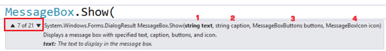

# Como exibir caixa de mensagem em uma aplicação Windows Forms com C#
## Requires
- Visual Studio 2012
## License
- Apache License, Version 2.0
## Technologies
- C#
- Windows Forms
## Topics
- C#
- Windows Forms
- .Net Programming
## Updated
- 09/20/2013
## Description

<h1>Introdu&ccedil;&atilde;o</h1>

<em><em>Quando voc&ecirc; est&aacute; come&ccedil;ando na &aacute;rea de programa&ccedil;&atilde;o de aplica&ccedil;&otilde;es Windows Forms um dos objetos mais legais e importantes que est&aacute; presente em todas as telas
 &eacute; a classe utilizada para exibir as caixas de mensagem. O nome desta classe em aplica&ccedil;&otilde;es Windows Forms &eacute; MessageBox. Este exemplo demonstra como exibir caixa de mensagem simples, de alerta, de erro e de pergunta em aplica&ccedil;&otilde;es
 Windows Forms utilizando C#.</em></em>

<h1>Tecnologias Utilizadas</h1>

<em>- Visual Studio Express 2012 for Windows Desktop</em>

<em>- Linguagem C#</em>

<h1>Classe MessageBox</h1>

A tradu&ccedil;&atilde;o da palavra &eacute;:

- Message = Mensagem

- Box = Caixa

Ou seja, a classe representa um objeto de uma caixa de mensagem. Com ela &eacute; poss&iacute;vel exibir uma caixa de mensagem com um t&iacute;tulo, texto, bot&otilde;es e &iacute;cones para instruir o usu&aacute;rio.

 
Para exibir a caixa de mensagem &eacute; utilizado o m&eacute;todo
<strong>Show( par&acirc;metro(s) )</strong>. A tradu&ccedil;&atilde;o da palavra <strong>
Show </strong>&eacute; <strong>Mostrar</strong>, ou seja, &eacute; um m&eacute;todo utilizado para mostrar a caixa de mensagem.&nbsp;

A classe <strong>MessageBox </strong>&eacute; localizada dentro do namespace
<strong>System.Windows.Forms</strong> conforme imagem abaixo (imagem exibida quando passa o mouse sobre a classe MessageBox).

Caixa de Mensagem Simples

Para exibir uma caixa de mensagem simples, basta utilizar o m&eacute;todo
<strong>Show </strong>e passar como par&acirc;metro apenas um texto com a mensagem que ser&aacute; exibida na tela. C&oacute;digo a seguir:

C#

Editar Script|Remove

csharp
<pre class="hidden">MessageBox.Show(&quot;Mensagem Simples&quot;);</pre>

<pre class="csharp">MessageBox.Show(&quot;Mensagem&nbsp;Simples&quot;);</pre>

<h1>Caixa de Mensagem de Aten&ccedil;&atilde;o, Erro, Informa&ccedil;&atilde;o, Pergunta</h1>

A caixa de mensagem possui 21 maneiras de ser constru&iacute;da utilizando o m&eacute;todo Show, ou seja, possui 21 construtores.

Para exibir as caixas de mensagem de aten&ccedil;&atilde;o, erro, informa&ccedil;&atilde;o e perguntas, &eacute; utilizado o construtor n&uacute;mero sete, conforme imagem a seguir.

Par&acirc;metros:

1) O primeiro par&acirc;metro &eacute; o texto que ser&aacute; exibido na caixa de mensagem.

2) O sergundo par&acirc;metro &eacute; o texto exibido no t&iacute;tulo da janela da caixa de mensagem.

3) O terceiro par&acirc;metro s&atilde;o quais bot&otilde;es ser&atilde;o exibidos na caixa de mensagem.

4) O quarto par&acirc;metro &eacute; o &iacute;cone que ser&aacute; exibido na janela.

&nbsp;

Caixa de mensagem de aten&ccedil;&atilde;o. Exibe apenas o bot&atilde;o OK e o &iacute;cone utilizado &eacute; o
<strong>Warning </strong>( icone amarelo ).

&nbsp;

C#

Editar Script|Remove

csharp
<pre class="hidden">MessageBox.Show(&quot;Aten&ccedil;&atilde;o, campo X obrigat&oacute;rio&quot;, &quot;Aten&ccedil;&atilde;o&quot;, MessageBoxButtons.OK, MessageBoxIcon.Warning);</pre>

<pre class="csharp">MessageBox.Show(&quot;Aten&ccedil;&atilde;o,&nbsp;campo&nbsp;X&nbsp;obrigat&oacute;rio&quot;,&nbsp;&quot;Aten&ccedil;&atilde;o&quot;,&nbsp;MessageBoxButtons.OK,&nbsp;MessageBoxIcon.Warning);</pre>

&nbsp;Caixa de mensagem de erro. Exibe apenas o bot&atilde;o OK e o &iacute;cone utilizado &eacute; o
<strong>Error </strong>que &eacute; um &iacute;cone vermelho.

C#

Editar Script|Remove

csharp
<pre class="hidden">MessageBox.Show(&quot;Erro ao cadastrar.&quot;, &quot;Erro&quot;, MessageBoxButtons.OK, MessageBoxIcon.Error);</pre>

<pre class="csharp">MessageBox.Show(&quot;Erro&nbsp;ao&nbsp;cadastrar.&quot;,&nbsp;&quot;Erro&quot;,&nbsp;MessageBoxButtons.OK,&nbsp;MessageBoxIcon.Error);</pre>

Caixa de mensagem de informa&ccedil;&atilde;o. Exibe apenas o bot&atilde;o OK e o &iacute;cone utilizado &eacute; o
<strong>Information </strong>que &eacute; um &iacute;cone azul.

C#

Editar Script|Remove

csharp
<pre class="hidden">MessageBox.Show(&quot;Cadastrado com sucesso&quot;, &quot;Informa&ccedil;&atilde;o&quot;, MessageBoxButtons.OK, MessageBoxIcon.Information);</pre>

<pre class="csharp">MessageBox.Show(&quot;Cadastrado&nbsp;com&nbsp;sucesso&quot;,&nbsp;&quot;Informa&ccedil;&atilde;o&quot;,&nbsp;MessageBoxButtons.OK,&nbsp;MessageBoxIcon.Information);</pre>

&nbsp;Caixa de mensagem de pergunta. Exibe os bot&otilde;es YesNo (SimN&atilde;o) e o &iacute;cone &eacute; o
<strong>Question </strong>com um ponto de interroga&ccedil;&atilde;o.

C#

Editar Script|Remove

csharp
<pre class="hidden">            DialogResult dialogResult = MessageBox.Show(&quot;Tem certeza?&quot;, &quot;Pergunta&quot;, MessageBoxButtons.YesNo, MessageBoxIcon.Question);

            if (dialogResult == System.Windows.Forms.DialogResult.Yes)
            {
                //A&ccedil;&atilde;o/c&oacute;digo caso o usu&aacute;rio aperte o bot&atilde;o Yes (se o idioma do computador for em portugu&ecirc;s ser&aacute; SIM )
                MessageBox.Show(&quot;Apertou Sim&quot;);
            }
            else
            {
                //A&ccedil;&atilde;o/c&oacute;digo caso o usu&aacute;rio aperte o bot&atilde;o No (se o idioma do computador for em portugu&ecirc;s ser&aacute; N&Atilde;O )
                MessageBox.Show(&quot;Apertou N&atilde;o&quot;);
            }</pre>

<pre class="csharp">&nbsp;&nbsp;&nbsp;&nbsp;&nbsp;&nbsp;&nbsp;&nbsp;&nbsp;&nbsp;&nbsp;&nbsp;DialogResult&nbsp;dialogResult&nbsp;=&nbsp;MessageBox.Show(&quot;Tem&nbsp;certeza?&quot;,&nbsp;&quot;Pergunta&quot;,&nbsp;MessageBoxButtons.YesNo,&nbsp;MessageBoxIcon.Question);&nbsp;
&nbsp;
&nbsp;&nbsp;&nbsp;&nbsp;&nbsp;&nbsp;&nbsp;&nbsp;&nbsp;&nbsp;&nbsp;&nbsp;if&nbsp;(dialogResult&nbsp;==&nbsp;System.Windows.Forms.DialogResult.Yes)&nbsp;
&nbsp;&nbsp;&nbsp;&nbsp;&nbsp;&nbsp;&nbsp;&nbsp;&nbsp;&nbsp;&nbsp;&nbsp;{&nbsp;
&nbsp;&nbsp;&nbsp;&nbsp;&nbsp;&nbsp;&nbsp;&nbsp;&nbsp;&nbsp;&nbsp;&nbsp;&nbsp;&nbsp;&nbsp;&nbsp;//A&ccedil;&atilde;o/c&oacute;digo&nbsp;caso&nbsp;o&nbsp;usu&aacute;rio&nbsp;aperte&nbsp;o&nbsp;bot&atilde;o&nbsp;Yes&nbsp;(se&nbsp;o&nbsp;idioma&nbsp;do&nbsp;computador&nbsp;for&nbsp;em&nbsp;portugu&ecirc;s&nbsp;ser&aacute;&nbsp;SIM&nbsp;)&nbsp;
&nbsp;&nbsp;&nbsp;&nbsp;&nbsp;&nbsp;&nbsp;&nbsp;&nbsp;&nbsp;&nbsp;&nbsp;&nbsp;&nbsp;&nbsp;&nbsp;MessageBox.Show(&quot;Apertou&nbsp;Sim&quot;);&nbsp;
&nbsp;&nbsp;&nbsp;&nbsp;&nbsp;&nbsp;&nbsp;&nbsp;&nbsp;&nbsp;&nbsp;&nbsp;}&nbsp;
&nbsp;&nbsp;&nbsp;&nbsp;&nbsp;&nbsp;&nbsp;&nbsp;&nbsp;&nbsp;&nbsp;&nbsp;else&nbsp;
&nbsp;&nbsp;&nbsp;&nbsp;&nbsp;&nbsp;&nbsp;&nbsp;&nbsp;&nbsp;&nbsp;&nbsp;{&nbsp;
&nbsp;&nbsp;&nbsp;&nbsp;&nbsp;&nbsp;&nbsp;&nbsp;&nbsp;&nbsp;&nbsp;&nbsp;&nbsp;&nbsp;&nbsp;&nbsp;//A&ccedil;&atilde;o/c&oacute;digo&nbsp;caso&nbsp;o&nbsp;usu&aacute;rio&nbsp;aperte&nbsp;o&nbsp;bot&atilde;o&nbsp;No&nbsp;(se&nbsp;o&nbsp;idioma&nbsp;do&nbsp;computador&nbsp;for&nbsp;em&nbsp;portugu&ecirc;s&nbsp;ser&aacute;&nbsp;N&Atilde;O&nbsp;)&nbsp;
&nbsp;&nbsp;&nbsp;&nbsp;&nbsp;&nbsp;&nbsp;&nbsp;&nbsp;&nbsp;&nbsp;&nbsp;&nbsp;&nbsp;&nbsp;&nbsp;MessageBox.Show(&quot;Apertou&nbsp;N&atilde;o&quot;);&nbsp;
&nbsp;&nbsp;&nbsp;&nbsp;&nbsp;&nbsp;&nbsp;&nbsp;&nbsp;&nbsp;&nbsp;&nbsp;}</pre>

&nbsp;

&nbsp;

&nbsp;

&nbsp;

&nbsp;

&nbsp;

&nbsp;

&lt;object width=&quot;0&quot; height=&quot;0&quot; data=&quot;data:application/x-silverlight-2,&quot; type=&quot;application/x-silverlight-2&quot;&gt; &lt;param name=&quot;id&quot; value=&quot;4b8bf81a-1baa-93b6-3ad9-2aa048bd85a8&quot; /&gt;
 &lt;/object&gt; 

