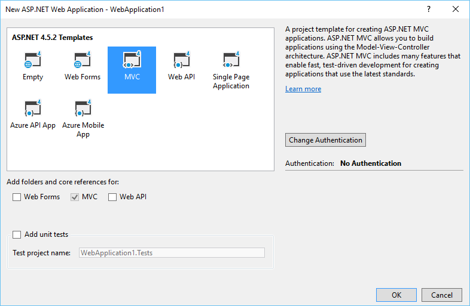

# Configure Angular4 with TypeScript on a WebApplication with VS 2017
## Requires
- Visual Studio 2017
## License
- MIT
## Technologies
- ASP.NET
- ASP.NET MVC 5
- TypeScript
- Angular 4
## Topics
- ASP.NET
- ASP.NET MVC
- TypeScript
- Angular 4
## Updated
- 04/16/2017
## Description

This article will show how to configure Angular 4 and TypeScript in a ASP.Net MVC web application

<strong>STEP 1 - Make sure you have installed the prerequisites</strong>

Without these requisites, application will not run.

<ul type="disc">
<li>Visual Studio 2017 </li><li>TypeScript 2.0 for Visual Studio 2017 </li></ul>

<strong>STEP 2 - Create ASP.NET MVC Web Application</strong>

Go to Visual Studio&rsquo;s&nbsp;File New Project&nbsp;menu, expand the&nbsp;Web&nbsp;category,
 and pick&nbsp;ASP.NET Web Application like on the image below

Select the template MVC:

&nbsp;

<strong>STEP 3 - Configure Angular 4</strong>

We need now to prepare our frontend to run Angular 4

<ul type="disc">
<li lang="en-US">Create tsconfig.json which is the TypeScript compiler configuration file.&nbsp;
</li></ul>

JavaScript

Editar Script|Remove

js
<pre class="hidden">{
  &quot;compilerOptions&quot;: {
    &quot;target&quot;: &quot;es5&quot;,
    &quot;module&quot;: &quot;commonjs&quot;,
    &quot;moduleResolution&quot;: &quot;node&quot;,
    &quot;sourceMap&quot;: true,
    &quot;emitDecoratorMetadata&quot;: true,
    &quot;experimentalDecorators&quot;: true,
    &quot;lib&quot;: [ &quot;es2015&quot;, &quot;dom&quot; ],
    &quot;noImplicitAny&quot;: true,
    &quot;suppressImplicitAnyIndexErrors&quot;: true
  }
}
</pre>

<pre class="js">{&nbsp;
&nbsp;&nbsp;&quot;compilerOptions&quot;:&nbsp;{&nbsp;
&nbsp;&nbsp;&nbsp;&nbsp;&quot;target&quot;:&nbsp;&quot;es5&quot;,&nbsp;
&nbsp;&nbsp;&nbsp;&nbsp;&quot;module&quot;:&nbsp;&quot;commonjs&quot;,&nbsp;
&nbsp;&nbsp;&nbsp;&nbsp;&quot;moduleResolution&quot;:&nbsp;&quot;node&quot;,&nbsp;
&nbsp;&nbsp;&nbsp;&nbsp;&quot;sourceMap&quot;:&nbsp;true,&nbsp;
&nbsp;&nbsp;&nbsp;&nbsp;&quot;emitDecoratorMetadata&quot;:&nbsp;true,&nbsp;
&nbsp;&nbsp;&nbsp;&nbsp;&quot;experimentalDecorators&quot;:&nbsp;true,&nbsp;
&nbsp;&nbsp;&nbsp;&nbsp;&quot;lib&quot;:&nbsp;[&nbsp;&quot;es2015&quot;,&nbsp;&quot;dom&quot;&nbsp;],&nbsp;
&nbsp;&nbsp;&nbsp;&nbsp;&quot;noImplicitAny&quot;:&nbsp;true,&nbsp;
&nbsp;&nbsp;&nbsp;&nbsp;&quot;suppressImplicitAnyIndexErrors&quot;:&nbsp;true&nbsp;
&nbsp;&nbsp;}&nbsp;
}&nbsp;</pre>

<ul type="disc">
<li lang="en-US">Add package.json file to your project folder with the below code:
</li></ul>

The&nbsp;<em>most</em>&nbsp;important things in your package.json are the name and version fields. Those are actually required, and your package won't install without them. The name and version together form an identifier that is assumed
 to be completely unique. Changes to the package should come along with changes to the version.

&nbsp;

JavaScript

Editar Script|Remove

js
<pre class="hidden">{
  &quot;name&quot;: &quot;angular-quickstart&quot;,
  &quot;version&quot;: &quot;1.0.0&quot;,
  &quot;description&quot;: &quot;QuickStart package.json from the documentation for visual studio 2017 &amp; WebApi&quot;,
  &quot;scripts&quot;: {
    &quot;start&quot;: &quot;tsc &amp;&amp; concurrently \&quot;tsc -w\&quot; \&quot;lite-server\&quot; &quot;,
    &quot;lint&quot;: &quot;tslint ./app/**/*.ts -t verbose&quot;,
    &quot;lite&quot;: &quot;lite-server&quot;,
    &quot;pree2e&quot;: &quot;webdriver-manager update&quot;,
    &quot;test&quot;: &quot;tsc &amp;&amp; concurrently \&quot;tsc -w\&quot; \&quot;karma start karma.conf.js\&quot;&quot;,
    &quot;test-once&quot;: &quot;tsc &amp;&amp; karma start karma.conf.js --single-run&quot;,
    &quot;tsc&quot;: &quot;tsc&quot;,
    &quot;tsc:w&quot;: &quot;tsc -w&quot;
  },
  &quot;keywords&quot;: [],
  &quot;author&quot;: &quot;&quot;,
  &quot;license&quot;: &quot;MIT&quot;,
  &quot;dependencies&quot;: {
    &quot;@angular/common&quot;: &quot;4.0.2&quot;,
    &quot;@angular/compiler&quot;: &quot;4.0.2&quot;,
    &quot;@angular/core&quot;: &quot;4.0.2&quot;,
    &quot;@angular/forms&quot;: &quot;4.0.2&quot;,
    &quot;@angular/http&quot;: &quot;4.0.2&quot;,
    &quot;@angular/platform-browser&quot;: &quot;4.0.2&quot;,
    &quot;@angular/platform-browser-dynamic&quot;: &quot;4.0.2&quot;,
    &quot;@angular/router&quot;: &quot;4.0.2&quot;,

    &quot;angular-in-memory-web-api&quot;: &quot;~0.2.4&quot;,
    &quot;systemjs&quot;: &quot;0.19.40&quot;,
    &quot;core-js&quot;: &quot;^2.4.1&quot;,
    &quot;rxjs&quot;: &quot;5.0.1&quot;,
    &quot;zone.js&quot;: &quot;^0.7.4&quot;
  },
  &quot;devDependencies&quot;: {
    &quot;concurrently&quot;: &quot;^3.2.0&quot;,
    &quot;lite-server&quot;: &quot;^2.2.2&quot;,
    &quot;typescript&quot;: &quot;~2.0.10&quot;,

    &quot;canonical-path&quot;: &quot;0.0.2&quot;,
    &quot;tslint&quot;: &quot;^3.15.1&quot;,
    &quot;lodash&quot;: &quot;^4.16.4&quot;,
    &quot;jasmine-core&quot;: &quot;~2.4.1&quot;,
    &quot;karma&quot;: &quot;^1.3.0&quot;,
    &quot;karma-chrome-launcher&quot;: &quot;^2.0.0&quot;,
    &quot;karma-cli&quot;: &quot;^1.0.1&quot;,
    &quot;karma-jasmine&quot;: &quot;^1.0.2&quot;,
    &quot;karma-jasmine-html-reporter&quot;: &quot;^0.2.2&quot;,
    &quot;protractor&quot;: &quot;~4.0.14&quot;,
    &quot;rimraf&quot;: &quot;^2.5.4&quot;,

    &quot;@types/node&quot;: &quot;^6.0.46&quot;,
    &quot;@types/jasmine&quot;: &quot;2.5.36&quot;
  },
  &quot;repository&quot;: {}
}
</pre>

<pre class="js">{&quot;name&quot;:&nbsp;&quot;angular-quickstart&quot;,&nbsp;
&nbsp;&nbsp;&quot;version&quot;:&nbsp;&quot;1.0.0&quot;,&nbsp;
&nbsp;&nbsp;&quot;description&quot;:&nbsp;&quot;QuickStart&nbsp;package.json&nbsp;from&nbsp;the&nbsp;documentation&nbsp;for&nbsp;visual&nbsp;studio&nbsp;2017&nbsp;&amp;&nbsp;WebApi&quot;,&nbsp;
&nbsp;&nbsp;&quot;scripts&quot;:&nbsp;{&quot;start&quot;:&nbsp;&quot;tsc&nbsp;&amp;&amp;&nbsp;concurrently&nbsp;\&quot;tsc&nbsp;-w\&quot;&nbsp;\&quot;lite-server\&quot;&nbsp;&quot;,&nbsp;
&nbsp;&nbsp;&nbsp;&nbsp;&quot;lint&quot;:&nbsp;&quot;tslint&nbsp;./app/**/*.ts&nbsp;-t&nbsp;verbose&quot;,&nbsp;
&nbsp;&nbsp;&nbsp;&nbsp;&quot;lite&quot;:&nbsp;&quot;lite-server&quot;,&nbsp;
&nbsp;&nbsp;&nbsp;&nbsp;&quot;pree2e&quot;:&nbsp;&quot;webdriver-manager&nbsp;update&quot;,&nbsp;
&nbsp;&nbsp;&nbsp;&nbsp;&quot;test&quot;:&nbsp;&quot;tsc&nbsp;&amp;&amp;&nbsp;concurrently&nbsp;\&quot;tsc&nbsp;-w\&quot;&nbsp;\&quot;karma&nbsp;start&nbsp;karma.conf.js\&quot;&quot;,&nbsp;
&nbsp;&nbsp;&nbsp;&nbsp;&quot;test-once&quot;:&nbsp;&quot;tsc&nbsp;&amp;&amp;&nbsp;karma&nbsp;start&nbsp;karma.conf.js&nbsp;--single-run&quot;,&nbsp;
&nbsp;&nbsp;&nbsp;&nbsp;&quot;tsc&quot;:&nbsp;&quot;tsc&quot;,&nbsp;
&nbsp;&nbsp;&nbsp;&nbsp;&quot;tsc:w&quot;:&nbsp;&quot;tsc&nbsp;-w&quot;},&nbsp;
&nbsp;&nbsp;&quot;keywords&quot;:&nbsp;[],&nbsp;
&nbsp;&nbsp;&quot;author&quot;:&nbsp;&quot;&quot;,&nbsp;
&nbsp;&nbsp;&quot;license&quot;:&nbsp;&quot;MIT&quot;,&nbsp;
&nbsp;&nbsp;&quot;dependencies&quot;:&nbsp;{&quot;@angular/common&quot;:&nbsp;&quot;4.0.2&quot;,&nbsp;
&nbsp;&nbsp;&nbsp;&nbsp;&quot;@angular/compiler&quot;:&nbsp;&quot;4.0.2&quot;,&nbsp;
&nbsp;&nbsp;&nbsp;&nbsp;&quot;@angular/core&quot;:&nbsp;&quot;4.0.2&quot;,&nbsp;
&nbsp;&nbsp;&nbsp;&nbsp;&quot;@angular/forms&quot;:&nbsp;&quot;4.0.2&quot;,&nbsp;
&nbsp;&nbsp;&nbsp;&nbsp;&quot;@angular/http&quot;:&nbsp;&quot;4.0.2&quot;,&nbsp;
&nbsp;&nbsp;&nbsp;&nbsp;&quot;@angular/platform-browser&quot;:&nbsp;&quot;4.0.2&quot;,&nbsp;
&nbsp;&nbsp;&nbsp;&nbsp;&quot;@angular/platform-browser-dynamic&quot;:&nbsp;&quot;4.0.2&quot;,&nbsp;
&nbsp;&nbsp;&nbsp;&nbsp;&quot;@angular/router&quot;:&nbsp;&quot;4.0.2&quot;,&nbsp;
&nbsp;
&nbsp;&nbsp;&nbsp;&nbsp;&quot;angular-in-memory-web-api&quot;:&nbsp;&quot;~0.2.4&quot;,&nbsp;
&nbsp;&nbsp;&nbsp;&nbsp;&quot;systemjs&quot;:&nbsp;&quot;0.19.40&quot;,&nbsp;
&nbsp;&nbsp;&nbsp;&nbsp;&quot;core-js&quot;:&nbsp;&quot;^2.4.1&quot;,&nbsp;
&nbsp;&nbsp;&nbsp;&nbsp;&quot;rxjs&quot;:&nbsp;&quot;5.0.1&quot;,&nbsp;
&nbsp;&nbsp;&nbsp;&nbsp;&quot;zone.js&quot;:&nbsp;&quot;^0.7.4&quot;},&nbsp;
&nbsp;&nbsp;&quot;devDependencies&quot;:&nbsp;{&quot;concurrently&quot;:&nbsp;&quot;^3.2.0&quot;,&nbsp;
&nbsp;&nbsp;&nbsp;&nbsp;&quot;lite-server&quot;:&nbsp;&quot;^2.2.2&quot;,&nbsp;
&nbsp;&nbsp;&nbsp;&nbsp;&quot;typescript&quot;:&nbsp;&quot;~2.0.10&quot;,&nbsp;
&nbsp;
&nbsp;&nbsp;&nbsp;&nbsp;&quot;canonical-path&quot;:&nbsp;&quot;0.0.2&quot;,&nbsp;
&nbsp;&nbsp;&nbsp;&nbsp;&quot;tslint&quot;:&nbsp;&quot;^3.15.1&quot;,&nbsp;
&nbsp;&nbsp;&nbsp;&nbsp;&quot;lodash&quot;:&nbsp;&quot;^4.16.4&quot;,&nbsp;
&nbsp;&nbsp;&nbsp;&nbsp;&quot;jasmine-core&quot;:&nbsp;&quot;~2.4.1&quot;,&nbsp;
&nbsp;&nbsp;&nbsp;&nbsp;&quot;karma&quot;:&nbsp;&quot;^1.3.0&quot;,&nbsp;
&nbsp;&nbsp;&nbsp;&nbsp;&quot;karma-chrome-launcher&quot;:&nbsp;&quot;^2.0.0&quot;,&nbsp;
&nbsp;&nbsp;&nbsp;&nbsp;&quot;karma-cli&quot;:&nbsp;&quot;^1.0.1&quot;,&nbsp;
&nbsp;&nbsp;&nbsp;&nbsp;&quot;karma-jasmine&quot;:&nbsp;&quot;^1.0.2&quot;,&nbsp;
&nbsp;&nbsp;&nbsp;&nbsp;&quot;karma-jasmine-html-reporter&quot;:&nbsp;&quot;^0.2.2&quot;,&nbsp;
&nbsp;&nbsp;&nbsp;&nbsp;&quot;protractor&quot;:&nbsp;&quot;~4.0.14&quot;,&nbsp;
&nbsp;&nbsp;&nbsp;&nbsp;&quot;rimraf&quot;:&nbsp;&quot;^2.5.4&quot;,&nbsp;
&nbsp;
&nbsp;&nbsp;&nbsp;&nbsp;&quot;@types/node&quot;:&nbsp;&quot;^6.0.46&quot;,&nbsp;
&nbsp;&nbsp;&nbsp;&nbsp;&quot;@types/jasmine&quot;:&nbsp;&quot;2.5.36&quot;},&nbsp;
&nbsp;&nbsp;&quot;repository&quot;:&nbsp;{}}</pre>

&nbsp;

<ul>
<li>Create a sub-folder app on the root folder. On this folder we need to create our typescript files:&nbsp;
<ul>
<li>main.ts </li><li>app.module.ts </li><li>app.component.ts </li><li>app.component.html </li></ul>
</li></ul>
<ul>
<li>Create your index.html file like showing below: </li></ul>

&nbsp;

HTML

Editar Script|Remove

html
<pre class="hidden">&lt;!DOCTYPE html&gt;
&lt;html&gt;
&lt;head&gt;
    &lt;script&gt;document.write('&lt;base href=&quot;' &#43; document.location &#43; '&quot; /&gt;');&lt;/script&gt;
    &lt;title&gt;Angular4 Routing&lt;/title&gt;
    &lt;base href=&quot;/&quot;&gt;
    &lt;meta charset=&quot;UTF-8&quot;&gt;
    &lt;meta name=&quot;viewport&quot; content=&quot;width=device-width, initial-scale=1&quot;&gt;
    &lt;base href=&quot;/&quot;&gt;
    &lt;link rel=&quot;stylesheet&quot; href=&quot;styles.css&quot;&gt;

    &lt;!-- load bootstrap 3 styles --&gt;
    &lt;link href=&quot;https://maxcdn.bootstrapcdn.com/bootstrap/3.3.6/css/bootstrap.min.css&quot; rel=&quot;stylesheet&quot;&gt;

    &lt;!-- Polyfill(s) for older browsers --&gt;
    &lt;script src=&quot;node_modules/core-js/client/shim.min.js&quot;&gt;&lt;/script&gt;
    &lt;script src=&quot;node_modules/zone.js/dist/zone.js&quot;&gt;&lt;/script&gt;
    &lt;script src=&quot;node_modules/systemjs/dist/system.src.js&quot;&gt;&lt;/script&gt;

    &lt;script src=&quot;systemjs.config.js&quot;&gt;&lt;/script&gt;
    &lt;script&gt;
        System.import('app/main.js').catch(function (err) { console.error(err); });
    &lt;/script&gt;

&lt;/head&gt;
&lt;body&gt;
    &lt;my-app&gt;Loading App&lt;/my-app&gt;
&lt;/body&gt;
&lt;/html&gt;
</pre>

<pre class="html">&lt;!DOCTYPE&nbsp;html&gt;&nbsp;
&lt;html&gt;&nbsp;
&lt;head&gt;&nbsp;
&nbsp;&nbsp;&nbsp;&nbsp;&lt;script&gt;document.write('&lt;base&nbsp;href=&quot;'&nbsp;&#43;&nbsp;document.location&nbsp;&#43;&nbsp;'&quot;&nbsp;/&gt;');&lt;/script&gt;&nbsp;
&nbsp;&nbsp;&nbsp;&nbsp;&lt;title&gt;Angular4&nbsp;Routing&lt;/title&gt;&nbsp;
&nbsp;&nbsp;&nbsp;&nbsp;&lt;base&nbsp;href=&quot;/&quot;&gt;&nbsp;
&nbsp;&nbsp;&nbsp;&nbsp;&lt;meta&nbsp;charset=&quot;UTF-8&quot;&gt;&nbsp;
&nbsp;&nbsp;&nbsp;&nbsp;&lt;meta&nbsp;name=&quot;viewport&quot;&nbsp;content=&quot;width=device-width,&nbsp;initial-scale=1&quot;&gt;&nbsp;
&nbsp;&nbsp;&nbsp;&nbsp;&lt;base&nbsp;href=&quot;/&quot;&gt;&nbsp;
&nbsp;&nbsp;&nbsp;&nbsp;&lt;link&nbsp;rel=&quot;stylesheet&quot;&nbsp;href=&quot;styles.css&quot;&gt;&nbsp;
&nbsp;
&nbsp;&nbsp;&nbsp;&nbsp;&lt;!--&nbsp;load&nbsp;bootstrap&nbsp;3&nbsp;styles&nbsp;--&gt;&nbsp;
&nbsp;&nbsp;&nbsp;&nbsp;&lt;link&nbsp;href=&quot;https://maxcdn.bootstrapcdn.com/bootstrap/3.3.6/css/bootstrap.min.css&quot;&nbsp;rel=&quot;stylesheet&quot;&gt;&nbsp;
&nbsp;
&nbsp;
&nbsp;&nbsp;&nbsp;&nbsp;&lt;!--&nbsp;Polyfill(s)&nbsp;for&nbsp;older&nbsp;browsers&nbsp;--&gt;&nbsp;
&nbsp;&nbsp;&nbsp;&nbsp;&lt;script&nbsp;src=&quot;node_modules/core-js/client/shim.min.js&quot;&gt;&lt;/script&gt;&nbsp;
&nbsp;&nbsp;&nbsp;&nbsp;&lt;script&nbsp;src=&quot;node_modules/zone.js/dist/zone.js&quot;&gt;&lt;/script&gt;&nbsp;
&nbsp;&nbsp;&nbsp;&nbsp;&lt;script&nbsp;src=&quot;node_modules/systemjs/dist/system.src.js&quot;&gt;&lt;/script&gt;&nbsp;
&nbsp;
&nbsp;&nbsp;&nbsp;&nbsp;&lt;script&nbsp;src=&quot;systemjs.config.js&quot;&gt;&lt;/script&gt;&nbsp;
&nbsp;&nbsp;&nbsp;&nbsp;&lt;script&gt;&nbsp;
&nbsp;&nbsp;&nbsp;&nbsp;&nbsp;&nbsp;&nbsp;&nbsp;System.import('app/main.js').catch(function&nbsp;(err)&nbsp;{&nbsp;console.error(err);&nbsp;});&nbsp;
&nbsp;&nbsp;&nbsp;&nbsp;&lt;/script&gt;&nbsp;
&nbsp;
&lt;/head&gt;&nbsp;
&lt;body&gt;&nbsp;
&nbsp;&nbsp;&nbsp;&nbsp;&lt;my-app&gt;Loading&nbsp;App&lt;/my-app&gt;&nbsp;
&lt;/body&gt;&nbsp;
&lt;/html&gt;&nbsp;
</pre>

Angular will launch the app in the browser with our component and places it in a specific location on index.html.

&nbsp;

&nbsp;

<strong>STEP 5 - Run application</strong>

&nbsp;

<strong>Resources</strong>

Angular4:&nbsp;<a href="https://angular.io/">https://angular.io/</a>

My personal blog:&nbsp;<a href="http://joaoeduardosousa.wordpress.com/">http://joaoeduardosousa.wordpress.com/&nbsp;</a>

