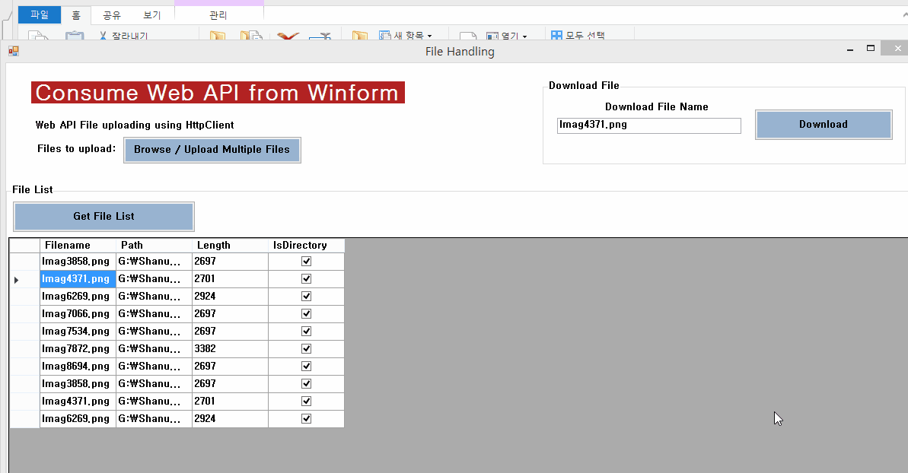
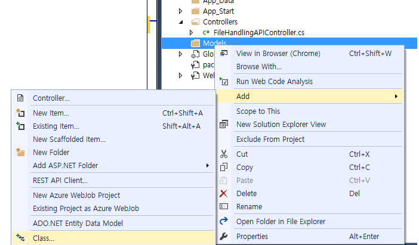
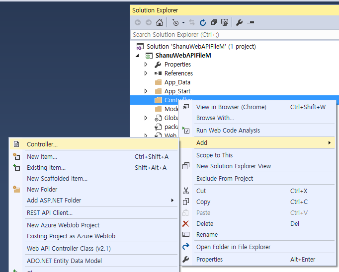
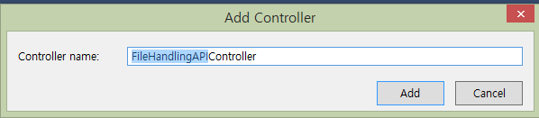
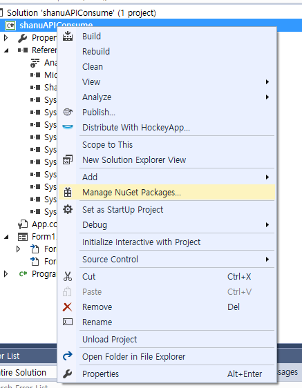

# Consume Web API in Winform for File Handling
## Requires
- Visual Studio 2015
## License
- MIT
## Technologies
- C#
- ASP.NET Web API
## Topics
- C#
- Web API
## Updated
- 07/23/2017
## Description

<h1>Introduction</h1>

In this article, we will see in detail on how to consume Web API in Windows Form for Uploading File to Web server, Get the list of file Information from Server folder and download the file from Server using C# Windows application.

For this demo, we will create one Web API Project and one WinForm Application. &nbsp;

In Web API project, we will create a Controller for Uploading files to web server and to return the File details list with, File Name, File Path and File length.

From WinForm application user can upload the files to the web server using the MultipartFormDataContent , Display the File information to Datagridview with Filename, File path and length from web server. Download the file from web server to the local client
 winform root folder using WebClient

<strong>WEB API</strong>

Web API is a simple and easy way to build HTTP Services for Browsers and Mobiles.&nbsp;It has the following four methods as Get/Post/Put and Delete where.

<ul>
<li>Get is used to request for the data. (Select) </li><li>Post is used to create a data. (Insert) </li><li>Put is used to update the data. </li><li>Delete used is to delete the data. </li></ul>
<h1>Building the Sample</h1>

<strong>Prerequisites</strong>

<ul>
<li><em>Visual Studio 2015:</em>&nbsp;You can download it from&nbsp;<a href="https://www.visualstudio.com/en-us/downloads/visual-studio-2015-downloads-vs.aspx" target="_blank">here</a>.<strong>&nbsp;</strong>
</li><li>Microsoft.AspNet.WebApi.Client Install for winform application using Nuget Packages.
</li><li>&nbsp;Newtonsoft.json Install for winform application using Nuget Packages. </li></ul>

Description

<h1><strong>Step 1: Create Web API Application</strong></h1>

<strong>&nbsp;</strong>After installing \ Visual Studio 2015. Click Start, then Programs and select Visual Studio 2015 - Click Visual Studio 2015. Click New, then Project, select Web and select ASP.NET Web Application. Enter your Project Name and click OK.

Next select Empty project and WEB API. Click OK.

<h1><strong>Step 2: Creating Class File in Models</strong></h1>

<strong style="font-size:1.5em">Create a Class for file details model</strong>

Right click Models Folder &gt; Click Add new class.&nbsp;

Enter the file name as &ldquo;UploadFile&rdquo; and create a class file.

Add the below properties for file handling.

&nbsp;

C#

Edit|Remove

csharp
<pre class="hidden">public class UploadFIle
	{
		public string FilePath { get; set; }
		public string FileName { get; set; }
		public long FileLength { get; set; }
	}
</pre>

<pre class="csharp">publicclass&nbsp;UploadFIle&nbsp;
&nbsp;&nbsp;&nbsp;&nbsp;{&nbsp;
&nbsp;&nbsp;&nbsp;&nbsp;&nbsp;&nbsp;&nbsp;&nbsp;publicstring&nbsp;FilePath&nbsp;{&nbsp;get;&nbsp;set;&nbsp;}&nbsp;
&nbsp;&nbsp;&nbsp;&nbsp;&nbsp;&nbsp;&nbsp;&nbsp;publicstring&nbsp;FileName&nbsp;{&nbsp;get;&nbsp;set;&nbsp;}&nbsp;
&nbsp;&nbsp;&nbsp;&nbsp;&nbsp;&nbsp;&nbsp;&nbsp;publiclong&nbsp;FileLength&nbsp;{&nbsp;get;&nbsp;set;&nbsp;}&nbsp;
&nbsp;&nbsp;&nbsp;&nbsp;}&nbsp;
</pre>

&nbsp;

<h2><strong>Create a </strong><strong>MultipartProvider Class for upload file</strong></h2>

Right click Models Folder &gt; Click Add new class.&nbsp;

&nbsp;Enter the file name as &ldquo;UploadFileMultiparProvider&rdquo; and create a class file.

Create the MultipartProvider class for uploading files.

&nbsp;

C#

Edit|Remove

csharp
<pre class="hidden">public class UploadFileMultiparProvider : MultipartFormDataStreamProvider
	{
		public UploadFileMultiparProvider(string rootPath) : base(rootPath) { }

		public override string GetLocalFileName(HttpContentHeaders headers)
		{
			if (headers != null &amp;&amp;
				headers.ContentDisposition != null)
			{
				return headers
					.ContentDisposition
					.FileName.TrimEnd('&quot;').TrimStart('&quot;');
			}

			return base.GetLocalFileName(headers);
		}
	}
</pre>

<pre class="csharp">publicclass&nbsp;UploadFileMultiparProvider&nbsp;:&nbsp;MultipartFormDataStreamProvider&nbsp;
&nbsp;&nbsp;&nbsp;&nbsp;{&nbsp;
&nbsp;&nbsp;&nbsp;&nbsp;&nbsp;&nbsp;&nbsp;&nbsp;public&nbsp;UploadFileMultiparProvider(string&nbsp;rootPath)&nbsp;:&nbsp;base(rootPath)&nbsp;{&nbsp;}&nbsp;
&nbsp;
&nbsp;&nbsp;&nbsp;&nbsp;&nbsp;&nbsp;&nbsp;&nbsp;publicoverridestring&nbsp;GetLocalFileName(HttpContentHeaders&nbsp;headers)&nbsp;
&nbsp;&nbsp;&nbsp;&nbsp;&nbsp;&nbsp;&nbsp;&nbsp;{&nbsp;
&nbsp;&nbsp;&nbsp;&nbsp;&nbsp;&nbsp;&nbsp;&nbsp;&nbsp;&nbsp;&nbsp;&nbsp;if&nbsp;(headers&nbsp;!=&nbsp;null&nbsp;&amp;&amp;&nbsp;
&nbsp;&nbsp;&nbsp;&nbsp;&nbsp;&nbsp;&nbsp;&nbsp;&nbsp;&nbsp;&nbsp;&nbsp;&nbsp;&nbsp;&nbsp;&nbsp;headers.ContentDisposition&nbsp;!=&nbsp;null)&nbsp;
&nbsp;&nbsp;&nbsp;&nbsp;&nbsp;&nbsp;&nbsp;&nbsp;&nbsp;&nbsp;&nbsp;&nbsp;{&nbsp;
&nbsp;&nbsp;&nbsp;&nbsp;&nbsp;&nbsp;&nbsp;&nbsp;&nbsp;&nbsp;&nbsp;&nbsp;&nbsp;&nbsp;&nbsp;&nbsp;return&nbsp;headers&nbsp;
&nbsp;&nbsp;&nbsp;&nbsp;&nbsp;&nbsp;&nbsp;&nbsp;&nbsp;&nbsp;&nbsp;&nbsp;&nbsp;&nbsp;&nbsp;&nbsp;&nbsp;&nbsp;&nbsp;&nbsp;.ContentDisposition&nbsp;
&nbsp;&nbsp;&nbsp;&nbsp;&nbsp;&nbsp;&nbsp;&nbsp;&nbsp;&nbsp;&nbsp;&nbsp;&nbsp;&nbsp;&nbsp;&nbsp;&nbsp;&nbsp;&nbsp;&nbsp;.FileName.TrimEnd('&quot;').TrimStart('&quot;');&nbsp;
&nbsp;&nbsp;&nbsp;&nbsp;&nbsp;&nbsp;&nbsp;&nbsp;&nbsp;&nbsp;&nbsp;&nbsp;}&nbsp;
&nbsp;
&nbsp;&nbsp;&nbsp;&nbsp;&nbsp;&nbsp;&nbsp;&nbsp;&nbsp;&nbsp;&nbsp;&nbsp;returnbase.GetLocalFileName(headers);&nbsp;
&nbsp;&nbsp;&nbsp;&nbsp;&nbsp;&nbsp;&nbsp;&nbsp;}&nbsp;
&nbsp;&nbsp;&nbsp;&nbsp;}&nbsp;
</pre>

&nbsp;

<h2><strong>Create a </strong><strong>MimeMultipart Filter Class for upload file</strong></h2>

Right click Models Folder &gt; Click Add new class.&nbsp;

Enter the file name as &ldquo;MimeMultipart&rdquo; and create a class file&nbsp;

&nbsp;

C#

Edit|Remove

csharp
<pre class="hidden">public class MimeMultipart : ActionFilterAttribute
	{
		public override void OnActionExecuting(HttpActionContext actionContext)
		{
			if (!actionContext.Request.Content.IsMimeMultipartContent())
			{
				throw new HttpResponseException(
					new HttpResponseMessage(
						HttpStatusCode.UnsupportedMediaType)
				);
			}
		}
</pre>

<pre class="csharp">publicclass&nbsp;MimeMultipart&nbsp;:&nbsp;ActionFilterAttribute&nbsp;
&nbsp;&nbsp;&nbsp;&nbsp;{&nbsp;
&nbsp;&nbsp;&nbsp;&nbsp;&nbsp;&nbsp;&nbsp;&nbsp;publicoverridevoid&nbsp;OnActionExecuting(HttpActionContext&nbsp;actionContext)&nbsp;
&nbsp;&nbsp;&nbsp;&nbsp;&nbsp;&nbsp;&nbsp;&nbsp;{&nbsp;
&nbsp;&nbsp;&nbsp;&nbsp;&nbsp;&nbsp;&nbsp;&nbsp;&nbsp;&nbsp;&nbsp;&nbsp;if&nbsp;(!actionContext.Request.Content.IsMimeMultipartContent())&nbsp;
&nbsp;&nbsp;&nbsp;&nbsp;&nbsp;&nbsp;&nbsp;&nbsp;&nbsp;&nbsp;&nbsp;&nbsp;{&nbsp;
&nbsp;&nbsp;&nbsp;&nbsp;&nbsp;&nbsp;&nbsp;&nbsp;&nbsp;&nbsp;&nbsp;&nbsp;&nbsp;&nbsp;&nbsp;&nbsp;thrownew&nbsp;HttpResponseException(&nbsp;
&nbsp;&nbsp;&nbsp;&nbsp;&nbsp;&nbsp;&nbsp;&nbsp;&nbsp;&nbsp;&nbsp;&nbsp;&nbsp;&nbsp;&nbsp;&nbsp;&nbsp;&nbsp;&nbsp;&nbsp;new&nbsp;HttpResponseMessage(&nbsp;
&nbsp;&nbsp;&nbsp;&nbsp;&nbsp;&nbsp;&nbsp;&nbsp;&nbsp;&nbsp;&nbsp;&nbsp;&nbsp;&nbsp;&nbsp;&nbsp;&nbsp;&nbsp;&nbsp;&nbsp;&nbsp;&nbsp;&nbsp;&nbsp;HttpStatusCode.UnsupportedMediaType)&nbsp;
&nbsp;&nbsp;&nbsp;&nbsp;&nbsp;&nbsp;&nbsp;&nbsp;&nbsp;&nbsp;&nbsp;&nbsp;&nbsp;&nbsp;&nbsp;&nbsp;);&nbsp;
&nbsp;&nbsp;&nbsp;&nbsp;&nbsp;&nbsp;&nbsp;&nbsp;&nbsp;&nbsp;&nbsp;&nbsp;}&nbsp;
&nbsp;&nbsp;&nbsp;&nbsp;&nbsp;&nbsp;&nbsp;&nbsp;}&nbsp;
</pre>

&nbsp;

<h1><strong>Step 3: Create Web API Controller </strong>&nbsp;</h1>

Right Click the Controllers Folder &gt; Click Add &gt; Controller.<strong>&nbsp;</strong>

Select Controller from left side&gt; Select Web API Controller Class.

Give your controller name as &ldquo;andlingAPIController&rdquo; and click Add

<h2><strong>Create File Upload Post Method</strong></h2>

Using Web API post method, we can upload the file to the web server. In this method, we get the file using post method and upload the file to the web server Uploads folder.

&nbsp;

C#

Edit|Remove

csharp
<pre class="hidden">//Upload the File 
		[MimeMultipart]
		public async Task&lt;UploadFIle&gt; Post()
		{
			var uploadPath = HttpContext.Current.Server.MapPath(&quot;~/Uploads&quot;);

			if (Request.Content.IsMimeMultipartContent())
			{

				var filePath = Request.Headers.GetValues(&quot;filePath&quot;).ToList();
				string filepathfromclient = &quot;&quot;;

				if (filePath != null)
				{
					filepathfromclient = filePath[0];
					uploadPath = uploadPath &#43; filepathfromclient;
				}

			}

			if (!Directory.Exists(uploadPath))
				Directory.CreateDirectory(uploadPath);

			var multipartFormDataStreamProvider = new UploadFileMultiparProvider(uploadPath);

			// Read the MIME multipart asynchronously 
			await Request.Content.ReadAsMultipartAsync(multipartFormDataStreamProvider);

			string _localFileName = multipartFormDataStreamProvider
				.FileData.Select(multiPartData =&gt; multiPartData.LocalFileName).FirstOrDefault();

			// Create response
			return new UploadFIle
			{
				FilePath = _localFileName,

				FileName = Path.GetFileName(_localFileName),

				FileLength = new FileInfo(_localFileName).Length
			};
		}

WEB API getFileInfo Method  
Using this get method we return all the file information as a JSON result.
//api/ FileHandlingAPI/getFileInfo?Id=1
		[ActionName(&quot;get&quot;), HttpGet]
		public IEnumerable&lt;FilePath&gt; getFileInfo(int Id)
		{
			List&lt;FilePath&gt; files = new List&lt;FilePath&gt;();
			var uploadPath = HttpContext.Current.Server.MapPath(&quot;~/Uploads&quot;);

			DirectoryInfo dirInfo = new DirectoryInfo(uploadPath);

			foreach (FileInfo fInfo in dirInfo.GetFiles())
			{
				files.Add(new FilePath() { Path = uploadPath, Filename = fInfo.Name, Length = fInfo.Length, IsDirectory = File.GetAttributes(uploadPath).HasFlag(FileAttributes.Directory) });
			}

			getAllSubfolderFiles(dirInfo, files);

			return files.ToList();
		}
</pre>

<pre class="csharp">//Upload&nbsp;the&nbsp;File&nbsp;&nbsp;
&nbsp;&nbsp;&nbsp;&nbsp;&nbsp;&nbsp;&nbsp;&nbsp;[MimeMultipart]&nbsp;
&nbsp;&nbsp;&nbsp;&nbsp;&nbsp;&nbsp;&nbsp;&nbsp;public&nbsp;async&nbsp;Task&lt;UploadFIle&gt;&nbsp;Post()&nbsp;
&nbsp;&nbsp;&nbsp;&nbsp;&nbsp;&nbsp;&nbsp;&nbsp;{&nbsp;
&nbsp;&nbsp;&nbsp;&nbsp;&nbsp;&nbsp;&nbsp;&nbsp;&nbsp;&nbsp;&nbsp;&nbsp;var&nbsp;uploadPath&nbsp;=&nbsp;HttpContext.Current.Server.MapPath(&quot;~/Uploads&quot;);&nbsp;
&nbsp;
&nbsp;
&nbsp;&nbsp;&nbsp;&nbsp;&nbsp;&nbsp;&nbsp;&nbsp;&nbsp;&nbsp;&nbsp;&nbsp;if&nbsp;(Request.Content.IsMimeMultipartContent())&nbsp;
&nbsp;&nbsp;&nbsp;&nbsp;&nbsp;&nbsp;&nbsp;&nbsp;&nbsp;&nbsp;&nbsp;&nbsp;{&nbsp;
&nbsp;
&nbsp;&nbsp;&nbsp;&nbsp;&nbsp;&nbsp;&nbsp;&nbsp;&nbsp;&nbsp;&nbsp;&nbsp;&nbsp;&nbsp;&nbsp;&nbsp;var&nbsp;filePath&nbsp;=&nbsp;Request.Headers.GetValues(&quot;filePath&quot;).ToList();&nbsp;
&nbsp;&nbsp;&nbsp;&nbsp;&nbsp;&nbsp;&nbsp;&nbsp;&nbsp;&nbsp;&nbsp;&nbsp;&nbsp;&nbsp;&nbsp;&nbsp;string&nbsp;filepathfromclient&nbsp;=&nbsp;&quot;&quot;;&nbsp;
&nbsp;
&nbsp;
&nbsp;&nbsp;&nbsp;&nbsp;&nbsp;&nbsp;&nbsp;&nbsp;&nbsp;&nbsp;&nbsp;&nbsp;&nbsp;&nbsp;&nbsp;&nbsp;if&nbsp;(filePath&nbsp;!=&nbsp;null)&nbsp;
&nbsp;&nbsp;&nbsp;&nbsp;&nbsp;&nbsp;&nbsp;&nbsp;&nbsp;&nbsp;&nbsp;&nbsp;&nbsp;&nbsp;&nbsp;&nbsp;{&nbsp;
&nbsp;&nbsp;&nbsp;&nbsp;&nbsp;&nbsp;&nbsp;&nbsp;&nbsp;&nbsp;&nbsp;&nbsp;&nbsp;&nbsp;&nbsp;&nbsp;&nbsp;&nbsp;&nbsp;&nbsp;filepathfromclient&nbsp;=&nbsp;filePath[0];&nbsp;
&nbsp;&nbsp;&nbsp;&nbsp;&nbsp;&nbsp;&nbsp;&nbsp;&nbsp;&nbsp;&nbsp;&nbsp;&nbsp;&nbsp;&nbsp;&nbsp;&nbsp;&nbsp;&nbsp;&nbsp;uploadPath&nbsp;=&nbsp;uploadPath&nbsp;&#43;&nbsp;filepathfromclient;&nbsp;
&nbsp;&nbsp;&nbsp;&nbsp;&nbsp;&nbsp;&nbsp;&nbsp;&nbsp;&nbsp;&nbsp;&nbsp;&nbsp;&nbsp;&nbsp;&nbsp;}&nbsp;
&nbsp;
&nbsp;
&nbsp;&nbsp;&nbsp;&nbsp;&nbsp;&nbsp;&nbsp;&nbsp;&nbsp;&nbsp;&nbsp;&nbsp;}&nbsp;
&nbsp;
&nbsp;&nbsp;&nbsp;&nbsp;&nbsp;&nbsp;&nbsp;&nbsp;&nbsp;&nbsp;&nbsp;&nbsp;if&nbsp;(!Directory.Exists(uploadPath))&nbsp;
&nbsp;&nbsp;&nbsp;&nbsp;&nbsp;&nbsp;&nbsp;&nbsp;&nbsp;&nbsp;&nbsp;&nbsp;&nbsp;&nbsp;&nbsp;&nbsp;Directory.CreateDirectory(uploadPath);&nbsp;
&nbsp;
&nbsp;&nbsp;&nbsp;&nbsp;&nbsp;&nbsp;&nbsp;&nbsp;&nbsp;&nbsp;&nbsp;&nbsp;var&nbsp;multipartFormDataStreamProvider&nbsp;=&nbsp;new&nbsp;UploadFileMultiparProvider(uploadPath);&nbsp;
&nbsp;
&nbsp;&nbsp;&nbsp;&nbsp;&nbsp;&nbsp;&nbsp;&nbsp;&nbsp;&nbsp;&nbsp;&nbsp;//&nbsp;Read&nbsp;the&nbsp;MIME&nbsp;multipart&nbsp;asynchronously&nbsp;&nbsp;
&nbsp;&nbsp;&nbsp;&nbsp;&nbsp;&nbsp;&nbsp;&nbsp;&nbsp;&nbsp;&nbsp;&nbsp;await&nbsp;Request.Content.ReadAsMultipartAsync(multipartFormDataStreamProvider);&nbsp;
&nbsp;
&nbsp;&nbsp;&nbsp;&nbsp;&nbsp;&nbsp;&nbsp;&nbsp;&nbsp;&nbsp;&nbsp;&nbsp;string&nbsp;_localFileName&nbsp;=&nbsp;multipartFormDataStreamProvider&nbsp;
&nbsp;&nbsp;&nbsp;&nbsp;&nbsp;&nbsp;&nbsp;&nbsp;&nbsp;&nbsp;&nbsp;&nbsp;&nbsp;&nbsp;&nbsp;&nbsp;.FileData.Select(multiPartData&nbsp;=&gt;&nbsp;multiPartData.LocalFileName).FirstOrDefault();&nbsp;
&nbsp;
&nbsp;&nbsp;&nbsp;&nbsp;&nbsp;&nbsp;&nbsp;&nbsp;&nbsp;&nbsp;&nbsp;&nbsp;//&nbsp;Create&nbsp;responsereturnnew&nbsp;UploadFIle&nbsp;
&nbsp;&nbsp;&nbsp;&nbsp;&nbsp;&nbsp;&nbsp;&nbsp;&nbsp;&nbsp;&nbsp;&nbsp;{&nbsp;
&nbsp;&nbsp;&nbsp;&nbsp;&nbsp;&nbsp;&nbsp;&nbsp;&nbsp;&nbsp;&nbsp;&nbsp;&nbsp;&nbsp;&nbsp;&nbsp;FilePath&nbsp;=&nbsp;_localFileName,&nbsp;
&nbsp;
&nbsp;&nbsp;&nbsp;&nbsp;&nbsp;&nbsp;&nbsp;&nbsp;&nbsp;&nbsp;&nbsp;&nbsp;&nbsp;&nbsp;&nbsp;&nbsp;FileName&nbsp;=&nbsp;Path.GetFileName(_localFileName),&nbsp;
&nbsp;
&nbsp;&nbsp;&nbsp;&nbsp;&nbsp;&nbsp;&nbsp;&nbsp;&nbsp;&nbsp;&nbsp;&nbsp;&nbsp;&nbsp;&nbsp;&nbsp;FileLength&nbsp;=&nbsp;new&nbsp;FileInfo(_localFileName).Length&nbsp;
&nbsp;&nbsp;&nbsp;&nbsp;&nbsp;&nbsp;&nbsp;&nbsp;&nbsp;&nbsp;&nbsp;&nbsp;};&nbsp;
&nbsp;&nbsp;&nbsp;&nbsp;&nbsp;&nbsp;&nbsp;&nbsp;}&nbsp;
&nbsp;
&nbsp;
WEB&nbsp;API&nbsp;getFileInfo&nbsp;Method&nbsp;&nbsp;&nbsp;
Using&nbsp;thisget&nbsp;method&nbsp;we&nbsp;return&nbsp;all&nbsp;the&nbsp;file&nbsp;information&nbsp;as&nbsp;a&nbsp;JSON&nbsp;result.&nbsp;
//api/&nbsp;FileHandlingAPI/getFileInfo?Id=1&nbsp;
&nbsp;&nbsp;&nbsp;&nbsp;&nbsp;&nbsp;&nbsp;&nbsp;[ActionName(&quot;get&quot;),&nbsp;HttpGet]&nbsp;
&nbsp;&nbsp;&nbsp;&nbsp;&nbsp;&nbsp;&nbsp;&nbsp;public&nbsp;IEnumerable&lt;FilePath&gt;&nbsp;getFileInfo(int&nbsp;Id)&nbsp;
&nbsp;&nbsp;&nbsp;&nbsp;&nbsp;&nbsp;&nbsp;&nbsp;{&nbsp;
&nbsp;&nbsp;&nbsp;&nbsp;&nbsp;&nbsp;&nbsp;&nbsp;&nbsp;&nbsp;&nbsp;&nbsp;List&lt;FilePath&gt;&nbsp;files&nbsp;=&nbsp;new&nbsp;List&lt;FilePath&gt;();&nbsp;
&nbsp;&nbsp;&nbsp;&nbsp;&nbsp;&nbsp;&nbsp;&nbsp;&nbsp;&nbsp;&nbsp;&nbsp;var&nbsp;uploadPath&nbsp;=&nbsp;HttpContext.Current.Server.MapPath(&quot;~/Uploads&quot;);&nbsp;
&nbsp;
&nbsp;&nbsp;&nbsp;&nbsp;&nbsp;&nbsp;&nbsp;&nbsp;&nbsp;&nbsp;&nbsp;&nbsp;DirectoryInfo&nbsp;dirInfo&nbsp;=&nbsp;new&nbsp;DirectoryInfo(uploadPath);&nbsp;
&nbsp;
&nbsp;&nbsp;&nbsp;&nbsp;&nbsp;&nbsp;&nbsp;&nbsp;&nbsp;&nbsp;&nbsp;&nbsp;foreach&nbsp;(FileInfo&nbsp;fInfo&nbsp;in&nbsp;dirInfo.GetFiles())&nbsp;
&nbsp;&nbsp;&nbsp;&nbsp;&nbsp;&nbsp;&nbsp;&nbsp;&nbsp;&nbsp;&nbsp;&nbsp;{&nbsp;
&nbsp;&nbsp;&nbsp;&nbsp;&nbsp;&nbsp;&nbsp;&nbsp;&nbsp;&nbsp;&nbsp;&nbsp;&nbsp;&nbsp;&nbsp;&nbsp;files.Add(new&nbsp;FilePath()&nbsp;{&nbsp;Path&nbsp;=&nbsp;uploadPath,&nbsp;Filename&nbsp;=&nbsp;fInfo.Name,&nbsp;Length&nbsp;=&nbsp;fInfo.Length,&nbsp;IsDirectory&nbsp;=&nbsp;File.GetAttributes(uploadPath).HasFlag(FileAttributes.Directory)&nbsp;});&nbsp;
&nbsp;&nbsp;&nbsp;&nbsp;&nbsp;&nbsp;&nbsp;&nbsp;&nbsp;&nbsp;&nbsp;&nbsp;}&nbsp;
&nbsp;
&nbsp;
&nbsp;
&nbsp;&nbsp;&nbsp;&nbsp;&nbsp;&nbsp;&nbsp;&nbsp;&nbsp;&nbsp;&nbsp;&nbsp;getAllSubfolderFiles(dirInfo,&nbsp;files);&nbsp;
&nbsp;
&nbsp;
&nbsp;
&nbsp;
&nbsp;&nbsp;&nbsp;&nbsp;&nbsp;&nbsp;&nbsp;&nbsp;&nbsp;&nbsp;&nbsp;&nbsp;return&nbsp;files.ToList();&nbsp;
&nbsp;&nbsp;&nbsp;&nbsp;&nbsp;&nbsp;&nbsp;&nbsp;}&nbsp;
</pre>

&nbsp;

Our Web API part is completed, now we can create a Winform application to consume the Web API and upload/download the files from web server to our local machine.

<h1><strong>Step 4: Create Winform Application</strong></h1>

Click Start, then Programs and select Visual Studio 2015 - Click Visual Studio 2015. Click New, then Project, select Visual C#&gt;Windows&gt; select Windows Forms Application. Enter your Project Name and click OK.

<h1><strong>Step 5: Install Packages</strong></h1>

Install Microsoft.AspNet.WebApi.Client and Newtonsoft.json using Nuget Packages.

Right click solution and click on Manage NuGet Packages and install the above two files.

<strong> 
</strong>

<h1><strong>Step 6: Design the Windows form&nbsp;</strong></h1>

Add 3 buttons one for File Browse and upload to web server, Download the file from web server and Get File List to get all the file information from webserver and bind to grid.

<h2><strong>Browse/Upload File Button Click</strong></h2>

In upload file button click we call the method as upload and pass the Web API URL to upload the file to web server, File Path to upload in web server, local file name and upload file name to upload the files to server.

&nbsp;

C#

Edit|Remove

csharp
<pre class="hidden">#region Upload File
		//Upload File Button Click event
		private void btnUpload_Click(object sender, EventArgs e)
		{

			 Boolean uploadStatus = false;
			DialogResult dr = this.openFileDialog1.ShowDialog();
			if (dr == System.Windows.Forms.DialogResult.OK)
			{
				foreach (String localFilename in openFileDialog1.FileNames)
				{
					string url = &quot;http://localhost:51389/api/FileHandlingAPI&quot;;
					string filePath = @&quot;\&quot;;
					Random rnd = new Random();
					string uploadFileName = &quot;Imag&quot;&#43;rnd.Next(9999).ToString();
					uploadStatus = Upload(url, filePath, localFilename, uploadFileName);
				}
			}
			if (uploadStatus)
			{
				MessageBox.Show(&quot;File Uploaded&quot;);
			}
			else
			{
				MessageBox.Show(&quot;File Not Uploaded&quot;);
			}
		}

		// filepath = @&quot;Some\Folder\&quot;;
		// url= &quot;http://localhost:51389/api/FileHandlingAPI&quot;;
		// localFilename = &quot;c:\newProduct.jpg&quot; 
		//uploadFileName=&quot;newFileName&quot;
		bool Upload(string url, string filePath, string localFilename, string uploadFileName)
		{
			Boolean isFileUploaded = false;

			try
			{
				HttpClient httpClient = new HttpClient();

				var fileStream = File.Open(localFilename, FileMode.Open);
				var fileInfo = new FileInfo(localFilename);
				UploadFIle uploadResult = null;
				bool _fileUploaded = false;

				MultipartFormDataContent content = new MultipartFormDataContent();
				content.Headers.Add(&quot;filePath&quot;, filePath);
				content.Add(new StreamContent(fileStream), &quot;\&quot;file\&quot;&quot;, string.Format(&quot;\&quot;{0}\&quot;&quot;, uploadFileName  &#43; fileInfo.Extension)
						);

				Task taskUpload = httpClient.PostAsync(url, content).ContinueWith(task =&gt;
				{
					if (task.Status == TaskStatus.RanToCompletion)
					{
						var response = task.Result;

						if (response.IsSuccessStatusCode)
						{
							uploadResult = response.Content.ReadAsAsync&lt;UploadFIle&gt;().Result;
							if (uploadResult != null)
								_fileUploaded = true;

						}
						
					}

					fileStream.Dispose();
				});

				taskUpload.Wait();
				if (_fileUploaded)
					isFileUploaded = true;
		
				httpClient.Dispose();

			}
			catch (Exception ex)
			{
				isFileUploaded = false;
			}

			return isFileUploaded;
		}
 
		#endregion
</pre>

<pre class="csharp">#region&nbsp;Upload&nbsp;File//Upload&nbsp;File&nbsp;Button&nbsp;Click&nbsp;eventprivatevoid&nbsp;btnUpload_Click(object&nbsp;sender,&nbsp;EventArgs&nbsp;e)&nbsp;
&nbsp;&nbsp;&nbsp;&nbsp;&nbsp;&nbsp;&nbsp;&nbsp;{&nbsp;
&nbsp;
&nbsp;&nbsp;&nbsp;&nbsp;&nbsp;&nbsp;&nbsp;&nbsp;&nbsp;&nbsp;&nbsp;&nbsp;&nbsp;Boolean&nbsp;uploadStatus&nbsp;=&nbsp;false;&nbsp;
&nbsp;&nbsp;&nbsp;&nbsp;&nbsp;&nbsp;&nbsp;&nbsp;&nbsp;&nbsp;&nbsp;&nbsp;DialogResult&nbsp;dr&nbsp;=&nbsp;this.openFileDialog1.ShowDialog();&nbsp;
&nbsp;&nbsp;&nbsp;&nbsp;&nbsp;&nbsp;&nbsp;&nbsp;&nbsp;&nbsp;&nbsp;&nbsp;if&nbsp;(dr&nbsp;==&nbsp;System.Windows.Forms.DialogResult.OK)&nbsp;
&nbsp;&nbsp;&nbsp;&nbsp;&nbsp;&nbsp;&nbsp;&nbsp;&nbsp;&nbsp;&nbsp;&nbsp;{&nbsp;
&nbsp;&nbsp;&nbsp;&nbsp;&nbsp;&nbsp;&nbsp;&nbsp;&nbsp;&nbsp;&nbsp;&nbsp;&nbsp;&nbsp;&nbsp;&nbsp;foreach&nbsp;(String&nbsp;localFilename&nbsp;in&nbsp;openFileDialog1.FileNames)&nbsp;
&nbsp;&nbsp;&nbsp;&nbsp;&nbsp;&nbsp;&nbsp;&nbsp;&nbsp;&nbsp;&nbsp;&nbsp;&nbsp;&nbsp;&nbsp;&nbsp;{&nbsp;
&nbsp;&nbsp;&nbsp;&nbsp;&nbsp;&nbsp;&nbsp;&nbsp;&nbsp;&nbsp;&nbsp;&nbsp;&nbsp;&nbsp;&nbsp;&nbsp;&nbsp;&nbsp;&nbsp;&nbsp;string&nbsp;url&nbsp;=&nbsp;&quot;http://localhost:51389/api/FileHandlingAPI&quot;;&nbsp;
&nbsp;&nbsp;&nbsp;&nbsp;&nbsp;&nbsp;&nbsp;&nbsp;&nbsp;&nbsp;&nbsp;&nbsp;&nbsp;&nbsp;&nbsp;&nbsp;&nbsp;&nbsp;&nbsp;&nbsp;string&nbsp;filePath&nbsp;=&nbsp;@&quot;\&quot;;&nbsp;
&nbsp;&nbsp;&nbsp;&nbsp;&nbsp;&nbsp;&nbsp;&nbsp;&nbsp;&nbsp;&nbsp;&nbsp;&nbsp;&nbsp;&nbsp;&nbsp;&nbsp;&nbsp;&nbsp;&nbsp;Random&nbsp;rnd&nbsp;=&nbsp;new&nbsp;Random();&nbsp;
&nbsp;&nbsp;&nbsp;&nbsp;&nbsp;&nbsp;&nbsp;&nbsp;&nbsp;&nbsp;&nbsp;&nbsp;&nbsp;&nbsp;&nbsp;&nbsp;&nbsp;&nbsp;&nbsp;&nbsp;string&nbsp;uploadFileName&nbsp;=&nbsp;&quot;Imag&quot;&#43;rnd.Next(9999).ToString();&nbsp;
&nbsp;&nbsp;&nbsp;&nbsp;&nbsp;&nbsp;&nbsp;&nbsp;&nbsp;&nbsp;&nbsp;&nbsp;&nbsp;&nbsp;&nbsp;&nbsp;&nbsp;&nbsp;&nbsp;&nbsp;uploadStatus&nbsp;=&nbsp;Upload(url,&nbsp;filePath,&nbsp;localFilename,&nbsp;uploadFileName);&nbsp;
&nbsp;&nbsp;&nbsp;&nbsp;&nbsp;&nbsp;&nbsp;&nbsp;&nbsp;&nbsp;&nbsp;&nbsp;&nbsp;&nbsp;&nbsp;&nbsp;}&nbsp;
&nbsp;&nbsp;&nbsp;&nbsp;&nbsp;&nbsp;&nbsp;&nbsp;&nbsp;&nbsp;&nbsp;&nbsp;}&nbsp;
&nbsp;&nbsp;&nbsp;&nbsp;&nbsp;&nbsp;&nbsp;&nbsp;&nbsp;&nbsp;&nbsp;&nbsp;if&nbsp;(uploadStatus)&nbsp;
&nbsp;&nbsp;&nbsp;&nbsp;&nbsp;&nbsp;&nbsp;&nbsp;&nbsp;&nbsp;&nbsp;&nbsp;{&nbsp;
&nbsp;&nbsp;&nbsp;&nbsp;&nbsp;&nbsp;&nbsp;&nbsp;&nbsp;&nbsp;&nbsp;&nbsp;&nbsp;&nbsp;&nbsp;&nbsp;MessageBox.Show(&quot;File&nbsp;Uploaded&quot;);&nbsp;
&nbsp;&nbsp;&nbsp;&nbsp;&nbsp;&nbsp;&nbsp;&nbsp;&nbsp;&nbsp;&nbsp;&nbsp;}&nbsp;
&nbsp;&nbsp;&nbsp;&nbsp;&nbsp;&nbsp;&nbsp;&nbsp;&nbsp;&nbsp;&nbsp;&nbsp;else&nbsp;
&nbsp;&nbsp;&nbsp;&nbsp;&nbsp;&nbsp;&nbsp;&nbsp;&nbsp;&nbsp;&nbsp;&nbsp;{&nbsp;
&nbsp;&nbsp;&nbsp;&nbsp;&nbsp;&nbsp;&nbsp;&nbsp;&nbsp;&nbsp;&nbsp;&nbsp;&nbsp;&nbsp;&nbsp;&nbsp;MessageBox.Show(&quot;File&nbsp;Not&nbsp;Uploaded&quot;);&nbsp;
&nbsp;&nbsp;&nbsp;&nbsp;&nbsp;&nbsp;&nbsp;&nbsp;&nbsp;&nbsp;&nbsp;&nbsp;}&nbsp;
&nbsp;&nbsp;&nbsp;&nbsp;&nbsp;&nbsp;&nbsp;&nbsp;}&nbsp;
&nbsp;
&nbsp;
&nbsp;&nbsp;&nbsp;&nbsp;&nbsp;&nbsp;&nbsp;&nbsp;//&nbsp;filepath&nbsp;=&nbsp;@&quot;Some\Folder\&quot;;//&nbsp;url=&nbsp;&quot;http://localhost:51389/api/FileHandlingAPI&quot;;//&nbsp;localFilename&nbsp;=&nbsp;&quot;c:\newProduct.jpg&quot;&nbsp;//uploadFileName=&quot;newFileName&quot;bool&nbsp;Upload(string&nbsp;url,&nbsp;string&nbsp;filePath,&nbsp;string&nbsp;localFilename,&nbsp;string&nbsp;uploadFileName)&nbsp;
&nbsp;&nbsp;&nbsp;&nbsp;&nbsp;&nbsp;&nbsp;&nbsp;{&nbsp;
&nbsp;&nbsp;&nbsp;&nbsp;&nbsp;&nbsp;&nbsp;&nbsp;&nbsp;&nbsp;&nbsp;&nbsp;Boolean&nbsp;isFileUploaded&nbsp;=&nbsp;false;&nbsp;
&nbsp;
&nbsp;&nbsp;&nbsp;&nbsp;&nbsp;&nbsp;&nbsp;&nbsp;&nbsp;&nbsp;&nbsp;&nbsp;try&nbsp;
&nbsp;&nbsp;&nbsp;&nbsp;&nbsp;&nbsp;&nbsp;&nbsp;&nbsp;&nbsp;&nbsp;&nbsp;{&nbsp;
&nbsp;&nbsp;&nbsp;&nbsp;&nbsp;&nbsp;&nbsp;&nbsp;&nbsp;&nbsp;&nbsp;&nbsp;&nbsp;&nbsp;&nbsp;&nbsp;HttpClient&nbsp;httpClient&nbsp;=&nbsp;new&nbsp;HttpClient();&nbsp;
&nbsp;
&nbsp;&nbsp;&nbsp;&nbsp;&nbsp;&nbsp;&nbsp;&nbsp;&nbsp;&nbsp;&nbsp;&nbsp;&nbsp;&nbsp;&nbsp;&nbsp;var&nbsp;fileStream&nbsp;=&nbsp;File.Open(localFilename,&nbsp;FileMode.Open);&nbsp;
&nbsp;&nbsp;&nbsp;&nbsp;&nbsp;&nbsp;&nbsp;&nbsp;&nbsp;&nbsp;&nbsp;&nbsp;&nbsp;&nbsp;&nbsp;&nbsp;var&nbsp;fileInfo&nbsp;=&nbsp;new&nbsp;FileInfo(localFilename);&nbsp;
&nbsp;&nbsp;&nbsp;&nbsp;&nbsp;&nbsp;&nbsp;&nbsp;&nbsp;&nbsp;&nbsp;&nbsp;&nbsp;&nbsp;&nbsp;&nbsp;UploadFIle&nbsp;uploadResult&nbsp;=&nbsp;null;&nbsp;
&nbsp;&nbsp;&nbsp;&nbsp;&nbsp;&nbsp;&nbsp;&nbsp;&nbsp;&nbsp;&nbsp;&nbsp;&nbsp;&nbsp;&nbsp;&nbsp;bool&nbsp;_fileUploaded&nbsp;=&nbsp;false;&nbsp;
&nbsp;
&nbsp;&nbsp;&nbsp;&nbsp;&nbsp;&nbsp;&nbsp;&nbsp;&nbsp;&nbsp;&nbsp;&nbsp;&nbsp;&nbsp;&nbsp;&nbsp;MultipartFormDataContent&nbsp;content&nbsp;=&nbsp;new&nbsp;MultipartFormDataContent();&nbsp;
&nbsp;&nbsp;&nbsp;&nbsp;&nbsp;&nbsp;&nbsp;&nbsp;&nbsp;&nbsp;&nbsp;&nbsp;&nbsp;&nbsp;&nbsp;&nbsp;content.Headers.Add(&quot;filePath&quot;,&nbsp;filePath);&nbsp;
&nbsp;&nbsp;&nbsp;&nbsp;&nbsp;&nbsp;&nbsp;&nbsp;&nbsp;&nbsp;&nbsp;&nbsp;&nbsp;&nbsp;&nbsp;&nbsp;content.Add(new&nbsp;StreamContent(fileStream),&nbsp;&quot;\&quot;file\&quot;&quot;,&nbsp;string.Format(&quot;\&quot;{0}\&quot;&quot;,&nbsp;uploadFileName&nbsp;&nbsp;&#43;&nbsp;fileInfo.Extension)&nbsp;
&nbsp;&nbsp;&nbsp;&nbsp;&nbsp;&nbsp;&nbsp;&nbsp;&nbsp;&nbsp;&nbsp;&nbsp;&nbsp;&nbsp;&nbsp;&nbsp;&nbsp;&nbsp;&nbsp;&nbsp;&nbsp;&nbsp;&nbsp;&nbsp;);&nbsp;
&nbsp;
&nbsp;&nbsp;&nbsp;&nbsp;&nbsp;&nbsp;&nbsp;&nbsp;&nbsp;&nbsp;&nbsp;&nbsp;&nbsp;&nbsp;&nbsp;&nbsp;Task&nbsp;taskUpload&nbsp;=&nbsp;httpClient.PostAsync(url,&nbsp;content).ContinueWith(task&nbsp;=&gt;&nbsp;
&nbsp;&nbsp;&nbsp;&nbsp;&nbsp;&nbsp;&nbsp;&nbsp;&nbsp;&nbsp;&nbsp;&nbsp;&nbsp;&nbsp;&nbsp;&nbsp;{&nbsp;
&nbsp;&nbsp;&nbsp;&nbsp;&nbsp;&nbsp;&nbsp;&nbsp;&nbsp;&nbsp;&nbsp;&nbsp;&nbsp;&nbsp;&nbsp;&nbsp;&nbsp;&nbsp;&nbsp;&nbsp;if&nbsp;(task.Status&nbsp;==&nbsp;TaskStatus.RanToCompletion)&nbsp;
&nbsp;&nbsp;&nbsp;&nbsp;&nbsp;&nbsp;&nbsp;&nbsp;&nbsp;&nbsp;&nbsp;&nbsp;&nbsp;&nbsp;&nbsp;&nbsp;&nbsp;&nbsp;&nbsp;&nbsp;{&nbsp;
&nbsp;&nbsp;&nbsp;&nbsp;&nbsp;&nbsp;&nbsp;&nbsp;&nbsp;&nbsp;&nbsp;&nbsp;&nbsp;&nbsp;&nbsp;&nbsp;&nbsp;&nbsp;&nbsp;&nbsp;&nbsp;&nbsp;&nbsp;&nbsp;var&nbsp;response&nbsp;=&nbsp;task.Result;&nbsp;
&nbsp;
&nbsp;&nbsp;&nbsp;&nbsp;&nbsp;&nbsp;&nbsp;&nbsp;&nbsp;&nbsp;&nbsp;&nbsp;&nbsp;&nbsp;&nbsp;&nbsp;&nbsp;&nbsp;&nbsp;&nbsp;&nbsp;&nbsp;&nbsp;&nbsp;if&nbsp;(response.IsSuccessStatusCode)&nbsp;
&nbsp;&nbsp;&nbsp;&nbsp;&nbsp;&nbsp;&nbsp;&nbsp;&nbsp;&nbsp;&nbsp;&nbsp;&nbsp;&nbsp;&nbsp;&nbsp;&nbsp;&nbsp;&nbsp;&nbsp;&nbsp;&nbsp;&nbsp;&nbsp;{&nbsp;
&nbsp;&nbsp;&nbsp;&nbsp;&nbsp;&nbsp;&nbsp;&nbsp;&nbsp;&nbsp;&nbsp;&nbsp;&nbsp;&nbsp;&nbsp;&nbsp;&nbsp;&nbsp;&nbsp;&nbsp;&nbsp;&nbsp;&nbsp;&nbsp;&nbsp;&nbsp;&nbsp;&nbsp;uploadResult&nbsp;=&nbsp;response.Content.ReadAsAsync&lt;UploadFIle&gt;().Result;&nbsp;
&nbsp;&nbsp;&nbsp;&nbsp;&nbsp;&nbsp;&nbsp;&nbsp;&nbsp;&nbsp;&nbsp;&nbsp;&nbsp;&nbsp;&nbsp;&nbsp;&nbsp;&nbsp;&nbsp;&nbsp;&nbsp;&nbsp;&nbsp;&nbsp;&nbsp;&nbsp;&nbsp;&nbsp;if&nbsp;(uploadResult&nbsp;!=&nbsp;null)&nbsp;
&nbsp;&nbsp;&nbsp;&nbsp;&nbsp;&nbsp;&nbsp;&nbsp;&nbsp;&nbsp;&nbsp;&nbsp;&nbsp;&nbsp;&nbsp;&nbsp;&nbsp;&nbsp;&nbsp;&nbsp;&nbsp;&nbsp;&nbsp;&nbsp;&nbsp;&nbsp;&nbsp;&nbsp;&nbsp;&nbsp;&nbsp;&nbsp;_fileUploaded&nbsp;=&nbsp;true;&nbsp;
&nbsp;
&nbsp;&nbsp;&nbsp;&nbsp;&nbsp;&nbsp;&nbsp;&nbsp;&nbsp;&nbsp;&nbsp;&nbsp;&nbsp;&nbsp;&nbsp;&nbsp;&nbsp;&nbsp;&nbsp;&nbsp;&nbsp;&nbsp;&nbsp;&nbsp;}&nbsp;
&nbsp;&nbsp;&nbsp;&nbsp;&nbsp;&nbsp;&nbsp;&nbsp;&nbsp;&nbsp;&nbsp;&nbsp;&nbsp;&nbsp;&nbsp;&nbsp;&nbsp;&nbsp;&nbsp;&nbsp;&nbsp;&nbsp;&nbsp;&nbsp;&nbsp;
&nbsp;&nbsp;&nbsp;&nbsp;&nbsp;&nbsp;&nbsp;&nbsp;&nbsp;&nbsp;&nbsp;&nbsp;&nbsp;&nbsp;&nbsp;&nbsp;&nbsp;&nbsp;&nbsp;&nbsp;}&nbsp;
&nbsp;
&nbsp;&nbsp;&nbsp;&nbsp;&nbsp;&nbsp;&nbsp;&nbsp;&nbsp;&nbsp;&nbsp;&nbsp;&nbsp;&nbsp;&nbsp;&nbsp;&nbsp;&nbsp;&nbsp;&nbsp;fileStream.Dispose();&nbsp;
&nbsp;&nbsp;&nbsp;&nbsp;&nbsp;&nbsp;&nbsp;&nbsp;&nbsp;&nbsp;&nbsp;&nbsp;&nbsp;&nbsp;&nbsp;&nbsp;});&nbsp;
&nbsp;
&nbsp;&nbsp;&nbsp;&nbsp;&nbsp;&nbsp;&nbsp;&nbsp;&nbsp;&nbsp;&nbsp;&nbsp;&nbsp;&nbsp;&nbsp;&nbsp;taskUpload.Wait();&nbsp;
&nbsp;&nbsp;&nbsp;&nbsp;&nbsp;&nbsp;&nbsp;&nbsp;&nbsp;&nbsp;&nbsp;&nbsp;&nbsp;&nbsp;&nbsp;&nbsp;if&nbsp;(_fileUploaded)&nbsp;
&nbsp;&nbsp;&nbsp;&nbsp;&nbsp;&nbsp;&nbsp;&nbsp;&nbsp;&nbsp;&nbsp;&nbsp;&nbsp;&nbsp;&nbsp;&nbsp;&nbsp;&nbsp;&nbsp;&nbsp;isFileUploaded&nbsp;=&nbsp;true;&nbsp;
&nbsp;&nbsp;&nbsp;&nbsp;&nbsp;&nbsp;&nbsp;&nbsp;&nbsp;
&nbsp;&nbsp;&nbsp;&nbsp;&nbsp;&nbsp;&nbsp;&nbsp;&nbsp;&nbsp;&nbsp;&nbsp;&nbsp;&nbsp;&nbsp;&nbsp;httpClient.Dispose();&nbsp;
&nbsp;
&nbsp;&nbsp;&nbsp;&nbsp;&nbsp;&nbsp;&nbsp;&nbsp;&nbsp;&nbsp;&nbsp;&nbsp;}&nbsp;
&nbsp;&nbsp;&nbsp;&nbsp;&nbsp;&nbsp;&nbsp;&nbsp;&nbsp;&nbsp;&nbsp;&nbsp;catch&nbsp;(Exception&nbsp;ex)&nbsp;
&nbsp;&nbsp;&nbsp;&nbsp;&nbsp;&nbsp;&nbsp;&nbsp;&nbsp;&nbsp;&nbsp;&nbsp;{&nbsp;
&nbsp;&nbsp;&nbsp;&nbsp;&nbsp;&nbsp;&nbsp;&nbsp;&nbsp;&nbsp;&nbsp;&nbsp;&nbsp;&nbsp;&nbsp;&nbsp;isFileUploaded&nbsp;=&nbsp;false;&nbsp;
&nbsp;&nbsp;&nbsp;&nbsp;&nbsp;&nbsp;&nbsp;&nbsp;&nbsp;&nbsp;&nbsp;&nbsp;}&nbsp;
&nbsp;
&nbsp;
&nbsp;&nbsp;&nbsp;&nbsp;&nbsp;&nbsp;&nbsp;&nbsp;&nbsp;&nbsp;&nbsp;&nbsp;return&nbsp;isFileUploaded;&nbsp;
&nbsp;&nbsp;&nbsp;&nbsp;&nbsp;&nbsp;&nbsp;&nbsp;}&nbsp;
&nbsp;&nbsp;
&nbsp;&nbsp;&nbsp;&nbsp;&nbsp;&nbsp;&nbsp;&nbsp;#endregion</pre>

&nbsp;

<h2><strong>Get File List Button Click</strong></h2>

In GetFileInformation method we pass the Web API URL to get all the file details from web server. From Web API we get the file information as JSON result. In the winform application we have used Jsonconvert to deserialize and bind the result to the Datagridview.

&nbsp;

C#

Edit|Remove

csharp
<pre class="hidden">#region FileInformation
		//Get File List
		private void btnFileList_Click(object sender, EventArgs e)
		{
			string URI = &quot;http://localhost:51389/api/FileHandlingAPI/getFileInfo?Id=1&quot;;
			GetFileInformation(URI);
		}

		 
		private async void GetFileInformation(string url)
		{
			List&lt;ServerFileInformation&gt; filesinformation = new List&lt;ServerFileInformation&gt;();
			using (var client = new HttpClient())
			{
				using (var response = await client.GetAsync(url))
				{
					if (response.IsSuccessStatusCode)
					{
						var fileJsonString = await response.Content.ReadAsStringAsync();

					 dataGridView1.DataSource = JsonConvert.DeserializeObject&lt;ServerFileInformation[]&gt;(fileJsonString).ToList(); 
					}
				}
			}
		}
#endregion
</pre>

<pre class="csharp">#region&nbsp;FileInformation//Get&nbsp;File&nbsp;Listprivatevoid&nbsp;btnFileList_Click(object&nbsp;sender,&nbsp;EventArgs&nbsp;e)&nbsp;
&nbsp;&nbsp;&nbsp;&nbsp;&nbsp;&nbsp;&nbsp;&nbsp;{&nbsp;
&nbsp;&nbsp;&nbsp;&nbsp;&nbsp;&nbsp;&nbsp;&nbsp;&nbsp;&nbsp;&nbsp;&nbsp;string&nbsp;URI&nbsp;=&nbsp;&quot;http://localhost:51389/api/FileHandlingAPI/getFileInfo?Id=1&quot;;&nbsp;
&nbsp;&nbsp;&nbsp;&nbsp;&nbsp;&nbsp;&nbsp;&nbsp;&nbsp;&nbsp;&nbsp;&nbsp;GetFileInformation(URI);&nbsp;
&nbsp;&nbsp;&nbsp;&nbsp;&nbsp;&nbsp;&nbsp;&nbsp;}&nbsp;
&nbsp;
&nbsp;&nbsp;&nbsp;&nbsp;&nbsp;&nbsp;&nbsp;&nbsp;&nbsp;&nbsp;
&nbsp;&nbsp;&nbsp;&nbsp;&nbsp;&nbsp;&nbsp;&nbsp;private&nbsp;async&nbsp;void&nbsp;GetFileInformation(string&nbsp;url)&nbsp;
&nbsp;&nbsp;&nbsp;&nbsp;&nbsp;&nbsp;&nbsp;&nbsp;{&nbsp;
&nbsp;&nbsp;&nbsp;&nbsp;&nbsp;&nbsp;&nbsp;&nbsp;&nbsp;&nbsp;&nbsp;&nbsp;List&lt;ServerFileInformation&gt;&nbsp;filesinformation&nbsp;=&nbsp;new&nbsp;List&lt;ServerFileInformation&gt;();&nbsp;
&nbsp;&nbsp;&nbsp;&nbsp;&nbsp;&nbsp;&nbsp;&nbsp;&nbsp;&nbsp;&nbsp;&nbsp;using&nbsp;(var&nbsp;client&nbsp;=&nbsp;new&nbsp;HttpClient())&nbsp;
&nbsp;&nbsp;&nbsp;&nbsp;&nbsp;&nbsp;&nbsp;&nbsp;&nbsp;&nbsp;&nbsp;&nbsp;{&nbsp;
&nbsp;&nbsp;&nbsp;&nbsp;&nbsp;&nbsp;&nbsp;&nbsp;&nbsp;&nbsp;&nbsp;&nbsp;&nbsp;&nbsp;&nbsp;&nbsp;using&nbsp;(var&nbsp;response&nbsp;=&nbsp;await&nbsp;client.GetAsync(url))&nbsp;
&nbsp;&nbsp;&nbsp;&nbsp;&nbsp;&nbsp;&nbsp;&nbsp;&nbsp;&nbsp;&nbsp;&nbsp;&nbsp;&nbsp;&nbsp;&nbsp;{&nbsp;
&nbsp;&nbsp;&nbsp;&nbsp;&nbsp;&nbsp;&nbsp;&nbsp;&nbsp;&nbsp;&nbsp;&nbsp;&nbsp;&nbsp;&nbsp;&nbsp;&nbsp;&nbsp;&nbsp;&nbsp;if&nbsp;(response.IsSuccessStatusCode)&nbsp;
&nbsp;&nbsp;&nbsp;&nbsp;&nbsp;&nbsp;&nbsp;&nbsp;&nbsp;&nbsp;&nbsp;&nbsp;&nbsp;&nbsp;&nbsp;&nbsp;&nbsp;&nbsp;&nbsp;&nbsp;{&nbsp;
&nbsp;&nbsp;&nbsp;&nbsp;&nbsp;&nbsp;&nbsp;&nbsp;&nbsp;&nbsp;&nbsp;&nbsp;&nbsp;&nbsp;&nbsp;&nbsp;&nbsp;&nbsp;&nbsp;&nbsp;&nbsp;&nbsp;&nbsp;&nbsp;var&nbsp;fileJsonString&nbsp;=&nbsp;await&nbsp;response.Content.ReadAsStringAsync();&nbsp;
&nbsp;
&nbsp;&nbsp;&nbsp;&nbsp;&nbsp;&nbsp;&nbsp;&nbsp;&nbsp;&nbsp;&nbsp;&nbsp;&nbsp;&nbsp;&nbsp;&nbsp;&nbsp;&nbsp;&nbsp;&nbsp;&nbsp;dataGridView1.DataSource&nbsp;=&nbsp;JsonConvert.DeserializeObject&lt;ServerFileInformation[]&gt;(fileJsonString).ToList();&nbsp;&nbsp;
&nbsp;&nbsp;&nbsp;&nbsp;&nbsp;&nbsp;&nbsp;&nbsp;&nbsp;&nbsp;&nbsp;&nbsp;&nbsp;&nbsp;&nbsp;&nbsp;&nbsp;&nbsp;&nbsp;&nbsp;}&nbsp;
&nbsp;&nbsp;&nbsp;&nbsp;&nbsp;&nbsp;&nbsp;&nbsp;&nbsp;&nbsp;&nbsp;&nbsp;&nbsp;&nbsp;&nbsp;&nbsp;}&nbsp;
&nbsp;&nbsp;&nbsp;&nbsp;&nbsp;&nbsp;&nbsp;&nbsp;&nbsp;&nbsp;&nbsp;&nbsp;}&nbsp;
&nbsp;&nbsp;&nbsp;&nbsp;&nbsp;&nbsp;&nbsp;&nbsp;}&nbsp;
#endregion</pre>

&nbsp;

<h2><strong>Download Button Click</strong></h2>

In Download method, we pass the Web API URL with File name to download and local computer save location, here we have used the winfrom root folder to save the file from web server to our local machine&nbsp;

&nbsp;

C#

Edit|Remove

csharp
<pre class="hidden">#region Download File
		//Download File
		private void btnDownload_Click(object sender, EventArgs e)
		{
			string url = &quot;http://localhost:51389/Uploads/&quot;;
			string downloadFileName = txtFileName.Text.Trim();
			string downloadPath = Application.StartupPath &#43; @&quot;\Downloads\&quot;;

			if (!Directory.Exists(downloadPath))
				Directory.CreateDirectory(downloadPath);

			Boolean isFileDownloaded = Download(url, downloadFileName, downloadPath);
			if (isFileDownloaded)
			{
				MessageBox.Show(&quot;File Downloaded&quot;);
			}
			else
			{
				MessageBox.Show(&quot;File Not Downloaded&quot;);
			}
		}

		// url = http://localhost:51389/Uploads/&quot;  
		// downloadFileName = &quot;new2.jpg&quot; 
		// downloadPath =  Application.StartupPath &#43; &quot;/Downloads/&quot;;
		bool Download(string url, string downloadFileName, string downloadFilePath)
		{
			string downloadfile = downloadFilePath &#43; downloadFileName;
			string httpPathWebResource = null;
			Boolean ifFileDownoadedchk = false;
			ifFileDownoadedchk = false;
			WebClient myWebClient = new WebClient();
			httpPathWebResource = url &#43; downloadFileName;
			myWebClient.DownloadFile(httpPathWebResource, downloadfile);

			ifFileDownoadedchk = true;

			return ifFileDownoadedchk;
		}
</pre>

<pre class="csharp">#region&nbsp;Download&nbsp;File//Download&nbsp;Fileprivatevoid&nbsp;btnDownload_Click(object&nbsp;sender,&nbsp;EventArgs&nbsp;e)&nbsp;
&nbsp;&nbsp;&nbsp;&nbsp;&nbsp;&nbsp;&nbsp;&nbsp;{&nbsp;
&nbsp;&nbsp;&nbsp;&nbsp;&nbsp;&nbsp;&nbsp;&nbsp;&nbsp;&nbsp;&nbsp;&nbsp;string&nbsp;url&nbsp;=&nbsp;&quot;http://localhost:51389/Uploads/&quot;;&nbsp;
&nbsp;&nbsp;&nbsp;&nbsp;&nbsp;&nbsp;&nbsp;&nbsp;&nbsp;&nbsp;&nbsp;&nbsp;string&nbsp;downloadFileName&nbsp;=&nbsp;txtFileName.Text.Trim();&nbsp;
&nbsp;&nbsp;&nbsp;&nbsp;&nbsp;&nbsp;&nbsp;&nbsp;&nbsp;&nbsp;&nbsp;&nbsp;string&nbsp;downloadPath&nbsp;=&nbsp;Application.StartupPath&nbsp;&#43;&nbsp;@&quot;\Downloads\&quot;;&nbsp;
&nbsp;
&nbsp;&nbsp;&nbsp;&nbsp;&nbsp;&nbsp;&nbsp;&nbsp;&nbsp;&nbsp;&nbsp;&nbsp;if&nbsp;(!Directory.Exists(downloadPath))&nbsp;
&nbsp;&nbsp;&nbsp;&nbsp;&nbsp;&nbsp;&nbsp;&nbsp;&nbsp;&nbsp;&nbsp;&nbsp;&nbsp;&nbsp;&nbsp;&nbsp;Directory.CreateDirectory(downloadPath);&nbsp;
&nbsp;
&nbsp;&nbsp;&nbsp;&nbsp;&nbsp;&nbsp;&nbsp;&nbsp;&nbsp;&nbsp;&nbsp;&nbsp;Boolean&nbsp;isFileDownloaded&nbsp;=&nbsp;Download(url,&nbsp;downloadFileName,&nbsp;downloadPath);&nbsp;
&nbsp;&nbsp;&nbsp;&nbsp;&nbsp;&nbsp;&nbsp;&nbsp;&nbsp;&nbsp;&nbsp;&nbsp;if&nbsp;(isFileDownloaded)&nbsp;
&nbsp;&nbsp;&nbsp;&nbsp;&nbsp;&nbsp;&nbsp;&nbsp;&nbsp;&nbsp;&nbsp;&nbsp;{&nbsp;
&nbsp;&nbsp;&nbsp;&nbsp;&nbsp;&nbsp;&nbsp;&nbsp;&nbsp;&nbsp;&nbsp;&nbsp;&nbsp;&nbsp;&nbsp;&nbsp;MessageBox.Show(&quot;File&nbsp;Downloaded&quot;);&nbsp;
&nbsp;&nbsp;&nbsp;&nbsp;&nbsp;&nbsp;&nbsp;&nbsp;&nbsp;&nbsp;&nbsp;&nbsp;}&nbsp;
&nbsp;&nbsp;&nbsp;&nbsp;&nbsp;&nbsp;&nbsp;&nbsp;&nbsp;&nbsp;&nbsp;&nbsp;else&nbsp;
&nbsp;&nbsp;&nbsp;&nbsp;&nbsp;&nbsp;&nbsp;&nbsp;&nbsp;&nbsp;&nbsp;&nbsp;{&nbsp;
&nbsp;&nbsp;&nbsp;&nbsp;&nbsp;&nbsp;&nbsp;&nbsp;&nbsp;&nbsp;&nbsp;&nbsp;&nbsp;&nbsp;&nbsp;&nbsp;MessageBox.Show(&quot;File&nbsp;Not&nbsp;Downloaded&quot;);&nbsp;
&nbsp;&nbsp;&nbsp;&nbsp;&nbsp;&nbsp;&nbsp;&nbsp;&nbsp;&nbsp;&nbsp;&nbsp;}&nbsp;
&nbsp;&nbsp;&nbsp;&nbsp;&nbsp;&nbsp;&nbsp;&nbsp;}&nbsp;
&nbsp;
&nbsp;&nbsp;&nbsp;&nbsp;&nbsp;&nbsp;&nbsp;&nbsp;//&nbsp;url&nbsp;=&nbsp;http://localhost:51389/Uploads/&quot;&nbsp;&nbsp;//&nbsp;downloadFileName&nbsp;=&nbsp;&quot;new2.jpg&quot;&nbsp;//&nbsp;downloadPath&nbsp;=&nbsp;&nbsp;Application.StartupPath&nbsp;&#43;&nbsp;&quot;/Downloads/&quot;;bool&nbsp;Download(string&nbsp;url,&nbsp;string&nbsp;downloadFileName,&nbsp;string&nbsp;downloadFilePath)&nbsp;
&nbsp;&nbsp;&nbsp;&nbsp;&nbsp;&nbsp;&nbsp;&nbsp;{&nbsp;
&nbsp;&nbsp;&nbsp;&nbsp;&nbsp;&nbsp;&nbsp;&nbsp;&nbsp;&nbsp;&nbsp;&nbsp;string&nbsp;downloadfile&nbsp;=&nbsp;downloadFilePath&nbsp;&#43;&nbsp;downloadFileName;&nbsp;
&nbsp;&nbsp;&nbsp;&nbsp;&nbsp;&nbsp;&nbsp;&nbsp;&nbsp;&nbsp;&nbsp;&nbsp;string&nbsp;httpPathWebResource&nbsp;=&nbsp;null;&nbsp;
&nbsp;&nbsp;&nbsp;&nbsp;&nbsp;&nbsp;&nbsp;&nbsp;&nbsp;&nbsp;&nbsp;&nbsp;Boolean&nbsp;ifFileDownoadedchk&nbsp;=&nbsp;false;&nbsp;
&nbsp;&nbsp;&nbsp;&nbsp;&nbsp;&nbsp;&nbsp;&nbsp;&nbsp;&nbsp;&nbsp;&nbsp;ifFileDownoadedchk&nbsp;=&nbsp;false;&nbsp;
&nbsp;&nbsp;&nbsp;&nbsp;&nbsp;&nbsp;&nbsp;&nbsp;&nbsp;&nbsp;&nbsp;&nbsp;WebClient&nbsp;myWebClient&nbsp;=&nbsp;new&nbsp;WebClient();&nbsp;
&nbsp;&nbsp;&nbsp;&nbsp;&nbsp;&nbsp;&nbsp;&nbsp;&nbsp;&nbsp;&nbsp;&nbsp;httpPathWebResource&nbsp;=&nbsp;url&nbsp;&#43;&nbsp;downloadFileName;&nbsp;
&nbsp;&nbsp;&nbsp;&nbsp;&nbsp;&nbsp;&nbsp;&nbsp;&nbsp;&nbsp;&nbsp;&nbsp;myWebClient.DownloadFile(httpPathWebResource,&nbsp;downloadfile);&nbsp;
&nbsp;
&nbsp;&nbsp;&nbsp;&nbsp;&nbsp;&nbsp;&nbsp;&nbsp;&nbsp;&nbsp;&nbsp;&nbsp;ifFileDownoadedchk&nbsp;=&nbsp;true;&nbsp;
&nbsp;
&nbsp;&nbsp;&nbsp;&nbsp;&nbsp;&nbsp;&nbsp;&nbsp;&nbsp;&nbsp;&nbsp;&nbsp;return&nbsp;ifFileDownoadedchk;&nbsp;
&nbsp;&nbsp;&nbsp;&nbsp;&nbsp;&nbsp;&nbsp;&nbsp;}&nbsp;
</pre>

&nbsp;

<strong>Reference Link:</strong>

<strong><a href="https://chsakell.com/2015/06/07/web-api-file-uploading-desktop-and-web-client/">https://chsakell.com/2015/06/07/web-api-file-uploading-desktop-and-web-client/</a>
</strong>

<h1><strong>Conclusion:</strong></h1>

Build and run the application. Publish the Web API to your web server and update the Web API URL in the winform and start Upload/Download files to Web server from your local computer. From the attached zip file, you can download both Winform and Web API
 source file.

<h1>Source Code Files</h1>
<ul>
<li><em>source code file name #1 - summary for this source code file.</em> </li><li><em><em>source code file name #2 - summary for this source code file.</em></em>
</li></ul>
<h1>More Information</h1>

<em>For more information on X, see ...?</em>

