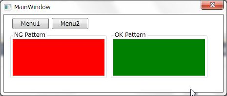
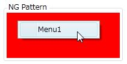
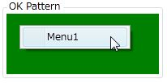

# ContextMenu内のアイテムのBinding時の注意事項
## Requires
- Visual Studio 2010
## License
- Apache License, Version 2.0
## Technologies
- WPF
- ViewModel pattern (MVVM)
## Topics
- Data Binding
- ContextMenu
## Updated
- 05/11/2011
## Description

<h1>概要</h1>

ContextMenuのDataContextは、初回表示時に親要素のDataContextを取得します。その後、親のDataContextに変更があってもContextMenuのDataContextは更新されません。このサンプルは、この問題の確認と、この問題を回避するBindingの方法について説明します。

<h1>サンプルプログラムの前提条件</h1>

このサンプルプログラムを理解するために必要な前提知識を以下に示します。

<ul>
<li>Model View ViewModel パターンによる実装を理解できる </li><li>基本的なWPFの使い方を知っている </li><li>PrismのNotificationObject(INotifyPropertyChangedの実装クラス)とDelegateCommandについて知っている
</li></ul>
<h1>サンプルプログラムの解説</h1>

サンプルプログラムについて説明します。

<h2>MVVMパターン用の基本クラスの作成</h2>

ViewModelの基本クラスになるViewModelBaseクラスを作成します。このサンプルではINotifyPropertyChangedの実装が出来ていればいいのでPrismのNotificationObjectを継承しただけの簡単な実装になっています。

&nbsp;

<h2 class="scriptcode">

C#

スクリプトの編集

csharp
<pre class="hidden">namespace ContextMenuBindSample
{
    using Microsoft.Practices.Prism.ViewModel;

    /// &lt;summary&gt;
    /// ViewModelの基本クラス
    /// &lt;/summary&gt;
    public class ViewModelBase : NotificationObject
    {
    }
}
</pre>

<pre class="js">namespace&nbsp;ContextMenuBindSample&nbsp;
{&nbsp;
&nbsp;&nbsp;&nbsp;&nbsp;using&nbsp;Microsoft.Practices.Prism.ViewModel;&nbsp;
&nbsp;
&nbsp;&nbsp;&nbsp;&nbsp;///&nbsp;&lt;summary&gt;&nbsp;
&nbsp;&nbsp;&nbsp;&nbsp;///&nbsp;ViewModelの基本クラス&nbsp;
&nbsp;&nbsp;&nbsp;&nbsp;///&nbsp;&lt;/summary&gt;&nbsp;
&nbsp;&nbsp;&nbsp;&nbsp;public&nbsp;class&nbsp;ViewModelBase&nbsp;:&nbsp;NotificationObject&nbsp;
&nbsp;&nbsp;&nbsp;&nbsp;{&nbsp;
&nbsp;&nbsp;&nbsp;&nbsp;}&nbsp;
}&nbsp;
&nbsp;
&nbsp;
</pre>

</h2>

&nbsp;

<h2>ContextMenuのMenuItem用のViewModelクラスの作成</h2>

このサンプルでは、ContextMenuのメニューの1項目に対して１つのViewModelをバインドしています。MenuItem用のViewModelの定義を以下に示します。内容は、MenuItemに表示するテキストのプロパティを持っただけの単純なクラスになります。

&nbsp;

C#

スクリプトの編集

csharp
<pre class="hidden">namespace ContextMenuBindSample
{
    /// &lt;summary&gt;
    /// ContextMenuの1項目を表すViewModel
    /// &lt;/summary&gt;
    public class MenuItemViewModel
    {
        /// &lt;summary&gt;
        /// ContextMenuに表示するテキスト
        /// &lt;/summary&gt;
        public string Text { get; private set; }

        /// &lt;summary&gt;
        /// ContextMenuに表示するテキストを指定してインスタンスを作成します。
        /// &lt;/summary&gt;
        /// &lt;param name=&quot;text&quot;&gt;ContextMenuに表示するテキスト&lt;/param&gt;
        public MenuItemViewModel(string text)
        {
            this.Text = text;
        }
    }
}
</pre>

<pre class="csharp">namespace&nbsp;ContextMenuBindSample&nbsp;
{&nbsp;
&nbsp;&nbsp;&nbsp;&nbsp;///&nbsp;&lt;summary&gt;&nbsp;
&nbsp;&nbsp;&nbsp;&nbsp;///&nbsp;ContextMenuの1項目を表すViewModel&nbsp;
&nbsp;&nbsp;&nbsp;&nbsp;///&nbsp;&lt;/summary&gt;&nbsp;
&nbsp;&nbsp;&nbsp;&nbsp;public&nbsp;class&nbsp;MenuItemViewModel&nbsp;
&nbsp;&nbsp;&nbsp;&nbsp;{&nbsp;
&nbsp;&nbsp;&nbsp;&nbsp;&nbsp;&nbsp;&nbsp;&nbsp;///&nbsp;&lt;summary&gt;&nbsp;
&nbsp;&nbsp;&nbsp;&nbsp;&nbsp;&nbsp;&nbsp;&nbsp;///&nbsp;ContextMenuに表示するテキスト&nbsp;
&nbsp;&nbsp;&nbsp;&nbsp;&nbsp;&nbsp;&nbsp;&nbsp;///&nbsp;&lt;/summary&gt;&nbsp;
&nbsp;&nbsp;&nbsp;&nbsp;&nbsp;&nbsp;&nbsp;&nbsp;public&nbsp;string&nbsp;Text&nbsp;{&nbsp;get;&nbsp;private&nbsp;set;&nbsp;}&nbsp;
&nbsp;
&nbsp;&nbsp;&nbsp;&nbsp;&nbsp;&nbsp;&nbsp;&nbsp;///&nbsp;&lt;summary&gt;&nbsp;
&nbsp;&nbsp;&nbsp;&nbsp;&nbsp;&nbsp;&nbsp;&nbsp;///&nbsp;ContextMenuに表示するテキストを指定してインスタンスを作成します。&nbsp;
&nbsp;&nbsp;&nbsp;&nbsp;&nbsp;&nbsp;&nbsp;&nbsp;///&nbsp;&lt;/summary&gt;&nbsp;
&nbsp;&nbsp;&nbsp;&nbsp;&nbsp;&nbsp;&nbsp;&nbsp;///&nbsp;&lt;param&nbsp;name=&quot;text&quot;&gt;ContextMenuに表示するテキスト&lt;/param&gt;&nbsp;
&nbsp;&nbsp;&nbsp;&nbsp;&nbsp;&nbsp;&nbsp;&nbsp;public&nbsp;MenuItemViewModel(string&nbsp;text)&nbsp;
&nbsp;&nbsp;&nbsp;&nbsp;&nbsp;&nbsp;&nbsp;&nbsp;{&nbsp;
&nbsp;&nbsp;&nbsp;&nbsp;&nbsp;&nbsp;&nbsp;&nbsp;&nbsp;&nbsp;&nbsp;&nbsp;this.Text&nbsp;=&nbsp;text;&nbsp;
&nbsp;&nbsp;&nbsp;&nbsp;&nbsp;&nbsp;&nbsp;&nbsp;}&nbsp;
&nbsp;&nbsp;&nbsp;&nbsp;}&nbsp;
}&nbsp;
&nbsp;
&nbsp;
</pre>

MainWindow用のViewModelクラスの作成

次にMenuItemViewModelを持つMainWindowViewModelクラスを定義します。このViewModelには現在のContextMenuの項目を表すCurrentMenuItemというプロパティと、このプロパティの値を変更するコマンドが2種類定義されています。

C#

スクリプトの編集

csharp
<pre class="hidden">namespace ContextMenuBindSample
{
    using Microsoft.Practices.Prism.Commands;

    /// &lt;summary&gt;
    /// MainWindow用のViewModleクラス
    /// &lt;/summary&gt;
    public class MainWindowViewModel : ViewModelBase
    {
        private MenuItemViewModel currentMenuItem;

        /// &lt;summary&gt;
        /// コンストラクタ
        /// &lt;/summary&gt;
        public MainWindowViewModel()
        {
            // コマンドの初期化
            this.SetMenu1Command = new DelegateCommand(
                () =&gt; this.CurrentMenuItem = new MenuItemViewModel(&quot;Menu1&quot;));

            this.SetMenu2Command = new DelegateCommand(
                () =&gt; this.CurrentMenuItem = new MenuItemViewModel(&quot;Menu2&quot;));
        }

        /// &lt;summary&gt;
        /// 現在表示したいContextMenuのMenuItem
        /// &lt;/summary&gt;
        public MenuItemViewModel CurrentMenuItem
        {
            get
            {
                return this.currentMenuItem;
            }

            set
            {
                this.currentMenuItem = value;
                this.RaisePropertyChanged(() =&gt; CurrentMenuItem);
            }
        }

        /// &lt;summary&gt;
        /// Menu1と表示されたMenuをContextMenuに設定するコマンド
        /// &lt;/summary&gt;
        public DelegateCommand SetMenu1Command { get; private set; }

        /// &lt;summary&gt;
        /// Menu2と表示されたMenuをContextMenuに設定するコマンド
        /// &lt;/summary&gt;
        public DelegateCommand SetMenu2Command { get; private set; }
    }
}
</pre>

<pre class="js">namespace&nbsp;ContextMenuBindSample&nbsp;
{&nbsp;
&nbsp;&nbsp;&nbsp;&nbsp;using&nbsp;Microsoft.Practices.Prism.Commands;&nbsp;
&nbsp;
&nbsp;&nbsp;&nbsp;&nbsp;///&nbsp;&lt;summary&gt;&nbsp;
&nbsp;&nbsp;&nbsp;&nbsp;///&nbsp;MainWindow用のViewModleクラス&nbsp;
&nbsp;&nbsp;&nbsp;&nbsp;///&nbsp;&lt;/summary&gt;&nbsp;
&nbsp;&nbsp;&nbsp;&nbsp;public&nbsp;class&nbsp;MainWindowViewModel&nbsp;:&nbsp;ViewModelBase&nbsp;
&nbsp;&nbsp;&nbsp;&nbsp;{&nbsp;
&nbsp;&nbsp;&nbsp;&nbsp;&nbsp;&nbsp;&nbsp;&nbsp;private&nbsp;MenuItemViewModel&nbsp;currentMenuItem;&nbsp;
&nbsp;
&nbsp;&nbsp;&nbsp;&nbsp;&nbsp;&nbsp;&nbsp;&nbsp;///&nbsp;&lt;summary&gt;&nbsp;
&nbsp;&nbsp;&nbsp;&nbsp;&nbsp;&nbsp;&nbsp;&nbsp;///&nbsp;コンストラクタ&nbsp;
&nbsp;&nbsp;&nbsp;&nbsp;&nbsp;&nbsp;&nbsp;&nbsp;///&nbsp;&lt;/summary&gt;&nbsp;
&nbsp;&nbsp;&nbsp;&nbsp;&nbsp;&nbsp;&nbsp;&nbsp;public&nbsp;MainWindowViewModel()&nbsp;
&nbsp;&nbsp;&nbsp;&nbsp;&nbsp;&nbsp;&nbsp;&nbsp;{&nbsp;
&nbsp;&nbsp;&nbsp;&nbsp;&nbsp;&nbsp;&nbsp;&nbsp;&nbsp;&nbsp;&nbsp;&nbsp;//&nbsp;コマンドの初期化&nbsp;
&nbsp;&nbsp;&nbsp;&nbsp;&nbsp;&nbsp;&nbsp;&nbsp;&nbsp;&nbsp;&nbsp;&nbsp;this.SetMenu1Command&nbsp;=&nbsp;new&nbsp;DelegateCommand(&nbsp;
&nbsp;&nbsp;&nbsp;&nbsp;&nbsp;&nbsp;&nbsp;&nbsp;&nbsp;&nbsp;&nbsp;&nbsp;&nbsp;&nbsp;&nbsp;&nbsp;()&nbsp;=&gt;&nbsp;this.CurrentMenuItem&nbsp;=&nbsp;new&nbsp;MenuItemViewModel(&quot;Menu1&quot;));&nbsp;
&nbsp;
&nbsp;&nbsp;&nbsp;&nbsp;&nbsp;&nbsp;&nbsp;&nbsp;&nbsp;&nbsp;&nbsp;&nbsp;this.SetMenu2Command&nbsp;=&nbsp;new&nbsp;DelegateCommand(&nbsp;
&nbsp;&nbsp;&nbsp;&nbsp;&nbsp;&nbsp;&nbsp;&nbsp;&nbsp;&nbsp;&nbsp;&nbsp;&nbsp;&nbsp;&nbsp;&nbsp;()&nbsp;=&gt;&nbsp;this.CurrentMenuItem&nbsp;=&nbsp;new&nbsp;MenuItemViewModel(&quot;Menu2&quot;));&nbsp;
&nbsp;&nbsp;&nbsp;&nbsp;&nbsp;&nbsp;&nbsp;&nbsp;}&nbsp;
&nbsp;
&nbsp;&nbsp;&nbsp;&nbsp;&nbsp;&nbsp;&nbsp;&nbsp;///&nbsp;&lt;summary&gt;&nbsp;
&nbsp;&nbsp;&nbsp;&nbsp;&nbsp;&nbsp;&nbsp;&nbsp;///&nbsp;現在表示したいContextMenuのMenuItem&nbsp;
&nbsp;&nbsp;&nbsp;&nbsp;&nbsp;&nbsp;&nbsp;&nbsp;///&nbsp;&lt;/summary&gt;&nbsp;
&nbsp;&nbsp;&nbsp;&nbsp;&nbsp;&nbsp;&nbsp;&nbsp;public&nbsp;MenuItemViewModel&nbsp;CurrentMenuItem&nbsp;
&nbsp;&nbsp;&nbsp;&nbsp;&nbsp;&nbsp;&nbsp;&nbsp;{&nbsp;
&nbsp;&nbsp;&nbsp;&nbsp;&nbsp;&nbsp;&nbsp;&nbsp;&nbsp;&nbsp;&nbsp;&nbsp;get&nbsp;
&nbsp;&nbsp;&nbsp;&nbsp;&nbsp;&nbsp;&nbsp;&nbsp;&nbsp;&nbsp;&nbsp;&nbsp;{&nbsp;
&nbsp;&nbsp;&nbsp;&nbsp;&nbsp;&nbsp;&nbsp;&nbsp;&nbsp;&nbsp;&nbsp;&nbsp;&nbsp;&nbsp;&nbsp;&nbsp;return&nbsp;this.currentMenuItem;&nbsp;
&nbsp;&nbsp;&nbsp;&nbsp;&nbsp;&nbsp;&nbsp;&nbsp;&nbsp;&nbsp;&nbsp;&nbsp;}&nbsp;
&nbsp;
&nbsp;&nbsp;&nbsp;&nbsp;&nbsp;&nbsp;&nbsp;&nbsp;&nbsp;&nbsp;&nbsp;&nbsp;set&nbsp;
&nbsp;&nbsp;&nbsp;&nbsp;&nbsp;&nbsp;&nbsp;&nbsp;&nbsp;&nbsp;&nbsp;&nbsp;{&nbsp;
&nbsp;&nbsp;&nbsp;&nbsp;&nbsp;&nbsp;&nbsp;&nbsp;&nbsp;&nbsp;&nbsp;&nbsp;&nbsp;&nbsp;&nbsp;&nbsp;this.currentMenuItem&nbsp;=&nbsp;value;&nbsp;
&nbsp;&nbsp;&nbsp;&nbsp;&nbsp;&nbsp;&nbsp;&nbsp;&nbsp;&nbsp;&nbsp;&nbsp;&nbsp;&nbsp;&nbsp;&nbsp;this.RaisePropertyChanged(()&nbsp;=&gt;&nbsp;CurrentMenuItem);&nbsp;
&nbsp;&nbsp;&nbsp;&nbsp;&nbsp;&nbsp;&nbsp;&nbsp;&nbsp;&nbsp;&nbsp;&nbsp;}&nbsp;
&nbsp;&nbsp;&nbsp;&nbsp;&nbsp;&nbsp;&nbsp;&nbsp;}&nbsp;
&nbsp;
&nbsp;&nbsp;&nbsp;&nbsp;&nbsp;&nbsp;&nbsp;&nbsp;///&nbsp;&lt;summary&gt;&nbsp;
&nbsp;&nbsp;&nbsp;&nbsp;&nbsp;&nbsp;&nbsp;&nbsp;///&nbsp;Menu1と表示されたMenuをContextMenuに設定するコマンド&nbsp;
&nbsp;&nbsp;&nbsp;&nbsp;&nbsp;&nbsp;&nbsp;&nbsp;///&nbsp;&lt;/summary&gt;&nbsp;
&nbsp;&nbsp;&nbsp;&nbsp;&nbsp;&nbsp;&nbsp;&nbsp;public&nbsp;DelegateCommand&nbsp;SetMenu1Command&nbsp;{&nbsp;get;&nbsp;private&nbsp;set;&nbsp;}&nbsp;
&nbsp;
&nbsp;&nbsp;&nbsp;&nbsp;&nbsp;&nbsp;&nbsp;&nbsp;///&nbsp;&lt;summary&gt;&nbsp;
&nbsp;&nbsp;&nbsp;&nbsp;&nbsp;&nbsp;&nbsp;&nbsp;///&nbsp;Menu2と表示されたMenuをContextMenuに設定するコマンド&nbsp;
&nbsp;&nbsp;&nbsp;&nbsp;&nbsp;&nbsp;&nbsp;&nbsp;///&nbsp;&lt;/summary&gt;&nbsp;
&nbsp;&nbsp;&nbsp;&nbsp;&nbsp;&nbsp;&nbsp;&nbsp;public&nbsp;DelegateCommand&nbsp;SetMenu2Command&nbsp;{&nbsp;get;&nbsp;private&nbsp;set;&nbsp;}&nbsp;
&nbsp;&nbsp;&nbsp;&nbsp;}&nbsp;
}&nbsp;
&nbsp;
&nbsp;
</pre>

&nbsp;

<h2 class="endscriptcode">Viewの作成</h2>

ViewModleが作成できたので、今回の本題であるMainWindowを定義します。今回作成する画面のイメージは以下のようなものになります。

NG Patternというラベルがついている赤い矩形の部分がViewModelの更新にContextMenuのMenuItemが追随しないパターンで、OKPatternが正しく動作するものになります。Menu1とMenu2のボタンは、先ほど定義したMainWindowViewModelのSetMenu1CommandとSetMenu2Commandにバインドしています。

まずは、MainWindowのDataContextにMainWindowViewModelを設定します。

XAML

スクリプトの編集

xaml
<pre class="hidden">&lt;Window x:Class=&quot;ContextMenuBindSample.MainWindow&quot;
        xmlns=&quot;http://schemas.microsoft.com/winfx/2006/xaml/presentation&quot;
        xmlns:x=&quot;http://schemas.microsoft.com/winfx/2006/xaml&quot;
        xmlns:local=&quot;clr-namespace:ContextMenuBindSample&quot;
        Title=&quot;MainWindow&quot; Height=&quot;188&quot; Width=&quot;455&quot; 
        ResizeMode=&quot;NoResize&quot; 
        WindowStartupLocation=&quot;CenterScreen&quot;&gt;
    &lt;Window.DataContext&gt;
        &lt;local:MainWindowViewModel /&gt;
    &lt;/Window.DataContext&gt;
    &lt;Grid&gt;
    &lt;/Grid&gt;
&lt;/Window&gt;
</pre>

<pre class="xaml">&lt;Window&nbsp;x:Class=&quot;ContextMenuBindSample.MainWindow&quot;&nbsp;
&nbsp;&nbsp;&nbsp;&nbsp;&nbsp;&nbsp;&nbsp;&nbsp;xmlns=&quot;http://schemas.microsoft.com/winfx/2006/xaml/presentation&quot;&nbsp;
&nbsp;&nbsp;&nbsp;&nbsp;&nbsp;&nbsp;&nbsp;&nbsp;xmlns:x=&quot;http://schemas.microsoft.com/winfx/2006/xaml&quot;&nbsp;
&nbsp;&nbsp;&nbsp;&nbsp;&nbsp;&nbsp;&nbsp;&nbsp;xmlns:local=&quot;clr-namespace:ContextMenuBindSample&quot;&nbsp;
&nbsp;&nbsp;&nbsp;&nbsp;&nbsp;&nbsp;&nbsp;&nbsp;Title=&quot;MainWindow&quot;&nbsp;Height=&quot;188&quot;&nbsp;Width=&quot;455&quot;&nbsp;&nbsp;
&nbsp;&nbsp;&nbsp;&nbsp;&nbsp;&nbsp;&nbsp;&nbsp;ResizeMode=&quot;NoResize&quot;&nbsp;&nbsp;
&nbsp;&nbsp;&nbsp;&nbsp;&nbsp;&nbsp;&nbsp;&nbsp;WindowStartupLocation=&quot;CenterScreen&quot;&gt;&nbsp;
&nbsp;&nbsp;&nbsp;&nbsp;&lt;Window.DataContext&gt;&nbsp;
&nbsp;&nbsp;&nbsp;&nbsp;&nbsp;&nbsp;&nbsp;&nbsp;&lt;local:MainWindowViewModel&nbsp;/&gt;&nbsp;
&nbsp;&nbsp;&nbsp;&nbsp;&lt;/Window.DataContext&gt;&nbsp;
&nbsp;&nbsp;&nbsp;&nbsp;&lt;Grid&gt;&nbsp;
&nbsp;&nbsp;&nbsp;&nbsp;&lt;/Grid&gt;&nbsp;
&lt;/Window&gt;&nbsp;
&nbsp;
&nbsp;
</pre>

&nbsp;ボタンは、Commandにバインドしているだけなので、以下のようにシンプルになります。

XAML

スクリプトの編集

xaml
<pre class="hidden">&lt;Button 
    Content=&quot;Menu1&quot; 
    Height=&quot;23&quot; 
    HorizontalAlignment=&quot;Left&quot; 
    Margin=&quot;17,7,0,0&quot; 
    VerticalAlignment=&quot;Top&quot; 
    Width=&quot;75&quot; 
    Command=&quot;{Binding Path=SetMenu1Command}&quot; /&gt;
&lt;Button 
    Content=&quot;Menu2&quot; 
    Height=&quot;23&quot; 
    HorizontalAlignment=&quot;Left&quot; 
    Margin=&quot;98,7,0,0&quot; 
    VerticalAlignment=&quot;Top&quot; 
    Width=&quot;75&quot; 
    Command=&quot;{Binding Path=SetMenu2Command}&quot; /&gt;
</pre>

<pre class="js">&lt;Button&nbsp;&nbsp;
&nbsp;&nbsp;&nbsp;&nbsp;Content=&quot;Menu1&quot;&nbsp;&nbsp;
&nbsp;&nbsp;&nbsp;&nbsp;Height=&quot;23&quot;&nbsp;&nbsp;
&nbsp;&nbsp;&nbsp;&nbsp;HorizontalAlignment=&quot;Left&quot;&nbsp;&nbsp;
&nbsp;&nbsp;&nbsp;&nbsp;Margin=&quot;17,7,0,0&quot;&nbsp;&nbsp;
&nbsp;&nbsp;&nbsp;&nbsp;VerticalAlignment=&quot;Top&quot;&nbsp;&nbsp;
&nbsp;&nbsp;&nbsp;&nbsp;Width=&quot;75&quot;&nbsp;&nbsp;
&nbsp;&nbsp;&nbsp;&nbsp;Command=&quot;{Binding&nbsp;Path=SetMenu1Command}&quot;&nbsp;/&gt;&nbsp;
&lt;Button&nbsp;&nbsp;
&nbsp;&nbsp;&nbsp;&nbsp;Content=&quot;Menu2&quot;&nbsp;&nbsp;
&nbsp;&nbsp;&nbsp;&nbsp;Height=&quot;23&quot;&nbsp;&nbsp;
&nbsp;&nbsp;&nbsp;&nbsp;HorizontalAlignment=&quot;Left&quot;&nbsp;&nbsp;
&nbsp;&nbsp;&nbsp;&nbsp;Margin=&quot;98,7,0,0&quot;&nbsp;&nbsp;
&nbsp;&nbsp;&nbsp;&nbsp;VerticalAlignment=&quot;Top&quot;&nbsp;&nbsp;
&nbsp;&nbsp;&nbsp;&nbsp;Width=&quot;75&quot;&nbsp;&nbsp;
&nbsp;&nbsp;&nbsp;&nbsp;Command=&quot;{Binding&nbsp;Path=SetMenu2Command}&quot;&nbsp;/&gt;&nbsp;
&nbsp;
&nbsp;
</pre>

&nbsp;

次に、NG PatternのXAMLを示します。これはContextMenuをホストするGridのDataContextにCurrentMenuItemプロパティをバインドして、ContextMenu内のMenuItemのHeaderにMenuItemViewModelのTextプロパティをバインドしています。

XAML

スクリプトの編集

xaml
<pre class="hidden">&lt;Grid Background=&quot;Red&quot; DataContext=&quot;{Binding Path=CurrentMenuItem}&quot;&gt;
    &lt;Grid.ContextMenu&gt;
        &lt;ContextMenu&gt;
            &lt;!-- 普通にバインド --&gt;
            &lt;MenuItem Header=&quot;{Binding Path=Text}&quot; /&gt;
        &lt;/ContextMenu&gt;
    &lt;/Grid.ContextMenu&gt;
&lt;/Grid&gt;
</pre>

<pre class="js">&lt;Grid&nbsp;Background=&quot;Red&quot;&nbsp;DataContext=&quot;{Binding&nbsp;Path=CurrentMenuItem}&quot;&gt;&nbsp;
&nbsp;&nbsp;&nbsp;&nbsp;&lt;Grid.ContextMenu&gt;&nbsp;
&nbsp;&nbsp;&nbsp;&nbsp;&nbsp;&nbsp;&nbsp;&nbsp;&lt;ContextMenu&gt;&nbsp;
&nbsp;&nbsp;&nbsp;&nbsp;&nbsp;&nbsp;&nbsp;&nbsp;&nbsp;&nbsp;&nbsp;&nbsp;&lt;!--&nbsp;普通にバインド&nbsp;--&gt;&nbsp;
&nbsp;&nbsp;&nbsp;&nbsp;&nbsp;&nbsp;&nbsp;&nbsp;&nbsp;&nbsp;&nbsp;&nbsp;&lt;MenuItem&nbsp;Header=&quot;{Binding&nbsp;Path=Text}&quot;&nbsp;/&gt;&nbsp;
&nbsp;&nbsp;&nbsp;&nbsp;&nbsp;&nbsp;&nbsp;&nbsp;&lt;/ContextMenu&gt;&nbsp;
&nbsp;&nbsp;&nbsp;&nbsp;&lt;/Grid.ContextMenu&gt;&nbsp;
&lt;/Grid&gt;&nbsp;
&nbsp;
&nbsp;
</pre>

&nbsp;このXAMLでは、初回にContextMenuが表示されたときにCurrentMenuItemに設定されているGridのDataContextがContextMenuに設定されて、そのTextプロパティがMenuItemのHeaderにBindingされます。このためSetMenu1CommandやSetMenu2CommandでCurrentMenuItemプロパティを書き換えてもContextMenuのDataContextは書き換わらないため、ContextMenuのMenuItemの内容は変わりません。

では、この問題を解決するためのBindingの仕方としてOK Patternの方のXAMLを示します。これはHeaderをBindingする際に、FindAncestorでContextMenuをBindingのSourceになるようにして、ContextMenuのPlacementTargetからContextMenuを設定しているオブジェクト（今回の例ではGrid）を取得して、そのDataContext経由でMenuItemViewModelのTextプロパティにアクセスしています。

XAML

スクリプトの編集

xaml
<pre class="hidden">&lt;Grid Background=&quot;Green&quot; DataContext=&quot;{Binding Path=CurrentMenuItem}&quot;&gt;
    &lt;Grid.ContextMenu&gt;
        &lt;ContextMenu&gt;
            &lt;!-- コンテキストメニューをホストしてる要素のデータコンテキスト経由でバインド --&gt;
            &lt;MenuItem 
                Header=&quot;{Binding 
                    Path=PlacementTarget.DataContext.Text, 
                    RelativeSource={RelativeSource FindAncestor, AncestorType=ContextMenu}}&quot; /&gt;
        &lt;/ContextMenu&gt;
    &lt;/Grid.ContextMenu&gt;
&lt;/Grid&gt;
</pre>

<pre class="xaml">&lt;Grid&nbsp;Background=&quot;Green&quot;&nbsp;DataContext=&quot;{Binding&nbsp;Path=CurrentMenuItem}&quot;&gt;&nbsp;
&nbsp;&nbsp;&nbsp;&nbsp;&lt;Grid.ContextMenu&gt;&nbsp;
&nbsp;&nbsp;&nbsp;&nbsp;&nbsp;&nbsp;&nbsp;&nbsp;&lt;ContextMenu&gt;&nbsp;
&nbsp;&nbsp;&nbsp;&nbsp;&nbsp;&nbsp;&nbsp;&nbsp;&nbsp;&nbsp;&nbsp;&nbsp;&lt;!--&nbsp;コンテキストメニューをホストしてる要素のデータコンテキスト経由でバインド&nbsp;--&gt;&nbsp;
&nbsp;&nbsp;&nbsp;&nbsp;&nbsp;&nbsp;&nbsp;&nbsp;&nbsp;&nbsp;&nbsp;&nbsp;&lt;MenuItem&nbsp;&nbsp;
&nbsp;&nbsp;&nbsp;&nbsp;&nbsp;&nbsp;&nbsp;&nbsp;&nbsp;&nbsp;&nbsp;&nbsp;&nbsp;&nbsp;&nbsp;&nbsp;Header=&quot;{Binding&nbsp;&nbsp;
&nbsp;&nbsp;&nbsp;&nbsp;&nbsp;&nbsp;&nbsp;&nbsp;&nbsp;&nbsp;&nbsp;&nbsp;&nbsp;&nbsp;&nbsp;&nbsp;&nbsp;&nbsp;&nbsp;&nbsp;Path=PlacementTarget.DataContext.Text,&nbsp;&nbsp;
&nbsp;&nbsp;&nbsp;&nbsp;&nbsp;&nbsp;&nbsp;&nbsp;&nbsp;&nbsp;&nbsp;&nbsp;&nbsp;&nbsp;&nbsp;&nbsp;&nbsp;&nbsp;&nbsp;&nbsp;RelativeSource={RelativeSource&nbsp;FindAncestor,&nbsp;AncestorType=ContextMenu}}&quot;&nbsp;/&gt;&nbsp;
&nbsp;&nbsp;&nbsp;&nbsp;&nbsp;&nbsp;&nbsp;&nbsp;&lt;/ContextMenu&gt;&nbsp;
&nbsp;&nbsp;&nbsp;&nbsp;&lt;/Grid.ContextMenu&gt;&nbsp;
&lt;/Grid&gt;&nbsp;
&nbsp;
&nbsp;
</pre>

&nbsp;このように、ContextMenuのDataContextの値が一度表示された時点から更新されないという挙動に影響されないように、ContextMenuをホストしているコントロールのDataContextを使用するようにすることで回避しています。

因みに、親のDataContextが書き換わらなければ、この問題は起きないのでGridのDataContextの設定を辞めてMenuItemのHeaderプロパティのバインドを{Binding Path=CurrentMenuItem.Text}のようにすることで回避も可能です。

動作確認

プログラムの動作確認を行います。プログラムを起動してMenu1ボタンをクリックした状態でNGPatternとOKPatternのContextMenuを表示して内容を確認します。この状態では両者の表示に違いは無く、両方ともMenu1が表示されています。

次にMenu2ボタンをクリックしてCurrentMenuItemプロパティの値を書き換えて、上と同じようにContextMenuを表示させます。今度はNG Patternの方はCurrentMenuItemプロパティが書き換わったにも関わらず、古い値が表示されていることが確認できます。

<h1>まとめ</h1>

この挙動は、ContextMenuのVisualTreeが親とは関係ない独立した状態で作成されるという仕様によるもののようです。（ソース情報不明のためご存じの方は教えてください）この問題は、DataGridやListViewの項目単位でのContextMenuの表示や、複雑な親子関係にあるViewModelをバインドした画面内でContextMenuを使用した際によくおきると考えられます。

以上です。良いWPFライフを！

&nbsp;

