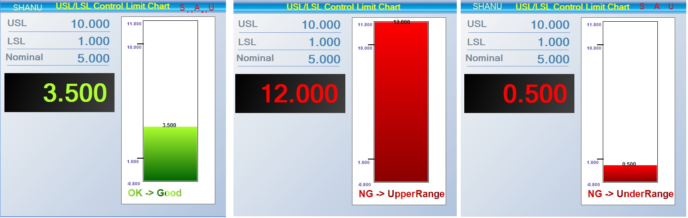

# Control Chart Using VB.Net
## Requires
- Visual Studio 2010
## License
- MIT
## Technologies
- VB.Net
## Topics
- VB.Net
## Updated
- 02/11/2016
## Description

<h1>Introduction</h1>

Nowadays automobile industry&nbsp;is interested in automated measuring machines to ensure quality and to compete in the global industry.&nbsp;Control Chart takes a major role&nbsp;in ensuring quality by measuring automobile components.
 The purpose is to make a simple Control Bar Chart for Measuring Systems like Camshaft, Crankshaft, and Master Setting ,so on. A digital sensor is used for measuring Camshaft and Crankshaft. Then the measured data&nbsp;is analyzed using the Control Chart .

<strong>Control Chart</strong>(<a href="http://asq.org/learn-about-quality/data-collection-analysis-tools/overview/control-chart.html" target="_blank">ref</a>)

The Control Charts are graphs which is used to check the quality of control of a process. In Control charts UCL/LCL or USL/LSL will be used to check with the resultant data.If Measurement data within the range of limits then the process is&nbsp;<strong>OK(GOOD)</strong>&nbsp;.If
 the Measurement data is above or below the Limits the process is&nbsp;<strong>NG(NOT GOOD).</strong>

<strong>1) OK (GOOD) -&gt; USL &lt;= Measurement Data &gt;= LSL&nbsp;</strong>

<strong>2) NG (NOT GOOD) -&gt; Upper Rang</strong><strong>e &nbsp;-&gt; Measurement Data &gt; USL</strong>

<strong>3) NG&nbsp;</strong><strong>(NOT GOOD) -&gt; Lower Range -&gt;&nbsp;</strong><strong>&nbsp;</strong><strong>Measurement Data &lt; LSL</strong>

In our simple Control Chart&nbsp;<strong>USL /LSL</strong>&nbsp;are used for verifying the data.USL -&gt; Upper Specification Limit and LSL -&gt; Lower Specification Limit. Note in this sample i have used USL/LSL .

Difference between USL/LSL and UCL/LCL.

(The UCL or upper control limit and LCL or lower control limit are limits set by your process based on the actual amount of variation of your process.&nbsp;

The USL or upper specification limit and LSL or lower specification limit are limits set by your customer's requirements. This is the variation that they will accept from your process.&nbsp;<a href="http://lecturehub.wordpress.com/2013/10/24/the-difference-between-usllsl-and-ucllcl/" target="_blank">Ref</a>)

&nbsp;The main purpose of this article is to share what we have developed to other members.&nbsp;

We have created a Control Chart as a User Control so that it can be used easily in all projects.

In this article we have attached zip file named as&nbsp;SHANUControlChart_SRC.zip. Which contains .

1) &quot;SHANUControlChart_CNT&quot; Folder (This folder contains the Control Chart User control Source code.

2) &quot;SHANUControlChart_DEMO&quot; Folder (This folder conains the Demo program which includes the Control Chart user control with Random Measurement sample using Timer control).

<h1>Building the Sample</h1>

<strong>Prerequisites</strong>

Visual Studio 2010&nbsp; or higer versions

Description

<h2><strong><em>Control Chart user Control:</em></strong></h2>

1) First we will start with the User Control .To Create a user control .

<ol type="1">
<li>Create a new Windows Control Library project. </li><li>Set the Name of Project and Click Ok(here my user control name is SHANUControlChart_CNT).
</li><li>Add all the controls which is needed. </li><li>In code behind declare all the public variables and Public property variables.Here USL/LSL/Nominal and Measurement Data Public property has been declared.Which will be used to pass the data from the windows application.
</li></ol>

Visual Basic

Edit|Remove

vb

<pre class="vb">'Public&nbsp;Property&nbsp;DeclarationPublicProperty&nbsp;MasterData()&nbsp;AsStringGetReturn&nbsp;lblMasterData.Text&nbsp;
&nbsp;&nbsp;&nbsp;&nbsp;&nbsp;&nbsp;&nbsp;EndGetSet(value&nbsp;AsString)&nbsp;
&nbsp;&nbsp;&nbsp;&nbsp;&nbsp;&nbsp;&nbsp;&nbsp;&nbsp;&nbsp;&nbsp;lblMasterData.Text&nbsp;=&nbsp;value&nbsp;
&nbsp;&nbsp;&nbsp;&nbsp;&nbsp;&nbsp;&nbsp;EndSetEndPropertyPublicProperty&nbsp;USLData()&nbsp;AsStringGetReturn&nbsp;lblUslData.Text&nbsp;
&nbsp;&nbsp;&nbsp;&nbsp;&nbsp;&nbsp;&nbsp;EndGetSet(value&nbsp;AsString)&nbsp;
&nbsp;&nbsp;&nbsp;&nbsp;&nbsp;&nbsp;&nbsp;&nbsp;&nbsp;&nbsp;&nbsp;lblUslData.Text&nbsp;=&nbsp;value&nbsp;
&nbsp;&nbsp;&nbsp;&nbsp;&nbsp;&nbsp;&nbsp;EndSetEndPropertyPublicProperty&nbsp;LSLData()&nbsp;AsStringGetReturn&nbsp;lblLslData.Text&nbsp;
&nbsp;&nbsp;&nbsp;&nbsp;&nbsp;&nbsp;&nbsp;EndGetSet(value&nbsp;AsString)&nbsp;
&nbsp;&nbsp;&nbsp;&nbsp;&nbsp;&nbsp;&nbsp;&nbsp;&nbsp;&nbsp;&nbsp;lblLslData.Text&nbsp;=&nbsp;value&nbsp;
&nbsp;&nbsp;&nbsp;&nbsp;&nbsp;&nbsp;&nbsp;EndSetEndPropertyPublicProperty&nbsp;NominalData()&nbsp;AsStringGetReturn&nbsp;lblNominalData.Text&nbsp;
&nbsp;&nbsp;&nbsp;&nbsp;&nbsp;&nbsp;&nbsp;EndGetSet(value&nbsp;AsString)&nbsp;
&nbsp;&nbsp;&nbsp;&nbsp;&nbsp;&nbsp;&nbsp;&nbsp;&nbsp;&nbsp;&nbsp;lblNominalData.Text&nbsp;=&nbsp;value&nbsp;
&nbsp;&nbsp;&nbsp;&nbsp;&nbsp;&nbsp;&nbsp;EndSetEndProperty</pre>

&nbsp;&nbsp;5.In our User control we have used Timer control to always check for the Measurment data and produce the Bar Chart.In user control Load we have Enabled and Start the Timer.In Timer Tick Event called the Function
 &quot;LoadcontrolChart()&quot; .In this fucntion we set all USL/LSL and measurement data and draw the Chart control.

Visual Basic

Edit|Remove

vb

<pre class="vb">PublicSub&nbsp;LoadcontrolChart()&nbsp;
&nbsp;&nbsp;&nbsp;&nbsp;&nbsp;&nbsp;&nbsp;&nbsp;Try'For&nbsp;Barand&nbsp;GageLoad&nbsp;
&nbsp;&nbsp;&nbsp;&nbsp;&nbsp;&nbsp;&nbsp;&nbsp;&nbsp;&nbsp;&nbsp;&nbsp;upperLimitChk&nbsp;=&nbsp;False&nbsp;
&nbsp;&nbsp;&nbsp;&nbsp;&nbsp;&nbsp;&nbsp;&nbsp;&nbsp;&nbsp;&nbsp;&nbsp;lowerLimitchk&nbsp;=&nbsp;False&nbsp;
&nbsp;&nbsp;&nbsp;&nbsp;&nbsp;&nbsp;&nbsp;&nbsp;&nbsp;&nbsp;&nbsp;&nbsp;errLimtchk&nbsp;=&nbsp;FalseDim&nbsp;pointVal&nbsp;AsIntegerDim&nbsp;calcvalues&nbsp;AsDoubleDim&nbsp;calcvalues1&nbsp;AsDouble'&nbsp;&nbsp;Dim&nbsp;upperValue&nbsp;As&nbsp;DoubleDim&nbsp;hasread&nbsp;AsIntegerDim&nbsp;UpperRange&nbsp;AsDoubleDim&nbsp;err&nbsp;AsString&nbsp;
&nbsp;&nbsp;&nbsp;&nbsp;&nbsp;&nbsp;&nbsp;&nbsp;&nbsp;&nbsp;&nbsp;&nbsp;pointVal&nbsp;=&nbsp;3Dim&nbsp;ival&nbsp;AsInteger&nbsp;
&nbsp;
&nbsp;&nbsp;&nbsp;&nbsp;&nbsp;&nbsp;&nbsp;&nbsp;&nbsp;&nbsp;&nbsp;&nbsp;sensordata&nbsp;=&nbsp;Convert.ToDouble(lblMasterData.Text.Trim())&nbsp;
&nbsp;
&nbsp;&nbsp;&nbsp;&nbsp;&nbsp;&nbsp;&nbsp;&nbsp;&nbsp;&nbsp;&nbsp;&nbsp;frmMasteringPictuerBox.Refresh()&nbsp;
&nbsp;
&nbsp;&nbsp;&nbsp;&nbsp;&nbsp;&nbsp;&nbsp;&nbsp;&nbsp;&nbsp;&nbsp;&nbsp;upperValue&nbsp;=&nbsp;<a class="libraryLink" href="https://msdn.microsoft.com/en-US/library/System.Convert.ToDouble.aspx" target="_blank" title="Auto generated link to System.Convert.ToDouble">System.Convert.ToDouble</a>(lblUslData.Text)&nbsp;
&nbsp;&nbsp;&nbsp;&nbsp;&nbsp;&nbsp;&nbsp;&nbsp;&nbsp;&nbsp;&nbsp;&nbsp;lovervalue&nbsp;=&nbsp;<a class="libraryLink" href="https://msdn.microsoft.com/en-US/library/System.Convert.ToDouble.aspx" target="_blank" title="Auto generated link to System.Convert.ToDouble">System.Convert.ToDouble</a>(lblLslData.Text)&nbsp;
&nbsp;&nbsp;&nbsp;&nbsp;&nbsp;&nbsp;&nbsp;&nbsp;&nbsp;&nbsp;&nbsp;&nbsp;If&nbsp;upperValue&nbsp;=&nbsp;lovervalue&nbsp;Then&nbsp;
&nbsp;&nbsp;&nbsp;&nbsp;&nbsp;&nbsp;&nbsp;&nbsp;&nbsp;&nbsp;&nbsp;&nbsp;&nbsp;&nbsp;&nbsp;&nbsp;lovervalue&nbsp;=&nbsp;lovervalue&nbsp;-&nbsp;1EndIf&nbsp;
&nbsp;
&nbsp;&nbsp;&nbsp;&nbsp;&nbsp;&nbsp;&nbsp;&nbsp;&nbsp;&nbsp;&nbsp;&nbsp;inputValue&nbsp;=&nbsp;<a class="libraryLink" href="https://msdn.microsoft.com/en-US/library/System.Convert.ToDouble.aspx" target="_blank" title="Auto generated link to System.Convert.ToDouble">System.Convert.ToDouble</a>(lblMasterData.Text)&nbsp;
&nbsp;&nbsp;&nbsp;&nbsp;&nbsp;&nbsp;&nbsp;&nbsp;&nbsp;&nbsp;&nbsp;&nbsp;'here&nbsp;we&nbsp;call&nbsp;the&nbsp;draw&nbsp;ractangle&nbsp;fucntion&nbsp;&nbsp;
&nbsp;&nbsp;&nbsp;&nbsp;&nbsp;&nbsp;&nbsp;&nbsp;&nbsp;&nbsp;&nbsp;&nbsp;drawRectanles(barheight,&nbsp;barwidth,&nbsp;upperValue,&nbsp;lovervalue,&nbsp;loverInitialvalue,&nbsp;upperInititalvalue,&nbsp;xval,&nbsp;yval)&nbsp;&nbsp;&nbsp;&nbsp;&nbsp;&nbsp;&nbsp;&nbsp;&nbsp;&nbsp;&nbsp;
&nbsp;
&nbsp;&nbsp;&nbsp;&nbsp;&nbsp;&nbsp;&nbsp;&nbsp;Catch&nbsp;ex&nbsp;As&nbsp;Exception&nbsp;
&nbsp;&nbsp;&nbsp;&nbsp;&nbsp;&nbsp;&nbsp;&nbsp;EndTryEndSub</pre>

In &nbsp;this Method we check the Measurement data with USL and LSL Limit Value .If Measurement data within the range of USL and LSL then the resultant output will be Ok .We have used the if condition to check the resultant
 values. as below .

Visual Basic

Edit|Remove

vb

<pre class="vb">'This&nbsp;method&nbsp;is&nbsp;to&nbsp;draw&nbsp;the&nbsp;control&nbsp;chartPublicSub&nbsp;drawRectanles(ByVal&nbsp;barheight&nbsp;AsDouble,&nbsp;ByVal&nbsp;barwidth&nbsp;AsDouble,&nbsp;ByVal&nbsp;uppervalue&nbsp;AsDouble,&nbsp;ByVal&nbsp;lovervalue&nbsp;AsDouble,&nbsp;ByVal&nbsp;loverinitialvalue&nbsp;AsDouble,&nbsp;ByVal&nbsp;upperinitialvalue&nbsp;AsDouble,&nbsp;ByVal&nbsp;xval&nbsp;AsDouble,&nbsp;ByVal&nbsp;yval&nbsp;AsDouble)&nbsp;
&nbsp;&nbsp;&nbsp;&nbsp;&nbsp;&nbsp;&nbsp;TryDim&nbsp;limitsline&nbsp;AsDoubleDim&nbsp;lowerlimitline&nbsp;AsDoubleDim&nbsp;underrange&nbsp;AsDoubleDim&nbsp;upperrange&nbsp;AsDoubleDim&nbsp;differentpercentage&nbsp;AsDoubleDim&nbsp;totalheight&nbsp;AsDoubleDim&nbsp;inputvalueCal&nbsp;AsDoubleDim&nbsp;finaldisplayvalue&nbsp;AsDoubleDim&nbsp;backColors1&nbsp;As&nbsp;Color&nbsp;
&nbsp;&nbsp;&nbsp;&nbsp;&nbsp;&nbsp;&nbsp;&nbsp;&nbsp;&nbsp;&nbsp;Dim&nbsp;backColors2&nbsp;As&nbsp;Color&nbsp;
&nbsp;&nbsp;&nbsp;&nbsp;&nbsp;&nbsp;&nbsp;&nbsp;&nbsp;&nbsp;&nbsp;'this&nbsp;is&nbsp;for&nbsp;the&nbsp;range&nbsp;persentage&nbsp;Calculation&nbsp;
&nbsp;&nbsp;&nbsp;&nbsp;&nbsp;&nbsp;&nbsp;&nbsp;&nbsp;&nbsp;&nbsp;differentpercentage&nbsp;=&nbsp;uppervalue&nbsp;-&nbsp;lovervalue&nbsp;
&nbsp;&nbsp;&nbsp;&nbsp;&nbsp;&nbsp;&nbsp;&nbsp;&nbsp;&nbsp;&nbsp;differentpercentage&nbsp;=&nbsp;differentpercentage&nbsp;*&nbsp;0.2'Upper&nbsp;range&nbsp;value&nbsp;
&nbsp;&nbsp;&nbsp;&nbsp;&nbsp;&nbsp;&nbsp;&nbsp;&nbsp;&nbsp;&nbsp;upperrange&nbsp;=&nbsp;uppervalue&nbsp;&#43;&nbsp;differentpercentage&nbsp;
&nbsp;&nbsp;&nbsp;&nbsp;&nbsp;&nbsp;&nbsp;&nbsp;&nbsp;&nbsp;&nbsp;'Lover&nbsp;range&nbsp;value&nbsp;
&nbsp;&nbsp;&nbsp;&nbsp;&nbsp;&nbsp;&nbsp;&nbsp;&nbsp;&nbsp;&nbsp;underrange&nbsp;=&nbsp;lovervalue&nbsp;-&nbsp;differentpercentage&nbsp;
&nbsp;&nbsp;&nbsp;&nbsp;&nbsp;&nbsp;&nbsp;&nbsp;&nbsp;&nbsp;&nbsp;totalheight&nbsp;=&nbsp;upperrange&nbsp;-&nbsp;underrange&nbsp;
&nbsp;&nbsp;&nbsp;&nbsp;&nbsp;&nbsp;&nbsp;&nbsp;&nbsp;&nbsp;&nbsp;'For&nbsp;Upper&nbsp;Limit''limitsline&nbsp;=&nbsp;barheight&nbsp;*&nbsp;0.2&nbsp;-&nbsp;10&nbsp;
&nbsp;&nbsp;&nbsp;&nbsp;&nbsp;&nbsp;&nbsp;&nbsp;&nbsp;&nbsp;&nbsp;limitsline&nbsp;=&nbsp;lovervalue&nbsp;-&nbsp;underrange&nbsp;
&nbsp;&nbsp;&nbsp;&nbsp;&nbsp;&nbsp;&nbsp;&nbsp;&nbsp;&nbsp;&nbsp;limitsline&nbsp;=&nbsp;limitsline&nbsp;/&nbsp;totalheight&nbsp;
&nbsp;&nbsp;&nbsp;&nbsp;&nbsp;&nbsp;&nbsp;&nbsp;&nbsp;&nbsp;&nbsp;limitsline&nbsp;=&nbsp;barheight&nbsp;*&nbsp;limitsline&nbsp;&#43;&nbsp;10'For&nbsp;Lower&nbsp;Limit&nbsp;
&nbsp;&nbsp;&nbsp;&nbsp;&nbsp;&nbsp;&nbsp;&nbsp;&nbsp;&nbsp;&nbsp;lowerlimitline&nbsp;=&nbsp;uppervalue&nbsp;-&nbsp;underrange&nbsp;
&nbsp;&nbsp;&nbsp;&nbsp;&nbsp;&nbsp;&nbsp;&nbsp;&nbsp;&nbsp;&nbsp;lowerlimitline&nbsp;=&nbsp;lowerlimitline&nbsp;/&nbsp;totalheight&nbsp;
&nbsp;&nbsp;&nbsp;&nbsp;&nbsp;&nbsp;&nbsp;&nbsp;&nbsp;&nbsp;&nbsp;lowerlimitline&nbsp;=&nbsp;barheight&nbsp;*&nbsp;lowerlimitline&nbsp;&#43;&nbsp;10'lowerlimitline&nbsp;=&nbsp;barheight&nbsp;-&nbsp;limitsline&nbsp;&#43;&nbsp;10'for&nbsp;finding&nbsp;the&nbsp;rangedata&nbsp;
&nbsp;&nbsp;&nbsp;&nbsp;&nbsp;&nbsp;&nbsp;&nbsp;&nbsp;&nbsp;&nbsp;inputvalueCal&nbsp;=&nbsp;inputValue&nbsp;-&nbsp;underrange&nbsp;
&nbsp;&nbsp;&nbsp;&nbsp;&nbsp;&nbsp;&nbsp;&nbsp;&nbsp;&nbsp;&nbsp;finaldisplayvalue&nbsp;=&nbsp;inputvalueCal&nbsp;/&nbsp;totalheight&nbsp;
&nbsp;&nbsp;&nbsp;&nbsp;&nbsp;&nbsp;&nbsp;&nbsp;&nbsp;&nbsp;&nbsp;finaldisplayvalue&nbsp;=&nbsp;barheight&nbsp;*&nbsp;finaldisplayvalue&nbsp;
&nbsp;&nbsp;&nbsp;&nbsp;&nbsp;&nbsp;&nbsp;&nbsp;&nbsp;&nbsp;&nbsp;Dim&nbsp;g&nbsp;As&nbsp;Graphics&nbsp;=&nbsp;frmMasteringPictuerBox.CreateGraphics&nbsp;
&nbsp;&nbsp;&nbsp;&nbsp;&nbsp;&nbsp;&nbsp;&nbsp;&nbsp;&nbsp;&nbsp;Dim&nbsp;f5&nbsp;As&nbsp;Font&nbsp;
&nbsp;&nbsp;&nbsp;&nbsp;&nbsp;&nbsp;&nbsp;&nbsp;&nbsp;&nbsp;&nbsp;f5&nbsp;=&nbsp;New&nbsp;Font(&quot;arial&quot;,&nbsp;22,&nbsp;FontStyle.Bold,&nbsp;GraphicsUnit.Pixel)&nbsp;
&nbsp;&nbsp;&nbsp;&nbsp;&nbsp;&nbsp;&nbsp;&nbsp;&nbsp;&nbsp;&nbsp;''If&nbsp;condition&nbsp;to&nbsp;check&nbsp;for&nbsp;the&nbsp;result&nbsp;and&nbsp;display&nbsp;the&nbsp;chart&nbsp;accordingly&nbsp;depend&nbsp;on&nbsp;limit&nbsp;values.If&nbsp;inputValue&nbsp;=&nbsp;&quot;0.000&quot;ThenIf&nbsp;zeroDisplay&nbsp;=&nbsp;0Then&nbsp;
&nbsp;&nbsp;&nbsp;&nbsp;&nbsp;&nbsp;&nbsp;&nbsp;&nbsp;&nbsp;&nbsp;&nbsp;&nbsp;&nbsp;&nbsp;&nbsp;&nbsp;&nbsp;&nbsp;backColors1&nbsp;=&nbsp;Color.Red&nbsp;
&nbsp;&nbsp;&nbsp;&nbsp;&nbsp;&nbsp;&nbsp;&nbsp;&nbsp;&nbsp;&nbsp;&nbsp;&nbsp;&nbsp;&nbsp;&nbsp;&nbsp;&nbsp;&nbsp;backColors2&nbsp;=&nbsp;Color.DarkRed&nbsp;
&nbsp;&nbsp;&nbsp;&nbsp;&nbsp;&nbsp;&nbsp;&nbsp;&nbsp;&nbsp;&nbsp;&nbsp;&nbsp;&nbsp;&nbsp;&nbsp;&nbsp;&nbsp;&nbsp;Dim&nbsp;a5&nbsp;AsNew&nbsp;<a class="libraryLink" href="https://msdn.microsoft.com/en-US/library/System.Drawing.Drawing2D.LinearGradientBrush.aspx" target="_blank" title="Auto generated link to System.Drawing.Drawing2D.LinearGradientBrush">System.Drawing.Drawing2D.LinearGradientBrush</a>(New&nbsp;RectangleF(0,&nbsp;0,&nbsp;90,&nbsp;19),&nbsp;backColors1,&nbsp;backColors2,&nbsp;Drawing.Drawing2D.LinearGradientMode.Horizontal)&nbsp;
&nbsp;&nbsp;&nbsp;&nbsp;&nbsp;&nbsp;&nbsp;&nbsp;&nbsp;&nbsp;&nbsp;&nbsp;&nbsp;&nbsp;&nbsp;&nbsp;&nbsp;&nbsp;&nbsp;g.DrawString(&quot;NG&nbsp;-&gt;&nbsp;UnderRange&quot;,&nbsp;f5,&nbsp;a5,&nbsp;<a class="libraryLink" href="https://msdn.microsoft.com/en-US/library/System.Convert.ToInt32.aspx" target="_blank" title="Auto generated link to System.Convert.ToInt32">System.Convert.ToInt32</a>(xval)&nbsp;-&nbsp;40,&nbsp;barheight&nbsp;&#43;&nbsp;24)&nbsp;
&nbsp;&nbsp;&nbsp;&nbsp;&nbsp;&nbsp;&nbsp;&nbsp;&nbsp;&nbsp;&nbsp;&nbsp;&nbsp;&nbsp;&nbsp;&nbsp;&nbsp;&nbsp;&nbsp;lblMasterData.ForeColor&nbsp;=&nbsp;Color.Red&nbsp;
&nbsp;
&nbsp;&nbsp;&nbsp;&nbsp;&nbsp;&nbsp;&nbsp;&nbsp;&nbsp;&nbsp;&nbsp;&nbsp;&nbsp;&nbsp;&nbsp;&nbsp;&nbsp;&nbsp;&nbsp;frmMasteringlblmsg.Text&nbsp;=&nbsp;&quot;NG&nbsp;-&gt;&nbsp;UnderRange&quot;Else&nbsp;
&nbsp;&nbsp;&nbsp;&nbsp;&nbsp;&nbsp;&nbsp;&nbsp;&nbsp;&nbsp;&nbsp;&nbsp;&nbsp;&nbsp;&nbsp;&nbsp;&nbsp;&nbsp;&nbsp;backColors1&nbsp;=&nbsp;Color.GreenYellow&nbsp;
&nbsp;&nbsp;&nbsp;&nbsp;&nbsp;&nbsp;&nbsp;&nbsp;&nbsp;&nbsp;&nbsp;&nbsp;&nbsp;&nbsp;&nbsp;&nbsp;&nbsp;&nbsp;&nbsp;backColors2&nbsp;=&nbsp;Color.DarkGreen&nbsp;
&nbsp;&nbsp;&nbsp;&nbsp;&nbsp;&nbsp;&nbsp;&nbsp;&nbsp;&nbsp;&nbsp;&nbsp;&nbsp;&nbsp;&nbsp;&nbsp;&nbsp;&nbsp;&nbsp;Dim&nbsp;a5&nbsp;AsNew&nbsp;<a class="libraryLink" href="https://msdn.microsoft.com/en-US/library/System.Drawing.Drawing2D.LinearGradientBrush.aspx" target="_blank" title="Auto generated link to System.Drawing.Drawing2D.LinearGradientBrush">System.Drawing.Drawing2D.LinearGradientBrush</a>(New&nbsp;RectangleF(0,&nbsp;0,&nbsp;90,&nbsp;19),&nbsp;backColors1,&nbsp;backColors2,&nbsp;Drawing.Drawing2D.LinearGradientMode.Horizontal)&nbsp;
&nbsp;&nbsp;&nbsp;&nbsp;&nbsp;&nbsp;&nbsp;&nbsp;&nbsp;&nbsp;&nbsp;&nbsp;&nbsp;&nbsp;&nbsp;&nbsp;&nbsp;&nbsp;&nbsp;g.DrawString(&quot;OK&nbsp;-&gt;&nbsp;Good&quot;,&nbsp;f5,&nbsp;a5,&nbsp;<a class="libraryLink" href="https://msdn.microsoft.com/en-US/library/System.Convert.ToInt32.aspx" target="_blank" title="Auto generated link to System.Convert.ToInt32">System.Convert.ToInt32</a>(xval)&nbsp;-&nbsp;40,&nbsp;barheight&nbsp;&#43;&nbsp;24)&nbsp;
&nbsp;&nbsp;&nbsp;&nbsp;&nbsp;&nbsp;&nbsp;&nbsp;&nbsp;&nbsp;&nbsp;&nbsp;&nbsp;&nbsp;&nbsp;&nbsp;&nbsp;&nbsp;&nbsp;lblMasterData.ForeColor&nbsp;=&nbsp;Color.GreenYellow&nbsp;
&nbsp;
&nbsp;&nbsp;&nbsp;&nbsp;&nbsp;&nbsp;&nbsp;&nbsp;&nbsp;&nbsp;&nbsp;&nbsp;&nbsp;&nbsp;&nbsp;&nbsp;&nbsp;&nbsp;&nbsp;frmMasteringlblmsg.Text&nbsp;=&nbsp;&quot;OK&nbsp;-&gt;&nbsp;Good&quot;EndIfElseIf&nbsp;inputValue&nbsp;&gt;=&nbsp;lovervalue&nbsp;And&nbsp;inputValue&nbsp;&lt;=&nbsp;uppervalue&nbsp;Then&nbsp;
&nbsp;&nbsp;&nbsp;&nbsp;&nbsp;&nbsp;&nbsp;&nbsp;&nbsp;&nbsp;&nbsp;&nbsp;&nbsp;&nbsp;&nbsp;backColors1&nbsp;=&nbsp;Color.GreenYellow&nbsp;
&nbsp;&nbsp;&nbsp;&nbsp;&nbsp;&nbsp;&nbsp;&nbsp;&nbsp;&nbsp;&nbsp;&nbsp;&nbsp;&nbsp;&nbsp;backColors2&nbsp;=&nbsp;Color.DarkGreen&nbsp;
&nbsp;&nbsp;&nbsp;&nbsp;&nbsp;&nbsp;&nbsp;&nbsp;&nbsp;&nbsp;&nbsp;&nbsp;&nbsp;&nbsp;&nbsp;If&nbsp;upperLimitChk&nbsp;=&nbsp;FalseThen&nbsp;
&nbsp;&nbsp;&nbsp;&nbsp;&nbsp;&nbsp;&nbsp;&nbsp;&nbsp;&nbsp;&nbsp;&nbsp;&nbsp;&nbsp;&nbsp;&nbsp;&nbsp;&nbsp;&nbsp;backColors1&nbsp;=&nbsp;Color.GreenYellow&nbsp;
&nbsp;&nbsp;&nbsp;&nbsp;&nbsp;&nbsp;&nbsp;&nbsp;&nbsp;&nbsp;&nbsp;&nbsp;&nbsp;&nbsp;&nbsp;&nbsp;&nbsp;&nbsp;&nbsp;backColors2&nbsp;=&nbsp;Color.DarkGreen&nbsp;
&nbsp;&nbsp;&nbsp;&nbsp;&nbsp;&nbsp;&nbsp;&nbsp;&nbsp;&nbsp;&nbsp;&nbsp;&nbsp;&nbsp;&nbsp;&nbsp;&nbsp;&nbsp;&nbsp;lblMasterData.ForeColor&nbsp;=&nbsp;Color.GreenYellow&nbsp;
&nbsp;&nbsp;&nbsp;&nbsp;&nbsp;&nbsp;&nbsp;&nbsp;&nbsp;&nbsp;&nbsp;&nbsp;&nbsp;&nbsp;&nbsp;Else&nbsp;
&nbsp;&nbsp;&nbsp;&nbsp;&nbsp;&nbsp;&nbsp;&nbsp;&nbsp;&nbsp;&nbsp;&nbsp;&nbsp;&nbsp;&nbsp;&nbsp;&nbsp;&nbsp;&nbsp;backColors1&nbsp;=&nbsp;Color.Red&nbsp;
&nbsp;&nbsp;&nbsp;&nbsp;&nbsp;&nbsp;&nbsp;&nbsp;&nbsp;&nbsp;&nbsp;&nbsp;&nbsp;&nbsp;&nbsp;&nbsp;&nbsp;&nbsp;&nbsp;backColors2&nbsp;=&nbsp;Color.DarkRed&nbsp;
&nbsp;&nbsp;&nbsp;&nbsp;&nbsp;&nbsp;&nbsp;&nbsp;&nbsp;&nbsp;&nbsp;&nbsp;&nbsp;&nbsp;&nbsp;&nbsp;&nbsp;&nbsp;&nbsp;lblMasterData.ForeColor&nbsp;=&nbsp;Color.Red&nbsp;
&nbsp;&nbsp;&nbsp;&nbsp;&nbsp;&nbsp;&nbsp;&nbsp;&nbsp;&nbsp;&nbsp;&nbsp;&nbsp;&nbsp;&nbsp;EndIfDim&nbsp;a5&nbsp;AsNew&nbsp;<a class="libraryLink" href="https://msdn.microsoft.com/en-US/library/System.Drawing.Drawing2D.LinearGradientBrush.aspx" target="_blank" title="Auto generated link to System.Drawing.Drawing2D.LinearGradientBrush">System.Drawing.Drawing2D.LinearGradientBrush</a>(New&nbsp;RectangleF(0,&nbsp;0,&nbsp;100,&nbsp;19),&nbsp;backColors1,&nbsp;backColors2,&nbsp;Drawing.Drawing2D.LinearGradientMode.Horizontal)&nbsp;
&nbsp;&nbsp;&nbsp;&nbsp;&nbsp;&nbsp;&nbsp;&nbsp;&nbsp;&nbsp;&nbsp;&nbsp;&nbsp;&nbsp;&nbsp;g.DrawString(&quot;OK&nbsp;-&gt;&nbsp;Good&quot;,&nbsp;f5,&nbsp;a5,&nbsp;<a class="libraryLink" href="https://msdn.microsoft.com/en-US/library/System.Convert.ToInt32.aspx" target="_blank" title="Auto generated link to System.Convert.ToInt32">System.Convert.ToInt32</a>(xval)&nbsp;-&nbsp;40,&nbsp;barheight&nbsp;&#43;&nbsp;24)&nbsp;
&nbsp;
&nbsp;&nbsp;&nbsp;&nbsp;&nbsp;&nbsp;&nbsp;&nbsp;&nbsp;&nbsp;&nbsp;&nbsp;&nbsp;&nbsp;&nbsp;frmMasteringlblmsg.Text&nbsp;=&nbsp;&quot;OK&nbsp;-&gt;&nbsp;Good&quot;'frmMasteringlblOrignalData.ForeColor&nbsp;=&nbsp;Color.GreenYellowElseIf&nbsp;inputValue&nbsp;&lt;&nbsp;lovervalue&nbsp;Then&nbsp;
&nbsp;&nbsp;&nbsp;&nbsp;&nbsp;&nbsp;&nbsp;&nbsp;&nbsp;&nbsp;&nbsp;&nbsp;&nbsp;&nbsp;&nbsp;backColors1&nbsp;=&nbsp;Color.Red&nbsp;
&nbsp;&nbsp;&nbsp;&nbsp;&nbsp;&nbsp;&nbsp;&nbsp;&nbsp;&nbsp;&nbsp;&nbsp;&nbsp;&nbsp;&nbsp;backColors2&nbsp;=&nbsp;Color.DarkRed&nbsp;
&nbsp;&nbsp;&nbsp;&nbsp;&nbsp;&nbsp;&nbsp;&nbsp;&nbsp;&nbsp;&nbsp;&nbsp;&nbsp;&nbsp;&nbsp;Dim&nbsp;a5&nbsp;AsNew&nbsp;<a class="libraryLink" href="https://msdn.microsoft.com/en-US/library/System.Drawing.Drawing2D.LinearGradientBrush.aspx" target="_blank" title="Auto generated link to System.Drawing.Drawing2D.LinearGradientBrush">System.Drawing.Drawing2D.LinearGradientBrush</a>(New&nbsp;RectangleF(0,&nbsp;0,&nbsp;100,&nbsp;19),&nbsp;backColors1,&nbsp;backColors2,&nbsp;Drawing.Drawing2D.LinearGradientMode.Horizontal)&nbsp;
&nbsp;&nbsp;&nbsp;&nbsp;&nbsp;&nbsp;&nbsp;&nbsp;&nbsp;&nbsp;&nbsp;&nbsp;&nbsp;&nbsp;&nbsp;g.DrawString(&quot;NG&nbsp;-&gt;&nbsp;UnderRange&quot;,&nbsp;f5,&nbsp;a5,&nbsp;<a class="libraryLink" href="https://msdn.microsoft.com/en-US/library/System.Convert.ToInt32.aspx" target="_blank" title="Auto generated link to System.Convert.ToInt32">System.Convert.ToInt32</a>(xval)&nbsp;-&nbsp;40,&nbsp;barheight&nbsp;&#43;&nbsp;24)&nbsp;
&nbsp;&nbsp;&nbsp;&nbsp;&nbsp;&nbsp;&nbsp;&nbsp;&nbsp;&nbsp;&nbsp;&nbsp;&nbsp;&nbsp;&nbsp;lblMasterData.ForeColor&nbsp;=&nbsp;Color.Red&nbsp;
&nbsp;&nbsp;&nbsp;&nbsp;&nbsp;&nbsp;&nbsp;&nbsp;&nbsp;&nbsp;&nbsp;&nbsp;&nbsp;&nbsp;&nbsp;'frmMasteringlblOrignalData.ForeColor&nbsp;=&nbsp;Color.Red&nbsp;
&nbsp;
&nbsp;&nbsp;&nbsp;&nbsp;&nbsp;&nbsp;&nbsp;&nbsp;&nbsp;&nbsp;&nbsp;&nbsp;&nbsp;&nbsp;&nbsp;frmMasteringlblmsg.Text&nbsp;=&nbsp;&quot;NG&nbsp;-&gt;&nbsp;UnderRange&quot;ElseIf&nbsp;inputValue&nbsp;&gt;&nbsp;uppervalue&nbsp;Then&nbsp;
&nbsp;&nbsp;&nbsp;&nbsp;&nbsp;&nbsp;&nbsp;&nbsp;&nbsp;&nbsp;&nbsp;&nbsp;&nbsp;&nbsp;&nbsp;backColors1&nbsp;=&nbsp;Color.Red&nbsp;
&nbsp;&nbsp;&nbsp;&nbsp;&nbsp;&nbsp;&nbsp;&nbsp;&nbsp;&nbsp;&nbsp;&nbsp;&nbsp;&nbsp;&nbsp;backColors2&nbsp;=&nbsp;Color.DarkRed&nbsp;
&nbsp;&nbsp;&nbsp;&nbsp;&nbsp;&nbsp;&nbsp;&nbsp;&nbsp;&nbsp;&nbsp;&nbsp;&nbsp;&nbsp;&nbsp;Dim&nbsp;a5&nbsp;AsNew&nbsp;<a class="libraryLink" href="https://msdn.microsoft.com/en-US/library/System.Drawing.Drawing2D.LinearGradientBrush.aspx" target="_blank" title="Auto generated link to System.Drawing.Drawing2D.LinearGradientBrush">System.Drawing.Drawing2D.LinearGradientBrush</a>(New&nbsp;RectangleF(0,&nbsp;0,&nbsp;100,&nbsp;19),&nbsp;backColors1,&nbsp;backColors2,&nbsp;Drawing.Drawing2D.LinearGradientMode.Horizontal)&nbsp;
&nbsp;&nbsp;&nbsp;&nbsp;&nbsp;&nbsp;&nbsp;&nbsp;&nbsp;&nbsp;&nbsp;&nbsp;&nbsp;&nbsp;&nbsp;g.DrawString(&quot;NG&nbsp;-&gt;&nbsp;UpperRange&quot;,&nbsp;f5,&nbsp;a5,&nbsp;<a class="libraryLink" href="https://msdn.microsoft.com/en-US/library/System.Convert.ToInt32.aspx" target="_blank" title="Auto generated link to System.Convert.ToInt32">System.Convert.ToInt32</a>(xval)&nbsp;-&nbsp;40,&nbsp;barheight&nbsp;&#43;&nbsp;24)&nbsp;
&nbsp;&nbsp;&nbsp;&nbsp;&nbsp;&nbsp;&nbsp;&nbsp;&nbsp;&nbsp;&nbsp;&nbsp;&nbsp;&nbsp;&nbsp;lblMasterData.ForeColor&nbsp;=&nbsp;Color.Red&nbsp;
&nbsp;&nbsp;&nbsp;&nbsp;&nbsp;&nbsp;&nbsp;&nbsp;&nbsp;&nbsp;&nbsp;&nbsp;&nbsp;&nbsp;&nbsp;'frmMasteringlblOrignalData.ForeColor&nbsp;=&nbsp;Color.Red&nbsp;
&nbsp;
&nbsp;&nbsp;&nbsp;&nbsp;&nbsp;&nbsp;&nbsp;&nbsp;&nbsp;&nbsp;&nbsp;&nbsp;&nbsp;&nbsp;&nbsp;frmMasteringlblmsg.Text&nbsp;=&nbsp;&quot;NG&nbsp;-&gt;&nbsp;UpperRange&quot;Else&nbsp;
&nbsp;&nbsp;&nbsp;&nbsp;&nbsp;&nbsp;&nbsp;&nbsp;&nbsp;&nbsp;&nbsp;&nbsp;&nbsp;&nbsp;&nbsp;backColors1&nbsp;=&nbsp;Color.Red&nbsp;
&nbsp;&nbsp;&nbsp;&nbsp;&nbsp;&nbsp;&nbsp;&nbsp;&nbsp;&nbsp;&nbsp;&nbsp;&nbsp;&nbsp;&nbsp;backColors2&nbsp;=&nbsp;Color.DarkRed&nbsp;
&nbsp;&nbsp;&nbsp;&nbsp;&nbsp;&nbsp;&nbsp;&nbsp;&nbsp;&nbsp;&nbsp;&nbsp;&nbsp;&nbsp;&nbsp;Dim&nbsp;a5&nbsp;AsNew&nbsp;<a class="libraryLink" href="https://msdn.microsoft.com/en-US/library/System.Drawing.Drawing2D.LinearGradientBrush.aspx" target="_blank" title="Auto generated link to System.Drawing.Drawing2D.LinearGradientBrush">System.Drawing.Drawing2D.LinearGradientBrush</a>(New&nbsp;RectangleF(0,&nbsp;0,&nbsp;100,&nbsp;19),&nbsp;backColors1,&nbsp;backColors2,&nbsp;Drawing.Drawing2D.LinearGradientMode.Horizontal)&nbsp;
&nbsp;&nbsp;&nbsp;&nbsp;&nbsp;&nbsp;&nbsp;&nbsp;&nbsp;&nbsp;&nbsp;&nbsp;&nbsp;&nbsp;&nbsp;g.DrawString(&quot;Not&nbsp;Good&quot;,&nbsp;f5,&nbsp;a5,&nbsp;<a class="libraryLink" href="https://msdn.microsoft.com/en-US/library/System.Convert.ToInt32.aspx" target="_blank" title="Auto generated link to System.Convert.ToInt32">System.Convert.ToInt32</a>(xval)&nbsp;-&nbsp;40,&nbsp;barheight&nbsp;&#43;&nbsp;24)&nbsp;
&nbsp;&nbsp;&nbsp;&nbsp;&nbsp;&nbsp;&nbsp;&nbsp;&nbsp;&nbsp;&nbsp;&nbsp;&nbsp;&nbsp;&nbsp;lblMasterData.ForeColor&nbsp;=&nbsp;Color.Red&nbsp;
&nbsp;
&nbsp;&nbsp;&nbsp;&nbsp;&nbsp;&nbsp;&nbsp;&nbsp;&nbsp;&nbsp;&nbsp;&nbsp;&nbsp;&nbsp;&nbsp;frmMasteringlblmsg.Text&nbsp;=&nbsp;&quot;Not&nbsp;Good&quot;EndIfDim&nbsp;apen&nbsp;AsNew&nbsp;Pen(Color.Black,&nbsp;2)&nbsp;
&nbsp;&nbsp;&nbsp;&nbsp;&nbsp;&nbsp;&nbsp;&nbsp;&nbsp;&nbsp;&nbsp;g.DrawRectangle(Pens.Black,&nbsp;<a class="libraryLink" href="https://msdn.microsoft.com/en-US/library/System.Convert.ToInt32.aspx" target="_blank" title="Auto generated link to System.Convert.ToInt32">System.Convert.ToInt32</a>(xval)&nbsp;-&nbsp;2,&nbsp;<a class="libraryLink" href="https://msdn.microsoft.com/en-US/library/System.Convert.ToInt32.aspx" target="_blank" title="Auto generated link to System.Convert.ToInt32">System.Convert.ToInt32</a>(yval)&nbsp;-&nbsp;2,&nbsp;<a class="libraryLink" href="https://msdn.microsoft.com/en-US/library/System.Convert.ToInt32.aspx" target="_blank" title="Auto generated link to System.Convert.ToInt32">System.Convert.ToInt32</a>(barwidth)&nbsp;&#43;&nbsp;3,&nbsp;<a class="libraryLink" href="https://msdn.microsoft.com/en-US/library/System.Convert.ToInt32.aspx" target="_blank" title="Auto generated link to System.Convert.ToInt32">System.Convert.ToInt32</a>(barheight)&nbsp;&#43;&nbsp;3)&nbsp;
&nbsp;
&nbsp;&nbsp;&nbsp;&nbsp;&nbsp;&nbsp;&nbsp;&nbsp;&nbsp;&nbsp;&nbsp;g.DrawLine(apen,&nbsp;<a class="libraryLink" href="https://msdn.microsoft.com/en-US/library/System.Convert.ToInt32.aspx" target="_blank" title="Auto generated link to System.Convert.ToInt32">System.Convert.ToInt32</a>(xval)&nbsp;-&nbsp;15,&nbsp;<a class="libraryLink" href="https://msdn.microsoft.com/en-US/library/System.Convert.ToInt32.aspx" target="_blank" title="Auto generated link to System.Convert.ToInt32">System.Convert.ToInt32</a>(limitsline),&nbsp;<a class="libraryLink" href="https://msdn.microsoft.com/en-US/library/System.Convert.ToInt32.aspx" target="_blank" title="Auto generated link to System.Convert.ToInt32">System.Convert.ToInt32</a>(xval),&nbsp;<a class="libraryLink" href="https://msdn.microsoft.com/en-US/library/System.Convert.ToInt32.aspx" target="_blank" title="Auto generated link to System.Convert.ToInt32">System.Convert.ToInt32</a>(limitsline))&nbsp;
&nbsp;&nbsp;&nbsp;&nbsp;&nbsp;&nbsp;&nbsp;&nbsp;&nbsp;&nbsp;&nbsp;g.DrawLine(apen,&nbsp;<a class="libraryLink" href="https://msdn.microsoft.com/en-US/library/System.Convert.ToInt32.aspx" target="_blank" title="Auto generated link to System.Convert.ToInt32">System.Convert.ToInt32</a>(xval)&nbsp;-&nbsp;15,&nbsp;<a class="libraryLink" href="https://msdn.microsoft.com/en-US/library/System.Convert.ToInt32.aspx" target="_blank" title="Auto generated link to System.Convert.ToInt32">System.Convert.ToInt32</a>(lowerlimitline),&nbsp;<a class="libraryLink" href="https://msdn.microsoft.com/en-US/library/System.Convert.ToInt32.aspx" target="_blank" title="Auto generated link to System.Convert.ToInt32">System.Convert.ToInt32</a>(xval),&nbsp;<a class="libraryLink" href="https://msdn.microsoft.com/en-US/library/System.Convert.ToInt32.aspx" target="_blank" title="Auto generated link to System.Convert.ToInt32">System.Convert.ToInt32</a>(lowerlimitline))&nbsp;
&nbsp;&nbsp;&nbsp;&nbsp;&nbsp;&nbsp;&nbsp;&nbsp;&nbsp;&nbsp;&nbsp;Dim&nbsp;a1&nbsp;AsNew&nbsp;<a class="libraryLink" href="https://msdn.microsoft.com/en-US/library/System.Drawing.Drawing2D.LinearGradientBrush.aspx" target="_blank" title="Auto generated link to System.Drawing.Drawing2D.LinearGradientBrush">System.Drawing.Drawing2D.LinearGradientBrush</a>(New&nbsp;RectangleF(0,&nbsp;0,&nbsp;100,&nbsp;19),&nbsp;Color.Blue,&nbsp;Color.Orange,&nbsp;Drawing.Drawing2D.LinearGradientMode.Horizontal)&nbsp;
&nbsp;&nbsp;&nbsp;&nbsp;&nbsp;&nbsp;&nbsp;&nbsp;&nbsp;&nbsp;&nbsp;Dim&nbsp;f&nbsp;As&nbsp;Font&nbsp;
&nbsp;&nbsp;&nbsp;&nbsp;&nbsp;&nbsp;&nbsp;&nbsp;&nbsp;&nbsp;&nbsp;f&nbsp;=&nbsp;New&nbsp;Font(&quot;arial&quot;,&nbsp;10,&nbsp;FontStyle.Bold,&nbsp;GraphicsUnit.Pixel)&nbsp;
&nbsp;&nbsp;&nbsp;&nbsp;&nbsp;&nbsp;&nbsp;&nbsp;&nbsp;&nbsp;&nbsp;g.DrawString((String.Format(&quot;{0:N3}&quot;,&nbsp;CDbl(uppervalue.ToString))),&nbsp;f,&nbsp;a1,&nbsp;<a class="libraryLink" href="https://msdn.microsoft.com/en-US/library/System.Convert.ToInt32.aspx" target="_blank" title="Auto generated link to System.Convert.ToInt32">System.Convert.ToInt32</a>(xval)&nbsp;-&nbsp;40,&nbsp;<a class="libraryLink" href="https://msdn.microsoft.com/en-US/library/System.Convert.ToInt32.aspx" target="_blank" title="Auto generated link to System.Convert.ToInt32">System.Convert.ToInt32</a>(limitsline)&nbsp;&#43;&nbsp;1)&nbsp;
&nbsp;&nbsp;&nbsp;&nbsp;&nbsp;&nbsp;&nbsp;&nbsp;&nbsp;&nbsp;&nbsp;g.DrawString((String.Format(&quot;{0:N3}&quot;,&nbsp;CDbl(lovervalue.ToString))),&nbsp;f,&nbsp;a1,&nbsp;<a class="libraryLink" href="https://msdn.microsoft.com/en-US/library/System.Convert.ToInt32.aspx" target="_blank" title="Auto generated link to System.Convert.ToInt32">System.Convert.ToInt32</a>(xval)&nbsp;-&nbsp;40,&nbsp;<a class="libraryLink" href="https://msdn.microsoft.com/en-US/library/System.Convert.ToInt32.aspx" target="_blank" title="Auto generated link to System.Convert.ToInt32">System.Convert.ToInt32</a>(lowerlimitline)&nbsp;&#43;&nbsp;1)&nbsp;
&nbsp;&nbsp;&nbsp;&nbsp;&nbsp;&nbsp;&nbsp;&nbsp;&nbsp;&nbsp;&nbsp;g.DrawString((String.Format(&quot;{0:N3}&quot;,&nbsp;CDbl(upperrange.ToString))),&nbsp;f,&nbsp;a1,&nbsp;<a class="libraryLink" href="https://msdn.microsoft.com/en-US/library/System.Convert.ToInt32.aspx" target="_blank" title="Auto generated link to System.Convert.ToInt32">System.Convert.ToInt32</a>(xval)&nbsp;-&nbsp;40,&nbsp;9)&nbsp;
&nbsp;&nbsp;&nbsp;&nbsp;&nbsp;&nbsp;&nbsp;&nbsp;&nbsp;&nbsp;&nbsp;g.DrawString((String.Format(&quot;{0:N3}&quot;,&nbsp;CDbl(underrange.ToString))),&nbsp;f,&nbsp;a1,&nbsp;<a class="libraryLink" href="https://msdn.microsoft.com/en-US/library/System.Convert.ToInt32.aspx" target="_blank" title="Auto generated link to System.Convert.ToInt32">System.Convert.ToInt32</a>(xval)&nbsp;-&nbsp;40,&nbsp;barheight&nbsp;&#43;&nbsp;10)&nbsp;
&nbsp;&nbsp;&nbsp;&nbsp;&nbsp;&nbsp;&nbsp;&nbsp;&nbsp;&nbsp;&nbsp;Dim&nbsp;a&nbsp;AsNew&nbsp;<a class="libraryLink" href="https://msdn.microsoft.com/en-US/library/System.Drawing.Drawing2D.LinearGradientBrush.aspx" target="_blank" title="Auto generated link to System.Drawing.Drawing2D.LinearGradientBrush">System.Drawing.Drawing2D.LinearGradientBrush</a>(New&nbsp;RectangleF(xval,&nbsp;barheight&nbsp;&#43;&nbsp;10,&nbsp;barwidth,&nbsp;finaldisplayvalue&nbsp;&#43;&nbsp;1),&nbsp;backColors1,&nbsp;backColors2,&nbsp;Drawing.Drawing2D.LinearGradientMode.Vertical)&nbsp;
&nbsp;
&nbsp;&nbsp;&nbsp;&nbsp;&nbsp;&nbsp;&nbsp;&nbsp;&nbsp;&nbsp;&nbsp;Dim&nbsp;a2&nbsp;AsNew&nbsp;<a class="libraryLink" href="https://msdn.microsoft.com/en-US/library/System.Drawing.Drawing2D.LinearGradientBrush.aspx" target="_blank" title="Auto generated link to System.Drawing.Drawing2D.LinearGradientBrush">System.Drawing.Drawing2D.LinearGradientBrush</a>(New&nbsp;RectangleF(0,&nbsp;0,&nbsp;100,&nbsp;19),&nbsp;Color.Black,&nbsp;Color.Black,&nbsp;Drawing.Drawing2D.LinearGradientMode.Horizontal)&nbsp;
&nbsp;&nbsp;&nbsp;&nbsp;&nbsp;&nbsp;&nbsp;&nbsp;&nbsp;&nbsp;&nbsp;Dim&nbsp;f2&nbsp;As&nbsp;Font&nbsp;
&nbsp;&nbsp;&nbsp;&nbsp;&nbsp;&nbsp;&nbsp;&nbsp;&nbsp;&nbsp;&nbsp;f2&nbsp;=&nbsp;New&nbsp;Font(&quot;arial&quot;,&nbsp;12,&nbsp;FontStyle.Bold,&nbsp;GraphicsUnit.Pixel)&nbsp;
&nbsp;&nbsp;&nbsp;&nbsp;&nbsp;&nbsp;&nbsp;&nbsp;&nbsp;&nbsp;&nbsp;If&nbsp;inputValue&nbsp;&gt;=&nbsp;upperrange&nbsp;Then&nbsp;
&nbsp;&nbsp;&nbsp;&nbsp;&nbsp;&nbsp;&nbsp;&nbsp;&nbsp;&nbsp;&nbsp;&nbsp;&nbsp;&nbsp;&nbsp;g.FillRectangle(a,&nbsp;New&nbsp;RectangleF(xval,&nbsp;10,&nbsp;barwidth,&nbsp;barheight))&nbsp;
&nbsp;&nbsp;&nbsp;&nbsp;&nbsp;&nbsp;&nbsp;&nbsp;&nbsp;&nbsp;&nbsp;&nbsp;&nbsp;&nbsp;&nbsp;g.DrawString((String.Format(&quot;{0:N3}&quot;,&nbsp;CDbl(inputValue.ToString))),&nbsp;f2,&nbsp;a2,&nbsp;<a class="libraryLink" href="https://msdn.microsoft.com/en-US/library/System.Convert.ToInt32.aspx" target="_blank" title="Auto generated link to System.Convert.ToInt32">System.Convert.ToInt32</a>(xval)&nbsp;&#43;&nbsp;40,&nbsp;yval&nbsp;-&nbsp;8)&nbsp;
&nbsp;&nbsp;&nbsp;&nbsp;&nbsp;&nbsp;&nbsp;&nbsp;&nbsp;&nbsp;&nbsp;ElseIf&nbsp;inputValue&nbsp;&lt;=&nbsp;underrange&nbsp;Then&nbsp;
&nbsp;&nbsp;&nbsp;&nbsp;&nbsp;&nbsp;&nbsp;&nbsp;&nbsp;&nbsp;&nbsp;&nbsp;&nbsp;&nbsp;&nbsp;g.FillRectangle(a,&nbsp;New&nbsp;RectangleF(xval,&nbsp;barheight&nbsp;&#43;&nbsp;10,&nbsp;barwidth,&nbsp;4))&nbsp;
&nbsp;&nbsp;&nbsp;&nbsp;&nbsp;&nbsp;&nbsp;&nbsp;&nbsp;&nbsp;&nbsp;&nbsp;&nbsp;&nbsp;&nbsp;g.DrawString((String.Format(&quot;{0:N3}&quot;,&nbsp;CDbl(inputValue.ToString))),&nbsp;f2,&nbsp;a2,&nbsp;<a class="libraryLink" href="https://msdn.microsoft.com/en-US/library/System.Convert.ToInt32.aspx" target="_blank" title="Auto generated link to System.Convert.ToInt32">System.Convert.ToInt32</a>(xval)&nbsp;&#43;&nbsp;40,&nbsp;barheight&nbsp;&#43;&nbsp;10)&nbsp;
&nbsp;&nbsp;&nbsp;&nbsp;&nbsp;&nbsp;&nbsp;&nbsp;&nbsp;&nbsp;&nbsp;Else&nbsp;
&nbsp;&nbsp;&nbsp;&nbsp;&nbsp;&nbsp;&nbsp;&nbsp;&nbsp;&nbsp;&nbsp;&nbsp;&nbsp;&nbsp;&nbsp;g.FillRectangle(a,&nbsp;New&nbsp;RectangleF(xval,&nbsp;barheight&nbsp;-&nbsp;finaldisplayvalue&nbsp;&#43;&nbsp;10,&nbsp;barwidth,&nbsp;finaldisplayvalue))&nbsp;
&nbsp;&nbsp;&nbsp;&nbsp;&nbsp;&nbsp;&nbsp;&nbsp;&nbsp;&nbsp;&nbsp;&nbsp;&nbsp;&nbsp;&nbsp;g.DrawString((String.Format(&quot;{0:N3}&quot;,&nbsp;CDbl(inputValue.ToString))),&nbsp;f2,&nbsp;a2,&nbsp;<a class="libraryLink" href="https://msdn.microsoft.com/en-US/library/System.Convert.ToInt32.aspx" target="_blank" title="Auto generated link to System.Convert.ToInt32">System.Convert.ToInt32</a>(xval)&nbsp;&#43;&nbsp;40,&nbsp;barheight&nbsp;-&nbsp;<a class="libraryLink" href="https://msdn.microsoft.com/en-US/library/System.Convert.ToInt32.aspx" target="_blank" title="Auto generated link to System.Convert.ToInt32">System.Convert.ToInt32</a>(finaldisplayvalue))&nbsp;
&nbsp;&nbsp;&nbsp;&nbsp;&nbsp;&nbsp;&nbsp;&nbsp;&nbsp;&nbsp;&nbsp;EndIf'&nbsp;End&nbsp;If&nbsp;
&nbsp;&nbsp;&nbsp;&nbsp;&nbsp;&nbsp;&nbsp;&nbsp;&nbsp;&nbsp;&nbsp;g.Dispose()&nbsp;
&nbsp;&nbsp;&nbsp;&nbsp;&nbsp;&nbsp;&nbsp;Catch&nbsp;ex&nbsp;As&nbsp;Exception&nbsp;
&nbsp;&nbsp;&nbsp;&nbsp;&nbsp;&nbsp;&nbsp;EndTryEndSub</pre>

&nbsp;6.After completion save,Build and run the project.

<h2 class="endscriptcode"><strong>Adding Control Chart User Control</strong></h2>

&nbsp;

2) Now we create a Windows application and add and test our &quot;SHANUControlChart_CNT&quot; User Control.

<ol type="1">
<li>Create a new Windows project. </li><li>Open your form and then from<strong>&nbsp;Toolbox &gt; right click &gt; choose items &gt;&nbsp;</strong>browse select your user control dll and add.
</li><li><strong>&nbsp;</strong>Drag the User Control to your windows form. </li><li>Place all the USL/LSL and Measurement Textbox for input from the user.In Manual check button click pass&nbsp;all the data to user control using the public property as below.
</li></ol>

Visual Basic

Edit|Remove

vb

<pre class="js">private&nbsp;void&nbsp;btnDisplay_Click(object&nbsp;sender,&nbsp;EventArgs&nbsp;e)&nbsp;
&nbsp;&nbsp;&nbsp;&nbsp;&nbsp;&nbsp;&nbsp;{&nbsp;
&nbsp;&nbsp;&nbsp;&nbsp;&nbsp;&nbsp;&nbsp;&nbsp;&nbsp;&nbsp;&nbsp;shanuControlChart.USLData&nbsp;=&nbsp;txtusl.Text;&nbsp;
&nbsp;&nbsp;&nbsp;&nbsp;&nbsp;&nbsp;&nbsp;&nbsp;&nbsp;&nbsp;&nbsp;shanuControlChart.LSLData&nbsp;=&nbsp;txtLSL.Text;&nbsp;
&nbsp;&nbsp;&nbsp;&nbsp;&nbsp;&nbsp;&nbsp;&nbsp;&nbsp;&nbsp;&nbsp;shanuControlChart.NominalData&nbsp;=&nbsp;txtNominal.Text;&nbsp;
&nbsp;&nbsp;&nbsp;&nbsp;&nbsp;&nbsp;&nbsp;&nbsp;&nbsp;&nbsp;&nbsp;shanuControlChart.MasterData&nbsp;=&nbsp;txtData.Text;&nbsp;
&nbsp;&nbsp;&nbsp;&nbsp;&nbsp;&nbsp;&nbsp;}</pre>

&nbsp;5.In our demo program we have used the Timer for the random sample Measurement data result checking.I have used the &quot;btnRealTime&quot; as Toggle button.When first time clicked Enabled and Start the Timer and same button clicked
 again Stop the Timer.When timer is Start we have generated a random number and pass the different data to user control and check for the chart result.

Visual Basic

Edit|Remove

vb

<pre class="vb">private&nbsp;void&nbsp;btnRealTime_Click(object&nbsp;sender,&nbsp;EventArgs&nbsp;e)&nbsp;
&nbsp;&nbsp;&nbsp;&nbsp;&nbsp;&nbsp;&nbsp;&nbsp;{&nbsp;
&nbsp;&nbsp;&nbsp;&nbsp;&nbsp;&nbsp;&nbsp;&nbsp;&nbsp;&nbsp;&nbsp;&nbsp;if&nbsp;(btnRealTime.Text&nbsp;==&nbsp;&quot;Real&nbsp;Time&nbsp;Data&nbsp;ON&quot;)&nbsp;
&nbsp;&nbsp;&nbsp;&nbsp;&nbsp;&nbsp;&nbsp;&nbsp;&nbsp;&nbsp;&nbsp;&nbsp;{&nbsp;
&nbsp;&nbsp;&nbsp;&nbsp;&nbsp;&nbsp;&nbsp;&nbsp;&nbsp;&nbsp;&nbsp;&nbsp;&nbsp;&nbsp;&nbsp;&nbsp;&nbsp;btnRealTime.Text&nbsp;=&nbsp;&quot;Real&nbsp;Time&nbsp;Data&nbsp;OFF&quot;;&nbsp;
&nbsp;&nbsp;&nbsp;&nbsp;&nbsp;&nbsp;&nbsp;&nbsp;&nbsp;&nbsp;&nbsp;&nbsp;&nbsp;&nbsp;&nbsp;&nbsp;&nbsp;btnRealTime.ForeColor&nbsp;=&nbsp;Color.Red;&nbsp;
&nbsp;&nbsp;&nbsp;&nbsp;&nbsp;&nbsp;&nbsp;&nbsp;&nbsp;&nbsp;&nbsp;&nbsp;&nbsp;&nbsp;&nbsp;&nbsp;&nbsp;timer1.Enabled&nbsp;=&nbsp;true;&nbsp;
&nbsp;&nbsp;&nbsp;&nbsp;&nbsp;&nbsp;&nbsp;&nbsp;&nbsp;&nbsp;&nbsp;&nbsp;&nbsp;&nbsp;&nbsp;&nbsp;&nbsp;timer1.Start();&nbsp;
&nbsp;&nbsp;&nbsp;&nbsp;&nbsp;&nbsp;&nbsp;&nbsp;&nbsp;&nbsp;&nbsp;&nbsp;}&nbsp;
&nbsp;&nbsp;&nbsp;&nbsp;&nbsp;&nbsp;&nbsp;&nbsp;&nbsp;&nbsp;&nbsp;&nbsp;else&nbsp;
&nbsp;&nbsp;&nbsp;&nbsp;&nbsp;&nbsp;&nbsp;&nbsp;&nbsp;&nbsp;&nbsp;&nbsp;{&nbsp;
&nbsp;&nbsp;&nbsp;&nbsp;&nbsp;&nbsp;&nbsp;&nbsp;&nbsp;&nbsp;&nbsp;&nbsp;&nbsp;&nbsp;&nbsp;&nbsp;btnRealTime.Text&nbsp;=&nbsp;&quot;Real&nbsp;Time&nbsp;Data&nbsp;ON&quot;;&nbsp;
&nbsp;&nbsp;&nbsp;&nbsp;&nbsp;&nbsp;&nbsp;&nbsp;&nbsp;&nbsp;&nbsp;&nbsp;&nbsp;&nbsp;&nbsp;&nbsp;btnRealTime.ForeColor&nbsp;=&nbsp;Color.DarkGreen;&nbsp;
&nbsp;&nbsp;&nbsp;&nbsp;&nbsp;&nbsp;&nbsp;&nbsp;&nbsp;&nbsp;&nbsp;&nbsp;&nbsp;&nbsp;&nbsp;&nbsp;timer1.Enabled&nbsp;=&nbsp;false;&nbsp;
&nbsp;&nbsp;&nbsp;&nbsp;&nbsp;&nbsp;&nbsp;&nbsp;&nbsp;&nbsp;&nbsp;&nbsp;&nbsp;&nbsp;&nbsp;&nbsp;timer1.Stop();&nbsp;
&nbsp;&nbsp;&nbsp;&nbsp;&nbsp;&nbsp;&nbsp;&nbsp;&nbsp;&nbsp;&nbsp;&nbsp;}&nbsp;
&nbsp;&nbsp;&nbsp;&nbsp;&nbsp;&nbsp;&nbsp;&nbsp;}&nbsp;
&nbsp;
'&nbsp;Timer&nbsp;Tick&nbsp;Event&nbsp;to&nbsp;check&nbsp;for&nbsp;the&nbsp;different&nbsp;random&nbsp;sample&nbsp;Measurement&nbsp;test&nbsp;data.&nbsp;
&nbsp;
&nbsp;&nbsp;&nbsp;&nbsp;&nbsp;&nbsp;&nbsp;&nbsp;private&nbsp;void&nbsp;timer1_Tick(object&nbsp;sender,&nbsp;EventArgs&nbsp;e)&nbsp;
&nbsp;&nbsp;&nbsp;&nbsp;&nbsp;&nbsp;&nbsp;&nbsp;{&nbsp;
&nbsp;&nbsp;&nbsp;&nbsp;&nbsp;&nbsp;&nbsp;&nbsp;&nbsp;&nbsp;&nbsp;Random&nbsp;rnd&nbsp;=new&nbsp;Random();&nbsp;
&nbsp;
&nbsp;&nbsp;&nbsp;&nbsp;&nbsp;&nbsp;&nbsp;&nbsp;Double&nbsp;rndval&nbsp;=&nbsp;rnd.Next(1,&nbsp;20);&nbsp;
&nbsp;
&nbsp;&nbsp;&nbsp;&nbsp;&nbsp;&nbsp;&nbsp;&nbsp;txtData.Text&nbsp;=&nbsp;rndval.ToString(&quot;0.000&quot;);//FormatNumber(rndval.ToString(),&nbsp;3,&nbsp;,&nbsp;0)&nbsp;
&nbsp;
&nbsp;&nbsp;&nbsp;&nbsp;&nbsp;&nbsp;&nbsp;&nbsp;shanuControlChart.USLData&nbsp;=&nbsp;txtusl.Text;&nbsp;
&nbsp;&nbsp;&nbsp;&nbsp;&nbsp;&nbsp;&nbsp;&nbsp;shanuControlChart.LSLData&nbsp;=&nbsp;txtLSL.Text;&nbsp;
&nbsp;&nbsp;&nbsp;&nbsp;&nbsp;&nbsp;&nbsp;&nbsp;shanuControlChart.NominalData&nbsp;=&nbsp;txtNominal.Text;&nbsp;
&nbsp;&nbsp;&nbsp;&nbsp;&nbsp;&nbsp;&nbsp;&nbsp;shanuControlChart.MasterData&nbsp;=&nbsp;txtData.Text;&nbsp;
&nbsp;&nbsp;&nbsp;&nbsp;&nbsp;&nbsp;&nbsp;&nbsp;}</pre>

&nbsp;Source Code Files

&nbsp;

<ul>
<li>SHANUControlChart_DEMO.zip </li></ul>
<h1>More Information</h1>

<em>The main aim of this article is to create a simple and standard Control Bar Chart user control for the automobile industry.</em>

