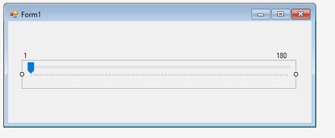

# Control Servo Motor from Windows Form Application using Serial Communication
## Requires
- Visual Studio 2015
## License
- MIT
## Technologies
- Windows Forms
- Visual Studio
- arduino
## Topics
- C#
- Visual Studio
- arduino
- serial communication
- arduino interfacing
## Updated
- 09/30/2017
## Description

This code sample demonstrates how to use to control servo motor attached to arduino in Windows Form Application c# using serial communication.

&nbsp;

Download the code file:

Extract it

Open &quot;Pos&quot;&nbsp;folder<strong>&nbsp;</strong><em>&nbsp;</em> and open file &quot;<strong>pos.ino</strong>&quot; in arduino IDE. Here's the arduino code:

&nbsp;

&nbsp;

#include&lt;Servo.h&gt; 
Servo base;

void setup()  
{ 
&nbsp; base.attach(8);

&nbsp; Serial.begin(9600);&nbsp;
 
}

void loop() 
{ 
&nbsp;&nbsp;&nbsp;&nbsp;&nbsp; int val=Serial.parseInt(); 
&nbsp;&nbsp;&nbsp;&nbsp;&nbsp; if(val!=0) 
&nbsp;&nbsp;&nbsp;&nbsp;&nbsp; { 
&nbsp;&nbsp;&nbsp;&nbsp;&nbsp;&nbsp;&nbsp; base.write(val); 
&nbsp;&nbsp;&nbsp;&nbsp;&nbsp; } 
}

 

I have attached Servo Motor to pin number 8. You can change pin number in your code. Upload this code to arduino board. I am using arduino UNO, and my port number is COM29 and baud rate is 9600. Notice your port number and
 baudRate becasue we will use this in our C# code.

 

After you successfully uploaded your code, open
<strong>ServoControl.sln</strong> file in visual studio. 

In Solution Explorer open <strong>Form1.cs[Design]</strong> file you will notice that I there is a
<strong>T</strong><strong>rackBar</strong> control on Form.

In properties Minimum value was set to 1 and Maxmimun value was set to 180.&nbsp;

 

In code file, for serial communication i have used libraray

C#

Edit|Remove

csharp 

<pre class="csharp">using&nbsp;<a class="libraryLink" href="https://msdn.microsoft.com/en-US/library/System.IO.Ports.aspx" target="_blank" title="Auto generated link to System.IO.Ports">System.IO.Ports</a>;</pre>

&nbsp;

C#

Edit|Remove

csharp 

<pre class="js">&nbsp;&nbsp;&nbsp;&nbsp;&nbsp;&nbsp;&nbsp;&nbsp;SerialPort&nbsp;port&nbsp;=&nbsp;new&nbsp;SerialPort();&nbsp;
&nbsp;&nbsp;&nbsp;&nbsp;&nbsp;&nbsp;&nbsp;&nbsp;&nbsp;
&nbsp;&nbsp;&nbsp;&nbsp;&nbsp;&nbsp;&nbsp;&nbsp;public&nbsp;Form1()&nbsp;
&nbsp;&nbsp;&nbsp;&nbsp;&nbsp;&nbsp;&nbsp;&nbsp;{&nbsp;
&nbsp;&nbsp;&nbsp;&nbsp;&nbsp;&nbsp;&nbsp;&nbsp;&nbsp;&nbsp;&nbsp;&nbsp;InitializeComponent();&nbsp;
&nbsp;&nbsp;&nbsp;&nbsp;&nbsp;&nbsp;&nbsp;&nbsp;&nbsp;&nbsp;&nbsp;&nbsp;init();&nbsp;
&nbsp;&nbsp;&nbsp;&nbsp;&nbsp;&nbsp;&nbsp;&nbsp;}&nbsp;
&nbsp;
&nbsp;&nbsp;&nbsp;&nbsp;&nbsp;&nbsp;&nbsp;&nbsp;void&nbsp;init()&nbsp;
&nbsp;&nbsp;&nbsp;&nbsp;&nbsp;&nbsp;&nbsp;&nbsp;{&nbsp;
&nbsp;&nbsp;&nbsp;&nbsp;&nbsp;&nbsp;&nbsp;&nbsp;&nbsp;&nbsp;&nbsp;&nbsp;&nbsp;
&nbsp;&nbsp;&nbsp;&nbsp;&nbsp;&nbsp;&nbsp;&nbsp;&nbsp;&nbsp;&nbsp;&nbsp;port.PortName&nbsp;=&nbsp;&quot;COM29&quot;;&nbsp;
&nbsp;&nbsp;&nbsp;&nbsp;&nbsp;&nbsp;&nbsp;&nbsp;&nbsp;&nbsp;&nbsp;&nbsp;port.BaudRate&nbsp;=&nbsp;9600;&nbsp;
&nbsp;&nbsp;&nbsp;&nbsp;&nbsp;&nbsp;&nbsp;&nbsp;&nbsp;&nbsp;&nbsp;&nbsp;try&nbsp;
&nbsp;&nbsp;&nbsp;&nbsp;&nbsp;&nbsp;&nbsp;&nbsp;&nbsp;&nbsp;&nbsp;&nbsp;{&nbsp;
&nbsp;&nbsp;&nbsp;&nbsp;&nbsp;&nbsp;&nbsp;&nbsp;&nbsp;&nbsp;&nbsp;&nbsp;&nbsp;&nbsp;&nbsp;&nbsp;port.Open();&nbsp;
&nbsp;&nbsp;&nbsp;&nbsp;&nbsp;&nbsp;&nbsp;&nbsp;&nbsp;&nbsp;&nbsp;&nbsp;}&nbsp;
&nbsp;&nbsp;&nbsp;&nbsp;&nbsp;&nbsp;&nbsp;&nbsp;&nbsp;&nbsp;&nbsp;&nbsp;catch&nbsp;{&nbsp;}&nbsp;
&nbsp;&nbsp;&nbsp;&nbsp;&nbsp;&nbsp;&nbsp;&nbsp;}</pre>

&nbsp;In file 
port.PortName=&quot;COM29&quot; write your port name on which arduino is connected. And also baudrate which was set to 9600 in arduino code.

Following lines of code will send value from trackbar control to arduino board

C#

Edit|Remove

csharp 

<pre class="js">&nbsp;private&nbsp;void&nbsp;trackBar1_Scroll(object&nbsp;sender,&nbsp;EventArgs&nbsp;e)&nbsp;
&nbsp;&nbsp;&nbsp;&nbsp;&nbsp;&nbsp;&nbsp;&nbsp;{&nbsp;
&nbsp;&nbsp;&nbsp;&nbsp;&nbsp;&nbsp;&nbsp;&nbsp;&nbsp;&nbsp;&nbsp;&nbsp;if&nbsp;(port.IsOpen)&nbsp;
&nbsp;&nbsp;&nbsp;&nbsp;&nbsp;&nbsp;&nbsp;&nbsp;&nbsp;&nbsp;&nbsp;&nbsp;{&nbsp;
&nbsp;&nbsp;&nbsp;&nbsp;&nbsp;&nbsp;&nbsp;&nbsp;&nbsp;&nbsp;&nbsp;&nbsp;&nbsp;&nbsp;&nbsp;&nbsp;port.WriteLine(trackBar1.Value.ToString());&nbsp;
&nbsp;&nbsp;&nbsp;&nbsp;&nbsp;&nbsp;&nbsp;&nbsp;&nbsp;&nbsp;&nbsp;&nbsp;}&nbsp;
&nbsp;&nbsp;&nbsp;&nbsp;&nbsp;&nbsp;&nbsp;&nbsp;}</pre>

&nbsp;

&nbsp;Execute the code and control your servo angles with trackBar. If you have any queries you can ask in Q/A section

&nbsp;

