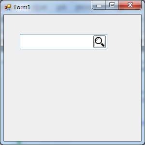

# Control TextBox con botón
## Requires
- Visual Studio 2013
## License
- MIT
## Technologies
- Controls
- Windows Forms
- custom controls
- Control
- extended controls
## Topics
- custom controls
- Windows Form Controls
## Updated
- 04/04/2015
## Description

Un interfaz que nos encontramos con mucha frecuencia es el cuadro de texto con un bot&oacute;n asociado. Se utiliza principalmente en pantallas de b&uacute;squedas, pero tambi&eacute;n nos lo podemos encontrar para cubrir otras necesidades: acceso a interfaces
 de entrada de datos (calendario, calculadora, ...), a informaci&oacute;n de ayuda, etc.

Por desgracia el framework de .NET no incluye un control con esta funcionalidad. Podemos suplir esta carencia cre&aacute;ndonos un control de usuario con un TextBox y un Button, pero vamos a ver c&oacute;mo podemos modificar el TextBox para a&ntilde;adirle
 esta funcionalidad, creando un nuevo control que herede del control TextBox.

&nbsp;

Vamos a crear un nuevo control TextBoxButton que se visualizar&aacute; como un control TextBox normal con un bot&oacute;n situado en la parte derecha del control.

El nuevo control tendr&aacute; todas las propiedades, m&eacute;todos y eventos del control TextBox est&aacute;ndar y adem&aacute;s:

<ul>
<li>Una propiedad ButtonImage que permita indicar la imagen a mostrar en el bot&oacute;n.
</li><li>Un evento ButtonClick que se producir&aacute; cuando se realice click sobre el bot&oacute;n.
</li></ul>

Para crear el control voy a crear un nuevo proyecto TextBoxButtonControl en Visual Studio utilizando la plantilla para bibliotecas de clases.

Eliminamos la clase&nbsp;<em>Class1&nbsp;</em>que genera el Visual Studio por defecto y creamos una nueva clase&nbsp;<em>TextBoxButton</em>.

&nbsp;

Para que nuestro control tenga toda la funcionalidad de un&nbsp;<em>TextBox&nbsp;</em>cl&aacute;sico vamos a hacer que nuestra clase herede de la clase&nbsp;<em>TextBox&nbsp;</em>de&nbsp;<em><a class="libraryLink" href="https://msdn.microsoft.com/es-ES/library/System.Windows.Forms.aspx" target="_blank" title="Auto generated link to System.Windows.Forms">System.Windows.Forms</a></em>.
 Para ello necesitamos agregar la referencia a esta librer&iacute;a. En el men&uacute;&nbsp;<em>Proyecto&nbsp;</em>vamos a la opci&oacute;n&nbsp;<em>Agregar
 referencia</em>, desplegamos&nbsp;<em>Ensamblados&nbsp;</em>y vamos a la opci&oacute;n&nbsp;<em>Framework</em>. En la lista
 de ensamblados seleccionamos&nbsp;<em><a class="libraryLink" href="https://msdn.microsoft.com/es-ES/library/System.Windows.Forms.aspx" target="_blank" title="Auto generated link to System.Windows.Forms">System.Windows.Forms</a></em>&nbsp;y pulsamos&nbsp;<em>Aceptar</em>.

&nbsp;

Hacemos que nuestra clase TextBoxButton herede de <a class="libraryLink" href="https://msdn.microsoft.com/es-ES/library/System.Windows.Forms.TextBox.aspx" target="_blank" title="Auto generated link to System.Windows.Forms.TextBox">System.Windows.Forms.TextBox</a>, y con esto ya tendr&iacute;amos la base de nuestro propio control con toda la funcionalidad del TextBox cl&aacute;sico.

&nbsp;

C#Visual Basic

Editar script|Remove

csharpvb

<pre class="csharp">using&nbsp;System;&nbsp;
using&nbsp;<a class="libraryLink" href="https://msdn.microsoft.com/es-ES/library/System.Collections.Generic.aspx" target="_blank" title="Auto generated link to System.Collections.Generic">System.Collections.Generic</a>;&nbsp;
using&nbsp;<a class="libraryLink" href="https://msdn.microsoft.com/es-ES/library/System.Linq.aspx" target="_blank" title="Auto generated link to System.Linq">System.Linq</a>;&nbsp;
using&nbsp;<a class="libraryLink" href="https://msdn.microsoft.com/es-ES/library/System.Text.aspx" target="_blank" title="Auto generated link to System.Text">System.Text</a>;&nbsp;
using&nbsp;<a class="libraryLink" href="https://msdn.microsoft.com/es-ES/library/System.Threading.Tasks.aspx" target="_blank" title="Auto generated link to System.Threading.Tasks">System.Threading.Tasks</a>;&nbsp;
using&nbsp;<a class="libraryLink" href="https://msdn.microsoft.com/es-ES/library/System.Windows.Forms.aspx" target="_blank" title="Auto generated link to System.Windows.Forms">System.Windows.Forms</a>;&nbsp;
&nbsp;
namespace&nbsp;TextBoxButtonControl&nbsp;
{&nbsp;
&nbsp;&nbsp;&nbsp;&nbsp;publicclass&nbsp;TextBoxButton:&nbsp;TextBox&nbsp;
&nbsp;&nbsp;&nbsp;&nbsp;{&nbsp;
&nbsp;
&nbsp;&nbsp;&nbsp;&nbsp;}&nbsp;
}</pre>

Para poder probar nuestro control vamos a agregar un nuevo proyecto PruebaControl a la soluci&oacute;n utilizando la plantilla Aplicaci&oacute;n de Windows Forms.

Para poder utilizar el nuevo control desde el proyecto de pruebas tendremos que a&ntilde;adir una referencia al proyecto TextBoxButtonControl. En el men&uacute; Proyecto vamos a la opci&oacute;n Agregar referencia, desplegamos Soluci&oacute;n y vamos a
 la opci&oacute;n Proyectos. Seleccionamos el proyecto TextBoxButtonControl y pulsamos Aceptar.

Si abrimos en modo dise&ntilde;o el formulario Form1 que Visual Studio ha creado autom&aacute;ticamente al crear el proyecto PruebaControl, veremos que en la ventana Cuadro de herramientas aparece nuestro nuevo control TextBoxButton.

&nbsp;

Si no puedes ver el control, compila la Soluci&oacute;n (Men&uacute; Compilar &gt; Compilar Soluci&oacute;n) para que aparezca.

A continuaci&oacute;n arrastramos el control al &aacute;rea de dise&ntilde;o del formulario y veremos que, como esper&aacute;bamos, la apariencia es la misma que la de un control TextBox y, mirando la ventana Propiedades, que ha heredado todas las propiedades
 y eventos de &eacute;ste.

Establecemos el proyecto PruebaControl como proyecto de inicio (Men&uacute; Proyecto &gt;&nbsp; Establecer como proyecto de inicio) y arrancamos la aplicaci&oacute;n para comprobar que el funcionamiento de nuestro TextBoxButton es id&eacute;ntico al de
 cualquier otro TextBox.

Para a&ntilde;adir el bot&oacute;n voy a crear un control Button en el constructor de la clase TextBoxButton y lo a&ntilde;adir&eacute; a la colecci&oacute;n Controls de &eacute;ste.

Tambi&eacute;n voy crear&eacute; un m&eacute;todo PosicionarBoton que se encargar&aacute; de establecer el ancho y alto del bot&oacute;n al valor de la altura del TextBoxButton y de alinearlo a la derecha del TextBox. Llamar&eacute; a este m&eacute;todo
 en la creaci&oacute;n del control y cada vez que se genere el evento Resize indicando que el control ha cambiado de tama&ntilde;o.

Para poder utilizar las clases Size y Point deberemos a&ntilde;adir una referencia al ensamblado <a class="libraryLink" href="https://msdn.microsoft.com/es-ES/library/System.Drawing.aspx" target="_blank" title="Auto generated link to System.Drawing">System.Drawing</a> de la misma forma que lo hicimos con System.Windows.Forms.

C#Visual Basic

Editar script|Remove

csharpvb

<pre class="csharp">using&nbsp;System;&nbsp;
using&nbsp;<a class="libraryLink" href="https://msdn.microsoft.com/es-ES/library/System.Collections.Generic.aspx" target="_blank" title="Auto generated link to System.Collections.Generic">System.Collections.Generic</a>;&nbsp;
using&nbsp;<a class="libraryLink" href="https://msdn.microsoft.com/es-ES/library/System.Drawing.aspx" target="_blank" title="Auto generated link to System.Drawing">System.Drawing</a>;&nbsp;
using&nbsp;<a class="libraryLink" href="https://msdn.microsoft.com/es-ES/library/System.Linq.aspx" target="_blank" title="Auto generated link to System.Linq">System.Linq</a>;&nbsp;
using&nbsp;<a class="libraryLink" href="https://msdn.microsoft.com/es-ES/library/System.Text.aspx" target="_blank" title="Auto generated link to System.Text">System.Text</a>;&nbsp;
using&nbsp;<a class="libraryLink" href="https://msdn.microsoft.com/es-ES/library/System.Threading.Tasks.aspx" target="_blank" title="Auto generated link to System.Threading.Tasks">System.Threading.Tasks</a>;&nbsp;
using&nbsp;<a class="libraryLink" href="https://msdn.microsoft.com/es-ES/library/System.Windows.Forms.aspx" target="_blank" title="Auto generated link to System.Windows.Forms">System.Windows.Forms</a>;&nbsp;
&nbsp;
namespace&nbsp;TextBoxButtonControl&nbsp;
{&nbsp;
&nbsp;&nbsp;&nbsp;&nbsp;publicclass&nbsp;TextBoxButton:&nbsp;TextBox&nbsp;
&nbsp;&nbsp;&nbsp;&nbsp;{&nbsp;
&nbsp;
&nbsp;&nbsp;&nbsp;&nbsp;&nbsp;&nbsp;&nbsp;&nbsp;privatereadonly&nbsp;Button&nbsp;_button;&nbsp;
&nbsp;
&nbsp;&nbsp;&nbsp;&nbsp;&nbsp;&nbsp;&nbsp;&nbsp;public&nbsp;TextBoxButton()&nbsp;
&nbsp;&nbsp;&nbsp;&nbsp;&nbsp;&nbsp;&nbsp;&nbsp;{&nbsp;
&nbsp;&nbsp;&nbsp;&nbsp;&nbsp;&nbsp;&nbsp;&nbsp;&nbsp;&nbsp;&nbsp;&nbsp;_button&nbsp;=&nbsp;new&nbsp;Button&nbsp;{&nbsp;
&nbsp;&nbsp;&nbsp;&nbsp;&nbsp;&nbsp;&nbsp;&nbsp;&nbsp;&nbsp;&nbsp;&nbsp;&nbsp;&nbsp;&nbsp;&nbsp;Cursor&nbsp;=&nbsp;Cursors.Default,&nbsp;
&nbsp;&nbsp;&nbsp;&nbsp;&nbsp;&nbsp;&nbsp;&nbsp;&nbsp;&nbsp;&nbsp;&nbsp;&nbsp;&nbsp;&nbsp;&nbsp;TabStop&nbsp;=&nbsp;false&nbsp;
&nbsp;&nbsp;&nbsp;&nbsp;&nbsp;&nbsp;&nbsp;&nbsp;&nbsp;&nbsp;&nbsp;&nbsp;};&nbsp;
&nbsp;&nbsp;&nbsp;&nbsp;&nbsp;&nbsp;&nbsp;&nbsp;&nbsp;&nbsp;&nbsp;&nbsp;this.Controls.Add(_button);&nbsp;
&nbsp;&nbsp;&nbsp;&nbsp;&nbsp;&nbsp;&nbsp;&nbsp;&nbsp;&nbsp;&nbsp;&nbsp;PosicionarBoton();&nbsp;
&nbsp;&nbsp;&nbsp;&nbsp;&nbsp;&nbsp;&nbsp;&nbsp;}&nbsp;
&nbsp;
&nbsp;&nbsp;&nbsp;&nbsp;&nbsp;&nbsp;&nbsp;&nbsp;protectedoverridevoid&nbsp;OnResize(EventArgs&nbsp;e)&nbsp;
&nbsp;&nbsp;&nbsp;&nbsp;&nbsp;&nbsp;&nbsp;&nbsp;{&nbsp;
&nbsp;&nbsp;&nbsp;&nbsp;&nbsp;&nbsp;&nbsp;&nbsp;&nbsp;&nbsp;&nbsp;&nbsp;base.OnResize(e);&nbsp;
&nbsp;&nbsp;&nbsp;&nbsp;&nbsp;&nbsp;&nbsp;&nbsp;&nbsp;&nbsp;&nbsp;&nbsp;PosicionarBoton();&nbsp;
&nbsp;&nbsp;&nbsp;&nbsp;&nbsp;&nbsp;&nbsp;&nbsp;}&nbsp;
&nbsp;
&nbsp;&nbsp;&nbsp;&nbsp;&nbsp;&nbsp;&nbsp;&nbsp;privatevoid&nbsp;PosicionarBoton()&nbsp;
&nbsp;&nbsp;&nbsp;&nbsp;&nbsp;&nbsp;&nbsp;&nbsp;{&nbsp;
&nbsp;&nbsp;&nbsp;&nbsp;&nbsp;&nbsp;&nbsp;&nbsp;&nbsp;&nbsp;&nbsp;&nbsp;_button.Size&nbsp;=&nbsp;new&nbsp;Size(this.ClientSize.Height,&nbsp;this.ClientSize.Height);&nbsp;
&nbsp;&nbsp;&nbsp;&nbsp;&nbsp;&nbsp;&nbsp;&nbsp;&nbsp;&nbsp;&nbsp;&nbsp;_button.Location&nbsp;=&nbsp;new&nbsp;Point(this.ClientSize.Width&nbsp;-&nbsp;_button.Width,&nbsp;0);&nbsp;
&nbsp;&nbsp;&nbsp;&nbsp;&nbsp;&nbsp;&nbsp;&nbsp;}&nbsp;
&nbsp;
&nbsp;&nbsp;&nbsp;&nbsp;}&nbsp;
}&nbsp;
</pre>

Si compilamos el proyecto y vamos a nuestro formulario de prueba veremos que ya aparece el bot&oacute;n a la derecha de nuestro control. Si modificamos el tama&ntilde;o del control comprobaremos que el bot&oacute;n se redimensiona para ajustarse al tama&ntilde;o
 del contenedor y, si arrancamos el proyecto PruebaControl veremos c&oacute;mo se muestra correctamente en el formulario.

Sin embargo, si introducimos texto en el control, veremos que cuando el texto llega a la altura del bot&oacute;n el texto se sigue escribiendo debajo de &eacute;ste.

Por desgracia el Framework de .NET no nos proporciona herramientas para evitar este problema as&iacute; que tendremos que recurrir a la API de Windows. Para establecer los margenes de un control de edici&oacute;n deberemos enviar el mensaje EM_SETMARGINS.

C#Visual Basic

Editar script|Remove

csharpvb

<pre class="csharp">privatevoid&nbsp;PosicionarBoton()&nbsp;
&nbsp;&nbsp;&nbsp;&nbsp;&nbsp;&nbsp;&nbsp;&nbsp;{&nbsp;
&nbsp;&nbsp;&nbsp;&nbsp;&nbsp;&nbsp;&nbsp;&nbsp;&nbsp;&nbsp;&nbsp;&nbsp;_button.Size&nbsp;=&nbsp;new&nbsp;Size(this.ClientSize.Height,&nbsp;this.ClientSize.Height);&nbsp;
&nbsp;&nbsp;&nbsp;&nbsp;&nbsp;&nbsp;&nbsp;&nbsp;&nbsp;&nbsp;&nbsp;&nbsp;_button.Location&nbsp;=&nbsp;new&nbsp;Point(this.ClientSize.Width&nbsp;-&nbsp;_button.Width,&nbsp;0);&nbsp;
&nbsp;&nbsp;&nbsp;&nbsp;&nbsp;&nbsp;&nbsp;&nbsp;&nbsp;&nbsp;&nbsp;&nbsp;SendMessage(this.Handle,&nbsp;0xd3,&nbsp;(IntPtr)2,&nbsp;(IntPtr)(_button.Width&nbsp;&lt;&lt;&nbsp;16));&nbsp;
&nbsp;&nbsp;&nbsp;&nbsp;&nbsp;&nbsp;&nbsp;&nbsp;}&nbsp;
&nbsp;
&nbsp;&nbsp;&nbsp;&nbsp;&nbsp;&nbsp;&nbsp;&nbsp;[System.Runtime.InteropServices.DllImport(&quot;user32.dll&quot;)]&nbsp;
&nbsp;&nbsp;&nbsp;&nbsp;&nbsp;&nbsp;&nbsp;&nbsp;privatestaticextern&nbsp;IntPtr&nbsp;SendMessage(IntPtr&nbsp;hWnd,&nbsp;int&nbsp;msg,&nbsp;IntPtr&nbsp;wp,&nbsp;IntPtr&nbsp;lp);</pre>

Si arrancamos de nuevo nuestro formulario de prueba e introducimos texto en el control comprobaremos que el espacio de edici&oacute;n finaliza justo antes de llegar al bot&oacute;n.

Ya tenemos nuestro control de texto con bot&oacute;n incrustado, pero no tenemos forma de a&ntilde;adirle funcionalidad al bot&oacute;n ya que no podemos controlar cuando es pulsado por el usuario.

Para solucionarlo vamos a propagar el evento Click del bot&oacute;n a trav&eacute;s de un evento ButtonClick en el nuevo control. Para ello creamos el evento ButtonClick y lo configuramos de forma que, cuando se a&ntilde;ada un controlador al evento, se
 lo a&ntilde;adimos al evento Click del bot&oacute;n. Y cuando se elimine un controlador, lo eliminamos igualmente del evento Click del bot&oacute;n.

C#Visual Basic

Editar script|Remove

csharpvb

<pre class="csharp">&nbsp;&nbsp;&nbsp;&nbsp;&nbsp;&nbsp;&nbsp;&nbsp;[Category(&quot;Action&quot;)]&nbsp;
&nbsp;&nbsp;&nbsp;&nbsp;&nbsp;&nbsp;&nbsp;&nbsp;public&nbsp;event&nbsp;EventHandler&nbsp;ButtonClick&nbsp;
&nbsp;&nbsp;&nbsp;&nbsp;&nbsp;&nbsp;&nbsp;&nbsp;{&nbsp;
&nbsp;&nbsp;&nbsp;&nbsp;&nbsp;&nbsp;&nbsp;&nbsp;&nbsp;&nbsp;&nbsp;&nbsp;add&nbsp;{&nbsp;&nbsp;_button.Click&nbsp;&#43;=&nbsp;value;&nbsp;}&nbsp;
&nbsp;&nbsp;&nbsp;&nbsp;&nbsp;&nbsp;&nbsp;&nbsp;&nbsp;&nbsp;&nbsp;&nbsp;remove&nbsp;{&nbsp;_button.Click&nbsp;-=&nbsp;value;&nbsp;}&nbsp;
&nbsp;&nbsp;&nbsp;&nbsp;&nbsp;&nbsp;&nbsp;&nbsp;}</pre>

He a&ntilde;adido un atributo Category al evento para que se muestre en la ventana de Propiedades del Visual Studio junto con el resto de eventos de la categor&iacute;a Acci&oacute;n.

&nbsp;

Si en el formulario de prueba a&ntilde;adimos un controlador para el evento podremos probar la nueva funcionalidad.

C#Visual Basic

Editar script|Remove

csharpvb

<pre class="csharp">&nbsp;&nbsp;&nbsp;&nbsp;&nbsp;&nbsp;&nbsp;&nbsp;private&nbsp;void&nbsp;textBoxButton1_ButtonClick(object&nbsp;sender,&nbsp;EventArgs&nbsp;e)&nbsp;
&nbsp;&nbsp;&nbsp;&nbsp;&nbsp;&nbsp;&nbsp;&nbsp;{&nbsp;
&nbsp;&nbsp;&nbsp;&nbsp;&nbsp;&nbsp;&nbsp;&nbsp;&nbsp;&nbsp;&nbsp;&nbsp;MessageBox.Show(&quot;Ha&nbsp;pulsado&nbsp;el&nbsp;bot&oacute;n&nbsp;del&nbsp;control&quot;);&nbsp;
&nbsp;&nbsp;&nbsp;&nbsp;&nbsp;&nbsp;&nbsp;&nbsp;}</pre>

Ya tenemos el control con la funcionalidad deseada. &Uacute;nicamente nos faltar&iacute;a mejorar la presentaci&oacute;n. Para ello a&ntilde;adir&eacute; una propiedad que permita al desarrollador especificar una imagen a mostrar en el bot&oacute;n e incluir&eacute;
 una imagen en el proyecto que se mostrar&aacute; por defecto en caso de que el desarrollador no indique ninguna.

Primero voy a a&ntilde;adir la imagen que mostrar&eacute; por defecto en el proyecto. Para ello abrimos las propiedades del proyecto (Men&uacute; Proyecto &gt; Propiedades de TextBoxButtonControl...) y seleccionamos la opci&oacute;n Recursos. Si nos aparece
 un mensaje indicando que no existe ning&uacute;n archivo de recursos para el proyecto, hacemos click en el enlace para generar uno. Seleccionamos Im&aacute;genes como tipo de recurso y Agregar archivo existente... en Agregar recurso.

La imagen&nbsp;ha sido creada originalmente
 por&nbsp;<a title="Google" href="http://www.google.com/" style="">Google</a>&nbsp;y
 descargada de&nbsp;<a title="Flaticon" href="http://www.flaticon.com/" style="">www.flaticon.com</a>.
 La imagen se encuentra bajo licencia&nbsp;<a title="Creative Commons BY 3.0" href="http://creativecommons.org/licenses/by/3.0/" style="">CC BY 3.0</a>.&nbsp;

Una vez a&ntilde;adida la imagen establecemos el nombre del recurso como &quot;ellipsis&quot;.

A continuaci&oacute;n voy a modificar la inicializaci&oacute;n del bot&oacute;n para establecer la imagen por defecto.

C#Visual Basic

Editar script|Remove

csharpvb

<pre class="csharp">&nbsp;&nbsp;&nbsp;&nbsp;&nbsp;&nbsp;&nbsp;&nbsp;&nbsp;&nbsp;&nbsp;&nbsp;_button&nbsp;=&nbsp;new&nbsp;Button&nbsp;
&nbsp;&nbsp;&nbsp;&nbsp;&nbsp;&nbsp;&nbsp;&nbsp;&nbsp;&nbsp;&nbsp;&nbsp;{&nbsp;
&nbsp;&nbsp;&nbsp;&nbsp;&nbsp;&nbsp;&nbsp;&nbsp;&nbsp;&nbsp;&nbsp;&nbsp;&nbsp;&nbsp;&nbsp;&nbsp;Cursor&nbsp;=&nbsp;Cursors.Default,&nbsp;
&nbsp;&nbsp;&nbsp;&nbsp;&nbsp;&nbsp;&nbsp;&nbsp;&nbsp;&nbsp;&nbsp;&nbsp;&nbsp;&nbsp;&nbsp;&nbsp;TabStop&nbsp;=&nbsp;false,&nbsp;
&nbsp;&nbsp;&nbsp;&nbsp;&nbsp;&nbsp;&nbsp;&nbsp;&nbsp;&nbsp;&nbsp;&nbsp;&nbsp;&nbsp;&nbsp;&nbsp;BackgroundImage&nbsp;=&nbsp;Properties.Resources.ellipsis,&nbsp;
&nbsp;&nbsp;&nbsp;&nbsp;&nbsp;&nbsp;&nbsp;&nbsp;&nbsp;&nbsp;&nbsp;&nbsp;&nbsp;&nbsp;&nbsp;&nbsp;BackgroundImageLayout&nbsp;=&nbsp;ImageLayout.Zoom&nbsp;
&nbsp;&nbsp;&nbsp;&nbsp;&nbsp;&nbsp;&nbsp;&nbsp;&nbsp;&nbsp;&nbsp;&nbsp;};</pre>

&nbsp;Si arrancamos la aplicaci&oacute;n podremos ver el efecto del cambio.

Ya s&oacute;lo falta darle al desarrollador la posibilidad de cambiar la imagen del bot&oacute;n. As&iacute; que voy a a&ntilde;adir al control una propiedad ButtonImage.

C#Visual Basic

Editar script|Remove

csharpvb

<pre class="csharp">&nbsp;&nbsp;&nbsp;&nbsp;&nbsp;&nbsp;&nbsp;&nbsp;private&nbsp;Image&nbsp;_buttonImage;&nbsp;
&nbsp;
&nbsp;&nbsp;&nbsp;&nbsp;&nbsp;&nbsp;&nbsp;&nbsp;[Category(&quot;Appearance&quot;),&nbsp;Description(&quot;Imagen&nbsp;del&nbsp;bot&oacute;n&quot;)]&nbsp;
&nbsp;&nbsp;&nbsp;&nbsp;&nbsp;&nbsp;&nbsp;&nbsp;public&nbsp;Image&nbsp;ButtonImage&nbsp;
&nbsp;&nbsp;&nbsp;&nbsp;&nbsp;&nbsp;&nbsp;&nbsp;{&nbsp;
&nbsp;&nbsp;&nbsp;&nbsp;&nbsp;&nbsp;&nbsp;&nbsp;&nbsp;&nbsp;&nbsp;&nbsp;get&nbsp;
&nbsp;&nbsp;&nbsp;&nbsp;&nbsp;&nbsp;&nbsp;&nbsp;&nbsp;&nbsp;&nbsp;&nbsp;{&nbsp;
&nbsp;&nbsp;&nbsp;&nbsp;&nbsp;&nbsp;&nbsp;&nbsp;&nbsp;&nbsp;&nbsp;&nbsp;&nbsp;&nbsp;&nbsp;&nbsp;return&nbsp;_buttonImage;&nbsp;
&nbsp;&nbsp;&nbsp;&nbsp;&nbsp;&nbsp;&nbsp;&nbsp;&nbsp;&nbsp;&nbsp;&nbsp;}&nbsp;
&nbsp;&nbsp;&nbsp;&nbsp;&nbsp;&nbsp;&nbsp;&nbsp;&nbsp;&nbsp;&nbsp;&nbsp;set&nbsp;
&nbsp;&nbsp;&nbsp;&nbsp;&nbsp;&nbsp;&nbsp;&nbsp;&nbsp;&nbsp;&nbsp;&nbsp;{&nbsp;
&nbsp;&nbsp;&nbsp;&nbsp;&nbsp;&nbsp;&nbsp;&nbsp;&nbsp;&nbsp;&nbsp;&nbsp;&nbsp;&nbsp;&nbsp;&nbsp;_buttonImage&nbsp;=&nbsp;value;&nbsp;
&nbsp;&nbsp;&nbsp;&nbsp;&nbsp;&nbsp;&nbsp;&nbsp;&nbsp;&nbsp;&nbsp;&nbsp;&nbsp;&nbsp;&nbsp;&nbsp;if&nbsp;(_buttonImage&nbsp;==&nbsp;null)&nbsp;
&nbsp;&nbsp;&nbsp;&nbsp;&nbsp;&nbsp;&nbsp;&nbsp;&nbsp;&nbsp;&nbsp;&nbsp;&nbsp;&nbsp;&nbsp;&nbsp;&nbsp;&nbsp;&nbsp;&nbsp;_button.BackgroundImage&nbsp;=&nbsp;Properties.Resources.ellipsis;&nbsp;
&nbsp;&nbsp;&nbsp;&nbsp;&nbsp;&nbsp;&nbsp;&nbsp;&nbsp;&nbsp;&nbsp;&nbsp;&nbsp;&nbsp;&nbsp;&nbsp;else&nbsp;
&nbsp;&nbsp;&nbsp;&nbsp;&nbsp;&nbsp;&nbsp;&nbsp;&nbsp;&nbsp;&nbsp;&nbsp;&nbsp;&nbsp;&nbsp;&nbsp;&nbsp;&nbsp;&nbsp;&nbsp;_button.BackgroundImage&nbsp;=&nbsp;_buttonImage;&nbsp;
&nbsp;&nbsp;&nbsp;&nbsp;&nbsp;&nbsp;&nbsp;&nbsp;&nbsp;&nbsp;&nbsp;&nbsp;}&nbsp;
&nbsp;&nbsp;&nbsp;&nbsp;&nbsp;&nbsp;&nbsp;&nbsp;}</pre>

He creado una variable privada _buttonImage para almacenar la imagen elegida por el desarrollador. Si el desarrollador no establece ninguna imagen se utiliza la imagen por defecto.

Si compilo y vuelvo al formulario de prueba podemos ver la nueva propiedad del control.

Para probar la nueva propiedad voy a asignarle a la propiedad ButtonImage una imagen con una lupa.

Imagen creada
 por&nbsp;<a title="SimpleIcon" href="http://www.simpleicon.com/" style="">SimpleIcon</a>&nbsp;y
 descargada de&nbsp;<a title="Flaticon" href="http://www.flaticon.com/" style="">www.flaticon.com</a>&nbsp;bajo
 licencia&nbsp;<a title="Creative Commons BY 3.0" href="http://creativecommons.org/licenses/by/3.0/" style="">CC BY 3.0</a>.

 
Al arrancar la aplicaci&oacute;n podemos ver el efecto del cambio.

&nbsp;

