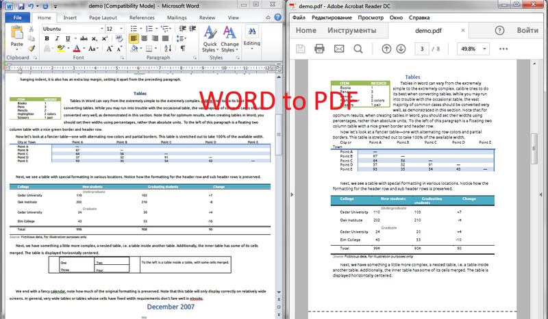

# Convert DOC (DOCX) file to PDF file in C# - Step by Step
## Requires
- Visual Studio 2012
## License
- MS-LPL
## Technologies
- COM
- C#
- Silverlight
- ASP.NET
- Office
- IIS
- Windows Forms
- Microsoft Azure
- Windows 7
- .NET Framework
- Windows
- Office 365
- Office 2010
- Visual C#
- Office Development
## Topics
- COM
- C#
- Silverlight
- ASP.NET
- User Interface
- Windows Forms
- custom controls
- Office 365
- COM Interop
- .NET 4
- How to
- Office 2010 101 code samples
## Updated
- 01/27/2016
## Description

<h1>Introduction</h1>

This is a C # example to convert DOC (DOCX) files into PDF under .Net using MS Office Automation via a free C# PDF library. Only the .Net platform, installed package of MS Office and nothing else.

<strong>With help of UseOffice .Net you will be able to create such applications as:</strong>

<ul>
<li>

Convert word to pdf.

</li><li>

Doc / DocX to pdf converter.

</li></ul>
<h1>Main Functions</h1>

<h1>How to do it:</h1>

<em>So, here we'll show you in details how to convert any DOC (DOCX) files in PDF documents using C#.</em>

<em><strong>Very simple example.</strong>&nbsp;For example, we've the DOCX file: odissey.docx (please see in att. file) and we need to create &nbsp;a PDF document.</em>

<em><strong>Step 1</strong>:&nbsp;Launch Visual Studio 2010 (2013). Click File-&gt;New Project-&gt;Visual C# Console Application.</em>

<em>Type the application name and location, for example &quot;docx to pdf&quot; and &quot;c:\samples&quot;.</em>

<em><strong>Step 2</strong>:&nbsp;In the Solution Explorer right-click on &quot;References&quot; and select &quot;Add Reference&quot;. Next add a reference to the &quot;SautinSoft.UseOffice.dll&quot;</em><em>.</em>

<em><strong>Step 3</strong>:&nbsp;So, we've created an empty C# console application. Now type the C# code to convert our
<em>odissey.docx&nbsp;</em>into&nbsp;<em>odissey.pdf</em></em>

<em><strong>Step 4</strong>: Please insert c# code in your console application.&nbsp;Now build the application and launch it.</em>

<em><strong>Well done!&nbsp;</strong>Our congratulations, with help of the UseOffice.Net library we've created a PDF document.</em>

C#

Edit|Remove

csharp
<pre class="hidden">using System;
using System.IO;
using System.Collections;
using SautinSoft;

namespace Sample
{
	class Test
	{
		
		static void Main(string[] args)
		{

			SautinSoft.UseOffice u = new SautinSoft.UseOffice();
            // You may download the latest version of SDK here: 
            // www.sautinsoft.com/convert-rtf-html-doc-docx-xls-xlsx-ppt-to-pdf-net-library/free-download.php 
            string inFile = @&quot;c:\Odissey.docx&quot;;
			string outFile = Path.ChangeExtension(inFile,&quot;.pdf&quot;);

			//Prepare UseOffice .Net, loads MS Word in memory
            if (u.InitWord() == 0)
            {
                u.ConvertFile(inFile, outFile, SautinSoft.UseOffice.eDirection.DOCX_to_PDF);
                //Release MS Word from memory
                u.CloseWord();
            }
		}
	}
}
</pre>

<pre class="csharp">using&nbsp;System;&nbsp;
using&nbsp;System.IO;&nbsp;
using&nbsp;System.Collections;&nbsp;
using&nbsp;SautinSoft;&nbsp;
&nbsp;
namespace&nbsp;Sample&nbsp;
{&nbsp;
&nbsp;&nbsp;&nbsp;&nbsp;class&nbsp;Test&nbsp;
&nbsp;&nbsp;&nbsp;&nbsp;{&nbsp;
&nbsp;&nbsp;&nbsp;&nbsp;&nbsp;&nbsp;&nbsp;&nbsp;&nbsp;
&nbsp;&nbsp;&nbsp;&nbsp;&nbsp;&nbsp;&nbsp;&nbsp;static&nbsp;void&nbsp;Main(string[]&nbsp;args)&nbsp;
&nbsp;&nbsp;&nbsp;&nbsp;&nbsp;&nbsp;&nbsp;&nbsp;{&nbsp;
&nbsp;
&nbsp;&nbsp;&nbsp;&nbsp;&nbsp;&nbsp;&nbsp;&nbsp;&nbsp;&nbsp;&nbsp;&nbsp;SautinSoft.UseOffice&nbsp;u&nbsp;=&nbsp;new&nbsp;SautinSoft.UseOffice();&nbsp;
&nbsp;&nbsp;&nbsp;&nbsp;&nbsp;&nbsp;&nbsp;&nbsp;&nbsp;&nbsp;&nbsp;&nbsp;//&nbsp;You&nbsp;may&nbsp;download&nbsp;the&nbsp;latest&nbsp;version&nbsp;of&nbsp;SDK&nbsp;here:&nbsp;&nbsp;
&nbsp;&nbsp;&nbsp;&nbsp;&nbsp;&nbsp;&nbsp;&nbsp;&nbsp;&nbsp;&nbsp;&nbsp;//&nbsp;www.sautinsoft.com/convert-rtf-html-doc-docx-xls-xlsx-ppt-to-pdf-net-library/free-download.php&nbsp;&nbsp;
&nbsp;&nbsp;&nbsp;&nbsp;&nbsp;&nbsp;&nbsp;&nbsp;&nbsp;&nbsp;&nbsp;&nbsp;string&nbsp;inFile&nbsp;=&nbsp;@&quot;c:\Odissey.docx&quot;;&nbsp;
&nbsp;&nbsp;&nbsp;&nbsp;&nbsp;&nbsp;&nbsp;&nbsp;&nbsp;&nbsp;&nbsp;&nbsp;string&nbsp;outFile&nbsp;=&nbsp;Path.ChangeExtension(inFile,&quot;.pdf&quot;);&nbsp;
&nbsp;
&nbsp;&nbsp;&nbsp;&nbsp;&nbsp;&nbsp;&nbsp;&nbsp;&nbsp;&nbsp;&nbsp;&nbsp;//Prepare&nbsp;UseOffice&nbsp;.Net,&nbsp;loads&nbsp;MS&nbsp;Word&nbsp;in&nbsp;memory&nbsp;
&nbsp;&nbsp;&nbsp;&nbsp;&nbsp;&nbsp;&nbsp;&nbsp;&nbsp;&nbsp;&nbsp;&nbsp;if&nbsp;(u.InitWord()&nbsp;==&nbsp;0)&nbsp;
&nbsp;&nbsp;&nbsp;&nbsp;&nbsp;&nbsp;&nbsp;&nbsp;&nbsp;&nbsp;&nbsp;&nbsp;{&nbsp;
&nbsp;&nbsp;&nbsp;&nbsp;&nbsp;&nbsp;&nbsp;&nbsp;&nbsp;&nbsp;&nbsp;&nbsp;&nbsp;&nbsp;&nbsp;&nbsp;u.ConvertFile(inFile,&nbsp;outFile,&nbsp;SautinSoft.UseOffice.eDirection.DOCX_to_PDF);&nbsp;
&nbsp;&nbsp;&nbsp;&nbsp;&nbsp;&nbsp;&nbsp;&nbsp;&nbsp;&nbsp;&nbsp;&nbsp;&nbsp;&nbsp;&nbsp;&nbsp;//Release&nbsp;MS&nbsp;Word&nbsp;from&nbsp;memory&nbsp;
&nbsp;&nbsp;&nbsp;&nbsp;&nbsp;&nbsp;&nbsp;&nbsp;&nbsp;&nbsp;&nbsp;&nbsp;&nbsp;&nbsp;&nbsp;&nbsp;u.CloseWord();&nbsp;
&nbsp;&nbsp;&nbsp;&nbsp;&nbsp;&nbsp;&nbsp;&nbsp;&nbsp;&nbsp;&nbsp;&nbsp;}&nbsp;
&nbsp;&nbsp;&nbsp;&nbsp;&nbsp;&nbsp;&nbsp;&nbsp;}&nbsp;
&nbsp;&nbsp;&nbsp;&nbsp;}&nbsp;
}&nbsp;
</pre>

<h1>Source Code Files</h1>

<em>Related Links:</em>

<em> 
Website:&nbsp;<a href="http://www.sautinsoft.com/">www.sautinsoft.com</a> 
Product Home: <a href="http://sautinsoft.com/convert-rtf-html-doc-docx-xls-xlsx-ppt-to-pdf-net-library/overview.php">
UseOffice.Net</a> 
Download:&nbsp;<em><a href="http://sautinsoft.com/convert-rtf-html-doc-docx-xls-xlsx-ppt-to-pdf-net-library/free-download.php">UseOffice.Net</a></em> 
</em>

<h2 class="H2Text">Requrements and Technical Information</h2>

<em>Requires only .Net 2.0 or above. Our product is compatible with all .Net languages and supports all Operating Systems where .Net Framework can be used. Note that UseOffice.Net is entirely written in managed C#, which makes it absolutely
 standalone and an independent library</em>

<em>Requires MS Office&reg;, any version: 2000, XP, 2003, 2007, 2010 or 2013</em>

