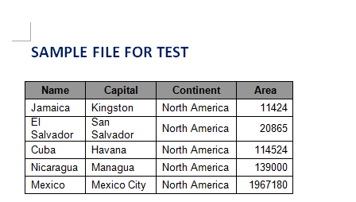
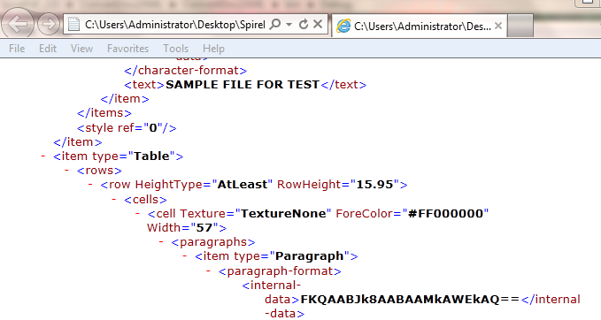

# Convert Doc to XML in C#
## Requires
- Visual Studio 2010
## License
- MS-LPL
## Technologies
- C#
- ASP.NET
- WPF
- c# control
- Word API
## Topics
- Doc/Docx to XML
- Convert Doc to XML
## Updated
- 11/17/2014
## Description

<h1>Introduction</h1>

In some cases, developers have the requirement to convert Doc/Docx to XML. This sample gives a C# solution provided by Spire.Doc for this issue.<em>
</em>

Description

<strong>Tools we need:</strong> 

- Spire.Doc dll (This dll is available in the package attached.) 
- Visual Studio

<strong>Prepare the environment</strong>

This solution is based on a .NET Word component -
 Spire.Doc, download the package and unzip it, you&rsquo;ll get dll file and sample demo at the same time. Create or open a .NET class application in Visual Studio 2005 or above versions, add Spire.Doc.dll as a reference to your .NET project assemblies, set
 &ldquo;Target framework&rdquo; to &ldquo;.NET Framework 4&rdquo;.

<strong>Namespaces to be used</strong>

using Spire.Doc; 
using Spire.Doc.Documents;

<strong>Code snippet</strong> 

C#

Edit|Remove

csharp
<pre class="hidden">static void Main(string[] args)
        {
            //Create word document
            Document document = new Document();
            document.LoadFromFile(&quot;Sample.doc&quot;);

            //Save doc file.
            document.SaveToFile(&quot;Sample.xml&quot;, FileFormat.Xml);

            //Launching the MS Word file.
            WordDocViewer(&quot;Sample.xml&quot;);
        }
        static void WordDocViewer(string fileName)
        {
            try
            {
                System.Diagnostics.Process.Start(fileName);
            }
            catch { }
        }</pre>

<pre class="csharp">static&nbsp;void&nbsp;Main(string[]&nbsp;args)&nbsp;
&nbsp;&nbsp;&nbsp;&nbsp;&nbsp;&nbsp;&nbsp;&nbsp;{&nbsp;
&nbsp;&nbsp;&nbsp;&nbsp;&nbsp;&nbsp;&nbsp;&nbsp;&nbsp;&nbsp;&nbsp;&nbsp;//Create&nbsp;word&nbsp;document&nbsp;
&nbsp;&nbsp;&nbsp;&nbsp;&nbsp;&nbsp;&nbsp;&nbsp;&nbsp;&nbsp;&nbsp;&nbsp;Document&nbsp;document&nbsp;=&nbsp;new&nbsp;Document();&nbsp;
&nbsp;&nbsp;&nbsp;&nbsp;&nbsp;&nbsp;&nbsp;&nbsp;&nbsp;&nbsp;&nbsp;&nbsp;document.LoadFromFile(&quot;Sample.doc&quot;);&nbsp;
&nbsp;
&nbsp;&nbsp;&nbsp;&nbsp;&nbsp;&nbsp;&nbsp;&nbsp;&nbsp;&nbsp;&nbsp;&nbsp;//Save&nbsp;doc&nbsp;file.&nbsp;
&nbsp;&nbsp;&nbsp;&nbsp;&nbsp;&nbsp;&nbsp;&nbsp;&nbsp;&nbsp;&nbsp;&nbsp;document.SaveToFile(&quot;Sample.xml&quot;,&nbsp;FileFormat.Xml);&nbsp;
&nbsp;
&nbsp;&nbsp;&nbsp;&nbsp;&nbsp;&nbsp;&nbsp;&nbsp;&nbsp;&nbsp;&nbsp;&nbsp;//Launching&nbsp;the&nbsp;MS&nbsp;Word&nbsp;file.&nbsp;
&nbsp;&nbsp;&nbsp;&nbsp;&nbsp;&nbsp;&nbsp;&nbsp;&nbsp;&nbsp;&nbsp;&nbsp;WordDocViewer(&quot;Sample.xml&quot;);&nbsp;
&nbsp;&nbsp;&nbsp;&nbsp;&nbsp;&nbsp;&nbsp;&nbsp;}&nbsp;
&nbsp;&nbsp;&nbsp;&nbsp;&nbsp;&nbsp;&nbsp;&nbsp;static&nbsp;void&nbsp;WordDocViewer(string&nbsp;fileName)&nbsp;
&nbsp;&nbsp;&nbsp;&nbsp;&nbsp;&nbsp;&nbsp;&nbsp;{&nbsp;
&nbsp;&nbsp;&nbsp;&nbsp;&nbsp;&nbsp;&nbsp;&nbsp;&nbsp;&nbsp;&nbsp;&nbsp;try&nbsp;
&nbsp;&nbsp;&nbsp;&nbsp;&nbsp;&nbsp;&nbsp;&nbsp;&nbsp;&nbsp;&nbsp;&nbsp;{&nbsp;
&nbsp;&nbsp;&nbsp;&nbsp;&nbsp;&nbsp;&nbsp;&nbsp;&nbsp;&nbsp;&nbsp;&nbsp;&nbsp;&nbsp;&nbsp;&nbsp;System.Diagnostics.Process.Start(fileName);&nbsp;
&nbsp;&nbsp;&nbsp;&nbsp;&nbsp;&nbsp;&nbsp;&nbsp;&nbsp;&nbsp;&nbsp;&nbsp;}&nbsp;
&nbsp;&nbsp;&nbsp;&nbsp;&nbsp;&nbsp;&nbsp;&nbsp;&nbsp;&nbsp;&nbsp;&nbsp;catch&nbsp;{&nbsp;}&nbsp;
&nbsp;&nbsp;&nbsp;&nbsp;&nbsp;&nbsp;&nbsp;&nbsp;}</pre>

<strong>Sample Word file for test</strong>

<strong></strong>

&nbsp;

<strong>Result</strong>

<strong> 
</strong>

&nbsp;

<h1>More Information</h1>

<strong>Spire.Doc for .NET
</strong>is a professional Word .NET library specially designed for developers to create, read, write, convert and print Word document files from any .NET( C#, VB.NET, ASP.NET) platform with fast and high quality performance. By using Spire.Doc for .NET, users
 can save Word Doc/Docx to stream, save as web response and convert Word Doc/Docx to XML, RTF, EMF, TXT, XPS, EPUB, HTML and vice versa. Spire.Doc for .NET also supports to convert Word Doc/Docx to PDF and HTML to image.

<strong>Related Links</strong>

Website:&nbsp;<a href="http://www.e-iceblue.com">http://www.e-iceblue.com</a>&nbsp;

Forum: <a href="http://www.e-iceblue.com/forum/spire-doc-f6.html">
Spire.Doc Forum</a>

 

