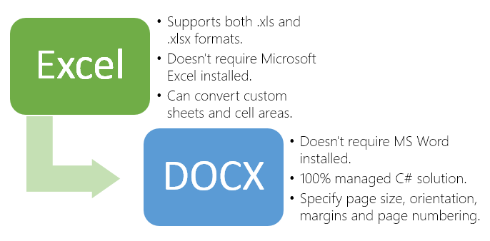

# Convert Excel file to Word file in C# - Step by Step
## Requires
- Visual Studio 2012
## License
- MS-LPL
## Technologies
- C#
- Silverlight
- ASP.NET
- Win32
- Windows Forms
- Microsoft Azure
- .NET Framework
- .NET Framework 4.0
## Topics
- Controls
- C#
- ASP.NET
- User Interface
- Microsoft Azure
- How to
## Updated
- 02/29/2016
## Description

<h1>Introduction</h1>

<em>How to write a function to convert Excel (XLS/XLSX) to DOCX in C# for 15 minutes?</em>

Imagine, that in 15 minutes after reading this text you will be able to provide API for your application to convert Excel tables into Word (DOCX) using C# or VB.Net.

During the conversion process you may: select custom sheets and area of cells for conversion, specify page properties, add page numbers.

<em> 
</em>

<h1>Main Functions</h1>

<h1>How to do it:</h1>

<em>So, here we'll show you in details how to convert any Excel files in Word documents using C#.</em>

<em><strong>Very simple example.</strong>&nbsp;For example, we've the Excel file: test.xls (please see in att. file) and we need to create &nbsp;a Word document from&nbsp;test.docx</em>

<em><strong>Step 1</strong>:&nbsp;Launch Visual Studio 2010 (2013). Click File-&gt;New Project-&gt;Visual C# Console Application.</em>

<em>Type the application name and location, for example &quot;xls to docx&quot; and &quot;c:\samples&quot;.</em>

<em><strong>Step 2</strong>:&nbsp;In the Solution Explorer right-click on &quot;References&quot; and select &quot;Add Reference&quot;. Next add a reference to the &quot;SautinSoft.ExceltoPDF.dll&quot;</em><em>.</em>

<em><strong>Step 3</strong>:&nbsp;So, we've created an empty C# console application. Now type the C# code to convert our test.xls into test.docx</em>

<em><strong>Step 4</strong>: Please insert c# code in your console application.&nbsp;Now build the application and launch it.</em>

<em><strong>Well done!&nbsp;</strong>Our congratulations, with help of the Excel to PDF.Net library we've created a Word document.</em>

C#

Edit|Remove

csharp

<pre class="csharp">using&nbsp;System;&nbsp;
using&nbsp;<a class="libraryLink" href="https://msdn.microsoft.com/en-US/library/System.IO.aspx" target="_blank" title="Auto generated link to System.IO">System.IO</a>;&nbsp;
using&nbsp;SautinSoft;&nbsp;
&nbsp;
namespace&nbsp;Sample&nbsp;
{&nbsp;
&nbsp;&nbsp;&nbsp;&nbsp;class&nbsp;Sample&nbsp;
&nbsp;&nbsp;&nbsp;&nbsp;{&nbsp;
&nbsp;&nbsp;&nbsp;&nbsp;&nbsp;&nbsp;&nbsp;&nbsp;static&nbsp;void&nbsp;Main(string[]&nbsp;args)&nbsp;
&nbsp;&nbsp;&nbsp;&nbsp;&nbsp;&nbsp;&nbsp;&nbsp;{&nbsp;
&nbsp;&nbsp;&nbsp;&nbsp;&nbsp;&nbsp;&nbsp;&nbsp;&nbsp;&nbsp;&nbsp;&nbsp;//&nbsp;Convert&nbsp;Excel&nbsp;file&nbsp;to&nbsp;DOCX&nbsp;file&nbsp;
&nbsp;&nbsp;&nbsp;&nbsp;&nbsp;&nbsp;&nbsp;&nbsp;&nbsp;&nbsp;&nbsp;&nbsp;ExcelToPdf&nbsp;x&nbsp;=&nbsp;new&nbsp;ExcelToPdf();&nbsp;
&nbsp;&nbsp;&nbsp;&nbsp;&nbsp;&nbsp;&nbsp;&nbsp;&nbsp;&nbsp;&nbsp;&nbsp;//&nbsp;You&nbsp;may&nbsp;download&nbsp;the&nbsp;latest&nbsp;version&nbsp;of&nbsp;SDK&nbsp;here:&nbsp;&nbsp;
&nbsp;&nbsp;&nbsp;&nbsp;&nbsp;&nbsp;&nbsp;&nbsp;&nbsp;&nbsp;&nbsp;&nbsp;//&nbsp;www.sautinsoft.com/convert-excel-xls-to-pdf/free-download-spreadsheet-xls-excel-to-pdf-component.php&nbsp;
&nbsp;&nbsp;&nbsp;&nbsp;&nbsp;&nbsp;&nbsp;&nbsp;&nbsp;&nbsp;&nbsp;&nbsp;&nbsp;
&nbsp;&nbsp;&nbsp;&nbsp;&nbsp;&nbsp;&nbsp;&nbsp;&nbsp;&nbsp;&nbsp;&nbsp;//&nbsp;Set&nbsp;DOCX&nbsp;as&nbsp;output&nbsp;format.&nbsp;
&nbsp;&nbsp;&nbsp;&nbsp;&nbsp;&nbsp;&nbsp;&nbsp;&nbsp;&nbsp;&nbsp;&nbsp;x.OutputFormat&nbsp;=&nbsp;SautinSoft.ExcelToPdf.eOutputFormat.Docx;&nbsp;
&nbsp;
&nbsp;&nbsp;&nbsp;&nbsp;&nbsp;&nbsp;&nbsp;&nbsp;&nbsp;&nbsp;&nbsp;&nbsp;string&nbsp;excelFile&nbsp;=&nbsp;Path.GetFullPath(@&quot;d:\Download\test.xls&quot;);&nbsp;
&nbsp;&nbsp;&nbsp;&nbsp;&nbsp;&nbsp;&nbsp;&nbsp;&nbsp;&nbsp;&nbsp;&nbsp;string&nbsp;docxFile&nbsp;=&nbsp;Path.ChangeExtension(excelFile,&nbsp;&quot;.docx&quot;);&nbsp;;&nbsp;
&nbsp;
&nbsp;&nbsp;&nbsp;&nbsp;&nbsp;&nbsp;&nbsp;&nbsp;&nbsp;&nbsp;&nbsp;&nbsp;try&nbsp;
&nbsp;&nbsp;&nbsp;&nbsp;&nbsp;&nbsp;&nbsp;&nbsp;&nbsp;&nbsp;&nbsp;&nbsp;{&nbsp;
&nbsp;&nbsp;&nbsp;&nbsp;&nbsp;&nbsp;&nbsp;&nbsp;&nbsp;&nbsp;&nbsp;&nbsp;&nbsp;&nbsp;&nbsp;&nbsp;x.ConvertFile(excelFile,&nbsp;docxFile);&nbsp;
&nbsp;&nbsp;&nbsp;&nbsp;&nbsp;&nbsp;&nbsp;&nbsp;&nbsp;&nbsp;&nbsp;&nbsp;&nbsp;&nbsp;&nbsp;&nbsp;<a class="libraryLink" href="https://msdn.microsoft.com/en-US/library/System.Diagnostics.Process.Start.aspx" target="_blank" title="Auto generated link to System.Diagnostics.Process.Start">System.Diagnostics.Process.Start</a>(docxFile);&nbsp;
&nbsp;&nbsp;&nbsp;&nbsp;&nbsp;&nbsp;&nbsp;&nbsp;&nbsp;&nbsp;&nbsp;&nbsp;}&nbsp;
&nbsp;&nbsp;&nbsp;&nbsp;&nbsp;&nbsp;&nbsp;&nbsp;&nbsp;&nbsp;&nbsp;&nbsp;catch&nbsp;(Exception&nbsp;ex)&nbsp;
&nbsp;&nbsp;&nbsp;&nbsp;&nbsp;&nbsp;&nbsp;&nbsp;&nbsp;&nbsp;&nbsp;&nbsp;{&nbsp;
&nbsp;&nbsp;&nbsp;&nbsp;&nbsp;&nbsp;&nbsp;&nbsp;&nbsp;&nbsp;&nbsp;&nbsp;&nbsp;&nbsp;&nbsp;&nbsp;Console.WriteLine(ex.Message);&nbsp;
&nbsp;&nbsp;&nbsp;&nbsp;&nbsp;&nbsp;&nbsp;&nbsp;&nbsp;&nbsp;&nbsp;&nbsp;&nbsp;&nbsp;&nbsp;&nbsp;Console.ReadLine();&nbsp;
&nbsp;&nbsp;&nbsp;&nbsp;&nbsp;&nbsp;&nbsp;&nbsp;&nbsp;&nbsp;&nbsp;&nbsp;}&nbsp;
&nbsp;
&nbsp;&nbsp;&nbsp;&nbsp;&nbsp;&nbsp;&nbsp;&nbsp;}&nbsp;
&nbsp;&nbsp;&nbsp;&nbsp;}&nbsp;
}&nbsp;
</pre>

<h1></h1>
<h1>Source Code Files</h1>

<em>Related Links:</em>

<em> 
Website:&nbsp;<a href="http://www.sautinsoft.com/">www.sautinsoft.com</a> 
Product Home: <a href="http://sautinsoft.com/convert-excel-xls-to-pdf/spreadsheet-xls-excel-to-pdf-export-component-asp.net.php">
Excel to PDF.Net</a> 
Download:&nbsp;<a href="http://sautinsoft.com/thankyou.php?download=exceltopdf_net.zip">Excel to PDF.Net</a> 
</em>

<h2 class="H2Text">Requrements and Technical Information</h2>

<em>Requires only .Net 2.0 or above. Our product is compatible with all .Net languages and supports all Operating Systems where .Net Framework can be used. Note that Excel to PDF.Net is entirely written in managed C#, which makes it
 absolutely standalone and an independent library</em>

