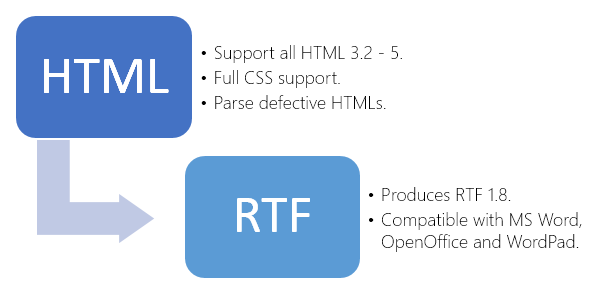

# Convert HTML file to RTF file in C# - Step by Step
## Requires
- Visual Studio 2012
## License
- MS-LPL
## Technologies
- C#
- Silverlight
- ASP.NET
- Windows Forms
- WPF
- Microsoft Azure
## Topics
- Controls
- C#
- Windows Forms
- Microsoft Azure
- Web Services
- HTML
- .NET 4
- How to
## Updated
- 01/22/2016
## Description

<h1>Introduction</h1>

<em>This is a demonstration sample for converting HTML files to RTF files with SautinSoft.HTMLtoRTF Free library. The sample shows how
<em><em>to provide API for your application to convert HTML page into RTF document, using C# or VB.Net.</em></em></em>

<em>Now you can operate with HtmlToRtf class which provides you by various methods and properties to convert HTML as MemoryStream, String, Files, URI and so forth.</em>

<h1>Main Functions</h1>

<h1>How to do it:</h1>

<em>So, here we'll show you in details how to convert any HTML files in RTF documents using C#.</em>

<em><strong>Very simple example.</strong>&nbsp;For example, we've the HTML file: utf-8.html (please see in att. file) and we need to create &nbsp;a RTF document from&nbsp;utf-8.html</em>

<em><strong>Step 1</strong>:&nbsp;Launch Visual Studio 2010 (2013). Click File-&gt;New Project-&gt;Visual C# Console Application.</em>

<em>Type the application name and location, for example &quot;rtf to pdf&quot; and &quot;c:\samples&quot;.</em>

<em><strong>Step 2</strong>:&nbsp;In the Solution Explorer right-click on &quot;References&quot; and select &quot;Add Reference&quot;. Next add a reference to the &quot;SautinSoft.HtmlToRtf.dll&quot;</em><em>.</em>

<em><strong>Step 3</strong>:&nbsp;So, we've created an empty C# console application. Now type the C# code to convert our utf-8.html into utf-8.pdf</em>

<em><strong>Step 4</strong>: Please insert c# code in your console application.&nbsp;Now build the application and launch it.</em>

<em><strong>Well done!&nbsp;</strong>Our congratulations, with help of the HTMltoRTF.Net library we've created a RTF document.</em>

&nbsp;

&nbsp;

C#

Edit|Remove

csharp
<pre class="hidden">using System;
using System.IO;
using SautinSoft;

namespace Sample
{
    class Test
    {

        static void Main(string[] args)
        {
           	
            SautinSoft.HtmlToRtf h = new SautinSoft.HtmlToRtf();
            // You may download the latest version of SDK here: 
            // http://sautinsoft.com/products/html-to-rtf/download.php 

            string htmlFile = Path.Combine(@&quot;d:\utf-8.html&quot;);
            string rtfFile = Path.ChangeExtension(htmlFile, &quot;.rtf&quot;);

            // Convert HTML to RTF
            int res = h.ConvertFile(htmlFile, rtfFile);

            if (res == 0)
            {
                Console.WriteLine(&quot;Converted successfully!&quot;);
                System.Diagnostics.Process.Start(rtfFile);
            }
            else
            {
                Console.WriteLine(&quot;Converting failed!&quot;);
                Console.ReadLine();
            }
        }
    }
}
</pre>

<pre class="csharp">using&nbsp;System;&nbsp;
using&nbsp;System.IO;&nbsp;
using&nbsp;SautinSoft;&nbsp;
&nbsp;
namespace&nbsp;Sample&nbsp;
{&nbsp;
&nbsp;&nbsp;&nbsp;&nbsp;class&nbsp;Test&nbsp;
&nbsp;&nbsp;&nbsp;&nbsp;{&nbsp;
&nbsp;
&nbsp;&nbsp;&nbsp;&nbsp;&nbsp;&nbsp;&nbsp;&nbsp;static&nbsp;void&nbsp;Main(string[]&nbsp;args)&nbsp;
&nbsp;&nbsp;&nbsp;&nbsp;&nbsp;&nbsp;&nbsp;&nbsp;{&nbsp;
&nbsp;&nbsp;&nbsp;&nbsp;&nbsp;&nbsp;&nbsp;&nbsp;&nbsp;&nbsp;&nbsp;&nbsp;&nbsp;&nbsp;&nbsp;&nbsp;
&nbsp;&nbsp;&nbsp;&nbsp;&nbsp;&nbsp;&nbsp;&nbsp;&nbsp;&nbsp;&nbsp;&nbsp;SautinSoft.HtmlToRtf&nbsp;h&nbsp;=&nbsp;new&nbsp;SautinSoft.HtmlToRtf();&nbsp;
&nbsp;&nbsp;&nbsp;&nbsp;&nbsp;&nbsp;&nbsp;&nbsp;&nbsp;&nbsp;&nbsp;&nbsp;//&nbsp;You&nbsp;may&nbsp;download&nbsp;the&nbsp;latest&nbsp;version&nbsp;of&nbsp;SDK&nbsp;here:&nbsp;&nbsp;
&nbsp;&nbsp;&nbsp;&nbsp;&nbsp;&nbsp;&nbsp;&nbsp;&nbsp;&nbsp;&nbsp;&nbsp;//&nbsp;http://sautinsoft.com/products/html-to-rtf/download.php&nbsp;&nbsp;
&nbsp;
&nbsp;&nbsp;&nbsp;&nbsp;&nbsp;&nbsp;&nbsp;&nbsp;&nbsp;&nbsp;&nbsp;&nbsp;string&nbsp;htmlFile&nbsp;=&nbsp;Path.Combine(@&quot;d:\utf-8.html&quot;);&nbsp;
&nbsp;&nbsp;&nbsp;&nbsp;&nbsp;&nbsp;&nbsp;&nbsp;&nbsp;&nbsp;&nbsp;&nbsp;string&nbsp;rtfFile&nbsp;=&nbsp;Path.ChangeExtension(htmlFile,&nbsp;&quot;.rtf&quot;);&nbsp;
&nbsp;
&nbsp;
&nbsp;&nbsp;&nbsp;&nbsp;&nbsp;&nbsp;&nbsp;&nbsp;&nbsp;&nbsp;&nbsp;&nbsp;//&nbsp;Convert&nbsp;HTML&nbsp;to&nbsp;RTF&nbsp;
&nbsp;&nbsp;&nbsp;&nbsp;&nbsp;&nbsp;&nbsp;&nbsp;&nbsp;&nbsp;&nbsp;&nbsp;int&nbsp;res&nbsp;=&nbsp;h.ConvertFile(htmlFile,&nbsp;rtfFile);&nbsp;
&nbsp;
&nbsp;&nbsp;&nbsp;&nbsp;&nbsp;&nbsp;&nbsp;&nbsp;&nbsp;&nbsp;&nbsp;&nbsp;if&nbsp;(res&nbsp;==&nbsp;0)&nbsp;
&nbsp;&nbsp;&nbsp;&nbsp;&nbsp;&nbsp;&nbsp;&nbsp;&nbsp;&nbsp;&nbsp;&nbsp;{&nbsp;
&nbsp;&nbsp;&nbsp;&nbsp;&nbsp;&nbsp;&nbsp;&nbsp;&nbsp;&nbsp;&nbsp;&nbsp;&nbsp;&nbsp;&nbsp;&nbsp;Console.WriteLine(&quot;Converted&nbsp;successfully!&quot;);&nbsp;
&nbsp;&nbsp;&nbsp;&nbsp;&nbsp;&nbsp;&nbsp;&nbsp;&nbsp;&nbsp;&nbsp;&nbsp;&nbsp;&nbsp;&nbsp;&nbsp;System.Diagnostics.Process.Start(rtfFile);&nbsp;
&nbsp;&nbsp;&nbsp;&nbsp;&nbsp;&nbsp;&nbsp;&nbsp;&nbsp;&nbsp;&nbsp;&nbsp;}&nbsp;
&nbsp;&nbsp;&nbsp;&nbsp;&nbsp;&nbsp;&nbsp;&nbsp;&nbsp;&nbsp;&nbsp;&nbsp;else&nbsp;
&nbsp;&nbsp;&nbsp;&nbsp;&nbsp;&nbsp;&nbsp;&nbsp;&nbsp;&nbsp;&nbsp;&nbsp;{&nbsp;
&nbsp;&nbsp;&nbsp;&nbsp;&nbsp;&nbsp;&nbsp;&nbsp;&nbsp;&nbsp;&nbsp;&nbsp;&nbsp;&nbsp;&nbsp;&nbsp;Console.WriteLine(&quot;Converting&nbsp;failed!&quot;);&nbsp;
&nbsp;&nbsp;&nbsp;&nbsp;&nbsp;&nbsp;&nbsp;&nbsp;&nbsp;&nbsp;&nbsp;&nbsp;&nbsp;&nbsp;&nbsp;&nbsp;Console.ReadLine();&nbsp;
&nbsp;&nbsp;&nbsp;&nbsp;&nbsp;&nbsp;&nbsp;&nbsp;&nbsp;&nbsp;&nbsp;&nbsp;}&nbsp;
&nbsp;&nbsp;&nbsp;&nbsp;&nbsp;&nbsp;&nbsp;&nbsp;}&nbsp;
&nbsp;&nbsp;&nbsp;&nbsp;}&nbsp;
}&nbsp;
</pre>

<h1>Source Code Files</h1>

&nbsp;

<em>Related Links:</em>

<em> 
Website:&nbsp;<a href="http://www.sautinsoft.com/">www.sautinsoft.com</a> 
Product Home:&nbsp;<a href="http://sautinsoft.com/products/html-to-rtf/index.php">HTML to RTF.Net</a> 
Download:<a href="http://sautinsoft.com/products/html-to-rtf/download.php">&nbsp;<em>HTML to RTF.Net</em></a></em>

&nbsp;

<h2 class="H2Text">Requrements and Technical Information</h2>

<em>Requires only .Net 2.0 or above. Our product is compatible with all .Net languages and supports all Operating Systems where .Net Framework can be used. Note that HTMLtoRTF.Net is entirely written in managed C#, which makes it absolutely
 standalone and an independent library</em>

