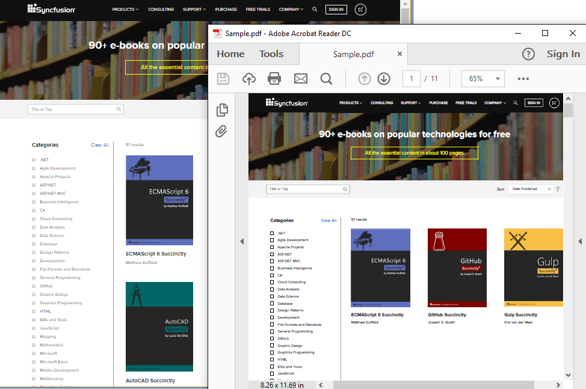

# Convert HTML to PDF in C#/VB.NET and ASP.NET/MVC
## Requires
- Visual Studio 2013
## License
- Apache License, Version 2.0
## Technologies
- C#
- Windows Forms
## Topics
- Conversions
- HTML to PDF
- Html To Pdf Conversion
- HTML to Image
- HTML to SVG
- HTML to MHTML
- URL to PDF
- SVG to PDF
- MHTML to PDF
## Updated
- 11/14/2018
## Description

<h1>Introduction</h1>

Syncfusion Essential PDF supports <a class="preview" title="HTML to PDF .NET" href="https://www.syncfusion.com/pdf-framework/net/html-to-pdf" target="_blank">
HTML to PDF in .NET</a> by using the advanced WebKit rendering engine. This converter can easily be integrated into any application of .NET platform such as WinForms, WPF, MVC and Azure Cloud Service to convert URLs, HTML string, SVG, MHTML to PDF.

<h1>Building the Sample</h1>

The sample showcased here covers most of the important features of HTML to PDF conversion. To deploy the sample, you need to install WebKit HTML converter which is available in the below link.

 
WebKit HTML Converter:<em> <a title="https://www.syncfusion.com/downloads/latest-version" href="https://www.syncfusion.com/downloads/latest-version">https://www.syncfusion.com/downloads/latest-version</a></em>

<em> 
</em>After the installation, the <em>WebKitPath </em>property of an instance of 
WebKitConverterSettings class should be assigned to the QtBinaries directory in the installed location. By default, this will be the installed location.

<em> 
$Systemdrive\Program Files (x86)\Syncfusion\WebKitHTMLConverter\xx.x.x.xx\QtBinaries</em>

<em> 
</em>Alternatively, you can place the QtBinaries folder in the application bin folder which need no reference in the code behind.

 
Products that come under Community license and the eligibility of the Community license can be checked from:
<em><a title="https://www.syncfusion.com/products/communitylicense" href="https://www.syncfusion.com/products/communitylicense">https://www.syncfusion.com/products/communitylicense</a> 
</em>

Description

Essential PDF easily converts HTML to PDF. The converter is very reliable and provides full support for HTML tags, CSS and JavaScript and also for advanced HTML5 features like CSS3, Canvas, SVG, and Web Fonts.

 
Our Essential PDF WebKit rendering is accurate, and the result preserves all the graphics, images, texts, fonts, and layout of the original HTML document/web page.

 
It does not require external dependencies like browsers, printer drivers, and viewers.

 
Documentation is also available at:<em>&nbsp; <a title="https://help.syncfusion.com/file-formats/pdf/working-with-document-conversions#conversion-using-webkit-rendering" href="https://help.syncfusion.com/file-formats/pdf/converting-html-to-pdf#conversion-using-webkit-rendering">
https://help.syncfusion.com/file-formats/pdf/converting-html-to-pdf#conversion-using-webkit-rendering</a> 
</em>

<h2><em>Sample output:</em></h2>

&nbsp;

<h2>HTML to PDF features</h2>

&bull;&nbsp;&nbsp;&nbsp; Converts any webpage to PDF. 
&bull;&nbsp;&nbsp;&nbsp; Converts any raw HTML string to PDF. 
&bull;&nbsp;&nbsp;&nbsp; Prevents text and image split across pages. 
&bull;&nbsp;&nbsp;&nbsp; Converts HTML form to fillable PDF form. 
&bull;&nbsp;&nbsp;&nbsp; Works both in 32-bit and 64-bit environments. 
&bull;&nbsp;&nbsp;&nbsp; Automatically creates Table of Contents. 
&bull;&nbsp;&nbsp;&nbsp; Automatically creates bookmark hierarchy. 
&bull;&nbsp;&nbsp;&nbsp; Converts only a part of the web page to PDF. 
&bull;&nbsp;&nbsp;&nbsp; Supports header and footer. 
&bull;&nbsp;&nbsp;&nbsp; Repeats HTML table header and footer in PDF. 
&bull;&nbsp;&nbsp;&nbsp; Supports HTML5, CSS3, SVG, and Web fonts. 
&bull;&nbsp;&nbsp;&nbsp; Converts any HTML to MHTML. 
&bull;&nbsp;&nbsp;&nbsp; Converts any HTML to SVG. 
&bull;&nbsp;&nbsp;&nbsp; Converts any HTML to image. 
&bull;&nbsp;&nbsp;&nbsp; Supports accessing HTML page using both HTTP POST and GET methods. 
&bull;&nbsp;&nbsp;&nbsp; Supports HTTP cookies. 
&bull;&nbsp;&nbsp;&nbsp; Supports cookies-based form authentication. 
&bull;&nbsp;&nbsp;&nbsp; Thread safe. 
&bull;&nbsp;&nbsp;&nbsp; Supports internal and external hyperlinks. 
&bull;&nbsp;&nbsp;&nbsp; Sets document properties, page settings, security, viewer preferences, etc. 
&bull;&nbsp;&nbsp;&nbsp; Protects PDF document with password and permission.

C#Visual Basic

Edit|Remove

csharpvb

<pre class="csharp">//Initialize&nbsp;HTML&nbsp;converter&nbsp;
HtmlToPdfConverter&nbsp;htmlConverter&nbsp;=&nbsp;new&nbsp;HtmlToPdfConverter(HtmlRenderingEngine.WebKit);&nbsp;
&nbsp;
//WebKit&nbsp;converter&nbsp;settings&nbsp;
WebKitConverterSettings&nbsp;webKitSettings&nbsp;=&nbsp;new&nbsp;WebKitConverterSettings();&nbsp;
&nbsp;
//Assign&nbsp;the&nbsp;WebKit&nbsp;binaries&nbsp;path&nbsp;
//webKitSettings.WebKitPath&nbsp;=&nbsp;@&quot;../../../../QtBinaries&quot;;&nbsp;
&nbsp;
//Assing&nbsp;WebKit&nbsp;settings&nbsp;to&nbsp;converter&nbsp;settings&nbsp;
htmlConverter.ConverterSettings&nbsp;=&nbsp;webKitSettings;&nbsp;
&nbsp;
//Convert&nbsp;url&nbsp;to&nbsp;PDF&nbsp;document.&nbsp;
PdfDocument&nbsp;document&nbsp;=&nbsp;htmlConverter.Convert(&quot;www.google.com&quot;);&nbsp;
&nbsp;
//&nbsp;Save&nbsp;and&nbsp;close&nbsp;the&nbsp;document.&nbsp;
document.Save(&quot;Sample.pdf&quot;);&nbsp;
document.Close(true);&nbsp;
</pre>

<h1>More Information</h1>

For more information, please refer our UG documentation<em> 
<a title="https://help.syncfusion.com/file-formats/pdf/working-with-document-conversions#conversion-using-webkit-rendering" href="https://help.syncfusion.com/file-formats/pdf/converting-html-to-pdf#conversion-using-webkit-rendering">https://help.syncfusion.com/file-formats/pdf/converting-html-to-pdf#conversion-using-webkit-rendering</a> 
</em>

