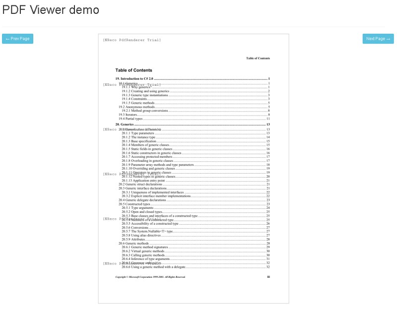

# Convert PDF to image in C# with NReco.PdfRenderer
## Requires
- Visual Studio 2013
## License
- MIT
## Technologies
- C#
- ASP.NET
- ASP.NET MVC
- .NET Framework
- ASP.NET Web Forms
- .NET Framework 4.5
## Topics
- Convert PDF to Image
- PDF to Tiff
- PDF to Png
- PDF rasterizer
- PDF to jpg
- Convert PDF page to Jpeg
## Updated
- 02/23/2017
## Description

PDF is a popular format for books, articles and various reports. In some cases PDF should be rendered to image from C# code, some typical situations:

<ul>
<li>produce preview of PDF documents in ASP.NET application
</li><li>embed PDF viewer into ASP.NET app (possibly with watermaking of PDF rendering result) or .NET desktop application without external dependencies (say, Acrobat Reader or GhostScript).
</li></ul>

<a href="https://www.nrecosite.com/pdf_to_image_renderer_net.aspx">NReco.PdfRenderer</a> provides fast and inexpensive way of rendering PDF to images (png, jpg, tiff) from C# code. It provides simple API and internally uses
 poppler tools (free and open-source PDF rendering library), all necessary binaries are embedded into PdfRenderer assembly and extracted on first use.&nbsp;

<h1>Render PDF to image</h1>

The following C# code snippet illustrates how to render PDF page to image:

C#

Edit|Remove

csharp

<pre class="csharp">var&nbsp;pdfToImg&nbsp;=&nbsp;new&nbsp;NReco.PdfRenderer.PdfToImageConverter();&nbsp;
pdfToImg.GenerateImage(&nbsp;&quot;sample.PDF&quot;,&nbsp;1,&nbsp;&nbsp;
&nbsp;&nbsp;ImageFormat.Jpeg,&nbsp;&quot;Sample1.jpg&quot;&nbsp;);&nbsp;
&nbsp;
Image&nbsp;firstPageImg&nbsp;=&nbsp;pdfToImg.GenerateImage(&quot;sample.PDF&quot;,&nbsp;1);</pre>

It is possible to change rendering DPI (affects image dimensions) by setting &quot;Dpi&quot; or &quot;ScaleTo&quot; properies (in last case DPI will be calculated automatically to match specified width / height limitation).

 

<h1>PDF Viewer Sample</h1>

Sample implements simple ASP.NET PDF viewer: PDF file is located on the server side, but user can view it as images produced by PdfRenderer:

&nbsp;

<ul>
</ul>
<h1>More Information</h1>
<ul>
<li><a href="https://www.nrecosite.com/pdf_to_image_renderer_net.aspx">NReco PdfRenderer website</a> (more examples, online demo)&nbsp;
</li></ul>
