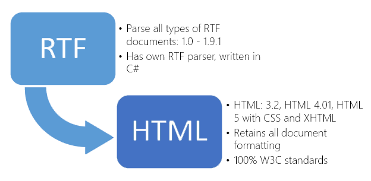

# Convert RTF file to HTML file in C# - Step by Step
## Requires
- Visual Studio 2012
## License
- MS-LPL
## Technologies
- C#
- Silverlight
- ASP.NET
- .NET
- Windows Forms
- Microsoft Azure
- .NET Framework 4.0
- HTML5
- Visual C#
## Topics
- Controls
- C#
- ASP.NET
- Azure
- Windows Forms
- Microsoft Azure
- Web Services
- HTML5
- .NET 4
- How to
## Updated
- 01/27/2016
## Description

<h1>Introduction</h1>

<em>This is a demonstration sample for converting RTF files to HTML files with SautinSoft.RTFtoHTML Free library. The sample shows how<em><em>to provide API for your application to convert RTF document into HTML page, using C# or VB.Net.</em></em></em>

<em>Now you can operate with RtfToHTML class which provides you by various methods and properties to convert RTF as MemoryStream, String, Files and so forth.</em>

<h1>Main Functions</h1>

<h1>How to do it:</h1>

<em>So, here we'll show you in details how to convert any RTF files in HTML documents using C#.</em>

<em><strong>Very simple example.</strong>&nbsp;For example, we've the RTF file: test.rtf (please see in att. file) and we need to create &nbsp;a HTML document from test.rtf</em>

<em><strong>Step 1</strong>:&nbsp;Launch Visual Studio 2010 (2013). Click File-&gt;New Project-&gt;Visual C# Console Application.</em>

<em>Type the application name and location, for example &quot;rtf to html&quot; and &quot;c:\samples&quot;.</em>

<em><strong>Step 2</strong>:&nbsp;In the Solution Explorer right-click on &quot;References&quot; and select &quot;Add Reference&quot;. Next add a reference to the &quot;SautinSoft.RtfToHTML.dll&quot;</em><em>.</em>

<em><strong>Step 3</strong>:&nbsp;So, we've created an empty C# console application. Now type the C# code to convert our test.rtf into test.html</em>

<em><strong>Step 4</strong>: Please insert c# code in your console application.&nbsp;Now build the application and launch it.</em>

<em><strong>Well done!&nbsp;</strong>Our congratulations, with help of the RTFtoHTML.Net library we've created a HTML document.</em>

&nbsp;

C#

Edit|Remove

csharp

<pre class="csharp">using&nbsp;System;&nbsp;
using&nbsp;<a class="libraryLink" href="https://msdn.microsoft.com/en-US/library/System.IO.aspx" target="_blank" title="Auto generated link to System.IO">System.IO</a>;&nbsp;
using&nbsp;<a class="libraryLink" href="https://msdn.microsoft.com/en-US/library/System.Text.aspx" target="_blank" title="Auto generated link to System.Text">System.Text</a>;&nbsp;
using&nbsp;SautinSoft;&nbsp;
&nbsp;
namespace&nbsp;SampleConvert&nbsp;
{&nbsp;
&nbsp;&nbsp;&nbsp;&nbsp;class&nbsp;sample&nbsp;
&nbsp;&nbsp;&nbsp;&nbsp;{&nbsp;
&nbsp;&nbsp;&nbsp;&nbsp;&nbsp;&nbsp;&nbsp;&nbsp;static&nbsp;void&nbsp;Main(string[]&nbsp;args)&nbsp;
&nbsp;&nbsp;&nbsp;&nbsp;&nbsp;&nbsp;&nbsp;&nbsp;{&nbsp;
&nbsp;&nbsp;&nbsp;&nbsp;&nbsp;&nbsp;&nbsp;&nbsp;&nbsp;&nbsp;&nbsp;&nbsp;SautinSoft.RtfToHtml&nbsp;r&nbsp;=&nbsp;new&nbsp;SautinSoft.RtfToHtml();&nbsp;
&nbsp;&nbsp;&nbsp;&nbsp;&nbsp;&nbsp;&nbsp;&nbsp;&nbsp;&nbsp;&nbsp;&nbsp;string&nbsp;AppPath=<a class="libraryLink" href="https://msdn.microsoft.com/en-US/library/System.Environment.CurrentDirectory.aspx" target="_blank" title="Auto generated link to System.Environment.CurrentDirectory">System.Environment.CurrentDirectory</a>;&nbsp;
&nbsp;
&nbsp;&nbsp;&nbsp;&nbsp;&nbsp;&nbsp;&nbsp;&nbsp;&nbsp;&nbsp;&nbsp;&nbsp;//specify&nbsp;some&nbsp;options&nbsp;
&nbsp;&nbsp;&nbsp;&nbsp;&nbsp;&nbsp;&nbsp;&nbsp;&nbsp;&nbsp;&nbsp;&nbsp;r.OutputFormat&nbsp;=&nbsp;SautinSoft.RtfToHtml.eOutputFormat.HTML_5;&nbsp;
&nbsp;&nbsp;&nbsp;&nbsp;&nbsp;&nbsp;&nbsp;&nbsp;&nbsp;&nbsp;&nbsp;&nbsp;r.Encoding&nbsp;=&nbsp;SautinSoft.RtfToHtml.eEncoding.UTF_8;&nbsp;
&nbsp;
&nbsp;&nbsp;&nbsp;&nbsp;&nbsp;&nbsp;&nbsp;&nbsp;&nbsp;&nbsp;&nbsp;&nbsp;&nbsp;&nbsp;&nbsp;string&nbsp;rtfFile&nbsp;=&nbsp;Path.GetFullPath(@&quot;D:\test.rtf&quot;);&nbsp;
&nbsp;&nbsp;&nbsp;&nbsp;&nbsp;&nbsp;&nbsp;&nbsp;&nbsp;&nbsp;&nbsp;&nbsp;&nbsp;&nbsp;&nbsp;string&nbsp;htmlFile&nbsp;=&nbsp;Path.Combine(AppPath,&quot;test.html&quot;);&nbsp;//the&nbsp;result&nbsp;will&nbsp;be&nbsp;located&nbsp;in&nbsp;the&nbsp;same&nbsp;folder&nbsp;as&nbsp;binary&nbsp;
&nbsp;
&nbsp;&nbsp;&nbsp;&nbsp;&nbsp;&nbsp;&nbsp;&nbsp;&nbsp;&nbsp;&nbsp;&nbsp;int&nbsp;i&nbsp;=&nbsp;r.ConvertFile(rtfFile,htmlFile);&nbsp;
&nbsp;&nbsp;&nbsp;&nbsp;&nbsp;&nbsp;&nbsp;&nbsp;&nbsp;&nbsp;&nbsp;&nbsp;if&nbsp;(i&nbsp;==&nbsp;0)&nbsp;
&nbsp;&nbsp;&nbsp;&nbsp;&nbsp;&nbsp;&nbsp;&nbsp;&nbsp;&nbsp;&nbsp;&nbsp;{&nbsp;
&nbsp;&nbsp;&nbsp;&nbsp;&nbsp;&nbsp;&nbsp;&nbsp;&nbsp;&nbsp;&nbsp;&nbsp;&nbsp;&nbsp;&nbsp;&nbsp;<a class="libraryLink" href="https://msdn.microsoft.com/en-US/library/System.Console.WriteLine.aspx" target="_blank" title="Auto generated link to System.Console.WriteLine">System.Console.WriteLine</a>(&quot;Converted&nbsp;successfully!&quot;);&nbsp;
&nbsp;&nbsp;&nbsp;&nbsp;&nbsp;&nbsp;&nbsp;&nbsp;&nbsp;&nbsp;&nbsp;&nbsp;&nbsp;&nbsp;&nbsp;&nbsp;<a class="libraryLink" href="https://msdn.microsoft.com/en-US/library/System.Diagnostics.Process.Start.aspx" target="_blank" title="Auto generated link to System.Diagnostics.Process.Start">System.Diagnostics.Process.Start</a>(htmlFile);&nbsp;
&nbsp;&nbsp;&nbsp;&nbsp;&nbsp;&nbsp;&nbsp;&nbsp;&nbsp;&nbsp;&nbsp;&nbsp;}&nbsp;
&nbsp;&nbsp;&nbsp;&nbsp;&nbsp;&nbsp;&nbsp;&nbsp;&nbsp;&nbsp;&nbsp;&nbsp;else&nbsp;
&nbsp;&nbsp;&nbsp;&nbsp;&nbsp;&nbsp;&nbsp;&nbsp;&nbsp;&nbsp;&nbsp;&nbsp;{&nbsp;
&nbsp;&nbsp;&nbsp;&nbsp;&nbsp;&nbsp;&nbsp;&nbsp;&nbsp;&nbsp;&nbsp;&nbsp;&nbsp;&nbsp;&nbsp;&nbsp;<a class="libraryLink" href="https://msdn.microsoft.com/en-US/library/System.Console.WriteLine.aspx" target="_blank" title="Auto generated link to System.Console.WriteLine">System.Console.WriteLine</a>(&quot;Conversion&nbsp;failed!&quot;);&nbsp;
&nbsp;&nbsp;&nbsp;&nbsp;&nbsp;&nbsp;&nbsp;&nbsp;&nbsp;&nbsp;&nbsp;&nbsp;&nbsp;&nbsp;&nbsp;&nbsp;Console.ReadLine();&nbsp;
&nbsp;&nbsp;&nbsp;&nbsp;&nbsp;&nbsp;&nbsp;&nbsp;&nbsp;&nbsp;&nbsp;&nbsp;}&nbsp;
&nbsp;&nbsp;&nbsp;&nbsp;&nbsp;&nbsp;&nbsp;&nbsp;}&nbsp;
&nbsp;&nbsp;&nbsp;&nbsp;}&nbsp;
}</pre>

<h1>Source Code Files</h1>

&nbsp;<em>Related Links:</em>

<em> 
Website:&nbsp;<a href="http://sautinsoft.com/">www.sautinsoft.com</a> 
Product Home:&nbsp;<a href="http://sautinsoft.com/convert-rtf-to-html/rtf-to-html-component-asp.net.php">RTF to HTML.Net</a> 
Download:&nbsp;<a href="http://sautinsoft.com/convert-rtf-to-html/download.php"><em>RTF to HTML.Net</em></a></em>

&nbsp;

<h2 class="H2Text">Requrements and Technical Information</h2>

<em>Requires only .Net 2.0 or above. Our product is compatible with all .Net languages and supports all Operating Systems where .Net Framework can be used. Note that RTFtoHTML.Net is entirely written in managed C#, which makes it absolutely
 standalone and an independent library</em>

