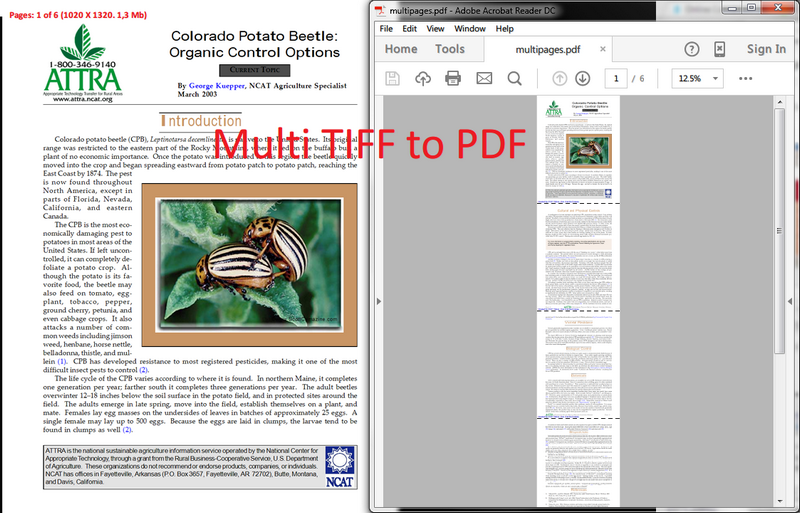

# Convert multipage TIFF file to PDF file in C# - Step by Step
## Requires
- Visual Studio 2012
## License
- MS-LPL
## Technologies
- C#
- Silverlight
- ASP.NET
- Win32
- Windows Forms
- Microsoft Azure
- .NET Framework
- .NET Framework 4.0
- Graphics Functions
## Topics
- Controls
- Graphics
- C#
- ASP.NET
- User Interface
- Graphics and 3D
- Microsoft Azure
- Image
- How to
- BitmapImage
## Updated
- 02/04/2016
## Description

<h1>Introduction</h1>

<em>This is a C# example to convert multiTIFF file to PDF via a free C# PDF library.</em>

<em>If you are searching for a solution to convert multipages Tiff images into PDF-format in C#, stop the searching - you're in the right place! The PDF Vison .Net is only the one library designed for this purpose.</em>

<em>Only the .Net platform and nothing else, 32 and 64-bit support, Full Trust level, converting of all types of Images, works under Windows, Mac, Linux and a lot of other nuances</em><em>.</em>

<h1>Main Functions</h1>

<h1>How to do it:</h1>

<em>So, here we'll show you in details how to convert a multi Tiff images to PDF in C#.</em>

<em><strong>Very simple example.</strong>&nbsp;For example, we've the tiff file: multipages.tiff (please see in att. file) and we need to create an PDF document.</em>

<em><strong>Step 1</strong>:&nbsp;Launch Visual Studio 2010 (2013). Click File-&gt;New Project-&gt;Visual C# Console Application.</em>

<em>Type the application name and location, for example &quot;multi tiff to pdf&quot; and &quot;c:\samples&quot;.</em>

<em><strong>Step 2</strong>:&nbsp;In the Solution Explorer right-click on &quot;References&quot; and select &quot;Add Reference&quot;. Next add a reference to the &quot;SautinSoft.PdfVison.dll&quot;</em><em>.</em>

<em><strong>Step 3</strong>:&nbsp;So, we've created an empty C# console application. Now type the C# code to convert our&nbsp;</em><em style="font-size:13.008px">multipages.tiff&nbsp;</em><em>image into&nbsp;</em><em style="font-size:13.008px">multipages.</em><em>pdf.</em>

<em><strong>Step 4</strong>: Please insert c# code in your console application.&nbsp;Now build the application and launch it.</em>

<em style="font-family:'Segoe UI','Lucida Grande',Verdana,Arial,Helvetica,sans-serif; font-size:13.008px"><strong>Well done!&nbsp;</strong>Our congratulations, with help of the PDF Visoin.Net library we've created an PDF file.</em><em>&nbsp;&nbsp;</em>

&nbsp;

C#

Edit|Remove

csharp
<pre class="hidden">using System;
using System.IO;
using SautinSoft;

namespace Sample
{
    class Test
    {

        static void Main(string[] args)
        {

            //Convert multipage TIFF file to PDF file
            SautinSoft.PdfVision v = new SautinSoft.PdfVision();
            // You may download the latest version of SDK here:   
            // www.sautinsoft.com/products/convert-html-pdf-and-tiff-pdf-asp.net/download.php 

            //specify converting options
            v.PageStyle.PageSize.Auto();
             
            string tiffPath = Path.GetFullPath(@&quot;d:\Tempos\multipages.tiff&quot;);
            string pdfPath = Path.ChangeExtension(tiffPath, &quot;.pdf&quot;);

            //Convert image file to pdf
            int ret = v.ConvertImageFileToPDFFile(tiffPath, pdfPath);

            if (ret == 0)
            {
                //Show produced PDF in Acrobat Reader
                System.Diagnostics.Process.Start(pdfPath);
            }
        }
    }
}
</pre>

<pre class="csharp">using&nbsp;System;&nbsp;
using&nbsp;System.IO;&nbsp;
using&nbsp;SautinSoft;&nbsp;
&nbsp;
namespace&nbsp;Sample&nbsp;
{&nbsp;
&nbsp;&nbsp;&nbsp;&nbsp;class&nbsp;Test&nbsp;
&nbsp;&nbsp;&nbsp;&nbsp;{&nbsp;
&nbsp;
&nbsp;&nbsp;&nbsp;&nbsp;&nbsp;&nbsp;&nbsp;&nbsp;static&nbsp;void&nbsp;Main(string[]&nbsp;args)&nbsp;
&nbsp;&nbsp;&nbsp;&nbsp;&nbsp;&nbsp;&nbsp;&nbsp;{&nbsp;
&nbsp;
&nbsp;&nbsp;&nbsp;&nbsp;&nbsp;&nbsp;&nbsp;&nbsp;&nbsp;&nbsp;&nbsp;&nbsp;//Convert&nbsp;multipage&nbsp;TIFF&nbsp;file&nbsp;to&nbsp;PDF&nbsp;file&nbsp;
&nbsp;&nbsp;&nbsp;&nbsp;&nbsp;&nbsp;&nbsp;&nbsp;&nbsp;&nbsp;&nbsp;&nbsp;SautinSoft.PdfVision&nbsp;v&nbsp;=&nbsp;new&nbsp;SautinSoft.PdfVision();&nbsp;
&nbsp;&nbsp;&nbsp;&nbsp;&nbsp;&nbsp;&nbsp;&nbsp;&nbsp;&nbsp;&nbsp;&nbsp;//&nbsp;You&nbsp;may&nbsp;download&nbsp;the&nbsp;latest&nbsp;version&nbsp;of&nbsp;SDK&nbsp;here:&nbsp;&nbsp;&nbsp;&nbsp;
&nbsp;&nbsp;&nbsp;&nbsp;&nbsp;&nbsp;&nbsp;&nbsp;&nbsp;&nbsp;&nbsp;&nbsp;//&nbsp;www.sautinsoft.com/products/convert-html-pdf-and-tiff-pdf-asp.net/download.php&nbsp;&nbsp;
&nbsp;
&nbsp;&nbsp;&nbsp;&nbsp;&nbsp;&nbsp;&nbsp;&nbsp;&nbsp;&nbsp;&nbsp;&nbsp;//specify&nbsp;converting&nbsp;options&nbsp;
&nbsp;&nbsp;&nbsp;&nbsp;&nbsp;&nbsp;&nbsp;&nbsp;&nbsp;&nbsp;&nbsp;&nbsp;v.PageStyle.PageSize.Auto();&nbsp;
&nbsp;&nbsp;&nbsp;&nbsp;&nbsp;&nbsp;&nbsp;&nbsp;&nbsp;&nbsp;&nbsp;&nbsp;&nbsp;&nbsp;
&nbsp;&nbsp;&nbsp;&nbsp;&nbsp;&nbsp;&nbsp;&nbsp;&nbsp;&nbsp;&nbsp;&nbsp;string&nbsp;tiffPath&nbsp;=&nbsp;Path.GetFullPath(@&quot;d:\Tempos\multipages.tiff&quot;);&nbsp;
&nbsp;&nbsp;&nbsp;&nbsp;&nbsp;&nbsp;&nbsp;&nbsp;&nbsp;&nbsp;&nbsp;&nbsp;string&nbsp;pdfPath&nbsp;=&nbsp;Path.ChangeExtension(tiffPath,&nbsp;&quot;.pdf&quot;);&nbsp;
&nbsp;
&nbsp;&nbsp;&nbsp;&nbsp;&nbsp;&nbsp;&nbsp;&nbsp;&nbsp;&nbsp;&nbsp;&nbsp;//Convert&nbsp;image&nbsp;file&nbsp;to&nbsp;pdf&nbsp;
&nbsp;&nbsp;&nbsp;&nbsp;&nbsp;&nbsp;&nbsp;&nbsp;&nbsp;&nbsp;&nbsp;&nbsp;int&nbsp;ret&nbsp;=&nbsp;v.ConvertImageFileToPDFFile(tiffPath,&nbsp;pdfPath);&nbsp;
&nbsp;
&nbsp;&nbsp;&nbsp;&nbsp;&nbsp;&nbsp;&nbsp;&nbsp;&nbsp;&nbsp;&nbsp;&nbsp;if&nbsp;(ret&nbsp;==&nbsp;0)&nbsp;
&nbsp;&nbsp;&nbsp;&nbsp;&nbsp;&nbsp;&nbsp;&nbsp;&nbsp;&nbsp;&nbsp;&nbsp;{&nbsp;
&nbsp;&nbsp;&nbsp;&nbsp;&nbsp;&nbsp;&nbsp;&nbsp;&nbsp;&nbsp;&nbsp;&nbsp;&nbsp;&nbsp;&nbsp;&nbsp;//Show&nbsp;produced&nbsp;PDF&nbsp;in&nbsp;Acrobat&nbsp;Reader&nbsp;
&nbsp;&nbsp;&nbsp;&nbsp;&nbsp;&nbsp;&nbsp;&nbsp;&nbsp;&nbsp;&nbsp;&nbsp;&nbsp;&nbsp;&nbsp;&nbsp;System.Diagnostics.Process.Start(pdfPath);&nbsp;
&nbsp;&nbsp;&nbsp;&nbsp;&nbsp;&nbsp;&nbsp;&nbsp;&nbsp;&nbsp;&nbsp;&nbsp;}&nbsp;
&nbsp;&nbsp;&nbsp;&nbsp;&nbsp;&nbsp;&nbsp;&nbsp;}&nbsp;
&nbsp;&nbsp;&nbsp;&nbsp;}&nbsp;
}&nbsp;
</pre>

<h1 style="color:#3a3e43; font-family:'Segoe UI',Verdana,Arial; font-size:1.4em; margin:0px">
Source Code Files</h1>
<h1>

<em>Related Links:</em>

<em> 
Website:&nbsp;<a href="http://www.sautinsoft.com/" style="color:#960bb4; text-decoration:none">www.sautinsoft.com</a> 
Product Home:&nbsp;<a href="http://sautinsoft.com/products/convert-html-pdf-and-tiff-pdf-asp.net/html-to-pdf-jpeg-tiff-gif-to-pdf-asp.net.php" style="color:#960bb4; text-decoration:none">PDF Vision .NET</a> 
Download:&nbsp;<a href="http://sautinsoft.com/thankyou.php?download=5" style="color:#960bb4; text-decoration:none">PDF Vision .NET</a> 
</em>

</h1>
<h2 class="H2Text" style="color:#3a3e43; font-family:'Segoe UI',Verdana,Arial; font-size:1.2em">
Requrements and Technical Information</h2>
<h1>

<em>Requires only .Net 2.0 or above. Our product is compatible with all .Net languages and supports all Operating Systems where .Net Framework can be used. Note that PDF Vision.Net is entirely written in managed C#, which makes it absolutely standalone and
 an independent library</em>

</h1>

<h2 class="projectSummary" style="border:0px; font-weight:normal; font-family:'Segoe UI Semibold','Lucida Grande',Verdana,Arial,Helvetica,sans-serif; margin:4px 0px 11px; outline:0px; padding:0px; clear:both; color:#2a2a2a; line-height:1.4; font-size:1.1em; word-wrap:break-word">
This is a C# example to convert Jpeg file to PDF via a free C# PDF library.If you are searching for a solution to convert Jpeg images into PDF-format in C#, stop the searching - you're in the right place!</h2>

