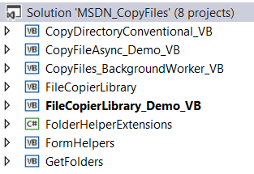

# Copy files while keeping your application responsive
## Requires
- Visual Studio 2013
## License
- Apache License, Version 2.0
## Technologies
- Asynchronous Programming
- File System
## Topics
- Files
- Copying files
## Updated
- 10/21/2014
## Description

<h1>Description</h1>

This article contains several examples for copying files in one folder to another folder while showing progress. Starting simple we have IO.File.Copy by itself used on a very large file or a folder that contain many large files
 can freeze up the application doing the copying of files. So the simplest method is to take a synchronous code and use Await Task.Delay and display the progress in a label or perhaps a ProgressBar. This will work but the Await Task.Delay will slow the process
 down. The next method would be to wrap the operation within a BackGroundWorker class or use asynchronous methods Visual Studio has starting with Framework 4.5. I did examples for both and the code is pretty much the same yet I feel the asynchronous methods
 are really easier to implement overall.

 
Even though the solution was done in VS2013 with Framework 4.5 the BackgroundWorker is completely valid to use with earlier versions of Visual Studio. So you can pick which one fits you. 
 
Please note that each project shows progress different ways from only labels to a splash style form with a progress bar. Pick one method and the method to display can change to what suits your project. 
 
Some notes one the solution: Each demo project ends with _VB while the other projects are support projects. There is one C# project which is not needed for the copying of files, it is used to locate a xml file in the solution folder.&nbsp; 
 
<strong>IMPORTANT</strong> to work each demo the first thing that is needed is to edit the xml file in the root of the solution which has a node for the source folder and a node for the destination folder which each of the _VB
 projects use to do the folder/file copies. I suggest creating one like C:\Data for source, place files into it. Now create C:\Data\0Target (these are the folders I used). When you try out each project they will get files from the source folder and copy them
 to the destination folder. 
 
While running the demonstrations move the form around (except for the one using the splash screen) and note that the form is responsive. In the project with the splash screen there is a cancel button which if pressed will cancel
 any farther copying of files. 
 
<strong>IMPORTANT</strong> I avoided doing deep copies as the logic for keeping the app responsive is just the same. 
 
Hopefully these demos will help you with copying files under a folder keeping the form responsive. &nbsp;

 

 

