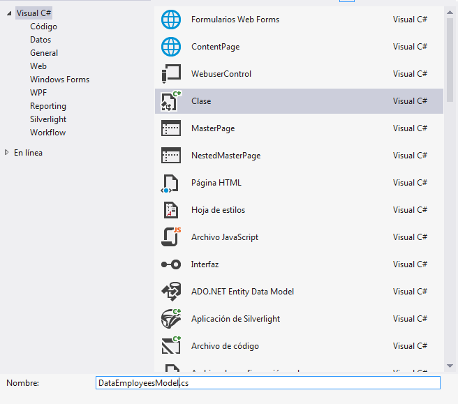
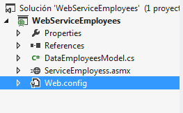
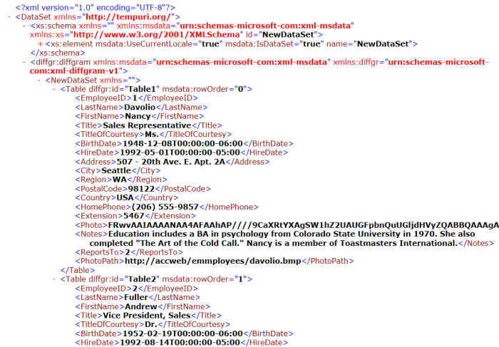

# Creando un servicio web con asmx y Sql Server
## Requires
- Visual Studio 2012
## License
- Apache License, Version 2.0
## Technologies
- C#
- IIS
- XML
- ASMX web services
- C# Language
- ASP.NET 4.5
- Visual Studio 2012
## Topics
- Consuming Web Services
## Updated
- 10/31/2014
## Description

<h1>Introducci&oacute;n</h1>

Esta vez vamos a mostrar informaci&oacute;n de la base de datos de Sql Server en un Web References.

&nbsp;<em>&quot;Desde la versi&oacute;n .NET Framework 1.1 hasta la versi&oacute;n 2.x, para crear aplicaciones SOA, Microsoft ofrece el f
ramework ASMX. Este framework simplifica la creaci&oacute;n tanto de los servicios web como de sus clientes. Los
&nbsp;servicios web creados a trav&eacute;s de esta tecnolog&iacute;a son invocados exclusivamente a trav&eacute;s del protocolo HTTP. Es
&nbsp;por eso que son conocidos como&nbsp;</em><em>Web References.</em>

<em>&nbsp;Al crear un cliente de servicio web utilizando Web Reference, estamos utilizando por debajo la
&nbsp;herramienta&nbsp;Wsdl.exe&nbsp;proporcionada por Microsoft.&quot;</em>

&nbsp;by&nbsp;<a title="Generando clientes de servicios web JAX-WS desde .NET" href="https://eduvitoriatecnicomio.wordpress.com/2013/02/08/generando-clientes-de-servicios-web-jax-ws-desde-net/" target="_blank">eduvitoriatecnicomio</a>

<em> 
</em>

<h1>Construyendo el ejemplo</h1>

Para empezar, como queremos publicar en nuestro IIS local la aplicaci&oacute;n, necesitamos abrir visual studio como administrador.

&nbsp;

Abrimos una aplicaci&oacute;n vac&iacute;a de&nbsp;ASP.NET

&nbsp;

Damos click derecho al proyecto y agregamos un nuevo elemento de tipo Servicio Web

&nbsp;

Y nos va a aparecer el m&eacute;todo hola mundo de prueba el cual, si nosotros queremos, podemos probar.

&nbsp;

C#

Editar script|Remove

csharp
<pre class="hidden">using System;
using System.Collections.Generic;
using System.Linq;
using System.Web;
using System.Web.Services;

namespace WebApplication1
{
    /// &lt;summary&gt;
    /// Descripci&oacute;n breve de WebServiceEmployees
    /// &lt;/summary&gt;
    [WebService(Namespace = &quot;http://tempuri.org/&quot;)]
    [WebServiceBinding(ConformsTo = WsiProfiles.BasicProfile1_1)]
    [System.ComponentModel.ToolboxItem(false)]
    // Para permitir que se llame a este servicio web desde un script, usando ASP.NET AJAX, quite la marca de comentario de la l&iacute;nea siguiente. 
    // [System.Web.Script.Services.ScriptService]
    public class WebServiceEmployees : System.Web.Services.WebService
    {

        [WebMethod]
        public string HelloWorld()
        {
            return &quot;Hola a todos&quot;;
        }
    }
}
</pre>

<pre class="csharp">using&nbsp;System;&nbsp;
using&nbsp;System.Collections.Generic;&nbsp;
using&nbsp;System.Linq;&nbsp;
using&nbsp;System.Web;&nbsp;
using&nbsp;System.Web.Services;&nbsp;
&nbsp;
namespace&nbsp;WebApplication1&nbsp;
{&nbsp;
&nbsp;&nbsp;&nbsp;&nbsp;///&nbsp;&lt;summary&gt;&nbsp;
&nbsp;&nbsp;&nbsp;&nbsp;///&nbsp;Descripci&oacute;n&nbsp;breve&nbsp;de&nbsp;WebServiceEmployees&nbsp;
&nbsp;&nbsp;&nbsp;&nbsp;///&nbsp;&lt;/summary&gt;&nbsp;
&nbsp;&nbsp;&nbsp;&nbsp;[WebService(Namespace&nbsp;=&nbsp;&quot;http://tempuri.org/&quot;)]&nbsp;
&nbsp;&nbsp;&nbsp;&nbsp;[WebServiceBinding(ConformsTo&nbsp;=&nbsp;WsiProfiles.BasicProfile1_1)]&nbsp;
&nbsp;&nbsp;&nbsp;&nbsp;[System.ComponentModel.ToolboxItem(false)]&nbsp;
&nbsp;&nbsp;&nbsp;&nbsp;//&nbsp;Para&nbsp;permitir&nbsp;que&nbsp;se&nbsp;llame&nbsp;a&nbsp;este&nbsp;servicio&nbsp;web&nbsp;desde&nbsp;un&nbsp;script,&nbsp;usando&nbsp;ASP.NET&nbsp;AJAX,&nbsp;quite&nbsp;la&nbsp;marca&nbsp;de&nbsp;comentario&nbsp;de&nbsp;la&nbsp;l&iacute;nea&nbsp;siguiente.&nbsp;&nbsp;
&nbsp;&nbsp;&nbsp;&nbsp;//&nbsp;[System.Web.Script.Services.ScriptService]&nbsp;
&nbsp;&nbsp;&nbsp;&nbsp;public&nbsp;class&nbsp;WebServiceEmployees&nbsp;:&nbsp;System.Web.Services.WebService&nbsp;
&nbsp;&nbsp;&nbsp;&nbsp;{&nbsp;
&nbsp;
&nbsp;&nbsp;&nbsp;&nbsp;&nbsp;&nbsp;&nbsp;&nbsp;[WebMethod]&nbsp;
&nbsp;&nbsp;&nbsp;&nbsp;&nbsp;&nbsp;&nbsp;&nbsp;public&nbsp;string&nbsp;HelloWorld()&nbsp;
&nbsp;&nbsp;&nbsp;&nbsp;&nbsp;&nbsp;&nbsp;&nbsp;{&nbsp;
&nbsp;&nbsp;&nbsp;&nbsp;&nbsp;&nbsp;&nbsp;&nbsp;&nbsp;&nbsp;&nbsp;&nbsp;return&nbsp;&quot;Hola&nbsp;a&nbsp;todos&quot;;&nbsp;
&nbsp;&nbsp;&nbsp;&nbsp;&nbsp;&nbsp;&nbsp;&nbsp;}&nbsp;
&nbsp;&nbsp;&nbsp;&nbsp;}&nbsp;
}&nbsp;
</pre>

&nbsp;

&nbsp;

&nbsp;

Como nos conectaremos a una base de datos, vamos a crear una clase que nos servir&aacute; de modelo para obtener los datos en cuesti&oacute;n.

&nbsp;

Ahora lo que tenemos que hacer es agregar nuestra cadena de conexi&oacute;n de nuestro archivo de configuraci&oacute;n.

&nbsp;

Y agregamos la linea correspondiente para nuestra conexi&oacute;n. Si tenemos duda de como hacerlo aqu&iacute; les dejo un&nbsp;<a title="connectionstrings" href="http://www.connectionstrings.com/store-connection-string-in-webconfig/" target="_blank">link</a>.

&nbsp;

XML

Editar script|Remove

xml
<pre class="hidden">  &lt;connectionStrings&gt;
    &lt;add name=&quot;connectionLocal&quot; 
         connectionString=&quot;server=ISRAEL-PC\SQLEXPRESS;database=Northwind;uid=sa;password=Pa$$w0rd;&quot; /&gt;
  &lt;/connectionStrings&gt;</pre>

<pre class="xml">&nbsp;&nbsp;&lt;connectionStrings&gt;&nbsp;
&nbsp;&nbsp;&nbsp;&nbsp;&lt;add&nbsp;name=&quot;connectionLocal&quot;&nbsp;&nbsp;
&nbsp;&nbsp;&nbsp;&nbsp;&nbsp;&nbsp;&nbsp;&nbsp;&nbsp;connectionString=&quot;server=ISRAEL-PC\SQLEXPRESS;database=Northwind;uid=sa;password=Pa$$w0rd;&quot;&nbsp;/&gt;&nbsp;
&nbsp;&nbsp;&lt;/connectionStrings&gt;</pre>

&nbsp;

&nbsp;

Y el archivo completo nos quedar&iacute;a as&iacute;

&nbsp;

XML

Editar script|Remove

xml
<pre class="hidden">&lt;configuration&gt;
    &lt;system.web&gt;
      &lt;compilation debug=&quot;true&quot; targetFramework=&quot;4.5&quot; /&gt;
      &lt;httpRuntime targetFramework=&quot;4.5&quot; /&gt;
    &lt;/system.web&gt;
  
  &lt;connectionStrings&gt;
    &lt;add name=&quot;connectionLocal&quot; 
         connectionString=&quot;server=ISRAEL-PC\SQLEXPRESS;database=Northwind;uid=sa;password=Pa$$w0rd;&quot; /&gt;
  &lt;/connectionStrings&gt;
  
&lt;/configuration&gt;</pre>

<pre class="xml">&lt;configuration&gt;&nbsp;
&lt;system.web&gt;&nbsp;
&lt;compilationdebug=&quot;true&quot;targetFramework=&quot;4.5&quot;/&gt;&lt;httpRuntimetargetFramework=&quot;4.5&quot;/&gt;&nbsp;
&nbsp;&nbsp;&nbsp;&nbsp;&lt;/system.web&gt;&nbsp;
&nbsp;&nbsp;&nbsp;
&nbsp;&nbsp;&lt;connectionStrings&gt;&nbsp;
&lt;addname=&quot;connectionLocal&quot;connectionString=&quot;server=ISRAEL-PC\SQLEXPRESS;database=Northwind;uid=sa;password=Pa$$w0rd;&quot;/&gt;&lt;/connectionStrings&gt;&lt;/configuration&gt;</pre>

&nbsp;

Ahora es necesario que nuestra clase que nos servir&aacute; como modelo exponga un m&eacute;todo que nos devuelva la consulta en cuesti&oacute;n, que en nuestro caso queremos traer todos los empleados de la tabla de ejemplo de&nbsp;Northwind.

Nota:&nbsp;La clase debe ser publica.

&nbsp;

C#

Editar script|Remove

csharp
<pre class="hidden">public DataSet getEmployees()
        {
            //EL DataSet REPRESENTA UNA MEMORIA CACH&Eacute; DE DATOS EN MEMORIA
            DataSet dataTable = new DataSet();

            //A TRAVEZ DE LA CADENA DE CONEXION DEL WEBCONFIG Y LA OBTENEMOS 
            //CON EL CONFIGURATIONMANAGER
            using (SqlConnection con = new SqlConnection(
                ConfigurationManager.ConnectionStrings[&quot;connectionLocal&quot;]
                .ConnectionString))
            {
                //SE ABRE LA CONEXION
                con.Open();

                //SE UTILIZA PARA LLENAR UN DATASET CON LOS ELEMENTOS NECESARIOS 
                //COMO UNA CONEXION DE BASE DE DATOS
                using (SqlDataAdapter sqlAdapter = new SqlDataAdapter(
                    &quot;SELECT * FROM Employees&quot;, con))
                {
                    //SE LLENA EL DATASET CON LOS DATOS OBTENIDOS EN EL SQLADAPTER
                    sqlAdapter.Fill(dataTable);
                }
            }
            //REGRESAMOS LOS DATOS COMO DATOS EN MEMORIA
            return dataTable;
        }</pre>

<pre class="csharp">public&nbsp;DataSet&nbsp;getEmployees()&nbsp;
&nbsp;&nbsp;&nbsp;&nbsp;&nbsp;&nbsp;&nbsp;&nbsp;{&nbsp;
&nbsp;&nbsp;&nbsp;&nbsp;&nbsp;&nbsp;&nbsp;&nbsp;&nbsp;&nbsp;&nbsp;&nbsp;//EL&nbsp;DataSet&nbsp;REPRESENTA&nbsp;UNA&nbsp;MEMORIA&nbsp;CACH&Eacute;&nbsp;DE&nbsp;DATOS&nbsp;EN&nbsp;MEMORIA&nbsp;
&nbsp;&nbsp;&nbsp;&nbsp;&nbsp;&nbsp;&nbsp;&nbsp;&nbsp;&nbsp;&nbsp;&nbsp;DataSet&nbsp;dataTable&nbsp;=&nbsp;new&nbsp;DataSet();&nbsp;
&nbsp;
&nbsp;&nbsp;&nbsp;&nbsp;&nbsp;&nbsp;&nbsp;&nbsp;&nbsp;&nbsp;&nbsp;&nbsp;//A&nbsp;TRAVEZ&nbsp;DE&nbsp;LA&nbsp;CADENA&nbsp;DE&nbsp;CONEXION&nbsp;DEL&nbsp;WEBCONFIG&nbsp;Y&nbsp;LA&nbsp;OBTENEMOS&nbsp;//CON&nbsp;EL&nbsp;CONFIGURATIONMANAGERusing&nbsp;(SqlConnection&nbsp;con&nbsp;=&nbsp;new&nbsp;SqlConnection(&nbsp;
&nbsp;&nbsp;&nbsp;&nbsp;&nbsp;&nbsp;&nbsp;&nbsp;&nbsp;&nbsp;&nbsp;&nbsp;&nbsp;&nbsp;&nbsp;&nbsp;ConfigurationManager.ConnectionStrings[&quot;connectionLocal&quot;]&nbsp;
&nbsp;&nbsp;&nbsp;&nbsp;&nbsp;&nbsp;&nbsp;&nbsp;&nbsp;&nbsp;&nbsp;&nbsp;&nbsp;&nbsp;&nbsp;&nbsp;.ConnectionString))&nbsp;
&nbsp;&nbsp;&nbsp;&nbsp;&nbsp;&nbsp;&nbsp;&nbsp;&nbsp;&nbsp;&nbsp;&nbsp;{&nbsp;
&nbsp;&nbsp;&nbsp;&nbsp;&nbsp;&nbsp;&nbsp;&nbsp;&nbsp;&nbsp;&nbsp;&nbsp;&nbsp;&nbsp;&nbsp;&nbsp;//SE&nbsp;ABRE&nbsp;LA&nbsp;CONEXION&nbsp;
&nbsp;&nbsp;&nbsp;&nbsp;&nbsp;&nbsp;&nbsp;&nbsp;&nbsp;&nbsp;&nbsp;&nbsp;&nbsp;&nbsp;&nbsp;&nbsp;con.Open();&nbsp;
&nbsp;
&nbsp;&nbsp;&nbsp;&nbsp;&nbsp;&nbsp;&nbsp;&nbsp;&nbsp;&nbsp;&nbsp;&nbsp;&nbsp;&nbsp;&nbsp;&nbsp;//SE&nbsp;UTILIZA&nbsp;PARA&nbsp;LLENAR&nbsp;UN&nbsp;DATASET&nbsp;CON&nbsp;LOS&nbsp;ELEMENTOS&nbsp;NECESARIOS&nbsp;//COMO&nbsp;UNA&nbsp;CONEXION&nbsp;DE&nbsp;BASE&nbsp;DE&nbsp;DATOSusing&nbsp;(SqlDataAdapter&nbsp;sqlAdapter&nbsp;=&nbsp;new&nbsp;SqlDataAdapter(&nbsp;
&nbsp;&nbsp;&nbsp;&nbsp;&nbsp;&nbsp;&nbsp;&nbsp;&nbsp;&nbsp;&nbsp;&nbsp;&nbsp;&nbsp;&nbsp;&nbsp;&nbsp;&nbsp;&nbsp;&nbsp;&quot;SELECT&nbsp;*&nbsp;FROM&nbsp;Employees&quot;,&nbsp;con))&nbsp;
&nbsp;&nbsp;&nbsp;&nbsp;&nbsp;&nbsp;&nbsp;&nbsp;&nbsp;&nbsp;&nbsp;&nbsp;&nbsp;&nbsp;&nbsp;&nbsp;{&nbsp;
&nbsp;&nbsp;&nbsp;&nbsp;&nbsp;&nbsp;&nbsp;&nbsp;&nbsp;&nbsp;&nbsp;&nbsp;&nbsp;&nbsp;&nbsp;&nbsp;&nbsp;&nbsp;&nbsp;&nbsp;//SE&nbsp;LLENA&nbsp;EL&nbsp;DATASET&nbsp;CON&nbsp;LOS&nbsp;DATOS&nbsp;OBTENIDOS&nbsp;EN&nbsp;EL&nbsp;SQLADAPTER&nbsp;
&nbsp;&nbsp;&nbsp;&nbsp;&nbsp;&nbsp;&nbsp;&nbsp;&nbsp;&nbsp;&nbsp;&nbsp;&nbsp;&nbsp;&nbsp;&nbsp;&nbsp;&nbsp;&nbsp;&nbsp;sqlAdapter.Fill(dataTable);&nbsp;
&nbsp;&nbsp;&nbsp;&nbsp;&nbsp;&nbsp;&nbsp;&nbsp;&nbsp;&nbsp;&nbsp;&nbsp;&nbsp;&nbsp;&nbsp;&nbsp;}&nbsp;
&nbsp;&nbsp;&nbsp;&nbsp;&nbsp;&nbsp;&nbsp;&nbsp;&nbsp;&nbsp;&nbsp;&nbsp;}&nbsp;
&nbsp;&nbsp;&nbsp;&nbsp;&nbsp;&nbsp;&nbsp;&nbsp;&nbsp;&nbsp;&nbsp;&nbsp;//REGRESAMOS&nbsp;LOS&nbsp;DATOS&nbsp;COMO&nbsp;DATOS&nbsp;EN&nbsp;MEMORIAreturn&nbsp;dataTable;&nbsp;
&nbsp;&nbsp;&nbsp;&nbsp;&nbsp;&nbsp;&nbsp;&nbsp;}</pre>

Y los usings a agregar ser&iacute;an los siguientes

C#

Editar script|Remove

csharp
<pre class="hidden">using System.Configuration;
using System.Data;
using System.Data.SqlClient;</pre>

<pre class="csharp">using&nbsp;System.Configuration;&nbsp;
using&nbsp;System.Data;&nbsp;
using&nbsp;System.Data.SqlClient;</pre>

 

&nbsp;

Una vez creada la clase correctamente, nos vamos al&nbsp;<em>cs</em>&nbsp;del servicio web. y quitamos el m&eacute;todo de &ldquo;Hola mundo&rdquo; y lo remplazamos por lo siguiente. Si hace falta una referencia la agregamos.

Creamos un nuevo objeto de nuestra clase anterior.&nbsp;Y nos quedar&iacute;a de la siguiente manera, llamando al m&eacute;todo que nos devuelve el&nbsp;<em>dataset&nbsp;</em>con los datos llenos.

&nbsp;

C#

Editar script|Remove

csharp
<pre class="hidden">DataEmployeesModel dataEmployess = new DataEmployeesModel();
        [WebMethod]
        public DataSet getEmployees()
        {
            return dataEmployess.getEmployees();
        }</pre>

<pre class="csharp">DataEmployeesModel&nbsp;dataEmployess&nbsp;=&nbsp;new&nbsp;DataEmployeesModel();&nbsp;
&nbsp;&nbsp;&nbsp;&nbsp;&nbsp;&nbsp;&nbsp;&nbsp;[WebMethod]&nbsp;
&nbsp;&nbsp;&nbsp;&nbsp;&nbsp;&nbsp;&nbsp;&nbsp;public&nbsp;DataSet&nbsp;getEmployees()&nbsp;
&nbsp;&nbsp;&nbsp;&nbsp;&nbsp;&nbsp;&nbsp;&nbsp;{&nbsp;
&nbsp;&nbsp;&nbsp;&nbsp;&nbsp;&nbsp;&nbsp;&nbsp;&nbsp;&nbsp;&nbsp;&nbsp;return&nbsp;dataEmployess.getEmployees();&nbsp;
&nbsp;&nbsp;&nbsp;&nbsp;&nbsp;&nbsp;&nbsp;&nbsp;}</pre>

&nbsp;

Cabe mencionar que para que el&nbsp;<em>dataset</em>&nbsp;se pueda interpretar como datos en xml necesitamos agregar la referencia de&nbsp;<em>Serialization</em>.

C#

Editar script|Remove

csharp
<pre class="hidden">using System.Xml.Serialization;</pre>

<pre class="csharp">using&nbsp;System.Xml.Serialization;</pre>

&nbsp;

Descripci&oacute;n

Ejecutamos.

&nbsp;

Y nos debe salir de la siguiente forma

&nbsp;

Abrimos el m&eacute;todo

&nbsp;

&nbsp;

Y le damos en &ldquo;Invoke&rdquo; y nos debe aparecer esto

&nbsp;

Y para esto ya quedo formado nuestro servicio en asmx.

