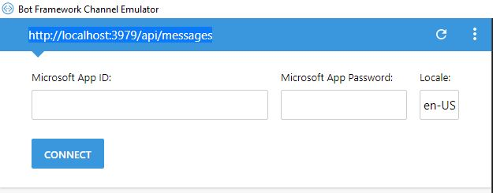

# Create An Intelligent Bot Application Using Microsoft Bot Framework
## Requires
- Visual Studio 2015
## License
- MIT
## Technologies
- C#
- Microsoft Azure
- AI
- Visual Studio 2015
- Microsoft Bot Framework
- Microsoft AI
- Chat App
## Topics
- C#
- Microsoft Azure
- Chat Application
- AI
- Visual Studio 2015
- Microsoft Bot Framework
- Microsoft AI
## Updated
- 01/18/2018
## Description

<h1>Introduction</h1>

In our previous article, we learned how to <a title="Chat Bot with Azure Bot Service" href="https://social.technet.microsoft.com/wiki/contents/articles/51023.chat-bot-with-azure-bot-service.aspx" target="_blank">
Create and Connect a chat bot with Azure Bot Service</a> . In this article, we are going to create an intelligent bot application using Microsoft Bot Framework.

<h1>Microsoft Bot Framework In Visual Studio</h1>

Click on &quot;File -&gt; New -&gt; Project -&gt; Visual C# -&gt; Bot Application&quot;

<strong>Note :</strong> If the Bot Application Template is not present in the Visual Studio 2015 then please go to &quot;Tools -&gt; Extensions and Updates&quot;. Then search and Install the &quot;Bot Application&quot; in our Visual Studio.

<h1>Bot Endpoint</h1>

In the Bot Framework Emulator we can add our localhost or remote server &quot;bot end point&quot;. We can directly connect localhost port number in Bot Framework Emulator. But note that in the actual server endpoint we need to given &quot;Microsoft App ID&quot; and &quot;Microsoft
 App Password&quot;.

<h1>Web.config</h1>

When you are connecting to remote server or anything other than local host then we need to provide the following credentials &quot;BotId&quot; &amp; &quot;MicrosoftAppId&quot; &amp; &quot;MicrosoftAppPassword&quot; in Web.Config and Bot Framework Emulator. This we will get it from
 azure &quot;AppSettings&quot; in our created Web App Bot.

<h1>

XML

Edit|Remove

xml
<pre class="hidden">&lt;configuration&gt;
  &lt;appSettings&gt;
    &lt;!-- update these with your BotId, Microsoft App Id and your Microsoft App Password--&gt;
    &lt;add key=&quot;BotId&quot; value=&quot;YourBotId&quot; /&gt;
    &lt;add key=&quot;MicrosoftAppId&quot; value=&quot;&quot; /&gt;
    &lt;add key=&quot;MicrosoftAppPassword&quot; value=&quot;&quot; /&gt;
  &lt;/appSettings&gt;
&lt;/configuration&gt;</pre>

<pre class="js">&lt;configuration&gt;&nbsp;
&nbsp;&nbsp;&lt;appSettings&gt;&nbsp;
&nbsp;&nbsp;&nbsp;&nbsp;&lt;!--&nbsp;update&nbsp;these&nbsp;with&nbsp;your&nbsp;BotId,&nbsp;Microsoft&nbsp;App&nbsp;Id&nbsp;and&nbsp;your&nbsp;Microsoft&nbsp;App&nbsp;Password--&gt;&nbsp;
&nbsp;&nbsp;&nbsp;&nbsp;&lt;add&nbsp;key=&quot;BotId&quot;&nbsp;value=&quot;YourBotId&quot;&nbsp;/&gt;&nbsp;
&nbsp;&nbsp;&nbsp;&nbsp;&lt;add&nbsp;key=&quot;MicrosoftAppId&quot;&nbsp;value=&quot;&quot;&nbsp;/&gt;&nbsp;
&nbsp;&nbsp;&nbsp;&nbsp;&lt;add&nbsp;key=&quot;MicrosoftAppPassword&quot;&nbsp;value=&quot;&quot;&nbsp;/&gt;&nbsp;
&nbsp;&nbsp;&lt;/appSettings&gt;&nbsp;
&lt;/configuration&gt;</pre>

</h1>

<h1 class="endscriptcode">Output</h1>

Click on the &quot;Connect&quot; then it will trigger our Bot Application.

<h1 class="endscriptcode">Summary</h1>

We learned how to Create An Intelligent Bot Application Using Microsoft Bot Framework. I hope this article is useful for all Azure chat bot beginners.

<h1>References</h1>
<ul>
<li><a title="Create a bot with the Bot Framework" href="https://docs.microsoft.com/en-us/bot-framework/dotnet/bot-builder-dotnet-quickstart" target="_blank">Azure Bot Docs</a>
</li><li><a href="https://github.com/Microsoft/BotFramework-Emulator" target="_blank">Microsoft Bot Framework Emulator</a>
</li><li><a href="https://docs.microsoft.com/en-us/bot-framework/bot-service-debug-emulator" target="_blank">Bot Framework Emulator Docs</a>
</li></ul>
