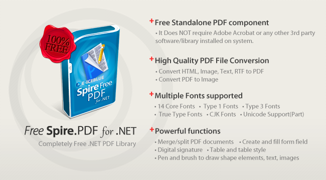

# Create Digital Signature in PDF file
## Requires
- Visual Studio 2010
## License
- MS-LPL
## Technologies
- Office
- Windows Forms
- .NET Framework
- .NET Framework 4.0
- SharePoint Server 2010
## Topics
- Controls
- C#
- ASP.NET
- Image manipulation
- Drawing
- How to
- C# Language Features
## Updated
- 08/12/2014
## Description

This is a C # example to operate PDF file via a Free C# PDF library. And the code gives you clear information of how to create visible digital signature in PDF in C#.

As a standalone C#/VB.NET component, <a href="http://www.e-iceblue.com/Introduce/free-pdf-component.html">
Free Spire.PDF for .NET</a> enables developers to create, write, edit, convert, print, handle and read PDF files on any .NET applications. You can implement rich capabilities to create PDF files from scratch or process existing PDF documents.

Besides create visible digital signature in PDF, <a href="http://www.e-iceblue.com/Introduce/free-pdf-component.html">
Free Spire.PDF for .NET</a> also supports to Encrypt/decrypt PDF Document in C#,VB.NET, modify the password of the protected PDF file, get and verify digital signature in PDF and other security features.

Spire.PDF for .NET enables users to create PDF file from webpage(html, htm, aspx), image(jpg, jpeg, png, bmp, tiff, gif, ico etc), text and export datatable from database to PDF. It also supports to generate PDF/A-1b, PDF/x1a, 2001 Compliance, standard PDF
 file. Furthermore, along with Spire.Doc for .NET and Spire.XLS or .NET, it can convert Word doc/docx, Excel xls/xlsx, RTF and XML to PDF. And the conversion between XPS to PDF and PDF to Image are available Now! 
 
Spire.PDF for .NET allows users to extract PDF text both in plain format and special format such as it can read PDF text which is written from right to left, such as Herbrew. Images of different formats and PDF attachments also can be extracted. Here shows
 an image of reading PDF. 
 
Spire.PDF component has rich features in editing PDF file. It supports to set text format and edit PDF page in multiple ways. 
 
&nbsp; -Text: draw text and set text format 
 
&nbsp; -Image: draw PDF images and different kinds of shapes 
 
&nbsp; -Table: draw PDF table including simple table, nested table and image table, 
 
&nbsp; -Watermark: add both text watermark and image watermark 
 
&nbsp; -Bookmark 
 
&nbsp; -Header and footer 
 
&nbsp; -Attachment: add attachments, read attachments and remove attachments 
 
&nbsp; -Hyperlink: link and anchor link 
 
&nbsp; -List: Simple list and multi-level list 
 
&nbsp; -Booklet 
 
&nbsp; -Action: action and action chain 
 
&nbsp; -Automatic Field 
 
There a lot of PDF tasks can be operated by using this .NET PDF library. Programmers can merge PDF files into one PDF as well as split a huge PDF with the given number range accordingly. Furthermore, it can protect your PDF document by encryption with both
 owner password and user password, create PDF digital signature. If you do not need to lock your PDF, you can decrypt it quickly. Besides, you can set PDF property, PDF template and view preference as you like. Finally, webpage, image and text all can be converted
 to PDF which are already referred above.

<strong>Useful Links:</strong>

<strong>Website</strong>:&nbsp;<a href="http://www.e-icbelue.com/" style="color:#960bb4; text-decoration:none">http://www.e-icbelue.com</a>

<strong>Product Home</strong>:&nbsp;<a href="http://www.e-iceblue.com/Introduce/pdf-for-net-introduce.html" style="color:#960bb4; text-decoration:none">Spire.PDF for .NET introduction</a>

<strong>Free Trial</strong>:&nbsp;<a href="http://www.e-iceblue.com/Download/download-pdf-for-net-now.html" style="color:#960bb4; text-decoration:none">Free evalution on Spire.PDF</a>

<strong>Forum</strong>:&nbsp;<a href="http://www.e-iceblue.com/forum/viewforum.php?f=4" style="color:#960bb4; text-decoration:none">Spire.PDF Forums</a>

