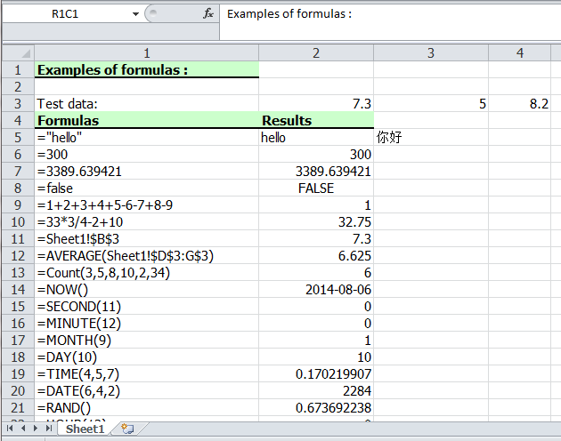

# Create Excel Formulas in C#
## Requires
- Visual Studio 2010
## License
- MS-LPL
## Technologies
- C#
- Silverlight
- ASP.NET
- Excel
- WPF
## Topics
- create excel formulas
- add excel formulas C#
- Excel formulas
- processing data in worksheet
## Updated
- 08/06/2014
## Description

<h1>Introduction</h1>

It is a time consuming job when we deal with large and complex data in worksheet. Formula is the main tool to calculate data. There are various formulas included in Excel. Below I will show you how to add formula in C# via free
 Spire.XLS for .NET.

In this sample,I'll give you a demo with many kinds of formulas written in the worksheet. The formula can be string, bool value, calculation, sheet area reference, time and so on. Here, we first reference a variable &quot;currentRow&quot;
 to control rows of all kinds of formulas. Second, reference &quot;currentFormula&quot;. Assign value for Worksheet.Range [cellRange]. Text to write a formula, and then via currentFormula to assign value for Worksheet.Range [cellRange]. Formula to get the formula results.

Please check the effective screenshot first.

 

&nbsp;

<strong>How to run demo&nbsp;</strong>

Users need to add dll files in project as reference to perform Spire.XlS for .NET to compile.

<ol>
<li><a href="http://www.e-iceblue.com/Download/download-excel-for-net-now.html">Download free Spire.XlS for .NET</a> here and you can get a zip package named Spire.xLS for .NET Version:7.4. Extract this package and get the .msi
 file. Double click this file and install it to the specified path on your system.
</li><li>&nbsp;There are several folders, which save dlls for different .NET Framework version under Bin directory. After creating a project, right click project name &rarr; Add Reference &rarr;
 Browse &rarr; Spire.XLS folder &rarr; Bin &rarr; .NET 2.0/3.5/4.0/4.5/4.0 ClientProfile &rarr; Spire.XLS.dll.
</li></ol>
<h1>More Information</h1>

Free Spire.XLS for .NET is a standalone Excel .NET library and does not depend on Microsoft Office Excel. It supports both for the old Excel 97-2003 format (.xls) and for the new Excel 2007 and Excel 2010 (.xlsx, .xlsm).

<strong>Main Functions</strong>

<ul>
<li>Powerful &amp; High Quality Excel File Conversion
</li><li>Create Excel Report from Comprehensive Workbook Designer
</li><li>Freely operate Worksheet </li><li>Easily Manipulate cells &amp; Excel Calculation Engine at run time
</li><li>Handle Chart, Data and other Elements </li></ul>

<strong>Related links</strong>

Website: <a href="http://www.e-iceblue.com/">http://www.e-iceblue.com/</a>

Product Home: <a href="http://www.e-iceblue.com/Introduce/free-xls-component.html">
Free Spire.XLS for .NET</a>

Download: <a href="http://www.e-iceblue.com/Download/download-excel-for-net-now.html">
Free Spire.XLS Download</a> 

Live Demo: <a href="http://www.e-iceblue.com/Knowledgebase/Spire.XLS/Demos.html">
Spire.XLS Demos</a> 

Forum: <a href="http://www.e-iceblue.com/forum/spire-xls-f4.html">
Free Spire.XLS Forum</a>

