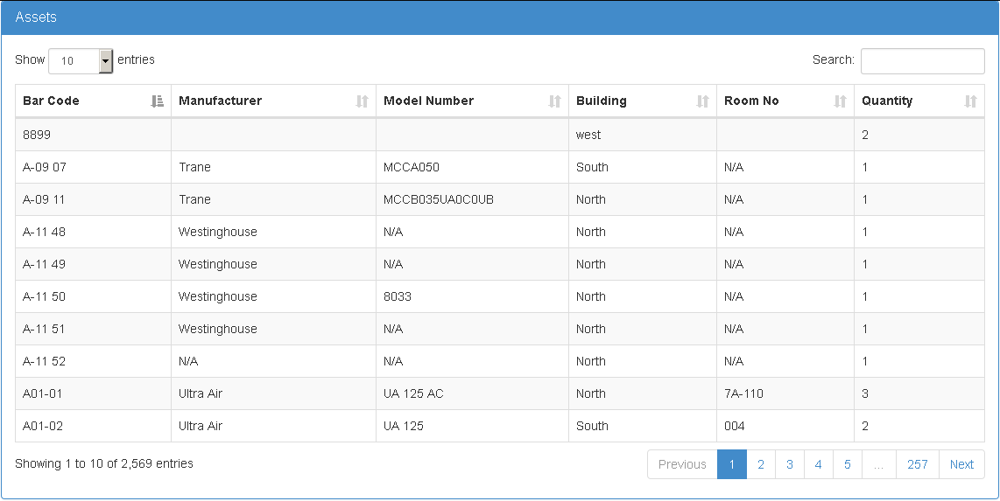

# Create Grid using JQuery DataTables in ASP.NET MVC 5
## Requires
- Visual Studio 2015
## License
- MIT
## Technologies
- SQL Server
- ASP.NET MVC 5
- JQuery DataTables
## Topics
- C#
- ASP.NET MVC
- Entity Framework
- GridView
## Updated
- 04/25/2017
## Description

<h1>Introduction</h1>

<em>This sample demonstrates how we can create a grid view in asp.net mvc, same like we have in asp.net web form. There are many their party both server side and also client side plugins written in jQuery are available which provide all the essential functionalities
 that we have in web forms which include searching, sorting and paging etc. It totally depends on the requirements of specific application if the search is needed client side or server side, same for the other functions.</em>

<h1>Building the Sample</h1>

<em>There is file named <a title="dbScript.txt" href="https://www.codeproject.com/KB/aspnet/1170086/Sql_Script.zip">
dbscript.txt</a>, you would need to create database with reqired tables and some data in the tables using the script which can be found in the solution, and after that you will need to modify the connection string of the database in the web.config which will
 be used by Entity Framework to query records :</em>

<em>&nbsp;</em>

<em>

XML

Edit|Remove

xml

<pre class="xml">&lt;add&nbsp;name=&quot;DefaultConnection&quot;&nbsp;connectionString=&quot;Data&nbsp;Source=(localdb)\MSSQLLocalDB;Initial&nbsp;Catalog=TrialAssignment-Joseph;Integrated&nbsp;Security=True;MultipleActiveResultSets=true&quot;&nbsp;providerName=&quot;System.Data.SqlClient&quot;&nbsp;/&gt;&nbsp;&nbsp;</pre>

</em>

<em>&nbsp;</em>

<h1>Description</h1>

<em>All have their pros and cons, but personally I have found jQuery datatables to be a good choice. It is highly flexible. It supports pagination, instant-search, multi-column ordering. It also supports almost all the data sources to which it can be binded,
 some of which are:</em>

<ul>
<li><em>DOM</em> </li><li><em>JavaScript</em> </li><li><em>Ajax</em> </li><li><em>Server-side processing</em> </li></ul>

<em>One of the best option which I like in it is that it supports both client side searching, pagination, sorting etc, but it also provides option to have server side processing of it, as there can be case where we have too much data in database and in that
 case client side paging wouldn&rsquo;t be a good option, just think millions of rows in a table and if they are binded to it using client side pagination, it will make or page unresponsive due to high amount of rows processing and html rendering. 
We will first see an example of how we can implement it using client side processing. So, let&rsquo;s get started. We will have a working grid with searching, sorting and paging at the end of the post which will look like:</em>

<em>&nbsp;</em>

<em> 
</em>

