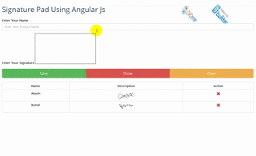

# Create a Signature Pad Using AngularJs
## License
- Apache License, Version 2.0
## Technologies
- Bootstrap
- HTML5/JavaScript
- AngularJS
## Topics
- Signatures
## Updated
- 02/19/2016
## Description

<h1>Introduction</h1>

Today I am going to introduce you to using signature pad with AngularJS and WCF service. In this article I am going to show you how to bind signature pad using WCF services.

<strong>I used the following in this article:</strong>

<ol>
<li>Use canvas controm from html5 for drawing signature on signature pad.
</li><li>I used angularjs and wcf rest service for store and retrive signature from database and how to display on screen your signature.
</li></ol>

&nbsp;

<strong>Step 1: SQL Script for signature pad</strong>

<ol>
<li>This is my sql script which i have used in this article.<strong> 
</strong></li></ol>

<strong>SQL</strong>

<strong>Edit|Remove</strong>

<strong>mysql

<pre class="mysql">CREATETABLE[dbo].[mstSign]&nbsp;&nbsp;&nbsp;
&nbsp;&nbsp;&nbsp;&nbsp;&nbsp;&nbsp;&nbsp;&nbsp;(&nbsp;&nbsp;&nbsp;
&nbsp;&nbsp;&nbsp;&nbsp;&nbsp;&nbsp;&nbsp;&nbsp;&nbsp;&nbsp;&nbsp;&nbsp;[SignId][UNIQUEIDENTIFIER]&nbsp;NOTNULL,&nbsp;&nbsp;
&nbsp;&nbsp;&nbsp;&nbsp;&nbsp;&nbsp;&nbsp;&nbsp;&nbsp;&nbsp;&nbsp;&nbsp;[cName][VARCHAR](150)&nbsp;NULL,&nbsp;
&nbsp;&nbsp;&nbsp;&nbsp;&nbsp;&nbsp;&nbsp;&nbsp;&nbsp;&nbsp;&nbsp;&nbsp;[cSigndata][VARCHAR](MAX)&nbsp;NULL,&nbsp;
&nbsp;&nbsp;&nbsp;&nbsp;&nbsp;&nbsp;&nbsp;&nbsp;&nbsp;&nbsp;&nbsp;&nbsp;[dtDateTime][DATETIME]&nbsp;NULL&nbsp;&nbsp;&nbsp;
&nbsp;&nbsp;&nbsp;&nbsp;&nbsp;&nbsp;&nbsp;&nbsp;)&nbsp;&nbsp;&nbsp;
</pre>

</strong>

<strong>Step 2: Wcf Service</strong>

<ol>
<li>I used my hosted service here. </li><li>So, you can get the latest service from my previous article
<a href="https://code.msdn.microsoft.com/Call-WCF-Service-Using-5cb8ea71" target="_blank">
Call WCF Service Using jQuery - Part 1</a> </li><li>I updated my service code there, and also you can see WCF configuration using Windows activation service from web.config.
</li></ol>

&nbsp;

<strong>Step 3: Html5 Canvas code</strong>

<ol>
<li>I used signature_pad.js for displaying signature pattern on screen.
</li><li>This JavaScript file is attached in source code.
</li></ol>

HTML

Edit|Remove

html

<pre class="html">&lt;div&nbsp;class=&quot;form-group&quot;&gt;&nbsp;&nbsp;&nbsp;
&nbsp;&nbsp;&nbsp;&nbsp;&lt;label&nbsp;for=&quot;name&quot;&gt;Enter&nbsp;Your&nbsp;Signature&lt;/label&gt;&nbsp;&nbsp;&nbsp;
&nbsp;
&nbsp;&nbsp;&nbsp;&nbsp;&lt;canvas&nbsp;id='signatureCanvas'&nbsp;width='300'&nbsp;height='150'&nbsp;style='border:&nbsp;1px&nbsp;solid&nbsp;black;'&gt;&lt;/canvas&gt;&nbsp;&nbsp;&nbsp;
&lt;/div&gt;&nbsp;</pre>

<h4>JavaScript code for displaying signature</h4>

JavaScript

Edit|Remove

js

<pre class="js">var&nbsp;canvas&nbsp;=&nbsp;document.getElementById('signatureCanvas');&nbsp;&nbsp;&nbsp;
var&nbsp;signaturePad&nbsp;=&nbsp;new&nbsp;SignaturePad(canvas);</pre>

&nbsp;<strong>Step 4: Save Canvas using service</strong>

<h4>My Controller:</h4>

JavaScript

Edit|Remove

js

<pre class="js">&nbsp;&nbsp;&nbsp;&nbsp;//&nbsp;for&nbsp;signature&nbsp;image&nbsp;&nbsp;&nbsp;
&nbsp;
&nbsp;&nbsp;&nbsp;&nbsp;var&nbsp;sigImg&nbsp;=&nbsp;signaturePad.toDataURL().replace('data:image/png;base64,',&nbsp;'');&nbsp;&nbsp;&nbsp;
&nbsp;&nbsp;&nbsp;&nbsp;var&nbsp;name&nbsp;=&nbsp;$scope.sign.name;&nbsp;&nbsp;&nbsp;
&nbsp;&nbsp;&nbsp;&nbsp;var&nbsp;xml&nbsp;=&nbsp;JSON.stringify&nbsp;&nbsp;&nbsp;
&nbsp;&nbsp;&nbsp;&nbsp;({&nbsp;&nbsp;&nbsp;
&nbsp;&nbsp;&nbsp;&nbsp;&nbsp;&nbsp;&nbsp;&nbsp;'name':&nbsp;name,&nbsp;&nbsp;&nbsp;
&nbsp;&nbsp;&nbsp;&nbsp;&nbsp;&nbsp;&nbsp;&nbsp;'imageData':&nbsp;sigImg&nbsp;&nbsp;&nbsp;
&nbsp;&nbsp;&nbsp;&nbsp;});&nbsp;&nbsp;&nbsp;
&nbsp;
&nbsp;&nbsp;&nbsp;&nbsp;//&nbsp;call&nbsp;add&nbsp;service&nbsp;for&nbsp;save&nbsp;signature&nbsp;&nbsp;&nbsp;
&nbsp;&nbsp;&nbsp;&nbsp;signService.Add(name,&nbsp;sigImg).success(function(response)&nbsp;{});&nbsp;&nbsp;&nbsp;
</pre>

<h4>My Service:</h4>

JavaScript

Edit|Remove

js

<pre class="js">Add:&nbsp;function(name,&nbsp;imagedata)&nbsp;&nbsp;&nbsp;
{&nbsp;&nbsp;&nbsp;
&nbsp;&nbsp;&nbsp;&nbsp;return&nbsp;$http&nbsp;&nbsp;&nbsp;
&nbsp;&nbsp;&nbsp;&nbsp;({&nbsp;&nbsp;&nbsp;
&nbsp;&nbsp;&nbsp;&nbsp;&nbsp;&nbsp;&nbsp;&nbsp;method:&nbsp;'POST',&nbsp;&nbsp;&nbsp;
&nbsp;&nbsp;&nbsp;&nbsp;&nbsp;&nbsp;&nbsp;&nbsp;headers:&nbsp;&nbsp;&nbsp;
&nbsp;&nbsp;&nbsp;&nbsp;&nbsp;&nbsp;&nbsp;&nbsp;{&nbsp;&nbsp;&nbsp;
&nbsp;&nbsp;&nbsp;&nbsp;&nbsp;&nbsp;&nbsp;&nbsp;&nbsp;&nbsp;&nbsp;&nbsp;'Content-Type':&nbsp;'application/json;&nbsp;charset=utf-8'&nbsp;&nbsp;&nbsp;
&nbsp;&nbsp;&nbsp;&nbsp;&nbsp;&nbsp;&nbsp;&nbsp;},&nbsp;&nbsp;&nbsp;
&nbsp;&nbsp;&nbsp;&nbsp;&nbsp;&nbsp;&nbsp;&nbsp;url:&nbsp;'http://kunalpatel.tk/ProductService.svc/AddNewSignature',&nbsp;&nbsp;&nbsp;
&nbsp;&nbsp;&nbsp;&nbsp;&nbsp;&nbsp;&nbsp;&nbsp;data:&nbsp;&nbsp;&nbsp;
&nbsp;&nbsp;&nbsp;&nbsp;&nbsp;&nbsp;&nbsp;&nbsp;{&nbsp;&nbsp;&nbsp;
&nbsp;&nbsp;&nbsp;&nbsp;&nbsp;&nbsp;&nbsp;&nbsp;&nbsp;&nbsp;&nbsp;&nbsp;name:&nbsp;name,&nbsp;&nbsp;&nbsp;
&nbsp;&nbsp;&nbsp;&nbsp;&nbsp;&nbsp;&nbsp;&nbsp;&nbsp;&nbsp;&nbsp;&nbsp;imageData:&nbsp;imagedata&nbsp;&nbsp;&nbsp;
&nbsp;&nbsp;&nbsp;&nbsp;&nbsp;&nbsp;&nbsp;&nbsp;}&nbsp;&nbsp;&nbsp;
&nbsp;&nbsp;&nbsp;&nbsp;});&nbsp;&nbsp;&nbsp;
}&nbsp;</pre>

<h4><strong>Step 5: Load signature on screen 
</strong> 
My Html:</h4>

HTML

Edit|Remove

html

<pre class="html">&nbsp;&nbsp;&nbsp;&nbsp;&lt;tr&nbsp;ng-repeat=&quot;sign&nbsp;in&nbsp;Signatures&quot;&gt;&nbsp;&nbsp;&nbsp;
&nbsp;&nbsp;&nbsp;&nbsp;&nbsp;&nbsp;&nbsp;&nbsp;&lt;td&gt;&lt;b&gt;{{&nbsp;sign.cName&nbsp;}}&lt;/b&gt;&lt;/td&gt;&nbsp;&nbsp;&nbsp;
&nbsp;&nbsp;&nbsp;&nbsp;&nbsp;&nbsp;&nbsp;&nbsp;&lt;td&nbsp;class=&quot;zoom_img&quot;&gt;&nbsp;
&nbsp;&nbsp;&nbsp;&nbsp;&nbsp;&nbsp;&nbsp;&nbsp;&lt;img&nbsp;src=&quot;http://www.kunalpatel.tk/Images&nbsp;/Signature/{{&nbsp;sign.cSigndata&nbsp;}}&quot;&nbsp;height=&quot;50&quot;&nbsp;width=&quot;100&quot;&nbsp;/&gt;&nbsp;&nbsp;
&lt;/td&gt;&nbsp;&nbsp;&nbsp;
&nbsp;&nbsp;&nbsp;&nbsp;&lt;/tr&gt;&nbsp;&nbsp;&nbsp;
</pre>

<h4>My Controller</h4>

JavaScript

Edit|Remove

js

<pre class="js">&nbsp;&nbsp;&nbsp;&nbsp;signService.get().success(function(response)&nbsp;&nbsp;&nbsp;
&nbsp;&nbsp;&nbsp;&nbsp;{&nbsp;&nbsp;&nbsp;
&nbsp;&nbsp;&nbsp;&nbsp;&nbsp;&nbsp;&nbsp;&nbsp;$scope.Signatures&nbsp;=&nbsp;JSON.parse(response.d);&nbsp;&nbsp;&nbsp;
&nbsp;&nbsp;&nbsp;&nbsp;});&nbsp;&nbsp;&nbsp;
</pre>

<h4>My Service</h4>

JavaScript

Edit|Remove

js

<pre class="js">&nbsp;&nbsp;&nbsp;&nbsp;get:&nbsp;function()&nbsp;&nbsp;&nbsp;&nbsp;
&nbsp;&nbsp;&nbsp;&nbsp;{return&nbsp;$http&nbsp;&nbsp;&nbsp;
&nbsp;&nbsp;&nbsp;&nbsp;&nbsp;&nbsp;&nbsp;&nbsp;({&nbsp;&nbsp;&nbsp;
&nbsp;&nbsp;&nbsp;&nbsp;&nbsp;&nbsp;&nbsp;&nbsp;&nbsp;&nbsp;&nbsp;&nbsp;method:&nbsp;'POST',&nbsp;&nbsp;&nbsp;
&nbsp;&nbsp;&nbsp;&nbsp;&nbsp;&nbsp;&nbsp;&nbsp;&nbsp;&nbsp;&nbsp;&nbsp;headers:&nbsp;&nbsp;&nbsp;
&nbsp;&nbsp;&nbsp;&nbsp;&nbsp;&nbsp;&nbsp;&nbsp;&nbsp;&nbsp;&nbsp;&nbsp;{'Content-Type':&nbsp;'application/json;&nbsp;charset=utf-8'},&nbsp;&nbsp;&nbsp;
&nbsp;&nbsp;&nbsp;&nbsp;&nbsp;&nbsp;&nbsp;&nbsp;&nbsp;&nbsp;&nbsp;&nbsp;url:&nbsp;'http://kunalpatel.tk/ProductService.svc/LoadAllSignature',&nbsp;&nbsp;&nbsp;
&nbsp;&nbsp;&nbsp;&nbsp;&nbsp;&nbsp;&nbsp;&nbsp;&nbsp;&nbsp;&nbsp;&nbsp;data:&nbsp;{}});&nbsp;&nbsp;&nbsp;
&nbsp;&nbsp;&nbsp;&nbsp;}</pre>

<h4><strong>Step 5 : Final Output</strong></h4>

<h1>Download Source Code : <a id="148714" href="/site/view/file/148714/1/SignaturePad.rar">
SignaturePad.rar</a></h1>
&nbsp;
<h1>Test Output Here : 
<a title="Click here for test signature pad" href="http://www.kunalpatel.tk/signature.html" target="_blank">Click Here for test signature pad</a> 
</h1>
&nbsp;
<h1>Output Image</h1>

<em>&nbsp;</em>

