# Create and Push NuGet Package in Visual Studio 2013
## License
- MIT
## Technologies
- NuGet
- ASP.NET MVC 5
- Entity Framework 6
## Topics
- NuGet
- Create NuGet Package
- How to create NuGet Package
- How to create NuGet Package in Visual Studio 2013
- Nuget Package
- Nuget Package in Visual Studio 2013
- Puch NuGet Package
- Publish NuGet Package
## Updated
- 12/08/2014
## Description

<h1>Introduction</h1>

In this article we will see how we can create NuGet Package after each build and push the package to NuGet in Visual Studio 2013.

<h1>Description</h1>

<strong>NuGet: </strong>NuGet is a Visual Studio extension that makes it easy to pull in libraries, components, and most importantly their configuration into your visual studio project. This is a tool that is installed with MVC 3 and it is used to bring
 in various components to make developing on MVC easier. These components are called NuGet Packages and they can include .NET assemblies, JavaScript files, HTML/Razor files, CSS files, images, and even files that can add configuration to your projects web.config.
 The goal of NuGet is to make is super easy to bring in or update a component in your existing projects.

More info- <a href="http://www.developerfusion.com/article/131917/using-nuget-packages/">
http://www.developerfusion.com/article/131917/using-nuget-packages/</a>

First of all let&rsquo;s make an mvc project &ndash;

<strong>Getting Started</strong>

<ul>
<li>Create a new Project. Open Visual Studio 2013. </li><li>Go to &quot;File&quot; -&gt; &quot;New&quot; -&gt; &quot;Project&quot;. </li><li>Select &quot;Web&quot; in the installed templates. </li><li>Select &quot;MVC&quot;. </li><li>Enter the Name and choose the location. </li><li>Click &quot;OK&quot;. </li></ul>

In this small sample I am building crud operation using entity framework.

Model classes:

public class Friend

&nbsp;&nbsp;&nbsp; {

&nbsp;&nbsp;&nbsp;&nbsp;&nbsp;&nbsp;&nbsp; [Key]

&nbsp;&nbsp;&nbsp;&nbsp;&nbsp;&nbsp;&nbsp; [DatabaseGeneratedAttribute(DatabaseGeneratedOption.Identity)]

&nbsp;&nbsp;&nbsp;&nbsp;&nbsp;&nbsp;&nbsp; public int FriendId { get; set; }

&nbsp;&nbsp;&nbsp;&nbsp;&nbsp;&nbsp;&nbsp; public string FirstName { get; set; }

&nbsp;&nbsp;&nbsp;&nbsp;&nbsp;&nbsp;&nbsp; public string LastName { get; set; }

&nbsp;&nbsp;&nbsp;&nbsp;&nbsp;&nbsp;&nbsp; public string Address { get; set; }

&nbsp;&nbsp;&nbsp;&nbsp;&nbsp;&nbsp;&nbsp; public string City { get; set; }

&nbsp;&nbsp;&nbsp;&nbsp;&nbsp;&nbsp;&nbsp; public string PostalCode { get; set; }

&nbsp;&nbsp;&nbsp;&nbsp;&nbsp;&nbsp;&nbsp; public string Country { get; set; }

&nbsp;&nbsp;&nbsp;&nbsp;&nbsp;&nbsp;&nbsp; public string Notes { get; set; }

&nbsp;&nbsp;&nbsp; }

&nbsp; public class FriendsContext : DbContext

&nbsp;&nbsp;&nbsp; {&nbsp;&nbsp;&nbsp;&nbsp;&nbsp;&nbsp;&nbsp;

&nbsp;&nbsp;&nbsp;&nbsp;&nbsp;&nbsp;&nbsp; public FriendsContext()

&nbsp;&nbsp;&nbsp;&nbsp;&nbsp;&nbsp;&nbsp;&nbsp;&nbsp;&nbsp;&nbsp; : base(&quot;name=DefaultConnection&quot;)

&nbsp;&nbsp;&nbsp;&nbsp;&nbsp;&nbsp;&nbsp; {

&nbsp;&nbsp;&nbsp;&nbsp;&nbsp;&nbsp;&nbsp;&nbsp;&nbsp;&nbsp;&nbsp; base.Configuration.ProxyCreationEnabled = false;

&nbsp;&nbsp;&nbsp;&nbsp;&nbsp;&nbsp;&nbsp; }

&nbsp;

&nbsp;&nbsp;&nbsp;&nbsp;&nbsp;&nbsp;&nbsp; public DbSet&lt;Friend&gt; Friends { get; set; }

&nbsp;&nbsp;&nbsp; }

Controller Class:

public class FriendsController : Controller

&nbsp;&nbsp;&nbsp; {

&nbsp;&nbsp;&nbsp;&nbsp;&nbsp;&nbsp;&nbsp; private FriendsContext db = new FriendsContext();

&nbsp;

&nbsp;&nbsp;&nbsp;&nbsp;&nbsp;&nbsp;&nbsp; // GET: Friends

&nbsp;&nbsp;&nbsp;&nbsp;&nbsp;&nbsp;&nbsp; public async Task&lt;ActionResult&gt; Index()

&nbsp;&nbsp;&nbsp;&nbsp;&nbsp;&nbsp;&nbsp; {

&nbsp;&nbsp;&nbsp;&nbsp;&nbsp;&nbsp;&nbsp;&nbsp;&nbsp;&nbsp;&nbsp; return View(await db.Friends.ToListAsync());

&nbsp;&nbsp;&nbsp;&nbsp;&nbsp;&nbsp;&nbsp; }

&nbsp;

&nbsp;&nbsp;&nbsp;&nbsp;&nbsp;&nbsp;&nbsp; // GET: Friends/Details/5

&nbsp;&nbsp;&nbsp;&nbsp;&nbsp;&nbsp;&nbsp; public async Task&lt;ActionResult&gt; Details(int? id)

&nbsp;&nbsp;&nbsp;&nbsp;&nbsp;&nbsp;&nbsp; {

&nbsp;&nbsp;&nbsp;&nbsp;&nbsp;&nbsp;&nbsp;&nbsp;&nbsp;&nbsp;&nbsp; if (id == null)

&nbsp;&nbsp;&nbsp;&nbsp;&nbsp;&nbsp;&nbsp;&nbsp;&nbsp;&nbsp;&nbsp; {

&nbsp;&nbsp;&nbsp;&nbsp;&nbsp;&nbsp;&nbsp;&nbsp;&nbsp;&nbsp;&nbsp;&nbsp;&nbsp;&nbsp;&nbsp; return new HttpStatusCodeResult(HttpStatusCode.BadRequest);

&nbsp;&nbsp;&nbsp;&nbsp;&nbsp;&nbsp;&nbsp;&nbsp;&nbsp;&nbsp;&nbsp; }

&nbsp;&nbsp;&nbsp;&nbsp;&nbsp;&nbsp;&nbsp;&nbsp;&nbsp;&nbsp;&nbsp; Friend friend = await db.Friends.FindAsync(id);

&nbsp;&nbsp;&nbsp;&nbsp;&nbsp;&nbsp;&nbsp;&nbsp;&nbsp;&nbsp;&nbsp; if (friend == null)

&nbsp;&nbsp;&nbsp;&nbsp;&nbsp;&nbsp;&nbsp;&nbsp;&nbsp;&nbsp;&nbsp; {

&nbsp;&nbsp;&nbsp;&nbsp;&nbsp;&nbsp;&nbsp;&nbsp;&nbsp;&nbsp;&nbsp;&nbsp;&nbsp;&nbsp;&nbsp; return HttpNotFound();

&nbsp;&nbsp;&nbsp;&nbsp;&nbsp;&nbsp;&nbsp;&nbsp;&nbsp;&nbsp;&nbsp; }

&nbsp;&nbsp;&nbsp;&nbsp;&nbsp;&nbsp;&nbsp;&nbsp;&nbsp;&nbsp;&nbsp; return View(friend);

&nbsp;&nbsp;&nbsp;&nbsp;&nbsp;&nbsp;&nbsp; }

&nbsp;

&nbsp;&nbsp;&nbsp;&nbsp;&nbsp;&nbsp;&nbsp; // GET: Friends/Create

&nbsp;&nbsp;&nbsp;&nbsp;&nbsp;&nbsp;&nbsp; public ActionResult Create()

&nbsp;&nbsp;&nbsp;&nbsp;&nbsp;&nbsp;&nbsp; {

&nbsp;&nbsp;&nbsp;&nbsp;&nbsp;&nbsp;&nbsp;&nbsp;&nbsp;&nbsp;&nbsp; return View();

&nbsp;&nbsp;&nbsp;&nbsp;&nbsp;&nbsp;&nbsp; }

&nbsp;

&nbsp;&nbsp;&nbsp;&nbsp;&nbsp;&nbsp;&nbsp; // POST: Friends/Create

&nbsp;&nbsp;&nbsp;&nbsp;&nbsp;&nbsp;&nbsp; // To protect from overposting attacks, please enable the specific properties you want to bind to, for

&nbsp;&nbsp;&nbsp;&nbsp;&nbsp;&nbsp;&nbsp; // more details see http://go.microsoft.com/fwlink/?LinkId=317598.

&nbsp;&nbsp;&nbsp;&nbsp;&nbsp;&nbsp;&nbsp; [HttpPost]

&nbsp;&nbsp;&nbsp;&nbsp;&nbsp;&nbsp;&nbsp; [ValidateAntiForgeryToken]

&nbsp;&nbsp;&nbsp;&nbsp;&nbsp;&nbsp;&nbsp; public async Task&lt;ActionResult&gt; Create([Bind(Include = &quot;FriendId,FirstName,LastName,Address,City,PostalCode,Country,Notes&quot;)] Friend friend)

&nbsp;&nbsp;&nbsp;&nbsp;&nbsp;&nbsp;&nbsp; {

&nbsp;&nbsp;&nbsp;&nbsp;&nbsp;&nbsp;&nbsp;&nbsp;&nbsp;&nbsp;&nbsp; if (ModelState.IsValid)

&nbsp;&nbsp;&nbsp;&nbsp;&nbsp;&nbsp;&nbsp;&nbsp;&nbsp;&nbsp;&nbsp; {

&nbsp;&nbsp;&nbsp;&nbsp;&nbsp;&nbsp;&nbsp;&nbsp;&nbsp;&nbsp;&nbsp;&nbsp;&nbsp;&nbsp;&nbsp; db.Friends.Add(friend);

&nbsp;&nbsp;&nbsp;&nbsp;&nbsp;&nbsp;&nbsp;&nbsp;&nbsp;&nbsp;&nbsp;&nbsp;&nbsp;&nbsp;&nbsp; await db.SaveChangesAsync();

&nbsp;&nbsp;&nbsp;&nbsp;&nbsp;&nbsp;&nbsp;&nbsp;&nbsp;&nbsp;&nbsp;&nbsp;&nbsp;&nbsp;&nbsp; return RedirectToAction(&quot;Index&quot;);

&nbsp;&nbsp;&nbsp;&nbsp;&nbsp;&nbsp;&nbsp;&nbsp;&nbsp;&nbsp;&nbsp; }

&nbsp;

&nbsp;&nbsp;&nbsp;&nbsp;&nbsp;&nbsp;&nbsp;&nbsp;&nbsp;&nbsp;&nbsp; return View(friend);

&nbsp;&nbsp;&nbsp;&nbsp;&nbsp;&nbsp;&nbsp; }

&nbsp;

&nbsp;&nbsp;&nbsp;&nbsp;&nbsp;&nbsp;&nbsp; // GET: Friends/Edit/5

&nbsp;&nbsp;&nbsp;&nbsp;&nbsp;&nbsp;&nbsp; public async Task&lt;ActionResult&gt; Edit(int? id)

&nbsp;&nbsp;&nbsp;&nbsp;&nbsp;&nbsp;&nbsp; {

&nbsp;&nbsp;&nbsp;&nbsp;&nbsp;&nbsp;&nbsp;&nbsp;&nbsp;&nbsp;&nbsp; if (id == null)

&nbsp;&nbsp;&nbsp;&nbsp;&nbsp;&nbsp;&nbsp;&nbsp;&nbsp;&nbsp;&nbsp; {

&nbsp;&nbsp;&nbsp;&nbsp;&nbsp;&nbsp;&nbsp;&nbsp;&nbsp;&nbsp;&nbsp;&nbsp;&nbsp;&nbsp;&nbsp; return new HttpStatusCodeResult(HttpStatusCode.BadRequest);

&nbsp;&nbsp;&nbsp;&nbsp;&nbsp;&nbsp;&nbsp;&nbsp;&nbsp;&nbsp;&nbsp; }

&nbsp;&nbsp;&nbsp;&nbsp;&nbsp;&nbsp;&nbsp;&nbsp;&nbsp;&nbsp;&nbsp; Friend friend = await db.Friends.FindAsync(id);

&nbsp;&nbsp;&nbsp;&nbsp;&nbsp;&nbsp;&nbsp;&nbsp;&nbsp;&nbsp;&nbsp; if (friend == null)

&nbsp;&nbsp;&nbsp;&nbsp;&nbsp;&nbsp;&nbsp;&nbsp;&nbsp;&nbsp;&nbsp; {

&nbsp;&nbsp;&nbsp;&nbsp;&nbsp;&nbsp;&nbsp;&nbsp;&nbsp;&nbsp;&nbsp;&nbsp;&nbsp;&nbsp;&nbsp; return HttpNotFound();

&nbsp;&nbsp;&nbsp;&nbsp;&nbsp;&nbsp;&nbsp;&nbsp;&nbsp;&nbsp;&nbsp; }

&nbsp;&nbsp;&nbsp;&nbsp;&nbsp;&nbsp;&nbsp;&nbsp;&nbsp;&nbsp;&nbsp; return View(friend);

&nbsp;&nbsp;&nbsp;&nbsp;&nbsp;&nbsp;&nbsp; }

&nbsp;

&nbsp;&nbsp;&nbsp;&nbsp;&nbsp;&nbsp;&nbsp; // POST: Friends/Edit/5

&nbsp;&nbsp;&nbsp;&nbsp;&nbsp;&nbsp;&nbsp; // To protect from overposting attacks, please enable the specific properties you want to bind to, for

&nbsp;&nbsp;&nbsp;&nbsp;&nbsp;&nbsp;&nbsp; // more details see http://go.microsoft.com/fwlink/?LinkId=317598.

&nbsp;&nbsp;&nbsp;&nbsp;&nbsp;&nbsp;&nbsp; [HttpPost]

&nbsp;&nbsp;&nbsp;&nbsp;&nbsp;&nbsp;&nbsp; [ValidateAntiForgeryToken]

&nbsp;&nbsp;&nbsp;&nbsp;&nbsp;&nbsp;&nbsp; public async Task&lt;ActionResult&gt; Edit([Bind(Include = &quot;FriendId,FirstName,LastName,Address,City,PostalCode,Country,Notes&quot;)] Friend friend)

&nbsp;&nbsp;&nbsp;&nbsp;&nbsp;&nbsp;&nbsp; {

&nbsp;&nbsp;&nbsp;&nbsp;&nbsp;&nbsp;&nbsp;&nbsp;&nbsp;&nbsp;&nbsp; if (ModelState.IsValid)

&nbsp;&nbsp;&nbsp;&nbsp;&nbsp;&nbsp;&nbsp;&nbsp;&nbsp;&nbsp;&nbsp; {

&nbsp;&nbsp;&nbsp;&nbsp;&nbsp;&nbsp;&nbsp;&nbsp;&nbsp;&nbsp;&nbsp;&nbsp;&nbsp;&nbsp;&nbsp; db.Entry(friend).State = EntityState.Modified;

&nbsp;&nbsp;&nbsp;&nbsp;&nbsp;&nbsp;&nbsp; &nbsp;&nbsp;&nbsp;&nbsp;&nbsp;&nbsp;&nbsp;&nbsp;await db.SaveChangesAsync();

&nbsp;&nbsp;&nbsp;&nbsp;&nbsp;&nbsp;&nbsp;&nbsp;&nbsp;&nbsp;&nbsp;&nbsp;&nbsp;&nbsp;&nbsp; return RedirectToAction(&quot;Index&quot;);

&nbsp;&nbsp;&nbsp;&nbsp;&nbsp;&nbsp;&nbsp;&nbsp;&nbsp;&nbsp;&nbsp; }

&nbsp;&nbsp;&nbsp;&nbsp;&nbsp;&nbsp;&nbsp;&nbsp;&nbsp;&nbsp;&nbsp; return View(friend);

&nbsp;&nbsp;&nbsp;&nbsp;&nbsp;&nbsp;&nbsp; }

&nbsp;

&nbsp;&nbsp;&nbsp;&nbsp;&nbsp;&nbsp;&nbsp; // GET: Friends/Delete/5

&nbsp;&nbsp;&nbsp;&nbsp;&nbsp;&nbsp;&nbsp; public async Task&lt;ActionResult&gt; Delete(int? id)

&nbsp;&nbsp;&nbsp;&nbsp;&nbsp;&nbsp;&nbsp; {

&nbsp;&nbsp;&nbsp;&nbsp;&nbsp;&nbsp;&nbsp;&nbsp;&nbsp;&nbsp;&nbsp; if (id == null)

&nbsp;&nbsp;&nbsp;&nbsp;&nbsp;&nbsp;&nbsp;&nbsp;&nbsp;&nbsp;&nbsp; {

&nbsp;&nbsp;&nbsp;&nbsp;&nbsp;&nbsp;&nbsp;&nbsp;&nbsp;&nbsp;&nbsp;&nbsp;&nbsp;&nbsp;&nbsp; return new HttpStatusCodeResult(HttpStatusCode.BadRequest);

&nbsp;&nbsp;&nbsp;&nbsp;&nbsp;&nbsp;&nbsp;&nbsp;&nbsp;&nbsp;&nbsp; }

&nbsp;&nbsp;&nbsp;&nbsp;&nbsp;&nbsp;&nbsp;&nbsp;&nbsp;&nbsp;&nbsp; Friend friend = await db.Friends.FindAsync(id);

&nbsp;&nbsp;&nbsp;&nbsp;&nbsp;&nbsp;&nbsp;&nbsp;&nbsp;&nbsp;&nbsp; if (friend == null)

&nbsp;&nbsp;&nbsp;&nbsp;&nbsp;&nbsp;&nbsp;&nbsp;&nbsp;&nbsp;&nbsp; {

&nbsp;&nbsp;&nbsp;&nbsp;&nbsp;&nbsp;&nbsp;&nbsp;&nbsp;&nbsp;&nbsp;&nbsp;&nbsp;&nbsp;&nbsp; return HttpNotFound();

&nbsp;&nbsp;&nbsp;&nbsp;&nbsp;&nbsp;&nbsp;&nbsp;&nbsp;&nbsp;&nbsp; }

&nbsp;&nbsp;&nbsp;&nbsp;&nbsp;&nbsp;&nbsp;&nbsp;&nbsp;&nbsp;&nbsp; return View(friend);

&nbsp;&nbsp;&nbsp;&nbsp;&nbsp;&nbsp;&nbsp; }

&nbsp;

&nbsp;&nbsp;&nbsp;&nbsp;&nbsp;&nbsp;&nbsp; // POST: Friends/Delete/5

&nbsp;&nbsp;&nbsp;&nbsp;&nbsp;&nbsp;&nbsp; [HttpPost, ActionName(&quot;Delete&quot;)]

&nbsp;&nbsp;&nbsp;&nbsp;&nbsp;&nbsp;&nbsp; [ValidateAntiForgeryToken]

&nbsp;&nbsp;&nbsp;&nbsp;&nbsp;&nbsp;&nbsp; public async Task&lt;ActionResult&gt; DeleteConfirmed(int id)

&nbsp;&nbsp;&nbsp;&nbsp;&nbsp;&nbsp;&nbsp; {

&nbsp;&nbsp;&nbsp;&nbsp;&nbsp;&nbsp;&nbsp;&nbsp;&nbsp;&nbsp;&nbsp; Friend friend = await db.Friends.FindAsync(id);

&nbsp;&nbsp;&nbsp;&nbsp;&nbsp;&nbsp;&nbsp;&nbsp;&nbsp;&nbsp;&nbsp; db.Friends.Remove(friend);

&nbsp;&nbsp;&nbsp;&nbsp;&nbsp;&nbsp;&nbsp;&nbsp;&nbsp;&nbsp;&nbsp; await db.SaveChangesAsync();

&nbsp;&nbsp;&nbsp;&nbsp;&nbsp;&nbsp;&nbsp;&nbsp;&nbsp;&nbsp;&nbsp; return RedirectToAction(&quot;Index&quot;);

&nbsp;&nbsp;&nbsp;&nbsp;&nbsp;&nbsp;&nbsp; }

&nbsp;

&nbsp;&nbsp;&nbsp;&nbsp;&nbsp;&nbsp;&nbsp; protected override void Dispose(bool disposing)

&nbsp;&nbsp;&nbsp;&nbsp;&nbsp;&nbsp;&nbsp; {

&nbsp;&nbsp;&nbsp;&nbsp;&nbsp;&nbsp;&nbsp;&nbsp;&nbsp;&nbsp;&nbsp; if (disposing)

&nbsp;&nbsp;&nbsp;&nbsp;&nbsp;&nbsp;&nbsp;&nbsp;&nbsp;&nbsp;&nbsp; {

&nbsp;&nbsp;&nbsp;&nbsp;&nbsp;&nbsp;&nbsp;&nbsp;&nbsp;&nbsp;&nbsp;&nbsp;&nbsp;&nbsp;&nbsp; db.Dispose();

&nbsp;&nbsp;&nbsp;&nbsp;&nbsp;&nbsp;&nbsp;&nbsp;&nbsp;&nbsp;&nbsp; }

&nbsp;&nbsp;&nbsp;&nbsp;&nbsp;&nbsp;&nbsp;&nbsp;&nbsp;&nbsp;&nbsp; base.Dispose(disposing);

&nbsp;&nbsp;&nbsp;&nbsp;&nbsp;&nbsp;&nbsp; }

&nbsp;&nbsp;&nbsp; }

&nbsp;

Friends View:

@model IEnumerable&lt;RajNugetPackage.Models.Friend&gt;

&nbsp;

@{

&nbsp;&nbsp;&nbsp; ViewBag.Title = &quot;Index&quot;;

&nbsp;&nbsp;&nbsp; Layout = &quot;~/Views/Shared/_Layout.cshtml&quot;;

}

&nbsp;

&lt;h2&gt;Index&lt;/h2&gt;

&nbsp;

&lt;p&gt;

&nbsp;&nbsp;&nbsp; @Html.ActionLink(&quot;Create New&quot;, &quot;Create&quot;)

&lt;/p&gt;

&lt;table class=&quot;table&quot;&gt;

&nbsp;&nbsp;&nbsp; &lt;tr&gt;

&nbsp;&nbsp;&nbsp;&nbsp;&nbsp;&nbsp;&nbsp; &lt;th&gt;

&nbsp;&nbsp;&nbsp;&nbsp;&nbsp;&nbsp;&nbsp;&nbsp;&nbsp;&nbsp;&nbsp; @Html.DisplayNameFor(model =&gt; model.FirstName)

&nbsp;&nbsp;&nbsp;&nbsp;&nbsp;&nbsp;&nbsp; &lt;/th&gt;

&nbsp;&nbsp;&nbsp;&nbsp;&nbsp;&nbsp;&nbsp; &lt;th&gt;

&nbsp;&nbsp;&nbsp;&nbsp;&nbsp;&nbsp;&nbsp;&nbsp;&nbsp;&nbsp;&nbsp; @Html.DisplayNameFor(model =&gt; model.LastName)

&nbsp;&nbsp;&nbsp;&nbsp;&nbsp;&nbsp;&nbsp; &lt;/th&gt;

&nbsp;&nbsp;&nbsp;&nbsp;&nbsp;&nbsp;&nbsp; &lt;th&gt;

&nbsp;&nbsp;&nbsp;&nbsp;&nbsp;&nbsp;&nbsp;&nbsp;&nbsp;&nbsp;&nbsp; @Html.DisplayNameFor(model =&gt; model.Address)

&nbsp;&nbsp;&nbsp;&nbsp;&nbsp;&nbsp;&nbsp; &lt;/th&gt;

&nbsp;&nbsp;&nbsp;&nbsp;&nbsp;&nbsp;&nbsp; &lt;th&gt;

&nbsp;&nbsp;&nbsp;&nbsp;&nbsp;&nbsp;&nbsp;&nbsp;&nbsp;&nbsp;&nbsp; @Html.DisplayNameFor(model =&gt; model.City)

&nbsp;&nbsp;&nbsp;&nbsp;&nbsp;&nbsp;&nbsp; &lt;/th&gt;

&nbsp;&nbsp;&nbsp;&nbsp;&nbsp;&nbsp;&nbsp; &lt;th&gt;

&nbsp;&nbsp;&nbsp;&nbsp;&nbsp; &nbsp;&nbsp;&nbsp;&nbsp;&nbsp;&nbsp;@Html.DisplayNameFor(model =&gt; model.PostalCode)

&nbsp;&nbsp;&nbsp;&nbsp;&nbsp;&nbsp;&nbsp; &lt;/th&gt;

&nbsp;&nbsp;&nbsp;&nbsp;&nbsp;&nbsp;&nbsp; &lt;th&gt;

&nbsp;&nbsp;&nbsp;&nbsp;&nbsp;&nbsp;&nbsp;&nbsp;&nbsp;&nbsp;&nbsp; @Html.DisplayNameFor(model =&gt; model.Country)

&nbsp;&nbsp;&nbsp;&nbsp;&nbsp;&nbsp;&nbsp; &lt;/th&gt;

&nbsp;&nbsp;&nbsp;&nbsp;&nbsp;&nbsp;&nbsp; &lt;th&gt;

&nbsp;&nbsp;&nbsp;&nbsp;&nbsp;&nbsp;&nbsp;&nbsp;&nbsp;&nbsp;&nbsp; @Html.DisplayNameFor(model =&gt; model.Notes)

&nbsp;&nbsp;&nbsp;&nbsp;&nbsp;&nbsp;&nbsp; &lt;/th&gt;

&nbsp;&nbsp;&nbsp;&nbsp;&nbsp;&nbsp;&nbsp; &lt;th&gt;&lt;/th&gt;

&nbsp;&nbsp;&nbsp; &lt;/tr&gt;

&nbsp;

@foreach (var item in Model) {

&nbsp;&nbsp;&nbsp; &lt;tr&gt;

&nbsp;&nbsp;&nbsp;&nbsp;&nbsp;&nbsp;&nbsp; &lt;td&gt;

&nbsp;&nbsp;&nbsp;&nbsp;&nbsp;&nbsp;&nbsp;&nbsp;&nbsp;&nbsp;&nbsp; @Html.DisplayFor(modelItem =&gt; item.FirstName)

&nbsp;&nbsp;&nbsp;&nbsp;&nbsp;&nbsp;&nbsp; &lt;/td&gt;

&nbsp;&nbsp;&nbsp;&nbsp;&nbsp;&nbsp;&nbsp; &lt;td&gt;

&nbsp;&nbsp;&nbsp;&nbsp;&nbsp;&nbsp;&nbsp;&nbsp;&nbsp;&nbsp;&nbsp; @Html.DisplayFor(modelItem =&gt; item.LastName)

&nbsp;&nbsp;&nbsp;&nbsp;&nbsp;&nbsp;&nbsp; &lt;/td&gt;

&nbsp;&nbsp;&nbsp;&nbsp;&nbsp;&nbsp;&nbsp; &lt;td&gt;

&nbsp;&nbsp;&nbsp;&nbsp;&nbsp;&nbsp;&nbsp;&nbsp;&nbsp;&nbsp;&nbsp; @Html.DisplayFor(modelItem =&gt; item.Address)

&nbsp;&nbsp;&nbsp;&nbsp;&nbsp;&nbsp;&nbsp; &lt;/td&gt;

&nbsp;&nbsp;&nbsp;&nbsp;&nbsp;&nbsp;&nbsp; &lt;td&gt;

&nbsp;&nbsp;&nbsp;&nbsp;&nbsp;&nbsp;&nbsp;&nbsp;&nbsp;&nbsp;&nbsp; @Html.DisplayFor(modelItem =&gt; item.City)

&nbsp;&nbsp;&nbsp;&nbsp;&nbsp;&nbsp;&nbsp; &lt;/td&gt;

&nbsp;&nbsp;&nbsp;&nbsp;&nbsp;&nbsp;&nbsp; &lt;td&gt;

&nbsp;&nbsp;&nbsp;&nbsp;&nbsp;&nbsp;&nbsp;&nbsp;&nbsp;&nbsp;&nbsp; @Html.DisplayFor(modelItem =&gt; item.PostalCode)

&nbsp;&nbsp;&nbsp;&nbsp;&nbsp;&nbsp;&nbsp; &lt;/td&gt;

&nbsp;&nbsp;&nbsp;&nbsp;&nbsp;&nbsp;&nbsp; &lt;td&gt;

&nbsp;&nbsp;&nbsp;&nbsp;&nbsp;&nbsp;&nbsp;&nbsp;&nbsp;&nbsp;&nbsp; @Html.DisplayFor(modelItem =&gt; item.Country)

&nbsp;&nbsp;&nbsp;&nbsp;&nbsp;&nbsp;&nbsp; &lt;/td&gt;

&nbsp;&nbsp;&nbsp;&nbsp;&nbsp;&nbsp;&nbsp; &lt;td&gt;

&nbsp;&nbsp;&nbsp;&nbsp;&nbsp;&nbsp;&nbsp;&nbsp;&nbsp;&nbsp;&nbsp; @Html.DisplayFor(modelItem =&gt; item.Notes)

&nbsp;&nbsp;&nbsp;&nbsp;&nbsp;&nbsp;&nbsp; &lt;/td&gt;

&nbsp;&nbsp;&nbsp;&nbsp;&nbsp;&nbsp;&nbsp; &lt;td&gt;

&nbsp;&nbsp;&nbsp;&nbsp;&nbsp;&nbsp;&nbsp;&nbsp;&nbsp;&nbsp;&nbsp; @Html.ActionLink(&quot;Edit&quot;, &quot;Edit&quot;, new { id=item.FriendId }) |

&nbsp;&nbsp;&nbsp;&nbsp;&nbsp;&nbsp;&nbsp;&nbsp;&nbsp;&nbsp;&nbsp; @Html.ActionLink(&quot;Details&quot;, &quot;Details&quot;, new { id=item.FriendId }) |

&nbsp;&nbsp;&nbsp;&nbsp;&nbsp;&nbsp;&nbsp;&nbsp;&nbsp;&nbsp;&nbsp; @Html.ActionLink(&quot;Delete&quot;, &quot;Delete&quot;, new { id=item.FriendId })

&nbsp;&nbsp;&nbsp;&nbsp;&nbsp;&nbsp;&nbsp; &lt;/td&gt;

&nbsp;&nbsp;&nbsp; &lt;/tr&gt;

}

&nbsp;

&lt;/table&gt;

&nbsp;

OUTPUT:

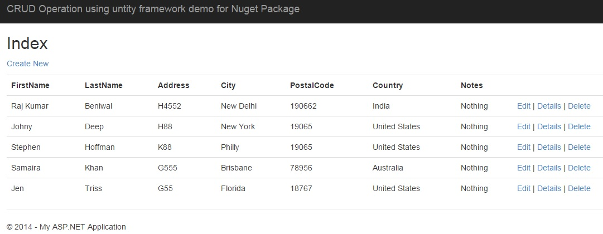&nbsp;

Image 1

<strong>Add The NuGet Package to you Project</strong>

<ul>
<li>Right click on project&rsquo;s References and choose and click Manage NuGet Packages.
</li></ul>

&nbsp;

Image 2

<ul>
<li>In the NuGet Package Manager, select online from the menu and search &ldquo;New NuGet Package&rdquo;, and click install.
</li></ul>

&nbsp;

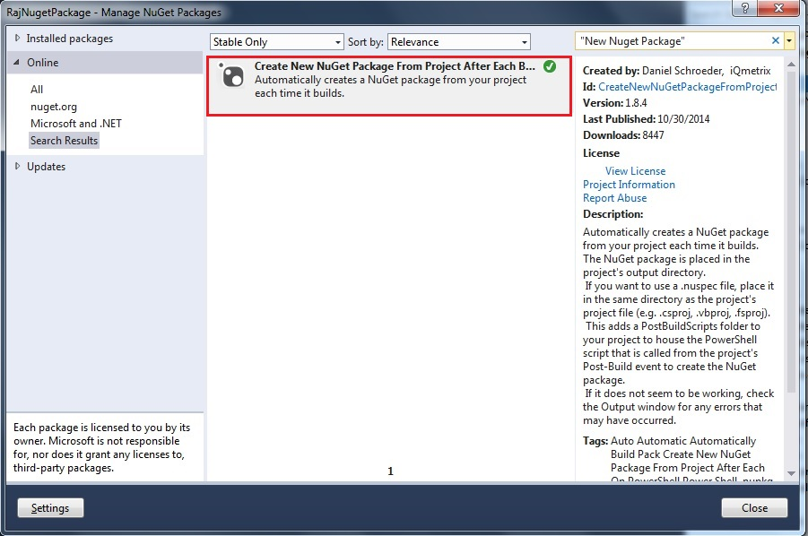&nbsp;

Image 3

<ul>
<li>Now you can see _CreateNewNuGetPackage folder added to your project that contains the files used to create a NuGet package from your project after each build.
</li></ul>

&nbsp;

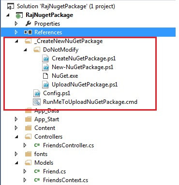

Image 4

Now build your project to generate package, as you can see NuGet Package file (.nupkg) is created in project&rsquo;s output directory.

&nbsp;

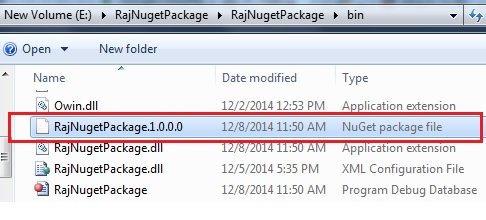

Image 5

If you want to change your package&rsquo;s version number, apiKey, Platform, release note etc. You can edit Config.ps1 file.

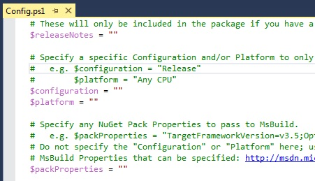&nbsp;

Image 6

<strong>Push Package to NuGet Gallery.</strong>

Right click on RunMeToUploadNuGetPackage under _CreateNewNuGetPackage folder and click Run.

<strong>&nbsp;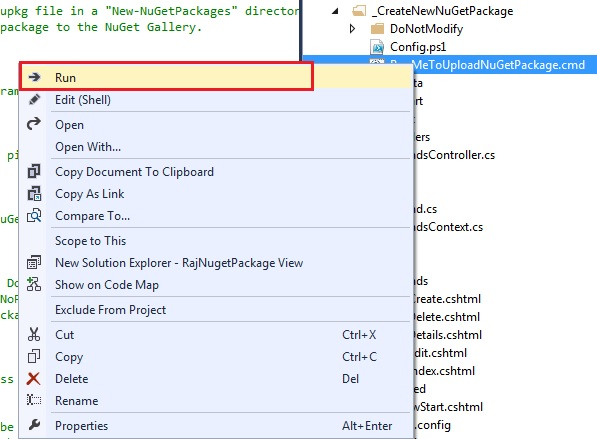</strong><strong>&nbsp;</strong>

Image 7

If you don&rsquo;t see Run command then download and install, you can get this functionality by installing the VSCommands
<a href="https://visualstudiogallery.msdn.microsoft.com/c6d1c265-7007-405c-a68b-5606af238ece">
Visual Studio extension</a>; otherwise you will need to run the batch file from Windows/File Explorer.

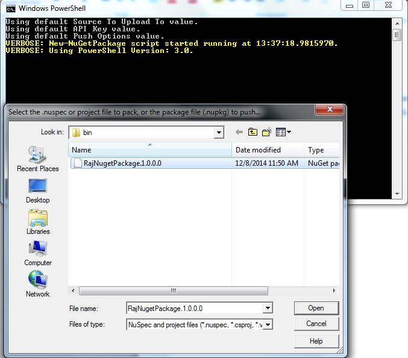&nbsp;

Image 8

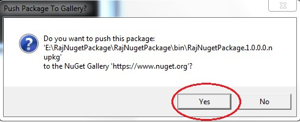&nbsp;

Image 9.

Make sure when you build application there is no error occurred.

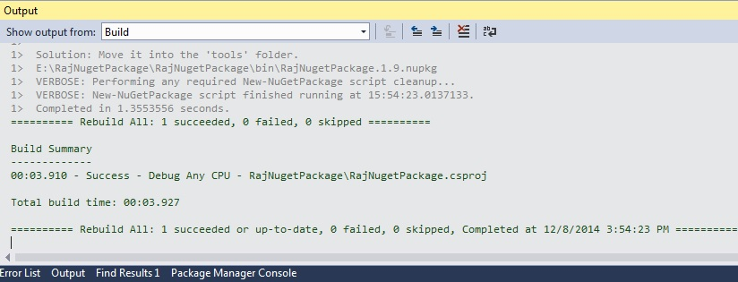&nbsp;

Image 10

You can see your package list on <a href="http://www.nuget.org/">www.nuget.org</a> after login on my packages.

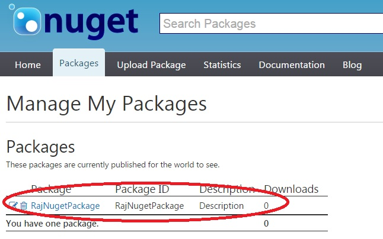&nbsp;

Image 11

You can search online on nuget package by using name.

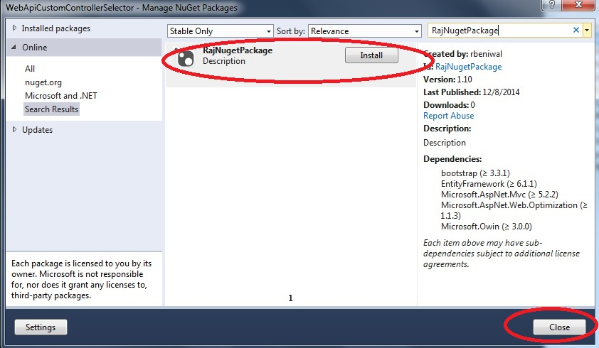&nbsp;

Image 12

Note &ndash; You have to provide NuGet ApiKey which is available in my account when you login on nuget website.

&nbsp;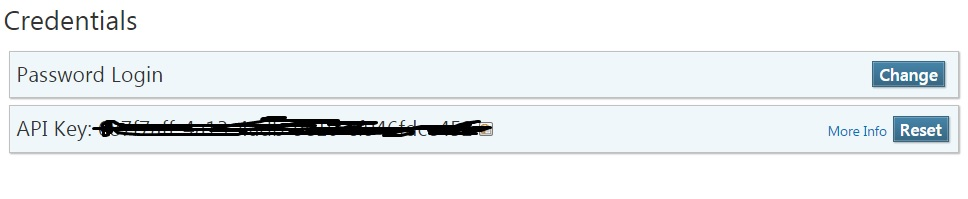

Image 13

<strong>&nbsp;</strong>

<strong>Conclusion-</strong>In this article we have learned how to create NuGet Package and how to push that package to NuGet Gallery.

