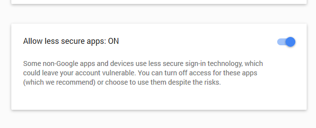

# Create and send an email reply in C# / VB.NET
## Requires
- Visual Studio 2015
## License
- MIT
## Technologies
- C#
- .NET Framework
- VB.Net
## Topics
- C#
- Send Email
- VB.Net
- Reply Email
## Updated
- 09/02/2016
## Description

Here you can download the latest version of the demo .NET application, with C# and VB.NET source code: 
<a href="http://www.gemboxsoftware.com/Email/Articles/EmailReply.zip">Download EmailReply.zip</a>

<h2>Introduction</h2>

Some time ago I needed a <strong>solution for sending email replies using C#</strong>. An internet search didn&rsquo;t return any usable examples, so I needed to investigate it on my own. I wrote this article in the hope that it would be useful for someone
 trying to <strong>create and send an email message reply programmatically in a .NET application</strong>. It was mainly to save you the trouble of going through RFC documents and understanding the email message format (MIME).

<h2 id="EmailReplyStandard">Email reply standard</h2>

The <a href="https://en.wikipedia.org/wiki/MIME">MIME</a>&nbsp;standard extends the original ASCII text-only email format to support character sets other than ASCII, non-text attachments and multipart message bodies. Although the standard is very old, it
 is still in use and most of today&rsquo;s email messages are still sent and received in this format.

The format is specified in a few RFC documents, but since each of them has been updated, it took me a while to find the info on writing reply messages.
<a href="https://tools.ietf.org/html/rfc2822#section-3.6.4">RFC 2822</a> defines <em>
&ldquo;identification fields&rdquo;</em>, better known as headers, which need to be defined in an email message reply. For an email message to qualify as a reply, it needs to contain the headers
<em>&ldquo;In-Reply-To&rdquo;</em> and <em>&ldquo;References&rdquo;</em>.

The standard also states that you should prefix the email message subject with &ldquo;Re:&rdquo; (from Latin &ldquo;res&rdquo; meaning &ldquo;in the matter of&rdquo;), although it is not mandatory.

<h2>What about the email message body?</h2>

It came as a surprise to me that the email message reply examples in <a href="https://tools.ietf.org/html/rfc2822#appendix-A.2">
RFC 2822</a> <em>don&rsquo;t include the original email message body</em>, especially since all of the email replies in my inbox do. It&rsquo;s because most of the commonly used email clients have this option enabled by default, but it can be disabled.

Although there is no standard defining the format for quoting in a plain text message, the '&gt;' sign is the most commonly used quote prefix char. Basically, you prefix every line of the original message text with a '&gt;' sign. You can read more about
 it <a href="https://en.wikipedia.org/wiki/Posting_style">here</a>. For HTML message bodies, there is no standard at all. Not even a convention. You are free to include the original text any way you see fit. Most of the email clients use the
<code>&lt;blockquote&gt;</code> tag, but some use the <code>&lt;div&gt;</code> tag with custom styling.

<em>Screenshot of an email message reply</em>

<h2>C# / VB.NET code</h2>

Now that we have some knowledge of the subject, we can take a look at the code.

<pre class="csharp">

C#Visual Basic

Edit|Remove
csharpvb

<pre class="csharp">static&nbsp;void&nbsp;Main(string[]&nbsp;args)&nbsp;
{&nbsp;
&nbsp;&nbsp;&nbsp;&nbsp;//&nbsp;Download&nbsp;unread&nbsp;messages&nbsp;from&nbsp;the&nbsp;server&nbsp;
&nbsp;&nbsp;&nbsp;&nbsp;IEnumerable&nbsp;messages&nbsp;=&nbsp;GetMessages();&nbsp;
&nbsp;&nbsp;&nbsp;&nbsp;if&nbsp;(messages&nbsp;!=&nbsp;null)&nbsp;
&nbsp;&nbsp;&nbsp;&nbsp;{&nbsp;
&nbsp;&nbsp;&nbsp;&nbsp;&nbsp;&nbsp;&nbsp;&nbsp;Console.WriteLine(messages.Count().ToString()&nbsp;&#43;&nbsp;&quot;&nbsp;new&nbsp;message(s).&quot;);&nbsp;
&nbsp;
&nbsp;&nbsp;&nbsp;&nbsp;&nbsp;&nbsp;&nbsp;&nbsp;//&nbsp;Create&nbsp;message&nbsp;replies&nbsp;
&nbsp;&nbsp;&nbsp;&nbsp;&nbsp;&nbsp;&nbsp;&nbsp;List&nbsp;replies&nbsp;=&nbsp;new&nbsp;List();&nbsp;
&nbsp;&nbsp;&nbsp;&nbsp;&nbsp;&nbsp;&nbsp;&nbsp;foreach&nbsp;(MailMessage&nbsp;msg&nbsp;in&nbsp;messages)&nbsp;
&nbsp;&nbsp;&nbsp;&nbsp;&nbsp;&nbsp;&nbsp;&nbsp;{&nbsp;
&nbsp;&nbsp;&nbsp;&nbsp;&nbsp;&nbsp;&nbsp;&nbsp;&nbsp;&nbsp;&nbsp;&nbsp;replies.Add(CreateReply(msg));&nbsp;
&nbsp;&nbsp;&nbsp;&nbsp;&nbsp;&nbsp;&nbsp;&nbsp;&nbsp;&nbsp;&nbsp;&nbsp;msg.Dispose();&nbsp;
&nbsp;&nbsp;&nbsp;&nbsp;&nbsp;&nbsp;&nbsp;&nbsp;}&nbsp;
&nbsp;
&nbsp;&nbsp;&nbsp;&nbsp;&nbsp;&nbsp;&nbsp;&nbsp;&nbsp;&nbsp;&nbsp;&nbsp;//&nbsp;Send&nbsp;replies&nbsp;
&nbsp;&nbsp;&nbsp;&nbsp;&nbsp;&nbsp;&nbsp;&nbsp;&nbsp;&nbsp;&nbsp;&nbsp;SendReplies(replies);&nbsp;
&nbsp;&nbsp;&nbsp;&nbsp;}&nbsp;
&nbsp;&nbsp;&nbsp;&nbsp;else&nbsp;
&nbsp;&nbsp;&nbsp;&nbsp;{&nbsp;
&nbsp;&nbsp;&nbsp;&nbsp;&nbsp;&nbsp;&nbsp;&nbsp;Console.WriteLine(&quot;No&nbsp;new&nbsp;messages.&quot;);&nbsp;
&nbsp;&nbsp;&nbsp;&nbsp;}&nbsp;
&nbsp;
&nbsp;&nbsp;&nbsp;&nbsp;Console.WriteLine(&quot;Press&nbsp;any&nbsp;key&nbsp;to&nbsp;exit...&quot;);&nbsp;
&nbsp;&nbsp;&nbsp;&nbsp;Console.ReadKey();&nbsp;
}</pre>

</pre>

Method <code>Main</code> first checks if there are any new unseen email messages on the server. If
<code>GetMessages</code> returns a not-null enumeration of email messages, the result is enumerated and a reply message is created for each item, using the
<code>CreateReply</code> method. Since the original email messages won&rsquo;t be needed any more, they are disposed of after creating the replies. At the end, the replies are passed to the
<code>SendReplies</code> method which will send them using <code>System.Net.SmtpClient</code>. Since this is a console application, progress info is displayed on the console window.

<h3>Reading emails with an IMAP client</h3>

There are two standard email protocols that can be used for fetching email messages, POP and IMAP. Unfortunately, the .NET framework doesn&rsquo;t provide support for either of them. It supports only SMTP, which can be used only for sending email messages.
 The following code uses <a href="https://github.com/smiley22/S22.Imap">S22.Imap</a>, a third party IMAP client for downloading messages from the server.

&nbsp;

C#Visual Basic

Edit|Remove

csharpvb

<pre class="csharp">private&nbsp;static&nbsp;IEnumerable&nbsp;GetMessages()&nbsp;
{&nbsp;
&nbsp;&nbsp;&nbsp;&nbsp;using&nbsp;(ImapClient&nbsp;client&nbsp;=&nbsp;new&nbsp;ImapClient(imapHost,&nbsp;993,&nbsp;true))&nbsp;
&nbsp;&nbsp;&nbsp;&nbsp;{&nbsp;
&nbsp;&nbsp;&nbsp;&nbsp;&nbsp;&nbsp;&nbsp;&nbsp;Console.WriteLine(&quot;Connected&nbsp;to&nbsp;&quot;&nbsp;&#43;&nbsp;imapHost&nbsp;&#43;&nbsp;'.');&nbsp;
&nbsp;
&nbsp;&nbsp;&nbsp;&nbsp;&nbsp;&nbsp;&nbsp;&nbsp;//&nbsp;Login&nbsp;
&nbsp;&nbsp;&nbsp;&nbsp;&nbsp;&nbsp;&nbsp;&nbsp;client.Login(imapUser,&nbsp;imapPassword,&nbsp;AuthMethod.Auto);&nbsp;
&nbsp;&nbsp;&nbsp;&nbsp;&nbsp;&nbsp;&nbsp;&nbsp;Console.WriteLine(&quot;Authenticated.&quot;);&nbsp;
&nbsp;
&nbsp;&nbsp;&nbsp;&nbsp;&nbsp;&nbsp;&nbsp;&nbsp;//&nbsp;Get&nbsp;a&nbsp;collection&nbsp;of&nbsp;all&nbsp;unseen&nbsp;messages&nbsp;in&nbsp;the&nbsp;INBOX&nbsp;folder&nbsp;
&nbsp;&nbsp;&nbsp;&nbsp;&nbsp;&nbsp;&nbsp;&nbsp;client.DefaultMailbox&nbsp;=&nbsp;&quot;INBOX&quot;;&nbsp;
&nbsp;&nbsp;&nbsp;&nbsp;&nbsp;&nbsp;&nbsp;&nbsp;IEnumerable&nbsp;uids&nbsp;=&nbsp;client.Search(SearchCondition.Unseen());&nbsp;
&nbsp;
&nbsp;&nbsp;&nbsp;&nbsp;&nbsp;&nbsp;&nbsp;&nbsp;if&nbsp;(uids.Count()&nbsp;==&nbsp;0)&nbsp;
&nbsp;&nbsp;&nbsp;&nbsp;&nbsp;&nbsp;&nbsp;&nbsp;&nbsp;&nbsp;&nbsp;&nbsp;return&nbsp;null;&nbsp;
&nbsp;
&nbsp;&nbsp;&nbsp;&nbsp;&nbsp;&nbsp;&nbsp;&nbsp;return&nbsp;client.GetMessages(uids);&nbsp;
&nbsp;&nbsp;&nbsp;&nbsp;}&nbsp;
}</pre>

&nbsp;

S22.Imap makes retrieving new messages a trivial task. First, you need to initialize a new
<code>ImapClient</code>, which connects to the server. The next step is authentication, which is executed by calling the
<code>Login</code> method with the mailbox username, password and authentication method as parameters. Use
<code>AuthMethod.Auto</code> because it will select the best authentication method that the server supports.

The next step is to set <em>&ldquo;INBOX&rdquo; as a default mailbox</em> and query the server for all unseen messages. The method returns an enumeration of message IDs. If that enumeration is not empty, the
<code>GetMessages</code> method is called, which will return an enumeration of <code>
<a class="libraryLink" href="https://msdn.microsoft.com/en-US/library/System.Net.Mail.MailMessage.aspx" target="_blank" title="Auto generated link to System.Net.Mail.MailMessage">System.Net.Mail.MailMessage</a></code> instances for the provided message IDs.

<h3>Creating a reply message</h3>

After all the unseen messages have been downloaded, replies are created by calling the
<code>CreateReply</code> method in a loop, as you can see in the following code snippet:

C#Visual Basic

Edit|Remove

csharpvb

<pre class="csharp">//&nbsp;Create&nbsp;message&nbsp;replies&nbsp;
List&nbsp;replies&nbsp;=&nbsp;new&nbsp;List();&nbsp;
foreach&nbsp;(MailMessage&nbsp;msg&nbsp;in&nbsp;messages)&nbsp;
{&nbsp;
&nbsp;&nbsp;&nbsp;&nbsp;replies.Add(CreateReply(msg));&nbsp;
&nbsp;&nbsp;&nbsp;&nbsp;msg.Dispose();&nbsp;
}</pre>

The <code>CreateReply</code> method first creates a new mail message with the sender and receiver addresses swapped.

&nbsp;

C#Visual Basic

Edit|Remove

csharpvb

<pre class="csharp">MailMessage&nbsp;reply&nbsp;=&nbsp;new&nbsp;MailMessage(new&nbsp;MailAddress(imapUser,&nbsp;&quot;Sender&quot;),&nbsp;source.From);</pre>

<code>source.To</code> cannot be used as a <em>from</em> parameter since it is a collection of email addresses instead of a single address and it might contain multiple addresses, so you could end up with the wrong one. In the example
 code, I have used a username defined for IMAP server authentication. Be sure to specify the full email address of the user as a username, when using your credentials, or it won&rsquo;t work as expected.

&nbsp;

The first thing you need to do with a reply message is to add the required headers. As explained in the
<a href="#EmailReplyStandard">Email reply standard</a> section, these are <em>&quot;In-Reply-To&quot;</em> and
<em>&quot;References&quot;</em>.

&nbsp;

C#Visual Basic

Edit|Remove

csharpvb

<pre class="csharp">string&nbsp;id&nbsp;=&nbsp;source.Headers[&quot;Message-ID&quot;];&nbsp;
reply.Headers.Add(&quot;In-Reply-To&quot;,&nbsp;id);&nbsp;
&nbsp;
string&nbsp;references&nbsp;=&nbsp;source.Headers[&quot;References&quot;];&nbsp;
&nbsp;
if&nbsp;(!string.IsNullOrEmpty(references))&nbsp;
&nbsp;&nbsp;&nbsp;&nbsp;references&nbsp;&#43;=&nbsp;'&nbsp;';&nbsp;
&nbsp;
reply.Headers.Add(&quot;References&quot;,&nbsp;references&nbsp;&#43;&nbsp;id);</pre>

Although <em>&quot;Message-ID&quot;</em> header is not mandatory, most messages will contain it, especially those from major providers like Gmail, Yahoo, Outlook, etc. For that reason, the
<code>id</code> variable is not checked.

&nbsp;

Next, if not already prefixed, prefix the reply subject with &quot;Re:&quot;.

C#Visual Basic

Edit|Remove

csharpvb

<pre class="csharp">//&nbsp;Add&nbsp;subject&nbsp;
if&nbsp;(!source.Subject.StartsWith(&quot;Re:&quot;,&nbsp;StringComparison.OrdinalIgnoreCase))&nbsp;
&nbsp;&nbsp;&nbsp;&nbsp;reply.Subject&nbsp;=&nbsp;&quot;Re:&nbsp;&quot;;&nbsp;
&nbsp;
reply.Subject&nbsp;&#43;=&nbsp;source.Subject;</pre>

&nbsp;Finally, the reply body is composed, depending on the source message body type.

&nbsp;

C#Visual Basic

Edit|Remove

csharpvb

<pre class="csharp">StringBuilder&nbsp;body&nbsp;=&nbsp;new&nbsp;StringBuilder();&nbsp;
if&nbsp;(source.IsBodyHtml)&nbsp;
{&nbsp;
&nbsp;&nbsp;&nbsp;&nbsp;body.Append(&quot;&lt;p&gt;Thank&nbsp;you&nbsp;for&nbsp;your&nbsp;email!&lt;/p&gt;&quot;);&nbsp;
&nbsp;&nbsp;&nbsp;&nbsp;body.Append(&quot;&lt;p&gt;We&nbsp;are&nbsp;currently&nbsp;out&nbsp;of&nbsp;the&nbsp;office,&nbsp;but&nbsp;we&nbsp;will&nbsp;respond&nbsp;as&nbsp;soon&nbsp;as&nbsp;possible.&lt;/p&gt;&quot;);&nbsp;
&nbsp;&nbsp;&nbsp;&nbsp;body.Append(&quot;&lt;p&gt;Best&nbsp;regards,&lt;br/&gt;&quot;);&nbsp;
&nbsp;&nbsp;&nbsp;&nbsp;body.Append(senderName);&nbsp;
&nbsp;&nbsp;&nbsp;&nbsp;body.Append(&quot;&lt;/p&gt;&quot;);&nbsp;
&nbsp;&nbsp;&nbsp;&nbsp;body.Append(&quot;&lt;br/&gt;&quot;);&nbsp;
&nbsp;
&nbsp;&nbsp;&nbsp;&nbsp;body.Append(&quot;&lt;div&gt;&quot;);&nbsp;
&nbsp;&nbsp;&nbsp;&nbsp;if&nbsp;(source.Date().HasValue)&nbsp;
&nbsp;&nbsp;&nbsp;&nbsp;&nbsp;&nbsp;&nbsp;&nbsp;body.AppendFormat(&quot;On&nbsp;{0},&quot;,&nbsp;source.Date().Value.ToString(CultureInfo.InvariantCulture));&nbsp;
&nbsp;
&nbsp;&nbsp;&nbsp;&nbsp;if&nbsp;(!string.IsNullOrEmpty(source.From.DisplayName))&nbsp;
&nbsp;&nbsp;&nbsp;&nbsp;&nbsp;&nbsp;&nbsp;&nbsp;body.Append(source.From.DisplayName&nbsp;&#43;&nbsp;'&nbsp;');&nbsp;
&nbsp;
&nbsp;&nbsp;&nbsp;&nbsp;body.AppendFormat(&quot;&lt;&lt;a&nbsp;href=\&quot;mailto:{0}\&quot;&gt;{0}&lt;/a&gt;&gt;&nbsp;wrote:&lt;br/&gt;&quot;,&nbsp;source.From.Address);&nbsp;
&nbsp;
&nbsp;&nbsp;&nbsp;&nbsp;if&nbsp;(!string.IsNullOrEmpty(source.Body))&nbsp;
&nbsp;&nbsp;&nbsp;&nbsp;{&nbsp;
&nbsp;&nbsp;&nbsp;&nbsp;&nbsp;&nbsp;&nbsp;&nbsp;body.Append(&quot;&lt;blockqoute&nbsp;style=\&quot;margin:&nbsp;0&nbsp;0&nbsp;0&nbsp;5px;border-left:2px&nbsp;blue&nbsp;solid;padding-left:5px\&quot;&gt;&quot;);&nbsp;
&nbsp;&nbsp;&nbsp;&nbsp;&nbsp;&nbsp;&nbsp;&nbsp;body.Append(source.Body);&nbsp;
&nbsp;&nbsp;&nbsp;&nbsp;&nbsp;&nbsp;&nbsp;&nbsp;body.Append(&quot;&lt;/blockquote&gt;&quot;);&nbsp;
&nbsp;&nbsp;&nbsp;&nbsp;}&nbsp;
&nbsp;
&nbsp;&nbsp;&nbsp;&nbsp;body.Append(&quot;&lt;/div&gt;&quot;);&nbsp;
}&nbsp;
else&nbsp;
{&nbsp;
&nbsp;&nbsp;&nbsp;&nbsp;body.AppendLine(&quot;Thank&nbsp;you&nbsp;for&nbsp;your&nbsp;email!&quot;);&nbsp;
&nbsp;&nbsp;&nbsp;&nbsp;body.AppendLine();&nbsp;
&nbsp;&nbsp;&nbsp;&nbsp;body.AppendLine(&quot;We&nbsp;are&nbsp;currently&nbsp;out&nbsp;of&nbsp;the&nbsp;office,&nbsp;but&nbsp;we&nbsp;will&nbsp;respond&nbsp;as&nbsp;soon&nbsp;as&nbsp;possible.&quot;);&nbsp;
&nbsp;&nbsp;&nbsp;&nbsp;body.AppendLine();&nbsp;
&nbsp;&nbsp;&nbsp;&nbsp;body.AppendLine(&quot;Best&nbsp;regards,&quot;);&nbsp;
&nbsp;&nbsp;&nbsp;&nbsp;body.AppendLine(senderName);&nbsp;
&nbsp;&nbsp;&nbsp;&nbsp;body.AppendLine();&nbsp;
&nbsp;
&nbsp;&nbsp;&nbsp;&nbsp;if&nbsp;(source.Date().HasValue)&nbsp;
&nbsp;&nbsp;&nbsp;&nbsp;&nbsp;&nbsp;&nbsp;&nbsp;body.AppendFormat(&quot;On&nbsp;{0},&nbsp;&quot;,&nbsp;source.Date().Value.ToString(CultureInfo.InvariantCulture));&nbsp;
&nbsp;
&nbsp;&nbsp;&nbsp;&nbsp;body.Append(source.From);&nbsp;
&nbsp;&nbsp;&nbsp;&nbsp;body.AppendLine(&quot;&nbsp;wrote:&quot;);&nbsp;
&nbsp;
&nbsp;&nbsp;&nbsp;&nbsp;if&nbsp;(!string.IsNullOrEmpty(source.Body))&nbsp;
&nbsp;&nbsp;&nbsp;&nbsp;{&nbsp;
&nbsp;&nbsp;&nbsp;&nbsp;&nbsp;&nbsp;&nbsp;&nbsp;body.AppendLine();&nbsp;
&nbsp;&nbsp;&nbsp;&nbsp;&nbsp;&nbsp;&nbsp;&nbsp;body.Append(&quot;&gt;&nbsp;&quot;&nbsp;&#43;&nbsp;source.Body.Replace(&quot;\r\n&quot;,&nbsp;&quot;\r\n&gt;&nbsp;&quot;));&nbsp;
&nbsp;&nbsp;&nbsp;&nbsp;}&nbsp;&nbsp;&nbsp;&nbsp;&nbsp;
}&nbsp;
&nbsp;
reply.Body&nbsp;=&nbsp;body.ToString();&nbsp;
reply.IsBodyHtml&nbsp;=&nbsp;source.IsBodyHtml;</pre>

&nbsp;

I have used very simple text for the reply body, but you can see that the <code>
&lt;blockqoute&gt;</code> tag is used for the HTML body and the '&gt;' prefix for the plain text body.

<h3>Sending emails with an SMTP client</h3>

Newly created message replies are sent using the standard .NET <code>SmtpClient</code>. The process is quite straightforward as you can see in the code below:

&nbsp;

C#Visual Basic

Edit|Remove

csharpvb

<pre class="csharp">using&nbsp;(SmtpClient&nbsp;client&nbsp;=&nbsp;new&nbsp;SmtpClient(smtpHost,&nbsp;587))&nbsp;
{&nbsp;
&nbsp;&nbsp;&nbsp;&nbsp;//&nbsp;Set&nbsp;SMTP&nbsp;client&nbsp;properties&nbsp;
&nbsp;&nbsp;&nbsp;&nbsp;client.EnableSsl&nbsp;=&nbsp;true;&nbsp;
&nbsp;&nbsp;&nbsp;&nbsp;client.UseDefaultCredentials&nbsp;=&nbsp;false;&nbsp;
&nbsp;&nbsp;&nbsp;&nbsp;client.Credentials&nbsp;=&nbsp;new&nbsp;NetworkCredential(smtpUser,&nbsp;smtpPassword);&nbsp;
&nbsp;&nbsp;&nbsp;&nbsp;client.DeliveryFormat&nbsp;=&nbsp;SmtpDeliveryFormat.International;&nbsp;
&nbsp;
&nbsp;&nbsp;&nbsp;&nbsp;//&nbsp;Send&nbsp;
&nbsp;&nbsp;&nbsp;&nbsp;bool&nbsp;retry&nbsp;=&nbsp;true;&nbsp;
&nbsp;&nbsp;&nbsp;&nbsp;foreach&nbsp;(MailMessage&nbsp;msg&nbsp;in&nbsp;replies)&nbsp;
&nbsp;&nbsp;&nbsp;&nbsp;{&nbsp;
&nbsp;&nbsp;&nbsp;&nbsp;&nbsp;&nbsp;&nbsp;&nbsp;try&nbsp;
&nbsp;&nbsp;&nbsp;&nbsp;&nbsp;&nbsp;&nbsp;&nbsp;{&nbsp;
&nbsp;&nbsp;&nbsp;&nbsp;&nbsp;&nbsp;&nbsp;&nbsp;&nbsp;&nbsp;&nbsp;&nbsp;client.Send(msg);&nbsp;
&nbsp;&nbsp;&nbsp;&nbsp;&nbsp;&nbsp;&nbsp;&nbsp;&nbsp;&nbsp;&nbsp;&nbsp;retry&nbsp;=&nbsp;true;&nbsp;
&nbsp;&nbsp;&nbsp;&nbsp;&nbsp;&nbsp;&nbsp;&nbsp;}&nbsp;
&nbsp;&nbsp;&nbsp;&nbsp;&nbsp;&nbsp;&nbsp;&nbsp;catch&nbsp;(Exception&nbsp;ex)&nbsp;
&nbsp;&nbsp;&nbsp;&nbsp;&nbsp;&nbsp;&nbsp;&nbsp;{&nbsp;
&nbsp;&nbsp;&nbsp;&nbsp;&nbsp;&nbsp;&nbsp;&nbsp;&nbsp;&nbsp;&nbsp;&nbsp;if&nbsp;(!retry)&nbsp;
&nbsp;&nbsp;&nbsp;&nbsp;&nbsp;&nbsp;&nbsp;&nbsp;&nbsp;&nbsp;&nbsp;&nbsp;{&nbsp;
&nbsp;&nbsp;&nbsp;&nbsp;&nbsp;&nbsp;&nbsp;&nbsp;&nbsp;&nbsp;&nbsp;&nbsp;&nbsp;&nbsp;&nbsp;&nbsp;Console.WriteLine(&quot;Failed&nbsp;to&nbsp;send&nbsp;reply&nbsp;to&nbsp;&quot;&nbsp;&#43;&nbsp;
&nbsp;&nbsp;&nbsp;&nbsp;&nbsp;&nbsp;&nbsp;&nbsp;&nbsp;&nbsp;&nbsp;&nbsp;&nbsp;&nbsp;&nbsp;&nbsp;msg.To.ToString()&nbsp;&#43;&nbsp;'.');&nbsp;
&nbsp;&nbsp;&nbsp;&nbsp;&nbsp;&nbsp;&nbsp;&nbsp;&nbsp;&nbsp;&nbsp;&nbsp;&nbsp;&nbsp;&nbsp;&nbsp;Console.WriteLine(&quot;Exception:&nbsp;&quot;&nbsp;&#43;&nbsp;ex.Message);&nbsp;
&nbsp;&nbsp;&nbsp;&nbsp;&nbsp;&nbsp;&nbsp;&nbsp;&nbsp;&nbsp;&nbsp;&nbsp;&nbsp;&nbsp;&nbsp;&nbsp;return;&nbsp;
&nbsp;&nbsp;&nbsp;&nbsp;&nbsp;&nbsp;&nbsp;&nbsp;&nbsp;&nbsp;&nbsp;&nbsp;}&nbsp;
&nbsp;
&nbsp;&nbsp;&nbsp;&nbsp;&nbsp;&nbsp;&nbsp;&nbsp;&nbsp;&nbsp;&nbsp;&nbsp;retry&nbsp;=&nbsp;false;&nbsp;
&nbsp;&nbsp;&nbsp;&nbsp;&nbsp;&nbsp;&nbsp;&nbsp;}&nbsp;
&nbsp;&nbsp;&nbsp;&nbsp;&nbsp;&nbsp;&nbsp;&nbsp;finally&nbsp;
&nbsp;&nbsp;&nbsp;&nbsp;&nbsp;&nbsp;&nbsp;&nbsp;{&nbsp;
&nbsp;&nbsp;&nbsp;&nbsp;&nbsp;&nbsp;&nbsp;&nbsp;&nbsp;&nbsp;&nbsp;&nbsp;msg.Dispose();&nbsp;
&nbsp;&nbsp;&nbsp;&nbsp;&nbsp;&nbsp;&nbsp;&nbsp;}&nbsp;
&nbsp;&nbsp;&nbsp;&nbsp;}&nbsp;
&nbsp;
&nbsp;&nbsp;&nbsp;&nbsp;Console.WriteLine(&quot;All&nbsp;replies&nbsp;successfully&nbsp;sent.&quot;);&nbsp;
}</pre>

&nbsp;

To prevent the application from crashing on single message errors, all exceptions are ignored. Still, there might be an error with the SMTP server or credentials that will cause every message to fail, so for that reason, I have used a very simple and primitive
 retry pattern. Basically, it uses a bool variable to break the sending loop when there are two exceptions in a row.

<em>Screenshot of the EmailReply application&rsquo;s console window</em>

<h2>Alternatives</h2>

Since the .NET Framework doesn&rsquo;t provide any means for downloading email messages from the server, the code presented in this article uses the
<a href="https://github.com/smiley22/S22.Imap">S22.Imap</a> component for that task. As the name suggests, the library communicates with the server using the IMAP protocol. Another very commonly used protocol is POP, and there are even more components for it
 on the internet since POP is a much older and simpler protocol. <a href="http://hpop.sourceforge.net/">
OpenPop</a> is the most popular, but <a href="https://github.com/smiley22/S22.Pop3">
S22.Pop3</a> is a good choice as well since it uses the <code><a class="libraryLink" href="https://msdn.microsoft.com/en-US/library/System.Net.Mail.MailMessage.aspx" target="_blank" title="Auto generated link to System.Net.Mail.MailMessage">System.Net.Mail.MailMessage</a></code> class instead of the custom message class used by OpenPop. Another alternative is to use all-in-one components, like
<a href="http://www.gemboxsoftware.com/Email/Overview">GemBox.Email</a>, which have IMAP, POP and custom SMTP clients with extended possibilities.

<h2>Gmail security</h2>

Being one of the most used email providers, Google&rsquo;s Gmail service has a very high security standards. By default, POP, IMAP and common authentication mechanisms are disabled. To be able to use your Gmail account in the demo application supplied with
 this article, you need to do the following:

<h3>Enable POP or IMAP access for your account</h3>
<ol>
<li>

Log in to your Gmail account and select 'Settings' from the right side menu.

</li><li>

Select the 'Forwarding and POP/IMAP' tab and enable POP or IMAP, depending on which protocol you are going to use.

</li></ol>
<h3>Allow access for less secure applications</h3>
<ol>
<li>

Click on you account icon in the top right corner and select 'My Account'.

</li><li>

Click on 'Sign-in &amp; security' and, at the bottom of the page, set 'Allow less secure apps:' to ON.

</li></ol>
<h2>Conclusion</h2>

The aim of this article was to show that creating an email message reply is quite simple. All you need to do is add headers:
<em>&quot;In-Reply-To&quot;</em> and <em>&quot;References&quot;</em>. Everything else is optional. I hope this article and the attached console application will help you with your future .NET email applications.

