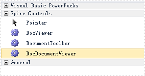
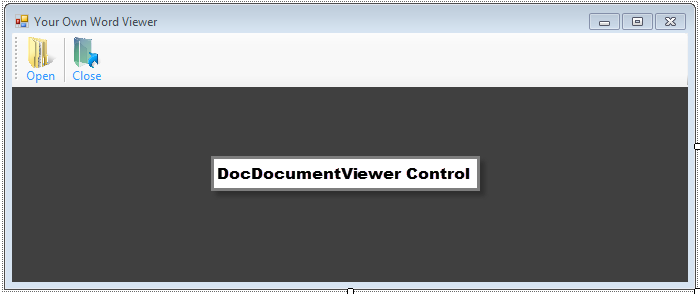

# Create your own Word Viewer using DocViewer control
## Requires
- Visual Studio 2010
## License
- MS-LPL
## Technologies
- C#
- Class Library
- Windows Forms
- WPF
## Topics
- Doc Viewer
- Word document viewer
- DocViewer control
## Updated
- 11/16/2016
## Description

<h1>Introduction</h1>

This sample presents how to create a simple Word document viewer in Windows Forms to open and close Word files using Spire.DocViewer control.<em>&nbsp;</em>

How to

Step 1:
<strong>Download
<a href="http://www.e-iceblue.com/Introduce/word-viewer-net-introduce.html">Spire.DocViewer</a>, add DocViewer Control to VS Toolbox.</strong>

 

&nbsp;

&nbsp;

&nbsp;

&nbsp;

&nbsp;

&nbsp;

<strong>Step 2: Create a Windows Forms application, design your Form1 as below.</strong>

<ul>
<li>Add &quot;Open&quot; button to open an existing Word file.
</li><li>Add &quot;Close&quot; button to shut down the open file.
</li><li>Drag &quot;DocDocumentViewer Control&quot; into Form1, which is used to display Word document.
</li></ul>

<strong>Step 3: In the Open click event,</strong>
<strong>create an OpenFileDialog to select the correct file type that you want to open. Call LoadFromFile method from DocDocumentViewer to load the Word file.</strong><strong>
 
</strong>

<strong>&nbsp;</strong>

<strong>

C#

Edit|Remove

csharp

<pre class="csharp">&nbsp;&nbsp;&nbsp;&nbsp;&nbsp;&nbsp;&nbsp;&nbsp;private&nbsp;void&nbsp;btnOpen_Click(object&nbsp;sender,&nbsp;EventArgs&nbsp;e)&nbsp;
&nbsp;&nbsp;&nbsp;&nbsp;&nbsp;&nbsp;&nbsp;&nbsp;{&nbsp;
&nbsp;&nbsp;&nbsp;&nbsp;&nbsp;&nbsp;&nbsp;&nbsp;&nbsp;&nbsp;&nbsp;&nbsp;//open&nbsp;a&nbsp;DOC&nbsp;document&nbsp;
&nbsp;&nbsp;&nbsp;&nbsp;&nbsp;&nbsp;&nbsp;&nbsp;&nbsp;&nbsp;&nbsp;&nbsp;OpenFileDialog&nbsp;dialog&nbsp;=&nbsp;new&nbsp;OpenFileDialog();&nbsp;
&nbsp;&nbsp;&nbsp;&nbsp;&nbsp;&nbsp;&nbsp;&nbsp;&nbsp;&nbsp;&nbsp;&nbsp;dialog.Filter&nbsp;=&nbsp;&quot;Word97-2003&nbsp;files(*.doc)|*.doc|Word2007-2010&nbsp;files&nbsp;(*.docx)|*.docx|All&nbsp;files&nbsp;(*.*)|*.*&quot;;&nbsp;
&nbsp;&nbsp;&nbsp;&nbsp;&nbsp;&nbsp;&nbsp;&nbsp;&nbsp;&nbsp;&nbsp;&nbsp;dialog.Title&nbsp;=&nbsp;&quot;Select&nbsp;a&nbsp;DOC&nbsp;file&quot;;&nbsp;
&nbsp;&nbsp;&nbsp;&nbsp;&nbsp;&nbsp;&nbsp;&nbsp;&nbsp;&nbsp;&nbsp;&nbsp;dialog.Multiselect&nbsp;=&nbsp;false;&nbsp;
&nbsp;&nbsp;&nbsp;&nbsp;&nbsp;&nbsp;&nbsp;&nbsp;&nbsp;&nbsp;&nbsp;&nbsp;dialog.InitialDirectory&nbsp;=&nbsp;<a class="libraryLink" href="https://msdn.microsoft.com/en-US/library/System.IO.Path.GetFullPath.aspx" target="_blank" title="Auto generated link to System.IO.Path.GetFullPath">System.IO.Path.GetFullPath</a>(@&quot;..\..\..\..\..\..\Data&quot;);&nbsp;
&nbsp;
&nbsp;&nbsp;&nbsp;&nbsp;&nbsp;&nbsp;&nbsp;&nbsp;&nbsp;&nbsp;&nbsp;&nbsp;DialogResult&nbsp;result&nbsp;=&nbsp;dialog.ShowDialog();&nbsp;
&nbsp;
&nbsp;&nbsp;&nbsp;&nbsp;&nbsp;&nbsp;&nbsp;&nbsp;&nbsp;&nbsp;&nbsp;&nbsp;if&nbsp;(result&nbsp;==&nbsp;DialogResult.OK)&nbsp;
&nbsp;&nbsp;&nbsp;&nbsp;&nbsp;&nbsp;&nbsp;&nbsp;&nbsp;&nbsp;&nbsp;&nbsp;{&nbsp;
&nbsp;&nbsp;&nbsp;&nbsp;&nbsp;&nbsp;&nbsp;&nbsp;&nbsp;&nbsp;&nbsp;&nbsp;&nbsp;&nbsp;&nbsp;&nbsp;try&nbsp;
&nbsp;&nbsp;&nbsp;&nbsp;&nbsp;&nbsp;&nbsp;&nbsp;&nbsp;&nbsp;&nbsp;&nbsp;&nbsp;&nbsp;&nbsp;&nbsp;{&nbsp;
&nbsp;&nbsp;&nbsp;&nbsp;&nbsp;&nbsp;&nbsp;&nbsp;&nbsp;&nbsp;&nbsp;&nbsp;&nbsp;&nbsp;&nbsp;&nbsp;&nbsp;&nbsp;&nbsp;&nbsp;//Load&nbsp;DOC&nbsp;document&nbsp;from&nbsp;file.&nbsp;
&nbsp;&nbsp;&nbsp;&nbsp;&nbsp;&nbsp;&nbsp;&nbsp;&nbsp;&nbsp;&nbsp;&nbsp;&nbsp;&nbsp;&nbsp;&nbsp;&nbsp;&nbsp;&nbsp;&nbsp;this.docDocumentViewer1.LoadFromFile(dialog.FileName);&nbsp;
&nbsp;&nbsp;&nbsp;&nbsp;&nbsp;&nbsp;&nbsp;&nbsp;&nbsp;&nbsp;&nbsp;&nbsp;&nbsp;&nbsp;&nbsp;&nbsp;}&nbsp;
&nbsp;&nbsp;&nbsp;&nbsp;&nbsp;&nbsp;&nbsp;&nbsp;&nbsp;&nbsp;&nbsp;&nbsp;&nbsp;&nbsp;&nbsp;&nbsp;catch&nbsp;(Exception&nbsp;ex)&nbsp;
&nbsp;&nbsp;&nbsp;&nbsp;&nbsp;&nbsp;&nbsp;&nbsp;&nbsp;&nbsp;&nbsp;&nbsp;&nbsp;&nbsp;&nbsp;&nbsp;{&nbsp;
&nbsp;&nbsp;&nbsp;&nbsp;&nbsp;&nbsp;&nbsp;&nbsp;&nbsp;&nbsp;&nbsp;&nbsp;&nbsp;&nbsp;&nbsp;&nbsp;&nbsp;&nbsp;&nbsp;&nbsp;MessageBox.Show(ex.Message,&nbsp;&quot;Error!&quot;,&nbsp;MessageBoxButtons.OK,&nbsp;MessageBoxIcon.Error);&nbsp;
&nbsp;&nbsp;&nbsp;&nbsp;&nbsp;&nbsp;&nbsp;&nbsp;&nbsp;&nbsp;&nbsp;&nbsp;&nbsp;&nbsp;&nbsp;&nbsp;}&nbsp;
&nbsp;&nbsp;&nbsp;&nbsp;&nbsp;&nbsp;&nbsp;&nbsp;&nbsp;&nbsp;&nbsp;&nbsp;}&nbsp;
&nbsp;&nbsp;&nbsp;&nbsp;&nbsp;&nbsp;&nbsp;&nbsp;}</pre>

</strong>

<strong>Step 4: Close the open file.</strong>

<strong>&nbsp;</strong>

<strong>

C#

Edit|Remove

csharp

<pre class="js">private&nbsp;void&nbsp;btnClose_Click(object&nbsp;sender,&nbsp;EventArgs&nbsp;e)&nbsp;
{&nbsp;
&nbsp;&nbsp;&nbsp;&nbsp;//Close&nbsp;current&nbsp;doc&nbsp;document.&nbsp;
&nbsp;&nbsp;&nbsp;&nbsp;this.docDocumentViewer1.CloseDocument();&nbsp;
}&nbsp;
</pre>

</strong>

<strong>Run the code and open with a sample file:</strong>

<strong>&nbsp;</strong>

<strong>&nbsp;</strong>

<strong>

</strong>

&nbsp;

<h1>More Information</h1>

<strong>Spire.DocViewer for .NET</strong> is a powerful Word Viewer component for developers to display, convert and interact with Word Documents easily. When developers use Spire.DocViewer for .NET
 within their own .NET application, they do not require any additional installation to manipulate Word Documents with high performance and strong stability.

 
Spire.DocViewer for .NET expresses scalability, time-saving and cost-effective to view and print Word Documents. Developers can render Word Documents by using Word elements including text, paragraph, image, list, table, bookmark
 etc. Furthermore, Spire.DocViewer for .NET allows developers to load all versions of Word Documents and convert Word Documents to PDF, HTML and RTF.

<strong>Related Links:</strong>

Website: <a href="http://www.e-iceblue.com">www.e-iceblue.com</a>

Product: <a href="http://www.e-iceblue.com/Introduce/word-viewer-net-introduce.html">
Spire.DocViewer</a>

