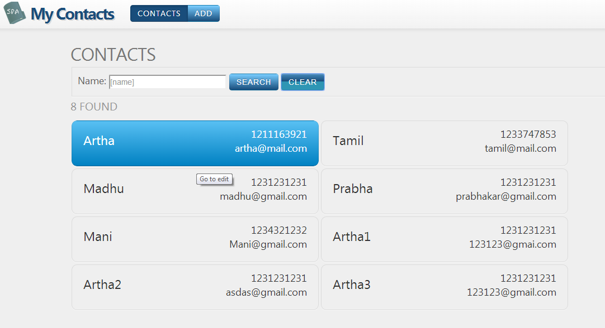
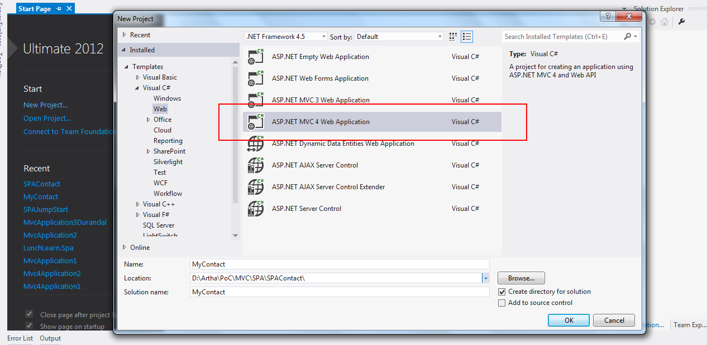
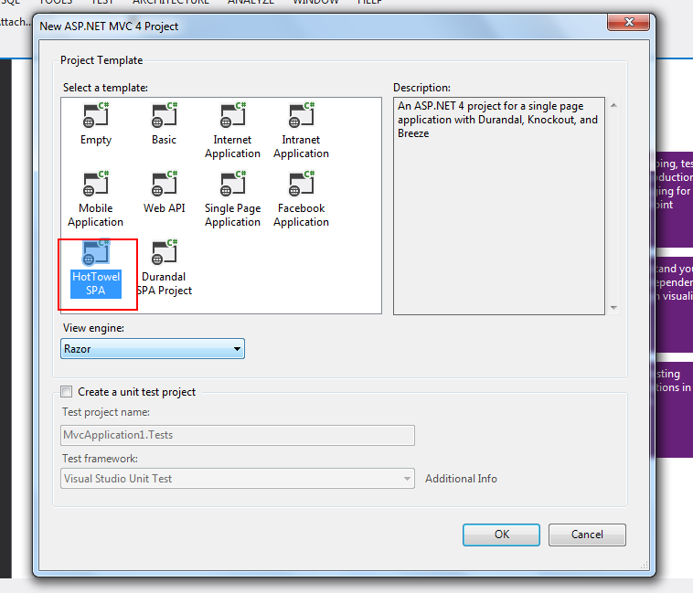
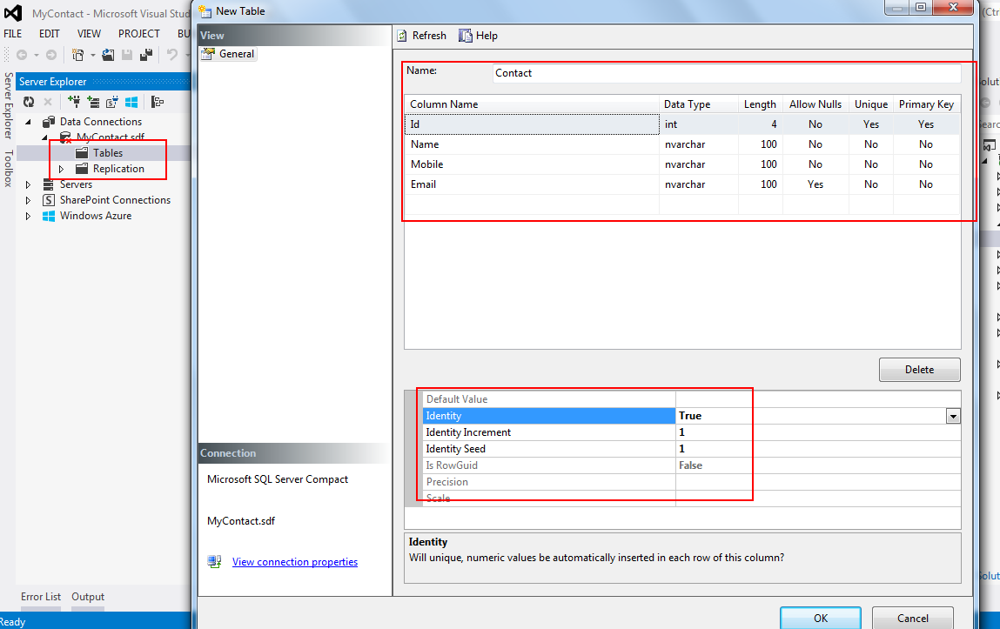

# Creating Single Page Application using Hot Towel Template
## Requires
- Visual Studio 2012
## License
- MS-LPL
## Technologies
- ASP.NET
- ViewModel pattern (MVVM)
- HTML5
- ASP.NET MVC 4
- ASP.NET Web API
- .NET 4.5
## Topics
- Single Page Application (SPA)
## Updated
- 02/21/2014
## Description

<h1>&nbsp;&nbsp;</h1>
<h1>Introduction</h1>

<strong>Single-Page Applications (SPAs)</strong> are Rich, Responsive Web apps that load a single HTML page and dynamically update that page as the user interacts with the app.

This code sample gives the demo application for creating Single Page Application using<strong> Hot Towel SPA Template</strong> (<strong>Knockout, Durandal, Breeze</strong>).&nbsp;<em> 
</em>

<em> 
 
</em>This application will be useful for understanding the basics of Single Page Application in some extend. If you follow and create the application your own, it will give great experience on SPA.&nbsp;

<h1>Building the Sample</h1>

Please take a look into the Durandal, Knockout and Breeze basics for more understands the below steps.

<strong><a href="http://durandaljs.com/" target="_blank">Durandal</a>&nbsp;</strong> 
 
Durandal is small JavaScript framework designed to make building Single Page Applications (SPAs) simple and elegant. &nbsp; 
<strong><a href="http://knockoutjs.com/index.html" target="_blank">Knockout</a></strong>

Knockout is a JavaScript library that helps you to create rich, responsive display and editor user interfaces with a clean underlying data model.&nbsp;

<strong><a href="http://www.breezejs.com/home" target="_blank">Breeze</a>&nbsp;</strong>

Breeze is a JavaScript library that helps you manage data in rich client applications. It store &amp; retrieve the data in database, execute queries etc.&nbsp;

 
<strong><a href="http://www.asp.net/single-page-application/overview/templates/hottowel-template" target="_blank">Hot Towel Template</a>&nbsp;</strong>

Hot Towel creates a great starting point for building a Single Page Application (SPA) with ASP.NET. It provides a modular structure for your code, view navigation, data binding, rich data management and simple but elegant styling. &nbsp;

<strong><a href="http://www.odata.org/" target="_blank">Open Data Protocol</a>&nbsp;</strong>

The purpose of the <strong>Open Data protocol (OData) </strong>is to provide a REST-based protocol for CRUD-style operations (Create, Read, Update and Delete) against resources exposed as data services.&nbsp;

<strong>Pre-requisites &nbsp; &nbsp;</strong>

To run this sample in development machine, machine should have <strong>Visual Studio 2012</strong> or higher and MVC 4 with
<strong>&nbsp;Hot Towel Template</strong>. If reader has some basic knowledge on <strong>
MVVM pattern</strong> it helps to understand better Hot Towel SPA.&nbsp;

Description

This code sample describes step by step creation of My Contact project using MVC 4 - Hot Towel Single Page Application Template.

I am explaining the step by step creation of My Contact project using MVC 4 Hot Towel SPA and I have written inline comment in the source code for better understanding the code. In this web page I am concentrating on steps for creating this application.&nbsp;

 
<strong>Step 1: Create My Contacts project using MVC 4 -&gt; Hot Towel SPA.</strong>

<em><strong></strong></em>

<em><strong> 
</strong></em>

<strong>Step 2: Create database &amp; table.</strong>

Create database under App_Data folder, please see the below image for database creation. &nbsp;

<em>App_Data -&gt; Add -&gt; New Items -&gt; SQL Server Compact 4.0 Local Database. &nbsp;</em>

It can be any database, but corresponding connection string has to mention in the web.config file.&nbsp;I am taking SQL Server Compact 4.0 Local Database.&nbsp;

Double click the <strong>MyContact.sdf </strong>file and create table with column Id, Name, Mobile, Email, see the below image.

Add the connection string information into<strong> web.config</strong> file. &nbsp;&nbsp;

XML

Edit|Remove

xml

<pre class="xml">&nbsp;&nbsp;&nbsp;&nbsp;&lt;connectionStrings&gt;&nbsp;
&nbsp;&nbsp;&nbsp;&nbsp;&lt;add&nbsp;name=&quot;MyContactDB&quot;&nbsp;connectionString=&quot;Data&nbsp;Source=|DataDirectory|MyContact.sdf&quot;&nbsp;providerName=&quot;System.Data.SqlServerCe.4.0&quot;&nbsp;/&gt;&nbsp;
&nbsp;&nbsp;&lt;/connectionStrings&gt;</pre>

<strong>Step 3: Create Model and DataContext Classes</strong>

 
Contact model class, Contact.cs and datacontext class MyContactDbcontext.cs under Models folder.&nbsp;

 
<strong>Contact.cs&nbsp;</strong>

C#

Edit|Remove

csharp

<pre class="js">public&nbsp;class&nbsp;Contact&nbsp;
&nbsp;&nbsp;&nbsp;&nbsp;{&nbsp;
&nbsp;&nbsp;&nbsp;&nbsp;&nbsp;&nbsp;&nbsp;&nbsp;public&nbsp;int&nbsp;Id&nbsp;{&nbsp;get;&nbsp;set;&nbsp;}&nbsp;
&nbsp;&nbsp;&nbsp;&nbsp;&nbsp;&nbsp;&nbsp;&nbsp;[Required,&nbsp;MaxLength(100)]&nbsp;
&nbsp;&nbsp;&nbsp;&nbsp;&nbsp;&nbsp;&nbsp;&nbsp;public&nbsp;string&nbsp;Name&nbsp;{&nbsp;get;&nbsp;set;&nbsp;}&nbsp;
&nbsp;&nbsp;&nbsp;&nbsp;&nbsp;&nbsp;&nbsp;&nbsp;[Required]&nbsp;
&nbsp;&nbsp;&nbsp;&nbsp;&nbsp;&nbsp;&nbsp;&nbsp;[RegularExpression(@&quot;\(?\d{3}\)?-?&nbsp;*\d{3}-?&nbsp;*-?\d{4}&quot;,&nbsp;
&nbsp;&nbsp;&nbsp;&nbsp;&nbsp;&nbsp;&nbsp;&nbsp;&nbsp;&nbsp;&nbsp;&nbsp;ErrorMessage&nbsp;=&nbsp;&quot;Invalid&nbsp;mobile&quot;)]&nbsp;
&nbsp;&nbsp;&nbsp;&nbsp;&nbsp;&nbsp;&nbsp;&nbsp;public&nbsp;string&nbsp;Mobile&nbsp;{&nbsp;get;&nbsp;set;&nbsp;}&nbsp;
&nbsp;&nbsp;&nbsp;&nbsp;&nbsp;&nbsp;&nbsp;&nbsp;&nbsp;
&nbsp;&nbsp;&nbsp;&nbsp;&nbsp;&nbsp;&nbsp;&nbsp;[RegularExpression(&nbsp;
&nbsp;&nbsp;&nbsp;&nbsp;&nbsp;&nbsp;&nbsp;&nbsp;@&quot;^\w&#43;[\w-\.]*\@\w&#43;((-\w&#43;)|(\w*))\.[a-z]{2,3}$&quot;,&nbsp;
&nbsp;&nbsp;&nbsp;&nbsp;&nbsp;&nbsp;&nbsp;&nbsp;&nbsp;&nbsp;&nbsp;&nbsp;ErrorMessage&nbsp;=&nbsp;&quot;Invalid&nbsp;email&quot;)]&nbsp;
&nbsp;&nbsp;&nbsp;&nbsp;&nbsp;&nbsp;&nbsp;&nbsp;public&nbsp;string&nbsp;Email&nbsp;{&nbsp;get;&nbsp;set;&nbsp;}&nbsp;
&nbsp;&nbsp;&nbsp;&nbsp;}</pre>

&nbsp;<strong>MyContactDbContext.cs&nbsp;</strong>

C#

Edit|Remove

csharp

<pre class="js">public&nbsp;class&nbsp;MyContactDBContext&nbsp;:&nbsp;DbContext&nbsp;
&nbsp;&nbsp;&nbsp;&nbsp;{&nbsp;
&nbsp;&nbsp;&nbsp;&nbsp;&nbsp;&nbsp;&nbsp;&nbsp;//WebConfig-Connection&nbsp;string&nbsp;name&nbsp;has&nbsp;to&nbsp;mention&nbsp;here&nbsp;for&nbsp;connecting&nbsp;the&nbsp;database.&nbsp;
&nbsp;&nbsp;&nbsp;&nbsp;&nbsp;&nbsp;&nbsp;&nbsp;public&nbsp;MyContactDBContext()&nbsp;
&nbsp;&nbsp;&nbsp;&nbsp;&nbsp;&nbsp;&nbsp;&nbsp;&nbsp;&nbsp;&nbsp;&nbsp;:&nbsp;base(nameOrConnectionString:&nbsp;&quot;MyContactDB&quot;)&nbsp;
&nbsp;&nbsp;&nbsp;&nbsp;&nbsp;&nbsp;&nbsp;&nbsp;{&nbsp;
&nbsp;&nbsp;
&nbsp;&nbsp;&nbsp;&nbsp;&nbsp;&nbsp;&nbsp;&nbsp;}&nbsp;
&nbsp;&nbsp;
&nbsp;&nbsp;&nbsp;&nbsp;&nbsp;&nbsp;&nbsp;&nbsp;protected&nbsp;override&nbsp;void&nbsp;OnModelCreating(DbModelBuilder&nbsp;modelBuilder)&nbsp;
&nbsp;&nbsp;&nbsp;&nbsp;&nbsp;&nbsp;&nbsp;&nbsp;{&nbsp;
&nbsp;&nbsp;&nbsp;&nbsp;&nbsp;&nbsp;&nbsp;&nbsp;&nbsp;&nbsp;&nbsp;&nbsp;modelBuilder.Conventions.Remove&lt;PluralizingTableNameConvention&gt;();&nbsp;
&nbsp;&nbsp;&nbsp;&nbsp;&nbsp;&nbsp;&nbsp;&nbsp;&nbsp;&nbsp;&nbsp;&nbsp;Database.SetInitializer&lt;MyContactDBContext&gt;(null);&nbsp;
&nbsp;&nbsp;
&nbsp;&nbsp;&nbsp;&nbsp;&nbsp;&nbsp;&nbsp;&nbsp;}&nbsp;
&nbsp;&nbsp;
&nbsp;&nbsp;&nbsp;&nbsp;&nbsp;&nbsp;&nbsp;&nbsp;public&nbsp;DbSet&lt;Contact&gt;&nbsp;Contacts&nbsp;{&nbsp;get;&nbsp;set;&nbsp;}&nbsp;
&nbsp;&nbsp;
&nbsp;&nbsp;&nbsp;&nbsp;}</pre>

<strong>Step 4: Web API class for Breeze framework contact with database. BreezeController.cs (ApiController) under Controller folder.</strong>

<strong> 
</strong>

<strong>BreezeController.cs&nbsp;</strong>

C#

Edit|Remove

csharp

<pre class="js">&nbsp;&nbsp;&nbsp;&nbsp;[BreezeController]&nbsp;
&nbsp;&nbsp;&nbsp;&nbsp;public&nbsp;class&nbsp;BreezeController&nbsp;:&nbsp;ApiController&nbsp;
&nbsp;&nbsp;&nbsp;&nbsp;{&nbsp;
&nbsp;&nbsp;
&nbsp;&nbsp;&nbsp;&nbsp;&nbsp;&nbsp;&nbsp;&nbsp;readonly&nbsp;EFContextProvider&lt;MyContactDBContext&gt;&nbsp;_contextProvider&nbsp;=&nbsp;
&nbsp;&nbsp;&nbsp;&nbsp;&nbsp;&nbsp;&nbsp;&nbsp;&nbsp;&nbsp;&nbsp;&nbsp;new&nbsp;EFContextProvider&lt;MyContactDBContext&gt;();&nbsp;
&nbsp;&nbsp;
&nbsp;&nbsp;&nbsp;&nbsp;&nbsp;&nbsp;&nbsp;&nbsp;[HttpGet]&nbsp;
&nbsp;&nbsp;&nbsp;&nbsp;&nbsp;&nbsp;&nbsp;&nbsp;public&nbsp;string&nbsp;Metadata()&nbsp;
&nbsp;&nbsp;&nbsp;&nbsp;&nbsp;&nbsp;&nbsp;&nbsp;{&nbsp;
&nbsp;&nbsp;&nbsp;&nbsp;&nbsp;&nbsp;&nbsp;&nbsp;&nbsp;&nbsp;&nbsp;&nbsp;//assemblyref://System.Web.Http.OData&nbsp;
&nbsp;&nbsp;&nbsp;&nbsp;&nbsp;&nbsp;&nbsp;&nbsp;&nbsp;&nbsp;&nbsp;&nbsp;//OData&nbsp;reference&nbsp;has&nbsp;to&nbsp;add&nbsp;for&nbsp;Breeze&nbsp;connection&nbsp;with&nbsp;database&nbsp;for&nbsp;getting&nbsp;metadata.&nbsp;&nbsp;&nbsp;&nbsp;&nbsp;&nbsp;&nbsp;&nbsp;&nbsp;&nbsp;&nbsp;&nbsp;
&nbsp;&nbsp;&nbsp;&nbsp;&nbsp;&nbsp;&nbsp;&nbsp;&nbsp;&nbsp;&nbsp;&nbsp;//This&nbsp;reference&nbsp;will&nbsp;not&nbsp;come&nbsp;with&nbsp;this&nbsp;template&nbsp;-&nbsp;it&nbsp;can&nbsp;be&nbsp;download&nbsp;from&nbsp;online,&nbsp;
&nbsp;&nbsp;&nbsp;&nbsp;&nbsp;&nbsp;&nbsp;&nbsp;&nbsp;&nbsp;&nbsp;&nbsp;//also&nbsp;this&nbsp;code&nbsp;sample&nbsp;package&nbsp;is&nbsp;having&nbsp;this&nbsp;assembly&nbsp;dll.&nbsp;
&nbsp;&nbsp;&nbsp;&nbsp;&nbsp;&nbsp;&nbsp;&nbsp;&nbsp;&nbsp;&nbsp;&nbsp;return&nbsp;_contextProvider.Metadata();&nbsp;
&nbsp;&nbsp;&nbsp;&nbsp;&nbsp;&nbsp;&nbsp;&nbsp;}&nbsp;
&nbsp;&nbsp;
&nbsp;&nbsp;&nbsp;&nbsp;&nbsp;&nbsp;&nbsp;&nbsp;[HttpGet]&nbsp;
&nbsp;&nbsp;&nbsp;&nbsp;&nbsp;&nbsp;&nbsp;&nbsp;public&nbsp;IQueryable&lt;Contact&gt;&nbsp;Contacts()&nbsp;
&nbsp;&nbsp;&nbsp;&nbsp;&nbsp;&nbsp;&nbsp;&nbsp;{&nbsp;
&nbsp;&nbsp;&nbsp;&nbsp;&nbsp;&nbsp;&nbsp;&nbsp;&nbsp;&nbsp;&nbsp;&nbsp;return&nbsp;_contextProvider.Context.Contacts;&nbsp;
&nbsp;&nbsp;
&nbsp;&nbsp;&nbsp;&nbsp;&nbsp;&nbsp;&nbsp;&nbsp;}&nbsp;
&nbsp;&nbsp;
&nbsp;&nbsp;&nbsp;&nbsp;&nbsp;&nbsp;&nbsp;&nbsp;[HttpPost]&nbsp;
&nbsp;&nbsp;&nbsp;&nbsp;&nbsp;&nbsp;&nbsp;&nbsp;public&nbsp;SaveResult&nbsp;SaveChanges(JObject&nbsp;saveBundle)&nbsp;
&nbsp;&nbsp;&nbsp;&nbsp;&nbsp;&nbsp;&nbsp;&nbsp;{&nbsp;
&nbsp;&nbsp;&nbsp;&nbsp;&nbsp;&nbsp;&nbsp;&nbsp;&nbsp;&nbsp;&nbsp;&nbsp;return&nbsp;_contextProvider.SaveChanges(saveBundle);&nbsp;
&nbsp;&nbsp;
&nbsp;&nbsp;&nbsp;&nbsp;&nbsp;&nbsp;&nbsp;}&nbsp;&nbsp;
&nbsp;&nbsp;
&nbsp;&nbsp;&nbsp;&nbsp;}&nbsp;</pre>

<strong><a class="libraryLink" href="http://msdn.microsoft.com/en-US/library/System.web.Http.OData.aspx" target="_blank" title="Auto generated link to System.web.Http.OData">System.web.Http.OData</a> </strong>- reference has to add for getting Metadata using Breeze.

&nbsp; 
Until now we created database and web API for breeze communicate with database. Before going into next session, please take a look into the Durandal, Knockout and Breeze basics.&nbsp;

&nbsp; &nbsp;

<h1 class="endscriptcode">Client Side Code&nbsp;</h1>

&nbsp;&nbsp;

Hot Towel SPA client side code constructed using MVVM pattern, client html/java script file will act Model, View &amp; ViewModel classes. Let us see client side code in the below section.

 
All client side code comes under App folder in the My Contact project. It has three folders.

&nbsp; 
<strong>services (model) </strong>-&gt; contains java script files for model, datacontext, log and Breeze.partial-entities.

 
<strong>viewmodels</strong> -&gt; contains java script files it act as viewmodel classes for html view files

 
<strong>view&nbsp;</strong>-&gt; contains html files mostly view (UI) files.

&nbsp; 
From here I am start mentioning the file name, it has to copy from the downloaded source code. Source code has inline comment whenever if necessary.&nbsp;

 
<strong>Step 5: Bootstrapper and Configuration files</strong>

 
main.js files works like bootstrapper and config.js (it has to create or copy from source code) contain configuration information like remoteServicName.&nbsp;

 
<strong>Step 6: Create file in services folder (copy files from source code) - MODEL</strong>

 
<strong>model.js </strong>file helps to sync up table column using Breeze Metadata file.&nbsp;

 
<strong>breeze.partial-entities.js</strong> into App-&gt;services folder, some reason template is not creating this file or I was missing something on this. But this is the way to work around. &nbsp;

 
<strong>datacontext.js </strong>file is getting data, add/updating using Breeze API controller, Breeze framework will take care all the service calls.&nbsp;

 
<strong>Step 7: Create html files under view folder (copy files from source code) - VIEW</strong>

 
<strong>contacts.html</strong> -&gt; list all available contacts extracted from the database, knockout framework helps for data-binding from viewmodel to view.&nbsp;

 
Similarly <strong>contactadd.html &amp; contactedit.html</strong> are used for add and edit respectively.

&nbsp;

 
<strong>Step 8: Create java script files under viewmodel folder &nbsp;(copy files from source code) - VIEWMODEL</strong>

 
Usually viewmodel file contains properties, methods and command which can be invoke by the view.&nbsp;

 
Note: naming convention of both view &amp; viewmodel should be same, and then durandal understands view &amp; its corresponding viewmodel files.

 
<strong>contacts.js</strong> -&gt; contacts properties contains list of contacts and some other properties/command for searching by name.

 
contactadd.js/contactedit.js - doing add/edit properties and commands. For understanding purpose add/edit files are created two separate views, also it helps to navigate independently each other.&nbsp;

 
<strong>Step 9: Updating routes for navigating Contacts, Contact Add views&nbsp;</strong>

 
<strong>shell.js</strong> (App-&gt;viewmodels), below code has to update for display Contacts, Add item in the menu list.

&nbsp;

<strong>Step 10: Build &amp; Run&nbsp;</strong>

Once done all the above steps, add the required namespaces in all .cs files and Build &amp; Run the application. It will redirect to contacts list page. Click 'Add' menu, then add some contact information and click 'Save'. Then you can able to see the newly
 added record in contacts view.&nbsp;

<h1>Conclusion</h1>

I hope this article helps to understands MVC 4 Hot Towel SPA and able to create your own My Contact project. Please let me your valuable comments, suggestions and quires on this article. Thanks to John Papa for Hot Towel template.&nbsp;

You can use Fiddler Web Debugger tool for analyzing OData request from Breeze framework.

<h1>References</h1>
<ol>
<li><a href="http://www.johnpapa.net/spa/" target="_blank">http://www.johnpapa.net/spa/</a>
</li><li><a href="http://msdn.microsoft.com/en-us/magazine/dn463786.aspx" target="_blank">http://msdn.microsoft.com/en-us/magazine/dn463786.aspx</a>
</li><li><a href="http://www.asp.net/single-page-application/overview/templates/hottowel-template" target="_blank">http://www.asp.net/single-page-application/overview/templates/hottowel-template</a>
</li><li><a href="http://durandaljs.com/" target="_blank">http://durandaljs.com/</a> </li><li><a href="http://knockoutjs.com/index.html" target="_blank">http://knockoutjs.com/index.html</a>
</li><li><a href="http://www.breezejs.com/home" target="_blank">http://www.breezejs.com/home</a>
</li><li><a href="http://www.telerik.com/fiddler" target="_blank">http://www.telerik.com/fiddler</a>
</li><li><a href="http://www.odata.org/" target="_blank">http://www.odata.org/</a> </li></ol>
