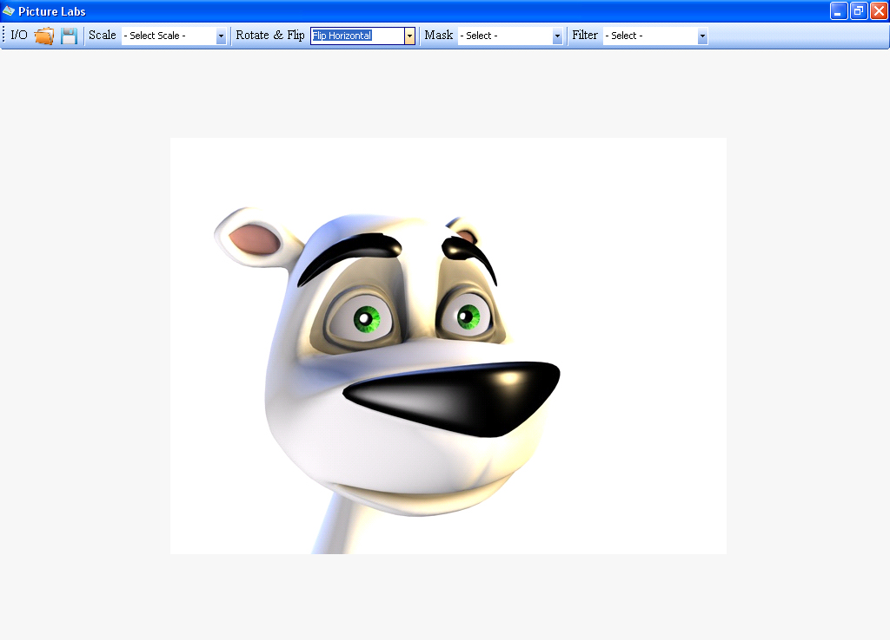

# Creating Your Own Windows Photo Viewer
## Requires
- Visual Studio 2008
## License
- Apache License, Version 2.0
## Technologies
- Windows Forms
- .NET Framework
- Windows General
## Topics
- Graphics and 3D
- How to
## Updated
- 08/28/2011
## Description

<h1>Introduction</h1>

<strong>Windows Photo Viewer</strong> is an image viewer developed by Microsoft that is included with the Windows 7. It was also included with Windows XP and Windows Server 2003 under the name of
<strong>Windows Picture and Fax Viewer</strong>. It was temporarily replaced with Windows Photo Gallery in Windows Vista, but has been reinstated in Windows 7. This program succeeds Imaging for Windows.

Windows Photo Viewer can show pictures, display all pictures in a folder as a slide show, reorient them in in 90&deg; increments, print them either directly or via an online print service, send them in e-mail or burn them to a
 disc. Windows Photo Viewer supports images in BMP, JPEG, JPEG XR (formerly HD Photo), PNG, ICO and TIFF file formats.

When compared to its previous version (Windows Fax and Picture Viewer), there have been several changes. The first and most noticeable change is seen in their user graphical user interfaces. The second change is their file format
 support: Although Animated GIF files were supported in Windows Picture and Fax Viewer, they are no longer supported in Windows Photo Viewer. Starting with Windows Vista, Microsoft withdrew the support for this format from this application and left the job
 of displaying them to Internet Explorer. Windows Picture and Fax Viewer was also capable of viewing multi-page TIFF files, (except those that employed JPEG compression) as well as annotating the TIFF files. Windows Photo Viewer, on the other hand, has added
 support for JPEG XR file format and ICC profiles.

&nbsp;

<h1 style="text-align:center">The Project</h1>
<h1 style="text-align:center">Photo Viewer</h1>

<em> 
</em>

&nbsp;

<h1>I/O</h1>

<em>Open And Save Image.</em> 

Centering Image

<em>You Will Learn How To Centering Image 
</em>

Zoom Control

<em>You will learn how to Zoom In or Zoom Out Picture</em>

<ul>
<li><em>50%</em> </li><li>100% </li><li>150% </li><li>200% </li><li>250% </li><li>... </li><li>400% </li></ul>

Rotate And Flip Control

<em>You will learn how to Rotate And Flip The Picture</em>

<em></em>

<ul>
<li><em>Flip Horizontal 
</em></li><li><em>Flip Vertical  
</em></li><li><em>Rotate 90 - 270 
</em></li></ul>
<h1>Mask Or Unmask</h1>

<em>You will learn how to Mask or Unmask a Picture.</em>

<em></em>

<ul>
<li><em>Blue Mask  
</em></li><li><em>Green Mask  
</em></li><li><em>Red Mask</em> </li></ul>
<h1>Image Filters</h1>

<em>You will learn about Image Filter For Your Photo Edit.</em>

<em>&nbsp;</em><em><em>.</em></em>

<ul>
<li><em><em>Grayscale</em></em> </li><li><em>Invert</em> </li><li><em>Gamma</em> </li><li><em>Contrast</em> </li><li><em>Brightness</em> </li></ul>

&nbsp;

<h1 style="text-align:center">Binary Packages For Microsoft Windows OS (All Version)</h1>

<a title="Download Paint-ProV1" href="http://www.kingdomvirtual.com/Paint-Pro.zip">Paint-Pro V1</a> 

&nbsp;

<h1 style="text-align:center">Free Wallpaper</h1>

 

 

