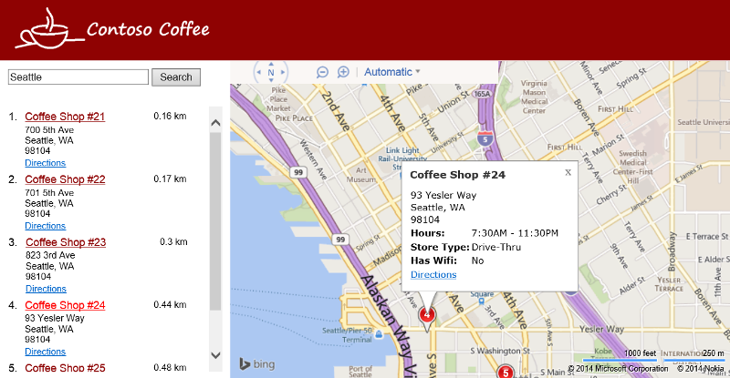

# Creating a Store Locator using Bing Maps
## Requires
- Visual Studio 2013
## License
- MS-LPL
## Technologies
- Bing Maps
## Topics
- Bing Maps
## Updated
- 10/02/2014
## Description

<h1>Introduction</h1>

In this code sample we are going to create a simple store locator using Bing Maps. Store locators are extremely common and a must for most businesses that sell directly to consumers. If you have only a couple of stores you may be able to get away with only
 showing an image of a map which shows the location of these store. However, if you have a chain of 5 or more stores, you really should have a store locator that has an interactive map as this will make it much easier for users to determine which store is most
 convenient for them to visit.

Store locators can be as simple or as complicated as you want it to be. In this code sample we will focus on creating a simple store locator. To keep things simple all the data for the locator is stored in the
<a href="http://msdn.microsoft.com/en-us/library/ff701734.aspx">Bing Spatial Data Services</a> and the application is self is written using HTML and JavaScript.

This code sample is for a blog post which you can find here [coming soon].

<h1>Description</h1>

To get the application to run you will need a Bing Maps Keys. If you do not have one you can find infromation on how to create on
<a href="http://www.microsoft.com/maps/create-a-bing-maps-key.aspx">here</a>. Once you have a BIng Maps key, open the Locator.js file and put your key where it says YOUR_BING_MAPS_KEY. Once this is done the application will be able to load Bing Maps and make
 queries against a data source of coffee shops that are in&nbsp;Seattle, San Antonia, San Diego and San Francisco

The following is a screenshot of the finished store locator.

