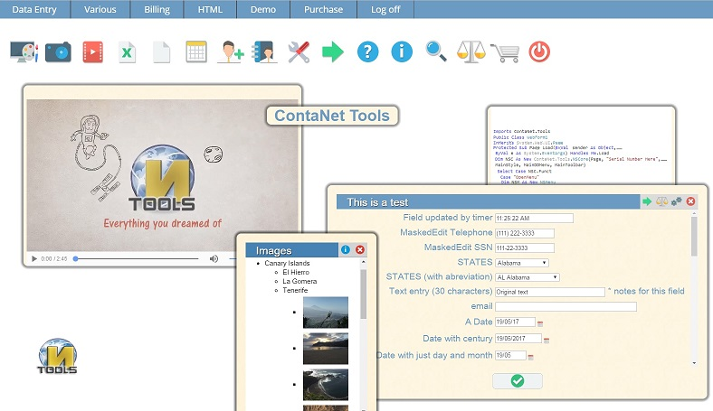

# Creating webapps with ASP.NET made easy - Contanettools
## Requires
- Visual Studio 2012
## License
- MS-LPL
## Technologies
- ASP.NET
- Visual Basic .NET
- Visual C Sharp .NET
## Topics
- Webpage Programming
## Updated
- 04/17/2018
## Description

<h1>Introduction</h1>

&nbsp;

ContanetTools makes programming a website easy. A website in which you can introduce media or data without having to use any kind of HTML, JavaScript or CSS. You program, the tools make it happen on the website. You must have
 ASP enabled in your Visual Studio.

&nbsp;

&nbsp;

<ul>
<li><em style="color:#339966; font-size:x-large">Popup menus</em><em style="color:#339966; font-size:x-large">&nbsp;</em>
</li></ul>
<ul>
<li><em style="color:#339966; font-size:x-large">Toolbars</em>
</li></ul>
<ul>
<li><em style="color:#339966; font-size:x-large">Grids</em>
</li></ul>
<ul>
<li><em style="color:#339966; font-size:x-large">Treeview</em>
</li></ul>
<ul>
<li><em style="color:#339966; font-size:x-large">Video</em>
</li></ul>
<ul>
<li><em style="color:#339966; font-size:x-large">Audio</em>
</li></ul>
<ul>
<li><em style="color:#339966; font-size:x-large">Reporting</em>
</li></ul>
<ul>
<li><em style="color:#339966; font-size:x-large">Calendar</em>
</li></ul>
<ul>
<li><em style="color:#339966; font-size:x-large">Calculator</em>
</li></ul>
<ul>
<li><em style="color:#339966; font-size:x-large">And more...</em>
</li></ul>

<em><strong style="font-size:large"> 
</strong></em>

<em> 
</em>

<h1>Building the Sample</h1>

 

Just download the demo or go to our website <a href="http://www.contanettools.com">
www.contanettools.com</a> and download the DLL. 

&nbsp;

The following link is a <a href="http://www.contanettools.com/presentation/video/how_to_do.mp4">
video</a> that explains how to build a website in <a href="http://www.contanettools.com/presentation/video/how_to_do.mp4">
less than 10 minutes</a>. 

&nbsp;

Feel free to check out the demo of what the tools can do on our website at
<a href="http://contanettools.cloudapp.net/demo/webform1.aspx">contanettools.cloudapp.net</a>.

&nbsp;

&nbsp;

&nbsp;

&nbsp;

Description

 

ContanetTools are a set of web app data entry tools that ease coding and provide simple solutions for time consuming problems. All contained in a simple Dynamic Link Library for VB.Net and C# coding.

&nbsp;

As programs move to cloud solutions and browser based projects, ContanetTools allows the creation and migration of desktop programs into webapps. They eliminate the need to learn HTML, CSS and JavaScript. If you know how
 to program in VB.Net or C# you can have a working program on HTML in minutes.

&nbsp;

<ul>
<li>Anyone familiar with Visual Studio can be up and running in no time.
</li></ul>
<ul>
<li>Provides ready to use tools that save hundreds of coding hours and solve many HTML related problems.
</li></ul>
<ul>
<li>Simple Type and prompts to fill in necessary fields.
</li></ul>
<ul>
<li>Dropdown menus, toolbars, grids, treeview, video, audio, reporting, etc.
</li></ul>
<ul>
<li>Popup menus with ready made validation for dates, numbers, lists, masked edit, you name it. The popup menus also allow personalized validation.
</li></ul>

 

 

