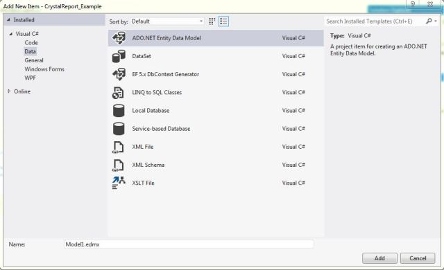
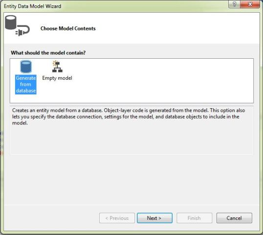
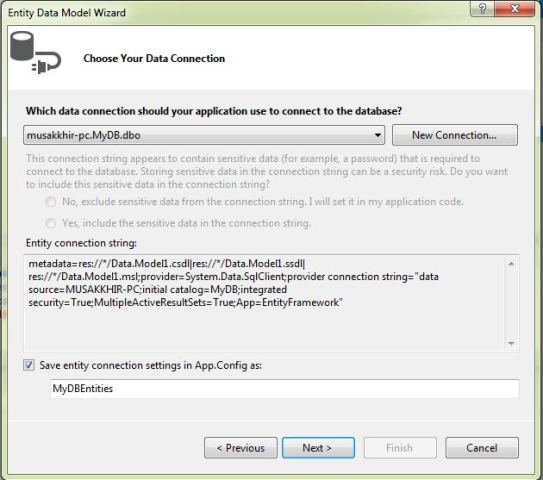
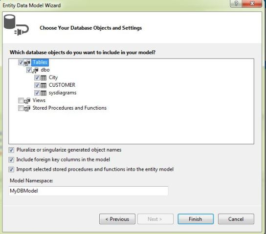
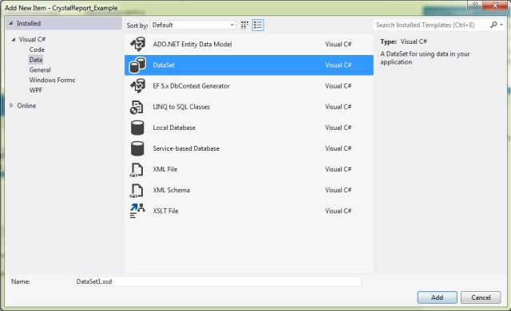
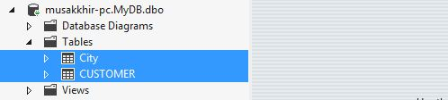
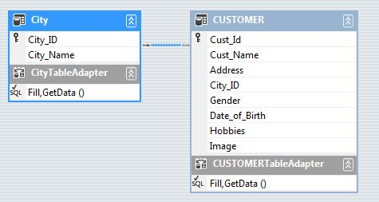
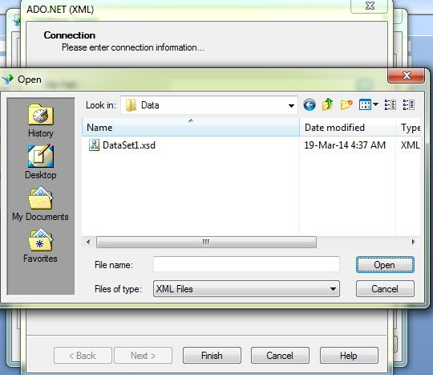
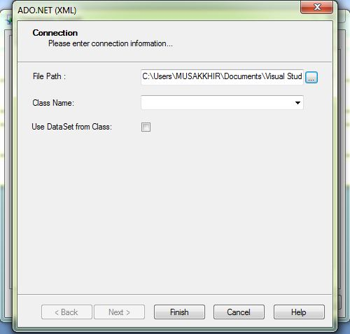
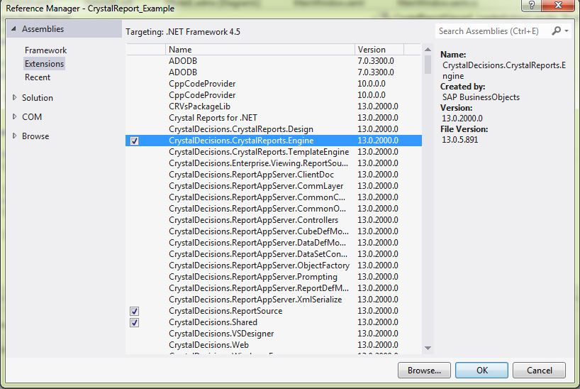

# Crystal Report in WPF with Entity Framework  using Visual Studio 2012
## Requires
- Visual Studio 2012
## License
- Apache License, Version 2.0
## Technologies
- SQL Server
- ADO.NET Entity Framework
- WPF
- SQL Server 2008 R2 Express Edition 64 bit
- Crystal Report
## Topics
- Crystal Report in WPF
- Crystal Report in Visual Studio 2012
- Crystal Report using .net framework 4.5
- Crystal report using datasource
- Crystal Report using Entity Framework
## Updated
- 03/18/2014
## Description

<h1>Introduction</h1>

WPF Crystal Reports using Entity Framework and DataSet

<em>Visual Studio 2012 For Desktop Application does not support directly by SAP Crystal Report.
 
</em>

<h1>Building the Sample</h1>

<em>Download the Supported Version for Visual Studio or .NET framework.</em>

<em>The Current Version of crystal reports supports .net framework 4.0. 
</em>

<em><a title="http://scn.sap.com/docs/DOC-7824" href="http://scn.sap.com/docs/DOC-7824">Download Here</a> 
</em>

Description

<em>This article describes how to create Crystal Reports in WPF using Entity Framework in visual studio 2012.
 
</em>

Follow the Steps.

1) Create New WPF Project.

2) Create Two New Folder Data and Report

If Crystal Report Viewer is not found in your Toolbox.

then follow the steps.

i) Right Click on Toolbox.

ii) Create Report Tab.

iii) Right Click in Report Tab select Choose Items.

iv) In WPF Component Tab choose Crystal Report Viewer for WPF

&nbsp;

&nbsp;

3) Create Entity Data Model in Data Folder.

<strong>4) Create DataSet in Data Folder.</strong>

<strong>5) Add Tables in Dataset.</strong>

<strong>6) Create Crystal Report in SAP Crystal Report.</strong>

<strong>7) Create Blank Report</strong>

<strong>8) In DataBase Expert Select ADO.NET (XML)</strong>

<strong> 
</strong>

<strong>9) Select the Dataset from Data folder from your current project.</strong>

<strong> 
</strong>

10) Select the Tables from DataSet.

Design Report as per your requirement.

11) Create New Window in Report Folder.

12) Drag and Drop Crystal Report Viewer from Toolbox.

XAML

Edit|Remove

xaml

<pre class="xaml">&lt;Window&nbsp;xmlns:Viewer=&quot;clr-namespace:SAPBusinessObjects.WPF.Viewer;assembly=SAPBusinessObjects.WPF.Viewer&quot;&nbsp;&nbsp;&nbsp;
&nbsp;&nbsp;&nbsp;&nbsp;&nbsp;&nbsp;&nbsp;&nbsp;x:Class=&quot;CrystalReport_Example.Report.Report&quot;&nbsp;
&nbsp;&nbsp;&nbsp;&nbsp;&nbsp;&nbsp;&nbsp;&nbsp;xmlns=&quot;http://schemas.microsoft.com/winfx/2006/xaml/presentation&quot;&nbsp;
&nbsp;&nbsp;&nbsp;&nbsp;&nbsp;&nbsp;&nbsp;&nbsp;xmlns:x=&quot;http://schemas.microsoft.com/winfx/2006/xaml&quot;&nbsp;
&nbsp;&nbsp;&nbsp;&nbsp;&nbsp;&nbsp;&nbsp;&nbsp;Title=&quot;Report&quot;&nbsp;Height=&quot;550&quot;&nbsp;Width=&quot;1024&quot;&gt;&nbsp;
&nbsp;&nbsp;&nbsp;&nbsp;&lt;Grid&gt;&nbsp;
&nbsp;&nbsp;&nbsp;&nbsp;&nbsp;&nbsp;&nbsp;&nbsp;&lt;Viewer:CrystalReportsViewer&nbsp;x:Name=&quot;CrystalReportViewer1&quot;&nbsp;Loaded=&quot;CrystalReportViewer1_Loaded&quot;&nbsp;/&gt;&nbsp;
&nbsp;&nbsp;&nbsp;&nbsp;&lt;/Grid&gt;&nbsp;
&lt;/Window&gt;&nbsp;
</pre>

&nbsp;Include Name Space in your Report.cs file.

C#

Edit|Remove

csharp

<pre class="csharp">using&nbsp;CrystalReport_Example.Data;&nbsp;
using&nbsp;CrystalDecisions.CrystalReports.Engine;&nbsp;
using&nbsp;CrystalDecisions.ReportSource;</pre>

Add Reference CrystalReports.Engine in your project.

&nbsp;

13) Write the following Code in App.config File.

&nbsp;

XAML

Edit|Remove

xaml

<pre class="xaml">&lt;startup&nbsp;useLegacyV2RuntimeActivationPolicy=&quot;true&quot;&gt;&nbsp;
&nbsp;&nbsp;&nbsp;&nbsp;&lt;supportedRuntime&nbsp;version=&quot;v4.0&quot;&nbsp;sku=&quot;.NETFramework,Version=v4.0&quot;/&gt;&nbsp;
&nbsp;&nbsp;&lt;/startup&gt;</pre>

&nbsp;

&nbsp;

<h1>Source Code Files</h1>
<ul>
<li><em>source code file name #1 - summary for this source code file.</em> </li><li><em><em>source code file name #2 - summary for this source code file.</em></em>
</li></ul>
<h1>More Information</h1>

<em>For more information on X, see ...?</em>

