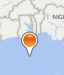
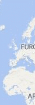
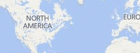
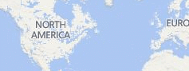
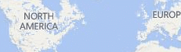

# Custom Animations in Bing Maps
## Requires
- Visual Studio 2013
## License
- MS-LPL
## Technologies
- C#
- Javascript
- Visual Basic .NET
- Bing Maps
- HTML5
- Windows Runtime
- Windows 8
- Windows Store app
- Windows 8.1
## Topics
- Animation
- Graphics
- C#
- XAML
- Javascript
- Visual Basic .NET
- Bing Maps
- Animations
- XAML Animation
- Windows Store app
## Updated
- 03/12/2017
## Description

<h1>Introduction</h1>

Bing Maps is a very powerful mapping platform that is often used for creating engaging user experiences. The fluid interactive maps make for a great canvas when visualizing location based data. In this code sample we are going to take a look at how to make
 the user experience a little more engaging by adding custom animations that can be used in both Bing Maps V7 and JavScript based Windows 8 Store apps.&nbsp;

This code sample is part of a series of blog posts:

<ul>
<li><a href="http://blogs.bing.com/maps/2014/08/07/bring-your-maps-to-life-creating-animations-with-bing-maps-javascript/">Bring Your Maps to Life: Creating Animations with Bing Maps (JavaScript)</a>
</li><li><a href="http://blogs.bing.com/maps/2014/09/25/part-2-bring-your-maps-to-life-creating-animations-with-bing-maps-net/">Part 2 &ndash; Bring your maps to life: Creating animations with Bing Maps (.NET)</a>
</li></ul>
<h1>Building the Sample</h1>

To run the samples you must install the <a href="http://visualstudiogallery.msdn.microsoft.com/224eb93a-ebc4-46ba-9be7-90ee777ad9e1">
Bing Maps SDK for Windows Store apps</a>&nbsp;and get a <a href="http://msdn.microsoft.com/en-us/library/ff428642.aspx">
Bing Maps key</a> for Windows Store apps. You must also have Windows 8.1 and Visual Studio 2013.

Any of the code samples that use Bing Maps will have a string, &ldquo;YOUR_BING_MAPS_KEY&rdquo;, in the code where you will need to specify your Bing Maps key.

If you are using Bing Maps in a C# or Visual Basic app you will need to perform the following steps for your app project to work correctly with Bing Maps.

<ul>
<li>Add a reference to&nbsp;Bing Maps SDK for C#, C&#43;&#43;, or Visual Basic if the reference isn&rsquo;t already there.
</li><li>Set the&nbsp;Active solution platform&nbsp;in Visual Studio to one of the following; ARM,&nbsp;x86&nbsp;or&nbsp;x64
</li><li>Add a reference to&nbsp;Microsoft Visual C&#43;&#43; Runtime Package. &nbsp;
<ul>
</ul>
</li></ul>

Description

This code sample shows how to create several different types of animations. Here is are some fo the animations that are included:

<table>
<tbody>
<tr>
<td>Scaling Pushpin when hovered</td>
<td>&nbsp;</td>
</tr>
<tr>
<td>Drop a Pushpin</td>
<td></td>
</tr>
<tr>
<td>Bounce a Pushpin</td>
<td> 
</td>
</tr>
<tr>
<td>Animate Pushpin along a straight line path</td>
<td></td>
</tr>
<tr>
<td>Animate Pushpin along a geodesic path</td>
<td></td>
</tr>
<tr>
<td>Animate the drawing of a straight line path</td>
<td></td>
</tr>
<tr>
<td>Animate the drawing of a geodesic path</td>
<td></td>
</tr>
</tbody>
</table>
