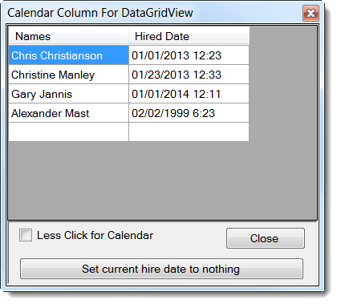

# Custom calendar column for a DataGridView
## Requires
- Visual Studio 2012
## License
- Apache License, Version 2.0
## Technologies
- Windows Desktop App Development
## Topics
- customization
## Updated
- 12/06/2013
## Description

<h1>Description</h1>

This article presents a custom column for a DataGridView control where the custom column base was created by used in a MSDN article How to:
<a href="http://msdn.microsoft.com/en-us/library/7tas5c80.aspx">Host Controls in Windows Forms DataGridView Cells</a>. In this article the custom column was hard coded to use the short date format which for the majority of times should be fine. What I did was
 added the ability to set the format to any valid date/time format. In the demonstration project I setup the custom column to include date and time via custom format 'MM/dd/yyyy H:mm'.

To allow the formatting to work correctly a new property was created named DateFormat which is displayed in the property window of a column selected via the chevron in the upper right corner of the DataGridView this column was
 added too. To allow this property to persist I needed to add an override to the Clone method of the column. In the custom cell for the column I pass the custom format for the column by casting OwningColumn of the cell to CalendarColumn which allows us to access
 the new property DateFormat which in turn sets custom format for the CalendarEditingControl which inherits from a DateTimePicker. In the CalendarEditingControl class the custom format is used in EditingControlFormattedValue property and function GetEditingControlFormattedValue.
 The only real hard coding in the above is that format is hard coded to custom yet I don't see this as a liability in that the classes here are meant to allow customizing rather than standard default formatting.

One last thing, the default value was set to Now which I saw as an issue if the DataGridView using these classes allows user's to add new rows. In this case you would see in the 'add row' today's date but by changing the default
 to DBNull.Value nothing appears in the last row.

See also <a href="http://code.msdn.microsoft.com/Show-and-edit-date-only-35444290">
Show and edit date only and time only in a DataGridView</a>.

