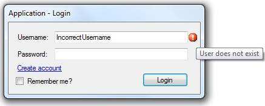

# basic login and register
## Requires
- Visual Studio 2010
## License
- MS-LPL
## Technologies
- Windows Forms
- .NET Framework
## Topics
- Authentication
- Authorization
## Updated
- 12/01/2011
## Description

<h1>Introduction</h1>

<em>This sample solves the folowing problem's</em>

<ol>
<li><em>It allowes you to make new user's</em> </li><li><em>It allowes you to login with newly or already existing user's and show the application</em>
</li><li><em>It allowes you to tell you if the username and/or password is incorrect with a errorprovider</em>
</li><li><em>It allowes you to remember the last entered username and password</em> </li><li><em>The password textbox is password-characters only that means you can't see the password only '*'</em>
</li></ol>

Picture:

<h1>Building the Sample</h1>

<em>Usefull to use System.IO it will spare some text to be typen, you need to use a directory that is write &amp; readable from the application else it won't work.</em>

Description

<em>You can make a new account the data will be saved in a text file in the same directory as the application executable file. The text file's name is 'username' &#43; '.txt' and the content is 'userpassword'. If you try to log in with a invalid username a errorprovider
 will show up next to the username textbox saying the username is worng, if the password is wrong then a errorprovider will show up at the password textbox. If you don't have a user account you can create one with clicking on make a new user. This will create
 a new textfile with the username and password</em>

<em>Below I will provide some <strong>code snippits</strong></em><strong><em>&nbsp;&nbsp;</em></strong>

&nbsp;

C#

Edit|Remove

csharp
<pre class="hidden">private void btnLogin_Click(object sender, EventArgs e)
        {
            //Create a new instance of you application form
            ApplicationForm app = new ApplicationForm();

            //Check if he needs to remember the username &amp; password
            if (Properties.Settings.Default.Remember == true)
            {
                //Saves the username and password to the project settings
                Settings.Default.Password = txtPassword.Text;
                Settings.Default.Username = txtUsername.Text;
                Settings.Default.Save();
            }

            //Checks if the user exist 'username' &#43; '.txt'
            if (!File.Exists(txtUsername.Text &#43; &quot;.txt&quot;))
            {
                //If not exists the set a error
                //NOTE: err = errorprovider
                err.SetError(txtUsername, &quot;User does not exist&quot;); //sets the error
            }
                // If it exists
            else 
            {
                //Clear the errors
                err.SetError(txtUsername, &quot;&quot;);
                err.SetError(txtPassword, &quot;&quot;);

                //Read the text file
                TextReader tr = new StreamReader(txtUsername.Text &#43; &quot;.txt&quot;);

                //Read the password wich is stored on the first line
                string pass = tr.ReadLine();

                //CHecks if the password equal to the password in the textbox
                if (pass == txtPassword.Text)
                {
                    //If so the show the app and hide this one
                    app.Show();
                    this.Hide();
                }
                    //Else
                else 
                {
                    //Show error
                    err.SetError(txtPassword, &quot;Incorrect password&quot;);
                }
            }      
        }

private void btnCreate_Click(object sender, EventArgs e)
        {
            //Creates a new text file 'username' &#43; '.txt'
            System.IO.TextWriter tw = new System.IO.StreamWriter(txtUsername.Text &#43; &quot;.txt&quot;);

            //Write the password on the first line
            tw.WriteLine(txtPassword.Text);

            //Closes &amp; disposes the textwriter
            tw.Close();
            tw.Dispose();

            //Close this form
            this.Close();
        }</pre>

<pre class="csharp">private&nbsp;void&nbsp;btnLogin_Click(object&nbsp;sender,&nbsp;EventArgs&nbsp;e)&nbsp;
&nbsp;&nbsp;&nbsp;&nbsp;&nbsp;&nbsp;&nbsp;&nbsp;{&nbsp;
&nbsp;&nbsp;&nbsp;&nbsp;&nbsp;&nbsp;&nbsp;&nbsp;&nbsp;&nbsp;&nbsp;&nbsp;//Create&nbsp;a&nbsp;new&nbsp;instance&nbsp;of&nbsp;you&nbsp;application&nbsp;form&nbsp;
&nbsp;&nbsp;&nbsp;&nbsp;&nbsp;&nbsp;&nbsp;&nbsp;&nbsp;&nbsp;&nbsp;&nbsp;ApplicationForm&nbsp;app&nbsp;=&nbsp;new&nbsp;ApplicationForm();&nbsp;
&nbsp;
&nbsp;&nbsp;&nbsp;&nbsp;&nbsp;&nbsp;&nbsp;&nbsp;&nbsp;&nbsp;&nbsp;&nbsp;//Check&nbsp;if&nbsp;he&nbsp;needs&nbsp;to&nbsp;remember&nbsp;the&nbsp;username&nbsp;&amp;&nbsp;password&nbsp;
&nbsp;&nbsp;&nbsp;&nbsp;&nbsp;&nbsp;&nbsp;&nbsp;&nbsp;&nbsp;&nbsp;&nbsp;if&nbsp;(Properties.Settings.Default.Remember&nbsp;==&nbsp;true)&nbsp;
&nbsp;&nbsp;&nbsp;&nbsp;&nbsp;&nbsp;&nbsp;&nbsp;&nbsp;&nbsp;&nbsp;&nbsp;{&nbsp;
&nbsp;&nbsp;&nbsp;&nbsp;&nbsp;&nbsp;&nbsp;&nbsp;&nbsp;&nbsp;&nbsp;&nbsp;&nbsp;&nbsp;&nbsp;&nbsp;//Saves&nbsp;the&nbsp;username&nbsp;and&nbsp;password&nbsp;to&nbsp;the&nbsp;project&nbsp;settings&nbsp;
&nbsp;&nbsp;&nbsp;&nbsp;&nbsp;&nbsp;&nbsp;&nbsp;&nbsp;&nbsp;&nbsp;&nbsp;&nbsp;&nbsp;&nbsp;&nbsp;Settings.Default.Password&nbsp;=&nbsp;txtPassword.Text;&nbsp;
&nbsp;&nbsp;&nbsp;&nbsp;&nbsp;&nbsp;&nbsp;&nbsp;&nbsp;&nbsp;&nbsp;&nbsp;&nbsp;&nbsp;&nbsp;&nbsp;Settings.Default.Username&nbsp;=&nbsp;txtUsername.Text;&nbsp;
&nbsp;&nbsp;&nbsp;&nbsp;&nbsp;&nbsp;&nbsp;&nbsp;&nbsp;&nbsp;&nbsp;&nbsp;&nbsp;&nbsp;&nbsp;&nbsp;Settings.Default.Save();&nbsp;
&nbsp;&nbsp;&nbsp;&nbsp;&nbsp;&nbsp;&nbsp;&nbsp;&nbsp;&nbsp;&nbsp;&nbsp;}&nbsp;
&nbsp;
&nbsp;&nbsp;&nbsp;&nbsp;&nbsp;&nbsp;&nbsp;&nbsp;&nbsp;&nbsp;&nbsp;&nbsp;//Checks&nbsp;if&nbsp;the&nbsp;user&nbsp;exist&nbsp;'username'&nbsp;&#43;&nbsp;'.txt'&nbsp;
&nbsp;&nbsp;&nbsp;&nbsp;&nbsp;&nbsp;&nbsp;&nbsp;&nbsp;&nbsp;&nbsp;&nbsp;if&nbsp;(!File.Exists(txtUsername.Text&nbsp;&#43;&nbsp;&quot;.txt&quot;))&nbsp;
&nbsp;&nbsp;&nbsp;&nbsp;&nbsp;&nbsp;&nbsp;&nbsp;&nbsp;&nbsp;&nbsp;&nbsp;{&nbsp;
&nbsp;&nbsp;&nbsp;&nbsp;&nbsp;&nbsp;&nbsp;&nbsp;&nbsp;&nbsp;&nbsp;&nbsp;&nbsp;&nbsp;&nbsp;&nbsp;//If&nbsp;not&nbsp;exists&nbsp;the&nbsp;set&nbsp;a&nbsp;error&nbsp;
&nbsp;&nbsp;&nbsp;&nbsp;&nbsp;&nbsp;&nbsp;&nbsp;&nbsp;&nbsp;&nbsp;&nbsp;&nbsp;&nbsp;&nbsp;&nbsp;//NOTE:&nbsp;err&nbsp;=&nbsp;errorprovider&nbsp;
&nbsp;&nbsp;&nbsp;&nbsp;&nbsp;&nbsp;&nbsp;&nbsp;&nbsp;&nbsp;&nbsp;&nbsp;&nbsp;&nbsp;&nbsp;&nbsp;err.SetError(txtUsername,&nbsp;&quot;User&nbsp;does&nbsp;not&nbsp;exist&quot;);&nbsp;//sets&nbsp;the&nbsp;error&nbsp;
&nbsp;&nbsp;&nbsp;&nbsp;&nbsp;&nbsp;&nbsp;&nbsp;&nbsp;&nbsp;&nbsp;&nbsp;}&nbsp;
&nbsp;&nbsp;&nbsp;&nbsp;&nbsp;&nbsp;&nbsp;&nbsp;&nbsp;&nbsp;&nbsp;&nbsp;&nbsp;&nbsp;&nbsp;&nbsp;//&nbsp;If&nbsp;it&nbsp;exists&nbsp;
&nbsp;&nbsp;&nbsp;&nbsp;&nbsp;&nbsp;&nbsp;&nbsp;&nbsp;&nbsp;&nbsp;&nbsp;else&nbsp;&nbsp;
&nbsp;&nbsp;&nbsp;&nbsp;&nbsp;&nbsp;&nbsp;&nbsp;&nbsp;&nbsp;&nbsp;&nbsp;{&nbsp;
&nbsp;&nbsp;&nbsp;&nbsp;&nbsp;&nbsp;&nbsp;&nbsp;&nbsp;&nbsp;&nbsp;&nbsp;&nbsp;&nbsp;&nbsp;&nbsp;//Clear&nbsp;the&nbsp;errors&nbsp;
&nbsp;&nbsp;&nbsp;&nbsp;&nbsp;&nbsp;&nbsp;&nbsp;&nbsp;&nbsp;&nbsp;&nbsp;&nbsp;&nbsp;&nbsp;&nbsp;err.SetError(txtUsername,&nbsp;&quot;&quot;);&nbsp;
&nbsp;&nbsp;&nbsp;&nbsp;&nbsp;&nbsp;&nbsp;&nbsp;&nbsp;&nbsp;&nbsp;&nbsp;&nbsp;&nbsp;&nbsp;&nbsp;err.SetError(txtPassword,&nbsp;&quot;&quot;);&nbsp;
&nbsp;
&nbsp;&nbsp;&nbsp;&nbsp;&nbsp;&nbsp;&nbsp;&nbsp;&nbsp;&nbsp;&nbsp;&nbsp;&nbsp;&nbsp;&nbsp;&nbsp;//Read&nbsp;the&nbsp;text&nbsp;file&nbsp;
&nbsp;&nbsp;&nbsp;&nbsp;&nbsp;&nbsp;&nbsp;&nbsp;&nbsp;&nbsp;&nbsp;&nbsp;&nbsp;&nbsp;&nbsp;&nbsp;TextReader&nbsp;tr&nbsp;=&nbsp;new&nbsp;StreamReader(txtUsername.Text&nbsp;&#43;&nbsp;&quot;.txt&quot;);&nbsp;
&nbsp;
&nbsp;&nbsp;&nbsp;&nbsp;&nbsp;&nbsp;&nbsp;&nbsp;&nbsp;&nbsp;&nbsp;&nbsp;&nbsp;&nbsp;&nbsp;&nbsp;//Read&nbsp;the&nbsp;password&nbsp;wich&nbsp;is&nbsp;stored&nbsp;on&nbsp;the&nbsp;first&nbsp;line&nbsp;
&nbsp;&nbsp;&nbsp;&nbsp;&nbsp;&nbsp;&nbsp;&nbsp;&nbsp;&nbsp;&nbsp;&nbsp;&nbsp;&nbsp;&nbsp;&nbsp;string&nbsp;pass&nbsp;=&nbsp;tr.ReadLine();&nbsp;
&nbsp;
&nbsp;&nbsp;&nbsp;&nbsp;&nbsp;&nbsp;&nbsp;&nbsp;&nbsp;&nbsp;&nbsp;&nbsp;&nbsp;&nbsp;&nbsp;&nbsp;//CHecks&nbsp;if&nbsp;the&nbsp;password&nbsp;equal&nbsp;to&nbsp;the&nbsp;password&nbsp;in&nbsp;the&nbsp;textbox&nbsp;
&nbsp;&nbsp;&nbsp;&nbsp;&nbsp;&nbsp;&nbsp;&nbsp;&nbsp;&nbsp;&nbsp;&nbsp;&nbsp;&nbsp;&nbsp;&nbsp;if&nbsp;(pass&nbsp;==&nbsp;txtPassword.Text)&nbsp;
&nbsp;&nbsp;&nbsp;&nbsp;&nbsp;&nbsp;&nbsp;&nbsp;&nbsp;&nbsp;&nbsp;&nbsp;&nbsp;&nbsp;&nbsp;&nbsp;{&nbsp;
&nbsp;&nbsp;&nbsp;&nbsp;&nbsp;&nbsp;&nbsp;&nbsp;&nbsp;&nbsp;&nbsp;&nbsp;&nbsp;&nbsp;&nbsp;&nbsp;&nbsp;&nbsp;&nbsp;&nbsp;//If&nbsp;so&nbsp;the&nbsp;show&nbsp;the&nbsp;app&nbsp;and&nbsp;hide&nbsp;this&nbsp;one&nbsp;
&nbsp;&nbsp;&nbsp;&nbsp;&nbsp;&nbsp;&nbsp;&nbsp;&nbsp;&nbsp;&nbsp;&nbsp;&nbsp;&nbsp;&nbsp;&nbsp;&nbsp;&nbsp;&nbsp;&nbsp;app.Show();&nbsp;
&nbsp;&nbsp;&nbsp;&nbsp;&nbsp;&nbsp;&nbsp;&nbsp;&nbsp;&nbsp;&nbsp;&nbsp;&nbsp;&nbsp;&nbsp;&nbsp;&nbsp;&nbsp;&nbsp;&nbsp;this.Hide();&nbsp;
&nbsp;&nbsp;&nbsp;&nbsp;&nbsp;&nbsp;&nbsp;&nbsp;&nbsp;&nbsp;&nbsp;&nbsp;&nbsp;&nbsp;&nbsp;&nbsp;}&nbsp;
&nbsp;&nbsp;&nbsp;&nbsp;&nbsp;&nbsp;&nbsp;&nbsp;&nbsp;&nbsp;&nbsp;&nbsp;&nbsp;&nbsp;&nbsp;&nbsp;&nbsp;&nbsp;&nbsp;&nbsp;//Else&nbsp;
&nbsp;&nbsp;&nbsp;&nbsp;&nbsp;&nbsp;&nbsp;&nbsp;&nbsp;&nbsp;&nbsp;&nbsp;&nbsp;&nbsp;&nbsp;&nbsp;else&nbsp;&nbsp;
&nbsp;&nbsp;&nbsp;&nbsp;&nbsp;&nbsp;&nbsp;&nbsp;&nbsp;&nbsp;&nbsp;&nbsp;&nbsp;&nbsp;&nbsp;&nbsp;{&nbsp;
&nbsp;&nbsp;&nbsp;&nbsp;&nbsp;&nbsp;&nbsp;&nbsp;&nbsp;&nbsp;&nbsp;&nbsp;&nbsp;&nbsp;&nbsp;&nbsp;&nbsp;&nbsp;&nbsp;&nbsp;//Show&nbsp;error&nbsp;
&nbsp;&nbsp;&nbsp;&nbsp;&nbsp;&nbsp;&nbsp;&nbsp;&nbsp;&nbsp;&nbsp;&nbsp;&nbsp;&nbsp;&nbsp;&nbsp;&nbsp;&nbsp;&nbsp;&nbsp;err.SetError(txtPassword,&nbsp;&quot;Incorrect&nbsp;password&quot;);&nbsp;
&nbsp;&nbsp;&nbsp;&nbsp;&nbsp;&nbsp;&nbsp;&nbsp;&nbsp;&nbsp;&nbsp;&nbsp;&nbsp;&nbsp;&nbsp;&nbsp;}&nbsp;
&nbsp;&nbsp;&nbsp;&nbsp;&nbsp;&nbsp;&nbsp;&nbsp;&nbsp;&nbsp;&nbsp;&nbsp;}&nbsp;&nbsp;&nbsp;&nbsp;&nbsp;&nbsp;&nbsp;
&nbsp;&nbsp;&nbsp;&nbsp;&nbsp;&nbsp;&nbsp;&nbsp;}&nbsp;
&nbsp;
private&nbsp;void&nbsp;btnCreate_Click(object&nbsp;sender,&nbsp;EventArgs&nbsp;e)&nbsp;
&nbsp;&nbsp;&nbsp;&nbsp;&nbsp;&nbsp;&nbsp;&nbsp;{&nbsp;
&nbsp;&nbsp;&nbsp;&nbsp;&nbsp;&nbsp;&nbsp;&nbsp;&nbsp;&nbsp;&nbsp;&nbsp;//Creates&nbsp;a&nbsp;new&nbsp;text&nbsp;file&nbsp;'username'&nbsp;&#43;&nbsp;'.txt'&nbsp;
&nbsp;&nbsp;&nbsp;&nbsp;&nbsp;&nbsp;&nbsp;&nbsp;&nbsp;&nbsp;&nbsp;&nbsp;System.IO.TextWriter&nbsp;tw&nbsp;=&nbsp;new&nbsp;System.IO.StreamWriter(txtUsername.Text&nbsp;&#43;&nbsp;&quot;.txt&quot;);&nbsp;
&nbsp;
&nbsp;&nbsp;&nbsp;&nbsp;&nbsp;&nbsp;&nbsp;&nbsp;&nbsp;&nbsp;&nbsp;&nbsp;//Write&nbsp;the&nbsp;password&nbsp;on&nbsp;the&nbsp;first&nbsp;line&nbsp;
&nbsp;&nbsp;&nbsp;&nbsp;&nbsp;&nbsp;&nbsp;&nbsp;&nbsp;&nbsp;&nbsp;&nbsp;tw.WriteLine(txtPassword.Text);&nbsp;
&nbsp;
&nbsp;&nbsp;&nbsp;&nbsp;&nbsp;&nbsp;&nbsp;&nbsp;&nbsp;&nbsp;&nbsp;&nbsp;//Closes&nbsp;&amp;&nbsp;disposes&nbsp;the&nbsp;textwriter&nbsp;
&nbsp;&nbsp;&nbsp;&nbsp;&nbsp;&nbsp;&nbsp;&nbsp;&nbsp;&nbsp;&nbsp;&nbsp;tw.Close();&nbsp;
&nbsp;&nbsp;&nbsp;&nbsp;&nbsp;&nbsp;&nbsp;&nbsp;&nbsp;&nbsp;&nbsp;&nbsp;tw.Dispose();&nbsp;
&nbsp;
&nbsp;&nbsp;&nbsp;&nbsp;&nbsp;&nbsp;&nbsp;&nbsp;&nbsp;&nbsp;&nbsp;&nbsp;//Close&nbsp;this&nbsp;form&nbsp;
&nbsp;&nbsp;&nbsp;&nbsp;&nbsp;&nbsp;&nbsp;&nbsp;&nbsp;&nbsp;&nbsp;&nbsp;this.Close();&nbsp;
&nbsp;&nbsp;&nbsp;&nbsp;&nbsp;&nbsp;&nbsp;&nbsp;}</pre>

