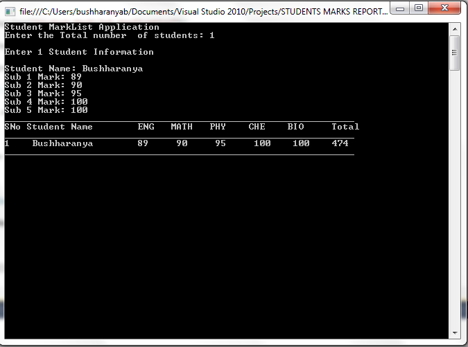

# console application in C# for Beginners
## Requires
- Visual Studio 2010
## License
- Apache License, Version 2.0
## Technologies
- .NET Framework
## Topics
- Getting Started
- Console Applications
## Updated
- 07/27/2012
## Description

<h1>Introduction</h1>

In the early 1970s the creators of the C&nbsp;<a id="KonaLink1" class="kLink" href="http://www.techotopia.com/index.php/A_Simple_C_Sharp_Console_Application#" style="text-decoration:underline!important; position:static; font-family:inherit!important; font-weight:inherit!important; font-size:inherit!important">&nbsp;</a>
 wrote a book of the same name intended to teach the skills necessary to program in C. One of the first chapters of this book contained a very simple C program which displayed the words &quot;Hello World&quot; in a console. Ever since that day most programming books
 have followed this tradition. Given that C# can trace its ancestry to the c programming language,C# essentials will be no exception to this rule.

Even if you are an experienced develpoer this simple C# example is still recommended if only to verify that the C# environment of development is correctly installed.

Even an example this simple requires that certain aspects of the C# and the environment will be runtime environment<a id="KonaLink5" class="kLink" href="http://www.techotopia.com/index.php/A_Simple_C_Sharp_Console_Application#" style="text-decoration:underline!important; position:static; font-family:inherit!important; font-weight:inherit!important; font-size:inherit!important">&nbsp;</a>
 that will be set up. Before we plunge into the example, therefore, we first need to spend a little time talking about setting up the environment.

This application will be very userful for beginners who start learning the c# console application.

&nbsp;

<em>This is a Student marklist Report.Through this we can specify number of students and their mark details.Finally,we can view the Grand total with the Report.The user must enter the total number of students then Enter number of student's mark information.Then
 give Student Name subject1 that will be English mark,then subject2 will be the Maths mark,the subject 3 will be physics mark,subject 4 will be chemistry mark,subject 5 will be biology mark...then when we enter the entire report will be spooled by calculating
 the total value. 
</em>

<h1>Building the Sample</h1>

 

<em>&nbsp;</em>

Description

&nbsp;

&nbsp;

C#

Edit|Remove

csharp

<pre class="csharp">#&nbsp;region&nbsp;&quot;Namespaces&quot;&nbsp;&nbsp;
using&nbsp;System;&nbsp;
using&nbsp;<a class="libraryLink" href="http://msdn.microsoft.com/en-US/library/System.Collections.Generic.aspx" target="_blank" title="Auto generated link to System.Collections.Generic">System.Collections.Generic</a>;&nbsp;
using&nbsp;<a class="libraryLink" href="http://msdn.microsoft.com/en-US/library/System.Linq.aspx" target="_blank" title="Auto generated link to System.Linq">System.Linq</a>;&nbsp;
using&nbsp;<a class="libraryLink" href="http://msdn.microsoft.com/en-US/library/System.Text.aspx" target="_blank" title="Auto generated link to System.Text">System.Text</a>;&nbsp;
using&nbsp;<a class="libraryLink" href="http://msdn.microsoft.com/en-US/library/System.Runtime.InteropServices.aspx" target="_blank" title="Auto generated link to System.Runtime.InteropServices">System.Runtime.InteropServices</a>;&nbsp;
//This&nbsp;is&nbsp;the&nbsp;namespace&nbsp;provides&nbsp;a&nbsp;wide&nbsp;variety&nbsp;of&nbsp;members&nbsp;that&nbsp;support&nbsp;COM&nbsp;interop&nbsp;and&nbsp;platform&nbsp;invoke&nbsp;services&nbsp;
&nbsp;
#&nbsp;endregion&nbsp;
&nbsp;
namespace&nbsp;STUDENTS_MARKS_REPORT&nbsp;
{&nbsp;
#&nbsp;region&nbsp;&quot;Class&nbsp;to&nbsp;get&nbsp;student&nbsp;Details&quot;&nbsp;&nbsp;
&nbsp;class&nbsp;CStudentDetails&nbsp;//class&nbsp;for&nbsp;Declarations&nbsp;
&nbsp;&nbsp;&nbsp;&nbsp;&nbsp;&nbsp;&nbsp;&nbsp;
&nbsp;&nbsp;&nbsp;&nbsp;{&nbsp;
&nbsp;
&nbsp;&nbsp;&nbsp;&nbsp;&nbsp;&nbsp;&nbsp;&nbsp;public&nbsp;string&nbsp;studentname;&nbsp;
&nbsp;
&nbsp;&nbsp;&nbsp;&nbsp;&nbsp;&nbsp;&nbsp;&nbsp;public&nbsp;int[]&nbsp;studentmarks&nbsp;=&nbsp;new&nbsp;int[5];&nbsp;
&nbsp;
&nbsp;&nbsp;&nbsp;&nbsp;&nbsp;&nbsp;&nbsp;&nbsp;public&nbsp;int&nbsp;totalmarks;&nbsp;
&nbsp;
&nbsp;&nbsp;&nbsp;&nbsp;}&nbsp;
&nbsp;
#&nbsp;endregion&nbsp;
&nbsp;
&nbsp;&nbsp;&nbsp;#&nbsp;region&nbsp;&quot;Class&nbsp;that&nbsp;adds&nbsp;record&quot;&nbsp;&nbsp;
&nbsp;&nbsp;&nbsp;&nbsp;class&nbsp;CStudents&nbsp;
&nbsp;&nbsp;&nbsp;&nbsp;{&nbsp;
&nbsp;
&nbsp;&nbsp;&nbsp;&nbsp;&nbsp;&nbsp;&nbsp;&nbsp;public&nbsp;List&lt;CStudentDetails&gt;&nbsp;studList&nbsp;=&nbsp;new&nbsp;List&lt;CStudentDetails&gt;();&nbsp;
&nbsp;
&nbsp;&nbsp;&nbsp;&nbsp;&nbsp;&nbsp;&nbsp;&nbsp;//This&nbsp;list&nbsp;contains&nbsp;the&nbsp;student&nbsp;list&nbsp;
&nbsp;
&nbsp;&nbsp;&nbsp;&nbsp;&nbsp;&nbsp;&nbsp;&nbsp;public&nbsp;int&nbsp;MaxStudents;&nbsp;
&nbsp;
&nbsp;
&nbsp;#region&nbsp;&quot;Function&nbsp;that&nbsp;adds&nbsp;record&quot;&nbsp;&nbsp;
&nbsp;&nbsp;&nbsp;&nbsp;&nbsp;&nbsp;&nbsp;&nbsp;//This&nbsp;Function&nbsp;Adds&nbsp;the&nbsp;Record&nbsp;
&nbsp;&nbsp;&nbsp;&nbsp;&nbsp;&nbsp;&nbsp;&nbsp;public&nbsp;int&nbsp;AddRecord(string&nbsp;name,&nbsp;int[]&nbsp;marks)&nbsp;
&nbsp;&nbsp;&nbsp;&nbsp;&nbsp;&nbsp;&nbsp;&nbsp;{&nbsp;
&nbsp;
&nbsp;&nbsp;&nbsp;&nbsp;&nbsp;&nbsp;&nbsp;&nbsp;&nbsp;&nbsp;&nbsp;&nbsp;CStudentDetails&nbsp;stud&nbsp;=&nbsp;new&nbsp;CStudentDetails();&nbsp;
&nbsp;
&nbsp;&nbsp;&nbsp;&nbsp;&nbsp;&nbsp;&nbsp;&nbsp;&nbsp;&nbsp;&nbsp;&nbsp;stud.studentname&nbsp;=&nbsp;name;&nbsp;
&nbsp;
&nbsp;&nbsp;&nbsp;&nbsp;&nbsp;&nbsp;&nbsp;&nbsp;&nbsp;&nbsp;&nbsp;&nbsp;stud.studentmarks&nbsp;=&nbsp;marks;&nbsp;
&nbsp;
&nbsp;&nbsp;&nbsp;&nbsp;&nbsp;&nbsp;&nbsp;&nbsp;&nbsp;&nbsp;&nbsp;&nbsp;stud.totalmarks&nbsp;=&nbsp;0;&nbsp;
&nbsp;
&nbsp;&nbsp;&nbsp;&nbsp;&nbsp;&nbsp;&nbsp;&nbsp;&nbsp;&nbsp;&nbsp;&nbsp;for&nbsp;(int&nbsp;i&nbsp;=&nbsp;0;&nbsp;i&nbsp;&lt;&nbsp;5;&nbsp;i&#43;&#43;)&nbsp;
&nbsp;
&nbsp;&nbsp;&nbsp;&nbsp;&nbsp;&nbsp;&nbsp;&nbsp;&nbsp;&nbsp;&nbsp;&nbsp;&nbsp;&nbsp;&nbsp;&nbsp;stud.totalmarks&nbsp;&#43;=&nbsp;stud.studentmarks[i];&nbsp;
&nbsp;
&nbsp;&nbsp;&nbsp;&nbsp;&nbsp;&nbsp;&nbsp;&nbsp;&nbsp;&nbsp;&nbsp;&nbsp;studList.Add(stud);&nbsp;
&nbsp;
&nbsp;&nbsp;&nbsp;&nbsp;&nbsp;&nbsp;&nbsp;&nbsp;&nbsp;&nbsp;&nbsp;&nbsp;MaxStudents&nbsp;=&nbsp;studList.Count;&nbsp;
&nbsp;
&nbsp;&nbsp;&nbsp;&nbsp;&nbsp;&nbsp;&nbsp;&nbsp;&nbsp;&nbsp;&nbsp;&nbsp;return&nbsp;1;&nbsp;
&nbsp;
&nbsp;&nbsp;&nbsp;&nbsp;&nbsp;&nbsp;&nbsp;&nbsp;}&nbsp;
#endregion&nbsp;
&nbsp;
&nbsp;&nbsp;&nbsp;&nbsp;}&nbsp;
&nbsp;
&nbsp;
&nbsp;
&nbsp;&nbsp;class&nbsp;Program&nbsp;
&nbsp;
&nbsp;{&nbsp;
&nbsp;
&nbsp;&nbsp;
&nbsp;
static&nbsp;public&nbsp;CStudents&nbsp;theStudents&nbsp;=&nbsp;new&nbsp;CStudents();&nbsp;
&nbsp;
&nbsp;
&nbsp;
#&nbsp;region&nbsp;Method&nbsp;to&nbsp;view&nbsp;Records&nbsp;&nbsp;
&nbsp;&nbsp;&nbsp;&nbsp;&nbsp;&nbsp;//This&nbsp;method&nbsp;is&nbsp;to&nbsp;view&nbsp;Records&nbsp;as&nbsp;Report&nbsp;
&nbsp;
static&nbsp;public&nbsp;void&nbsp;ViewRecords()&nbsp;
{&nbsp;
&nbsp;
&nbsp;
&nbsp;
&nbsp;&nbsp;&nbsp;&nbsp;Console.WriteLine(&quot;_______________________________________________________________&quot;);&nbsp;
&nbsp;
&nbsp;
&nbsp;
&nbsp;&nbsp;&nbsp;&nbsp;Console.WriteLine(&quot;SNo&nbsp;Student&nbsp;Name&nbsp;&nbsp;&nbsp;&nbsp;&nbsp;&nbsp;&nbsp;&nbsp;ENG&nbsp;&nbsp;&nbsp;MATH&nbsp;&nbsp;&nbsp;PHY&nbsp;&nbsp;&nbsp;&nbsp;CHE&nbsp;&nbsp;&nbsp;&nbsp;BIO&nbsp;&nbsp;&nbsp;&nbsp;&nbsp;Total&quot;);&nbsp;
&nbsp;
&nbsp;&nbsp;&nbsp;&nbsp;Console.WriteLine(&quot;_______________________________________________________________&quot;);&nbsp;
&nbsp;
&nbsp;
&nbsp;
&nbsp;&nbsp;&nbsp;&nbsp;for&nbsp;(int&nbsp;i&nbsp;=&nbsp;0;&nbsp;i&nbsp;&lt;&nbsp;theStudents.MaxStudents;&nbsp;i&#43;&#43;)&nbsp;
&nbsp;&nbsp;&nbsp;&nbsp;{&nbsp;
&nbsp;
&nbsp;&nbsp;&nbsp;&nbsp;&nbsp;&nbsp;&nbsp;&nbsp;Console.Write(&quot;{0,&nbsp;-5}&quot;,&nbsp;i&nbsp;&#43;&nbsp;1);&nbsp;
&nbsp;
&nbsp;&nbsp;&nbsp;&nbsp;&nbsp;&nbsp;&nbsp;&nbsp;Console.Write(&quot;{0,&nbsp;-19}&quot;,&nbsp;theStudents.studList[i].studentname);&nbsp;
&nbsp;
&nbsp;&nbsp;&nbsp;&nbsp;&nbsp;&nbsp;&nbsp;&nbsp;Console.Write(&quot;{0,&nbsp;-7}&quot;,&nbsp;theStudents.studList[i].studentmarks[0]);&nbsp;
&nbsp;
&nbsp;&nbsp;&nbsp;&nbsp;&nbsp;&nbsp;&nbsp;&nbsp;Console.Write(&quot;{0,&nbsp;-7}&quot;,&nbsp;theStudents.studList[i].studentmarks[1]);&nbsp;
&nbsp;
&nbsp;&nbsp;&nbsp;&nbsp;&nbsp;&nbsp;&nbsp;&nbsp;Console.Write(&quot;{0,&nbsp;-7}&quot;,&nbsp;theStudents.studList[i].studentmarks[2]);&nbsp;
&nbsp;
&nbsp;&nbsp;&nbsp;&nbsp;&nbsp;&nbsp;&nbsp;&nbsp;Console.Write(&quot;{0,&nbsp;-7}&quot;,&nbsp;theStudents.studList[i].studentmarks[3]);&nbsp;
&nbsp;
&nbsp;&nbsp;&nbsp;&nbsp;&nbsp;&nbsp;&nbsp;&nbsp;Console.Write(&quot;{0,&nbsp;-7}&quot;,&nbsp;theStudents.studList[i].studentmarks[4]);&nbsp;
&nbsp;
&nbsp;&nbsp;&nbsp;&nbsp;&nbsp;&nbsp;&nbsp;&nbsp;Console.Write(&quot;{0,&nbsp;-7}&quot;,&nbsp;theStudents.studList[i].totalmarks);&nbsp;
&nbsp;
&nbsp;&nbsp;&nbsp;&nbsp;&nbsp;&nbsp;&nbsp;&nbsp;Console.WriteLine();&nbsp;
&nbsp;
&nbsp;&nbsp;&nbsp;&nbsp;}&nbsp;
&nbsp;&nbsp;&nbsp;&nbsp;
&nbsp;&nbsp;&nbsp;&nbsp;Console.WriteLine(&quot;_______________________________________________________________&quot;);&nbsp;
&nbsp;
}&nbsp;
#endregion&nbsp;
&nbsp;
static&nbsp;public&nbsp;void&nbsp;InputRecords()&nbsp;
&nbsp;
{&nbsp;&nbsp;&nbsp;&nbsp;
&nbsp;
&nbsp;&nbsp;&nbsp;&nbsp;&nbsp;&nbsp;Console.Write(&quot;Student&nbsp;Name:&nbsp;&quot;);&nbsp;
&nbsp;
&nbsp;&nbsp;&nbsp;&nbsp;&nbsp;&nbsp;string&nbsp;name;&nbsp;
&nbsp;
&nbsp;&nbsp;&nbsp;&nbsp;&nbsp;&nbsp;int[]&nbsp;marks&nbsp;=&nbsp;new&nbsp;int[5];&nbsp;
&nbsp;
&nbsp;&nbsp;&nbsp;&nbsp;&nbsp;&nbsp;name&nbsp;=&nbsp;Console.ReadLine();&nbsp;
&nbsp;
&nbsp;&nbsp;
&nbsp;
&nbsp;&nbsp;&nbsp;&nbsp;&nbsp;&nbsp;for(int&nbsp;i&nbsp;=&nbsp;1;&nbsp;i&nbsp;&lt;=&nbsp;5;&nbsp;i&#43;&#43;)&nbsp;
&nbsp;
&nbsp;&nbsp;&nbsp;&nbsp;&nbsp;&nbsp;{&nbsp;
&nbsp;
&nbsp;&nbsp;&nbsp;&nbsp;&nbsp;&nbsp;&nbsp;&nbsp;&nbsp;&nbsp;&nbsp;&nbsp;Console.Write(&quot;Sub&nbsp;&quot;&nbsp;&#43;&nbsp;i.ToString()&nbsp;&#43;&nbsp;&quot;&nbsp;Mark:&nbsp;&quot;);&nbsp;
&nbsp;
&nbsp;&nbsp;&nbsp;&nbsp;&nbsp;&nbsp;&nbsp;&nbsp;&nbsp;&nbsp;&nbsp;&nbsp;marks[i-1]&nbsp;=&nbsp;Convert.ToInt32(Console.ReadLine());&nbsp;
&nbsp;
&nbsp;&nbsp;&nbsp;&nbsp;&nbsp;&nbsp;}&nbsp;
&nbsp;
&nbsp;&nbsp;&nbsp;&nbsp;&nbsp;&nbsp;theStudents.AddRecord(name,&nbsp;marks);&nbsp;
&nbsp;
}&nbsp;&nbsp;&nbsp;&nbsp;&nbsp;&nbsp;&nbsp;&nbsp;
&nbsp;
&nbsp;&nbsp;
&nbsp;
static&nbsp;void&nbsp;Main(string[]&nbsp;args)&nbsp;
&nbsp;
{&nbsp;
&nbsp;
&nbsp;&nbsp;
&nbsp;
&nbsp;&nbsp;&nbsp;&nbsp;&nbsp;&nbsp;Console.WriteLine(&quot;Student&nbsp;MarkList&nbsp;Application&quot;);&nbsp;
&nbsp;
&nbsp;&nbsp;&nbsp;&nbsp;&nbsp;&nbsp;Console.Write(&quot;Enter&nbsp;the&nbsp;Total&nbsp;number&nbsp;&nbsp;of&nbsp;students:&nbsp;&quot;);&nbsp;
&nbsp;
&nbsp;&nbsp;&nbsp;&nbsp;&nbsp;&nbsp;int&nbsp;numStudents&nbsp;=&nbsp;-1;&nbsp;
&nbsp;
&nbsp;&nbsp;&nbsp;&nbsp;&nbsp;&nbsp;string&nbsp;s&nbsp;=&nbsp;Console.ReadLine();&nbsp;
&nbsp;
&nbsp;&nbsp;&nbsp;&nbsp;&nbsp;&nbsp;numStudents&nbsp;=&nbsp;Convert.ToInt32(s);&nbsp;
&nbsp;
&nbsp;&nbsp;
&nbsp;
&nbsp;&nbsp;&nbsp;&nbsp;&nbsp;&nbsp;for&nbsp;(int&nbsp;i&nbsp;=&nbsp;1;&nbsp;i&nbsp;&lt;=&nbsp;numStudents;&nbsp;i&#43;&#43;)&nbsp;
&nbsp;
&nbsp;&nbsp;&nbsp;&nbsp;&nbsp;&nbsp;{&nbsp;
&nbsp;
&nbsp;&nbsp;&nbsp;&nbsp;&nbsp;&nbsp;&nbsp;&nbsp;&nbsp;&nbsp;&nbsp;&nbsp;Console.WriteLine(&quot;\nEnter&nbsp;&quot;&nbsp;&#43;&nbsp;i.ToString()&nbsp;&#43;&nbsp;&quot;&nbsp;Student&nbsp;Information\n&quot;);&nbsp;
&nbsp;
&nbsp;&nbsp;&nbsp;&nbsp;&nbsp;&nbsp;&nbsp;&nbsp;&nbsp;&nbsp;&nbsp;&nbsp;InputRecords();&nbsp;
&nbsp;
&nbsp;&nbsp;&nbsp;&nbsp;&nbsp;&nbsp;}&nbsp;
&nbsp;
&nbsp;&nbsp;&nbsp;&nbsp;&nbsp;&nbsp;ViewRecords();&nbsp;
&nbsp;
&nbsp;&nbsp;&nbsp;&nbsp;&nbsp;&nbsp;char&nbsp;ch&nbsp;=&nbsp;Console.ReadKey().KeyChar;&nbsp;
&nbsp;
}&nbsp;
&nbsp;
}&nbsp;
&nbsp;
&nbsp;&nbsp;&nbsp;
}&nbsp;
&nbsp;
&nbsp;
&nbsp;
&nbsp;&nbsp;&nbsp;#&nbsp;endregionClick&nbsp;here&nbsp;to&nbsp;add&nbsp;your&nbsp;code&nbsp;snippet.</pre>

<h1>Source Code Files</h1>

 

<h1>More Information</h1>

<em></em>

